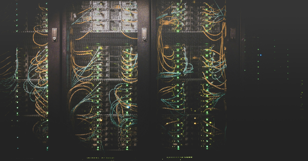

<!-- _paginate: false -->

# CS 312: System Administration

Alex Ulbrich

---

# What is System Administration?

- Sysadmin, DevOps, and SRE: different labels, shared mission, keeping systems reliable, secure, and changeable
- Provisioning and configuration:
- Networking: addressing, routing, DNS, DHCP, and VLANs
- Automation: reduce toil and prevent drift
- Backups and recovery: define how much data loss and downtime are acceptable
- Observability: alerts that matter to users
- Security: least privilege, timely patching, key-based SSH, deny-by-default firewalls
- Incident response: stabilize, communicate, capture evidence, then diagnose

---

# About CS 312

- Mostly hands-on lectures
- WordPress for Pinnacle Provisions: 9 labs
- Minecraft Ops for Obsidian Dynamics: 5 assignments
- In-class activities and quizzes
- Labs and assignments → AWS Academy + (optional) GitHub Classroom

---

# About Me

- Mathematical Engineer
- Computer Science Instructor since January 2023
- Teaching: CS46X, CS312, ENGR103, some CS362
- Previously
  - Product Manager for a simulation neuroscience organization
  - Head of Product and Engineering for a home repair coordination company
  - Software Engineer, Data Engineer and Scientist for an insurance company

---

# SysAdmin Experience?

- First SysAdmin project: World of Wacraft private server for my friends in high school
- First student job: sysadmin for a small import/export company (throughout college)
- I worked with Windows SysAdmins for the biggest insurance company in Belgium to deploy data analytics solutions (Neoj4j, SAS, Elasticsearch, etc.)
- My previous job involved running [a data platform on a Kubernetes cluster on OpenShift](https://bluebrainnexus.io/docs/running-nexus/index.html) + running jobs on a supercomputer (both on-premises) (Kubernetes, Helm, Prometheus, Grafana, Kibana, OpenShift, Slurm)
- I administer a Microsoft 365 tenant / Exchange server for a lawer's office in Belgium
- I manage my own stack for my course textbooks and many side projects (mostly Cloudflare + Vercel + Supabase, and AWS for Capstone)
