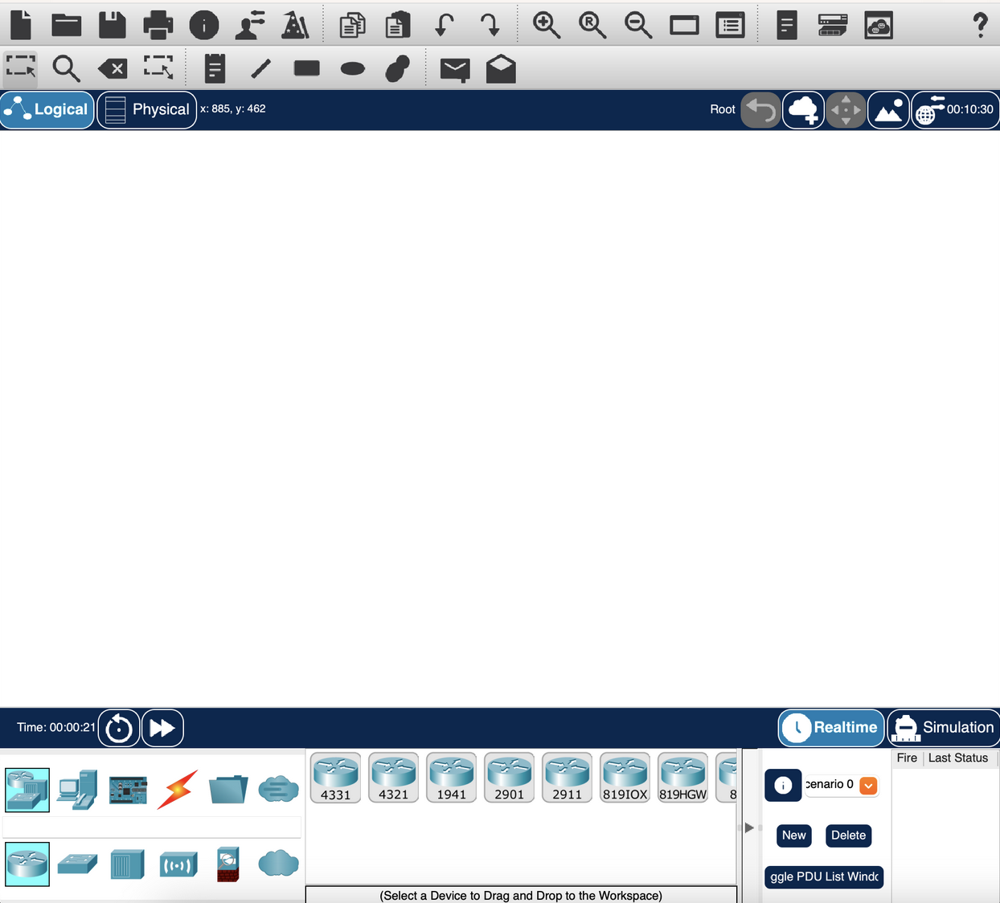
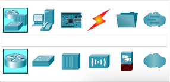
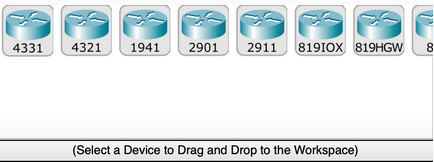
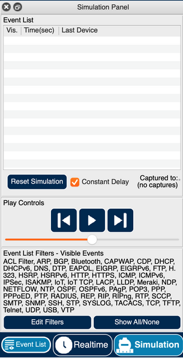
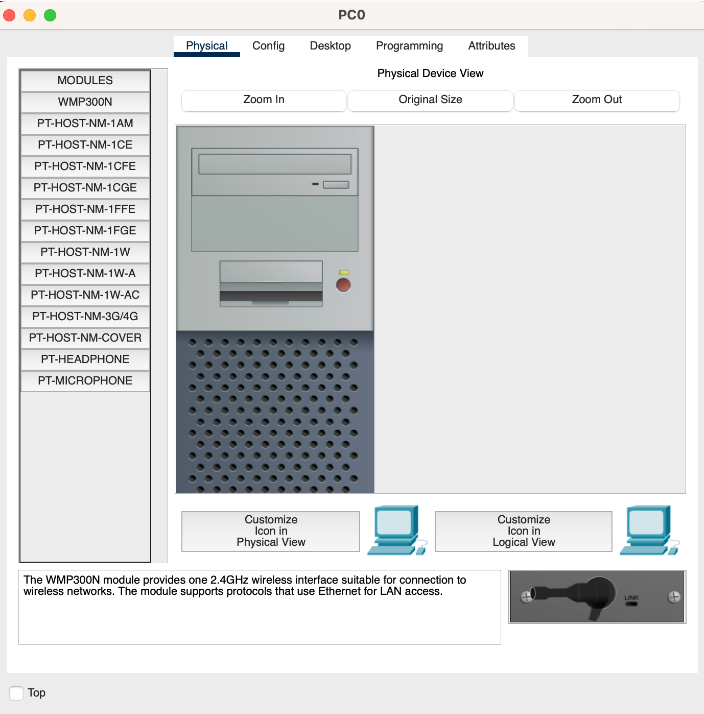
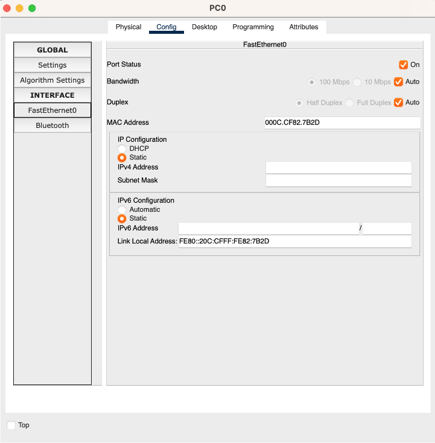
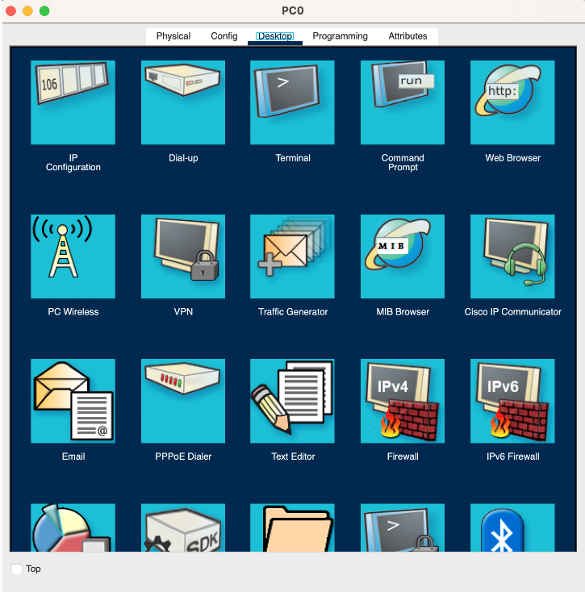
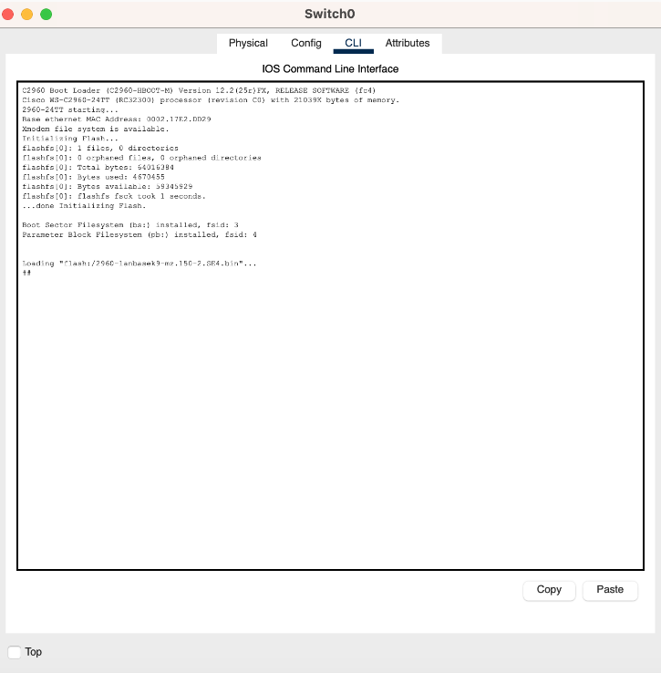
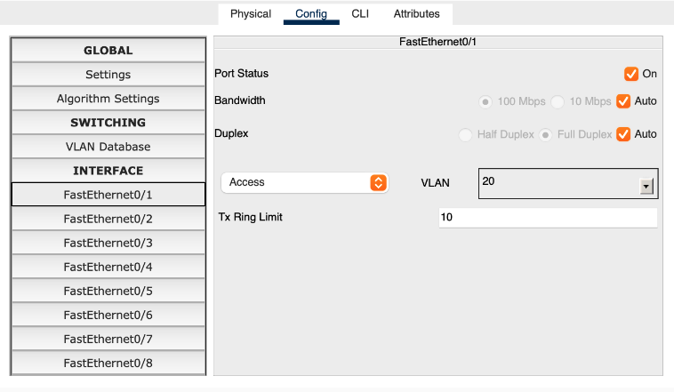

{/* NOTE: This is almost ready to go, and was used in 2024 for homework */}

import { Aside, Steps } from '@astrojs/starlight/components';
import ActivityQuestion from '/src/components/ActivityQuestion.astro';

{/* ai-summary
type: activity
slug: cisco-packet-tracer
order: 16
paired_lecture: company-network-operations
practices: VLAN creation and access port assignment; trunk port configuration between switches and multilayer switch; inter-VLAN routing via SVI on a multilayer switch; DHCP server pool configuration with excluded addresses; internal DNS server with A records; spanning tree port state verification; end-to-end connectivity testing with ping
prereq_activities: network-detective
output: a Cisco Packet Tracer network where hosts in different VLANs receive DHCP addresses, resolve internal hostnames, and communicate through the multilayer switch
*/}

This activity puts into practice the concepts from the [Building and Operating a Company Network](/lectures/company-network-operations/) lecture. You will build a small enterprise network step by step in Cisco Packet Tracer, configuring VLANs, inter-VLAN routing via a multilayer switch, DHCP, and internal DNS. By the end, you will have a fully connected, segmented network where devices get their addresses automatically, reach other VLANs through routing, and resolve internal hostnames through DNS.

## What You Will Need

- Cisco Packet Tracer installed (download from [netacad.com](https://www.netacad.com/courses/packet-tracer) after creating a free account)
- About 60-90 minutes

## The Interface



### Adding Devices

In the bottom-left corner, the first row shows device categories. Clicking a category updates the second row with specific models. Use the search field between the rows to find a device by name.



Once you select a category, the device list updates on the right:



Click a device, then click the canvas to place it, or drag and drop. For cables, click the cable type, then click the first device and choose a port. Selecting **Automatically Choose Connection Type** handles cable type and port for you.

### Canvas and Simulation Modes

The canvas has a **logical** view (where you will spend most of your time) and a **physical** view (a rack/map view). There are two simulation modes:

- **Realtime:** Devices power on and behave like real hardware. Links start orange while devices negotiate; click the fast-forward button to advance time. A red link means a misconfiguration.

  

- **Simulation:** Step through network events one at a time. Filter the event list to the protocols you care about (ARP and ICMP are a good starting point for this activity).

  

### Interacting with Devices

Click any device to open its panel. The tabs you will use most:

- **Physical:** Power the device on or off; add or swap hardware modules (the device must be off to change modules).

  

- **Config:** Configure global settings and interfaces using a graphical form.

  

- **Desktop** (PCs and end-user devices): Run Command Prompt, Web Browser, and IP Configuration.

  

- **CLI** (switches, routers, multilayer switches): Full IOS command-line interface.

  

---

## Part 1: VLAN Setup

<Steps>
1. Add five PCs to the canvas: `PC0`, `PC1`, `PC2`, `PC3`, `PC4`.

2. Add two **access switches** (model 2960): `access-SW0` and `access-SW1`. Connect `PC0`, `PC1`, and `PC2` to `access-SW0` via straight-through cables (FastEthernet ports, starting from `Fa0/1`). Connect `PC3` and `PC4` to `access-SW1` the same way.

3. Add a **distribution switch** (model 2960): `dist-SW`. Connect it to each access switch using **crossover cables** on the GigabitEthernet ports of the access switches and FastEthernet ports on the distribution switch.

4. Assign IP addresses to the PCs. Use two subnets for the two departments:
   - **192.168.10.0/24** for SALES
   - **192.168.20.0/24** for FINANCE

   On each PC: click the PC, go to **Desktop > IP Configuration**, and enter the IPv4 address and subnet mask (255.255.255.0).

   <Aside type="tip">
   Rename each PC to include its IP address (for example, `SALES-10.100`) so you can see subnet membership at a glance on the canvas without opening each device.
   </Aside>

5. Open a Command Prompt on `PC0` and try pinging `PC1` (same subnet) and `PC4` (different subnet). Note the results before continuing.

6. Configure VLANs on all three switches. On each switch, open the **CLI** tab and run:

   ```
   en
   conf t
   vlan 10
    name SALES
   vlan 20
    name FINANCE
   exit
   exit
   show vlan
   ```

7. Assign each access port to the correct VLAN. On each access switch, open the **Config** tab, select the interface connected to each PC, and set the VLAN. You can also do this from the CLI:

   ```
   interface FastEthernet0/1
    switchport access vlan 10
   ```

   

8. Set the uplink ports connecting the access switches to the distribution switch to **trunk mode** in the Config tab. The remote end updates automatically.
</Steps>

<ActivityQuestion>
Before configuring VLANs, all five PCs were on the same switch. What would happen if PC0 sent an ARP broadcast? After adding VLANs, what changed?
</ActivityQuestion>

<ActivityQuestion>
Why do the uplinks between switches carry all VLANs instead of just one? What would break if you set those ports to access mode for VLAN 10?
</ActivityQuestion>

## Part 2: Inter-VLAN Routing

<Steps>
1. Add two more VLANs to all three switches:
   - **192.168.99.0/24** for MANAGEMENT
   - **192.168.200.0/24** for WIFI

2. Add a **multilayer switch** (model 3560, the MLS) to the canvas. Connect it to `dist-SW` using the correct cable, set both ports to trunk mode, and add all four VLANs to the MLS.

3. Configure a **Switch Virtual Interface (SVI)** for each VLAN on the MLS. In the CLI:

   ```
   interface vlan 10
    ip address 192.168.10.1 255.255.255.0
   ```

   Repeat for VLANs 20, 99, and 200 with the correct subnet. Then enable IP routing:

   ```
   ip routing
   ```

   Verify with `show run`.

4. Set the default gateway on each PC to `192.168.x.1` (the SVI for its VLAN). Open each PC, go to **Desktop > IP Configuration**, and fill in the **Default Gateway** field.

   Now repeat the ping test from Part 1, Step 5. `PC0` should now be able to reach `PC4`.

</Steps>

<ActivityQuestion>
You used a multilayer switch for inter-VLAN routing instead of connecting each VLAN to a separate router interface. What are the trade-offs between these two designs?
</ActivityQuestion>

## Part 3: Static Routing to a Border Router

<Steps>
1. Add a **router** (model 4331) to the canvas. Connect it to the MLS with the appropriate cable.

2. On the router, open the **Config** tab, power on the connected interface, then set:
   - **IPv4 Address**: 172.16.1.1
   - **Subnet Mask**: 255.255.255.252

3. On the MLS, disable switching on the port connected to the router (converting it from a Layer 2 switch port to a Layer 3 routed port):

   ```
   interface GigabitEthernet0/2
    no switchport
    ip address 172.16.1.2 255.255.255.252
   ```

4. Add static routes on both devices:

   ```
   ip route 0.0.0.0 0.0.0.0 GigabitEthernet0/2   (on the MLS)
   ip route 192.168.0.0 255.255.0.0 GigabitEthernet0/0/0   (on the router)
   ```
</Steps>

<ActivityQuestion>
You configured static routes between the MLS and the border router. Under what circumstances would you prefer a dynamic routing protocol (like OSPF or BGP) instead?
</ActivityQuestion>

## Part 4: DHCP

<Steps>
1. Add a **server** to the canvas. Connect it to the MLS and set the port to Access VLAN 99 (Management).

2. On the server, configure a static IP:
   - **IPv4 Address**: 192.168.99.100
   - **Subnet Mask**: 255.255.255.0
   - **Default Gateway**: 192.168.99.1
   - **DNS Server**: 8.8.8.8

3. In the server's **Services > DHCP** tab, turn the service **On**. Add a pool for VLAN 10:
   - **Pool Name**: VLAN10-Pool
   - **Default Gateway**: 192.168.10.1
   - **DNS Server**: 8.8.8.8
   - **Start IP Address**: 192.168.10.200
   - **Subnet Mask**: 255.255.255.0
   - **Maximum Users**: 50

   Click **Add**. Repeat for VLAN 20 with the corresponding values.

4. Add a DHCP relay helper on the MLS so VLAN clients can reach the server across subnet boundaries:

   ```
   interface vlan 10
    ip helper-address 192.168.99.100
   ```

   Repeat for VLAN 20.

5. Add two new PCs. For each one:
   - Connect it to an access switch and set the port VLAN.
   - Open the PC, go to **Config**, and set the IPv4 source to **DHCP**.

   Fast-forward and verify the PCs receive addresses in the expected range.

</Steps>

<ActivityQuestion>
The DHCP server is on VLAN 99 but serves clients on VLANs 10 and 20. Why does a relay agent work here when a simple broadcast would not reach across subnets?
</ActivityQuestion>

## Part 5: Internal DNS

Every real company network needs DNS. IP addresses work, but nobody types `192.168.10.100` into a browser. In this part you will configure the DHCP server to also run DNS, create an internal A record, and watch a browser request resolve a hostname all the way to an HTTP response.

<Steps>
1. On the existing DHCP server (in VLAN 99), open its **Services** tab. In the left sidebar click **DNS** and turn the service **On**.

2. In the DNS record form, create an A record:
   - **Name**: `web.company.local`
   - **Type**: A Record
   - **Address**: the static IP of one of your VLAN 10 PCs (e.g., `192.168.10.10`)

   Click **Add**.

3. Configure one of the VLAN 10 PCs as a simple web server. Click the PC, go to **Services > HTTP**, and turn the HTTP server **On**. You can leave the default index page.

4. Update both DHCP pools (VLAN 10 and VLAN 20) to tell clients about the DNS server. In each pool, set the **DNS Server** field to `192.168.99.100`.

   For any PCs already holding DHCP leases, release and renew:
   - Open the PC → **Desktop > IP Configuration** → switch to **Static**, then back to **DHCP**. Fast-forward until the lease refreshes.

   Verify the PC received the DNS server address by checking **Desktop > IP Configuration** and confirming **DNS Server** shows `192.168.99.100`.

5. On a PC in **VLAN 20**, open **Desktop > Command Prompt** and run:

   ```
   ping web.company.local
   ```

   If DNS is working, the name resolves to the VLAN 10 PC's IP and ICMP replies come back. This crosses two VLAN boundaries: VLAN 20 → MLS → VLAN 99 (for the DNS query), then VLAN 20 → MLS → VLAN 10 (for the ping reply).

6. Switch to **Simulation mode** and add **DNS** and **HTTP** to the event filter. On the VLAN 20 PC, open **Desktop > Web Browser** and navigate to:

   ```
   http://web.company.local
   ```

   Click the play button to step through events. Observe:
   - The PC first generates a DNS query packet destined for `192.168.99.100`
   - The query crosses the MLS and reaches the DNS server in VLAN 99
   - The DNS server returns an A record response containing `192.168.10.10` (or whichever IP you assigned)
   - The PC sends an HTTP GET to that IP address
   - The request crosses the MLS again into VLAN 10 and reaches the web server
   - The web server returns an HTTP 200 response with the default page

7. Test what happens when DNS is unavailable. On the VLAN 20 PC, temporarily change the DNS server in IP Configuration to a non-existent address like `192.168.99.200`. Try to browse to `http://web.company.local` again. What happens? Now try browsing directly to the IP address `http://192.168.10.10`. What does this tell you about the role of DNS in the connection chain?

   Restore the correct DNS server address when done.
</Steps>

<ActivityQuestion>
Browsing to `http://web.company.local` failed when DNS was broken, but browsing directly to the IP address worked. What does this tell you about where DNS fits in the connection chain? When a user says "the website is down," how would this test help you distinguish a DNS failure from an application failure?
</ActivityQuestion>
