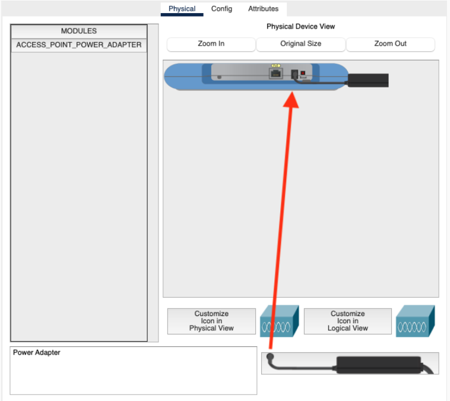

import { Aside, Steps } from '@astrojs/starlight/components';

This activity puts into practice the concepts from the [Networking Fundamentals (LAN/WAN)](/lectures/networking-fundamentals-lan-wan/) and [Network Configuration and Troubleshooting](/lectures/network-configuration-and-troubleshooting/) lectures. You will build a small enterprise network step by step in Cisco Packet Tracer, configuring VLANs, inter-VLAN routing via a multilayer switch, DHCP, and wireless access. By the end, you will have connected all device types on a segmented network and seen how each layer of the design addresses a specific networking concern.

<Aside type="tip">
Read the [Networking Fundamentals (LAN/WAN)](/lectures/networking-fundamentals-lan-wan/) and [Network Configuration and Troubleshooting](/lectures/network-configuration-and-troubleshooting/) lectures before starting. Each section below notes which lecture concept it exercises.
</Aside>

## What You Will Need

- Cisco Packet Tracer installed (download from [netacad.com](https://www.netacad.com/courses/packet-tracer) after creating a free account)
- About 60-90 minutes

## The Interface


### Adding Devices

In the bottom-left corner, the first row shows device categories. Clicking a category updates the second row with specific models. Use the search field between the rows to find a device by name.


Once you select a category, the device list updates on the right:


Click a device, then click the canvas to place it, or drag and drop. For cables, click the cable type, then click the first device and choose a port. Selecting **Automatically Choose Connection Type** handles cable type and port for you.

### Canvas and Simulation Modes

The canvas has a **logical** view (where you will spend most of your time) and a **physical** view (a rack/map view). There are two simulation modes:

- **Realtime:** Devices power on and behave like real hardware. Links start orange while devices negotiate; click the fast-forward button to advance time. A red link means a misconfiguration.

  

- **Simulation:** Step through network events one at a time. Filter the event list to the protocols you care about (ARP and ICMP are a good starting point for this activity).

  

### Interacting with Devices

Click any device to open its panel. The tabs you will use most:

- **Physical:** Power the device on or off; add or swap hardware modules (the device must be off to change modules).

  

- **Config:** Configure global settings and interfaces using a graphical form.

  

- **Desktop** (PCs and end-user devices): Run Command Prompt, Web Browser, and IP Configuration.

  

- **CLI** (switches, routers, multilayer switches): Full IOS command-line interface.

  

---

## Part 1: VLAN Setup

<Steps>
1. Add five PCs to the canvas: `PC0`, `PC1`, `PC2`, `PC3`, `PC4`.

2. Add two **access switches** (model 2960): `access-SW0` and `access-SW1`. Connect `PC0`, `PC1`, and `PC2` to `access-SW0` via straight-through cables (FastEthernet ports, starting from `Fa0/1`). Connect `PC3` and `PC4` to `access-SW1` the same way.

3. Add a **distribution switch** (model 2960): `dist-SW`. Connect it to each access switch using **crossover cables** on the GigabitEthernet ports of the access switches and FastEthernet ports on the distribution switch.

   <Aside type="note">
   **Lecture connection:** The lecture's *Core Network Devices* section explains that straight-through cables connect unlike device types (PC to switch) while crossover cables connect like device types (switch to switch). Modern switches with Auto-MDIX detect the cable type automatically, but Packet Tracer models older hardware that does not.
   </Aside>

4. Assign IP addresses to the PCs. Use two subnets for the two departments:
   - **192.168.10.0/24** for SALES
   - **192.168.20.0/24** for FINANCE

   On each PC: click the PC, go to **Desktop > IP Configuration**, and enter the IPv4 address and subnet mask (255.255.255.0).

   <Aside type="tip">
   Rename each PC to include its IP address (for example, `SALES-10.100`) so you can see subnet membership at a glance on the canvas without opening each device.
   </Aside>

5. Open a Command Prompt on `PC0` and try pinging `PC1` (same subnet) and `PC4` (different subnet). Note the results before continuing.

6. Configure VLANs on all three switches. On each switch, open the **CLI** tab and run:

   ```
   en
   conf t
   vlan 10
    name SALES
   vlan 20
    name FINANCE
   exit
   exit
   show vlan
   ```

7. Assign each access port to the correct VLAN. On each access switch, open the **Config** tab, select the interface connected to each PC, and set the VLAN. You can also do this from the CLI:

   ```
   interface FastEthernet0/1
    switchport access vlan 10
   ```

   

8. Set the uplink ports connecting the access switches to the distribution switch to **trunk mode** in the Config tab. The remote end updates automatically.
</Steps>

## Part 2: Inter-VLAN Routing

<Steps>
1. Add two more VLANs to all three switches:
   - **192.168.99.0/24** for MANAGEMENT
   - **192.168.200.0/24** for WIFI

2. Add a **multilayer switch** (model 3560, the MLS) to the canvas. Connect it to `dist-SW` using the correct cable, set both ports to trunk mode, and add all four VLANs to the MLS.

3. Configure a **Switch Virtual Interface (SVI)** for each VLAN on the MLS. In the CLI:

   ```
   interface vlan 10
    ip address 192.168.10.1 255.255.255.0
   ```

   Repeat for VLANs 20, 99, and 200 with the correct subnet. Then enable IP routing:

   ```
   ip routing
   ```

   Verify with `show run`.

4. Set the default gateway on each PC to `192.168.x.1` (the SVI for its VLAN). Open each PC, go to **Desktop > IP Configuration**, and fill in the **Default Gateway** field.

   Now repeat the ping test from Part 1, Step 5. `PC0` should now be able to reach `PC4`.

   <Aside type="note">
   **Lecture connection:** The lecture's *Routing Basics* section explains that a default gateway is the IP address a host sends packets to when the destination is outside its own subnet. The SVI acts as the default gateway for every host in that VLAN.
   </Aside>
</Steps>

## Part 3: Static Routing to a Border Router

<Steps>
1. Add a **router** (model 4331) to the canvas. Connect it to the MLS with the appropriate cable.

2. On the router, open the **Config** tab, power on the connected interface, then set:
   - **IPv4 Address**: 172.16.1.1
   - **Subnet Mask**: 255.255.255.252

   <Aside type="note">
   **Lecture connection:** The *IP Addressing and Subnetting* section covers the /30 (255.255.255.252) subnet, which provides exactly two usable host addresses. This is the standard choice for point-to-point links between routers, where only the two endpoints need addresses.
   </Aside>

3. On the MLS, disable switching on the port connected to the router (converting it from a Layer 2 switch port to a Layer 3 routed port):

   ```
   interface GigabitEthernet0/2
    no switchport
    ip address 172.16.1.2 255.255.255.252
   ```

4. Add static routes on both devices:

   ```
   ip route 0.0.0.0 0.0.0.0 GigabitEthernet0/2   (on the MLS)
   ip route 192.168.0.0 255.255.0.0 GigabitEthernet0/0/0   (on the router)
   ```
</Steps>

## Part 4: DHCP

<Steps>
1. Add a **server** to the canvas. Connect it to the MLS and set the port to Access VLAN 99 (Management).

2. On the server, configure a static IP:
   - **IPv4 Address**: 192.168.99.100
   - **Subnet Mask**: 255.255.255.0
   - **Default Gateway**: 192.168.99.1
   - **DNS Server**: 8.8.8.8

3. In the server's **Services > DHCP** tab, turn the service **On**. Add a pool for VLAN 10:
   - **Pool Name**: VLAN10-Pool
   - **Default Gateway**: 192.168.10.1
   - **DNS Server**: 8.8.8.8
   - **Start IP Address**: 192.168.10.200
   - **Subnet Mask**: 255.255.255.0
   - **Maximum Users**: 50

   Click **Add**. Repeat for VLAN 20 with the corresponding values.

4. Add a DHCP relay helper on the MLS so VLAN clients can reach the server across subnet boundaries:

   ```
   interface vlan 10
    ip helper-address 192.168.99.100
   ```

   Repeat for VLAN 20.

5. Add two new PCs. For each one:
   - Connect it to an access switch and set the port VLAN.
   - Open the PC, go to **Config**, and set the IPv4 source to **DHCP**.

   Fast-forward and verify the PCs receive addresses in the expected range.

   <Aside type="note">
   **Lecture connection:** The *DHCP: dynamic addressing* section's lease process describes the four-step DORA sequence (Discover, Offer, Request, Acknowledge). Switch to simulation mode and add a new DHCP client to watch this exchange step by step.
   </Aside>
</Steps>

## Part 5: Wireless

<Steps>
1. Add a **Wireless LAN Controller** (WLC 3504) to the canvas. Connect it to the MLS and set the port to Access VLAN 99.

2. Configure the WLC's management IP:
   - **IPv4 Address**: 192.168.99.101
   - **Subnet Mask**: 255.255.255.0
   - **Default Gateway**: 192.168.99.1
   - **DNS Server**: 8.8.8.8

3. Fast-forward, then from any wired PC open the **Web Browser** and navigate to `http://192.168.99.101`.

   <Aside type="caution">
   The WLC web interface is very slow in Packet Tracer. Allow 30-60 seconds for the page to load.
   </Aside>

4. Create an admin account. In the setup wizard, confirm the management IP settings and proceed to **Create Your Wireless Networks**. Choose a network name (SSID) and WPA2 passphrase. Click through and apply. The WLC reboots.

5. While the WLC reboots, add a DHCP pool on the server for VLAN 200 (Wifi), starting at 192.168.200.100, with the WLC address (192.168.99.101) entered in the **WLC Address** field. Add a DHCP relay on the MLS for VLAN 200.

6. Add two **lightweight access points** (LAP-PT) to the canvas. Connect them to any switch and set the ports to VLAN 200. In each LAP's **Physical** tab, drag the power cord to the power socket.

   

   Set each LAP to DHCP in the **Config** tab. Fast-forward until they receive IP addresses.

7. Log back in to the WLC at `https://192.168.99.101` (note the S). Go to **WLANs > AP Groups**, create a group called `LAP`, add the SSID under **WLANs**, and add both access points under **APs**.

8. Add one or two wireless devices (tablets, smartphones, or laptops). In the device's **Config** tab, enter the SSID, enable WPA2-PSK, and enter the passphrase. Fast-forward and verify the device connects to one of the LAPs.
</Steps>

---

## Verify Your Understanding

Here is how each part of this activity maps to the lectures:

| What you did | Lecture section |
|---|---|
| Assigned PCs to subnets and observed broadcast isolation | IP Addressing and Subnetting; VLANs and network segmentation |
| Created VLANs and assigned ports | VLANs and network segmentation |
| Added trunk ports between switches | VLANs and network segmentation |
| Configured SVIs and enabled IP routing on the MLS | Routing Basics |
| Set default gateways on endpoints | Routing Basics |
| Added a /30 point-to-point link to a border router | IP Addressing and Subnetting; Static IP routing |
| Deployed a DHCP server and relay agents | Core Network Services: DHCP; DHCP: dynamic addressing |
| Connected wireless devices through a WLC and LAPs | Wi-Fi fundamentals; Enterprise wireless security |

Consider the following questions:

1. **Broadcast domains:** Before configuring VLANs, all five PCs were on the same switch. What would happen if PC0 sent an ARP broadcast? After VLANs, what changed?
2. **Trunk ports:** Why do the uplinks between switches carry all VLANs instead of just one? What would break if you set those ports to access mode for VLAN 10?
3. **MLS vs. external router:** You used a multilayer switch for inter-VLAN routing instead of connecting each VLAN to a separate router interface. What are the trade-offs between these two designs?
4. **DHCP relay:** The DHCP server is on VLAN 99 but serves clients on VLANs 10 and 20. Why does a relay agent work here when a simple broadcast would not reach across subnets?
5. **WLC vs. standalone APs:** In the enterprise wireless setup, the WLC manages both LAPs centrally. What operational advantages does this provide over configuring each access point independently?
6. **Static vs. dynamic routing:** You configured static routes between the MLS and the border router. Under what circumstances would you prefer a dynamic routing protocol (like OSPF or BGP) instead?
