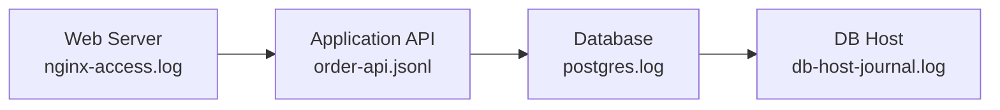

import { Aside, Steps } from '@astrojs/starlight/components';
import ActivityQuestion from '/src/components/ActivityQuestion.astro';

{/* ai-summary
type: activity
slug: follow-the-logs
order: 14
paired_lecture: log-management-and-analysis
practices: journalctl filtering by tag, priority, and boot metadata; timestamp-based triage from nginx access logs into application, database, and host logs; kubectl logs --previous and kubectl describe for crash-loop investigation; Fluent Bit DaemonSet deployment and Kubernetes metadata enrichment; auditd file-access verification with ausearch; concise incident timeline construction from multiple sources
prereq_activities: vm-setup, minikube
output: a timestamped incident timeline file plus Fluent Bit output showing Kubernetes-enriched container logs
*/}

This activity puts into practice the concepts from the [Log Management and Incident Investigation](/lectures/log-management-and-analysis/) lecture. You will first investigate a staged incident on a Linux server with `journalctl`, flat files, and `auditd`, then switch once to minikube to practice `kubectl logs --previous` and watch Fluent Bit enrich container logs. By the end, you will have a timestamped incident timeline from the server-side investigation and a direct view of how Kubernetes log collection works before logs reach a real backend.

The flow is split by environment on purpose. The first half stays on the Linux machine so you can work through persistent host and application logs without changing context, then the second half moves to your local minikube cluster for the container-specific part of the lecture, where logs are ephemeral and usually forwarded to a backend such as Loki or Elasticsearch. In this demo, Fluent Bit writes to `stdout` instead so you can inspect the forwarded records directly with `kubectl logs`.

## What You Will Need

- Access to an Ubuntu or Debian Linux machine where you have `sudo` privileges
- `journalctl`, `logger`, `grep`, and `awk` on that machine
- `auditd` on the Linux machine. Install it if it is not already present: `sudo apt-get install -y auditd && sudo systemctl enable auditd --now` (this might not work on WSL2, so if you are using WSL, you can skip the auditd section)
- `kubectl` on your local machine and a running minikube cluster from the [Minikube](/activities/minikube/) activity. Start minikube before class if it is not already running.

---

## Build the Incident Bundle

Before investigating anything, you need a controlled set of logs to work with. This bundle captures the same staged failure sequence each time: a long-running export job opens too many PostgreSQL sessions, exhausts database connection slots, and eventually pushes the order API into timeouts and HTTP 500 errors. Three of the files in this bundle simulate the flat log files you would usually find under `/var/log/` or an application-specific log directory, while `db-host-journal.log` is a saved excerpt from another machine's systemd journal. The journal entries you write here are real: `logger` writes through the syslog socket at `/dev/log`. Many Linux services reach the journal differently, either through systemd-managed stdout and stderr or through syslog, but the resulting entries are all searchable with `journalctl`.

Run the following commands on your **Linux machine**.

<Steps>

1. **Create the working directory:**

    ```bash title="Create the Working Directory"
    mkdir -p ~/cs312-log-activity/bundle
    cd ~/cs312-log-activity
    ```

2. **Create the nginx access log:**

    ```bash title="Write ~/cs312-log-activity/bundle/nginx-access.log"
    cat > ~/cs312-log-activity/bundle/nginx-access.log << 'EOF'
    203.0.113.10 - - [15/Mar/2026:03:02:05 +0000] "GET /api/orders HTTP/1.1" 200 912 "-" "curl/8.5.0"
    198.51.100.24 - - [15/Mar/2026:03:02:18 +0000] "GET /healthz HTTP/1.1" 200 31 "-" "kube-probe/1.32"
    203.0.113.11 - - [15/Mar/2026:03:02:44 +0000] "GET /api/orders HTTP/1.1" 200 905 "-" "curl/8.5.0"
    203.0.113.12 - - [15/Mar/2026:03:03:01 +0000] "GET /api/orders HTTP/1.1" 200 918 "-" "curl/8.5.0"
    198.51.100.24 - - [15/Mar/2026:03:03:10 +0000] "GET /healthz HTTP/1.1" 200 31 "-" "kube-probe/1.32"
    203.0.113.13 - - [15/Mar/2026:03:03:22 +0000] "GET /api/orders HTTP/1.1" 200 921 "-" "curl/8.5.0"
    203.0.113.14 - - [15/Mar/2026:03:03:44 +0000] "GET /api/orders HTTP/1.1" 200 910 "-" "curl/8.5.0"
    203.0.113.15 - - [15/Mar/2026:03:04:01 +0000] "GET /api/orders HTTP/1.1" 500 162 "-" "curl/8.5.0"
    203.0.113.16 - - [15/Mar/2026:03:04:07 +0000] "GET /api/orders HTTP/1.1" 500 162 "-" "curl/8.5.0"
    198.51.100.24 - - [15/Mar/2026:03:04:10 +0000] "GET /healthz HTTP/1.1" 503 31 "-" "kube-probe/1.32"
    203.0.113.17 - - [15/Mar/2026:03:04:18 +0000] "GET /api/orders HTTP/1.1" 500 162 "-" "curl/8.5.0"
    203.0.113.18 - - [15/Mar/2026:03:04:31 +0000] "GET /api/orders HTTP/1.1" 500 162 "-" "curl/8.5.0"
    203.0.113.19 - - [15/Mar/2026:03:05:02 +0000] "GET /api/orders HTTP/1.1" 500 162 "-" "curl/8.5.0"
    203.0.113.20 - - [15/Mar/2026:03:05:19 +0000] "GET /api/orders HTTP/1.1" 500 162 "-" "curl/8.5.0"
    198.51.100.24 - - [15/Mar/2026:03:05:22 +0000] "GET /healthz HTTP/1.1" 503 31 "-" "kube-probe/1.32"
    203.0.113.21 - - [15/Mar/2026:03:05:40 +0000] "GET /api/orders HTTP/1.1" 500 162 "-" "curl/8.5.0"
    EOF
    ```

3. **Create the application JSON log:**

    ```bash title="Write ~/cs312-log-activity/bundle/order-api.jsonl"
    cat > ~/cs312-log-activity/bundle/order-api.jsonl << 'EOF'
    {"timestamp":"2026-03-15T03:00:52.011Z","level":"info","service":"order-api","message":"worker pool healthy","request_id":"req-1001","duration_ms":19}
    {"timestamp":"2026-03-15T03:01:17.125Z","level":"error","service":"order-api","message":"database connection timeout, served stale cache","upstream_host":"postgres-prod","upstream_port":5432,"request_id":"req-1002","duration_ms":30012,"fallback":"stale-cache","http_status":200}
    {"timestamp":"2026-03-15T03:02:06.993Z","level":"error","service":"order-api","message":"database connection timeout, served stale cache","upstream_host":"postgres-prod","upstream_port":5432,"request_id":"req-1003","duration_ms":30009,"fallback":"stale-cache","http_status":200}
    {"timestamp":"2026-03-15T03:03:14.411Z","level":"warn","service":"order-api","message":"connection pool exhausted, retry queue growing","request_id":"req-1004","duration_ms":1050,"retry_queue_depth":7}
    {"timestamp":"2026-03-15T03:03:58.731Z","level":"error","service":"order-api","message":"database connection timeout, fallback unavailable","upstream_host":"postgres-prod","upstream_port":5432,"request_id":"req-1005","duration_ms":30001,"fallback":"none","http_status":500}
    {"timestamp":"2026-03-15T03:04:12.841Z","level":"fatal","service":"order-api","message":"startup dependency check failed after restart","upstream_host":"postgres-prod","upstream_port":5432,"request_id":"req-1006","duration_ms":0}
    EOF
   ```

4. **Create the PostgreSQL log:**

    ```bash title="Write ~/cs312-log-activity/bundle/postgres.log"
    cat > ~/cs312-log-activity/bundle/postgres.log << 'EOF'
    2026-03-15 03:00:59 UTC [4122] LOG: checkpoint starting: time
    2026-03-15 03:01:04 UTC [4122] FATAL: remaining connection slots are reserved for non-replication superuser connections
    2026-03-15 03:01:21 UTC [4128] FATAL: remaining connection slots are reserved for non-replication superuser connections
    2026-03-15 03:02:07 UTC [4134] FATAL: remaining connection slots are reserved for non-replication superuser connections
    2026-03-15 03:03:58 UTC [4197] FATAL: remaining connection slots are reserved for non-replication superuser connections
    2026-03-15 03:04:13 UTC [4201] LOG: background worker "logical replication launcher" exited with exit code 1
    EOF
    ```

5. **Create the database host journal excerpt:**

    ```bash title="Write ~/cs312-log-activity/bundle/db-host-journal.log"
    cat > ~/cs312-log-activity/bundle/db-host-journal.log << 'EOF'
    Mar 15 02:58:23 db-prod-01 systemd[1]: Started nightly-export.service - Finance CSV export.
    Mar 15 02:58:24 db-prod-01 nightly-export[5111]: opened 90 database sessions for region sweep
    Mar 15 02:58:29 db-prod-01 nightly-export[5111]: exporting order archive partition for 2026-03-14
    Mar 15 03:01:04 db-prod-01 postgres[4122]: remaining connection slots are reserved for non-replication superuser connections
    Mar 15 03:01:05 db-prod-01 systemd[1]: nightly-export.service still running after 2min 41s
    Mar 15 03:04:14 db-prod-01 nightly-export[5111]: export job still holding open sessions waiting on downstream writer
    EOF
    ```

6. **Confirm all four files exist:**

    ```bash title="Confirm All Four Files Exist"
    ls -1 ~/cs312-log-activity/bundle
    ```

    You should see `db-host-journal.log`, `nginx-access.log`, `order-api.jsonl`, and `postgres.log`.

7. **Write real journal entries on your server:**

    ```bash title="Write Journal Test Entries"
    logger -t cs312-log-activity "incident bundle ready for $(whoami) on $(hostname)"
    logger -p user.warning -t cs312-log-activity "practice warning: the 5xx spike begins at 03:04 UTC"
    ```

    `logger` sends messages directly to the systemd journal, tagged with the program name `cs312-log-activity`. These entries are just a controlled test signal so you can practice journal filters in steps 8 and 9. In real systems, similar journal entries often appear naturally from services that log through systemd-managed stdout/stderr or `/dev/log`.

8. **Query the entries you just wrote:**

    ```bash title="Query the Entries You Just Wrote"
    journalctl -t cs312-log-activity --since "5 minutes ago" --no-pager
    ```

    The `-t` flag filters by syslog identifier. The journal indexes entries by identifier, priority, and timestamp, so this filter uses metadata rather than scanning every message as plain text.

9. **Filter on priority:**

    ```bash title="Filter on Priority"
    journalctl -t cs312-log-activity -p warning --since "5 minutes ago"  --no-pager
    ```

    Only the warning-level entry appears. Severity is stored as structured metadata, so this filter never requires scanning message text.

10. **Check the boot history:**

    ```bash title="Check the Boot History"
    journalctl --list-boots | head -5
    ```

    The journal keeps logs grouped by boot session. `journalctl --list-boots` shows those sessions, where `0` is the current boot and `-1` is the previous one. If an incident crosses a reboot, `journalctl -b -1` lets you jump directly to the logs from the prior boot instead of guessing a time window.

</Steps>

<ActivityQuestion>
`journalctl` let you filter on tag, priority, and boot in steps 8 through 10 without searching through any text. A plain syslog file like `/var/log/syslog` contains the same events as unstructured lines. Which specific operations you just ran would require a `grep` or `awk` pipeline against a plain syslog file, and which would not be possible at all from the text alone?
</ActivityQuestion>

---

## Scope the Symptom

An investigation starts at the edge: the log source closest to the customer. First find when users began failing, then move inward and backward until you can explain what set the failure in motion.



Read top to bottom during triage: start where users are failing, then move inward to application, database engine, and host-service context. If the first error you find already assumes something else went wrong earlier, widen the time window backward.

<Steps>

1. **Count 5xx responses by minute to find the onset:**

    ```bash title="Count 5xx Responses by Minute to Find the Onset"
    # Keep only HTTP status >=500, extract the timestamp field (cutting seconds), then group and count by minute.
    awk '$9 >= 500 {print $4}' ~/cs312-log-activity/bundle/nginx-access.log \
     | cut -d: -f1-3 | sort | uniq -c
    ```

    You will see zero errors before `03:04`, then a sudden jump. In this dataset, the errors appear all at once rather than climbing gradually.

2. **Show the first customer-visible failure:**

    ```bash title="Find First Customer-Visible Failure"
    awk '$9 >= 500 {print; exit}' ~/cs312-log-activity/bundle/nginx-access.log
    ```

    This prints the first request that actually returned a 500. The timestamp is `03:04:01`, which is the first moment the problem becomes visible to a user.

3. **Find the earliest application-side error:**

    ```bash title="Find Earliest Application Error"
    # Find the first matching result in the application log
    grep '"level":"error"' ~/cs312-log-activity/bundle/order-api.jsonl | head -1
    ```

    The first application error appears at `03:01:17`, almost three minutes before the first HTTP 500. That gap is realistic here because the early database timeouts were absorbed by stale-cache fallback inside `order-api`, so the edge still returned `200` for a while. Use this earlier application error as the anchor for the deeper investigation.

4. **Correlate the degradation window across application, database, and host logs:**

    ```bash title="Correlate the Degradation Window Across Application,"
    grep '"level":"error"' ~/cs312-log-activity/bundle/order-api.jsonl 
    awk '$2 >= "03:01:00" && $2 < "03:05:00"' ~/cs312-log-activity/bundle/postgres.log
    awk '$3 >= "03:01:00" && $3 < "03:05:00"' ~/cs312-log-activity/bundle/db-host-journal.log
    ```

    Now that you have the first application error at `03:01:17`, hold the time window fixed across the other logs instead of searching by message text. These commands keep only entries from `03:01:00` through `03:04:59` in each file so you can compare the same interval at every layer. `order-api.jsonl` shows two early database timeouts that still served stale cache, then a pool-exhaustion warning at `03:03:14`, and finally a timeout at `03:03:58` with no fallback left. `postgres.log` shows repeated connection-slot exhaustion starting at `03:01:04` and a later worker issue at `03:04:13`. `db-host-journal.log` shows the export service still running at `03:01:05` and still holding sessions at `03:04:14`.

5. **Use the service name you just surfaced to search earlier entries in the same host log:**

    ```bash title="Use the Service Name You Just Surfaced to Search Earlier"
    grep 'nightly-export' ~/cs312-log-activity/bundle/db-host-journal.log
    ```

    The earlier lines show the export job starting at `02:58:23` and opening 90 database sessions at `02:58:24`. If that service name had not appeared, we would have to look backwards with a wider time window and more guesswork about what to search for.

</Steps>

At this point, you have surfaced the whole causal chain needed for a minimal incident timeline: precursor at `02:58`, database exhaustion at `03:01`, the first API timeout at `03:01:17`, and the first user-visible HTTP 500 at `03:04:01`.

<ActivityQuestion>
The error pattern appears abruptly at one minute rather than climbing gradually. What kinds of root causes does an abrupt onset make more likely, and what kinds does it make less likely? Once you found the first application error at `03:01:17`, why was it important to widen the search backward to `02:58` instead of stopping at the first obvious failure?
</ActivityQuestion>

---

## Write the Incident Timeline

You now have enough evidence to write the incident timeline without introducing any rows you have not already seen. A good timeline is selective: include the smallest set of entries that proves when the precursor began, when the system failed internally, and when users felt the impact.

<Steps>

1. **Set your name in a shell variable. Replace `YOUR NAME` with your actual name:**

    ```bash title="Set Your Name in a Shell Variable. Replace YOUR NAME with"
    export CS312_NAME="YOUR NAME"
    ```

2. **Create the timeline file from the evidence you just surfaced:**

    ```bash title="Write ~/cs312-log-activity/timeline.txt"
    cat <<EOF > ~/cs312-log-activity/timeline.txt
    Investigator: ${CS312_NAME}
    Host: $(hostname)
    Generated: $(date -u +%FT%TZ)

    Incident: order-api HTTP 500 spike (15 Mar 2026 starting 03:04 UTC)
    Root cause: nightly-export opened 90 long-lived PostgreSQL sessions,
    exhausting PostgreSQL connection slots and leading to order-api timeouts.

    TIME (UTC)   SOURCE               EVENT
    02:58:24     db-host-journal.log  nightly-export opened 90 database sessions
    03:01:04     postgres.log         connection slots exhausted (FATAL)
    03:01:17     order-api.jsonl      first database timeout (req-1002, 30012ms)
    03:04:01     nginx-access.log     first HTTP 500 on /api/orders
    03:04:14     db-host-journal.log  export job still holding open sessions
    EOF
    ```

    Every row in this table came from a command in the previous section. The point is not to copy every line you saw. It is to keep only the entries that make the cause chain defensible.

3. **Print the timeline:**

    ```bash title="Print the Timeline"
    cat ~/cs312-log-activity/timeline.txt
    ```

    Your name, hostname, and cause chain should all appear in one clean block. Notice the gap between internal failure (`03:01:04`) and first user-visible symptom (`03:04:01`): for almost three minutes, `order-api` was still masking some database timeouts with stale-cache fallback before that degraded path ran out. That gap is the MTTD window if alerting fires only when the HTTP 5xx rate rises.

</Steps>

---

## Check the Audit Trail

Before leaving the Linux machine, inspect one more log source: the kernel audit subsystem. Unlike application logs, audit records are generated at the kernel boundary, so they can show a file access even when the program that performed it writes nothing of its own.

<Steps>

1. **Confirm auditd is running:**

    ```bash title="Confirm Auditd Is Running"
    sudo systemctl status auditd --no-pager
    ```

    The status should show `active (running)`. If it shows `inactive`, run `sudo systemctl start auditd` before continuing.

2. **See a summary of recent audit activity:**

    ```bash title="Summarize Audit Activity"
    sudo aureport --summary
    ```

    `aureport` reads `/var/log/audit/audit.log` and produces category totals: logins, file accesses, executions, and more. The audit subsystem has been recording events since the daemon started, with no application involvement.

3. **Add a temporary watch rule on one of the bundle files:**

    ```bash title="Add a Temporary Watch Rule on One of the Bundle Files"
    AUDIT_FILE="$HOME/cs312-log-activity/bundle/order-api.jsonl"
    sudo auditctl -w "$AUDIT_FILE" -p r -k cs312-audit
    ```

    `-w` specifies the file to watch, `-p r` watches for read access, and `-k` sets a search key so you can find these events later. Some systems also print `Old style watch rules are slower` when you add this rule. That message is a performance warning about the older watch-rule syntax, not a sign that the rule failed. For one temporary watch on one file in this activity, you can ignore the message and continue. The rule is active until the next reboot or until you remove it explicitly.

4. **Trigger the rule by reading the file:**

    ```bash title="Trigger the Rule by Reading the File"
    grep '"level":"fatal"' "$AUDIT_FILE" > /dev/null
    sleep 1
    ```

    Your `grep` command read the file. The audit subsystem recorded that read at the kernel level regardless of whether `grep` itself does any logging.

5. **Search for the audit event:**

    ```bash title="Search for the Audit Event"
    sudo ausearch -k cs312-audit --start recent
    ```

    The audit record shows the file path, the process that accessed it, the real user ID, and the timestamp. This is the kind of evidence that appears in compliance audits and security investigations: what accessed this file, and when.

6. **Remove the watch rule:**

    ```bash title="Remove the Watch Rule"
    sudo auditctl -W "$AUDIT_FILE" -p r -k cs312-audit
    ```

    `-W` (capital W) removes the specific watch. The audit log entry you just created remains in `/var/log/audit/audit.log` even after the rule is removed.

</Steps>

<ActivityQuestion>
The audit record shows a file read that `grep` itself never logged. What does that mean for an attacker who has compromised an application's logging framework and silenced its own log output? What is the practical limit of this protection on a fully compromised host where the attacker has root access?
</ActivityQuestion>

---

## Trace a Crash in Kubernetes

You have finished the Linux-machine portion of the activity. Switch once to your **local machine terminal** for this section and the next.

In containerized environments, the current container log is often not the one that contains the crash. This section uses your local minikube cluster to practice the investigation commands before you need them in a real incident.

<Steps>

1. **Make sure minikube is running:**

   ```bash title="Make Sure Minikube Is Running"
   minikube status
   ```

   If the cluster is stopped:

   ```bash title="If the Cluster Is Stopped"
   minikube start --driver=docker --memory=4096 --cpus=2
   ```

2. **Deploy a pod that prints errors and then exits:**

   ```bash title="Deploy a Pod That Prints Errors and Then Exits"
   kubectl apply -f - <<'EOF'
   apiVersion: v1
   kind: Pod
   metadata:
     name: crash-demo
   spec:
     restartPolicy: OnFailure
     containers:
     - name: crash-demo
       image: busybox:1.36
       command:
       - sh
       - -c
       - |
         echo "INFO starting crash-demo pid=1"
         echo "INFO listening on :8080"
         echo "INFO readiness probe succeeded"
         sleep 5
         echo "ERROR database connection timeout host=postgres-prod port=5432 request_id=req-9001"
         echo "FATAL panic: unable to start HTTP server because dependency check failed"
         exit 1
   EOF
   ```

   The container prints startup messages that look healthy, waits five seconds, then logs the error and exits with a non-zero code.

3. **Watch the pod move through its lifecycle:**

   ```bash title="Watch the Pod Move Through Its Lifecycle"
   kubectl get pod crash-demo -w
   ```

   You will see it move through `Pending`, `Running`, `Error`, and after several restarts, `CrashLoopBackOff`. Press Ctrl+C when you see the backoff status appear.

4. **Read the current container's log:**

   ```bash title="Read the Current Container's Log"
   kubectl logs crash-demo
   ```

   You see the most recently started container's output. In a real incident, this container might look completely healthy because Kubernetes restarted it fresh after the crash. The evidence you need is in the previous container.

5. **Read the previous container's log:**

   ```bash title="Read the Previous Container's Log"
   kubectl logs crash-demo --previous
   ```

   `--previous` retrieves the log from the terminated container that ran before the current one. When a container crashes and restarts, the new container writes to a new log stream. Without `--previous`, the crash evidence disappears behind the fresh startup. If this command fails in local environments, it usually means the runtime no longer has the prior log stream (for example after rotation or cleanup). In that case, continue with `kubectl describe pod crash-demo` for restart evidence and `kubectl logs crash-demo -c crash-demo` for current crash output.

6. **Inspect the cluster's view of what happened:**

   ```bash title="Inspect the Cluster's View of What Happened"
   kubectl describe pod crash-demo
   ```

   Scroll to the `Events` section at the bottom. You will see restart-related entries such as `Started` and `BackOff`. These are control-plane events from the kubelet and scheduler, not from the application. A failed image pull, an OOM kill, or a readiness probe failure would also appear here before any application log exists.

7. **Clean up:**

   ```bash title="Clean Up"
   kubectl delete pod crash-demo
   ```

</Steps>

<ActivityQuestion>
The Events section and the previous container log answered different questions about the same pod failure. What did the Events section tell you that the application log could not? What did the application log tell you that the Events section could not? In a real crash loop, why would checking only `kubectl logs crash-demo` (without `--previous`) lead you to the wrong conclusion?
</ActivityQuestion>

---

## Watch Fluent Bit Collect Logs

The previous section showed how to pull logs from a single pod on demand. In production, a collection agent runs continuously on every node, reading container log files from the node's filesystem, enriching each entry with Kubernetes metadata, and forwarding the result to a centralized store such as Loki, Elasticsearch, or a managed cloud logging service. In this demo, Fluent Bit writes to `stdout` instead so you can watch the forwarded records directly with `kubectl logs`.

Stay on your **local machine terminal**.

<Steps>

1. **Deploy a pod that writes continuous structured output:**

   ```bash title="Deploy Structured Log Generator"
   kubectl apply -f - <<'EOF'
   apiVersion: v1
   kind: Pod
   metadata:
     name: log-generator
   spec:
     containers:
     - name: log-generator
       image: busybox:1.36
       command:
       - sh
       - -c
       - |
         n=1
         while true; do
           printf '{"service":"order-api","level":"info","message":"heartbeat","count":%d}\n' "$n"
           n=$((n+1))
           sleep 3
         done
   EOF
   ```

   This pod writes one JSON line every three seconds to stdout, simulating an application that uses structured logging.

2. **Deploy Fluent Bit as a DaemonSet:**

   ```bash title="Deploy Fluent Bit as a DaemonSet"
   kubectl apply -f - <<'EOF'
   apiVersion: v1
   kind: Namespace
   metadata:
     name: logging
   ---
   apiVersion: v1
   kind: ServiceAccount
   metadata:
     name: fluent-bit
     namespace: logging
   ---
   apiVersion: rbac.authorization.k8s.io/v1
   kind: ClusterRole
   metadata:
     name: fluent-bit
   rules:
   - apiGroups: [""]
     resources: ["pods", "namespaces", "nodes"]
     verbs: ["get", "watch", "list"]
   ---
   apiVersion: rbac.authorization.k8s.io/v1
   kind: ClusterRoleBinding
   metadata:
     name: fluent-bit
   roleRef:
     apiGroup: rbac.authorization.k8s.io
     kind: ClusterRole
     name: fluent-bit
   subjects:
   - kind: ServiceAccount
     name: fluent-bit
     namespace: logging
   ---
   apiVersion: v1
   kind: ConfigMap
   metadata:
     name: fluent-bit-config
     namespace: logging
   data:
     fluent-bit.conf: |
       [SERVICE]
           Flush         2
           Log_Level     info
           Daemon        Off
       [INPUT]
           Name              tail
           Path              /var/log/containers/*.log
           Exclude_Path      /var/log/containers/*_logging_fluent-bit-*.log
           Tag               kube.*
           Refresh_Interval  5
           Skip_Long_Lines   On
       [FILTER]
           Name                kubernetes
           Match               kube.*
           Kube_URL            https://kubernetes.default.svc:443
           Kube_CA_File        /var/run/secrets/kubernetes.io/serviceaccount/ca.crt
           Kube_Token_File     /var/run/secrets/kubernetes.io/serviceaccount/token
           Merge_Log           Off
           Keep_Log            On
           Labels              On
           Annotations         Off
       [OUTPUT]
           Name    stdout
           Match   *
           Format  json_lines
   ---
   apiVersion: apps/v1
   kind: DaemonSet
   metadata:
     name: fluent-bit
     namespace: logging
     labels:
       app: fluent-bit
   spec:
     selector:
       matchLabels:
         app: fluent-bit
     template:
       metadata:
         labels:
           app: fluent-bit
       spec:
         serviceAccountName: fluent-bit
         tolerations:
         - key: node-role.kubernetes.io/control-plane
           operator: Exists
           effect: NoSchedule
         - key: node-role.kubernetes.io/master
           operator: Exists
           effect: NoSchedule
         containers:
         - name: fluent-bit
           image: fluent/fluent-bit:3.2
           imagePullPolicy: IfNotPresent
           volumeMounts:
           - name: varlog
             mountPath: /var/log
             readOnly: true
           - name: containers
             mountPath: /var/lib/docker/containers
             readOnly: true
           - name: config
             mountPath: /fluent-bit/etc/fluent-bit.conf
             subPath: fluent-bit.conf
         volumes:
         - name: varlog
           hostPath:
             path: /var/log
         - name: containers
           hostPath:
             path: /var/lib/docker/containers
         - name: config
           configMap:
             name: fluent-bit-config
   EOF
   ```

    The manifest creates a `logging` namespace, a ServiceAccount with cluster-read permissions so Fluent Bit can look up pod metadata, a ConfigMap with the pipeline configuration, and the DaemonSet itself. It mounts both `/var/log` and `/var/lib/docker/containers` from the node because, on a Docker-backed minikube node, the files under `/var/log/containers/` are symlinks that ultimately resolve into Docker's container log directory. The tail input also excludes Fluent Bit's own container log so the demo output does not loop back into itself. Because minikube is a single-node cluster, exactly one Fluent Bit pod will start.

3. **Wait for the Fluent Bit pod to be ready:**

   ```bash title="Wait for the Fluent Bit Pod to Be Ready"
   kubectl rollout status daemonset/fluent-bit -n logging
   ```

   You should see `daemon set "fluent-bit" successfully rolled out`. If it takes more than a minute, check the pod status with `kubectl get pods -n logging`.

4. **Stream Fluent Bit's output:**

   ```bash title="Stream Fluent Bit Logs"
   kubectl logs -n logging -l app=fluent-bit --tail=10 -f
   ```

    You will see the most recent forwarded entries immediately, then new JSON objects as they arrive. Each object represents one log entry that Fluent Bit read from `/var/log/containers/` on the node. Press Ctrl+C after several lines appear.

5. **Examine one log-generator entry:**

   ```bash title="Examine One Log-generator Entry"
   kubectl logs -n logging -l app=fluent-bit --tail=200 \
     | grep '"pod_name":"log-generator"' | tail -1
   ```

   In the output, look for the `kubernetes` object. It will contain fields that the log-generator pod never wrote:

   ```text title="Watch Fluent Bit Collect Logs Output"
   "kubernetes":{"pod_name":"log-generator","namespace_name":"default","container_name":"log-generator",...}
   ```

   The application wrote only its JSON heartbeat. Fluent Bit added the pod identity by reading the log file's path (`/var/log/containers/log-generator_default_log-generator-<id>.log`) and querying the Kubernetes API for the matching pod's metadata. The `log` field holds what the pod wrote; the `kubernetes` object holds what the pipeline added.

6. **Clean up:**

   ```bash title="Clean Up"
   kubectl delete pod log-generator
   kubectl delete namespace logging
   kubectl delete clusterrole fluent-bit
   kubectl delete clusterrolebinding fluent-bit
   ```

</Steps>

<ActivityQuestion>
The `kubernetes.pod_name` and `kubernetes.namespace_name` fields were not written by the log-generator application. Which component in the pipeline added them, and how does it know which pod a given log file belongs to? Why does having this metadata embedded in every forwarded entry matter when you are investigating an incident across a cluster with many nodes and many pods?
</ActivityQuestion>

---

## Going Further

You have the core investigation loop: scope the symptom, narrow the time window, broaden across adjacent sources, and write up the cause chain. The prepared bundle gave you a controlled version of that loop. The natural next step is to run the same process against live data.

If you still have a web service running from an earlier course activity, repeat this workflow on live data. Use `journalctl -u <service> -p err --since "1 hour ago"`, inspect the matching files in `/var/log`, and compare timestamps to what your service was doing at that time.

To add a real log storage backend, the [Loki getting-started guide](https://grafana.com/docs/loki/latest/getting-started/) walks you through deploying a minimal Loki instance. Once Loki is running, reconfigure the Fluent Bit output in this activity from `stdout` to Loki and write your first LogQL query. Start with `{namespace="default"}` to pull all logs from the default namespace, then chain `|= "heartbeat"` to filter by message content. Comparing response time between a wide label selector and a narrow one makes the cost tradeoff in Loki's label-first index model concrete.

For deeper log parsing, install `jq` on your server and rewrite the JSON investigation from the "Scope the Symptom" section using `jq` rather than `grep`. A filter like `jq 'select(.duration_ms > 5000)'` works on any JSON log file where that field exists, without the text-matching fragility of a regex against a JSON string. That is the next step up from ad-hoc terminal searching toward a repeatable toolkit.
