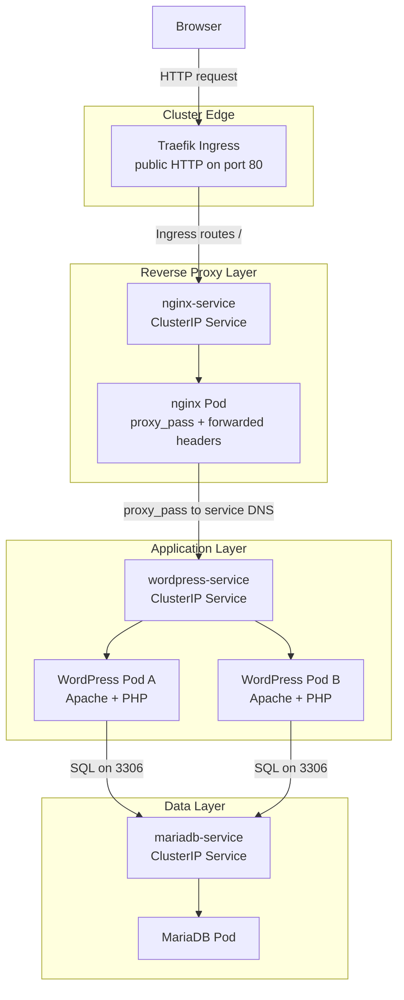

import { Steps, Aside } from '@astrojs/starlight/components';
import LabSubmissionNote from '/src/components/LabSubmissionNote.astro';

{/* LOs:
- LO3: Demonstrate how to manage a server for the purposes of providing specific services to a collection of users and devices, including manipulation of user accounts, resource management, and security.
- LO7: Create programs and demonstrate facility in programs and tools that automate system administration tasks.
*/}

Gerald went to a restaurant technology expo and came back saying "containers are the future." He means shipping containers. But the point still stands. The expo had a booth about Kubernetes, and Gerald picked up a brochure. He now wants "orchestration" for the three-location website expansion. You asked him what orchestration means to him. He said, "Like an orchestra. But for websites."

Docker Compose handles a lot for you on a single server: it can even restart crashed containers automatically with a restart policy. But it only runs on one machine. What happens when Gerald's website needs to run across multiple servers, or you need to push an update without taking the site down, or a whole node fails? Kubernetes (often abbreviated k8s) solves this by acting as an orchestrator: a system that continuously monitors your workloads, replaces failed containers, manages multi-service networking, and rolls out updates without downtime. In this lab, you will install k3s, a lightweight Kubernetes distribution designed for resource-constrained environments, and deploy a WordPress site served through an nginx reverse proxy using Kubernetes primitives: Deployments, Services, ConfigMaps, and Secrets.

<LabSubmissionNote />

## Before You Start

You need:
- An AWS Academy Learner Lab environment
- An SSH client on your laptop

## Why Kubernetes?

When you used Docker Compose, it handled restarting crashed containers and wiring up networks on a single host. Kubernetes does the same thing, but across a cluster of machines, and it adds a **control loop**: you declare "I want 2 copies of WordPress running at all times," and Kubernetes continuously compares desired state to actual state, making corrections automatically. A container crashes? Kubernetes starts a new one. You push a new image? Kubernetes rolls out the update gracefully, one Pod at a time, so the site stays up.

**k3s vs. full Kubernetes**: Standard Kubernetes is complex and resource-intensive. k3s is a certified Kubernetes distribution that strips out cloud-provider-specific components and bundles everything into a single binary. It runs comfortably on a t3.small instance and is ideal for learning, edge computing, and single-node deployments.

## Questions

Watch for the answers to these questions as you follow the tutorial.

1. What k3s version is running on your node? Write down the node's INTERNAL-IP address. (Use `kubectl get nodes -o wide`.) *(2 points)*
2. Write down the names and IP addresses of your two WordPress Pods. (Use `kubectl get pods -o wide`.) *(2 points)*
3. Run `kubectl get secret db-secret -o jsonpath='{.data.db-password}' | base64 --decode`. What does it print? What does this tell you about how Secrets store values, and why base64 encoding is not the same as encryption? *(3 points)*
4. After configuring nginx as a reverse proxy and the Ingress, what does `curl -L http://localhost` return? Describe the redirect chain: what responds first, what does it redirect to, and what serves the final response? *(3 points)*
5. After deleting one WordPress Pod, how many seconds did it take for Kubernetes to create a replacement? What does this demonstrate about Deployments? *(2 points)*
6. How does nginx's `proxy_pass` directive reference WordPress: by IP address or by DNS name? Why does this matter when Pods restart and get new IP addresses? *(2 points)*
7. When you first encountered the `?reauth=1` redirect loop, what command showed that no `WORDPRESS_AUTH_KEY` environment variables were set in the Pod? What is the root cause of the loop with two replicas? *(3 points)*
8. After applying the updated Secret and Deployment, what did `kubectl rollout status deployment/wordpress` report, and what does that confirm about the update? *(3 points)*
9. Get your TA's initials showing the WordPress admin dashboard (past the login screen) accessible via nginx in a browser. *(5 points)*

## Tutorial

### Installing k3s

<Steps>

1. **Launch an EC2 instance**

   In the AWS Console, launch a **SUSE Linux Enterprise Server 16** instance (available in the Quick Start AMIs). Use **t3.small** (2 vCPU, 2 GiB RAM); k3s runs on t3.micro but performs better with a bit more memory. Create a Security Group that allows:
   - SSH (port 22) from Anywhere
   - HTTP (port 80) from Anywhere

   Connect via SSH. SLES uses `ec2-user` as the default username:

   ```bash
   ssh -i ~/Downloads/cs312-key.pem ec2-user@<your-public-ip>
   ```

   <Aside type="caution">
   Some terminals and developer tools (Warp, VS Code Remote SSH, and others) open multiple SSH channels simultaneously for features like AI assistance, port forwarding, or remote file access. SLES ships with a stricter default sshd configuration than Ubuntu or Amazon Linux and rejects these extra channel requests, causing an immediate disconnect with a stream of `channel X: open failed` errors. This did not occur in earlier labs because Ubuntu and Amazon Linux accept those extra channels silently by default. If you see this error, switch to a standard terminal that opens a single plain SSH session: Terminal.app, iTerm2, Ghostty, or Windows Terminal.
   </Aside>

   You are now on a SUSE Linux Enterprise Server. k3s is a Rancher project, and Rancher was acquired by SUSE in 2020, so you are running k3s on its home operating system. The package manager here is `zypper` rather than `apt`, though you will not need it much in these labs since k3s and all workloads install via scripts and container images.

2. **Install k3s**

   k3s installs with a single command:

   ```bash
   curl -sfL https://get.k3s.io | sh -
   ```

   This downloads the k3s binary, installs it as a systemd service, and starts it immediately. It also installs `kubectl`, the Kubernetes command-line tool.

3. **Configure kubectl access**

   By default, k3s writes its configuration to `/etc/rancher/k3s/k3s.yaml`, which is only readable by root. To use `kubectl` without `sudo`:

   ```bash
   mkdir -p ~/.kube
   sudo cp /etc/rancher/k3s/k3s.yaml ~/.kube/config
   sudo chown $(id -u):$(id -g) ~/.kube/config
   export KUBECONFIG=~/.kube/config
   echo 'export KUBECONFIG=~/.kube/config' >> ~/.bashrc
   ```

   <Aside type="caution">
   This approach copies the cluster-admin kubeconfig to your home directory for convenience. The file contains a certificate with full control over the cluster, equivalent to root access. In production, `/etc/rancher/k3s/k3s.yaml` stays root-owned, and administrators run `sudo kubectl` for cluster-admin operations. Individual operators receive scoped kubeconfig files backed by Role-Based Access Control (RBAC) service accounts with only the permissions their role requires, not a personal copy of the cluster-admin certificate.
   </Aside>

4. **Verify the cluster**

   ```bash
   kubectl get nodes -o wide
   ```

   You should see one node with status "Ready." Record the k3s version (in the VERSION column) and the INTERNAL-IP for your lab questions.

</Steps>

### Understanding Kubernetes Primitives

Before writing manifests, let's understand the building blocks:

- **Pod**: The smallest unit in Kubernetes. A Pod runs one or more containers. You rarely create Pods directly.
- **Deployment**: Manages a set of identical Pods. You tell it "run 2 replicas of WordPress," and it ensures exactly 2 Pods are always running. If one dies, the Deployment creates a replacement.
- **Service**: Provides a stable network endpoint for a set of Pods. Pods get random IP addresses that change when they restart, but a Service gives you a fixed DNS name and IP to reach them.
- **ConfigMap**: Stores configuration data (like files or environment variables) separately from the container image. This lets you change configuration without rebuilding the image.
- **Secret**: Like a ConfigMap, but for sensitive data such as passwords and API keys. Values are base64-encoded, **not encrypted**: anyone who can read the Secret object can decode them instantly with `base64 --decode`. The value of Secrets is not confidentiality against cluster access, but rather keeping credentials out of your manifest files and Git history, and enabling RBAC to restrict which Pods and users can read which Secrets. In production, encrypted storage requires tools like HashiCorp Vault or the AWS Secrets Manager integration, which are outside the scope of this lab.

### Storing Credentials with Secrets

MariaDB needs a password. Hardcoding it in a manifest is bad practice; it ends up in your version control. Instead, you will store it in a Kubernetes Secret and reference it by name from other manifests.

<Steps>

1. **Create a project directory and write the Secret**

   ```bash
   mkdir ~/k8s-lab && cd ~/k8s-lab
   vim db-secret.yaml
   ```

   ```yaml
   apiVersion: v1
   kind: Secret
   metadata:
     name: db-secret
   type: Opaque
   stringData:
     db-root-password: rootpassword
     db-password: wordpresspassword
   ```

   Using `stringData` lets you write plain text; Kubernetes base64-encodes the values automatically when storing the Secret.

2. **Apply the Secret**

   ```bash
   kubectl apply -f db-secret.yaml
   ```

3. **Inspect the stored value**

   ```bash
   kubectl get secret db-secret -o jsonpath='{.data.db-password}' | base64 --decode
   ```

   The value is stored encoded, but you can decode it with standard base64 tooling. Record this output for your lab questions.

   <Aside type="caution">
   Base64 is encoding, not encryption. It is trivially reversible by anyone with access to the cluster. Kubernetes Secrets protect against credentials appearing in your YAML files and Git history, but they do not protect against a user or process that has permission to read Secrets in the cluster. In a production environment, restrict Secret access with Role-Based Access Control (RBAC) and consider encrypting Secrets at rest using a Key Management Service (KMS) provider.
   </Aside>

</Steps>

### Deploying MariaDB

MariaDB needs a stable DNS name so WordPress can reach it. You will create a Deployment and a ClusterIP Service (internal-only, with no NodePort) for MariaDB.

<Aside type="caution">
This deployment uses ephemeral (in-container) storage. If the MariaDB Pod is deleted, all database data is lost. In production, you would attach a **PersistentVolumeClaim** to give the database durable storage that outlives any individual Pod. For this lab, ephemeral storage is intentional: we are demonstrating orchestration, not data durability.
</Aside>

<Steps>

1. **Write the MariaDB Deployment**

   ```bash
   vim mariadb-deployment.yaml
   ```

   ```yaml
   apiVersion: apps/v1
   kind: Deployment
   metadata:
     name: mariadb
     labels:
       app: mariadb
   spec:
     replicas: 1
     selector:
       matchLabels:
         app: mariadb
     template:
       metadata:
         labels:
           app: mariadb
       spec:
         containers:
           - name: mariadb
             image: mariadb:11
             env:
               - name: MYSQL_ROOT_PASSWORD
                 valueFrom:
                   secretKeyRef:
                     name: db-secret
                     key: db-root-password
               - name: MYSQL_DATABASE
                 value: wordpress
               - name: MYSQL_USER
                 value: wordpress
               - name: MYSQL_PASSWORD
                 valueFrom:
                   secretKeyRef:
                     name: db-secret
                     key: db-password
             ports:
               - containerPort: 3306
   ```

   The `secretKeyRef` fields pull values from `db-secret` at runtime. The password never appears in plain text in the manifest.

2. **Write the MariaDB Service**

   ```bash
   vim mariadb-service.yaml
   ```

   ```yaml
   apiVersion: v1
   kind: Service
   metadata:
     name: mariadb-service
   spec:
     type: ClusterIP
     selector:
       app: mariadb
     ports:
       - port: 3306
         targetPort: 3306
   ```

   `ClusterIP` means this Service is only reachable from inside the cluster; MariaDB should never be directly exposed to the internet.

3. **Apply both manifests**

   ```bash
   kubectl apply -f mariadb-deployment.yaml -f mariadb-service.yaml
   ```

4. **Wait for MariaDB to be ready**

   ```bash
   kubectl get pods -l app=mariadb
   ```

   Wait until the MariaDB Pod shows "Running." MariaDB takes 20-30 seconds to initialize on first run. If the Pod shows "CrashLoopBackOff," wait another 30 seconds and check again; it typically self-corrects as MariaDB finishes its initialization sequence.

</Steps>

### Deploying WordPress

WordPress connects to MariaDB using the Service DNS name `mariadb-service`, which Kubernetes resolves to the MariaDB Pod's IP automatically. This is why Services are essential: if WordPress referenced a Pod IP directly, that IP would change every time the MariaDB Pod restarted.

<Steps>

1. **Write the WordPress Deployment**

   ```bash
   vim wordpress-deployment.yaml
   ```

   ```yaml
   apiVersion: apps/v1
   kind: Deployment
   metadata:
     name: wordpress
     labels:
       app: wordpress
   spec:
     replicas: 2
     selector:
       matchLabels:
         app: wordpress
     template:
       metadata:
         labels:
           app: wordpress
       spec:
         containers:
           - name: wordpress
             image: wordpress:6.5.5-php8.3-apache
             env:
               - name: WORDPRESS_DB_HOST
                 value: mariadb-service:3306
               - name: WORDPRESS_DB_NAME
                 value: wordpress
               - name: WORDPRESS_DB_USER
                 value: wordpress
               - name: WORDPRESS_DB_PASSWORD
                 valueFrom:
                   secretKeyRef:
                     name: db-secret
                     key: db-password
               - name: WORDPRESS_CONFIG_EXTRA
                 value: "define('WP_AUTO_UPDATE_CORE', false);"
             ports:
               - containerPort: 80
   ```

2. **Write the WordPress Service**

   WordPress will not be exposed directly to the internet (nginx will sit in front of it), so a ClusterIP Service is sufficient.

   ```bash
   vim wordpress-service.yaml
   ```

   ```yaml
   apiVersion: v1
   kind: Service
   metadata:
     name: wordpress-service
   spec:
     type: ClusterIP
     selector:
       app: wordpress
     ports:
       - port: 80
         targetPort: 80
   ```

3. **Apply both manifests**

   ```bash
   kubectl apply -f wordpress-deployment.yaml -f wordpress-service.yaml
   ```

4. **Verify the WordPress Pods**

   ```bash
   kubectl get pods -o wide
   ```

   You should see 2 WordPress Pods with status "Running" alongside the MariaDB Pod. Note the names and IP addresses of both WordPress Pods for your lab questions.

</Steps>

### Deploying nginx as a Reverse Proxy

Traefik is k3s's built-in **ingress controller** and is the component actually listening on public port 80. Strictly speaking, you could route Traefik directly to `wordpress-service` and skip nginx entirely. We are keeping nginx in front of WordPress on purpose because it gives you an explicit reverse-proxy layer to configure yourself: you can see `proxy_pass`, forwarded headers, and service-to-service DNS in action, and in Lab 8 you will use that same nginx layer to practice probes, resource controls, and rollouts without changing the WordPress application container. The proxy configuration lives in a ConfigMap, so you can update routing rules without rebuilding the nginx image.

The WordPress image used in this lab (`wordpress:6.5.5-php8.3-apache`) runs **Apache** internally as the PHP application server. nginx's role here is purely as a **reverse proxy**: it accepts the request from Traefik, forwards it to WordPress over the cluster network, and returns the response. The request flow is:



This separation is common in production: the ingress controller handles cluster entry, the reverse proxy handles application-facing HTTP behavior, and the application server focuses on running application code.

<Steps>

1. **Create the nginx ConfigMap**

   ```bash
   vim nginx-configmap.yaml
   ```

   ```yaml
   apiVersion: v1
   kind: ConfigMap
   metadata:
     name: nginx-config
   data:
     default.conf: |
       server {
           listen 80;

           location / {
               proxy_pass http://wordpress-service;
               proxy_set_header Host $http_host;
               proxy_set_header X-Real-IP $remote_addr;
               proxy_set_header X-Forwarded-For $proxy_add_x_forwarded_for;
               proxy_set_header X-Forwarded-Proto $scheme;
           }
       }
   ```

   `proxy_pass http://wordpress-service` tells nginx to forward all requests to the `wordpress-service` Service. Kubernetes DNS resolves `wordpress-service` to the Service's ClusterIP, which then load-balances across the 2 WordPress Pods.

   `proxy_set_header Host $http_host` passes the full `host:port` from the original request to WordPress. Using `$host` instead would strip the port, causing WordPress to generate redirect and asset URLs without the correct port, which breaks CSS and redirects.

2. **Write the nginx Deployment**

   ```bash
   vim nginx-deployment.yaml
   ```

   ```yaml
   apiVersion: apps/v1
   kind: Deployment
   metadata:
     name: nginx
     labels:
       app: nginx
   spec:
     replicas: 1
     selector:
       matchLabels:
         app: nginx
     template:
       metadata:
         labels:
           app: nginx
       spec:
         containers:
           - name: nginx
             image: nginx:1.27
             ports:
               - containerPort: 80
             volumeMounts:
               - name: nginx-config-volume
                 mountPath: /etc/nginx/conf.d
         volumes:
           - name: nginx-config-volume
             configMap:
               name: nginx-config
   ```

   The ConfigMap is mounted at `/etc/nginx/conf.d`, where nginx looks for virtual host files. The `default.conf` key in the ConfigMap becomes the file `/etc/nginx/conf.d/default.conf` inside the container.

3. **Write the nginx Service**

   ```bash
   vim nginx-service.yaml
   ```

   ```yaml
   apiVersion: v1
   kind: Service
   metadata:
     name: nginx-service
   spec:
     type: ClusterIP
     selector:
       app: nginx
     ports:
       - port: 80
         targetPort: 80
   ```

   nginx is a ClusterIP Service: it is reachable only from inside the cluster. External traffic reaches it through the Ingress you will create next, not directly.

   <Aside type="note">
   Kubernetes also supports NodePort services (range 30000-32767), which expose a port directly on the host. NodePorts are useful for debugging but awkward for real web apps: the non-standard port appears in every URL, and applications like WordPress that generate absolute URLs break when redirected to a port they don't expect. The Ingress approach used here is the standard production pattern: Traefik (or another ingress controller) owns port 80 and routes to internal ClusterIP services by hostname or path.
   </Aside>

4. **Write the Ingress**

   k3s ships with Traefik as the default ingress controller. It is already running and bound to port 80 on the host. An Ingress resource tells Traefik which Service to route traffic to.

   ```bash
   vim wordpress-ingress.yaml
   ```

   ```yaml
   apiVersion: networking.k8s.io/v1
   kind: Ingress
   metadata:
     name: wordpress-ingress
   spec:
     rules:
     - http:
         paths:
         - path: /
           pathType: Prefix
           backend:
             service:
               name: nginx-service
               port:
                 number: 80
   ```

   No `host:` field is set, so this rule matches any hostname. Traefik receives all HTTP traffic on port 80 and forwards it to `nginx-service`, which forwards it to WordPress.

5. **Apply all four manifests**

   ```bash
   kubectl apply -f nginx-configmap.yaml -f nginx-deployment.yaml -f nginx-service.yaml -f wordpress-ingress.yaml
   ```

6. **Test the proxy**

   ```bash
   curl -L http://localhost
   ```

   You should be redirected to `/wp-admin/install.php` and receive the WordPress installation wizard HTML. You can also open `http://<your-ec2-public-ip>` in your browser (no port needed) to see it rendered. Record what you observe for your lab questions.

</Steps>

### Configure WordPress

<Steps>

1. **Open the setup wizard**

   Open `http://<your-ec2-public-ip>` in a browser. You will be redirected to `/wp-admin/install.php`. Complete the WordPress installation:
   - Site Title: anything you like
   - Username: `admin` (or your choice)
   - Password: a password you will remember
   - Email: any email address

   Click **Install WordPress**.

2. **Log in**

   After installation completes, click **Log In** and enter your credentials.

3. **Trigger the authentication loop**

   Once logged in to the dashboard, try navigating to **Posts**, **Settings**, or any other admin page. You will be redirected back to `wp-login.php?reauth=1` and asked to log in again, only to be redirected back again immediately. The site is stuck in an infinite loop.

</Steps>

### Diagnosing Multi-Replica Authentication Failure

The WordPress Docker image generates a random set of authentication keys (`AUTH_KEY`, `SECURE_AUTH_KEY`, `LOGGED_IN_KEY`, `NONCE_KEY`, and four corresponding salt values) at container startup. With two replicas, Pod A and Pod B each generate their own independent set of keys. When you log in and nginx routes your session to Pod A, WordPress signs your session cookie using Pod A's keys. Your next request may go to Pod B, which has entirely different keys and cannot validate the cookie. WordPress treats the cookie as invalid and redirects you to `wp-login.php?reauth=1`. Every subsequent request has the same problem, producing the infinite loop.

<Steps>

1. **Confirm both Pods are running**

   ```bash
   kubectl get pods -l app=wordpress
   ```

   Note the two Pod names. They have different names and different IP addresses.

2. **Check logs from both Pods simultaneously**

   ```bash
   kubectl logs -l app=wordpress --prefix
   ```

   The `--prefix` flag prepends the Pod name to each log line. Refresh the WordPress page a few times. You will see requests served by alternating Pods, confirming that nginx is distributing traffic between them.

3. **Confirm no auth keys are set**

   ```bash
   kubectl exec $(kubectl get pods -l app=wordpress -o jsonpath='{.items[0].metadata.name}') -- env | grep WORDPRESS_AUTH
   ```

   You will see no output. No auth key environment variables were set, so each Pod is using its own randomly-generated values. This is the root cause.

</Steps>

### Fixing Multi-Replica Authentication

The fix is to generate a consistent set of auth keys once, store them in the Secret, and inject them into every WordPress Pod as environment variables. With all replicas using the same keys, any Pod can validate any cookie.

<Steps>

1. **Generate the eight auth keys**

   ```bash
   for key in AUTH_KEY SECURE_AUTH_KEY LOGGED_IN_KEY NONCE_KEY AUTH_SALT SECURE_AUTH_SALT LOGGED_IN_SALT NONCE_SALT; do
     echo "$key: $(openssl rand -base64 48)"
   done
   ```

   Copy all eight lines of output. You will paste each value into the Secret.

2. **Update the Secret**

   Edit `db-secret.yaml` to add the eight keys. Replace each placeholder with the actual generated value:

   ```yaml
   apiVersion: v1
   kind: Secret
   metadata:
     name: db-secret
   type: Opaque
   stringData:
     db-root-password: rootpassword
     db-password: wordpresspassword
     auth-key: "<paste AUTH_KEY value>"
     secure-auth-key: "<paste SECURE_AUTH_KEY value>"
     logged-in-key: "<paste LOGGED_IN_KEY value>"
     nonce-key: "<paste NONCE_KEY value>"
     auth-salt: "<paste AUTH_SALT value>"
     secure-auth-salt: "<paste SECURE_AUTH_SALT value>"
     logged-in-salt: "<paste LOGGED_IN_SALT value>"
     nonce-salt: "<paste NONCE_SALT value>"
   ```

3. **Update the WordPress Deployment**

   Edit `wordpress-deployment.yaml` and add these entries to the `env` section of the WordPress container, after the existing environment variables:

   ```yaml
               - name: WORDPRESS_AUTH_KEY
                 valueFrom:
                   secretKeyRef:
                     name: db-secret
                     key: auth-key
               - name: WORDPRESS_SECURE_AUTH_KEY
                 valueFrom:
                   secretKeyRef:
                     name: db-secret
                     key: secure-auth-key
               - name: WORDPRESS_LOGGED_IN_KEY
                 valueFrom:
                   secretKeyRef:
                     name: db-secret
                     key: logged-in-key
               - name: WORDPRESS_NONCE_KEY
                 valueFrom:
                   secretKeyRef:
                     name: db-secret
                     key: nonce-key
               - name: WORDPRESS_AUTH_SALT
                 valueFrom:
                   secretKeyRef:
                     name: db-secret
                     key: auth-salt
               - name: WORDPRESS_SECURE_AUTH_SALT
                 valueFrom:
                   secretKeyRef:
                     name: db-secret
                     key: secure-auth-salt
               - name: WORDPRESS_LOGGED_IN_SALT
                 valueFrom:
                   secretKeyRef:
                     name: db-secret
                     key: logged-in-salt
               - name: WORDPRESS_NONCE_SALT
                 valueFrom:
                   secretKeyRef:
                     name: db-secret
                     key: nonce-salt
   ```

4. **Apply the changes**

   ```bash
   kubectl apply -f db-secret.yaml -f wordpress-deployment.yaml
   kubectl rollout status deployment/wordpress
   ```

   This triggers a Deployment update and waits until WordPress is healthy again. Record what `kubectl rollout status` reports for your lab questions. You will explore rollout mechanics (pause, resume, revisions, and rollback strategies) in detail in the next lab.

5. **Verify the fix**

   ```bash
   kubectl get pods -l app=wordpress
   ```

   Both Pods will have a recent AGE, showing they were replaced during the rollout.

   Open the WordPress admin in your browser. Log in and navigate between pages. The `reauth=1` loop should be gone: because every Pod now uses the same keys, any Pod can validate any session cookie.

</Steps>

### Testing Self-Healing

One of Kubernetes' most important features is that it automatically replaces failed Pods to maintain the desired replica count.

<Steps>

1. **List the running WordPress Pods**

   ```bash
   kubectl get pods -l app=wordpress
   ```

   Note the names and AGE of both Pods.

2. **Delete one WordPress Pod**

   ```bash
   kubectl delete pod <pod-name>
   ```

   Replace `<pod-name>` with one of the actual Pod names from the list.

3. **Watch the replacement**

   Immediately run:

   ```bash
   kubectl get pods -l app=wordpress
   ```

   You should see one Pod still running and a new Pod being created with a very recent AGE. The Deployment's control loop detected that the actual state (1 Pod) did not match the desired state (2 Pods) and created a replacement.

4. **Describe the WordPress Service endpoints**

   ```bash
   kubectl describe service wordpress-service
   ```

   Find the "Endpoints" line. This shows the IP addresses of all Pods that the Service routes traffic to. When a Pod is replaced and gets a new IP, the endpoint list updates automatically, which is why nginx can use `proxy_pass http://wordpress-service` instead of a hardcoded Pod IP.

</Steps>

### Clean Up

This cluster is the foundation for Lab 8 (Cluster Operations) and Lab 9 (Observability). **Do not delete these resources yet.**

To pause your work, simply end your AWS Academy Learner Lab session. Your EC2 instance and everything on it (k3s, all manifests, all running workloads) persists between sessions. When you restart the lab, the instance will be there and k3s will resume automatically.

If you have completed all three labs and are permanently done, you can tear everything down:

```bash
kubectl delete \
  -f wordpress-ingress.yaml \
  -f nginx-deployment.yaml -f nginx-service.yaml -f nginx-configmap.yaml \
  -f wordpress-deployment.yaml -f wordpress-service.yaml \
  -f mariadb-deployment.yaml -f mariadb-service.yaml -f db-secret.yaml
```

---

You now understand how Kubernetes orchestrates a multi-service application. Traefik receives public traffic on port 80 and routes it via the Ingress to nginx, which proxies to WordPress (running Apache internally), which connects to MariaDB, all wired together through Services and their DNS names. Secrets kept credentials out of your manifests, and Deployments kept both nginx and WordPress running even when individual Pods failed. In the next lab, you will add health checks, resource limits, and practice failure drills.
