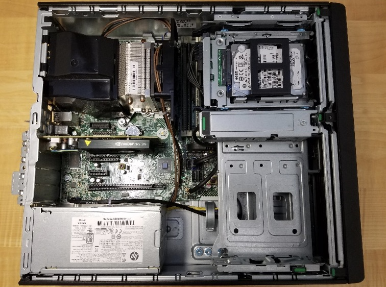
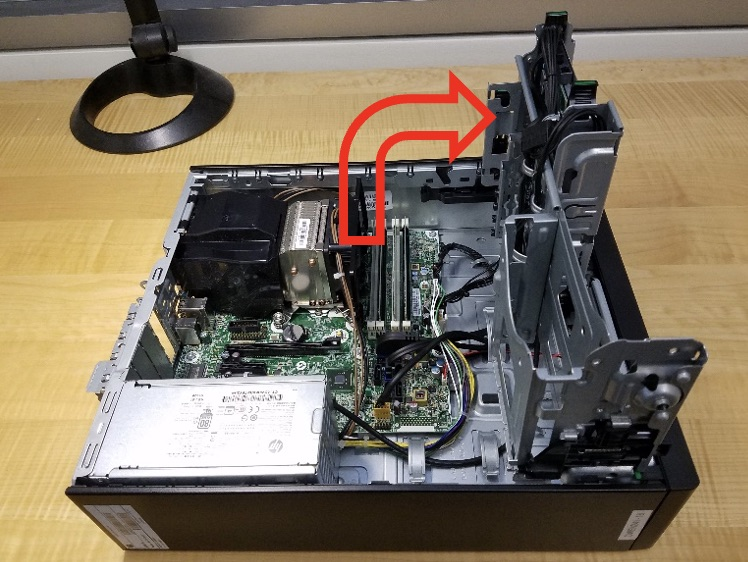
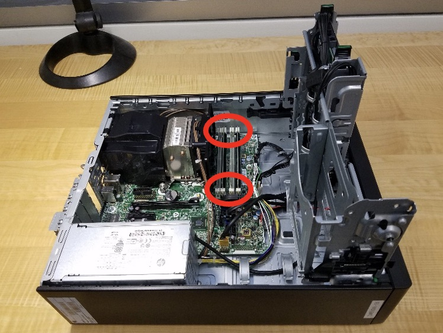
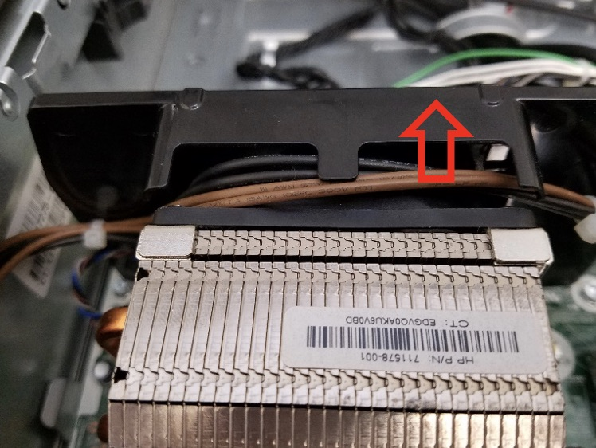
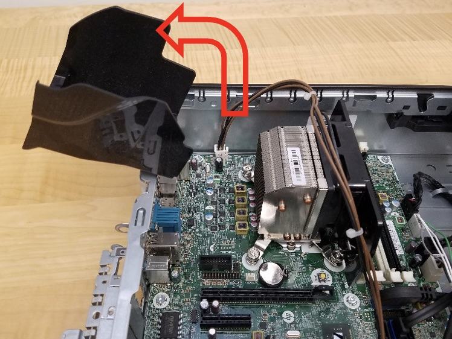
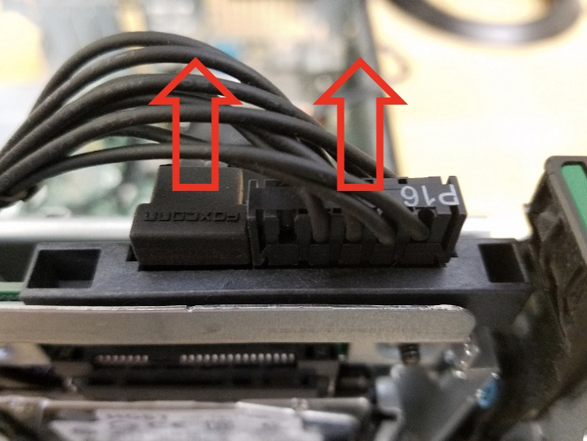
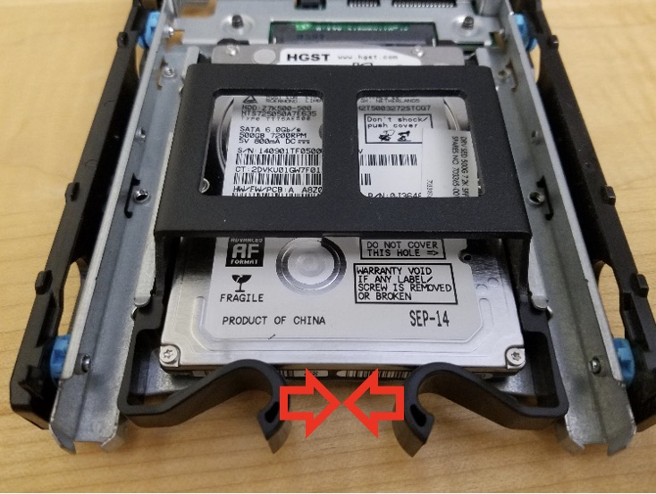
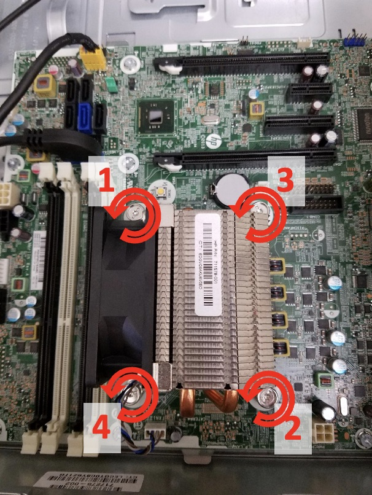
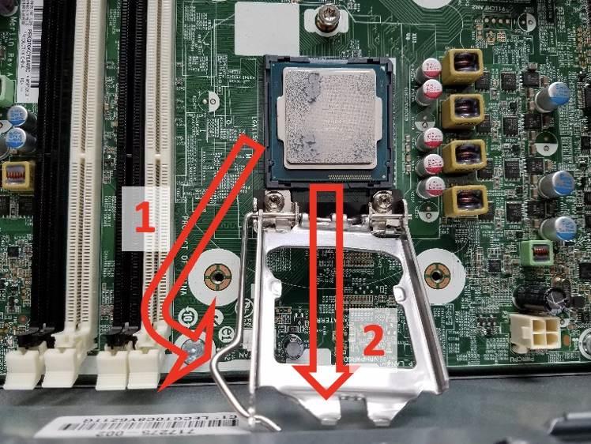
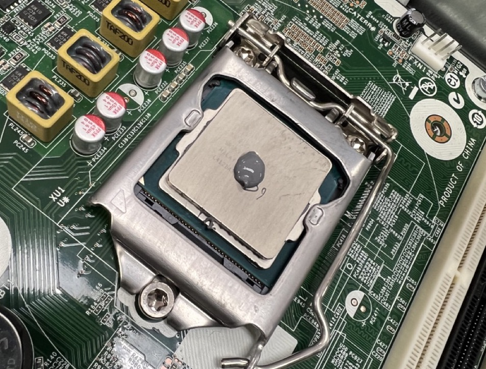

import { Steps, Aside } from '@astrojs/starlight/components';
import LetterList from '@components/LetterList.astro';

{/* LOs:
- LO1: Build a functioning general-purpose computer from scratch.
- LO6: Produce written documentation of system problems, solutions, processes, and procedures.
*/}

Welcome to your first day as an intern at **Pinnacle Provisions**, a regional restaurant chain with six locations and no IT department. The owner, Gerald, walked you to the back office, pointed at a dusty desktop PC on a folding table, and said, "This is the server. It's been making a noise." It has, in fact, been making several noises.

Before you can do anything useful at this company, you need to understand what you are working with. In your team, you will perform a full disassembly of this business-class PC, identifying every component, from the CPU to the power supply, and then put it all back together.

<Aside type="note">
- This lab assignment will be turned in *on paper* during the lab itself.
- Labs cannot be turned in outside of the actual lab time.
- Scanning and uploading your TA-validated answers in PDF on Canvas can be done after the lab.
</Aside>
The machine is on the table. Your task is a complete disassembly followed by a meticulous reconstruction. Each body is different, and these proprietary cases have their own unique anatomy. We've provided some diagrams, but you'll need to rely on your training and the provided texts for the rest. You have about 45 minutes before Gerald comes back to check on your progress. Let's see clean work and no leftover parts.

## Before You Start

Read the following rules carefully:

1.  Pull plugs straight up and out -- try not to bend them too far out of alignment. That said, a little wiggle can help unseat them.
2.  Some of these connectors are tight -- resist the urge to pull on the cables: **only pull on the plugs!**
3.  Try not to touch the electrical pins and connectors on the edges of RAM, cards, and the CPU.
4.  Carefully cut any zip ties that are tying a cable bundle to the side of the case. **DO NOT** cut zip ties that hold a bundle of cables together.
5.  Hang loose cables out of the case as much as possible.
6.  Before disconnecting any plug, take a picture of its connection and orientation.
7.  Whenever you unscrew screws, bundle the related ones together, write on a piece of tape where they came from, and then use that tape to stick them to your desk.
8.  When removing tight connections from the motherboard, brace it so that it doesn't flex too much as you push or pull.
9.  Be careful not to drop the screwdriver onto the motherboard: the sharp blade can cut an electrical trace - those straight and diagonal wires embedded on the surface of the motherboard - destroying it.

<Aside type="danger" title="Safety Warnings">
-  **Do not stick any screwdrivers or conductive objects into the holes on the side of the power supply unit (PSU), and do not attempt to disassemble it.** The capacitors inside store enough charge for weeks to kill a human!
-  **Avoid touching the silver thermal paste squished between the CPU and heatsink.** It is often poisonous if you ingest it. If you accidentally get some on you, just wash it off with soap and water.
</Aside>
## Supplies Provided

- Paper for answering questions (bring your own pen or pencil)
- One of our class desktop PCs
- Torx T15 screwdriver
- Anti-static wrist strap
- Thermal paste
- Paper towels

## Abbreviations

- **MOBO** or **MB**: Motherboard
- **GPU**: Graphics Processing Unit
- **RAM**: Random Access Memory, i.e., memory stick
- **PSU**: Power Supply Unit
- **HDD**: Hard Disk Drive
- **SSD**: Solid State Drive
- **CPU**: Central Processing Unit, i.e., processor or chip

## Questions

Watch for the answers to these questions as you follow the tutorial below. Consider assigning one person to read through them and look for answers during the lab.

1.  What is the serial number of the case (this is the unique identifier for this computer)? (3 Points)
2.  What kind of video card was installed in the system? *Hint: the card's model number is three characters followed by three numbers.* (3 Points)
3.  What is the maximum wattage of the PSU? (3 Points)
4.  What is the serial number (sometimes abbreviated SN or S/N) of the HDD? (2 Points)
5.  A SATA port seems to be missing on the motherboard. Which one? (3 Points)
6.  The frequency oscillator that provides a clock signal for the USB and Ethernet standards is labeled as 25.000H421. This seems correct, as 25MHz is the fundamental frequency of Ethernet. What is the likely oscillator frequency that supplies the clock signal for the CPU? The part is labeled Y2 on the MOBO. (3 Points)
7.  Only CPUs of a certain type will fit into the socket on the MOBO. What kind of socket is on this MOBO? *Hint: the printed label begins with “LGA”.* (3 Points)
8.  What company makes the CPU hold-down? *Hint: the company name has an animal in it.* (10 Points)
9.  What kind of video jacks are built into the motherboard? (2 Points)
10. How many actual USB jacks does this system have? (2 Points)
11. Find the temperature probe, at the end of a black cable, whose other end plugs into the MOBO. Is this temperature probe situated in an air intake or exhaust? (4 Points)
12. Does that fact that the probe is in an air intake or exhaust bother you? Why or why not? There aren't right or wrong answers to this, but we do want to see some logical, coherent thought on this. (2 Points)

## Tutorial

You will be first disassembling the computer, then reassembling it. The reassembly will be done in the reverse order as the disassembly. Please read the *additional* reassembly notes. Make sure to follow each step carefully, and take your time. If you have questions, ask your TA.

### Disassemble the PC

<Steps>

1. **Ensure power is disconnected from the computer!** 

2. Once the power cord is disconnected **and** the PSU is turned off (if there is an external switch), press the PC power button.

3. **Remove the case side panel** (unlatch by lifting handle)

    

4. **Remove the GPU**

    <LetterList>
    - Lift card slot retention latch (with a green sticker).
    - Hold in white lever on base of GPU card slot, note how the retention piece moves out of the card slot.
    - Firmly yet carefully pull the GPU straight up.
    </LetterList>

5. **Rotate the large metal HDD cage holder** to point straight up

    

6. **Remove all four RAM sticks**

    <LetterList>
    - For each stick, simultaneously push down the two white retention latches.
    - Guide each stick out as the latches move downward.
    </LetterList>

    

7. **Remove the PSU**

    <Aside type="danger" title="Safety Warning">
    Do not stick any screwdrivers into the holes on the side of the PSU, and do not attempt to disassemble it. The capacitors inside store enough charge for weeks to kill a human!
    </Aside>
    <LetterList>
    * Guide the power cable that connects the PSU to the jack on the MOBO labeled PWRCPU out of the black plastic CPU heatsink fan shield.
    </LetterList>
    
    <LetterList start={2}>
    * Rotate the black plastic CPU airflow guide upwards, until it is pointing straight up, and then pull upwards to remove it from the case (the picture below shows it rotated *past* straight up). Set it aside.
    </LetterList>
    
    <LetterList start={3}>
    * Disconnect the white plug (labeled P3) from the PWRCPU jack on the MOBO by holding in the little white retention clip and then pulling straight up. The other end of this wire goes to the PSU.
    * Remove the black plastic shield that is attached on the blade end of the CPU heatsink fan by pulling it straight up.
    * Remove the audio cable that connects the front panel audio jacks to the motherboard header labeled FRONT AUD (with a blue plug) by pulling it straight up (this cable is in your way -- it's not part of the PSU).
    * Disconnect the white power switch command plug (labeled P2) from the white MOBO header labeled PWRCMD. The other end of this wire goes to the PSU.
    * Disconnect the white main power plug (labeled P1) from the white MOBO jack labeled PWR. The other end of this wire goes to the PSU.
    * Using a screwdriver, unscrew the three screws from the back of the PSU on the outside of the case that hold the PSU to the case.
    * On the inside of the case, press the metal latch down that is preventing the PSU from sliding towards the front of the case, then slide the PSU towards the front of the case.
    * Pull the PSU up and out.
    </LetterList>

8. **Remove the HDD, SATA data cables, and SATA power cables**

    <LetterList>
    * Disconnect the SATA power and data cables from the back of the hard drive by pulling straight up. Be careful! These plugs and headers are extremely fragile when bent towards the top or bottom of the drive!
    </LetterList>
    
    <LetterList start={2}>
    * Squeeze the two green HDD caddy handles inwards, and pull both up to remove the drive caddy from the case. Be careful -- HDDs are extremely sensitive to being dropped!
    * Squeeze the smaller black handles that keep the small HDD in the larger caddy, and carefully remove the HDD from the caddy.
    </LetterList>
    
    <LetterList start={4}>
    * Remove the black plastic frame around the HDD by simply bending it and pulling the pins out.
    * Disconnect the other end of the black SATA data cable from the MOBO jack labeled SATA0 by pulling it straight up. The other end of this cable went to the HDD.
    * Disconnect the other end of the black SATA power cable from the MOBO jack labeled SATAPWR0 by holding in the little black retention clip and then pulling straight up.
    * Fish the SATA power and data cables out of the case, bending the little curved metal holders gently out of the way. Remember to take your own picture of how they're arranged, first!
    </LetterList>

9. **Remove the case front bezel (aka panel)**

    <LetterList>
    * Carefully rotate the large metal HDD cage holder back down to its original, stowed position.
    * Gently and simultaneously pull the three black clips with green tips that are holding the front bezel to the case upwards, and rock the front panel away from the case.
    </LetterList>
    
10. **Detach the CPU from the MOBO**

    <LetterList>
    * Disconnect the white plug, on the cable coming from the CPU heatsink fan, from the MOBO header labeled CPUFAN.
    * Remove the four screws that hold the CPU heatsink and fan to the MOBO and CPU. Turning each screw counter-clockwise half a turn at a time, alternate unscrewing each screw in a zig-zag pattern (as shown below). Test to see if the heatsink and fan are loose periodically as you unscrew the mounting screws.
    </LetterList>
    
    <LetterList start={3}>
    * When the heatsink comes off, store it upside down, on its top (i.e. the side that wasn't touching the CPU).
    </LetterList>

    <Aside type="danger" title="Safety Warning">
    Avoid touching the silver thermal paste squished between the CPU and heatsink. It is often poisonous if you ingest it. If you accidentally get some on you, just wash it off with soap and water.
    </Aside>
    <LetterList start={4}>
    * Use a paper towel to wipe the old thermal paste off the top of the CPU (be careful not to push hard or obliquely on it) and from off the CPU heatsink fan, and then throw the paper towel away.
    * Carefully push the CPU retention lever away from its catch, and pivot it to rest against the case wall. Then pivot the CPU hold-down buckle up and off the CPU, resting it against the case wall.
    </LetterList>
    
    <LetterList start={6}>
    * Gently, holding it only by the edges, being careful not to touch the pads on the bottom side, lift the CPU as straight up as you can. Put it on a paper towel upside down (contact pad side up) after cleaning any residual thermal paste off the top with a paper towel.
    * Push the hold-down back into place, and re-secure the retention lever. Be really careful not to touch the pins in the CPU socket on the MOBO -- if you bend just one of them, the entire MOBO is garbage. MOBOs normally ship with a little plastic shield in place of a CPU just to protect the pins.
    </LetterList>

11. **Remove the MOBO from the case**

    <LetterList>
    * Disconnect the black plug of the front panel's power switch/LED cable from the MOBO jack labeled PB/LED.
    * Note that you already removed the audio cable that connects the front panel audio jacks to the MOBO header labeled FRONT AUD (with a blue plug). This was in your way when removing the PSU.
    * Disconnect the yellow plug, of the black cable coming from the front panel's USB 2.0 jacks, from the MOBO jack labeled FRONT USB.
    * Disconnect the large black and blue plug, of the black cable coming from the front panel's USB 3.0 jacks, from the blue MOBO jack labeled FRONT USB 3.0. It won't be easy, so rock it ever so slightly back and forth, long-ways.
    * Disconnect the small white plug, with the red and black wires coming out of it that lead to the speaker in the front of the case, from the tan jack on the board labeled SPKR. This will be hard -- try to get a finger nail in between the plug and the jack. Resist the urge to pull on the wires: they will break and separate from the plug!
    * Find and then remove the 8 large screws that are holding the MOBO to the case. Do not remove the three screws around the CPU socket: they are only used to secure the CPU hold-down to the MOBO.
    * Unseat the MOBO from the case by pulling the edge closest to the front of the case up and towards the front. When it snaps loose, pull it up and out. As you pull the MOBO away from the back of the case, watch out for the metal “fingers” on the inside of the back of the case that push against the primary external jack blocks on that edge of the MOBO. Carefully put the MOBO on the desk right side up, and touch it only on the outer edge.
    </LetterList>
</Steps>

When cases are purchased separately, what you're left with is the normal condition that they arrive in.

### Reassemble the PC

Read these notes, then follow the disassembly steps in reverse to reassemble the PC!

<Steps>

1. When you get to the step where you need to reattach the CPU heatsink/fan, apply a rounded blob of thermal paste about the diameter of a USB-C port (like on a smartphone), with the blob half as tall as the port is wide, to the top of the CPU (which should already be fastened down on the MOBO). When you squish the paste down by tightening the screws, it squishes out the air bubbles. If you remove the heatsink to look, you'll likely need to wipe it all off and re-apply. In general, if the paste squishes out the sides of the contact area between heatsink and CPU, you've used too much.

    

2. When tightening the CPU screws down, you only need to make the connection be “tight”, which is far more than finger tight, but not so far that the MOBO splits or the CPU breaks. Don't over tighten the screws! Note that the screws that attach the CPU heatsink have springs on them: you don't want to tighten this so far down that the springs are 100% compressed. I know that it's hard to see, but shoot for about ¾ spring compression. This is obviously a bit subjective!

3. Check for extra parts. If you have any, take it back apart again until you can add the extra parts into the computer, then reassemble fully.

</Steps>

You're done! To receive credit for this lab, you must turn in all tools, a paper with all your questions and all your names on it, and your fully-assembled computer. If the computer is not fully assembled, this lab is worth zero points.

Gerald comes back, presses the power button, and the machine does not POST. He stares at it for a long time. Then he stares at you for a long time. "We're going to the cloud," he says. Congratulations, you have been promoted from intern to sole IT person. Proceed to Lab 1b.

{/* TODO: consider extra-credit installing Proxmox on a machine -- to be tested and need screen, peripherals, USB with installer */}
{/* TODO: consider acquiring beelink NAS to install proxmox, trueNAS, or similar locally */}