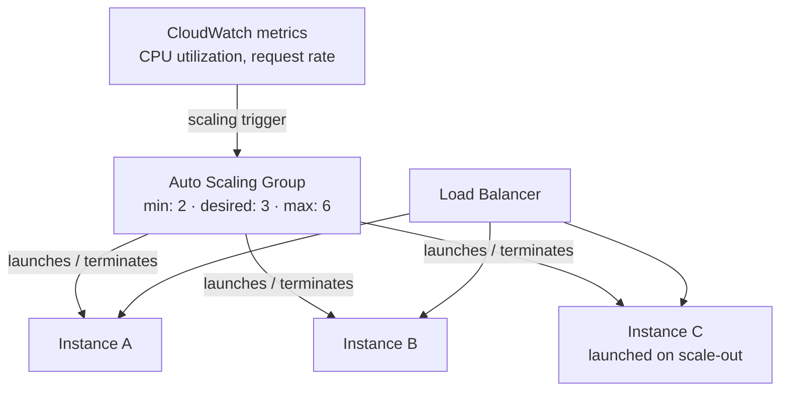
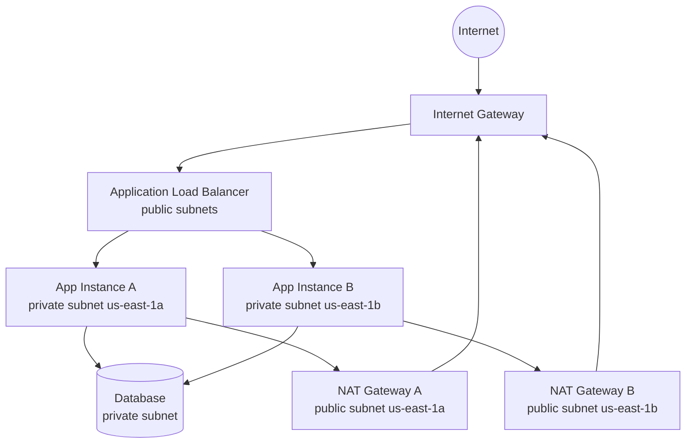
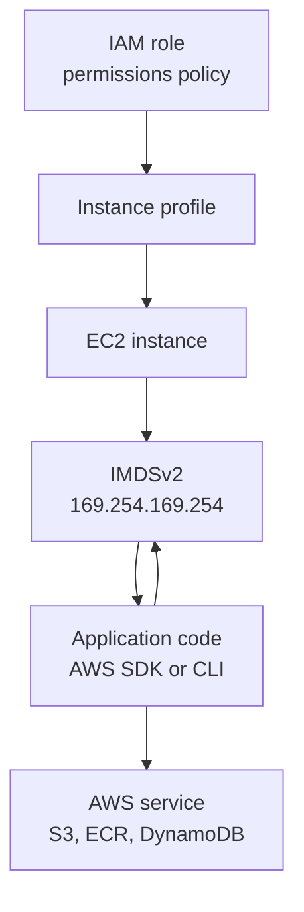
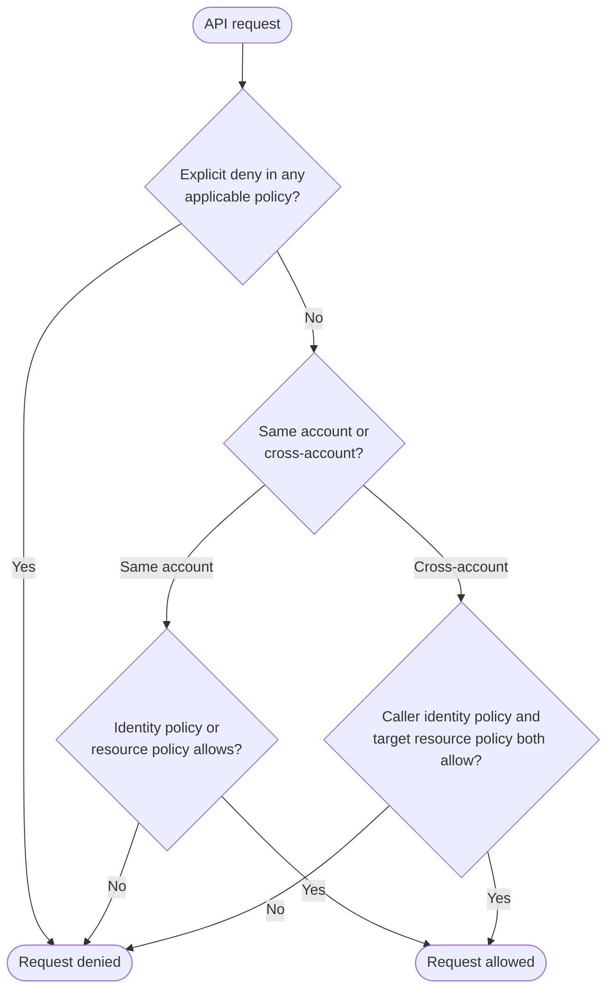

import { Aside } from '@astrojs/starlight/components';
import HistoricalNote from '/src/components/HistoricalNote.astro';

{/* ai-summary
type: lecture
slug: cloud-computing
order: 6
covers: cloud service models; regions/AZs and shared responsibility; EC2; VPCs, subnets, routes, and security groups; EBS vs S3; IAM roles/policies; ECR and cost awareness
prereq_lectures: virtualization-basics, networking-fundamentals, containerization-with-docker
followup_lectures: infrastructure-as-code, configuration-management, ci-cd
paired_activities: aws-console-tour
supports_labs: image-registry-and-version-switching, first-infrastructure-stack
*/}

An EC2 instance is the most visible unit of AWS infrastructure, but it is not the most important one to understand. The majority of cloud security incidents and production failures trace back not to compute, but to the layers underneath: a misconfigured network that exposes a database to the internet, a missing IAM role that forces engineers to hardcode credentials in application code, a storage choice that performs poorly for the actual access pattern, or a container image published to a public registry by accident. These are architectural and configuration problems, and they occur before an instance ever runs.

This lecture examines four foundational layers of AWS infrastructure that underpin virtually every workload: virtual networking (VPCs, subnets, and security groups), identity and access management (IAM), storage (EBS and S3), and container registries (ECR). Understanding these as a system, rather than as isolated features, is what separates engineers who provision cloud resources from engineers who design and operate cloud infrastructure.

## Cloud Service Models

Cloud providers offer services at different levels of abstraction. The level you choose determines how much infrastructure you manage yourself versus how much the provider handles.

**Infrastructure as a Service (IaaS)** gives you virtual machines, networks, and storage. You install and manage the operating system, middleware, and applications yourself. AWS EC2 is the canonical example; Google Compute Engine and Azure Virtual Machines are equivalent offerings from other providers. IaaS is the right level when you need control over the OS, kernel configuration, or software stack that a higher-level service would hide from you.

**Platform as a Service (PaaS)** removes the operating system from your responsibility. You deploy application code, and the platform handles scaling, patching, and runtime management. AWS Elastic Beanstalk, Google App Engine, and Heroku fit this category. PaaS trades operational control for operational simplicity: you cannot tune kernel parameters or install arbitrary system packages, but you also do not have to manage OS updates or rotate TLS certificates manually.

**Software as a Service (SaaS)** is the fully managed end of the spectrum. You consume the application through a browser or API with no infrastructure management at all. Google Workspace, Slack, and Salesforce are SaaS products.

The IaaS/PaaS/SaaS spectrum is a simplification; many contemporary products blur the lines. [Vercel](https://vercel.com/) and [Netlify](https://www.netlify.com/) sit somewhere between PaaS and SaaS: you deploy code and they handle the runtime, scaling, CDN distribution, and TLS, but the product is specialized enough for web frontends that it does not feel like a general-purpose platform. [Supabase](https://supabase.com/) is an example of **BaaS (Backend as a Service)**: it provides a managed Postgres database, authentication, storage, and a REST API, all bundled together and accessible without provisioning any infrastructure. You interact with it through an SDK, not through server management. BaaS products occupy a narrower, higher-level niche than PaaS: they provide complete backend services rather than a general-purpose compute platform. The underlying infrastructure is IaaS that somebody else manages; what you consume is closer to SaaS. Where your application falls on this spectrum has real consequences for hiring, customization, and lock-in, not just for operational burden.

<Aside type="tip" title="Choosing a Service Model">
A useful rule of thumb: start with the highest level of abstraction that meets your requirements, and move lower only when you need control that the higher level does not provide. If PaaS handles your web application well, there is no operational advantage to managing your own VMs for that workload.
</Aside>

These models are not mutually exclusive. A single organization typically uses all three simultaneously: custom software running on EC2 (IaaS), a customer-facing API deployed on Elastic Beanstalk (PaaS), and company email through Google Workspace (SaaS).

### Renting vs. Building a Cloud

The IaaS/PaaS/SaaS spectrum describes the abstraction level you operate at, but it does not describe who owns the physical infrastructure underneath. That is a separate question with two answers: you can rent it or you can build it yourself, and the choice has real consequences for cost, control, and operational burden.

The simplest path to cloud infrastructure is renting from a public provider. You pay for resources on demand, the provider manages the physical layer, and you access everything through APIs and web consoles. AWS, Azure, and GCP are the dominant hyperscalers at this tier, offering hundreds of managed services, dozens of global regions, and the largest ecosystems of tooling and documentation. Not every alternative to the hyperscalers is an on-premises deployment, though. [Hetzner](https://www.hetzner.com/), a German hosting company, offers VPS instances and dedicated servers at prices substantially lower than AWS. A Hetzner VM running the same workload as a comparable EC2 instance often costs a fraction of the price, and data stays within the EU by default. The tradeoff is scope: Hetzner has fewer regions, no managed IAM equivalent, a much smaller managed-service catalog, and none of the Kubernetes, serverless, or AI services that AWS has built over two decades. For workloads that need only VMs and straightforward networking, it is worth considering. For workloads that depend on RDS, Lambda, EKS, or the networking primitives covered in this lecture, the hyperscalers are harder to avoid.

Alternatively, organizations can build a private cloud using on-premises hardware and software such as [OpenStack](https://www.openstack.org/) or [Proxmox VE](https://www.proxmox.com/en/proxmox-virtual-environment/overview). A private cloud requires a larger initial investment in hardware and engineering but gives full control over data residency and can be cost-effective at large scale once the infrastructure is amortized. The tradeoff is operational burden: you own the hardware failures, the network upgrades, and the capacity planning.

A middle path between owning a facility and renting capacity from a public cloud is **colocation** (colo). You buy and own the physical servers, but you rent rack space, power, and network connectivity inside a professional datacenter. You get physical security, redundant cooling, and carrier-grade internet access without the cost of building your own facility. The hardware is yours; the building is not. This model is common in industries with strict data sovereignty requirements that preclude public cloud but where organizations do not want to staff a physical security team for their own server room.

A newer variant of the build-your-own model is the **cloud computer** approach, represented by companies such as [Oxide Computer Company](https://oxide.computer/). Oxide produces an integrated rack unit with a built-in control plane that exposes AWS-like API access to your own hardware, running on your premises or in a colo. The pitch is cloud-like operations (API-driven provisioning, software-defined networking) without sending workloads or data to a public provider. These products are aimed at enterprises that need the operational model of the cloud but cannot or will not use a third-party provider. They are a small but interesting segment of the market because they challenge the assumption that cloud-like operations require cloud-provider ownership of the physical layer. The rest of this lecture uses AWS as the concrete example; its terminology has become the industry's shared vocabulary and the concepts translate directly to other providers.

<Aside type="caution" title="Cloud Does Not Mean Cheap">
Public cloud costs scale with consumption. Forgetting to shut down unused instances, choosing oversized instance types, or neglecting storage lifecycle policies can result in unexpectedly large bills. Billing alerts are not optional; they are a basic operational responsibility.
</Aside>

## Regions, Availability Zones, and the Shared Responsibility Model

AWS organizes its global infrastructure into **regions**, each a geographic cluster of data centers. Examples include `us-east-1` (Northern Virginia), `us-west-2` (Oregon), and `eu-west-1` (Ireland). Within each region, AWS operates multiple **availability zones** (AZs): physically separate facilities with independent power, cooling, and networking, connected by low-latency links. An AZ label like `us-east-1a` identifies one zone in your account's mapping for that region, but those letter assignments are not stable across accounts. The stable cross-account identifiers are AZ IDs such as `use1-az1`.

Why does this matter operationally? If you deploy an application in a single AZ and that facility loses power, your application goes down. Spreading resources across two or three AZs within the same region provides resilience against localized failures without the complexity of multi-region networking. Region selection also affects latency (choose a region geographically close to your users), regulatory compliance (some data must remain within certain jurisdictions), and cost (pricing varies by region).

The **shared responsibility model** defines who secures what, but the boundary moves depending on the service model. AWS is responsible for the security *of* the cloud: the physical data centers, the hypervisor layer, the global network backbone, and the underlying infrastructure of managed services. You are responsible for security *in* the cloud: the way your resources are configured, the permissions you grant, and the way your applications and data are handled. On EC2 that includes operating system patches and host firewall rules. On more managed services such as Lambda or RDS, AWS takes over more of the underlying system maintenance while you still control access policy, network exposure, and application behavior.

<Aside type="caution" title="A Common Misconception">
"It's in the cloud, so AWS handles security" is dangerously wrong. The majority of cloud security incidents stem from customer misconfigurations, not AWS infrastructure failures. Misconfigured security groups, over-permissive IAM policies, and unencrypted S3 buckets are your responsibility, not Amazon's.
</Aside>

<HistoricalNote title="AWS Started as an Internal Headache (2002-2006)">
AWS did not begin as a product. In the early 2000s, Amazon's engineering teams were struggling to build new features quickly because every new service had to provision its own infrastructure from scratch. In 2002, Andy Jassy (now Amazon's CEO) was tasked with solving the problem by building standardized infrastructure services, including storage, compute, and databases, that any internal team could consume via API. The platform worked well enough internally that someone noticed: if it was useful to Amazon's own engineers, it would be useful to developers everywhere. Amazon S3 launched publicly in March 2006; EC2 followed in August 2006. The initial EC2 offering included a single instance type, roughly equivalent to a 1.7 GHz Xeon with 1.75 GB RAM, at $0.10 per hour. Google App Engine arrived in 2008 as a PaaS offering, and Microsoft Azure followed in 2010. Comparable large-scale public cloud competition emerged soon after, but AWS's 2006 head start in developer-facing infrastructure gave it a first-mover advantage it has never fully relinquished.
</HistoricalNote>

## The EC2 Instance Model

EC2 instances are the compute unit that everything else attaches to. Understanding three concepts, instance families, AMIs, and key pairs, is enough to reason about most EC2 decisions without needing to memorize every launch option.

### Instance Families and Types

EC2 instance types follow a naming convention like `t3.micro` or `m6i.xlarge`. The letter prefix indicates a **family** optimized for a particular workload profile. The `t` family provides burstable CPU performance for workloads with variable utilization; the `m` family offers a balanced ratio of compute, memory, and networking suited to general-purpose servers; the `c` family is compute-optimized for CPU-intensive work; the `r` family is memory-optimized for in-memory databases and caches. The number after the letter indicates the generation (higher is newer and generally more cost-effective for equivalent performance). The suffix after the dot indicates the size, from nano up through 2xlarge, 4xlarge, and beyond, each step roughly doubling the available resources.

The burstable [t3 family](https://aws.amazon.com/ec2/instance-types/t3/) deserves special attention because it behaves differently from the rest. Rather than guaranteeing a fixed CPU allocation, `t3` instances earn CPU credits when running below their baseline utilization and spend those credits during bursts. In **Standard** mode, exhausting the credit balance throttles performance to the baseline. In **Unlimited** mode, the default for T3, the instance continues bursting but AWS charges for surplus credits consumed above what the instance earns. This suits workloads with irregular CPU demand, but it can mask sustained-load problems until they show up as latency or unexpected charges on the bill. If the CloudWatch CPU credit balance metric approaches zero consistently, the workload has outgrown the T family and belongs on an `m` or `c` instance instead.

### Amazon Machine Images

An **AMI** is a template containing an operating system, optional pre-installed software, and configuration used to launch an instance. AWS publishes official AMIs for Amazon Linux and Windows Server. Other operating systems are commonly published either by the vendor itself, such as Canonical for Ubuntu and Red Hat for RHEL, or by community projects and AWS Marketplace publishers. The community and AWS Marketplace also offer specialized AMIs with additional software pre-configured.

AMIs serve the same purpose as virtual machine snapshots: they encode a known, repeatable starting point. Once you have configured a server the way you want, you can capture it as a custom AMI and use it to launch additional instances in an identical state. This is one of the simplest forms of infrastructure reproducibility available in AWS. The underlying goal is always the same: a known, reproducible starting point that can be launched consistently.

### Horizontal Scaling with Auto Scaling Groups

A single EC2 instance can scale vertically, meaning you stop it, change it to a larger instance type, and restart it. But vertical scaling has a ceiling, requires downtime, and does not help if the bottleneck is not CPU or memory but availability. **Horizontal scaling** adds more instances to spread load, and in AWS this is managed through **Auto Scaling Groups (ASGs)**.

An ASG maintains a desired number of instances from the same AMI and instance type. When scaling policies detect that demand has increased (based on metrics like CPU utilization or the number of incoming requests), the ASG launches additional instances. When demand falls, it terminates the excess. An ASG works in conjunction with a load balancer: the load balancer distributes traffic across healthy instances while the ASG adjusts capacity. Because every instance in the group starts from the same AMI, there is no configuration drift between them. This is also why AMI reproducibility matters so much: an ASG cannot reliably scale if the instances it launches are not interchangeable.

The mechanics of configuring ASGs fit naturally into an Infrastructure as Code context, where the desired state of the fleet is declared rather than clicked through a console. The important concept here is that EC2 capacity is fungible and disposable by design; individual instances are meant to be replaced, not maintained in place.



### Key Pairs and SSH Authentication

For Linux EC2 instances, **key pairs** are a common SSH access mechanism. When you create a key pair through AWS, you receive the private key file exactly once; AWS retains only the public key. At launch, the public key is typically injected into a default account such as `ec2-user` or `ubuntu` via `authorized_keys`. This avoids a fixed SSH password that could be guessed or reused.

Key pairs are not the only access pattern you will encounter. [EC2 Instance Connect](https://docs.aws.amazon.com/AWSEC2/latest/UserGuide/connect-linux-inst-eic.html) can inject short-lived SSH keys on demand, authenticating the request through IAM rather than distributing a long-lived private key file. [AWS Systems Manager Session Manager](https://docs.aws.amazon.com/systems-manager/latest/userguide/session-manager.html) can provide shell access without opening inbound SSH at all: the SSM agent on the instance initiates an outbound connection to the Systems Manager service, so the instance needs a path to those endpoints over HTTPS but no inbound rule on port 22. Windows instances use the key pair differently: the private key is used to decrypt the initial Administrator password rather than to populate `authorized_keys`.

When working on a team, how you manage SSH access has real security and operational consequences. The worst pattern is sharing a single private key file among the whole team. If one team member leaves, you cannot revoke their copy of the private key without generating a new key pair and redeploying to every instance. A better approach is to give each team member their own key pair and add each person's public key to the instance's `authorized_keys` file. You can then remove one person's access by deleting their entry without affecting the rest of the team. On most distributions, the `authorized_keys` file lives at `~/.ssh/authorized_keys` for the default user.

For production infrastructure, the better pattern is to avoid managing long-lived key pairs for team access entirely. EC2 Instance Connect issues a fresh key pair per connection, valid for sixty seconds, and uses IAM to control who can request a connection, but it still depends on SSH reaching the instance. If you use EC2 Instance Connect Endpoint for a private subnet, the target instance must still allow inbound SSH from that endpoint. Systems Manager Session Manager does not use SSH at all. CloudTrail records the API events around the session, such as who started it and when; if you want a transcript of what happened inside the session, you configure Session Manager to stream logs to S3 or CloudWatch Logs. With Session Manager, the instance's security group can omit port 22 inbound entirely, which removes a common attack surface. For instances in private subnets, Session Manager is especially clean if the subnet has outbound access to the Systems Manager endpoints, either through a NAT gateway or VPC interface endpoints: the agent reaches out to AWS, and no bastion host or VPN is required.

<Aside type="caution" title="Protect Your Private Key">
If you lose the private key file, you cannot retrieve it from AWS. Store it securely, set its permissions to `400` (read-only for the owner), and never commit it to a version control repository.
</Aside>

## Networking: VPCs, Subnets, and Security

When a server sits on a physical office network, networking is largely implicit: the IT department ran the cables, configured the switches, and assigned IP addresses. In AWS, you design your own virtual network explicitly, from the address space down to the routing rules. This explicitness is not bureaucracy; it is what allows you to isolate workloads, enforce traffic policies, and reason about security boundaries in a way that a physical office network never could.

### The Default VPC and Why You Should Not Use It in Production

Every AWS account comes with a **default VPC** in each region, pre-configured with public subnets in each availability zone and an internet gateway already attached. It is convenient for getting started quickly, but the default VPC is designed for experimentation, not production workloads. All of its subnets are public, which increases the chance of unintended internet exposure when public IP assignment and permissive security group rules are combined. There is no separation between tiers by default: a web server and a database launched there can easily end up with the same routing posture unless you deliberately redesign it.

Production workloads should use a custom VPC designed for the workload's specific security and topology requirements.

### VPCs and Subnets

A [VPC](https://docs.aws.amazon.com/vpc/latest/userguide/what-is-amazon-vpc.html) (Virtual Private Cloud) is a logically isolated network within your AWS account, defined by a [CIDR](https://en.wikipedia.org/wiki/Classless_Inter-Domain_Routing) block such as `10.0.0.0/16`, which provides 65,536 addresses. As covered in the Networking Fundamentals lecture, routing and address space are IP-layer concepts; AWS simply makes them explicit in software. Within the VPC you create **subnets**, each associated with a specific availability zone and carved from the VPC's address space. For a detailed reference on the topology discussed in this section, see [VPC with servers in private subnets and NAT](https://docs.aws.amazon.com/vpc/latest/userguide/vpc-example-private-subnets-nat.html) in the AWS documentation.

Subnets are classified as **public** or **private** based on their routing configuration. A public subnet has a route to an **internet gateway (IGW)**, allowing resources with public IP addresses to communicate directly with the internet. A private subnet has no route to an internet gateway; instances there reach the public internet indirectly, most commonly through a **NAT gateway** (Network Address Translation gateway) in a public subnet. Other egress patterns exist, including NAT instances, egress-only internet gateways for IPv6, and VPC endpoints for specific AWS services. Crucially, the absence of an inbound internet route means no external connection can reach a private subnet instance directly. A database server in a private subnet cannot receive inbound connections from the internet regardless of how the application is configured, regardless of bugs in application code, and regardless of what credentials an attacker might obtain. The network layer enforces the isolation before any software-level control is evaluated.

This raises an immediate practical question: if a private subnet instance is unreachable from the internet, how does a sysadmin connect to it? There are three common answers. The traditional approach is a **bastion host**: a small, hardened instance in a public subnet that you SSH into first, then SSH from there to the private instance. The bastion is the only point of external SSH exposure; everything behind it stays private. The more modern approach, and generally the better one for new deployments, is **AWS Systems Manager Session Manager**: the SSM agent running on the instance creates an outbound connection to the SSM service, so you can open a shell session through the AWS console or CLI with no inbound port open and no public IP address required, provided the instance can reach the Systems Manager endpoints over HTTPS. AWS also offers **EC2 Instance Connect Endpoint**, which allows SSH to a private subnet instance without a bastion by routing the connection through an AWS-managed endpoint in your VPC; because it is still SSH, the instance must allow inbound port 22 from that endpoint.

The more subtle design question is where your application servers belong. For a quick experiment, a single web server can live in a public subnet and accept traffic directly. In production, the common pattern separates tiers: an internet-facing load balancer sits in public subnets, application instances sit in private subnets behind it, and the database stays private the entire time.

The diagram below shows one version of this topology, a standard multi-tier setup with a load balancer fronting private application instances, each tier able to initiate outbound connections through a NAT gateway.



### Security Groups

A **security group** acts as a stateful virtual firewall. It is attached to an instance's **elastic network interface (ENI)**, which means it operates at the instance level, not at the subnet level. Every instance can have one or more security groups; each security group applies only to the instances it is explicitly attached to. A subnet contains many instances and a security group crosses none of that boundary; the two are independent constructs. You can have ten instances in the same subnet with ten entirely different security group configurations.

**Stateful** means the security group tracks connection state. If an inbound rule permits a TCP connection to arrive on port 443, the response packets are automatically allowed back out, even if there is no explicit outbound rule permitting them. The firewall knows the outbound traffic is a reply to an established inbound connection. This is the normal behavior you expect from firewalls on physical servers; it is worth stating explicitly because NACLs work differently, as described in the next section.

You define inbound and outbound rules specifying allowed protocols, port ranges, and source or destination addresses. Rules can reference either IP address ranges or other security groups as sources. Referencing security groups rather than IP addresses is particularly powerful: instead of hardcoding the application tier's IP addresses, which change as instances are replaced, you reference the application tier's security group as the permitted source in the database's inbound rule. Any instance carrying that security group may connect; nothing else may. This creates a trust relationship between tiers that scales correctly as the fleet grows.

The multi-tier topology from the diagram above uses three distinct security groups: one for the load balancer, one for the application tier, and one for the database. Each is attached to the respective instances, not to the subnets.

**Load balancer security group** (attached to the ALB):

| Direction | Protocol | Port | Source / Destination | Purpose |
|-----------|----------|------|----------------------|---------|
| Inbound | TCP | 80 | 0.0.0.0/0 | HTTP from the internet |
| Inbound | TCP | 443 | 0.0.0.0/0 | HTTPS from the internet |
| Outbound | TCP | 8080 | App tier security group | Forward to application instances |

**Application tier security group** (attached to app instances):

| Direction | Protocol | Port | Source / Destination | Purpose |
|-----------|----------|------|----------------------|---------|
| Inbound | TCP | 8080 | Load balancer security group | Traffic forwarded by the ALB only |
| Outbound | TCP | 5432 | Database security group | Connect to database |
| Outbound | All | All | 0.0.0.0/0 | Outbound internet (via NAT gateway) |

**Database security group** (attached to the database instance):

| Direction | Protocol | Port | Source / Destination | Purpose |
|-----------|----------|------|----------------------|---------|
| Inbound | TCP | 5432 | App tier security group | Accept connections from app tier only |

The database is protected by two independent controls: it is not routable from the internet (private subnet), and its security group rejects any connection not originating from an application tier instance. Neither control alone is sufficient; together they ensure that a misconfigured application cannot accidentally expose the database, and that a stolen VPC credential cannot directly query the database from outside the application tier. This is defense in depth applied at two distinct layers.

### Network ACLs

**Network Access Control Lists (NACLs)** operate at the subnet level rather than the instance level. A NACL applies to every instance in a subnet simultaneously, with no per-instance granularity. NACLs process rules in ascending numeric order; the first matching rule wins.

Unlike security groups, NACLs are **stateless**: each packet is evaluated independently with no memory of prior packets in the same connection. If you allow inbound TCP on port 443, you must also write an outbound rule allowing response traffic on the **ephemeral port range** (typically 1024-65535), because the TCP response comes back on a randomly assigned high-numbered port, not on port 443. If you forget the outbound ephemeral rule, HTTPS responses from your instances are silently dropped even though the inbound rule looks correct. This is the most common NACL misconfiguration, and it is invisible at the security group level because the packet never reaches the instance.

Most access control work is done at the security group level. NACLs are useful for two scenarios that security groups cannot handle: blocking traffic at the subnet perimeter before it reaches any instance, and expressing explicit deny rules. Security groups support only allow rules; all traffic not explicitly permitted is implicitly denied. This is sufficient for most use cases, but it means you cannot use a security group to override an allow with a deny based on a more specific condition.

<Aside type="note" title="When NACLs Express What Security Groups Cannot">
Security groups are stateful, per-instance, and allow-only. NACLs are stateless, per-subnet, and support both allow and deny.

A concrete case where a NACL is the right tool: suppose your monitoring detects a port-scanning attack from the IP range `198.51.100.0/24`. You need to block it immediately. With security groups, you cannot. Security groups only allow traffic; anything not in an allow rule is already blocked, but you cannot insert an explicit deny that overrides a more general allow. If your security group already has a rule permitting broad inbound traffic (say, for testing), there is no way to carve out a specific deny.

With a NACL, you add a rule numbered lower than any existing allow, for example rule 50, that denies all traffic from `198.51.100.0/24`. Because rules are evaluated in ascending order and the first match wins, rule 50 fires before rule 100 (the allow), and the range is blocked across the entire subnet. Rotating the block in and out is a single rule change, with no effect on any security group.
</Aside>

### How AWS Networking Maps to the OSI Model

The networking components above correspond directly to OSI layers. Thinking in layers helps when troubleshooting: if a security group rule looks correct but traffic is still blocked, check the NACL; both operate at the same layer but at different scopes. If packets arrive at the instance but the application returns errors, the problem is at Layer 7, above where security groups and NACLs operate.

| AWS Component | OSI Layer | Scope | Role |
|---------------|-----------|-------|------|
| VPC | Layer 3 (Network) | Account / region | Defines the IP address space and routing domain |
| Subnet | Layer 3 (Network) | One availability zone | A routable address block within the VPC |
| Internet Gateway | Layer 3 (Network) | VPC | The default route to the public internet |
| NAT Gateway | Layer 3-4 (Network/Transport) | Subnet | Translates private source IPs for outbound-only internet access |
| Security Group | Layer 3-4 (Network/Transport) | Instance (ENI) | Stateful per-instance firewall; rules match on IP, protocol, and port |
| Network ACL | Layer 3-4 (Network/Transport) | Subnet | Stateless per-subnet ACL; separate inbound and outbound rules required |
| Network Load Balancer | Layer 4 (Transport) | VPC | Distributes TCP/UDP connections without inspecting HTTP content |
| Application Load Balancer | Layer 7 (Application) | VPC | Routes HTTP/HTTPS requests based on host headers, paths, and cookies |

Load balancers deserve more discussion than this table can provide. The key distinction to carry forward is that a Network Load Balancer (NLB) forwards raw TCP/UDP flows, while an Application Load Balancer (ALB) understands HTTP and can make routing decisions based on URL paths, host headers, and cookies. Both sit at the public subnet boundary in the topology from the diagram above, and both receive their own security groups. Load balancers are covered later.

Every VPC, subnet, security group, route table, internet gateway, and NAT gateway you might configure manually has a direct counterpart in Terraform's AWS provider. The concepts are identical whether you manage them through the console or through code; only the management method changes.

## Storage: EBS and S3

A single server running everything on one disk conflates two very different storage concerns. AWS separates them explicitly into block storage and object storage, each designed for a distinct access pattern.

### Elastic Block Store

**EBS** (Elastic Block Store) provides network-attached block storage volumes that you attach to EC2 instances. An EBS volume behaves like a raw disk: you partition it, format it with a filesystem, and mount it. Applications access it through standard filesystem calls without knowing whether the disk is local or remote. EBS volumes persist independently of the instance lifecycle; if you stop or terminate an instance, the volume survives (subject to the delete-on-termination setting configured at launch).

EBS volume types offer different performance profiles. General Purpose SSD (`gp3`) suits most workloads and lets you configure IOPS (Input/Output Operations Per Second) and throughput independently of volume size. Provisioned IOPS SSD (`io2`) is designed for latency-sensitive databases where consistent performance under load matters more than cost. Throughput Optimized HDD (`st1`) suits sequential-read workloads like log processing, where raw throughput matters more than per-operation latency.

### Simple Storage Service

**S3** is object storage, architecturally different from block storage. Instead of mounting a filesystem, you store and retrieve discrete objects via HTTP APIs, organized into **buckets**. Each object is identified by a key, a path-like string, and can range from a few bytes to five terabytes. S3 is not a [POSIX](https://en.wikipedia.org/wiki/POSIX) filesystem; it does not support file locking, true directory traversal, or append operations in the way that traditional Unix filesystems do.

S3 is ideal for data that is written once and read many times: backups, static assets served over the web, log archives, application build artifacts, and user-uploaded files. Teams commonly use both EBS and S3 together: EBS for live database volumes where the application expects filesystem semantics, and S3 for database backups and static content delivery.

**Lifecycle policies** automate cost management by transitioning objects to cheaper [storage classes](https://docs.aws.amazon.com/AmazonS3/latest/userguide/storage-class-intro.html) over time or deleting them after a retention period. A backup workflow might move objects to S3 Glacier, an archival storage class at a fraction of the standard cost, after thirty days and delete them after one year. Configuring a lifecycle policy at bucket creation is far easier than auditing unexpected storage costs six months later.

<Aside type="tip" title="Block vs. Object Storage">
Use EBS when your application needs a traditional mounted filesystem: databases, application servers, anything that treats storage as a local disk and reads or writes files in place. Use S3 when you are storing discrete objects accessed via HTTP API: backups, images, logs, static web content. The two are complementary, not competitive.
</Aside>

## Identity and Access Management

When a single server holds everything, access control is simple in the worst way: whoever holds the root password or an SSH key can do everything. In AWS, with potentially dozens of services, hundreds of resources, and multiple people and automated systems making API calls simultaneously, that model is not just inconvenient but dangerous. IAM (Identity and Access Management) provides the framework for answering three questions: who is making this API call, what are they allowed to do, and to which specific resources?

### Users, Groups, and Policies

Historically, an **IAM user** represented a human identity inside a single AWS account, with a console password and optional access keys. You will still see IAM users in older accounts and in small one-account environments. Current AWS best practice is different: human users usually sign in through an external identity provider or [AWS IAM Identity Center](https://docs.aws.amazon.com/singlesignon/latest/userguide/what-is.html) and then assume roles with temporary credentials. For workloads and automation, the guidance is stronger still: use **IAM roles** rather than long-term access keys. If you are using the classic IAM-user model, avoid attaching permissions directly to individual users; instead, organize them into **groups** such as "developers" or "operations" and attach **policies** to the groups. In IAM Identity Center, **permission sets** serve a related but different purpose: they define the role-based access that Identity Center provisions across one or more AWS accounts, rather than acting as simple per-account groups. A policy is a JSON document specifying allowed or denied actions on specific resources.

```json title="JSON Document"
{
  "Version": "2012-10-17",
  "Statement": [
    {
      "Effect": "Allow",
      "Action": "s3:ListBucket",
      "Resource": "arn:aws:s3:::my-backup-bucket"
    },
    {
      "Effect": "Allow",
      "Action": "s3:GetObject",
      "Resource": "arn:aws:s3:::my-backup-bucket/*"
    }
  ]
}
```

This policy grants read-only access to a specific S3 bucket and nothing else. Any IAM user or role with this policy attached can list and download objects from that bucket; they cannot delete, upload, or modify the bucket's configuration.

### The Principle of Least Privilege in Practice

The principle of least privilege, granting only the permissions needed for a task and no more, is easy to state and genuinely difficult to apply consistently. AWS provides managed policies like `AmazonS3FullAccess` and `AdministratorAccess` that are convenient to attach but routinely broader than needed. A deployment process that only needs to write objects to a specific S3 bucket does not need `s3:DeleteBucket` or `s3:PutBucketPolicy`, but both are included in `AmazonS3FullAccess`. The gap between "what this policy allows" and "what this role actually needs" is exactly what an attacker exploits when credentials are compromised.

Over-permissive roles accumulate silently. A role gets an extra permission added to unblock a one-time task, and the permission is never removed. Months later, that role has accumulated access far beyond its original purpose. Regular IAM access reviews, and a habit of writing narrowly scoped customer-managed or inline policies for the specific resources and actions a workload actually requires, are the only reliable counterweight to this drift. The [IAM Security Best Practices](https://docs.aws.amazon.com/IAM/latest/UserGuide/best-practices.html) documentation is worth reading as a checklist once you understand the underlying concepts.

<Aside type="note" title="Why IAM Is Genuinely Hard">
IAM is widely regarded as the single hardest component of AWS to get right, and that difficulty has consequences beyond any individual deployment. The service covers thousands of distinct API actions across hundreds of AWS services, each with its own permission model and resource type. Applying least privilege consistently across all of them is a sustained engineering effort, not a one-time configuration. For cloud providers trying to build an AWS-compatible platform from scratch, implementing a coherent IAM layer across every service is one of the primary barriers. European cloud providers in particular have cited IAM parity as a reason they struggle to offer a complete alternative to AWS; building the compute is the easy part. The resources section links to a conversation with Quentin Adam, CEO of Clever Cloud, that goes into this honestly.
</Aside>

### Roles and Instance Profiles

**IAM roles** are designed to be *assumed* rather than permanently assigned. They provide temporary, automatically rotating credentials and are the correct mechanism for granting AWS API access to EC2 instances, Lambda functions, and other AWS services. Instead of storing access keys on an instance, which creates a static secret that could be stolen if the instance is compromised, you attach an **instance profile** containing a role. The instance can then make AWS API calls using credentials that rotate every few hours without any manual action.

The mechanism behind this is the [**EC2 instance metadata service**](https://docs.aws.amazon.com/AWSEC2/latest/UserGuide/ec2-instance-metadata.html) (IMDS), reachable from inside any EC2 instance at the address `169.254.169.254`. This address is in the [link-local](https://en.wikipedia.org/wiki/Link-local_address) range (`169.254.0.0/16`) defined by [RFC 3927](https://datatracker.ietf.org/doc/html/rfc3927), reserved for communication that must not leave the local network. AWS routes requests to this address within its hypervisor to an internal service specific to each instance. The address is accessible from inside every EC2 instance but unreachable from outside; no external actor on the internet or even in another VPC can reach it. When a role is attached via an [instance profile](https://docs.aws.amazon.com/AWSEC2/latest/UserGuide/iam-roles-for-amazon-ec2.html), IMDS exposes temporary, automatically rotating credentials at a well-known path. The AWS SDKs and CLI fetch those credentials automatically as part of their credential provider chain, so application code can call S3, DynamoDB, or any other AWS service without a credential hardcoded anywhere. Modern AWS guidance favors **IMDSv2**, which requires a session token and is more resistant to a class of request-forgery and proxy misconfiguration problems than the older IMDSv1 behavior.

<Aside type="note" title="When Does the SDK Actually Use IMDS?">
IMDS is one source in the AWS credential provider chain, not the only one. The exact chain varies somewhat by SDK and can include environment variables, shared configuration files, IAM Identity Center credentials, web identity, container task credentials, and IMDS. The important point here is simpler than the full list: when code runs on an EC2 instance with an attached role and you have not overridden credentials somewhere else, the SDK can obtain temporary credentials from IMDS automatically. This is the intended production pattern: no credentials stored anywhere, the SDK silently fetches rotating credentials on demand.
</Aside>

The sequence matters because there are several moving parts. Once you see them in order, the design becomes much less mysterious.



```bash title="Set Environment Variable"
# IMDSv2 example from inside an EC2 instance with an attached role:
TOKEN=$(curl -sX PUT "http://169.254.169.254/latest/api/token" \
  -H "X-aws-ec2-metadata-token-ttl-seconds: 21600")

ROLE_NAME=$(curl -s "http://169.254.169.254/latest/meta-data/iam/security-credentials/" \
  -H "X-aws-ec2-metadata-token: $TOKEN")

curl -s "http://169.254.169.254/latest/meta-data/iam/security-credentials/$ROLE_NAME" \
  -H "X-aws-ec2-metadata-token: $TOKEN"
```

<Aside type="caution" title="Never Hardcode Credentials">
Embedding AWS access keys in application code, configuration files, or environment variables on an instance is a common source of security incidents. Always use IAM roles and instance profiles for EC2 workloads. If credentials appear in a Git repository, treat them as compromised and rotate them immediately.
</Aside>

### Resource-Based Policies

IAM user and role policies are **identity-based**: they are attached to an identity and control what that identity can do. Some AWS services also support **resource-based policies**, which are attached to the resource itself and control who can access it.

S3 bucket policies are the most common example. A bucket policy can require that all uploads use server-side encryption, grant read access to a specific IAM role in a different AWS account, or restrict access to requests that arrive through a specific VPC endpoint. The evaluation rules are the part most people misremember. AWS first checks for explicit denies. If none apply, then same-account access is generally allowed if either the identity-based policy or the resource-based policy allows the request. Cross-account access is stricter: the caller's identity policy in Account A and the resource policy in Account B must both allow the request.

The simplified decision flow below is the mental model most engineers need first:



This is still a simplified model. Permissions boundaries, session policies, and AWS Organizations service control policies can narrow permissions further, but the deny-first rule and the same-account versus cross-account distinction are the core ideas to retain.

This distinction matters in several practical situations. Cross-account access, for example granting a partner organization read access to your S3 bucket, is commonly implemented with a bucket policy because the partner's IAM identities live outside your account's policy scope. Enforcing encryption requirements at the bucket level regardless of what caller policies say is also commonly enforced with resource-based policy controls.

As deployments grow more automated through CI/CD pipelines and container orchestration, IAM roles become the connective tissue. A CI pipeline assumes a role to push images to ECR. A Kubernetes pod running in a cloud-managed cluster assumes a role to read configuration from Parameter Store or write metrics to CloudWatch. The lectures on CI/CD and container orchestration cover the mechanics; the principle here is that temporary credentials obtained through role assumption are always preferable to static keys embedded anywhere.

## Container Registries: ECR

As covered in the Containerization with Docker lecture, an image becomes operationally useful only when you can distribute the exact same artifact to many hosts. A container registry is that distribution system. It stores versioned, immutable image layers and serves them to any host that authenticates and has permission to pull. Without a registry, deploying the same container image to multiple hosts means copying files manually or rebuilding from source on each machine; neither approach scales or supports rollbacks reliably.

**[ECR](https://docs.aws.amazon.com/AmazonECR/latest/userguide/what-is-ecr.html)** (Amazon Elastic Container Registry) is AWS's managed registry, integrated directly with IAM for access control. ECR organizes images into **repositories**, each holding multiple tagged versions of a single image. Unlike Docker Hub (the public default registry), ECR is private by default: no image is accessible without an authenticated IAM identity that holds the appropriate permissions.

The workflow has three parts. You authenticate Docker to ECR using the AWS CLI, which obtains a temporary token valid for twelve hours. You tag your locally built image with the full ECR repository URI. Then you push the tagged image. On the deployment target, the same authenticate-then-pull process retrieves the image. The EC2 instance pulling the image at deployment time uses its attached instance profile for authentication, which means no stored credentials are needed anywhere in the pipeline.

```bash title="Authenticate, Tag, and Push to ECR"
# Authenticate Docker to ECR (uses the AWS CLI to obtain a temporary token)
aws ecr get-login-password --region us-east-1 | \
  docker login --username AWS --password-stdin \
  123456789012.dkr.ecr.us-east-1.amazonaws.com

# Tag a locally built image with the full ECR repository URI and a version tag
docker tag my-app:latest \
  123456789012.dkr.ecr.us-east-1.amazonaws.com/my-app:v2.3.0

# Push the tagged image to ECR
docker push \
  123456789012.dkr.ecr.us-east-1.amazonaws.com/my-app:v2.3.0
```

A sensible tagging strategy uses both version tags (like `v2.3.0`) and a `latest` tag pointing to the most recently built image. Production deployments should reference version tags rather than `latest` to ensure reproducibility: if a rollback is needed, you need to know exactly which image was running before the incident.

ECR also supports image scanning on push. When enabled, ECR analyzes newly pushed images against a database of known CVEs (Common Vulnerabilities and Exposures) and reports findings in the console and API. Catching a critical vulnerability in a base image before it reaches production costs far less than patching it after a security incident.

## Cost Awareness

Cloud costs have a fundamentally different shape from on-premise costs. Hardware is a capital expense: you pay upfront, and then the cost is largely fixed regardless of utilization. Cloud infrastructure is an operational expense: every resource accrues charges continuously, and the meter runs whether or not anything useful is happening.

### Billing Alerts

Setting billing alerts is one of the first operational tasks in any new AWS account. AWS CloudWatch billing alarms and AWS Budgets can notify you when estimated charges exceed a threshold and send a notification via SNS (Simple Notification Service) or email. A sensible starting point is a low threshold for a learning environment and a separate threshold for any account that runs production infrastructure. When an alarm fires, the correct response is to investigate what is consuming resources and take corrective action, not to raise the threshold and continue.

### Right-Sizing and the Instance Lifecycle

**Right-sizing** means matching instance types to actual workload requirements rather than guessing large. AWS Cost Explorer and Compute Optimizer analyze utilization history and recommend smaller or differently balanced instance types. A server running at 8% average CPU utilization over thirty days could likely downsize safely, halving the compute cost with no user-visible impact. The analysis is only as useful as the time invested in acting on its recommendations.

The distinction between **stopping** and **terminating** an instance matters for both cost and data safety. Stopping an instance halts compute billing while preserving its EBS volumes; the instance can be restarted later with its storage intact. Terminating is permanent: the instance is deleted, and any EBS volumes marked delete-on-termination are destroyed. Development instances should be stopped when not in use. Production instances running continuously can benefit from Savings Plans or Reserved Instances, both of which trade a one- or three-year commitment for lower rates. Savings Plans are usually the more flexible modern option; Reserved Instances are older and more specific to a particular capacity footprint.

<Aside type="caution" title="Stopped Is Not Free">
A stopped instance does not incur compute charges, but its attached EBS volumes, any Elastic IP addresses not associated with a running instance, and any snapshots continue to generate costs. Review all associated resources when cleaning up to avoid ongoing charges from forgotten storage.
</Aside>

## Beyond the Core: Notable AWS Services

The four layers covered in this lecture, networking, IAM, storage, and container registries, underpin almost every other AWS service. But two decades of iteration have produced hundreds of additional services. A few appear in nearly every production architecture and are worth knowing by name.

On the compute side, [Lambda](https://aws.amazon.com/lambda/) is AWS's serverless function service: you deploy code and AWS executes it in response to events (an HTTP request, a message on a queue, a file uploaded to S3), charging per invocation rather than for idle capacity. Lambda suits event-driven workloads and irregular traffic well, but imposes constraints around execution duration and cold starts. [ECS](https://aws.amazon.com/ecs/) (Elastic Container Service) and [EKS](https://aws.amazon.com/eks/) (Elastic Kubernetes Service) are the two managed container orchestration services; ECS is the simpler AWS-native option and EKS is managed Kubernetes for teams already invested in that ecosystem. Both are covered further in the container orchestration lecture.

For data, [RDS](https://aws.amazon.com/rds/) (Relational Database Service) provides managed PostgreSQL, MySQL, and MariaDB databases. AWS takes over much of the database plumbing: automated backups when you enable them, patching through managed maintenance workflows, and multi-AZ failover when you choose a Multi-AZ deployment. You lose direct OS access and some advanced configuration options, but you gain significant operational simplicity compared to running a database on EC2. The tradeoff is the same as any managed service: less control in exchange for less operational burden.

For networking and content delivery, [Route 53](https://aws.amazon.com/route53/) is AWS's DNS service, handling domain registration, health-check-based routing, and latency-aware record resolution. [CloudFront](https://aws.amazon.com/cloudfront/) is AWS's CDN (Content Delivery Network), commonly placed in front of an S3 bucket or load balancer to cache assets at edge locations close to end users, reducing latency and offloading origin traffic.

Finally, [Bedrock](https://aws.amazon.com/bedrock/) is AWS's managed foundation model service, providing API access to large language models and image generation without requiring you to provision or manage GPU infrastructure. It is the entry point for teams building AI-assisted features within the AWS ecosystem.

## Takeaways

The AWS services in this lecture form a system rather than a list of independent features. Consider a realistic deployment sequence that touches all of them. An engineering team builds a container image for a new version of their application. Their CI pipeline assumes an IAM role using short-lived credentials and authenticates to ECR. It pushes the new image with a version tag to a private repository, where image scanning immediately checks for known vulnerabilities. No credentials appear in any configuration file; the IAM role and temporary token handle authentication entirely.

The deployment target is an application tier running in private subnets of a custom VPC. An internet-facing load balancer lives in public subnets and forwards traffic only to the application tier on port 8080. The application instances can reach outward through NAT gateways, or through VPC endpoints for specific AWS services, without becoming directly reachable from the internet. The database lives in a separate private subnet tier; its security group accepts connections only from the application tier's security group. Neither the application instances nor the database are directly reachable from the internet, at the routing layer and at the firewall layer simultaneously.

At deployment time, the application instances pull the new image from ECR. No access keys are stored on the instances; the instance profile attached at launch provides an IAM role that grants ECR pull permissions and S3 read permissions for configuration. A nightly job writes a database dump to S3 with a lifecycle policy that archives it to Glacier after thirty days and deletes it after one year. Billing alerts watch for unexpected cost spikes at multiple thresholds.

This is not an advanced architecture; it is the baseline for any workload that should be taken seriously from a security and cost perspective. Every element, the VPC topology, the security group composition, the IAM role chain, the storage separation, represents a specific engineering decision with specific consequences when things go wrong. Understanding why each element exists is what makes it possible to debug, extend, and improve the system rather than just operate it. The Infrastructure as Code and configuration management lectures that follow will show how to declare and automate all of it, but those tools only make sense once the underlying architecture is clear.

## Resources

- <a href="https://www.youtube.com/watch?v=g2JOHLHh4rI" target="_blank" rel="noopener noreferrer">AWS VPC Beginner to Pro (freeCodeCamp.dev) (YouTube)</a>
- <a href="https://www.youtube.com/watch?v=YMj33ToS8cI" target="_blank" rel="noopener noreferrer">AWS Identity and Access Management (IAM) (AWS Events) (YouTube)</a>
- <a href="https://aws.amazon.com/compliance/shared-responsibility-model/" target="_blank" rel="noopener noreferrer">AWS Shared Responsibility Model (AWS Documentation)</a>
- <a href="https://www.youtube.com/watch?v=z9y5eiNYhD8" target="_blank" rel="noopener noreferrer">What the US has understood about the cloud (and we haven't) (Underscore_) (YouTube)</a>
