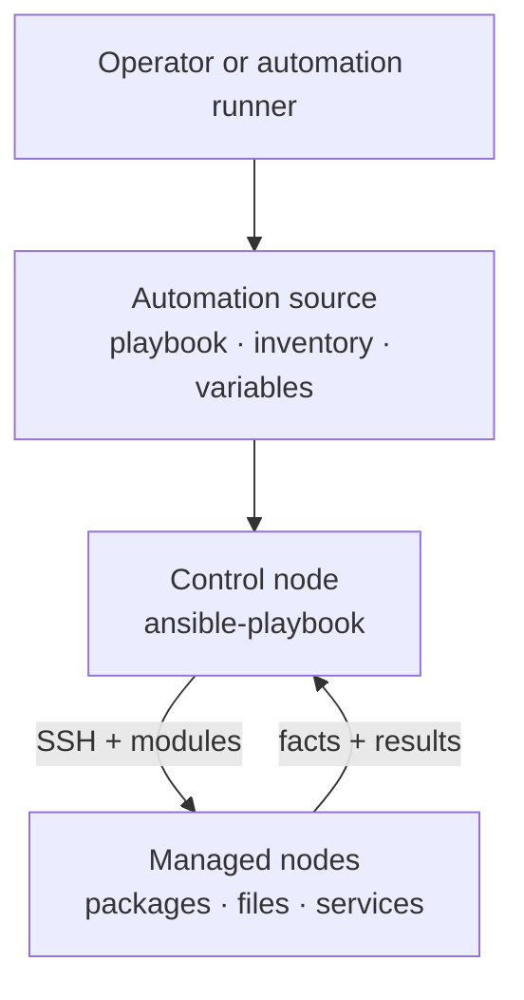
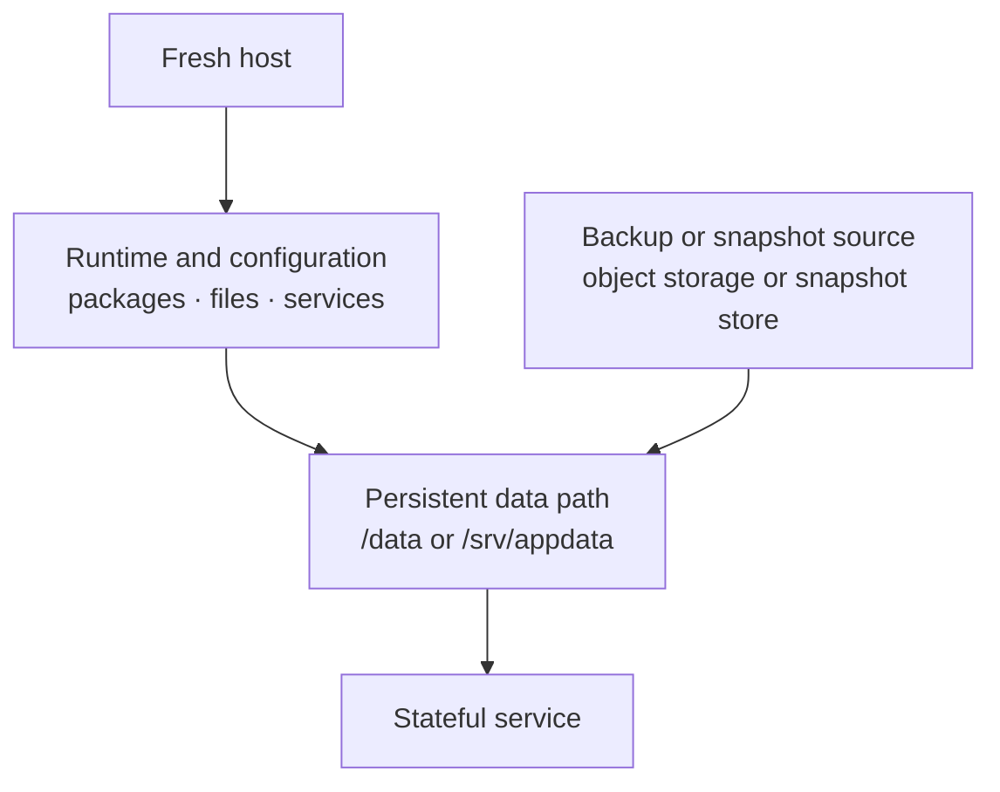
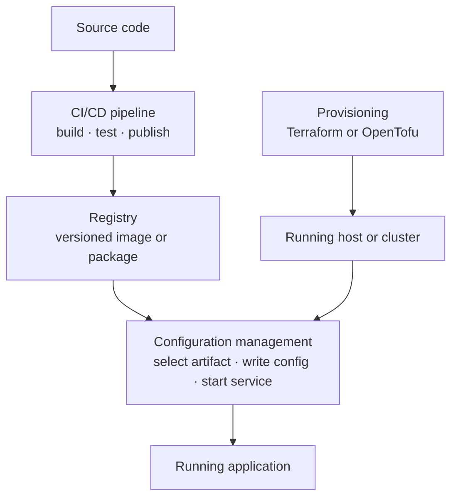

import { Aside } from '@astrojs/starlight/components';
import HistoricalNote from '/src/components/HistoricalNote.astro';

{/* ai-summary
type: lecture
slug: configuration-management
order: 9
covers: configuration drift; desired state; convergence; idempotency; Ansible architecture; inventories and variables; playbooks; task flow and conditions; roles and templates; testing automation with ansible-lint and Molecule; mutable vs immutable infrastructure; golden images; orchestration layer vs OS layer; secrets management; operational controls; endpoint and device management (MDM, UEM, Apple DDM)
prereq_lectures: shell-scripting-and-automation-basics, infrastructure-as-code
followup_lectures: ci-cd
paired_activities: 
supports_labs:
*/}

Imagine you are responsible for three web servers that must serve identical content behind a load balancer. On day one you log into each machine, install nginx, copy over a configuration file, and start the service. Everything works. A month later, a colleague patches one server but forgets the other two. Someone else tweaks a timeout setting on the third machine to debug a problem, then never reverts it. Before long, the three "identical" servers have quietly diverged. This phenomenon is called **configuration drift**, and it is one of the most common sources of mysterious, hard-to-reproduce bugs in production environments.

A server that has been hand-configured over time, accumulating one-off changes that nobody fully remembers, is sometimes called a **snowflake server**. Like an actual snowflake, it is unique, and that uniqueness is a liability. If it fails, recreating it from memory is slow and error-prone.

Configuration management is the discipline of defining and repeatedly enforcing the **desired state** of running systems. Terraform, as covered in the Infrastructure as Code lecture, is excellent at creating infrastructure objects such as virtual machines, networks, and databases. Shell scripts, as covered in the Shell Scripting lecture, are excellent at automating a sequence of commands on one machine. Configuration management sits between those layers. It answers the day-two question: once a server exists, how do you keep it configured correctly next week, next month, and after the third emergency change at 2 AM?

<Aside type="tip" title="Declarative vs. Imperative">
Desired-state thinking is a shift from imperative scripting ("do these steps") to declarative configuration ("ensure this outcome"). As covered in the Infrastructure as Code lecture, the same distinction applies to tools like Terraform: the tool reconciles reality with a description rather than following instructions.
</Aside>

This lecture uses [Ansible](https://docs.ansible.com/ansible/latest/getting_started/index.html) to explain the broader ideas behind configuration management: desired state, convergence, idempotency, inventories, reconciliation loops, reuse, secrets handling, and the tradeoffs between agentless push tools and agent-based pull tools. If the Shell Scripting lecture made the case for Bash as the right tool for single-machine automation, this lecture explains what takes over when the fleet grows beyond what any script can reliably manage.

## Configuration Management as a Discipline

Configuration management exists because infrastructure changes in two directions at once. You intentionally change servers by installing packages, updating configuration files, rotating credentials, and deploying applications. At the same time, servers also change accidentally through manual fixes, forgotten experiments, package upgrades, and partial failures. A configuration management system exists to keep the intentional changes and reject the accidental ones.

The two most important ideas in this discipline are **convergence** and **idempotency**. Convergence means the machine moves toward a declared target state each time the automation runs. Idempotency means re-running the automation does not create extra damage, duplicate work, or unintended side effects. Those properties are not unique to Ansible. They are the reason configuration management is a distinct category rather than just "better shell scripts." A shell script can be written idempotently, but that safety is something you must design carefully every time. A good configuration management system makes that the default shape of the work.

Common tools in this space include [Puppet](https://www.puppet.com/), [Chef](https://www.chef.io/), [Salt](https://saltproject.io/), and Ansible. They are all trying to solve the same underlying problem, but they make different tradeoffs about control flow, agent installation, central services, and how often enforcement happens.

The table below is worth reading as a comparison of operating models, not as a scoreboard. Different organizations land on different tools because their operational constraints differ.

| Tool | Typical model | Why teams choose it | Typical tradeoff |
|------|---------------|---------------------|------------------|
| Puppet | Pull, agent-based | Continuous enforcement and mature enterprise policy patterns | Requires agents and more supporting infrastructure |
| Chef | Pull, agent-based, Ruby-heavy | Very expressive model and strong ecosystem in some enterprises | Steeper learning curve and more abstraction overhead |
| Salt | Push and pull, flexible transport | Fast remote execution and broad targeting options | Larger conceptual surface area |
| Ansible | Push, mostly agentless over SSH | Low barrier to entry and readable YAML | Enforcement is usually operator-initiated unless you schedule it |

The push versus pull distinction matters operationally. A **push** system usually starts from a control node that opens connections to targets and applies changes now, because an operator or pipeline told it to. A **pull** system usually installs an agent that periodically asks a central service, "What should I be doing?" Pull models are attractive when you want constant background enforcement. Push models are attractive when you want minimal software on the target and explicit operator control. Neither is inherently more correct. They simply optimize for different environments.

The push-versus-pull distinction has a direct consequence that goes beyond tool selection: **enforcement frequency**. A pull-based agent on a 15-minute check interval silently corrects drift 96 times per day without any operator action. A push-based model like Ansible enforces state only when someone, or some scheduled process, actually runs the playbook. Many Ansible shops go days or weeks between full runs, which means drift accumulates in the gaps. Whether that gap is acceptable depends entirely on the workload. A stateless web tier serving read-only traffic can probably tolerate several days of unreviewed drift without meaningful risk. A server handling sensitive transactions in a regulated environment almost certainly cannot, and in that case the "lower barrier to entry" advantage of Ansible starts to look more like "lower barrier to inconsistency."

If continuous enforcement matters, Ansible has answers. [AWX](https://github.com/ansible/awx) is one of the open-source upstream projects for Red Hat's Ansible Automation Platform. It adds scheduling, role-based access control, and persistent run history to standard Ansible workflows, turning a collection of playbooks into a managed service that executes on a defined cadence. Cron jobs or CI/CD pipeline triggers are a lower-ceremony alternative for teams that do not need the full AWX feature set. The tradeoff is observability: a playbook run by a cron job at 3 AM on a single control node is easy to configure and easy to forget, while AWX retains job history, notifies on failure, and gives operators a concrete place to investigate when drift is suspected and they want to know exactly when it started.

The design tension here is between **reactive enforcement**, running the playbook when you know something needs to change, and **proactive enforcement**, running it on a schedule to catch changes you did not know had happened. Both have a place. Proactive enforcement catches the forgotten emergency fix and the unannounced package upgrade that happened during a security patch cycle. Reactive enforcement is faster when you are deploying a deliberate change and do not want to wait for the next scheduled window. Mature Ansible environments usually combine them: a nightly or weekly scheduled run for drift correction, plus manual or pipeline-triggered runs for intentional deployments.

Configuration management also sits inside a larger debate about **mutable** versus **immutable** infrastructure. In a mutable model, you keep a long-lived server and repeatedly change it in place. In an immutable model, you build a fresh image or container and replace the old instance entirely. Tools such as [cloud-init](https://docs.cloud-init.io/en/latest/) and [Packer](https://developer.hashicorp.com/packer) can push a lot of setup earlier into the lifecycle, and container platforms push even more application state into images and manifests. That does not eliminate configuration management. It narrows where you need it. Long-lived virtual machines, bastion hosts, stateful services, and mixed fleets still need a way to converge back to a known-good configuration over time.

## Why This Course Uses Ansible

This course uses Ansible because it exposes the core ideas with relatively little ceremony. If you already understand SSH, YAML, packages, services, files, and Linux users, you can get productive quickly. That makes it a good teaching tool. The important point is not that Ansible is the one true answer. The important point is that Ansible makes the underlying configuration management concepts visible instead of hiding them behind a large amount of platform-specific infrastructure.

In the [Ansible documentation](https://docs.ansible.com/ansible/latest/getting_started/index.html), the machine where you run automation is the **control node** and the targets are **managed nodes**. For the Linux systems used in this course, Ansible typically needs an SSH-reachable host and a usable Python interpreter on the remote side. The control node connects over SSH, transfers small modules, executes them, collects the results, and cleans up. No long-running daemon is required on each Linux host, and no always-on central configuration database is required just to get started.

<HistoricalNote title="Ansible Was Named After a Sci-Fi Radio (2012)">
Michael DeHaan created Ansible in 2012 after years of frustration with agent-based tools while working at Red Hat on Cobbler (a provisioning system) and Func (a remote execution framework). His goal was a tool with zero agent requirements for common Linux automation: just SSH and Python, both already present on most managed servers. He named it after the ansible, a faster-than-light communication device from Ursula K. Le Guin's science fiction novels, later used by Orson Scott Card in Ender's Game. The name reflects the aspiration that configuration management should feel instantaneous. Ansible grew quickly in the open-source community; Red Hat acquired it in 2015. Its historical importance is not that it invented configuration management. It is that it made agentless automation mainstream at a time when most large competitors expected resident agents and more elaborate control infrastructure.
</HistoricalNote>

Ansible is not magic. It is a coordination layer around YAML, SSH, Python modules, and idempotent resource descriptions. That is exactly why it is useful pedagogically. You can usually see what it is doing, and when something fails, the failure still teaches you something real about the underlying operating system.

The diagram below shows that execution model at a high level. The playbook, inventory, and variables live on the control side. The actual system state lives on the managed side. Much of the craft of configuration management lies in keeping those two views aligned without confusing the description of the system for the system itself.



## Modeling the Fleet with Inventories and Variables

An inventory is more than a host list. It is the first abstraction layer over your fleet. The moment you group hosts as `webservers`, `dbservers`, `staging`, or `production`, you are telling the automation which machines share responsibilities, which machines should receive the same configuration, and what your blast radius is when you target a group. The [Ansible inventory documentation](https://docs.ansible.com/ansible/latest/inventory_guide/intro_inventory.html) formalizes this idea, but the concept applies far beyond Ansible: any configuration management system needs some model of "which machines are these?" before it can do useful work.

Here is a simple static inventory:

```ini
[webservers]
web1 ansible_host=192.0.2.10
web2 ansible_host=192.0.2.11
web3 ansible_host=192.0.2.12

[webservers:vars]
ansible_user=deploy
ansible_python_interpreter=/usr/bin/python3

[dbservers]
db1 ansible_host=192.0.2.20

[production:children]
webservers
dbservers
```

<Aside type="note" title="SSH-Based Connection">
For the Linux hosts used in this course, SSH reachability is the starting point, not the whole requirement. If you can reach a host with `ssh user@host` and it has a usable Python interpreter, Ansible can usually manage it with the standard modules shown in this lecture. If your SSH keys are already configured, Ansible will use them automatically.
</Aside>

Three hosts are placed into the `webservers` group, one host is placed into `dbservers`, and the parent group `production` contains both. This is already doing valuable modeling work. It lets you ask focused operational questions: "Apply this web configuration to all webservers," "restart only the database tier," or "run a safety check against all production nodes." The default groups `all` and `ungrouped` exist as well, but the real power comes from designing group structure that matches how you actually think about the fleet.

Variables deepen that model. Instead of hardcoding ports, paths, users, and package names inside every task, you define them once at the right scope and let hosts inherit or override them. Ansible commonly stores these values in `group_vars/` and `host_vars/` directories alongside the inventory:

```text
project/
  hosts.ini
  group_vars/
    webservers.yml
  host_vars/
    web1.yml
  site.yml
```

If `group_vars/webservers.yml` defines `nginx_worker_processes: 4` and `nginx_listen_port: 80`, every web server inherits those values. If `host_vars/web1.yml` sets `nginx_worker_processes: 8`, that one machine diverges intentionally, in code, rather than accidentally, through a manual edit at 2 AM. That distinction is operationally crucial. Planned difference is not drift. Unrecorded difference is drift.

Ansible also gathers **facts** about each host, such as operating system family, hostname, IP addresses, CPU count, and memory. Facts let you write automation that adapts to reality instead of pretending every server is identical. Static inventories are fine for stable fleets, but dynamic infrastructure eventually pushes you toward inventory plugins that query cloud APIs at runtime. The higher-level idea stays the same: your automation needs a reliable, current model of the machines it is about to touch.

### Provisioning-to-Configuration Handoff

One subtle design problem appears as soon as you combine provisioning with configuration management: how does the configuration tool learn which machines now exist? A small static fleet can tolerate a hand-maintained inventory for a long time. Disposable cloud instances usually cannot. The handoff between "I created a machine" and "I configured a machine" becomes part of the system design.

The table below shows the common handoff patterns. Notice that they differ less in raw capability than in where truth lives and how quickly that truth goes stale.

| Pattern | How it works | Strength | Risk |
|---------|--------------|----------|------|
| Static inventory | A human-maintained hosts file records targets | Simple and explicit | Becomes stale in elastic environments |
| Generated inventory | Provisioning writes an inventory file from outputs | Clean fit for small cloud stacks | Couples tools and file formats |
| Dynamic inventory | Ansible queries the provider API at run time | Sees the current fleet state | Depends on disciplined tagging and cloud authentication |
| Orchestrated invocation | A pipeline or wrapper runs provisioning and configuration back-to-back | Creates a one-command workflow | Can blur tool boundaries if overused |

None of these patterns is universally correct. Generated inventories are often the easiest bridge from Terraform or OpenTofu into Ansible because the flow is explicit and inspectable. Dynamic inventory becomes attractive when instances appear and disappear frequently enough that file generation feels like a cache with a race condition. As covered in the Cloud Networking, Storage, and Identity lecture, the identity used to query cloud APIs is part of this design too. Inventory is not just a file problem; it is a trust problem.

## Playbooks, Tasks, and Idempotency

Inventories answer "which machines?" Playbooks answer "what should be true about them?" In Ansible's [playbook guide](https://docs.ansible.com/ansible/latest/playbook_guide/index.html), a **playbook** is a YAML document containing one or more **plays**. Each play targets hosts and contains **tasks**. Each task calls a **module**, and modules are distributed in [collections](https://docs.ansible.com/ansible/latest/collections_guide/index.html). The naming sounds mechanical, but the deeper point is conceptual layering: fleet, target set, desired state, concrete action.

This playbook shows the structure clearly:

```yaml
---
- name: Configure web servers
  hosts: webservers
  become: true

  tasks:
    - name: Install nginx
      ansible.builtin.apt:
        name: nginx
        state: present
        update_cache: true

    - name: Deploy nginx configuration
      ansible.builtin.copy:
        src: files/nginx.conf
        dest: /etc/nginx/nginx.conf
        owner: root
        group: root
        mode: "0644"
      notify: Reload nginx

    - name: Ensure nginx is running and enabled
      ansible.builtin.service:
        name: nginx
        state: started
        enabled: true

  handlers:
    - name: Reload nginx
      ansible.builtin.service:
        name: nginx
        state: reloaded
```

The play targets the `webservers` group and uses `become: true` for elevated privileges. The `ansible.builtin.apt` module manages packages, `ansible.builtin.copy` manages files, and `ansible.builtin.service` manages services. The `notify` line points at a **handler**, which is just a task that runs only if something changed and only once per play. This pattern matters because configuration management is not simply about reaching the right end state. It is about reaching it without unnecessary churn. A web server that reloads on every run is technically automated, but it is not operationally elegant.

Idempotency is the heart of the whole model. If nginx is already installed, the package task should report `ok`, not re-install it. If the configuration file on disk already matches the desired contents, the file task should do nothing. If the service is already started and enabled, the service task should leave it alone. That is why running a playbook twice is such a useful mental test. On the second run, most tasks should be boring. Boring is the goal.

This is also where the limits of declarative tooling become visible. Modules such as `apt`, `copy`, `template`, and `service` know how to inspect state before acting. Raw command execution does not. Ansible's `command` and `shell` modules are powerful escape hatches, but they are closer to scripting than to true state management. The same warning applies in every configuration management system: the moment you drop to arbitrary commands, you are stepping outside the framework's strongest guarantees and back into a world where idempotency is your responsibility.

Ansible does support ad-hoc commands, and they are genuinely useful for inspection and quick probes. `ansible webservers -i hosts.ini -m ansible.builtin.ping` is a fleet connectivity check, not an ICMP ping, and `ansible-doc ansible.builtin.apt` is a fast way to inspect module behavior locally. The useful rule of thumb is this: if a command matters more than once, it probably belongs in a playbook, because repeatability and review matter more than convenience.

### Reading a Playbook Run

Idempotency is easy to describe but worth seeing in terms of what Ansible actually reports. When a play runs, common task outcomes include `ok` (inspected, already in the desired state), `changed` (action taken and something on the system changed), `skipped` (a `when` condition evaluated to false), and `failed` (something went wrong and execution stopped). At the end of every run, Ansible also prints recap counters per host:

```
PLAY RECAP *********************************************************************
web1  : ok=6   changed=2   unreachable=0   failed=0   skipped=1   rescued=0
web2  : ok=6   changed=2   unreachable=0   failed=0   skipped=1   rescued=0
web3  : ok=6   changed=0   unreachable=0   failed=0   skipped=1   rescued=0
```

This recap tells a story. Six tasks ran successfully on all three hosts. Two of them made changes on `web1` and `web2`. Zero changes were needed on `web3`, which indicates that `web3` was already in the desired state before the run started. Nothing failed. One task was skipped on every host, probably a conditional that evaluated to false in the current environment.

On a well-maintained fleet, the second run of any playbook should produce almost entirely `ok` lines. A recap showing many `changed` items on a second run is a diagnostic signal worth investigating: either the tasks are not genuinely idempotent, the system is reverting to a different state between runs, or the definition of desired state is changing between invocations. Each of those causes has a different remedy, but the recap is the right place to start.

The `--check` flag runs the play in dry-run mode, predicting what would change without applying anything. Combined with `--diff`, modules that support diff mode can show before-and-after differences, especially for file-oriented changes. Running both together before a maintenance window is one of the cheapest risk-reduction habits available:

```bash
ansible-playbook site.yml -i hosts.ini --check --diff
```

For supporting modules, the output can show which files would change and how. It is not a perfect simulation: tasks that register results from live command output cannot always predict what a downstream conditional will do, modules executing arbitrary shell commands may not be able to pre-evaluate their impact, and some diffs are intentionally suppressed when they would expose sensitive data. For the common work of package management, file management, and service state, the preview is reliable enough to catch obvious mistakes before they reach production. Building the habit of "check and diff before apply" on any playbook targeting more than one host is worth doing early.

## Task Flow, Conditions, and Failure Semantics

The Shell Scripting lecture introduced conditionals, exit codes, and one-time setup logic in Bash. Ansible has the same operational needs, but it expresses them as data attached to tasks rather than as control-flow syntax wrapped around whole scripts. That shift matters because it lets you reason about intent one task at a time: why this task runs, what counts as change, and what should be considered a failure.

Three task-flow tools show up constantly in real playbooks. `register` captures a task result so later tasks can inspect it. `when` turns that result into a gate. `changed_when` and `failed_when` let you correct Ansible's default interpretation when a raw command does not map neatly onto the framework's idea of success or change. The example below is short, but it captures the pattern.

```yaml
- name: Check whether the bootstrap marker exists
  ansible.builtin.stat:
    path: /srv/myapp/.bootstrapped
  register: bootstrap_marker

- name: Run one-time bootstrap import
  ansible.builtin.command: /usr/local/bin/bootstrap-myapp
  when: not bootstrap_marker.stat.exists
  changed_when: true

- name: Verify the service is active
  ansible.builtin.command: systemctl is-active myapp
  register: service_state
  changed_when: false
  failed_when: service_state.stdout != "active"
```

This is the point where configuration management stops feeling like a prettier package installer and starts feeling like a systems language. A task result is not just pass or fail. It can be "ran and changed," "ran and did not change," "should be skipped," or "ran but its stdout means something is wrong." When file existence is the natural guard, `creates` and `removes` are even cleaner than a separate `stat` task because they state the gate directly. That is especially useful for imports, archive extraction, key installation, or bootstrap actions that should run once and then become boring.

Sometimes the unit of failure is larger than one task. You might need to render a configuration file, validate it, and roll back if validation fails. Ansible's `block`, `rescue`, and `always` keywords exist for exactly that situation.

```yaml
- name: Apply and validate web configuration
  block:
    - name: Render configuration
      ansible.builtin.template:
        src: nginx.conf.j2
        dest: /etc/nginx/nginx.conf

    - name: Validate configuration
      ansible.builtin.command: nginx -t
      changed_when: false

  rescue:
    - name: Restore last known good configuration
      ansible.builtin.copy:
        src: files/nginx.conf.backup
        dest: /etc/nginx/nginx.conf
```

The reason this matters is not elegance. It is operational safety. A playbook that can distinguish "no change," "healthy change," and "change that must be rolled back" is a playbook you can trust during a maintenance window.

## Reuse, Templates, and Shared Automation

As the amount of automation grows, the next problem is not syntax. It is structure. A single giant playbook works for a while, then turns into a hard-to-review blob of tasks, variables, and special cases. Configuration management needs the same kind of decomposition that application code needs. In Ansible, the first two major reuse mechanisms are **roles** and **templates**.

Roles package related tasks, handlers, files, templates, and defaults into a reusable unit with a predictable directory structure:

```text
roles/
  nginx/
    tasks/main.yml
    handlers/main.yml
    templates/nginx.conf.j2
    files/index.html
    defaults/main.yml
```

Once you think in roles, you stop asking "How do I configure this one server?" and start asking "What is the reusable definition of a web tier, a monitoring agent, or a bastion host?" That is a healthier question. It encourages consistent naming, variable defaults, and cleaner separation between generic behavior and environment-specific values.

Roles also force you to think about **variable precedence**, which is one of the first places a growing Ansible codebase becomes confusing. The override chain is useful because it lets a role publish gentle defaults while inventories or operator-supplied variables tighten those values for an environment. It is dangerous because a value can appear to come from nowhere if the team cannot explain which layer owns it. Role defaults should usually be weak suggestions, group variables should express environment-wide policy, host variables should be rare exceptions, and extra vars should be reserved for deliberate operator overrides rather than daily configuration.

Templates solve the corresponding file problem. Static file copies are fine when every target should receive exactly the same bytes. Real fleets rarely stay that uniform. Ports differ, hostnames differ, upstream backends differ, and security settings differ by environment. Ansible uses the [Jinja2 templating engine](https://jinja.palletsprojects.com/en/stable/templates/) so one configuration file can be rendered differently for each host:

```jinja2
worker_processes {{ nginx_worker_processes }};

server {
    listen {{ nginx_listen_port }};
    server_name {{ ansible_hostname }};
    root {{ app_document_root }};
}
```

The template is only half the story. The other half is the variable model behind it. `nginx_worker_processes` may come from role defaults, a group variable, or a host override. `ansible_hostname` comes from gathered facts. The rendered file is the place where abstract configuration becomes concrete operating-system state.

Ansible also separates **roles** from **collections**. A role is a reusable component inside your codebase or inside a downloaded package. A collection is the broader distribution unit that can contain roles, modules, plugins, and documentation. [Ansible Galaxy](https://galaxy.ansible.com/) is the public hub for sharing that content. This is powerful, but it comes with the same supply-chain caution as any package registry: version pinning, maintenance quality, and code review still matter. Reuse is only a win when you trust what you are reusing.

Collections deserve the same dependency discipline as application libraries. A small `requirements.yml` file records which collections the project expects and what version range the team has actually tested.

```yaml
collections:
  - name: community.docker
    version: ">=4.0.0,<5.0.0"
```

That file does two useful things. First, it makes setup reproducible across laptops, runners, and control nodes. Second, it makes dependency drift visible in code review. Using fully qualified collection names such as `community.docker.docker_container` or `ansible.builtin.copy` serves the same goal: the playbook tells you exactly which namespace owns the behavior you are relying on.

## Testing and Verifying Automation

A role that works correctly on Ubuntu will fail silently against Rocky Linux if nobody ever tested that combination. A Jinja2 template that renders cleanly with a complete variable set will raise an error during an incident response when one variable is undefined. Testing automation before it reaches production is not optional maturity work reserved for large teams with dedicated platform engineering. It is how you find out whether your assumptions about the target system are actually correct before the system does.

Two tools handle most of this verification work in the Ansible ecosystem. [ansible-lint](https://ansible-lint.readthedocs.io/) is a static analysis tool that inspects playbooks and roles for style violations, deprecated module usage, and logical mistakes that a plain syntax check would miss. It catches problems like tasks that always report `changed` regardless of whether anything actually changed, `become` directives placed in scopes where they should not be inherited, variable names that shadow Ansible built-ins, and module parameters that were renamed or removed in a recent collection release. Running ansible-lint as part of a CI pipeline turns your automation repository into something with a clear pass or fail signal on every push, rather than something that only reveals problems when it runs on a production server:

```bash
ansible-lint site.yml
ansible-lint roles/nginx/
```

Most violations reported by ansible-lint are inexpensive to fix: consistent indentation, fully qualified module names such as `ansible.builtin.apt` rather than the short-form `apt`, and explicit `state` declarations. The violations worth reading carefully are the logic warnings. A task flagged for missing `changed_when` is a task that will always report `changed`, which breaks idempotency's core promise that a second run should be boring, and also makes it impossible to tell from the recap whether the playbook actually did anything.

[Molecule](https://ansible.readthedocs.io/projects/molecule/) goes further by actually running roles inside ephemeral containers or virtual machines. A Molecule scenario provisions a test instance, applies the role under test, reruns it to check idempotence, runs a verifier to assert the expected system state, and destroys the instance when finished. In current Molecule workflows that verification step is commonly Ansible-native, often through a `verify.yml` playbook. Some teams also use [Testinfra](https://testinfra.readthedocs.io/), which lets you write Python assertions about files, services, packages, and sockets on the guest system:

```python
def test_nginx_running(host):
    nginx = host.service("nginx")
    assert nginx.is_running
    assert nginx.is_enabled

def test_nginx_listening(host):
    assert host.socket("tcp://0.0.0.0:80").is_listening
```

Those assertions do not verify every possible edge case. They do verify the thing that matters most: the role actually produces a running, enabled nginx process that is listening on the expected port. A linter cannot confirm that. Only running the role against a real operating system can.

The production tradeoff is coverage versus pipeline speed. Testing every role end-to-end in CI adds real execution time, particularly when Molecule spins up virtual machines for each scenario. Teams that invest in automation testing usually follow a practical progression: linting on every push (fast and nearly free in CPU and clock time), Molecule coverage on the most critical roles first, and lighter coverage for simpler utility roles. The calculus changes quickly the first time a broken role runs across 50 servers during a maintenance window and the only way to assess the damage is to log into each one manually. Consistent, tested roles reduce that kind of uncertainty significantly, and the roles that most need testing are usually the ones you are most confident work correctly because you wrote them and ran them a few times.

## Configuration Is Not Data

One of the most important conceptual mistakes in automation is treating configuration and persistent data as if they were the same thing. A package list, a systemd unit file, and an nginx template are configuration. Database rows, uploaded media, queue state, and a game world save are application data. Configuration management can usually recreate the first category cheaply. The second category must be preserved, backed up, restored, or intentionally discarded.

The diagram below shows the basic shape of a stateful rebuild. The runtime and configuration can be reapplied from code. The data path must be mounted or restored before the service is allowed to treat the machine as healthy.



This is why stateful services demand careful ordering. You provision the host, install the runtime, create or mount the persistent path, restore the data if needed, and only then start the service. If you reverse the last two steps, many applications happily initialize an empty directory and create a brand-new state. From the automation's perspective the service is "running." From the operator's perspective the wrong system is running.

Idempotency looks slightly different in these workflows. For package management, idempotency often means "the task makes no change when the system already matches the desired state." For data restore, it often means "the task can be safely repeated without corrupting or duplicating state." Checksums, restore markers, file existence guards, and validation tasks become important because the automation is now protecting information, not just configuration files.

## When Configuration Management Is the Wrong Tool

Configuration management excels at keeping long-lived servers aligned with a declared state over time. But long-lived servers that you manage in place are not the only way to run infrastructure, and understanding when that model stops being the right choice is as important as knowing how to apply it.

The core tension is between **repairability** and **replaceability**. In the mutable model, a server accumulates configuration over its lifetime and configuration management keeps it on track by detecting and repairing drift. That works well when servers are long-lived, carry persistent state, or are expensive to recreate. It works less well when servers are ephemeral, when the configuration is complex enough that convergence cannot fully guarantee identical state on every host, or when the pace of intentional change is high enough that the playbook is always chasing a moving target.

The alternative is to encode configuration into a machine image during a controlled build process rather than applying it at runtime on a live server. [Packer](https://developer.hashicorp.com/packer) is the standard tool for this on virtual machine infrastructure. Packer provisions a temporary instance, runs provisioners inside it (shell scripts, Ansible playbooks, or cloud-specific bootstrap tools), and captures the result as an AMI, a VM disk snapshot, or a machine image ready for deployment to your cloud provider. When a new server is needed, you launch the pre-built image. There is no post-boot convergence step, no agent polling for drift, and no gap between what the playbook declares and what is actually on disk. The image is the artifact, and it was built and verified before it was ever published.

This approach, often called **golden image** or **baked image** infrastructure, reduces configuration drift across instances to nearly zero because every instance launched from the same image contains exactly the same bits. The tradeoff is inertia. Updating a mutable server means running a playbook; the change is live in minutes. Updating an immutable image means rebuilding it, publishing it to an image registry, and replacing every running instance with the new version. For a team deploying a new application version twice a week, that replacement cycle is a manageable cost. For a team that needs to apply emergency security patches quickly across a large fleet, rebuilding and redeploying AMIs can slow the response window enough to matter.

Packer and Ansible are often used together rather than in opposition. Packer calls an Ansible playbook during the image build, capturing the provisioning work into the image at build time rather than applying it at runtime. The result is an immutable image built with a configuration management tool: you get the reproducibility of baked images without giving up the expressiveness of Ansible for the provisioning logic. The image becomes a testable, versioned artifact just like an application binary.

<Aside type="tip" title="cloud-init and First-Boot Configuration">
[cloud-init](https://docs.cloud-init.io/en/latest/) occupies a different point on this spectrum. It runs lightweight configuration tasks during instance startup, such as writing SSH authorized keys, setting a hostname, or installing a single package, without requiring a full configuration management agent. It is available on nearly every cloud provider and most base OS images. cloud-init is not a configuration management system, but it is a useful bridge between "what the image knows" and "what this specific instance needs at launch time."
</Aside>

Containers push the immutability model further still. A container image is already a fully specified, reproducible artifact. A container launched from that image behaves identically on any compliant host. In a fully containerized environment, configuration management's role at the server layer shrinks to the host baseline: the kernel, the container runtime, log forwarding, and security settings. Application configuration moves into environment variables, mounted ConfigMaps, or secrets injected at startup by the orchestrator. That does not eliminate configuration management, but it restructures where it is needed. A team running a fully containerized application tier might have very sparse Ansible automation covering the operating system baseline and a rich set of Kubernetes manifests covering the application layer.

The practically useful way to think about this is a spectrum rather than a binary. At one end, a long-lived database server accumulating years of tuning, schema migrations, and custom software is pure mutable infrastructure: configuration management is essential to keep it honest over time. At the other end, an auto-scaling group of stateless API instances launched from a versioned AMI that is rebuilt on every release is pure immutable infrastructure: configuration management at the server layer is nearly irrelevant. Most real organizations live somewhere between those poles: a containerized application tier on top of VM-based infrastructure nodes that are themselves managed with Ansible or a similar tool. Understanding where on that spectrum a given system sits is the prerequisite to choosing the right approach for it.

### Desired State at the Orchestration Layer

Kubernetes manifests describe desired state in terms that should sound familiar: "this Deployment should run three replicas of this image, exposed on this port, with these resource limits." The reconciliation loop that keeps the cluster in that state is structurally identical to what a configuration management agent does on a single host: observe the actual state, compare it to the declared state, and take actions to close the gap. The difference is the layer of the stack where that reconciliation operates.

Ansible and Puppet operate at the operating system layer: packages, files, services, users, kernel parameters, and system settings. Kubernetes operates at the workload layer: pods, Deployments, Services, volumes, and network policies. Neither tool replaces the other. A Kubernetes cluster still runs on nodes, and those nodes need a container runtime, a monitoring agent, kernel tuning, and a security baseline. You can manage all of that with Ansible. What Ansible cannot do is schedule pods across nodes, execute a zero-downtime rolling deployment of a container image update, or automatically restart a container that exits unexpectedly. Kubernetes does those things. The layers are designed to be complementary.

The practical consequence is that fully automated infrastructure usually involves two distinct codebases: one that provisions and configures the infrastructure running Kubernetes, typically with Ansible or a similar tool, and one that describes the workloads running on it, using Kubernetes manifests or Helm charts. Keeping that boundary clear matters. The common failure pattern is letting application configuration drift into Ansible variables while operations-level settings leak into ConfigMaps, until nobody is confident which layer is authoritative for a given value. The Container Orchestration lecture covers the workload side of that boundary in more detail.

## Artifacts, Versions, and Deployment Boundaries

The next important boundary is between producing software artifacts and deploying them. The CI/CD Pipelines and GitHub Actions lecture goes deeper on how pipelines build, test, and publish software, but configuration management still has to consume whatever those pipelines produce. That boundary is easy to blur if you treat deployment as "run latest thing." It becomes much clearer if you divide responsibilities deliberately.

The diagram below shows the cleaner separation. Provisioning creates the host and its surrounding infrastructure. CI/CD produces a versioned artifact. Configuration management takes an already-reviewed artifact and makes a particular environment run it with the right runtime, files, credentials, and policies.



The cleanest model is a division of labor. Provisioning decides that a machine, network path, storage attachment, and identity exist. CI/CD decides that version `1.4.2` or digest `sha256:...` has been built, tested, and published. Configuration management decides that this environment should run exactly that reviewed artifact and should keep running it after reboot, replacement, or drift correction.

Pinned versions matter because reproducibility is part of trust. The tag `latest` feels convenient, but it turns every deployment into an implicit decision to accept whatever a registry currently serves. A semantic version tag is better because it communicates intent. An immutable digest is better still when you need exact reproducibility. Whether a pipeline compiles software from source or simply retags a reviewed upstream image, the conceptual boundary is the same: build and publish in one system, deploy the reviewed result in another.

## Secrets, Identity, and Safe Rollouts

The word **secret** is often overloaded in automation conversations. A database password, TLS private key, or API token is a secret value. A cloud instance profile, service account, or workload identity is not a secret value. It is an identity with permissions. Good automation distinguishes those categories because they are distributed, rotated, and audited in different ways.

Ansible Vault still matters because some values really do need to be materialized inside the playbook or on the target. Secrets cannot live as plain text in a repository and still be called automation done responsibly. [Ansible Vault](https://docs.ansible.com/ansible/latest/user_guide/vault.html) exists because teams need encrypted variables and files that can still travel through version control and review workflows.

```bash
# Encrypt an entire variables file
ansible-vault encrypt group_vars/production/secrets.yml

# Edit an encrypted file
ansible-vault edit group_vars/production/secrets.yml

# Run a playbook that uses encrypted variables
ansible-playbook site.yml --ask-vault-pass
```

<Aside type="caution" title="Secrets Belong in Vault, Not in Git">
Never commit plaintext secrets, SSH private keys, or cloud credentials to your repository. Use Ansible Vault or an external secrets manager for secret values, and use platform identity for permissions whenever that is available.
</Aside>

In cloud environments, the cleanest pattern is often to avoid copying long-lived access keys onto the host at all. If a machine only needs permission to pull from a private registry or read backups from object storage, platform identity is usually a better fit: an instance profile, service account, or workload identity grants that permission at run time. That changes the trust boundary in a good way. The playbook still configures the machine, but the machine obtains its credentials from the platform rather than from a file sitting on disk.

This distinction also clarifies what Vault is for. Vault stores secret values that must be rendered somewhere. It is not a substitute for every authorization decision. A host that only needs permission to fetch backups should usually receive that permission from the platform, not from a copied API key. A playbook that needs a database password to write a config file may still need Vault. Those are different problems and better automation treats them differently.

### Operational Controls for Safer Change Windows

Once fleets grow, safety features stop being optional conveniences and become part of the design. You need ways to reduce blast radius, preview impact, and debug late-stage failures without rerunning an entire playbook from the top every time. Ansible's operational controls are valuable not because they are clever, but because they let you narrow the scope of risk.

The table below shows the controls worth internalizing early. Each one limits a different dimension of change.

| Control | What it limits | Why it matters |
|---------|----------------|----------------|
| `--limit` | Host scope | Proves a change on a subset before widening it |
| `--tags` / `--skip-tags` | Task scope | Runs only the intent you mean, not every task in the play |
| `serial` | Concurrent host changes | Prevents rolling changes from taking every node down at once |
| `--check --diff` | Unreviewed impact | Previews likely changes before the maintenance window begins |
| `-vvv` and `--start-at-task` | Debugging scope | Shortens the feedback loop when a long playbook fails late |

These controls are strongest when the playbooks themselves are designed to support them. Tags should map to stable concerns, not ad hoc debugging labels. `serial` should match the failure tolerance of the service behind the playbook. Check mode is helpful, but it is not a perfect simulation. As covered in the Shell Scripting lecture, a great deal of operational maturity is simply narrowing the surface area of a risky action before you take it.

The most common failure modes remain very ordinary. SSH authentication fails. Python is missing or not where Ansible expects it. A task needs elevated privileges and does not have them. A variable name is misspelled. A template renders correctly but points at an application path that does not exist on that operating system. Configuration management reduces toil, but it does not remove the need to understand the underlying system. In fact, it often exposes that understanding more clearly, because the automation fails exactly where your mental model was incomplete.

## Configuration Management on Employee Devices

The fleet model in this lecture has assumed servers: machines with stable network reachability, predictable operating systems, and a defined operational role. A different fleet sits inside almost every organization that runs servers, namely the laptops, phones, and tablets that employees use day to day. The same concepts apply, but the operational shape changes enough that a different category of tool emerged to handle it.

This category is usually called **endpoint management** or **mobile device management (MDM)**, and increasingly **unified endpoint management (UEM)** when one platform covers laptops, phones, and tablets together. The job is structurally familiar: enroll a device, declare what should be true about it, and reconcile reality with that declaration over time. What changes is everything around that core loop. Endpoints connect from coffee shops and airports rather than from a known subnet. Users own part of the configuration through their accounts and personal data. Compliance posture, including disk encryption, screen lock, OS patch level, and certificate trust, matters at least as much as which packages are installed. And users push back against changes that interrupt their work in a way no stateless web server ever does.

The tooling reflects that. [Microsoft Intune](https://learn.microsoft.com/en-us/mem/intune/) is the dominant choice for Windows-centric organizations and now manages macOS, iOS, Android, and Linux as well. [Jamf Pro](https://www.jamf.com/products/jamf-pro/) is the long-standing Apple-focused option, used heavily in education and creative industries. [Omnissa Workspace ONE](https://www.omnissa.com/products/workspace-one-unified-endpoint-management/) (formerly VMware Workspace ONE), [iru](https://www.iru.com/) (formerly Kandji), and [Mosyle](https://mosyle.com/) compete in the same Apple-centric space with different tradeoffs in pricing, automation depth, and target customer. On the open-source side, [Fleet](https://fleetdm.com/) builds on osquery to give visibility and basic configuration enforcement across mixed fleets, and [Munki](https://www.munki.org/munki/) handles Mac software distribution outside a full MDM stack. Older Windows shops still rely on Group Policy, which is conceptually a configuration management system bolted onto Active Directory, although most organizations are migrating that work into Intune.

Almost all of these tools are pull-based by design, for the same reason that pull dominates in any environment with intermittent connectivity: an enrolled device checks in on a schedule, fetches its assigned policies, applies them, and reports compliance back. The more recent direction, especially from Apple, has been explicitly toward declarative models. [Apple's Declarative Device Management](https://developer.apple.com/documentation/devicemanagement/leveraging-the-declarative-management-data-model-to-scale-devices) lets the device itself evaluate whether it satisfies a declared state and act autonomously, rather than waiting for the server to push every command. The vocabulary is identical to what this lecture has used throughout: declarations, status reports, predicates, reconciliation. Configuration management did not start at the endpoint, but the endpoint world has now thoroughly absorbed the model.

Endpoint management does not replace server-side configuration management, and Ansible is rarely the right tool to manage a fleet of corporate laptops. The connectivity assumptions, user-experience constraints, and security integrations are different enough that purpose-built endpoint platforms almost always win at that job. The useful insight is that the underlying idea, declared state plus a reconciliation loop, is general. Whether the fleet is web servers in a VPC, Kubernetes nodes in a cluster, or laptops in employees' backpacks, the question is the same: what should be true here, and how do we keep it that way?

## Takeaways

Configuration management is the part of infrastructure automation that keeps mutable systems honest over time. Terraform provisions the server, network, or database. Configuration management brings that running system into alignment with the software, files, services, and policies you actually want, repeatedly and reliably. CI/CD then automates the delivery of application changes onto that prepared foundation. Those layers are related, but they are not interchangeable. Confusing them is one of the fastest ways to build brittle automation that works until it quietly does not.

Within that larger stack, the central mental model is simple: define the desired state, detect drift, and converge back toward the declared outcome safely enough that running the automation repeatedly is unremarkable. Idempotency is what makes that safe. The playbook recap, with its ok and changed lines, is how you verify the system is behaving that way. But idempotency alone is not the whole story. Inventories and handoff patterns tell the tool which machines exist. Task conditions and failure semantics tell it when a one-time action is truly finished. Roles and collections keep the codebase maintainable as it grows. Testing with ansible-lint and Molecule is how you find out whether the automation actually does what you believe before production does. Data restore ordering keeps a stateful service from booting into the wrong reality. And the push-versus-pull choice determines how often convergence actually happens versus how often drift simply accumulates.

The broader lesson is that configuration management is not one thing. It is a set of ideas: desired state, convergence, enforcement frequency, role reuse, and verified correctness. Those ideas apply on a spectrum from long-lived mutable servers managed entirely in place, to golden images baked with Ansible and replaced on every release, to containerized workloads where Kubernetes performs its own reconciliation loop at the workload layer while Ansible manages the OS baseline underneath, and out to the laptops and phones in employees' hands, where endpoint management platforms apply the same declared-state model to a very different fleet. Understanding where a given system sits on that spectrum, and which tool is appropriate for which layer, is more valuable than deep expertise in any single tool.

Ansible is the concrete vehicle here because it makes the underlying ideas visible rather than hiding them behind platform-specific infrastructure. Puppet, Chef, Salt, Packer, cloud-init, and container orchestration are all answers to overlapping subsets of the same family of questions. The right operational habit is not tool loyalty. It is understanding which layer owns which kind of change: provisioning creates the target, CI/CD publishes the reviewed artifact, configuration management makes the environment run that exact artifact with the correct files, identity, policies, and data in place. The CI/CD Pipelines and GitHub Actions lecture goes deeper on the artifact side of that boundary next.

## Resources

- <a href="https://www.youtube.com/watch?v=1id6ERvfozo" target="_blank" rel="noopener noreferrer">What is Ansible? (TechWorld with Nana) (YouTube)</a>
- <a href="https://www.ansiblefordevops.com/" target="_blank" rel="noopener noreferrer">Ansible for DevOps (Jeff Geerling) (Book)</a>
- <a href="https://www.youtube.com/watch?v=goclfp6a2IQ&list=PL2_OBreMn7FqZkvMYt6ATmgC0KAGGJNAN" target="_blank" rel="noopener noreferrer">Ansible 101 - Episode 1 - Introduction to Ansible (Jeff Geerling) (YouTube)</a>
- <a href="https://www.redhat.com/en/topics/automation/what-is-configuration-management" target="_blank" rel="noopener noreferrer">What is Configuration Management? (Red Hat)</a>
- <a href="https://itrevolution.com/product/the-phoenix-project/" target="_blank" rel="noopener noreferrer">The Phoenix Project (Gene Kim, Kevin Behr, and George Spafford) (Book)</a>
