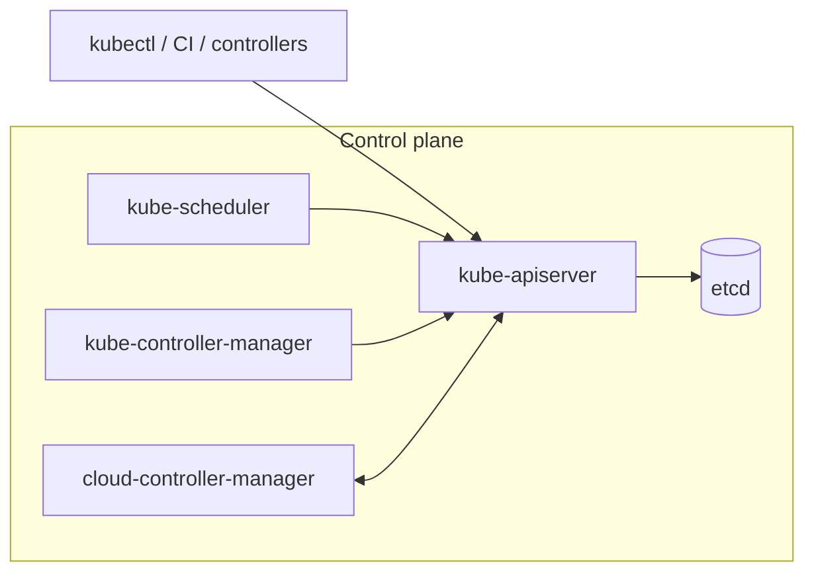
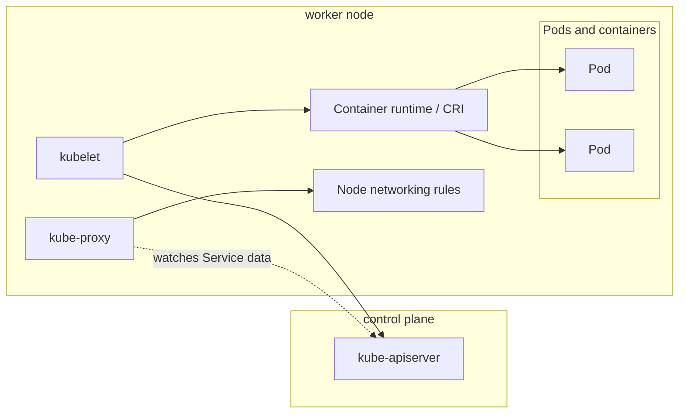
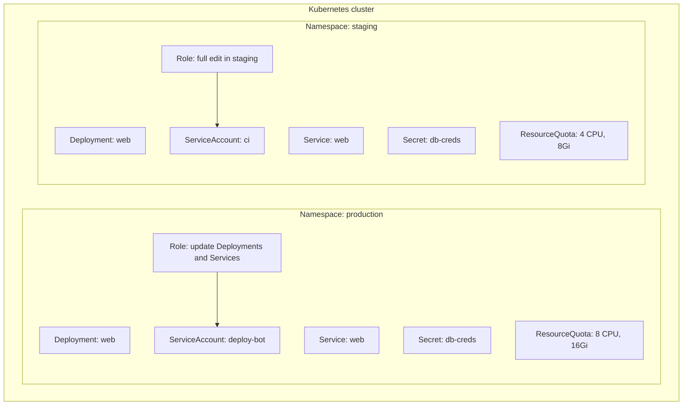
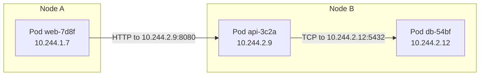
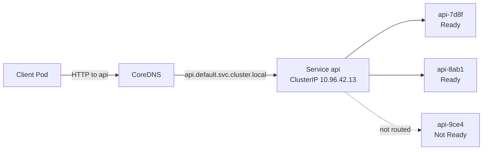
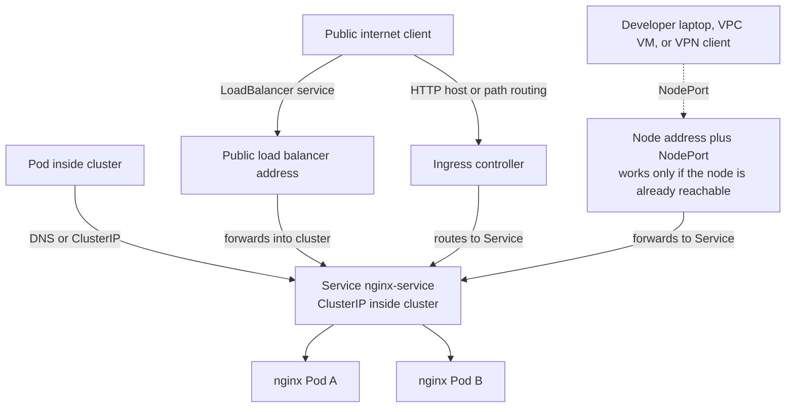

import { Aside } from '@astrojs/starlight/components';

{/* ai-summary
type: lecture
slug: container-orchestration
order: 11
covers: orchestration problem/common patterns; desired state and control loops; Kubernetes architecture; Pods, Deployments, Services, storage, probes, rollouts, scaling; operators, packaging layers, GitOps, k3s, managed Kubernetes
prereq_lectures: containerization-with-docker, networking-fundamentals, infrastructure-as-code, configuration-management, ci-cd
followup_lectures: system-security-and-hardening, monitoring-and-performance, log-management-and-analysis
paired_activities: local-kubernetes-with-minikube
supports_labs: first-container-orchestration-deployment, cluster-operations
*/}

Docker Compose runs containers on a single host. That single host is both a performance ceiling and a single point of failure: when the underlying machine goes down (hardware failure, cloud provider interruption, a required reboot), every container stops with it, and nothing brings them back automatically. Scaling up to a larger instance raises the ceiling but leaves you with one point of failure; spreading workloads across multiple machines by hand means managing placement, coordination, and recovery yourself. Add the operational realities of a production deployment (zero-downtime upgrades, rolling rollbacks, secrets that should not live in environment variables, services that should be reachable by name from anywhere in the cluster) and the gap between "I can run this on a server" and "I can run this for users" becomes obvious.

**Container orchestration** closes that gap by treating a pool of machines as a single unified compute resource. You declare what should be running; the orchestrator decides where, keeps it there, and replaces failed copies automatically. This lecture explains the orchestration problem, starts with the ideas most orchestration systems share, and then goes deep on Kubernetes, which has become the most common orchestration target in industry. It covers the architecture, the core API objects, networking, storage, health checking, rolling updates, and scaling. It also looks at how Kubernetes is actually deployed in practice: the lightweight distributions used for learning and the edge, the managed offerings that hide the control plane, and the surrounding ecosystem of tools that most engineers eventually encounter.

## The Limits of Docker Compose

Docker Compose is an excellent tool for its intended purpose: coordinating multiple containers on a single machine. It creates a shared user-defined network, manages startup order, handles named volumes, and can restart crashed containers when you configure a restart policy. For a development environment or a low-traffic production deployment, it does the job well, and a small Compose stack of a web service, a database, and a cache is an honest production-style deployment at small scale.

But Compose has a hard boundary: it operates on one host. That constraint creates three problems that grow more serious as your system becomes more critical.

**Single point of failure.** If the host machine crashes, is terminated by the cloud provider, or requires maintenance, every container on it goes down simultaneously. There is no automatic failover to a healthy machine, because there is no other machine in the picture.

**Vertical scaling ceiling.** When one machine is not enough, you can move to a larger instance (scale up), but there is a limit. EC2 instances top out at a certain CPU count and memory size, the largest sizes are expensive, and you still have a single point of failure. At some scale, no single machine is adequate regardless of how much you spend.

**Manual placement.** If you want to spread your containers across multiple servers, you have to do it by hand: SSHing into each machine, deciding which containers run where, coordinating updates, and writing your own scripts to restart things when something dies. Six servers is tedious. Sixty servers is a full-time job. Six hundred is impossible.

A real production deployment also wants things Compose does not provide on its own: automatic replacement of workloads after a machine disappears, rolling upgrades with health checking, declarative service-to-service routing, scheduled background jobs, horizontal autoscaling under load, and a coherent way to push configuration and secrets without baking them into images. Each of these can be built around Compose with enough scripting, but the result is a custom orchestration system that nobody else operates and nobody else has tested.

Container orchestration platforms package the answers to all of those questions into a coherent system. You stop thinking about individual servers and start thinking about the cluster as a whole.

## Shared Orchestration Ideas

Before diving into Kubernetes specifically, it helps to separate the orchestration problem from any one product. Systems such as [Docker Swarm](https://docs.docker.com/engine/swarm/), [Nomad](https://developer.hashicorp.com/nomad), [ECS](https://aws.amazon.com/ecs/), and Kubernetes expose different APIs and make different tradeoffs, but they are all trying to solve the same operational questions: where should a workload run, how many copies should exist, how should traffic find those copies, what happens when a machine fails, and how should updates happen without taking the service down.

Because the problems are shared, many of the solutions are shared too. Most orchestrators keep some record of desired state, schedule workloads onto a pool of machines, replace failed instances, provide stable service discovery in front of ephemeral workloads, and offer mechanisms for rolling updates, configuration injection, and scheduled tasks. The names differ, and the boundaries between components differ, but the underlying operational model is recognizable across tools.

Kubernetes did not invent all of these ideas. Many of them appeared earlier in large internal schedulers and in contemporary public orchestrators. What Kubernetes did was package them into a widely adopted, extensible API that much of the industry standardized around. That is why this lecture now narrows its focus to Kubernetes: not because other orchestrators vanished, but because Kubernetes became the common reference point that students are most likely to encounter.

### Why Kubernetes Became the Default Reference Point

For a few years between 2015 and 2018, it genuinely was not obvious which orchestrator would become the common target. Swarm was attractive for Docker-centric teams, Nomad offered a smaller and often more approachable control surface, and ECS fit naturally inside AWS. Kubernetes was more complex than several of its peers, but a few characteristics pushed it toward the center of the ecosystem.

**It was not controlled by a single vendor.** When Google donated Kubernetes to the [CNCF](https://www.cncf.io/), every cloud provider, Linux distribution vendor, and infrastructure company could invest in it without strengthening a direct competitor's proprietary platform. That governance model made it much easier for the broader industry to converge on one shared target.

**It exposed an extensible API.** A Kubernetes cluster is not a fixed set of features; it is an API server you can extend with **Custom Resource Definitions (CRDs)** and your own controllers that reconcile them. This turned Kubernetes into a platform for building platforms. Service meshes ([Istio](https://istio.io/), [Linkerd](https://linkerd.io/)), GitOps tools ([Argo CD](https://argo-cd.readthedocs.io/en/stable/), [Flux](https://fluxcd.io/)), database operators, machine-learning platforms, and even other infrastructure tools all express themselves as Kubernetes resources. The ecosystem effect is enormous: every new tool that targets Kubernetes makes Kubernetes more useful, which makes more tools target it.

**It got the abstractions roughly right.** Pods, Services, Deployments, and label-based selection gave Kubernetes a coherent model for packaging, networking, and updating workloads. Even when the platform felt awkward, those primitives were expressive enough that other tools could build on top of them instead of fighting them.

**Cloud providers bet on it.** Once [GKE](https://cloud.google.com/kubernetes-engine), [AKS](https://azure.microsoft.com/en-us/products/kubernetes-service), and [EKS](https://aws.amazon.com/eks/) were available and reliable, "I want a Kubernetes cluster" became a credit-card transaction. Customers no longer had to operate the control plane themselves, which removed one of the biggest barriers to adoption.

The result is that today, Kubernetes is the default reference point for container orchestration discussions, training materials, and third-party tooling. That does not make the alternatives obsolete. Swarm is still usable for smaller homogeneous deployments, ECS remains common inside AWS, and Nomad still has real production users. It does mean that the gravitational center of the orchestration ecosystem is Kubernetes, and that is where this lecture spends the rest of its time.

<Aside type="note" title="The Cost of Winning">
Kubernetes won partly *by being more capable than it strictly needed to be*. The same generality that made it extensible also makes it complex. A small team running a handful of services on Swarm or Nomad will write less YAML and operate fewer moving parts than the same team running Kubernetes. Choosing Kubernetes because "everyone else does" without weighing the operational cost is a real pattern, and a real source of pain. Pick the smallest tool that solves your actual problem, then graduate when you outgrow it.
</Aside>

## Desired State and the Control Loop

The central idea in Kubernetes is **declarative state management**. Instead of issuing commands ("start two copies of this container on servers A and B"), you write a description of what you want ("there should always be two copies of this container running somewhere in the cluster"). Kubernetes stores that description and continuously works to make reality match it.

This is the **control loop**, sometimes called a reconciliation loop. Every component in Kubernetes (and there are many) runs a loop that looks roughly like this:

1. Read the desired state (what you asked for).
2. Observe the actual state (what is currently running).
3. If they differ, take the minimum action required to close the gap.

When a container crashes, the control loop notices that actual state (one replica) diverges from desired state (two replicas) and starts a replacement. When a node fails, the Pods on that node are eventually marked failed or deleted, higher-level controllers create replacement Pods, and the scheduler binds those new Pods to healthy nodes. You did not issue a "recover from failure" command; you simply declared what you wanted, and the system keeps pursuing that description indefinitely.

This is the same philosophy as Terraform, which you encountered earlier in the Infrastructure as Code lecture: describe the end state, let the tool figure out the steps. The difference is that Kubernetes operates on running processes in real time, not on infrastructure provisioned once and left alone. Terraform reconciles your AWS account against a plan when you run it; Kubernetes uses many controller-specific reconciliation loops, driven mostly by watches on API changes and periodic resyncs, to keep cluster state moving toward the declared state.

<Aside type="note" title="Declarative vs Imperative">
An imperative instruction is "start a container on server 3." A declarative instruction is "make sure two replicas of this container are running." The first tells the system what to do; the second tells it what to achieve. Declarative systems are more resilient because they keep trying to achieve the goal regardless of what happens in the environment. If the container you started on server 3 crashes ten minutes later, an imperative system does nothing; a declarative system notices the gap and acts.
</Aside>

## Kubernetes Architecture

A Kubernetes cluster consists of two logical roles: the **control plane**, which makes all scheduling and management decisions, and **worker nodes**, which do the actual work of running containers. Understanding which component does what is essential for debugging real clusters: when something stops working, the question is almost always "which loop has stopped reconciling, and why."

### The Control Plane

The control plane is the cluster's brain. In a production cluster, it runs on dedicated machines (often three, for high availability), but for learning and lightweight deployments it can run on a single node alongside the workloads it manages.

A diagram helps keep the control plane's most important relationship straight: most components do not coordinate with each other directly. They coordinate by reading and writing cluster state through the API server, with etcd acting as the system of record.



**The API server** ([`kube-apiserver`](https://kubernetes.io/docs/concepts/architecture/#kube-apiserver)) is the single entry point for cluster-state operations. Every interaction with Kubernetes, whether from `kubectl`, a CI/CD pipeline, or an internal controller, goes through the API server as an authenticated HTTPS request. Each request flows through a fixed pipeline: authentication (who is asking), authorization (are they allowed), admission (are there policy or mutation rules that should reject or modify this), and finally validation and persistence to etcd. Most coordination between Kubernetes components happens through the API server: controllers watch it for desired state and write their observations back there, even though node-local agents still talk directly to the container runtime and other host services. The admission stage is where cluster-wide policy is enforced.

[**etcd**](https://etcd.io/) is a distributed key-value store that holds every piece of cluster state: what nodes exist, what Pods should be running, what Services are defined, what the current health of every object is. If you lose etcd and have no backup, you lose the cluster's entire record of itself. Production etcd runs as a cluster of three or five nodes: writes must be acknowledged by a majority before they are committed, and an even number offers no extra fault tolerance over the next lower odd number. The practical implication is that etcd availability is central to control-plane availability: if a majority of etcd nodes go down, the API server can no longer accept writes, which means no new Pods can be scheduled and controllers cannot act on changes. Existing workloads on healthy nodes usually keep running, but the cluster loses its ability to manage change until quorum returns.

**The scheduler** (`kube-scheduler`) watches for newly created Pods that have not yet been assigned to a node and decides where to place them. Placement decisions account for resource requests (CPU, memory), node capacity, taints and tolerations, affinity rules (this Pod should run near that Pod), and anti-affinity rules (these replicas must not share a node). The scheduler writes its decision back to the API server, which stores it in etcd. The kubelet on the chosen node then sees the assignment and acts.

**The controller manager** ([`kube-controller-manager`](https://kubernetes.io/docs/concepts/architecture/#kube-controller-manager)) bundles many individual control loops into a single process. The Deployment controller watches Deployments and ensures the correct number of replica Pods exist. The Node controller watches for nodes that stop sending heartbeats and marks them as unreachable. The EndpointSlice controller populates the EndpointSlice objects that track the Pod IPs and ports behind each Service. Each controller runs its reconciliation loop independently and continuously.

**The cloud controller manager** ([`cloud-controller-manager`](https://kubernetes.io/docs/concepts/architecture/#cloud-controller-manager)) is a separate process used on clusters that integrate with a cloud provider. It contains cloud-provider-specific logic such as creating load balancers for `LoadBalancer` Services, synchronizing node lifecycle information, and managing cloud routes. Modern Kubernetes storage integration is usually handled by **Container Storage Interface (CSI)** drivers rather than by cloud-controller-manager itself. Bare clusters and lightweight local distributions usually run without a cloud controller manager.

### Worker Nodes

Worker nodes are the machines that actually run your containers. A cluster can have anywhere from one to thousands.

The worker-node side is different: the kubelet, kube-proxy, and container runtime are host-level agents, while Pods and their containers are the workloads those agents manage. Seeing that boundary makes it much easier to reason about where a failure is happening.



**The [kubelet](https://kubernetes.io/docs/concepts/architecture/#kubelet)** is an agent process that runs on every node. It watches the API server for pods that have been scheduled to its node, tells the container runtime to start or stop the required containers, reports node health and resource usage back to the API server, and runs the liveness and readiness probes that determine whether a container is healthy. The kubelet is the reason a node "joins" a cluster: a machine without a kubelet is just a machine.

**The container runtime** is responsible for the actual mechanics of starting and stopping containers. Kubernetes defines a standard interface called the **Container Runtime Interface (CRI)**; any runtime that implements CRI can be used. The most common today is **[containerd](https://containerd.io/)**, which handles pulling images, unpacking them, and calling into the OS kernel (via `runc` and libcontainer) to create the namespaces and cgroups. [**CRI-O**](https://cri-o.io/) is a minimal alternative used heavily on Red Hat platforms. Kubernetes itself does not care which CRI-compatible runtime you use.

[**kube-proxy**](https://kubernetes.io/docs/reference/networking/virtual-ips/) usually runs on each node and maintains network rules (typically iptables or IPVS rules) that implement Services. Some clusters use a service-aware CNI or eBPF dataplane instead, in which case kube-proxy may be omitted.

<Aside type="note" title="Standard Interfaces, Swappable Implementations">
A consistent design theme in Kubernetes is stable interfaces with pluggable implementations. The **Container Runtime Interface (CRI)** decouples the kubelet from whatever actually creates containers, so a cluster can swap containerd for CRI-O without changing anything else. The **Container Network Interface (CNI)** does the same for pod networking: Flannel, Calico, and Cilium each implement the same contract, so the control plane does not care which is installed. The **Container Storage Interface (CSI)** lets cloud providers and storage vendors ship volume drivers without modifying Kubernetes itself.

These interfaces explain why the Kubernetes ecosystem feels tool-dense: every plug-in boundary has multiple implementations that trade off performance, features, and operational complexity. As a workload author you mostly see API objects and trust that the right plug-ins are installed. As a cluster operator, those choices matter. The CRD and operator pattern, covered later in this lecture, extends the same idea to application-level resources.
</Aside>

<Aside type="tip" title="kubectl: The Primary Interface">
[`kubectl`](https://kubernetes.io/docs/reference/kubectl/) is the command-line client for the Kubernetes API. It reads cluster credentials from `~/.kube/config` (or a path set by the `KUBECONFIG` environment variable) and sends API requests on your behalf. Most operations follow the pattern:

```bash
kubectl <verb> <resource> [name]
```

For example:

```bash
kubectl get pods
kubectl describe pod my-pod
kubectl apply -f deployment.yaml
kubectl delete service my-service
kubectl logs -f my-pod
```

`kubectl apply` is the declarative command: it takes a YAML manifest describing desired state and sends it to the API server. Kubernetes figures out what needs to change. `kubectl logs` and `kubectl exec` are the equivalents of `docker logs` and `docker exec` you already know, except that they go through the API server rather than talking to a local daemon.
</Aside>

## Core Primitives

Kubernetes defines a set of API objects, each representing a different aspect of desired state. Understanding these objects is the foundation of working with the platform. The same object model is used by every Kubernetes cluster, on every cloud, at every scale; once you know the primitives, you can read any Kubernetes manifest in any environment.

### Pods

A [**Pod**](https://kubernetes.io/docs/concepts/workloads/pods/) is the smallest deployable unit in Kubernetes. It is not a container: a Pod wraps one or more containers that share the same network namespace and can share storage volumes. Containers within a Pod communicate over localhost and see the same IP address.

The reason the Pod exists rather than a bare container is that some applications are genuinely composed of tightly coupled processes: an application container and a log-shipping sidecar, for example, or a web server and a configuration-refresher that reads from a secret store. These processes need to share a filesystem and network but are maintained and versioned separately. Wrapping them in a Pod lets Kubernetes schedule and manage them as a unit while keeping the container images independent.

In practice, most Pods contain a single container. You would never create a Pod directly for a long-running workload; instead, you create a Deployment or another higher-level object that creates and manages Pods on your behalf. Direct Pods are for one-off debugging containers and short-lived tasks.

A Pod can also declare [**init containers**](https://kubernetes.io/docs/concepts/workloads/pods/init-containers/): containers that run to completion in order before the main containers start. Init containers are useful for setup work that should not be part of the main image, like preparing a directory structure, waiting for a dependency to become reachable, or fetching configuration from an external store. Each init container must exit successfully before the next one runs, and only when all of them have finished do the main containers start. If an init container fails, Kubernetes retries the Pod from the beginning rather than starting the main containers in an inconsistent state.

Every Pod moves through a small set of [**lifecycle phases**](https://kubernetes.io/docs/concepts/workloads/pods/pod-lifecycle/): *Pending* (accepted but not yet running; image still pulling, unscheduled, or init containers working), *Running* (bound to a node with at least one container active), *Succeeded* (all containers exited cleanly, the normal terminal state for a Job), *Failed* (all containers exited with at least one in error), and *Unknown* (kubelet has stopped reporting). Each container carries its own status with reason codes explaining why it is in that state; those reason codes are usually the first thing to check when a Pod is stuck.

### Deployments

A [**Deployment**](https://kubernetes.io/docs/concepts/workloads/controllers/deployment/) is a declaration that a certain number of identical Pods should exist at all times. You specify an image, a replica count, resource requests and limits, environment variables, and volume mounts. The Deployment controller creates a **ReplicaSet** (a lower-level object that tracks a specific set of pod replicas), monitors it continuously, and takes action if the actual count diverges from the desired count.

```yaml
apiVersion: apps/v1
kind: Deployment
metadata:
  name: nginx
spec:
  replicas: 2
  selector:
    matchLabels:
      app: nginx
  template:
    metadata:
      labels:
        app: nginx
    spec:
      containers:
        - name: nginx
          image: nginx:1.27
          ports:
            - containerPort: 80
          resources:
            requests:
              memory: "128Mi"
              cpu: "250m"
            limits:
              memory: "512Mi"
              cpu: "500m"
```

The `selector` and `labels` fields are how Kubernetes knows which pods belong to which Deployment. Every pod created by this Deployment gets the label `app: nginx`, and the Deployment watches for pods matching that selector. Labels are how Kubernetes glues most things together: Services find pods by label, NetworkPolicies select pods by label, and tooling filters and groups resources by label.


**Resource requests and limits** deserve attention. A `request` is the minimum amount of CPU or memory a container needs; the scheduler uses requests to decide which nodes have enough capacity to host a pod. A `limit` is the maximum a container is allowed to consume; if a container exceeds its memory limit, the kernel kills it. CPU limits throttle the container's CPU time rather than killing it. Setting both requests and limits is a best practice: without requests, the scheduler places pods blindly; without limits, a runaway container can starve every other workload on the node.

CPU is expressed in millicores: `250m` means 250 millicores, or one-quarter of one CPU core. Memory quantities such as `128Mi` use binary IEC units: `128Mi` means 128 mebibytes.

Pods with no CPU or memory requests or limits fall into the `BestEffort` QoS class and are first in line for eviction under node pressure. A Pod that sets some requests or limits is usually `Burstable`; it becomes `Guaranteed` only when every container sets both CPU and memory requests and limits, and each request equals its matching limit. If a limit is set without a request, Kubernetes can default the request to the limit for that resource.

### StatefulSets

Deployments assume their pods are interchangeable. That assumption breaks for stateful workloads: a database replica named `mysql-0` is not the same thing as `mysql-1`, and the storage attached to one is not interchangeable with the storage attached to another. A [**StatefulSet**](https://kubernetes.io/docs/concepts/workloads/controllers/statefulset/) is the workload controller for that case.

A StatefulSet gives each pod a stable, ordinal name (`mysql-0`, `mysql-1`, `mysql-2`) and a dedicated [**PersistentVolumeClaim**](https://kubernetes.io/docs/concepts/storage/persistent-volumes/#persistentvolumeclaims) that follows the pod across restarts. When it is paired with its governing Service, it gets a stable DNS identity. Pods are started and stopped in order, so consensus systems and primary/replica databases can rely on predictable startup sequences. When `mysql-0` is rescheduled to a different node, it keeps its name and reattaches to the same volume.

What a StatefulSet does *not* do is keep application data in sync for you. Kubernetes is only providing the stable identities, ordering, and storage that a stateful workload needs; the actual replication is still the job of the application, an operator, or bootstrap logic. A PersistentVolumeClaim is not exclusive to StatefulSets; a Deployment can mount a PVC too. The difference is that a StatefulSet is the standard choice when each replica needs its own stable identity and its own persistent volume. In other words, the example below shows the identity-and-storage pattern, not a working PostgreSQL replication topology. If you applied it as written, you would get three independent PostgreSQL Pods with separate volumes, not an automatically replicated three-node database cluster.

```yaml
apiVersion: apps/v1
kind: StatefulSet
metadata:
  name: postgres
spec:
  serviceName: postgres
  replicas: 3
  selector:
    matchLabels:
      app: postgres
  template:
    metadata:
      labels:
        app: postgres
    spec:
      containers:
        - name: postgres
          image: postgres:16
          ports:
            - containerPort: 5432
          volumeMounts:
            - name: data
              mountPath: /var/lib/postgresql/data
  volumeClaimTemplates:
    - metadata:
        name: data
      spec:
        accessModes: ["ReadWriteOnce"]
        resources:
          requests:
            storage: 10Gi
```

A `volumeClaimTemplate` is the StatefulSet's way of saying "every pod I manage gets its own PersistentVolumeClaim with this shape." The three replicas in this example produce three PVCs (`data-postgres-0`, `data-postgres-1`, `data-postgres-2`), each bound to a different underlying volume. The database files survive pod restarts, node reboots, and rescheduling, because the volume is bound to the StatefulSet's logical pod identity, not to the underlying host. Stateful workloads are also typically paired with Service-based DNS that gives each replica a stable name such as `postgres-0.postgres` or `postgres-1.postgres`, so other workloads can address a specific replica when ordering matters.

This example assumes a Service named `postgres` already exists. Setting `clusterIP: None` makes it a **headless Service**, which means the Pods get their own DNS names instead of one shared ClusterIP.

### DaemonSets

A [**DaemonSet**](https://kubernetes.io/docs/concepts/workloads/controllers/daemonset/) ensures that a copy of a pod runs on every node (or every node matching a selector). This is the right primitive for things that are intrinsically per-node: log collectors that read the node's container logs, metrics agents that report node-level resource usage, network plugins that program kube-proxy rules, and storage agents that mount cluster-wide filesystems. As nodes are added to the cluster, the DaemonSet automatically schedules its pod on them; as nodes are removed, the pod goes away with the node.

### Jobs and CronJobs

Not every workload runs forever. A [**Job**](https://kubernetes.io/docs/concepts/workloads/controllers/job/) runs a pod (or a set of pods in parallel) until it completes successfully, and then stops. This is the right primitive for batch processing, database migrations, one-off backfills, and similar finite tasks. A [**CronJob**](https://kubernetes.io/docs/concepts/workloads/controllers/cron-jobs/) runs a Job on a schedule, using the same cron syntax you would expect from `cron`. Together, Jobs and CronJobs cover the use cases that would otherwise need a separate batch scheduler.

### Services

Pods have IP addresses, but those addresses are ephemeral. When a Deployment replaces a crashed pod, the new pod gets a new IP. Clients cannot hold a reference to a pod IP and expect it to remain stable.

A [**Service**](https://kubernetes.io/docs/concepts/services-networking/service/) is the stable front door for a logical group of pods. You define a selector, Kubernetes keeps track of which pods currently match it, and clients talk to the Service instead of chasing individual pod IPs. In the common case, that means a stable [**ClusterIP**](https://kubernetes.io/docs/concepts/services-networking/cluster-ip-allocation/) inside the cluster that always points at the current healthy replicas.

That is the core abstraction to remember: pods come and go, but the Service stays put. Most day-to-day application manifests use the default `ClusterIP` type for internal traffic. External exposure options such as `NodePort`, `LoadBalancer`, and Ingress build on the same idea, but they make more sense in the broader networking story that follows.

```yaml
apiVersion: v1
kind: Service
metadata:
  name: nginx-service
spec:
  selector:
    app: nginx
  ports:
    - port: 80
      targetPort: 80
  type: ClusterIP
```

### ConfigMaps and Secrets

Baking configuration values directly into container images is a bad practice for the same reason that baking secrets into Dockerfiles is: you lose the ability to change configuration without rebuilding the image, and sensitive values end up in the image layer history.

A [**ConfigMap**](https://kubernetes.io/docs/concepts/configuration/configmap/) stores non-sensitive configuration as key-value pairs or arbitrary files. A [**Secret**](https://kubernetes.io/docs/concepts/configuration/secret/) stores sensitive data (passwords, tokens, certificates) in a similar structure, with the distinction that etcd can be configured to encrypt Secrets at rest, and the API server can restrict access to them through **RBAC** (Role-Based Access Control), Kubernetes' permissions system.

Both can be projected into a container as environment variables or mounted as files in the container's filesystem. Mounted files are often preferred for secrets because they avoid baking secret values into process environments, make rotation easier for many applications, and reduce accidental exposure through debugging output or child processes.

```yaml
apiVersion: v1
kind: Secret
metadata:
  name: db-secret
type: Opaque
data:
  db-password: bXlzZWNyZXRwYXNzd29yZA==
```

<Aside type="caution" title="Base64 Is Not Encryption">
Kubernetes Secrets store values as base64-encoded strings. Base64 is an encoding, not encryption: anyone who can read the Secret object can trivially decode the value with `base64 --decode`. The security benefit comes from access controls (RBAC limiting which service accounts can read which Secrets) and optional encryption at rest in etcd. Do not assume a Kubernetes Secret is safe simply because the value looks scrambled. For the concrete hardening steps, [Good practices for Kubernetes Secrets](https://kubernetes.io/docs/concepts/security/secrets-good-practices/) covers least-privilege access and safe consumption patterns, and [Encrypt data at rest](https://kubernetes.io/docs/tasks/administer-cluster/encrypt-data/) covers API server and etcd encryption configuration.
</Aside>

### Namespaces

A single Kubernetes cluster usually contains many objects: Deployments, Services, Secrets, ConfigMaps, Jobs, and more. If all of them lived in one global bucket, only one object in the entire cluster could be named `web`, there would be no clean way to say "team A gets at most this much CPU and memory," and there would be no obvious boundary for saying "this CI job may edit staging but not production." A [**Namespace**](https://kubernetes.io/docs/concepts/overview/working-with-objects/namespaces/) is the lightweight partition Kubernetes uses to solve those problems.

In practice, a Namespace matters operationally in three ways:

- **Names**: most object names only need to be unique inside one Namespace, so `production/web` and `staging/web` can both exist in the same cluster.
- **Quotas**: a Namespace can have a ResourceQuota and a LimitRange attached, so one team cannot consume all cluster CPU, memory, storage, or object count by accident.
- **Access control**: permissions are usually granted against a Namespace, so a user or workload can be allowed to work in `staging` without automatically gaining the same power in `production`.

This is easiest to see as a shared-cluster layout:



The same object names can appear in multiple Namespaces without colliding. Quotas live at the Namespace boundary, so they limit one slice of the cluster rather than the whole thing. Permissions also attach to that boundary, so the `ci` ServiceAccount can be powerful in `staging` while having no rights in `production` at all. What the diagram is *not* showing is network isolation: a Namespace does not, by itself, stop pods from talking across Namespace lines.

Kubernetes starts with four standard Namespaces: `default` (where objects land if you do not specify a Namespace), `kube-system` (where Kubernetes' own components run), `kube-public` (readable by all users and reserved for cluster-wide public resources), and `kube-node-lease` (which stores node heartbeat lease objects). In shared clusters, a common pattern is a dedicated Namespace per application, team, or environment such as `staging`, `production`, and `monitoring`. Companies do use Namespaces for environment boundaries when those environments share one cluster, but that is a convention rather than a hard rule: many organizations still place production in a separate cluster when they want a stronger isolation boundary.

```bash
kubectl create namespace production
kubectl create namespace staging
kubectl apply -f web.yaml -n production
kubectl apply -f web.yaml -n staging
```

### ServiceAccounts and RBAC

Every Pod runs with a [**ServiceAccount**](https://kubernetes.io/docs/concepts/security/service-accounts/) identity that determines what it is allowed to do when it talks to the Kubernetes API. Every Namespace starts with a `default` ServiceAccount, but workloads that need API access should use a dedicated ServiceAccount so that permissions can be granted narrowly rather than to every Pod in the Namespace by default.

[**Role-Based Access Control (RBAC)**](https://kubernetes.io/docs/reference/access-authn-authz/rbac/) is the authorization layer that controls which identities may perform which verbs on which resources. A **Role** (or **ClusterRole** for cluster-wide scope) defines what is allowed; a **RoleBinding** (or **ClusterRoleBinding**) grants those permissions to a ServiceAccount, user, or group. In concrete terms, RBAC is how you say "the `ci` ServiceAccount may update Deployments in `staging`" while a different account in a different Namespace has no such rights. The System Security lecture goes deeper on RBAC, NetworkPolicy, and Secrets hardening.

## Health and Self-Healing

A core promise of Kubernetes is that crashed pods are replaced automatically. That promise depends on Kubernetes knowing what "healthy" actually means for your application, and that knowledge has to be encoded explicitly. Kubernetes defines [three kinds of probes](https://kubernetes.io/docs/concepts/configuration/liveness-readiness-startup-probes/), each answering a different question.

A **liveness probe** answers: is this container still functioning? If the liveness probe fails consistently, the kubelet kills the container and restarts it according to the Pod's restart policy. This catches cases where the process is still running but stuck (deadlocked thread pool, unresponsive request handler, or a process spending all its time in garbage collection). Without a liveness probe, a stuck process looks healthy to Kubernetes because the process exists.

A **readiness probe** answers: is this container ready to receive traffic right now? Pods that fail their readiness probe are removed from Service endpoints, so traffic stops being routed to them, but they are not killed. This is the right tool for "I am running but not ready yet" states: a database connection pool is still warming up, a cache is being populated, or a configuration reload is in progress. The pod stays alive; Kubernetes simply stops sending it requests until it recovers.

A **startup probe** answers: has this container finished starting up? It exists because some applications take a long time to start (large Java heap warmup, slow data load, expensive initialization), and you want to give them generous time without weakening your liveness probe. While the startup probe is failing, Kubernetes does not run liveness or readiness probes against the container; once the startup probe succeeds, the other two take over with their own (typically tighter) timing. If the startup probe keeps failing past its threshold, the kubelet kills the container and the Pod's restart policy applies.

Each probe uses one of [four check mechanisms](https://kubernetes.io/docs/concepts/configuration/liveness-readiness-startup-probes/#check-mechanisms): `httpGet`, `tcpSocket`, `exec`, or `grpc`. HTTP is often preferred when the application can expose a status endpoint, because it can encode application-specific health logic that a simple port-open check would miss. gRPC probes are a good fit when an application already implements the standard gRPC health-checking protocol, although they use a numeric port rather than a named one. `exec` probes are flexible, but they are heavier because each check runs a command inside the container.

<Aside type="caution" title="Naive Probes Are Worse Than No Probes">
A liveness probe that just checks "is the port open" will pass for a hung process that has accepted a connection and never replies, and Kubernetes will happily leave the broken pod in the Service. Worse, a liveness probe that depends on a backing service (for example, returning failure when the database is unreachable) will cause cascading restarts when that backing service has a bad minute: every pod restarts itself in unison, the database is hammered with reconnects, and a small problem becomes an outage. Probes should reflect *the local container's own health*, not the health of every dependency it has.
</Aside>

Because the kubelet reports container and Pod state into the cluster, monitoring stacks can surface those signals later as events, metrics, and alerts. `kube-state-metrics` is useful for exporting object state such as Pod readiness and restart-related status, while kubelet metrics and event pipelines provide more direct visibility into individual probe failures. For this lecture, the important point is simply that probe failures do not vanish after the kubelet reacts to them: they become part of the cluster's observable state.

### Graceful Shutdown

[**Graceful shutdown**](https://kubernetes.io/docs/concepts/workloads/pods/pod-lifecycle/#pod-termination-flow) matters because rolling updates and scale-downs are only invisible to users if old Pods stop cleanly. When Kubernetes deletes or evicts a Pod, it marks the Pod terminating, stops routing normal Service traffic to it, runs any [`preStop` hook](https://kubernetes.io/docs/concepts/containers/container-lifecycle-hooks/#container-hooks), sends the container's stop signal (usually `SIGTERM`), and waits up to `terminationGracePeriodSeconds` (30 seconds by default) before forcing the process down. Kubernetes gives an application a chance to finish work, but the application has to cooperate.

<Aside type="note" title="PodDisruptionBudgets">
[**PodDisruptionBudgets**](https://kubernetes.io/docs/tasks/run-application/configure-pdb/) are a guardrail for planned maintenance rather than crash recovery. When an operator drains a node or an autoscaler removes one, Kubernetes uses the eviction API to ask whether a workload can spare a Pod; a PDB answers with `minAvailable` or `maxUnavailable`. It does not stop crashes and does not control a Deployment's rolling update behavior.
</Aside>

## Networking

Networking is where Kubernetes first feels less like "Docker on more machines" and more like a different operating model. In Docker Compose, one host gives you three things at once: a shared network for container-to-container traffic, DNS names for service discovery, and port publishing for traffic coming in from outside. Kubernetes still has to solve those same three problems, but it solves them with [three separate layers](https://kubernetes.io/docs/concepts/services-networking/): pod-to-pod reachability across nodes, Services and DNS for stable discovery, and external entry points for traffic arriving from outside the cluster. Keeping those layers separate is the key to making the rest of Kubernetes networking feel reasonable.

### Pod-to-Pod Reachability

The first networking question is simple to state: if one workload needs to talk to another, how does the packet get there? Earlier in this lecture, Pods were introduced as the unit Kubernetes schedules. Earlier in the Docker lecture, you saw that containers get isolated network namespaces. Kubernetes builds on both ideas. Every Pod gets its own IP address, and the containers inside that Pod share the same network namespace and the same IP. That means two containers in one Pod still communicate over `localhost`, but a different Pod reaches them by the Pod IP.

The cluster networking model then makes one strong promise: a Pod can reach another Pod anywhere in the cluster by IP, even when the two Pods are on different nodes, and it can do so without you publishing host ports for each workload. That is the biggest conceptual difference from Docker's default bridge networking. In Compose, service-to-service communication is easy as long as the containers share one host and one user-defined network. In Kubernetes, the expectation is cluster-wide.

The component that makes this possible is the cluster's [**CNI (Container Network Interface) plugin**](https://kubernetes.io/docs/concepts/extend-kubernetes/compute-storage-net/network-plugins/). On most real clusters, you do not wire this up by hand. Lightweight distributions and local tools such as [k3s](https://k3s.io/) and [minikube](https://minikube.sigs.k8s.io/) usually install a default CNI for you, so Pods can communicate immediately after the cluster starts. Its job is to assign Pod addresses and make sure routes exist between nodes so Pod traffic can flow. Different CNI plugins implement that job differently, and cluster operators care about those details. As a workload author, though, the important thing is the contract, not the brand name: your Pod gets an IP, and other Pods can reach it.

The diagram below shows that mental model. Pods on different nodes still talk directly across one logical cluster network, while containers inside the same Pod continue to share one local network stack.



It is technically possible to connect to Pod IPs directly, but you usually should not build applications around that. Pod IPs are ephemeral. If a Deployment replaces `api-3c2a`, the new Pod gets a different IP. The pod network solves raw reachability. Stable identity is the next layer.

### Services and DNS

Once Pods can reach each other, the next problem is that the specific Pods behind an application do not stay put. Deployments replace failed Pods, rollouts create new ones, autoscalers add and remove replicas, and readiness probes temporarily take Pods out of rotation. Applications need a stable name for a changing set of backends. In Kubernetes, that stable front door is a **Service**.

A Service selects Pods by label and gives clients a stable DNS name and, in the common case, a stable virtual IP called a **ClusterIP**. A client sends traffic to the Service, not to a specific Pod. The cluster DNS service, usually [**CoreDNS**](https://kubernetes.io/docs/tasks/administer-cluster/coredns/), creates names such as `api.default.svc.cluster.local`; within the same Namespace, a client usually just uses the short name `api`. When the request arrives, kube-proxy or an equivalent data-plane implementation forwards it to one of the currently ready Pods behind that Service.

This is the closest Kubernetes analogue to the Docker Compose behavior you already know. In Compose, a `web` container can reach `database` by service name because Docker's embedded DNS resolves `database` on the shared network. In Kubernetes, a Pod can reach `database` by Service name for the same reason: DNS hides changing backend IPs behind a stable name. The difference is scope. Compose is doing it for containers on one host; Kubernetes is doing it for Pods spread across a cluster.

The next diagram shows why Services matter operationally. The client keeps talking to one name and one virtual IP, while the backend Pods can be replaced underneath it.



That last detail connects directly to the health section you just read: readiness probes are what keep a starting or broken Pod out of Service traffic without killing it. A Service is not simply "all Pods with this label." It is effectively "the ready endpoints behind this label selector."

Most Services are internal `ClusterIP` Services, and that is the main case to keep in mind for first deployments. Some stateful workloads use Service-based DNS to preserve stable per-replica names, but that is a special case rather than the everyday default.

### Reaching Services Beyond Cluster Internals

Internal service discovery answers how workloads talk to each other. The next question is how traffic reaches a Service from somewhere other than the cluster's own internal Service network. Sometimes that traffic comes from the public internet. Sometimes it comes from a developer laptop, another machine in the same VPC, or a client on a VPN. Those are different exposure levels, and Kubernetes offers different mechanisms for them.

A useful way to think about the built-in Service types is this: **ClusterIP** answers internal access, **NodePort** answers low-level exposure on node addresses, and **LoadBalancer** answers platform-managed external exposure through a dedicated front door. The backend Pods do not change. What changes is the door clients use to reach them.

The default `ClusterIP` Service is internal-only. Pods inside the cluster can talk to that Service IP or DNS name, but a browser on the public internet cannot connect to a ClusterIP directly. That internal-only boundary is why Kubernetes needs additional exposure mechanisms for outside traffic.

A **NodePort** Service opens the same TCP or UDP port on every node and forwards that traffic to the Service. Clients connect to a node's reachable address plus the assigned NodePort, and Kubernetes usually picks that port from the default `30000-32767` range. The important limitation is that NodePort does **not** make a node public by itself. It only opens a port on addresses the node already has. On a laptop cluster that address might be `localhost` or the minikube IP. In a cloud cluster it might be a private VPC address, which means only other systems in that VPC or on a VPN can reach it, or it might be a public node IP if the cluster was built that way. That is why NodePort belongs in this discussion, but not as the main public-internet pattern. It is a low-level way to reach a Service from networks that already have a path to the nodes. NodePort is simple and useful for labs, debugging, and bare-bones exposure, but it is blunt because you are exposing the service on every node whether or not that node is actually running one of the Pods.

A Service of type [**LoadBalancer**](https://kubernetes.io/docs/concepts/services-networking/service/#loadbalancer) keeps the same Service and the same Pods, but asks the surrounding environment to create an external load balancer in front of them. That is the part that actually gives outside clients a stable public or otherwise externally managed address. In a managed cloud cluster, the cloud provider usually creates a load balancer and assigns it a public IP or DNS name. In many implementations, that external load balancer then forwards traffic to the nodes, which forward it to the Service and then to a ready Pod. The important change is not that the Pods suddenly behave differently. The change is that outside clients no longer need direct reachability to a node; they use the load balancer's address instead.

An [**Ingress**](https://kubernetes.io/docs/concepts/services-networking/ingress/) solves a different problem. It is an HTTP and HTTPS routing layer that lets one external entry point distribute requests to multiple Services based on hostnames and URL paths. That is how one cluster can serve `api.example.com` and `shop.example.com` without creating a separate public load balancer for each application. An Ingress object is only a declaration of rules, though. It is not the public entry point by itself. In practice, you run an [**Ingress controller**](https://kubernetes.io/docs/concepts/services-networking/ingress-controllers/) inside the cluster, and that controller is what reads the rules and configures a reverse proxy or cloud load balancer to enforce them.

```yaml
apiVersion: networking.k8s.io/v1
kind: Ingress
metadata:
  name: site-ingress
spec:
  rules:
    - host: myapp.example.com
      http:
        paths:
          - path: /
            pathType: Prefix
            backend:
              service:
                name: nginx-service
                port:
                  number: 80
```

The diagram below separates the three cases. Internal clients use the ClusterIP. Clients that already have network reachability to a node can use NodePort. Public-internet clients usually need a load balancer or an exposed Ingress controller in front.



A newer family of APIs called the [**Gateway API**](https://kubernetes.io/docs/concepts/services-networking/gateway/) takes the same general idea and makes it more expressive and more role-oriented. Instead of one broad Ingress object, Gateway API separates the public-facing gateway from the route objects applications attach to it. You do not need Gateway API to understand first deployments, and Ingress remains common in real clusters. If you encounter Gateway later, the right mental translation is "a newer and cleaner way to express traffic entry and routing."

<Aside type="note" title="Do Not Map Kubernetes Networking Too Literally to Docker Port Publishing">
In Docker, `-p 8080:80` is a host-level NAT rule in front of one container. In Kubernetes, the closest equivalents are `NodePort` or `LoadBalancer`, but most application-to-application traffic inside the cluster uses `ClusterIP` Services and DNS names instead. The important carryover from the Docker lecture is the *idea* of stable names and controlled entry points, not a one-for-one mapping of every Docker flag to a Kubernetes object.
</Aside>

### NetworkPolicy

Once traffic can move, the final networking question is who should be allowed to talk to whom. By default, Kubernetes networking is very open: Pods can generally talk to other Pods and Services across the cluster. That makes early development easy. It also means a compromised Pod has a large blast radius unless you add policy.

A [**NetworkPolicy**](https://kubernetes.io/docs/concepts/services-networking/network-policies/) is Kubernetes' built-in way to describe allowed traffic at the Pod level. Policies select target Pods by label and then define which ingress traffic, egress traffic, or both are allowed. The key mental model is that NetworkPolicy is an allowlist system. Once a Pod is selected by a policy for ingress or egress, traffic in that direction is denied unless some rule explicitly allows it. A Service and a NetworkPolicy are therefore solving different problems: the Service makes a workload reachable, while the policy decides which sources are allowed to reach it.

There is one important operational caveat: creating a NetworkPolicy object does not guarantee enforcement by itself. The cluster's network plugin must support NetworkPolicy for those rules to have any effect. That is one of the reasons cluster networking choices matter more to operators than they do to application authors.

## Storage

Containers write to an ephemeral filesystem: when the container is replaced, everything written to that filesystem is lost. For a stateless web application this is fine, but a database, a message queue, an object cache, or any other piece of state must persist across pod restarts.

Kubernetes separates the concern of *providing* storage from the concern of *consuming* it through two objects:

A [**PersistentVolume (PV)**](https://kubernetes.io/docs/concepts/storage/persistent-volumes/) represents a piece of storage that has been provisioned in the cluster: an NFS mount, an AWS EBS volume, a local SSD, or any number of other backends. The PV knows how large the storage is, how it can be accessed (read-write by one node, read-write by many nodes, read-only by many), and what to do when the claim on it is released.

A [**PersistentVolumeClaim (PVC)**](https://kubernetes.io/docs/concepts/storage/persistent-volumes/#persistentvolumeclaims) is a request from a pod for storage. A PVC says "I need 10 GB of storage with read-write-once access." Kubernetes matches the PVC to a suitable PV, binds them, and mounts the PV into the requesting pod.

```yaml
apiVersion: v1
kind: PersistentVolumeClaim
metadata:
  name: mysql-pvc
spec:
  accessModes:
    - ReadWriteOnce
  resources:
    requests:
      storage: 10Gi
```

In a Pod spec, you reference the PVC by name:

```yaml
volumes:
  - name: mysql-storage
    persistentVolumeClaim:
      claimName: mysql-pvc
containers:
  - name: mysql
    volumeMounts:
      - mountPath: /var/lib/mysql
        name: mysql-storage
```

[**StorageClasses**](https://kubernetes.io/docs/concepts/storage/storage-classes/) allow dynamic provisioning: instead of an administrator pre-creating PVs, a StorageClass defines a provisioner (for example, AWS EBS or GCP Persistent Disk) and a PVC can request storage from that class. Kubernetes automatically provisions the underlying volume and binds it to the PVC. On cloud providers, this is the default behaviour; on bare-metal clusters including k3s, a StorageClass backed by local-path provisioner is typically configured to create local volumes on each node. In modern Kubernetes, many cloud and vendor storage integrations are delivered through [**CSI (Container Storage Interface)**](https://kubernetes-csi.github.io/docs/) drivers, which let storage providers plug into Kubernetes without modifying Kubernetes core.

The key difference from Docker volumes: a Docker volume is local to one host. A PVC backed by a network storage provider (EBS, NFS, Ceph) can be unmounted from a failing pod and remounted to its replacement on a different node without data loss, because the underlying storage is not tied to any specific machine. On a single-node k3s cluster with local-path storage, that property is obviously not available; if the node dies, the data dies with it. This is one of the practical reasons "Kubernetes" and "highly available Kubernetes" are not the same thing, and why production deployments either use replicated storage backends or replicate state at the application layer.

## Rolling Updates and Rollbacks

One of Kubernetes' most operationally valuable features is the ability to update a running application without taking it offline. When you change the image tag in a Deployment and apply the updated manifest, Kubernetes performs a [**rolling update**](https://kubernetes.io/docs/tutorials/kubernetes-basics/update/update-intro/) by default.

The strategy is controlled by two parameters in the Deployment spec:

- **`maxUnavailable`**: the maximum number of pods that can be unavailable during the update. Setting this to `0` ensures the old version keeps serving traffic while the new version starts.
- **`maxSurge`**: the maximum number of pods that can be created above the desired replica count. A surge of `1` on a Deployment with 3 replicas means Kubernetes starts one new pod (now 4 total), waits for it to pass its readiness probe, then terminates one old pod (back to 3), and so on.

```yaml
spec:
  strategy:
    type: RollingUpdate
    rollingUpdate:
      maxUnavailable: 0
      maxSurge: 1
```

You can watch the progress with:

```bash
kubectl rollout status deployment/nginx
```

If something goes wrong (the new version crashes on startup, readiness probes fail), Kubernetes stops making progress on the rollout and keeps the older ReplicaSet available while you investigate. You can roll back to the previous revision with:

```bash
kubectl rollout undo deployment/nginx
```

Kubernetes keeps a history of Deployment revisions (configurable with `revisionHistoryLimit`) so you can roll back to any recent version, not just the immediate predecessor.

For higher-risk deployments, two patterns extend this baseline. **Blue-green** runs two complete versions side by side and switches traffic atomically by changing a Service's selector. **Canary** sends only a small slice of traffic to the new version first, watches for errors, and only completes the rollout if it stays healthy. Blue-green is easy to express with plain Kubernetes objects. Fine-grained canary traffic splitting usually relies on an ingress controller, Gateway API implementation, service mesh, or rollout controller such as **[Argo Rollouts](https://argoproj.github.io/rollouts/)** or **[Flagger](https://flagger.app/)**.

<Aside type="caution" title="Readiness Probes Are Not Optional">
A rolling update with `maxUnavailable: 0` only prevents downtime if your readiness probe accurately reflects whether the new pod is ready to serve traffic. If the new pod starts, passes a naive readiness probe (say, a TCP check that just confirms the port is open), and begins receiving requests before the application has fully initialized, users will hit errors during the transition. Define readiness probes that check the application's actual health endpoint, not just whether the process started.
</Aside>

## Scaling Workloads

A static replica count is fine when load is stable. When it is not, Kubernetes can adjust the count automatically.

The **Horizontal Pod Autoscaler (HPA)** watches a metric (CPU utilization is the default, but custom and external metrics work too) and changes the replica count of a Deployment or StatefulSet to keep the metric within a target range. Doubling the replicas under load and shrinking back when load drops is a one-line declaration:

```yaml
apiVersion: autoscaling/v2
kind: HorizontalPodAutoscaler
metadata:
  name: api
spec:
  scaleTargetRef:
    apiVersion: apps/v1
    kind: Deployment
    name: api
  minReplicas: 2
  maxReplicas: 20
  metrics:
    - type: Resource
      resource:
        name: cpu
        target:
          type: Utilization
          averageUtilization: 60
```

The HPA depends on a metrics source: the lightweight [`metrics-server`](https://github.com/kubernetes-sigs/metrics-server) for CPU and memory, or a custom/external metrics adapter for application-level metrics. Prometheus is a common backing store for those application metrics, but the HPA reads them through the Kubernetes metrics APIs rather than querying Prometheus directly. Without a metrics source, the HPA has nothing to scale on.

Kubernetes can also scale at the node layer: the [Cluster Autoscaler](https://github.com/kubernetes/autoscaler/tree/master/cluster-autoscaler) adds or removes nodes when pods are unschedulable or when nodes sit underused, and cloud-specific tools like Karpenter choose instance types dynamically. The quota, cost, and headroom tradeoffs behind these policies belong to the Site Reliability and Capacity Planning lecture.

## Extending Kubernetes: CRDs and the Operator Pattern

The built-in API objects (Pods, Deployments, Services, and so on) cover the basics, but real systems often need higher-level resources such as a managed Postgres cluster or a TLS certificate. Kubernetes handles that with **Custom Resource Definitions (CRDs)**, which teach the API server a new noun and let it store objects of that type in etcd.

A CRD by itself is only schema. The part that makes it useful is a controller watching that resource and reconciling it into real cluster objects. That pairing, a CRD plus controller, is the **operator pattern**. [cert-manager](https://cert-manager.io/), the [Prometheus Operator](https://prometheus-operator.dev/), and many database platforms work this way.

## Where Kubernetes Runs

"Kubernetes" is not one binary but a standard API plus control-plane and node components that different distributions package in different ways. The practical operator question is not whether a given distribution is "real Kubernetes," but who runs the control plane, what defaults are bundled, and how much operational work remains.

### Local and Lightweight Clusters

For laptop and CI work, **[kind](https://kind.sigs.k8s.io/)** and **[minikube](https://minikube.sigs.k8s.io/)** are common choices. kind runs clusters as Docker containers, which makes it fast and disposable. minikube is more like a long-lived local cluster. For small servers, edge sites, and this course's orchestration work, **[k3s](https://k3s.io/)** is the most relevant lightweight distribution. It remains conformant Kubernetes, packages the control plane into a small binary, uses SQLite by default on a single-server install, and uses embedded etcd or an external datastore for HA. A default install bundles basics such as CoreDNS, metrics-server, local-path storage, and [Traefik](https://traefik.io/) as the Ingress controller.

Other distributions, including [k0s](https://k0sproject.io/), [MicroK8s](https://microk8s.io/), [Talos](https://www.talos.dev/), [OpenShift](https://www.redhat.com/en/technologies/cloud-computing/openshift), and [Rancher](https://www.rancher.com/)-based platforms, make different tradeoffs around footprint, security posture, and enterprise integrations. The object model largely carries across them. A Deployment is still a Deployment.

### Managed Kubernetes

At larger scale, the painful part is usually not writing manifests but operating etcd, upgrading the control plane, and recovering from control-plane failures. Managed services such as **[EKS](https://aws.amazon.com/eks/)**, **[GKE](https://cloud.google.com/kubernetes-engine)**, and **[AKS](https://azure.microsoft.com/en-us/products/kubernetes-service)** take over that responsibility while leaving worker nodes and workloads under your control. Each integrates with its cloud's identity, load balancing, and storage systems, but the day-to-day interface still comes back to `kubectl` and the Kubernetes API.

### Packaging Layers

Plain manifests are the foundation, but teams rarely stop there. **[Helm](https://helm.sh/)** packages templated applications as installable charts, and **[Kustomize](https://kustomize.io/)** keeps a shared base of manifests with environment-specific patches. Both are ways of keeping declarative configuration manageable as the number of services and environments grows.

### GitOps on Declarative Platforms

GitOps, introduced in the CI/CD lecture, feels especially natural on Kubernetes because the platform already works by reconciling declared state. Teams keep manifests, Helm values, or Kustomize overlays in Git and run a controller such as Argo CD or Flux inside the cluster to pull approved changes. Git becomes the source of truth, drift becomes visible, and rollback is often a revert.

## Takeaways

Container orchestration is a significant step up in operational complexity from Docker Compose. You gain self-healing, horizontal scaling, declarative service discovery, and zero-downtime deployments, but you also take on a richer object model, a more involved networking stack, and the need to understand control plane health. A single-server deployment that can tolerate brief downtime during updates may not need a cluster, but workloads that require high availability, horizontal scaling, or automated rollout often do.

The mental model shift is the important thing to internalize. With Docker Compose, you work with hosts: you SSH into a machine and tell it what to run. With Kubernetes, you work with the API: you submit desired state to the cluster and let it decide where and how to run things. That shift from imperative to declarative, and from host-centric to cluster-centric, is what makes Kubernetes powerful.

Picture a realistic production setup that pulls the lecture together. A CI pipeline builds and pushes your image, Terraform provisions the cluster, Ansible configures the nodes, and Kubernetes runs the app as a Deployment behind a Service and Ingress. The database runs as a StatefulSet with persistent storage, configuration lives in ConfigMaps and Secrets, and an HPA adjusts replica count under load. Whether delivery is push-based or GitOps-based, the cluster is still being driven toward declared state.


## Resources

- <a href="https://www.youtube.com/watch?v=vBjonut1JMk" target="_blank" rel="noopener noreferrer">How Kubernetes is Built with Kat Cosgrove (The Pragmatic Engineer Podcast) (YouTube)</a>
- <a href="https://research.google/pubs/large-scale-cluster-management-at-google-with-borg/" target="_blank" rel="noopener noreferrer">Large-scale cluster management at Google with Borg (Google Research)</a>
- <a href="https://blog.cloudflare.com/one-line-kubernetes-fix-saved-600-hours-a-year/" target="_blank" rel="noopener noreferrer">One Line Kubernetes Fix Saved 600 Hours a Year (The Cloudflare Blog)</a>
- <a href="https://learnk8s.io/production-best-practices" target="_blank" rel="noopener noreferrer">Kubernetes Production Best Practices (learnk8s)</a>
- <a href="https://www.youtube.com/watch?v=s_o8dwzRlu4" target="_blank" rel="noopener noreferrer">Kubernetes Crash Course for Absolute Beginners (TechWorld with Nana) (YouTube)</a>
- <a href="https://developer.hashicorp.com/nomad/docs/k8s-nomad" target="_blank" rel="noopener noreferrer">Nomad for Kubernetes practitioners (HashiCorp Docs)</a>
