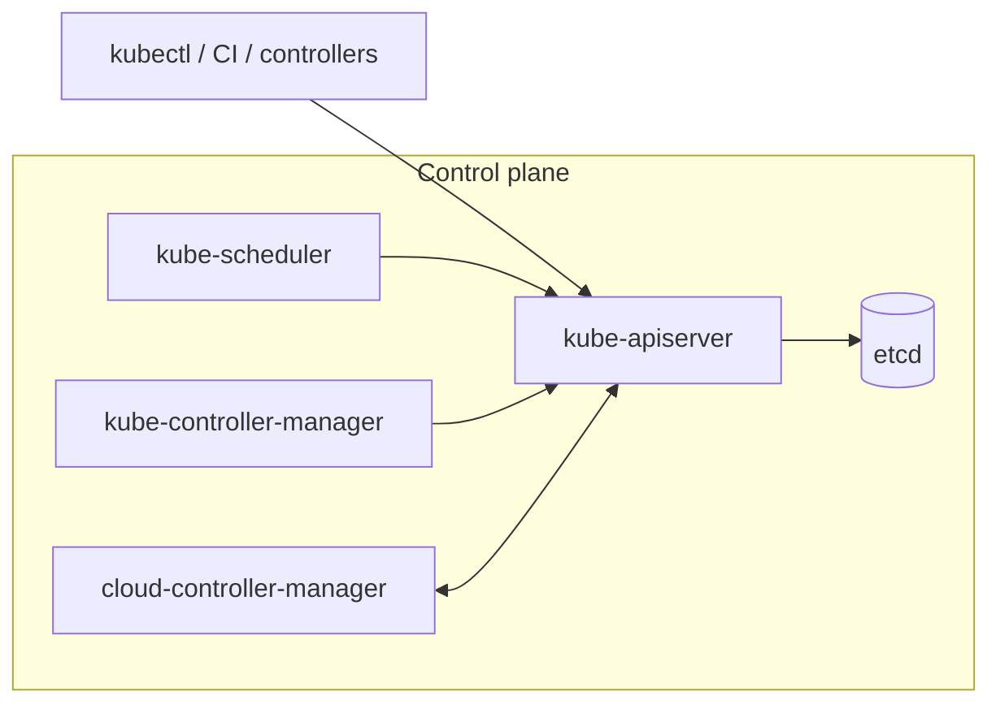
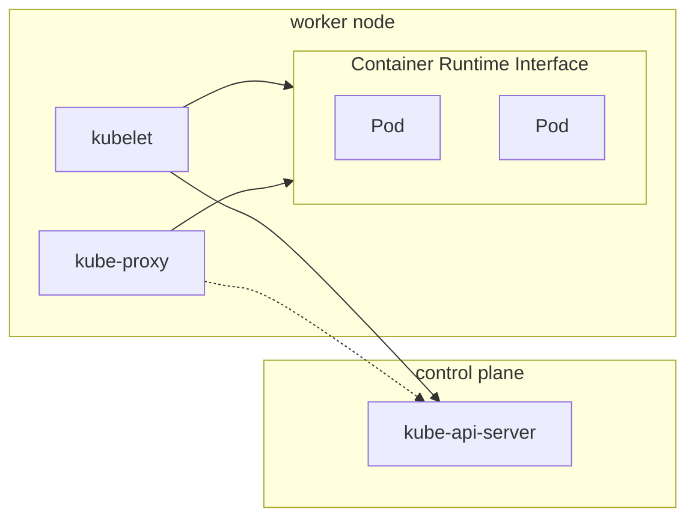

import { Aside } from '@astrojs/starlight/components';

{/* ai-summary
type: lecture
slug: container-orchestration
order: 11
covers: orchestration problem/common patterns; desired state and control loops; Kubernetes architecture; Pods, Deployments, Services, storage, probes, rollouts, scaling; operators, packaging layers, GitOps, k3s, managed Kubernetes
prereq_lectures: containerization-with-docker, networking-fundamentals, infrastructure-as-code, configuration-management, ci-cd
followup_lectures: system-security-and-hardening, monitoring-and-performance, log-management-and-analysis
paired_activities: local-kubernetes-with-minikube
supports_labs: first-container-orchestration-deployment, cluster-operations
*/}

Docker Compose runs containers on a single host. That single host is both a performance ceiling and a single point of failure: when the underlying machine goes down (hardware failure, cloud provider interruption, a required reboot), every container stops with it, and nothing brings them back automatically. Scaling up to a larger instance raises the ceiling but leaves you with one point of failure; spreading workloads across multiple machines by hand means managing placement, coordination, and recovery yourself. Add the operational realities of a production deployment (zero-downtime upgrades, rolling rollbacks, secrets that should not live in environment variables, services that should be reachable by name from anywhere in the cluster) and the gap between "I can run this on a server" and "I can run this for users" becomes obvious.

**Container orchestration** closes that gap by treating a pool of machines as a single unified compute resource. You declare what should be running; the orchestrator decides where, keeps it there, and replaces failed copies automatically. This lecture explains the orchestration problem, starts with the ideas most orchestration systems share, and then goes deep on Kubernetes, which has become the most common orchestration target in industry. It covers the architecture, the core API objects, networking, storage, health checking, rolling updates, and scaling. It also looks at how Kubernetes is actually deployed in practice: the lightweight distributions used for learning and the edge, the managed offerings that hide the control plane, and the surrounding ecosystem of tools that most engineers eventually encounter.

## The Limits of Docker Compose

Docker Compose is an excellent tool for its intended purpose: coordinating multiple containers on a single machine. It creates a shared user-defined network, manages startup order, handles named volumes, and restarts crashed containers. For a development environment or a low-traffic production deployment, it does the job well, and a small Compose stack of a web service, a database, and a cache is an honest production-style deployment at small scale.

But Compose has a hard boundary: it operates on one host. That constraint creates three problems that grow more serious as your system becomes more critical.

**Single point of failure.** If the host machine crashes, is terminated by the cloud provider, or requires maintenance, every container on it goes down simultaneously. There is no automatic failover to a healthy machine, because there is no other machine in the picture.

**Vertical scaling ceiling.** When one machine is not enough, you can move to a larger instance (scale up), but there is a limit. EC2 instances top out at a certain CPU count and memory size, the largest sizes are expensive, and you still have a single point of failure. At some scale, no single machine is adequate regardless of how much you spend.

**Manual placement.** If you want to spread your containers across multiple servers, you have to do it by hand: SSHing into each machine, deciding which containers run where, coordinating updates, and writing your own scripts to restart things when something dies. Six servers is tedious. Sixty servers is a full-time job. Six hundred is impossible.

A real production deployment also wants things Compose does not provide on its own: automatic restart of a pod when its node disappears, rolling upgrades with health checking, declarative service-to-service routing, scheduled background jobs, horizontal autoscaling under load, and a coherent way to push configuration and secrets without baking them into images. Each of these can be built around Compose with enough scripting, but the result is a custom orchestration system that nobody else operates and nobody else has tested.

Container orchestration platforms package the answers to all of those questions into a coherent system. You stop thinking about individual servers and start thinking about the cluster as a whole.

## Shared Orchestration Ideas

Before diving into Kubernetes specifically, it helps to separate the orchestration problem from any one product. Systems such as Docker Swarm, Nomad, ECS, Mesos, and Kubernetes expose different APIs and make different tradeoffs, but they are all trying to solve the same operational questions: where should a workload run, how many copies should exist, how should traffic find those copies, what happens when a machine fails, and how should updates happen without taking the service down.

Because the problems are shared, many of the solutions are shared too. Most orchestrators keep some record of desired state, schedule workloads onto a pool of machines, replace failed instances, provide stable service discovery in front of ephemeral workloads, and offer mechanisms for rolling updates, configuration injection, and scheduled tasks. The names differ, and the boundaries between components differ, but the underlying operational model is recognizable across tools.

Kubernetes did not invent all of these ideas. Many of them appeared earlier in large internal schedulers and in contemporary public orchestrators. What Kubernetes did was package them into a widely adopted, extensible API that much of the industry standardized around. That is why this lecture now narrows its focus to Kubernetes: not because other orchestrators vanished, but because Kubernetes became the common reference point that students are most likely to encounter.

### Why Kubernetes Became the Default Reference Point

For a few years between 2015 and 2018, it genuinely was not obvious which orchestrator would become the common target. Swarm was attractive for Docker-centric teams, Nomad offered a smaller and often more approachable control surface, ECS fit naturally inside AWS, and Mesos remained important in some large-scale environments. Kubernetes was more complex than several of its peers, but a few characteristics pushed it toward the center of the ecosystem.

**It was not controlled by a single vendor.** When Google donated Kubernetes to the CNCF, every cloud provider, Linux distribution vendor, and infrastructure company could invest in it without strengthening a direct competitor's proprietary platform. That governance model made it much easier for the broader industry to converge on one shared target.

**It exposed an extensible API.** A Kubernetes cluster is not a fixed set of features; it is an API server you can extend with **Custom Resource Definitions (CRDs)** and your own controllers that reconcile them. This turned Kubernetes into a platform for building platforms. Service meshes (Istio, Linkerd), GitOps tools (Argo CD, Flux), database operators, machine-learning platforms, and even other infrastructure tools all express themselves as Kubernetes resources. The ecosystem effect is enormous: every new tool that targets Kubernetes makes Kubernetes more useful, which makes more tools target it.

**It got the abstractions roughly right.** Pods, Services, Deployments, and label-based selection gave Kubernetes a coherent model for packaging, networking, and updating workloads. Even when the platform felt awkward, those primitives were expressive enough that other tools could build on top of them instead of fighting them.

**Cloud providers bet on it.** Once GKE, AKS, and EKS were available and reliable, "I want a Kubernetes cluster" became a credit-card transaction. Customers no longer had to operate the control plane themselves, which removed one of the biggest barriers to adoption.

The result is that today, Kubernetes is the default reference point for container orchestration discussions, training materials, and third-party tooling. That does not make the alternatives obsolete. Swarm is still usable for smaller homogeneous deployments, ECS remains common inside AWS, and Nomad still has real production users. It does mean that the gravitational center of the orchestration ecosystem is Kubernetes, and that is where this lecture spends the rest of its time.

<Aside type="note" title="The Cost of Winning">
Kubernetes won partly *by being more capable than it strictly needed to be*. The same generality that made it extensible also makes it complex. A small team running a handful of services on Swarm or Nomad will write less YAML and operate fewer moving parts than the same team running Kubernetes. Choosing Kubernetes because "everyone else does" without weighing the operational cost is a real pattern, and a real source of pain. Pick the smallest tool that solves your actual problem, then graduate when you outgrow it.
</Aside>

## Desired State and the Control Loop

The central idea in Kubernetes is **declarative state management**. Instead of issuing commands ("start two copies of this container on servers A and B"), you write a description of what you want ("there should always be two copies of this container running somewhere in the cluster"). Kubernetes stores that description and continuously works to make reality match it.

This is the **control loop**, sometimes called a reconciliation loop. Every component in Kubernetes (and there are many) runs a loop that looks roughly like this:

1. Read the desired state (what you asked for).
2. Observe the actual state (what is currently running).
3. If they differ, take the minimum action required to close the gap.

When a container crashes, the control loop notices that actual state (one replica) diverges from desired state (two replicas) and starts a replacement. When a node fails, all the pods that were running on it disappear from actual state, and the scheduler places them on healthy nodes. You did not issue a "recover from failure" command; you simply declared what you wanted, and the system keeps pursuing that description indefinitely.

This is the same philosophy as Terraform, which you encountered earlier in the Infrastructure as Code lecture: describe the end state, let the tool figure out the steps. The difference is that Kubernetes operates on running processes in real time, not on infrastructure provisioned once and left alone. Terraform reconciles your AWS account against a plan when you run it; Kubernetes reconciles every object in the cluster every few seconds, forever.

<Aside type="note" title="Declarative vs Imperative">
An imperative instruction is "start a container on server 3." A declarative instruction is "make sure two replicas of this container are running." The first tells the system what to do; the second tells it what to achieve. Declarative systems are more resilient because they keep trying to achieve the goal regardless of what happens in the environment. If the container you started on server 3 crashes ten minutes later, an imperative system does nothing; a declarative system notices the gap and acts.
</Aside>

## Kubernetes Architecture

A Kubernetes cluster consists of two logical roles: the **control plane**, which makes all scheduling and management decisions, and **worker nodes**, which do the actual work of running containers. Understanding which component does what is essential for debugging real clusters: when something stops working, the question is almost always "which loop has stopped reconciling, and why."

### The Control Plane

The control plane is the cluster's brain. In a production cluster, it runs on dedicated machines (often three, for high availability), but for learning and lightweight deployments it can run on a single node alongside the workloads it manages.

A diagram helps keep the control plane's most important relationship straight: most components do not coordinate with each other directly. They coordinate by reading and writing cluster state through the API server, with etcd acting as the system of record.



**The API server** ([`kube-apiserver`](https://kubernetes.io/docs/concepts/architecture/#kube-apiserver)) is the single entry point for cluster-state operations. Every interaction with Kubernetes, whether from `kubectl`, a CI/CD pipeline, or an internal controller, goes through the API server as an authenticated HTTPS request. Each request flows through a fixed pipeline: authentication (who is asking), authorization (are they allowed), admission (are there policy or mutation rules that should reject or modify this), and finally validation and persistence to etcd. Most coordination between Kubernetes components happens through the API server: controllers watch it for desired state and write their observations back there, even though node-local agents still talk directly to the container runtime and other host services.

The admission step deserves attention because it is where most cluster-wide policy is enforced. [**Admission controllers**](https://kubernetes.io/docs/reference/access-authn-authz/admission-controllers/) are plugins that intercept every API request after it has been authorized but before it is stored. A **validating** admission controller can reject a request that violates a policy ("this Pod has no resource limits and the cluster requires them"). A **mutating** admission controller can modify the request before it is stored, such as filling in defaults, injecting sidecars, or adding labels. Some admission controllers are built into Kubernetes (the `LimitRanger` that enforces default resource limits, the `PodSecurity` admission that enforces pod security standards); others are external services registered through **admission webhooks**, which is how third-party policy engines like OPA Gatekeeper or Kyverno hook into the cluster, and how service meshes inject their sidecars automatically. Admission control is the cluster's last line of defense for declarative policy: every object that exists in etcd has, by definition, passed admission.

[**etcd**](https://etcd.io/) is a distributed key-value store that holds every piece of cluster state: what nodes exist, what pods should be running, what Services are defined, what the current health of every object is. If you lose etcd and have no backup, you lose the cluster's entire record of itself. etcd is built on the [**Raft** consensus algorithm](https://github.com/etcd-io/raft): every write must be acknowledged by a majority of replicas before it is considered committed, which is why production etcd runs as a cluster of three or five nodes (an even number provides no extra fault tolerance and complicates quorum). Raft is the algorithm that lets a small group of machines agree on a single ordered log of changes even when some of them fail or fall behind, and it is the same family of algorithm used by other coordination systems like Consul and Zookeeper. The practical implication for a cluster operator is that etcd availability is the cluster's availability: lose quorum, and the API server can no longer accept writes, which means no new pods can be scheduled and no controllers can act on changes.

**The scheduler** (`kube-scheduler`) watches for newly created pods that have not yet been assigned to a node and decides where to place them. Placement decisions account for resource requests (CPU, memory), node capacity, taints and tolerations, affinity rules (this pod should run near that pod), and anti-affinity rules (these replicas must not share a node). The scheduler writes its decision back to the API server, which stores it in etcd. The kubelet on the chosen node then sees the assignment and acts.

**The controller manager** ([`kube-controller-manager`](https://kubernetes.io/docs/concepts/architecture/#kube-controller-manager)) bundles many individual control loops into a single process. The Deployment controller watches Deployments and ensures the correct number of replica pods exist. The Node controller watches for nodes that stop sending heartbeats and marks them as unreachable. The Endpoints controller populates the list of pod IPs behind each Service. Each controller runs its reconciliation loop independently and continuously.

**The cloud controller manager** ([`cloud-controller-manager`](https://kubernetes.io/docs/concepts/architecture/#cloud-controller-manager)) is a separate process on cloud-managed clusters. It contains the cloud-provider-specific logic: provisioning load balancers when you create a `LoadBalancer` Service, attaching EBS or Persistent Disk volumes when a PVC is created, and reflecting node lifecycle events between the cloud provider and the cluster. Bare clusters and lightweight distributions run without this component.

### Worker Nodes

Worker nodes are the machines that actually run your containers. A cluster can have anywhere from one to thousands.

The worker-node side is different: the kubelet, kube-proxy, and container runtime are host-level agents, while Pods and their containers are the workloads those agents manage. Seeing that boundary makes it much easier to reason about where a failure is happening.



**The [kubelet](https://kubernetes.io/docs/concepts/architecture/#kubelet)** is an agent process that runs on every node. It watches the API server for pods that have been scheduled to its node, tells the container runtime to start or stop the required containers, reports node health and resource usage back to the API server, and runs the liveness and readiness probes that determine whether a container is healthy. The kubelet is the reason a node "joins" a cluster: a machine without a kubelet is just a machine.

**The container runtime** is responsible for the actual mechanics of starting and stopping containers. Kubernetes defines a standard interface called the **Container Runtime Interface (CRI)**; any runtime that implements CRI can be used. The most common today is **containerd**, which handles pulling images, unpacking them, and calling into the OS kernel (via `runc` and libcontainer) to create the namespaces and cgroups. [**CRI-O**](https://cri-o.io/) is a minimal alternative used heavily on Red Hat platforms. Kubernetes itself does not care which CRI-compatible runtime you use.

[**kube-proxy**](https://kubernetes.io/docs/concepts/architecture/#kubelet) runs on every node and maintains network rules (typically iptables or IPVS rules) that implement Services. When a request arrives for a Service's virtual IP, kube-proxy's rules redirect it to one of the pods backing that Service.

<Aside type="tip" title="kubectl: The Primary Interface">
[`kubectl`](https://kubernetes.io/docs/reference/kubectl/) is the command-line client for the Kubernetes API. It reads cluster credentials from `~/.kube/config` (or a path set by the `KUBECONFIG` environment variable) and sends API requests on your behalf. Most operations follow the pattern:

```bash
kubectl <verb> <resource> [name]
```

For example:

```bash
kubectl get pods
kubectl describe pod my-pod
kubectl apply -f deployment.yaml
kubectl delete service my-service
kubectl logs -f my-pod
```

`kubectl apply` is the declarative command: it takes a YAML manifest describing desired state and sends it to the API server. Kubernetes figures out what needs to change. `kubectl logs` and `kubectl exec` are the equivalents of `docker logs` and `docker exec` you already know, except that they go through the API server rather than talking to a local daemon.
</Aside>

## Core Primitives

Kubernetes defines a set of API objects, each representing a different aspect of desired state. Understanding these objects is the foundation of working with the platform. The same object model is used by every Kubernetes cluster, on every cloud, at every scale; once you know the primitives, you can read any Kubernetes manifest in any environment.

### Pods

A [**Pod**](https://kubernetes.io/docs/concepts/workloads/pods/) is the smallest deployable unit in Kubernetes. It is not a container: a Pod wraps one or more containers that share the same network namespace and can share storage volumes. Containers within a Pod communicate over localhost and see the same IP address.

The reason the Pod exists rather than a bare container is that some applications are genuinely composed of tightly coupled processes: an application container and a log-shipping sidecar, for example, or a web server and a configuration-refresher that reads from a secret store. These processes need to share a filesystem and network but are maintained and versioned separately. Wrapping them in a Pod lets Kubernetes schedule and manage them as a unit while keeping the container images independent.

In practice, most Pods contain a single container. You would never create a Pod directly for a long-running workload; instead, you create a Deployment or another higher-level object that creates and manages Pods on your behalf. Direct Pods are for one-off debugging containers and short-lived tasks.

A Pod can also declare [**init containers**](https://kubernetes.io/docs/concepts/workloads/pods/init-containers/): containers that run to completion in order before the main containers start. Init containers are useful for setup work that should not be part of the main image, like preparing a directory structure, waiting for a dependency to become reachable, or fetching configuration from an external store. Each init container must exit successfully before the next one runs, and only when all of them have finished do the main containers start. If an init container fails, Kubernetes retries the Pod from the beginning rather than starting the main containers in an inconsistent state. Pods can additionally declare [**sidecar containers**](https://kubernetes.io/docs/concepts/workloads/pods/sidecar-containers/) (in modern Kubernetes, a special kind of init container with `restartPolicy: Always`) that run alongside the main container for the entire lifetime of the Pod, providing capabilities like log shipping, mTLS proxying, or metric collection without modifying the application image.

Every Pod moves through a small set of [**lifecycle phases**](https://kubernetes.io/docs/concepts/workloads/pods/pod-lifecycle/) that summarize where it is overall. *Pending* means the Pod has been accepted by the API server but at least one container is not yet running: the image is still being pulled, the scheduler has not placed it, or an init container is still working. *Running* means the Pod is bound to a node and at least one container is running (or restarting). *Succeeded* means all containers have exited cleanly and will not be restarted, which is the normal terminal state for a Job. *Failed* means all containers have exited and at least one ended in error. *Unknown* means the kubelet on the Pod's node has stopped reporting in. Each container inside the Pod has its own status (waiting, running, terminated) with reason codes that explain *why* it is in that state, and those reasons are usually the first thing to read when something is stuck.

### Deployments

A [**Deployment**](https://kubernetes.io/docs/concepts/workloads/controllers/deployment/) is a declaration that a certain number of identical Pods should exist at all times. You specify an image, a replica count, resource requests and limits, environment variables, and volume mounts. The Deployment controller creates a **ReplicaSet** (a lower-level object that tracks a specific set of pod replicas), monitors it continuously, and takes action if the actual count diverges from the desired count.

```yaml
apiVersion: apps/v1
kind: Deployment
metadata:
  name: nginx
spec:
  replicas: 2
  selector:
    matchLabels:
      app: nginx
  template:
    metadata:
      labels:
        app: nginx
    spec:
      containers:
        - name: nginx
          image: nginx:1.27
          ports:
            - containerPort: 80
          resources:
            requests:
              memory: "128Mi"
              cpu: "250m"
            limits:
              memory: "512Mi"
              cpu: "500m"
```

The `selector` and `labels` fields are how Kubernetes knows which pods belong to which Deployment. Every pod created by this Deployment gets the label `app: nginx`, and the Deployment watches for pods matching that selector. Labels are how Kubernetes glues most things together: Services find pods by label, NetworkPolicies select pods by label, and tooling filters and groups resources by label.

{/* TODO: maybe clarify that two deployments can have the same labels and selectors and services can reach both and what it means? */}

**Resource requests and limits** deserve attention. A `request` is the minimum amount of CPU or memory a container needs; the scheduler uses requests to decide which nodes have enough capacity to host a pod. A `limit` is the maximum a container is allowed to consume; if a container exceeds its memory limit, the kernel kills it. CPU limits throttle the container's CPU time rather than killing it. Setting both requests and limits is a best practice: without requests, the scheduler places pods blindly; without limits, a runaway container can starve every other workload on the node.

CPU is expressed in millicores: `250m` means 250 millicores, or one-quarter of one CPU core. Memory is in standard SI units: `128Mi` is 128 mebibytes.

Kubernetes also assigns each Pod a **[Quality of Service (QoS)](https://kubernetes.io/docs/concepts/workloads/pods/pod-qos/) class** from its resource requests and limits. In practice, pods with fully specified resources get stronger guarantees than pods that specify little or nothing, and a Deployment without requests is silently a **BestEffort** workload that is first in line for eviction during node pressure.

When a Deployment is created, it does not create Pods directly. The Deployment controller creates a ReplicaSet, the ReplicaSet creates Pods, and Kubernetes records **owner references** on each child object pointing back to its parent. Owner references are how cascading deletion works: deleting the Deployment marks its ReplicaSets for deletion, which in turn marks their Pods for deletion. The same mechanism is what `kubectl get pods` uses to show which Deployment a Pod belongs to. Owner references are a small piece of metadata, but they are the structural glue that holds the workload hierarchy together.

### StatefulSets

Deployments assume their pods are interchangeable. That assumption breaks for stateful workloads: a database replica named `mysql-0` is not the same thing as `mysql-1`, and the storage attached to one is not interchangeable with the storage attached to another. A **StatefulSet** is the workload controller for that case.

A StatefulSet gives each pod a stable, ordinal name (`mysql-0`, `mysql-1`, `mysql-2`), a stable DNS name, and a dedicated PersistentVolumeClaim that follows the pod across restarts. Pods are started and stopped in order, so consensus systems and primary/replica databases can rely on predictable startup sequences. When `mysql-0` is rescheduled to a different node, it keeps its name and reattaches to the same volume.

What a StatefulSet does *not* do is keep application data in sync for you. Kubernetes is only providing the stable identities, ordering, and storage that a stateful workload needs; the actual replication is still the job of the application, an operator, or bootstrap logic. A **PersistentVolumeClaim** is not exclusive to StatefulSets; a Deployment can mount a PVC too. The difference is that a StatefulSet is the standard choice when each replica needs its own stable identity and its own persistent volume. In other words, the example below shows the identity-and-storage pattern, not a complete self-configuring PostgreSQL cluster.

```yaml
apiVersion: apps/v1
kind: StatefulSet
metadata:
  name: postgres
spec:
  serviceName: postgres
  replicas: 3
  selector:
    matchLabels:
      app: postgres
  template:
    metadata:
      labels:
        app: postgres
    spec:
      containers:
        - name: postgres
          image: postgres:16
          ports:
            - containerPort: 5432
          volumeMounts:
            - name: data
              mountPath: /var/lib/postgresql/data
  volumeClaimTemplates:
    - metadata:
        name: data
      spec:
        accessModes: ["ReadWriteOnce"]
        resources:
          requests:
            storage: 10Gi
```

A `volumeClaimTemplate` is the StatefulSet's way of saying "every pod I manage gets its own PersistentVolumeClaim with this shape." The three replicas in this example produce three PVCs (`data-postgres-0`, `data-postgres-1`, `data-postgres-2`), each bound to a different underlying volume. The database files survive pod restarts, node reboots, and rescheduling, because the volume is bound to the StatefulSet's logical pod identity, not to the underlying host. A StatefulSet is also paired with a **headless Service**, a Service with no ClusterIP that creates per-pod DNS records (`postgres-0.postgres`, `postgres-1.postgres`, and so on), so other workloads can address a specific replica when ordering matters.

### DaemonSets

A [**DaemonSet**](https://kubernetes.io/docs/concepts/workloads/controllers/daemonset/) ensures that a copy of a pod runs on every node (or every node matching a selector). This is the right primitive for things that are intrinsically per-node: log collectors that read the node's container logs, metrics agents that report node-level resource usage, network plugins that program kube-proxy rules, and storage agents that mount cluster-wide filesystems. As nodes are added to the cluster, the DaemonSet automatically schedules its pod on them; as nodes are removed, the pod goes away with the node.

### Jobs and CronJobs

Not every workload runs forever. A [**Job**](https://kubernetes.io/docs/concepts/workloads/controllers/job/) runs a pod (or a set of pods in parallel) until it completes successfully, and then stops. This is the right primitive for batch processing, database migrations, one-off backfills, and similar finite tasks. A [**CronJob**](https://kubernetes.io/docs/concepts/workloads/controllers/cron-jobs/) runs a Job on a schedule, using the same cron syntax you would expect from `cron`. Together, Jobs and CronJobs cover the use cases that would otherwise need a separate batch scheduler.

### Services

Pods have IP addresses, but those addresses are ephemeral. When a Deployment replaces a crashed pod, the new pod gets a new IP. Clients cannot hold a reference to a pod IP and expect it to remain stable.

A [**Service**](https://kubernetes.io/docs/concepts/services-networking/service/) is the stable front door for a logical group of pods. You define a selector, Kubernetes keeps track of which pods currently match it, and clients talk to the Service instead of chasing individual pod IPs. In the common case, that means a stable [**ClusterIP**](https://kubernetes.io/docs/concepts/services-networking/cluster-ip-allocation/) inside the cluster that always points at the current healthy replicas.

That is the core abstraction to remember: pods come and go, but the Service stays put. Most day-to-day application manifests use the default `ClusterIP` type for internal traffic. External exposure options such as `NodePort`, `LoadBalancer`, and Ingress build on the same idea, but they make more sense in the broader networking story that follows.

```yaml
apiVersion: v1
kind: Service
metadata:
  name: nginx-service
spec:
  selector:
    app: nginx
  ports:
    - port: 80
      targetPort: 80
  type: ClusterIP
```

### ConfigMaps and Secrets

Baking configuration values directly into container images is a bad practice for the same reason that baking secrets into Dockerfiles is: you lose the ability to change configuration without rebuilding the image, and sensitive values end up in the image layer history.

A [**ConfigMap**](https://kubernetes.io/docs/concepts/configuration/configmap/) stores non-sensitive configuration as key-value pairs or arbitrary files. A [**Secret**](https://kubernetes.io/docs/concepts/configuration/secret/) stores sensitive data (passwords, tokens, certificates) in a similar structure, with the distinction that etcd can be configured to encrypt Secrets at rest, and the API server restricts access to them through RBAC (Role-Based Access Control).

Both can be projected into a container as environment variables or mounted as files in the container's filesystem. The mounted-file approach is generally preferred for secrets because the value never appears in `kubectl describe pod` output, reducing accidental exposure.

```yaml
apiVersion: v1
kind: Secret
metadata:
  name: db-secret
type: Opaque
data:
  db-password: bXlzZWNyZXRwYXNzd29yZA==
```

<Aside type="caution" title="Base64 Is Not Encryption">
Kubernetes Secrets store values as base64-encoded strings. Base64 is an encoding, not encryption: anyone who can read the Secret object can trivially decode the value with `base64 --decode`. The security benefit comes from access controls (RBAC limiting which service accounts can read which Secrets) and optional encryption at rest in etcd. Do not assume a Kubernetes Secret is safe simply because the value looks scrambled. For the concrete hardening steps, [Good practices for Kubernetes Secrets](https://kubernetes.io/docs/concepts/security/secrets-good-practices/) covers least-privilege access and safe consumption patterns, and [Encrypt data at rest](https://kubernetes.io/docs/tasks/administer-cluster/encrypt-data/) covers API server and etcd encryption configuration.
</Aside>

### Namespaces

A [**Namespace**](https://kubernetes.io/docs/concepts/overview/working-with-objects/namespaces/) provides a scope for names and a common boundary for quotas and access control within a single cluster. Most names need to be unique only within a Namespace, and RBAC policies can be applied per Namespace, allowing multiple teams to share a cluster without constantly colliding on object names. A Namespace is not, by itself, a network-isolation boundary: workloads can still communicate across Namespaces unless something else, such as NetworkPolicy or RBAC, blocks that interaction.

Kubernetes creates three Namespaces automatically: `default` (where objects land if you do not specify a Namespace), `kube-system` (where Kubernetes' own components run), and `kube-public` (for cluster-wide public resources). For any non-trivial deployment, create a dedicated Namespace per application or environment (`production`, `staging`, `monitoring`).

```bash
kubectl create namespace production
kubectl apply -f deployment.yaml -n production
kubectl get pods -n production
```

### ServiceAccounts and RBAC

A Namespace scopes objects, but it does not on its own decide *who* is allowed to do what inside it. That is the job of two related concepts: ServiceAccounts and RBAC.

A **ServiceAccount** is a cluster identity for a workload, the same way a Namespace is a scope for objects and a User is an identity for a human. Every Pod runs under a ServiceAccount; if you do not specify one, Kubernetes assigns the Pod the ServiceAccount named `default` in its Namespace. Kubernetes mounts a token for that ServiceAccount into the Pod's filesystem at a known path, and the workload can present that token to the API server (or to other systems that trust the cluster's identity, such as cloud IAM through workload-identity federation) to prove who it is. ServiceAccounts are how a workload says "I am the metrics collector," not just "I am some Pod."

**Role-Based Access Control (RBAC)** is the policy layer that authorizes API requests. A **Role** is a set of permissions (verbs like `get`, `list`, `create`, `update`, `delete`) on a set of resource types within one Namespace; a **ClusterRole** is the equivalent at cluster scope. A **RoleBinding** or **ClusterRoleBinding** ties a Role to a subject, which can be a ServiceAccount, a User, or a Group. When the API server receives a request, it consults RBAC rules to decide whether the requester is allowed to perform the requested verb on the requested resource. RBAC is the reason a compromised Pod is not automatically a compromised cluster: if its ServiceAccount has only the permissions it actually needs, an attacker who escapes into it can only do those things. The default ServiceAccount has no permissions beyond what every authenticated identity has, which is intentionally close to nothing; granting more is an explicit decision.

Together, Namespaces, ServiceAccounts, and RBAC form the cluster's primary multi-tenancy boundary. Two teams can share a cluster, each with its own Namespace, each with its own ServiceAccounts and Roles, and neither can read or modify the other's objects. The boundary is not as strong as a separate cluster (a kernel exploit or a misconfigured ClusterRole can still cross it), but it is strong enough that multi-tenant Kubernetes is a routine pattern in real organizations.

## Health and Self-Healing

A core promise of Kubernetes is that crashed pods are replaced automatically. That promise depends on Kubernetes knowing what "healthy" actually means for your application, and that knowledge has to be encoded explicitly. Kubernetes defines three kinds of probes, each answering a different question.

A **liveness probe** answers: is this container still functioning? If the liveness probe fails consistently, Kubernetes kills the container and the kubelet restarts it. This catches cases where the process is still running but stuck (deadlocked thread pool, unresponsive request handler, infinite GC loop). Without a liveness probe, a stuck process looks healthy to Kubernetes because the process exists.

A **readiness probe** answers: is this container ready to receive traffic right now? Pods that fail their readiness probe are removed from Service endpoints, so traffic stops being routed to them, but they are not killed. This is the right tool for "I am running but not ready yet" states: a database connection pool is still warming up, a cache is being populated, or a configuration reload is in progress. The pod stays alive; Kubernetes simply stops sending it requests until it recovers.

A **startup probe** answers: has this container finished starting up? It exists because some applications take a long time to start (large JVM heap warmup, slow data load, expensive initialization), and you want to give them generous time without weakening your liveness probe. While the startup probe is failing, Kubernetes does not run liveness or readiness probes against the container; once the startup probe succeeds, the other two take over with their own (typically tighter) timing.

```yaml
containers:
  - name: api
    image: example/api:1.4.0
    livenessProbe:
      httpGet:
        path: /healthz
        port: 8080
      initialDelaySeconds: 10
      periodSeconds: 10
    readinessProbe:
      httpGet:
        path: /ready
        port: 8080
      initialDelaySeconds: 5
      periodSeconds: 5
    startupProbe:
      httpGet:
        path: /healthz
        port: 8080
      failureThreshold: 30
      periodSeconds: 10
```

Probes can also be implemented with `tcpSocket` (open a connection to a port) or `exec` (run a command inside the container). The HTTP probe is preferred when the application can expose a status endpoint, because it can encode application-specific health logic that a TCP check would miss.

<Aside type="caution" title="Naive Probes Are Worse Than No Probes">
A liveness probe that just checks "is the port open" will pass for a hung process that has accepted a connection and never replies, and Kubernetes will happily leave the broken pod in the Service. Worse, a liveness probe that depends on a backing service (for example, returning failure when the database is unreachable) will cause cascading restarts when that backing service has a bad minute: every pod restarts itself in unison, the database is hammered with reconnects, and a small problem becomes an outage. Probes should reflect *the local container's own health*, not the health of every dependency it has.
</Aside>

Probe outcomes flow out of the kubelet and into the cluster's monitoring stack through a component called kube-state-metrics, which queries the Kubernetes API server and exposes cluster state as Prometheus metrics. When a pod fails its readiness probe, kube-state-metrics exposes `kube_pod_status_ready{condition="true"} == 0` for that pod. When the kubelet restarts a container, `kube_pod_container_status_restarts_total` increments. These two metrics are the foundation of the most actionable Kubernetes alert rules, and they are only possible because the kubelet reports probe outcomes back to the API server rather than acting on them silently. The Monitoring and Alerting lecture explains how kube-state-metrics fits into the broader Prometheus stack and how to write PromQL queries against these metrics.

### Graceful Shutdown

Probes describe how a workload tells the cluster it is healthy. **Graceful shutdown** describes how a workload tells the cluster it is *finished* without dropping in-flight work. The two together are what makes rolling updates and scale-downs invisible to users.

When Kubernetes terminates a Pod, the API server first marks it for deletion and the Pod enters a terminating state. The corresponding Service endpoint is then marked terminating and normally stops receiving new traffic while shutdown begins. On the node, the kubelet runs any `preStop` hook, then asks the container runtime to send a `SIGTERM` signal to the main process and waits up to **`terminationGracePeriodSeconds`** (30 seconds by default) for the process to exit on its own. If the application catches `SIGTERM` and shuts down cleanly (finishing in-flight requests, closing database connections, deregistering from any external service registry), termination is graceful. If the application ignores `SIGTERM`, Kubernetes sends `SIGKILL` after the grace period, and the kernel terminates it abruptly. Applications written without a `SIGTERM` handler are a frequent cause of dropped requests during deployments, even though everything else looks correct.

A Pod can additionally declare a **`preStop` hook**: a command or HTTP call that runs *before* the `SIGTERM` is sent. This is the right place to take actions that need to happen while the application is still serving, such as removing the Pod from upstream load balancers, giving in-flight requests time to drain, or flushing a cache. The practical shutdown contract is: the Pod is marked terminating and removed from normal load balancing, the `preStop` hook runs, `SIGTERM` arrives, and only after the grace period expires does `SIGKILL` enforce a hard stop. Readiness probes still matter during normal operation and rolling updates, but Pod deletion itself is what starts endpoint draining during termination.

### Disruption Budgets

Self-healing addresses *involuntary* disruption: a node crashes, a pod is OOM-killed, the underlying disk fails. The cluster has no choice but to react, and replication is the answer. **Voluntary** disruption is different. Voluntary disruptions happen when a human or another system deliberately removes pods: an operator running `kubectl drain` to take a node offline for maintenance, the Cluster Autoscaler scaling down an underused node, or a cluster administrator evicting pods to free space on a crowded node. Voluntary disruption can be negotiated, because there is something asking permission first.

A **PodDisruptionBudget (PDB)** is how a workload expresses what it can tolerate. A PDB declares either the minimum number of pods of a workload that must remain available, or the maximum number that can be unavailable, during voluntary disruptions that go through the eviction API. With a PDB in place, an operator running `kubectl drain` will pause if removing the next pod would violate the budget, instead of cheerfully deleting the last replica. PDBs are how a workload says "I tolerate one pod missing at a time" or "I need at least three of my five pods to keep working." They do not stop a Deployment from performing its own rolling update strategy; rollout safety is controlled separately by fields like `maxUnavailable`, `maxSurge`, and accurate readiness probes. They also have no effect on involuntary disruption, because there is no negotiation possible when the underlying machine has already failed.

## Networking

Kubernetes networking is built on a flat IP model: every Pod gets a unique IP address, and every Pod can reach every other Pod by IP directly, without NAT. This is different from Docker's default bridge network, where containers on different hosts cannot reach each other without explicit port mapping.

The flat network is implemented by a **Container Network Interface (CNI) plugin**, not by Kubernetes itself. The choice of CNI plugin is an operational decision; the pod-to-pod flat network contract is the same regardless of which plugin implements it. The differences between the popular CNIs come down to *how* they implement that contract.

Common CNIs illustrate the range. **Flannel** usually favors a simple VXLAN overlay. **Calico** can either advertise pod routes directly with BGP or use overlays when the underlying network needs encapsulation. **Cilium** pushes routing and policy deeper into the kernel with eBPF. The later company-network lecture revisits the underlay-versus-overlay tradeoff from the network operator's perspective; here the important point is that workloads see the same flat pod-network contract regardless of which implementation sits underneath.

The point of these examples is not to memorize tunneling protocols. The point is to see that "the cluster has a flat IP network" is a single conceptual contract that the substrate honors regardless of how. A workload author writes the same manifest no matter which CNI is installed; the cluster operator picks the implementation that fits their performance, observability, and policy requirements.

### Service Discovery and Exposure

The flat pod network solves one problem: pods on different nodes can reach each other directly. It does not solve the harder operational problem that pods are disposable and their IPs change constantly. Services and DNS are the layer that turns that raw reachability into something applications can actually rely on.

When you create a Service, the cluster's DNS server (CoreDNS) automatically creates a DNS entry such as `<service-name>.<namespace>.svc.cluster.local`. Within the same Namespace, workloads can usually just use the short Service name. If another pod needs to reach `nginx-service`, it connects to `nginx-service`, DNS resolves that name to the Service's ClusterIP, and Kubernetes forwards the traffic to one of the healthy backing pods. No application has to hardcode pod IPs.

This is the same pattern Docker Compose uses (services reach each other by service name on a shared user-defined network), generalized to a multi-host cluster with proper DNS records. The mental model carries over directly.

External traffic is a separate problem. A **NodePort** Service opens the application on a fixed port on every node, which is simple but blunt. A **LoadBalancer** Service asks the surrounding platform for a stable front door: on EKS, GKE, or AKS that usually means a managed cloud load balancer, while on self-hosted clusters the request stays `Pending` unless something like **MetalLB** or k3s's bundled **klipper-lb** answers it. The key idea is that `LoadBalancer` is not a different application model. It is the same Service abstraction with an external entry point added in front.

### Ingress

A plain Service of type `LoadBalancer` is a straightforward way to expose one application to the outside world. For clusters running multiple HTTP services, an **Ingress** object routes traffic based on hostname or URL path to the appropriate Service, letting a single external load balancer serve many applications.

```yaml
apiVersion: networking.k8s.io/v1
kind: Ingress
metadata:
  name: site-ingress
spec:
  rules:
    - host: myapp.example.com
      http:
        paths:
          - path: /
            pathType: Prefix
            backend:
              service:
                name: nginx-service
                port:
                  number: 80
```

An Ingress object is just a routing rule. It requires an **Ingress controller** (a running process that watches Ingress objects and configures an actual reverse proxy) to have any effect. Common options are **nginx-ingress** and **Traefik**. k3s ships with Traefik pre-installed, so Ingress works without any additional setup. On a managed cluster, the Ingress controller often programs the cloud's L7 load balancer directly (for example, AWS Load Balancer Controller programs ALBs).

A newer API, the **Gateway API**, is gradually replacing Ingress for advanced use cases. It expresses the same routing intent with cleaner separation between cluster operators (who manage the gateway) and application developers (who define routes). Most clusters today still use Ingress, but Gateway API is where the API is heading.

### NetworkPolicy

By default, every pod in a Kubernetes cluster can reach every other pod. That is convenient for development and dangerous in production: a compromised pod has the entire cluster as its blast radius. A **NetworkPolicy** restricts which pods can talk to which, expressed as label-selector rules. Implementing them requires a CNI that supports NetworkPolicy (Calico and Cilium do; basic Flannel does not). The System Security lecture goes deeper on the threat model that motivates NetworkPolicy and how it interacts with cluster RBAC.

## Storage

Containers write to an ephemeral filesystem: when the container is replaced, everything written to that filesystem is lost. For a stateless web application this is fine, but a database, a message queue, an object cache, or any other piece of state must persist across pod restarts.

Kubernetes separates the concern of *providing* storage from the concern of *consuming* it through two objects:

A **PersistentVolume (PV)** represents a piece of storage that has been provisioned in the cluster: an NFS mount, an AWS EBS volume, a local SSD, or any number of other backends. The PV knows how large the storage is, how it can be accessed (read-write by one node, read-write by many nodes, read-only by many), and what to do when the claim on it is released.

A **PersistentVolumeClaim (PVC)** is a request from a pod for storage. A PVC says "I need 10 GB of storage with read-write-once access." Kubernetes matches the PVC to a suitable PV, binds them, and mounts the PV into the requesting pod.

```yaml
apiVersion: v1
kind: PersistentVolumeClaim
metadata:
  name: mysql-pvc
spec:
  accessModes:
    - ReadWriteOnce
  resources:
    requests:
      storage: 10Gi
```

In a Pod spec, you reference the PVC by name:

```yaml
volumes:
  - name: mysql-storage
    persistentVolumeClaim:
      claimName: mysql-pvc
containers:
  - name: mysql
    volumeMounts:
      - mountPath: /var/lib/mysql
        name: mysql-storage
```

**StorageClasses** allow dynamic provisioning: instead of an administrator pre-creating PVs, a StorageClass defines a provisioner (for example, AWS EBS or GCP Persistent Disk) and a PVC can request storage from that class. Kubernetes automatically provisions the underlying volume and binds it to the PVC. On cloud providers, this is the default behaviour; on bare-metal clusters including k3s, a StorageClass backed by local-path provisioner is typically configured to create local volumes on each node.

The key difference from Docker volumes: a Docker volume is local to one host. A PVC backed by a network storage provider (EBS, NFS, Ceph) can be unmounted from a failing pod and remounted to its replacement on a different node without data loss, because the underlying storage is not tied to any specific machine. On a single-node k3s cluster with local-path storage, that property is obviously not available; if the node dies, the data dies with it. This is one of the practical reasons "Kubernetes" and "highly available Kubernetes" are not the same thing, and why production deployments either use replicated storage backends or replicate state at the application layer.

## Rolling Updates and Rollbacks

One of Kubernetes' most operationally valuable features is the ability to update a running application without taking it offline. When you change the image tag in a Deployment and apply the updated manifest, Kubernetes performs a **rolling update** by default.

The strategy is controlled by two parameters in the Deployment spec:

- **`maxUnavailable`**: the maximum number of pods that can be unavailable during the update. Setting this to `0` ensures the old version keeps serving traffic while the new version starts.
- **`maxSurge`**: the maximum number of pods that can be created above the desired replica count. A surge of `1` on a Deployment with 3 replicas means Kubernetes starts one new pod (now 4 total), waits for it to pass its readiness probe, then terminates one old pod (back to 3), and so on.

```yaml
spec:
  strategy:
    type: RollingUpdate
    rollingUpdate:
      maxUnavailable: 0
      maxSurge: 1
```

You can watch the progress with:

```bash
kubectl rollout status deployment/nginx
```

If something goes wrong (the new version crashes on startup, readiness probes fail), Kubernetes halts the rollout, leaving the old version running. You can roll back to the previous revision with:

```bash
kubectl rollout undo deployment/nginx
```

Kubernetes keeps a history of Deployment revisions (configurable with `revisionHistoryLimit`) so you can roll back to any recent version, not just the immediate predecessor.

For higher-risk deployments, two patterns extend this baseline. **Blue-green** runs two complete versions side by side and switches traffic atomically by changing a Service's selector. **Canary** sends a small percentage of traffic to the new version first, watches for errors, and only completes the rollout if it stays healthy. Both can be expressed in plain Kubernetes with two Deployments and some labeling discipline, but in practice they are typically driven by progressive-delivery tools like **Argo Rollouts** or **Flagger** that automate the traffic-shifting and rollback logic.

<Aside type="caution" title="Readiness Probes Are Not Optional">
A rolling update with `maxUnavailable: 0` only prevents downtime if your readiness probe accurately reflects whether the new pod is ready to serve traffic. If the new pod starts, passes a naive readiness probe (say, a TCP check that just confirms the port is open), and begins receiving requests before the application has fully initialized, users will hit errors during the transition. Define readiness probes that check the application's actual health endpoint, not just whether the process started.
</Aside>

## Scaling Workloads

A static replica count is fine when load is stable. When it is not, Kubernetes can adjust the count automatically.

The **Horizontal Pod Autoscaler (HPA)** watches a metric (CPU utilization is the default, but custom and external metrics work too) and changes the replica count of a Deployment or StatefulSet to keep the metric within a target range. Doubling the replicas under load and shrinking back when load drops is a one-line declaration:

```yaml
apiVersion: autoscaling/v2
kind: HorizontalPodAutoscaler
metadata:
  name: api
spec:
  scaleTargetRef:
    apiVersion: apps/v1
    kind: Deployment
    name: api
  minReplicas: 2
  maxReplicas: 20
  metrics:
    - type: Resource
      resource:
        name: cpu
        target:
          type: Utilization
          averageUtilization: 60
```

The HPA depends on a metrics source: the lightweight `metrics-server` for CPU and memory, or a more capable system like Prometheus (with the `prometheus-adapter`) for application metrics. Without metrics, the HPA has nothing to scale on.

Below the HPA, Kubernetes can also scale node capacity, not just replica count. The **Vertical Pod Autoscaler (VPA)** adjusts requests and limits over time for workloads whose per-pod size is hard to predict. The **Cluster Autoscaler** adds or removes nodes when pods are unschedulable or when nodes sit underused. Cloud-specific tools such as [**Karpenter**](https://karpenter.sh/) push this further by choosing instance types dynamically instead of scaling a fixed node group. For this lecture, the important point is that Kubernetes can automate scaling at both the workload layer and the cluster-capacity layer. The quota, cost, and headroom tradeoffs behind those policies belong more naturally to the Site Reliability and Capacity Planning lecture.

## Extending Kubernetes: CRDs and the Operator Pattern

The built-in API objects (Pods, Deployments, Services, and so on) cover the basics, but real systems usually need more: a managed Postgres cluster, a TLS certificate, a Prometheus instance, a Kafka topic. Kubernetes does not ship those primitives, but it does ship something more powerful: a way to add new ones.

A **Custom Resource Definition (CRD)** teaches the API server a new noun. Once the CRD is installed, the cluster accepts manifests for that type and stores them in etcd alongside the built-in objects. By itself, though, a CRD is only schema. The cluster will happily accept a `PostgresCluster` object and do nothing with it unless some controller is watching.

That controller is what makes the new resource real, and a CRD plus controller is the **operator pattern**. A certificate operator turns a `Certificate` object into a real TLS certificate. A database operator turns a `PostgresCluster` object into StatefulSets, Services, PVCs, and backup jobs. The architectural point is the important one: Kubernetes stopped being just a container scheduler once it became a place where new kinds of infrastructure could be expressed declaratively. `cert-manager`, the Prometheus Operator, and many database platforms all work this way.

## Where Kubernetes Runs

"Kubernetes" is not one binary but a standard API plus control-plane and node components that different distributions package in different ways. The practical operator question is not whether a given distribution is "real Kubernetes," but who runs the control plane, what defaults are bundled, and how much operational work remains.

### Local and Lightweight Clusters

For laptop and CI work, **kind** and **minikube** are the common choices. kind runs clusters as Docker containers, which makes it fast and disposable. minikube feels more like a long-lived local cluster and bundles convenient addons. For small servers, edge sites, and this course's orchestration work, **k3s** is the most relevant lightweight distribution. It remains conformant Kubernetes, but it packages the control plane into a small binary, uses lighter storage defaults through **kine**, and bundles the basics you need immediately: CoreDNS, metrics-server, local-path storage, and Traefik. That combination is why k3s is so common in labs, homelabs, edge deployments, and small production environments.

Other distributions, including k0s, MicroK8s, Talos, OpenShift, and Rancher-based platforms, make different tradeoffs around footprint, security posture, enterprise integrations, or multi-cluster management. The important thing to internalize is that the object model largely carries across them. A Deployment is still a Deployment.

### Managed Kubernetes

At larger scale, the painful part is usually not writing manifests but operating etcd, upgrading the control plane, and recovering from control-plane failures. Managed services such as **EKS**, **GKE**, and **AKS** take over that responsibility while leaving worker nodes and workloads under your control. Each integrates with its cloud's identity, load balancing, and storage systems, but the day-to-day interface still comes back to `kubectl` and the Kubernetes API. If you do not have a strong regulatory or architectural reason to self-manage the control plane, managed Kubernetes is usually the default production choice.

### Packaging Layers

Plain manifests are the foundation, but teams rarely stop there. **Helm** packages templated applications as installable charts, which is why so much third-party software is distributed as a Helm install. **Kustomize** keeps a shared base of manifests and layers environment-specific patches on top. Both are ways of keeping declarative configuration maintainable as the number of services and environments grows. Delivery controllers, GitOps workflows, and progressive rollout tools build on these layers, but the key point here is simpler: Kubernetes gives you a declarative substrate first, and most of the surrounding ecosystem exists to manage that substrate at scale.

### GitOps on Declarative Platforms

The CI/CD lecture introduced GitOps in a deliberately generic way: Git stores the approved deployment intent, and the target side pulls and applies that intent rather than waiting for the pipeline to push changes directly. Kubernetes is one of the environments where that pattern becomes especially natural because the platform already works by reconciling declared state.

In practice, teams often keep manifests, Helm values, or Kustomize overlays in Git and run a controller inside the cluster that watches for approved changes. Tools such as Argo CD and Flux are common examples. The operational gain is the same as in the generic model: Git becomes the source of truth, drift becomes visible, and rollback often means reverting a commit. What changes in Kubernetes is that pull-based delivery no longer feels like a bolt-on deployment trick. It feels like an extension of the control-loop model the cluster already uses for everything else.

## Takeaways

Container orchestration is a significant step up in operational complexity from Docker Compose. You gain self-healing, horizontal scaling, declarative service discovery, and zero-downtime deployments, but you also take on a richer object model, a more involved networking stack, and the need to understand control plane health. Whether the tradeoff makes sense depends on your requirements: a single-server deployment that can tolerate brief downtime during updates may not need a cluster, but any workload that requires high availability, horizontal scaling, or automated rollout is a strong candidate.

The mental model shift is the important thing to internalize. With Docker Compose, you work with hosts: you SSH into a machine and tell it what to run. With Kubernetes, you work with the API: you submit desired state to the cluster and let it decide where and how to run things. That shift, from imperative to declarative, from host-centric to cluster-centric, is what makes Kubernetes powerful and what takes the most adjustment when you first encounter it.

Picture a realistic production setup that touches every concept from this lecture. Your application is packaged as a Docker image (the Containerization lecture) and pushed to a registry by a CI pipeline (the CI/CD lecture). The cluster itself was provisioned by Terraform (the Infrastructure as Code lecture); the worker nodes were configured by Ansible (the Configuration Management lecture). On the cluster, your application runs as a Deployment with a readiness probe and resource requests, behind a Service of type ClusterIP. A separate Ingress object routes external HTTPS traffic from the cloud's L7 load balancer to that Service. Your database runs as a StatefulSet with a PersistentVolumeClaim backed by a cloud-provider StorageClass, so the volume survives any pod replacement. Configuration lives in a ConfigMap, secrets live in a Secret. The Horizontal Pod Autoscaler adjusts replica count under load, and packaging layers like Helm or Kustomize keep the manifests maintainable as the system grows. Delivery can be push-based from a pipeline or pull-based through GitOps, but either way the cluster is being driven toward declared state.

That picture is what the rest of the course builds toward. The System Security lecture revisits this stack through a security lens (RBAC, NetworkPolicy, image scanning, secret management). The Monitoring and Performance lecture covers what to instrument, and the Log Management lecture covers how to consume the resulting telemetry. The same orchestration concepts apply to the metrics and logging stacks themselves, because every observability tool you might run is also just a workload on a cluster.

## Resources

- <a href="https://www.youtube.com/watch?v=vBjonut1JMk" target="_blank" rel="noopener noreferrer">How Kubernetes is Built with Kat Cosgrove (The Pragmatic Engineer Podcast) (YouTube)</a>
- <a href="https://research.google/pubs/large-scale-cluster-management-at-google-with-borg/" target="_blank" rel="noopener noreferrer">Large-scale cluster management at Google with Borg (Google Research)</a>
- <a href="https://blog.cloudflare.com/one-line-kubernetes-fix-saved-600-hours-a-year/" target="_blank" rel="noopener noreferrer">One Line Kubernetes Fix Saved 600 Hours a Year (The Cloudflare Blog)</a>
- <a href="https://learnk8s.io/production-best-practices" target="_blank" rel="noopener noreferrer">Kubernetes Production Best Practices (learnk8s)</a>
- <a href="https://www.youtube.com/watch?v=PziYflu8cB8" target="_blank" rel="noopener noreferrer">Kubernetes Architecture Explained (TechWorld with Nana) (YouTube)</a>
- <a href="https://developer.hashicorp.com/nomad/docs/k8s-nomad" target="_blank" rel="noopener noreferrer">Nomad for Kubernetes practitioners (HashiCorp Docs)</a>
