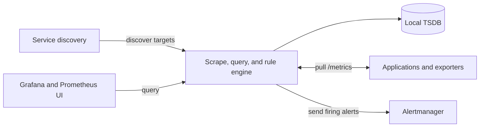

import { Aside } from '@astrojs/starlight/components';
import HistoricalNote from '/src/components/HistoricalNote.astro';

{/* ai-summary
type: lecture
slug: monitoring-and-performance
order: 13
covers: metrics, logs, and traces; monitoring architectures; USE/RED/Golden Signals and SLOs; Prometheus and PromQL; Kubernetes monitoring; dashboards, alerts, and burn-rate thinking
prereq_lectures: container-orchestration, network-services-and-application-delivery
followup_lectures: log-management-and-analysis
paired_activities: prometheus-and-grafana
supports_labs: observability-workshop
*/}

Whether you operate a Kubernetes cluster, a fleet of cloud instances, a rack of physical servers in a data center, or a campus network of switches and routers, the fundamental operational problem is the same: your systems are changing continuously, and most of those changes are silent. Memory usage climbs. Disks fill. Connections accumulate. A database query that completed in 10 milliseconds last week now takes 300 milliseconds. Certificates approach expiration. These changes are invisible until they become user-visible problems, and the moment a user experiences a failure before your tools detected it, you have already lost the initiative.

The difference between teams that detect problems from their tools and teams that discover them from user complaints is operational visibility: a deliberate investment in instrumentation, collection, and alerting that turns system behavior into actionable signal. This is not a single-tool problem. Monitoring is a discipline with multiple competing architectural philosophies, a landscape of specialized tools suited to different environments, and a set of conceptual frameworks for deciding what to measure and when to act. As the Network Services and Application Delivery lecture showed, production traffic already depends on DNS, TLS, reverse proxies, and load balancers before application code even enters the picture. Monitoring is how you notice which layer is degrading, and whether the problem is merely interesting or already user-visible. This lecture covers all of it: the architectural paradigms that define how data flows from systems to operators, the open-source stack that anchors cloud-native environments, the methods for deciding what to measure, and the design practices that make alerting reliable rather than noise.

## The Three Pillars of Observability

The observability community has converged on three categories of telemetry data, called the three pillars: metrics, logs, and traces. These are not interchangeable. Each answers a different kind of question, is collected and stored differently, and serves a different role in the operational lifecycle.

**Metrics** are numeric measurements collected at regular intervals: CPU utilization every 15 seconds, request count per minute, memory usage every 30 seconds. Because they are numeric and sampled uniformly, metrics are cheap to store and fast to query. They are excellent for answering "how much" and "how often" over time, which makes them the backbone of dashboards and alerting. A spike in error rate, a gradual climb in memory utilization, a sudden drop in request throughput: all of these reveal themselves clearly in a time-series graph.

**Logs** are timestamped records of discrete events. When a request fails with a 500 error, a log entry captures the error message, the request path, the client IP, and often a stack trace. Logs are event-driven rather than interval-driven: they are written when something happens, not on a fixed schedule. That event-driven nature is what makes logs irreplaceable for diagnosis. Metrics tell you that something is wrong; logs tell you why.

**Traces** follow a single request as it passes through multiple services. A trace shows that a particular API call spent 5 ms in the load balancer, 80 ms in the application server, and 340 ms waiting on a database query. In a single-service application, you do not need distributed tracing; all the timing information is visible in one place. As architecture grows to include multiple services that call each other, tracing becomes essential for identifying which service in the chain is the bottleneck. Tools like [Jaeger](https://www.jaegertracing.io/), [Tempo](https://grafana.com/oss/tempo/), and OpenTelemetry-compatible collectors gather traces.

[OpenTelemetry](https://opentelemetry.io/) has emerged as the industry-standard instrumentation framework for all three pillars. A single OpenTelemetry SDK emits metrics, logs, and traces in a vendor-neutral format. The OpenTelemetry Collector receives this data and routes it to whatever backend you choose: Prometheus for metrics, Loki or Elasticsearch for logs, Jaeger or Tempo for traces. This standardization matters because it decouples instrumentation from backend selection. Applications that emit OpenTelemetry data can switch monitoring backends without rewriting instrumentation code, and they work the same way on a laptop, a bare metal server, or in a Kubernetes pod. In industry you will frequently encounter OpenTelemetry as the layer that sits between applications and whatever backend the organization has chosen.

Most production systems use all three pillars together. Metrics detect the problem and alert the engineer. Logs provide the context for diagnosing the root cause. Traces reveal which service in a distributed chain is responsible. This lecture focuses on the metrics pillar and the alerting and visualization layer built on top of it.

## Monitoring vs. Observability

The terms "monitoring" and "observability" are sometimes used interchangeably, but they describe genuinely different capabilities.

**Monitoring** answers predefined questions. You decide in advance what to measure, set thresholds, and receive alerts when those thresholds are crossed. Monitoring is essential, but it can only tell you about failure modes you anticipated. If your monitoring watches for high memory usage but not for a slowly growing connection pool leak, you will not know about the leak until it causes the very memory spike you were watching for.

**Observability** is the ability to ask new questions of your system without deploying new instrumentation. A well-instrumented, observable system emits enough data that you can diagnose unexpected failure modes from the outside. You can investigate a failure mode you never anticipated, because the data to answer questions about it already exists.

In practice, this distinction shapes what data you collect. A system that exposes only aggregate error counts is monitorable: you can alert when the error rate climbs. A system that also exposes structured logs with per-request fields, per-endpoint latency histograms, and per-tenant resource consumption is observable: you can ask arbitrary diagnostic questions after the fact. Building toward observability means prioritizing rich, structured data over minimal telemetry, even when you do not yet have a specific question in mind for all of it.

Neither monitoring nor observability is a binary state. Every production system lives somewhere on a spectrum. The tools and practices in this lecture help you move toward the observable end of that spectrum in a cost-effective way.

## Monitoring Architectures: Pull, Push, and Checks

Every monitoring system must answer a foundational design question: who initiates the data collection? The answer defines the architecture and shapes every operational tradeoff that follows. Three major answers to this question represent genuinely different approaches.

### The Check-Based Model

The oldest and most widely deployed monitoring architecture is the check-based model. A central monitoring server, on a fixed schedule, runs scripts that actively test each target: it connects to a web server and checks the HTTP response code, opens a TCP connection to a database port and verifies it accepts connections, queries a DNS server and confirms the response. If the check passes, the target is healthy. If it fails, the target is in a problem state and an alert fires.

[Nagios](https://www.nagios.org/), originally released in 1999, defined this model and the terminology still used today: hosts, services, active checks (the server initiates), and passive checks (the target reports to the server on its own schedule). [Icinga](https://icinga.com/) and [Zabbix](https://www.zabbix.com/) are its modern successors, with better interfaces, clustering, and more flexible check execution. The check-based model remains dominant in enterprise IT, telecommunications, and government infrastructure, and in any environment where most monitored targets are network services and devices rather than instrumented applications.

The model has a fundamental advantage: it requires nothing from the target beyond being accessible. You can monitor a MySQL database, a Cisco router, a hardware load balancer, or a custom TCP service without modifying any code on the target. The check embodies the question a user would ask: is this thing working? If the web server returns 200, it is working. If it times out, it is not.

The limitation is resolution and dimensionality. A check returns "pass" or "fail" and sometimes a single threshold measurement. It cannot tell you the distribution of request latencies, the current connection pool utilization, or which specific query has started consuming 90% of database CPU time. For infrastructure health checks, the model is excellent. For performance investigation and trend analysis, it runs out of resolution quickly.

### SNMP: Monitoring What Does Not Run Your Code

Network switches, routers, storage arrays, UPS systems, and most enterprise hardware speak SNMP (Simple Network Management Protocol) as their native monitoring interface. These devices do not run Linux; you cannot install an exporter on them. SNMP is how you extract metrics from infrastructure that is not your software.

SNMP organizes all measurable device properties into a hierarchical namespace called the Management Information Base (MIB). Each object in the MIB has a numeric Object Identifier (OID): one OID identifies the total octets sent on a network interface, another identifies CPU utilization, a third identifies whether a port is up or down. You poll a device's SNMP agent with a specific OID and it returns the current value. MIB files, which vendors publish for their hardware, define the OIDs available on a given device.

SNMP also supports traps: unsolicited messages the device pushes to a designated receiver when something notable happens. A switch detecting a link failure, a storage array reporting a failed disk, a UPS entering battery mode: all generate SNMP traps. Traps are event-driven rather than polling-based, the SNMP equivalent of push monitoring.

In practice, SNMP metrics are collected by a polling agent (the [Prometheus SNMP Exporter](https://github.com/prometheus/snmp_exporter) translates OID values into Prometheus exposition format; Zabbix and Nagios have native SNMP polling) and fed into the same dashboards and alerting systems as other metrics. The operational lesson: not everything you need to monitor runs software you can instrument. Knowing SNMP exists, understanding what it exposes, and knowing how to configure a collector for it is part of operating infrastructure that includes network devices, which is most infrastructure.

### The Push Model: StatsD and Application Emission

An alternative to central polling is having applications emit metrics themselves. The [StatsD protocol](https://github.com/statsd/statsd), developed at Etsy in 2011, defines a simple format for applications to push metric values to a local daemon via UDP: `page.views:1|c` increments a counter by one, and `request.latency:45|ms` records a 45-millisecond timing measurement. The daemon aggregates values over a flush interval and forwards the results to a backend like [Graphite](https://graphiteapp.org/) or [InfluxDB](https://www.influxdata.com/).

The push model makes instrumentation easy to add: drop in a library, call `statsd.increment("checkout.success")` at the relevant point in code, and the metric appears in your dashboard without configuring a separate exporter or exposing an HTTP endpoint. The tradeoff is that a quiet application looks identical to a crashed one. If the process stops emitting, you see no data. The collector cannot distinguish silence-from-health from silence-from-crash, which is a significant blind spot.

StatsD is still in use, particularly in organizations that adopted it before Prometheus's rise and in environments where the push paradigm fits the architecture. The broader lesson is that push-based metric emission is still the default in many stacks. Understanding why Prometheus made the opposite choice helps you evaluate the tradeoffs when you encounter either approach.

### The Pull Model: Prometheus and Exposition

Prometheus's defining architectural choice is the reverse of StatsD: instead of applications pushing to a collector, the collector periodically fetches from applications. Each application (or an exporter running alongside it) exposes a plain-text HTTP endpoint; Prometheus scrapes that endpoint on a configured interval and stores the results.

The pull model's defining property is that the absence of data is itself a signal. If Prometheus scrapes a target and receives no response, it records a scrape failure and can alert on it. A crashed application that has stopped responding shows up immediately as a failed scrape rather than as silence that might appear healthy. This property is what makes the pull model particularly well-suited to dynamic, ephemeral infrastructure.

<HistoricalNote title="From MRTG to Prometheus: Thirty Years of Metrics">
The first widely used network monitoring tool was MRTG (Multi Router Traffic Grapher), written in 1994 to visualize bandwidth on university routers. It produced static PNG graphs updated every five minutes. Nagios (1999) added alerting and active service health checks, establishing the check-based model. Graphite (2006, developed at Etsy) introduced a purpose-built time-series database for metrics; StatsD (2011, also Etsy) added a simple UDP protocol for application code to emit measurements to Graphite. Prometheus was created at SoundCloud in 2012 by engineers who missed Borgmon, Google's internal monitoring system, and wanted a similar pull-based, label-oriented metric system. It was open-sourced in 2015 and joined the Cloud Native Computing Foundation in 2016. Grafana was written by Torkel Ödegaard in 2013 to provide better dashboards for Graphite than its built-in interface could offer. Both projects are now default infrastructure for the majority of Kubernetes-based production environments worldwide.
</HistoricalNote>

Each architectural model makes different assumptions about the monitoring environment. Cloud-native infrastructure gravitates toward the pull model because it scales well with dynamic targets and integrates naturally with service discovery. Traditional data center and enterprise network infrastructure gravitates toward check-based and SNMP models because those are what the hardware and legacy software speak natively. Most real production environments contain all three paradigms simultaneously, and knowing when to reach for which is part of understanding the monitoring discipline.

## APM: A Different Kind of Visibility

Application Performance Monitoring (APM) is a distinct category of observability tooling that occupies the space between service-level metrics and distributed tracing. Where Prometheus tells you that request latency is elevated for a service, APM tools tell you which specific method, database query, or external API call within that service is responsible.

APM instruments individual code paths automatically. In Java, APM agents typically use bytecode injection: the agent intercepts class loading at JVM startup and inserts instrumentation code into application methods without requiring changes to the application itself. In Python and Ruby, agents patch standard library functions at import time. The result is a call graph for each request: this HTTP request spent 5 ms in routing, 80 ms in business logic, and 340 ms waiting for a PostgreSQL query, and here is the specific query text that was slow.

Tools in this space include [Dynatrace](https://www.dynatrace.com/), [New Relic APM](https://newrelic.com/), [Datadog APM](https://www.datadoghq.com/product/apm/), [Sentry Performance](https://sentry.io/solutions/application-performance-monitoring/), and [Elastic APM](https://www.elastic.co/observability/application-performance-monitoring). APM is most valuable when you know a service is slow (from service metrics) and need to understand which internal operation is responsible. In a monolithic application, APM is often the first tool for performance investigation. In a microservices architecture, APM and distributed tracing overlap substantially, and OpenTelemetry is the emerging instrumentation standard for both.

## What to Measure: Three Layers and Monitoring Frameworks

Deciding what to measure has two parts: understanding which layer of the system a metric describes, and applying systematic frameworks to avoid missing important signals.

### The Three Layers of Metrics

Metrics exist in three layers, each answering a different question about your system.

**Infrastructure metrics** answer "is the hardware and operating system healthy?" CPU utilization, memory usage, disk I/O, network packet rates, and file descriptor counts describe the environment in which software runs. Infrastructure metrics are often leading indicators: a machine running out of memory may degrade application performance before triggering application-level errors.

**Service metrics** answer "is my software handling requests correctly?" Request rate, error rate, and latency describe how software behaves from the perspective of its callers. A crashed application process produces healthy infrastructure metrics on the host machine but zero service-level traffic.

**Business metrics** answer "is my system producing value?" Orders placed per minute, checkout conversion rate, user signups, active sessions, and revenue per hour describe whether the system is accomplishing its purpose. A deployment can introduce a bug that causes checkout to accept orders but fail to charge credit cards while infrastructure and service metrics look entirely normal. Business metrics catch this class of failure when nothing else does.

Most teams instrument infrastructure and service metrics well. Business metrics are often measured through separate analytics platforms, which creates a gap during incidents. Knowing whether an elevated error rate is causing real business impact requires either switching tools or having business metrics in the same monitoring stack as your infrastructure dashboards. The teams with the shortest MTTR are usually the ones who can answer "is this causing business impact?" from the same dashboard where they spotted the alert.

### The USE Method

The USE method, developed by performance engineer Brendan Gregg, applies to physical and logical resources: CPU, memory, disk, network interfaces, file descriptors, and any other constrained resource your system depends on. For each resource, it asks three questions.

**Utilization** is the fraction of the resource's capacity currently in use. For CPU, this is the percentage of time the processor is not idle. For a connection pool, it is the fraction of connections in use. Utilization tells you how close to capacity you are.

**Saturation** is whether work is queuing because the resource is overloaded. A CPU running at 95% utilization with a run queue of one process is busy but not saturated. The same CPU with a run queue of 30 processes is saturated: work is waiting. Saturation is often the more actionable signal, because it indicates that processes or requests are actually waiting, not just that the resource is busy.

**Errors** are the rate at which the resource produces failure signals. Disk read errors, ECC memory corrections (which signal hardware degradation before it causes failures), network packet drops at the interface level, and file descriptor exhaustion all fall here. Errors often signal hardware or configuration problems that utilization alone would never reveal.

Apply USE to every resource in your system before an incident forces you to. In a Kubernetes environment, the resources include not just the node hardware but also the Kubernetes scheduler (are pods queuing because nodes have no capacity?) and the container runtime (are containers hitting their memory or CPU limits?).

### The RED Method

The RED method, developed by Tom Wilkie, applies to request-driven services: web servers, APIs, microservices, and any component that handles requests. For each service, it measures three things.

**Rate** is the number of requests per second the service handles. Rate gives you a baseline: a drop from 200 to 20 requests per second is a signal that traffic is not reaching the service, even if the service appears healthy by other measures.

**Errors** is the proportion of requests that fail. This is the user-facing availability signal. Errors should be measured at the layer closest to the user to capture failures from any component in the stack.

**Duration** is how long requests take, measured as a distribution rather than a single average. A service with a median latency of 80 ms but a 99th-percentile latency of 4 seconds has a serious tail-latency problem. The majority of requests are fast, but a predictable fraction of users experience a degraded experience. Percentiles reveal this; averages conceal it.

USE and RED together cover the full surface of a typical production system. USE tells you whether resources are healthy; RED tells you whether services are behaving correctly from the perspective of their callers.

### The Golden Signals

Google's Site Reliability Engineering book distilled monitoring for request-driven systems into four signals: latency, traffic, errors, and saturation. This overlaps heavily with RED. In practice, the Golden Signals are best understood as RED plus one explicit question about capacity. RED focuses on user-visible symptoms at the service boundary. The Golden Signals keep that same user-facing orientation, but make saturation explicit so you notice the resource pressure that often appears before latency and errors climb.

**Latency** measures how long successful requests take, distinguished from how long failed requests take. A failure completing in 1 ms should not be averaged with slow successful requests; the two have different operational meanings. Latency should always be measured at percentiles, not as an average.

**Traffic** measures demand on the system: requests per second, queries per second, or whatever unit best represents load. Traffic context is essential for interpreting other signals. High CPU at 100 requests per second may indicate a problem; high CPU at 10,000 requests per second may be expected.

**Errors** measure the rate of requests that fail, both explicitly (HTTP 500, connection refused) and implicitly (HTTP 200 with incorrect content, when detectable).

**Saturation** measures how full the service is: what proportion of its capacity it is consuming. For a CPU, it is utilization. For a connection pool, it is the fraction of connections in use. Saturation is often the leading indicator: it starts climbing before latency and errors do.

USE, RED, and the Golden Signals are not competing religions. USE is strongest for resources and infrastructure. RED is strongest for request-driven services and alerting. The Golden Signals are a compact checklist for service dashboards that blends the user-experience focus of RED with an explicit capacity lens.

## SLIs, SLOs, and Error Budgets

Knowing what to measure is only half the problem. You also need to define what "healthy enough" looks like. That is the role of Service Level Indicators, Service Level Objectives, and error budgets.

A **Service Level Indicator (SLI)** is a specific, measurable signal that reflects user experience. SLIs are expressed as ratios: good events divided by total events. For a web application, typical SLIs include availability (the proportion of requests that return a successful response) and latency (the proportion of requests served faster than a defined threshold). The ratio framing scales correctly across traffic levels: 100 errors per minute is catastrophic at 200 requests per minute but negligible at 200,000 requests per minute.

A **Service Level Objective (SLO)** is a target for an SLI over a rolling time window. An SLO might state that 99.9% of requests will return a non-error response over any 30-day rolling window. That sounds generous until you calculate what 0.1% error exposure means: approximately 43 minutes of total downtime per month. A 99.99% SLO gives you only 4.3 minutes.

A **Service Level Agreement (SLA)** is a formal commitment to an SLO, typically with contractual consequences. SLAs are what vendors promise to enterprise customers. SLOs are what engineering teams set internally, usually more conservatively than the SLA so that a near-miss on the internal target does not immediately constitute a breach.

The **error budget** is the complement of the SLO: the 0.1% of requests allowed to fail under a 99.9% objective over the measurement window. The error budget is not a number to minimize at all costs; it is a budget to spend deliberately. When the budget is healthy, engineering teams can deploy frequently and accept some risk in pursuit of feature velocity. When the budget is nearly exhausted, teams should shift priority to reliability work. This creates a data-driven conversation between product teams and operations teams, grounded in actual user impact rather than intuition.

<Aside type="note" title="SLOs Require Organizational Commitment">
An error budget creates the right incentives only if the organization acts on it. An SLO that nobody enforces when breached is just a number on a dashboard. The most important step after defining an SLO is agreeing on what specifically happens when the error budget burns down faster than expected: who is notified, what work gets deprioritized, and who makes the call.
</Aside>

## Prometheus: Architecture and the Pull Model

[Prometheus](https://prometheus.io/docs/introduction/overview/) is the most widely deployed open-source metrics system, and it is the standard foundation for monitoring in Kubernetes environments. Each application (or an exporter running alongside it) exposes a plain-text HTTP endpoint; Prometheus scrapes that endpoint on a configured interval and stores the results in a local time-series database.

At a high level, Prometheus has a small number of moving parts. Targets and exporters expose metrics, service discovery tells Prometheus where those targets live, the Prometheus server scrapes and stores the results locally, Grafana and the built-in web UI query Prometheus for graphs, and Alertmanager handles notifications when alert rules fire. The diagram below deliberately simplifies the deployment so the main data flow stays visible.



A typical endpoint response looks like this:

```
# HELP node_memory_MemAvailable_bytes Memory information field MemAvailable_bytes.
# TYPE node_memory_MemAvailable_bytes gauge
node_memory_MemAvailable_bytes 3.52122624e+09
# HELP http_requests_total Total HTTP requests received.
# TYPE http_requests_total counter
http_requests_total{status="200",method="GET"} 14523
http_requests_total{status="500",method="GET"} 42
```

The scrape interval determines the resolution of your metrics data. Prometheus itself defaults to a 1-minute global scrape interval, but many production deployments, especially Kubernetes-focused ones, lower that to 15 seconds for better alerting and rate-calculation resolution. A shorter interval gives finer resolution but increases storage consumption and scrape overhead. A longer interval is cheaper but means rate calculations and alert evaluation have coarser granularity. In practice, 15 seconds is a common production choice, not the upstream Prometheus default.

### Metric Types

Prometheus defines four metric types.

A **counter** is a value that only increases, or resets to zero when the process restarts. Total HTTP requests served and total errors are counters. The raw counter value is rarely what you want; the `rate()` function converts it into a per-second rate over a time window. The monotonic property lets Prometheus handle process restarts gracefully: a reset to zero is detectable and `rate()` accounts for it automatically.

A **gauge** is a value that can go up or down at any time. Current memory usage, the number of active connections, and queue depth are gauges. Gauges represent a snapshot of state at a moment in time.

A **histogram** samples observations (such as request durations) and counts how many fall into each configured bucket. Histograms enable quantile computation at query time using `histogram_quantile()`. The tradeoff is that bucket boundaries must be configured in advance.

A **summary** is similar to a histogram but computes quantiles on the client side. Summaries cannot be aggregated across multiple instances, which makes them less useful in distributed deployments. Histograms are generally preferred in modern Prometheus usage.

## Cardinality and the Label Design Problem

Labels are Prometheus's mechanism for distinguishing between time series that share a metric name. The label `{status="200"}` on `http_requests_total` separates successful requests from `{status="500"}` on the same metric. Status codes are a small, bounded set known in advance: this is correct use of labels.

Labels become a serious problem when their values are not from a bounded set. Adding a label whose value is a user ID, a session token, a full URL path, or a request ID does not add two or three time series to a metric: it adds as many time series as there are distinct values. For a service handling 100,000 unique users per day, adding `user_id` as a label creates 100,000 time series for that single metric. Each time series has its own storage, scrape overhead, and query processing cost. Cardinality at this scale can exhaust Prometheus's memory within hours of a deployment.

This is the most common production mistake engineers make when first instrumenting with Prometheus. A label is appropriate when it has a small, bounded set of values known in advance: HTTP method, HTTP status code class, Kubernetes namespace, service name, or region. A label is inappropriate when the number of distinct values is unbounded: user ID, customer ID, source IP address, full request URL, or request ID.

The correct place for high-cardinality identifiers is in logs or traces, not in metrics. A log entry can contain a specific user ID or request ID because logs are stored and searched individually, not aggregated across millions of events. Metrics aggregate across all events in a time window; they lose the individual record in exchange for cheap, long-term storage of aggregate signals.

<Aside type="caution" title="Cardinality Kills Prometheus">
If Prometheus memory usage is climbing unexpectedly, check the current time series count using the metric `prometheus_tsdb_head_series`. To find which metrics have the most series, run `topk(10, count by (__name__)({__name__=~".+"}))` in Prometheus's query interface. More than a few million series in a single instance is a strong sign of a cardinality problem in the instrumentation.
</Aside>

## Exporters

Most software does not expose Prometheus metrics natively. Exporters bridge this gap: separate processes that translate a target system's native instrumentation into Prometheus exposition format. [Node Exporter](https://prometheus.io/docs/guides/node-exporter/) exposes Linux operating system metrics from the host kernel: CPU, memory, disk I/O, network throughput, and filesystem usage. A PostgreSQL exporter translates database statistics. The SNMP Exporter converts OID values from network devices into Prometheus metrics, bridging the SNMP and pull-model worlds.

Dozens of community-maintained exporters cover databases, message brokers, web servers, cloud services, and hardware. When you add a new component to your infrastructure, your first question should be whether a Prometheus exporter already exists for it. For most common software, it does.

## Synthetic Monitoring and Real User Monitoring

The pull model and check-based model both measure systems from the inside out. **Synthetic monitoring** measures from the outside in: scripted probes simulate what a user would do and verify the system responds correctly.

The [Prometheus Blackbox Exporter](https://github.com/prometheus/blackbox_exporter) probes endpoints over HTTP, HTTPS, DNS, TCP, and ICMP and exposes the results as Prometheus metrics: whether the probe succeeded, the response time, the TLS certificate expiry days remaining, and the HTTP status code. A service that passes its internal health checks but returns 502 from behind the load balancer shows up as healthy in internal metrics and failing in Blackbox Exporter probes. That discrepancy tells you the problem is between the service and the user (the ingress controller, the load balancer, the CDN) rather than in the service itself.

External probing services such as Pingdom and UptimeRobot do the same thing from locations entirely outside your infrastructure, catching failures that affect external users but not internal checks: a misconfigured firewall, a BGP routing problem, or a certificate that internal services bypass through internal DNS. Open-source tooling exists here too: Prometheus Blackbox Exporter covers protocol-level probes, while self-hosted tools such as Gatus and Uptime Kuma package probing with their own dashboards and alerting. Full browser-journey synthetics are also possible with open-source browser automation frameworks, but they usually require more assembly than managed services.

**Real User Monitoring (RUM)** is categorically different. Instead of simulating user actions from a probe, RUM instruments the user's browser with JavaScript to measure actual user experience: page load time, time to interactive, Core Web Vitals, JavaScript error rates, and network timing from the user's actual connection and device. RUM data captures the distribution of real user experiences across geographies and devices, which synthetic probes from a fixed data center location cannot replicate. In practice, many of the APM platforms named earlier, including Datadog, Dynatrace, New Relic, and Sentry, offer this browser-side view as part of the same product rather than as a completely separate tool.

Synthetic monitoring provides consistent, controlled measurements and alerts you when the service breaks. RUM reveals how actual users are experiencing the service, including users on slow networks or older devices whose experience a synthetic probe from a fast connection would never see. Both belong in a mature monitoring stack.

## eBPF and Zero-Code Instrumentation

[eBPF](https://ebpf.io/) is a Linux kernel feature that allows small, sandboxed programs to run safely inside the kernel in response to events: system calls, network packet arrivals, function calls in user space. For observability, eBPF enables instrumentation without modifying application code, deploying agents inside application containers, or recompiling anything.

An eBPF-based observability tool running with appropriate privileges on a Kubernetes node can observe every HTTP request made by every pod, every database query, every DNS lookup, and every file operation, by tracing the kernel and library functions that all of these operations pass through. The instrumentation is transparent to the application: no code changes, no agent injection, no restart required.

[Cilium](https://cilium.io/) uses eBPF for Kubernetes networking and provides network observability as a byproduct. [Pixie](https://px.dev/) provides automatic request tracing, protocol parsing, and pod-level metrics for Kubernetes workloads via eBPF without requiring code changes or sidecar containers. [Parca](https://www.parca.dev/) does continuous profiling using the same mechanism. eBPF requires Linux kernel 4.9 or later for basic features and 5.x for more advanced capabilities. The tooling is still maturing compared to Prometheus and Grafana, but it represents the direction the observability ecosystem is moving.

## Prometheus Inside Kubernetes

Running Prometheus as a standalone process requires manually editing `prometheus.yml` with scrape target addresses and reloading when anything changes. In a Kubernetes environment, pods get rescheduled to different IP addresses and scaling events add or remove instances in seconds. Static configuration is impractical.

The [**Prometheus Operator**](https://prometheus-operator.dev/) is a Kubernetes controller that manages Prometheus as a native Kubernetes resource. Rather than editing a configuration file, you define scrape targets and alert rules as Kubernetes Custom Resources. The Operator watches for these resources and reconciles Prometheus configuration automatically.

**ServiceMonitor** is a Custom Resource Definition that tells the Prometheus Operator which Kubernetes Services to scrape, on which port, and at what interval. When you create a ServiceMonitor with `kubectl apply`, the Operator adds the corresponding scrape configuration to Prometheus automatically. The monitored Service needs no knowledge of Prometheus; the ServiceMonitor is a separate object that describes the relationship.

**PrometheusRule** is a CRD that defines alert rules as Kubernetes objects. You create them with `kubectl apply`, view them with `kubectl get prometheusrule`, and manage their lifecycle with the same tools you use for any other manifest. This treats monitoring configuration as infrastructure code, subject to version control and automated deployment.

The **kube-prometheus-stack** is a [Helm](https://helm.sh/) chart that bundles Prometheus, the Prometheus Operator, Alertmanager, Grafana, kube-state-metrics, and Node Exporter into a single installable package, pre-configured to monitor a Kubernetes cluster immediately after installation. That convenience is a property of the chart, not of Kubernetes itself. A plain Prometheus server running in a cluster does not automatically discover kube-state-metrics unless you configure scraping for it or use an operator/chart that wires it in.

<Aside type="note" title="Managed Runtimes Change the Backend More Than the Concepts">
If you run Kubernetes through EKS, GKE, or AKS, you may use a managed Prometheus service instead of operating Prometheus yourself. The underlying ideas do not change: exporters still expose metrics, labels still distinguish time series, and PromQL or Prometheus-compatible queries still power dashboards and alerts. What changes is that cloud providers also expose their own native metrics for the managed pieces around your workloads, such as load balancers, managed databases, and serverless components.

The same logic applies outside Kubernetes. If you run containers on ECS, you will often start with CloudWatch metrics and Container Insights, then add OpenTelemetry or Prometheus-compatible metrics when you need deeper application detail. On EC2 or other virtual machines, Node Exporter and application exporters fill the same role. In Nomad environments, teams commonly pair Prometheus with Nomad or Consul service discovery, or use a vendor platform such as Datadog. The real choice is usually not whether to do observability, but which layers are provider-managed and which layers you instrument and query yourself.
</Aside>

### kube-state-metrics

Node Exporter exposes metrics from the Linux kernel: CPU seconds, memory bytes, disk I/O counts. These are operating system metrics; Node Exporter does not know whether a consuming process is a Kubernetes pod or a system daemon.

**kube-state-metrics** fills the gap by querying the Kubernetes API server and exposing cluster state as Prometheus metrics: how many replicas does this Deployment have versus how many are desired? Has this pod been restarted in the last five minutes? Is this PersistentVolumeClaim bound? These are Kubernetes-level facts, invisible to the operating system.

When you write a PromQL query using `kube_pod_container_status_restarts_total`, you are reading from kube-state-metrics. When you use `node_memory_MemAvailable_bytes`, you are reading from Node Exporter. Knowing the origin of each metric helps you reason about what is and is not being measured when something appears missing from your data.

## PromQL: Extracting Meaning from Metrics

[PromQL](https://prometheus.io/docs/prometheus/latest/querying/basics/) is the query language for Prometheus data. Most useful queries are built from the same small set of parts: a metric name, optional label matchers, an optional time window, optional functions, and optional aggregation. Once you can read those pieces in order, PromQL stops looking like punctuation and starts looking like a description of what you want to measure.

### The Shape of a Query

This query contains most of the core syntax worth learning first:

```promql
sum by (job) (rate(http_requests_total{job="api"}[5m]))
```

Read it from the inside out. `http_requests_total` is the metric name. `{job="api"}` filters to time series whose `job` label has that value. `[5m]` turns the selector into a five-minute history window. `rate(...)` converts a counter into a per-second rate over that window. `sum by (job) (...)` aggregates the matching series while preserving the `job` label. Most dashboard panels and alert rules are variations on this pattern.

PromQL also supports scalar and string values, but most operational work uses vectors, which means sets of time series. The first question to ask of any query is therefore simple: do I need the latest sample from each series, or a window of historical samples?

### Instant and Range Vectors

A plain metric name returns an **instant vector**: the most recent value for every time series matching that name, along with its labels. Adding a time window in square brackets produces a **range vector**: the historical values for each matching time series over the specified duration. A range vector is the input to functions like `rate()` and `increase()`, which need a window of history to compute rates of change. Many beginner mistakes in PromQL come from handing the wrong data shape to a function.

### Functions Must Match the Metric

Not every function applies to every metric. PromQL is type-aware, and the metric's semantics matter too. `rate()` and `increase()` are for counters, not gauges. Gauge-style metrics are usually read directly or summarized with over-time functions such as averages or maxima. Histogram functions such as `histogram_quantile()` require histogram bucket data. A query can be syntactically valid and still be conceptually wrong, such as taking `rate()` of free memory. The safest habit is to ask two questions before choosing a function: what kind of metric is this, and am I working with an instant vector or a range vector?

### rate() and increase()

Counter metrics are rarely useful raw because they only increase. `rate()` computes the per-second average rate of increase of a counter over a time window:

```promql
rate(http_requests_total[5m])
```

This returns the average per-second request rate over the last 5 minutes, separately for each label combination. The 5-minute window smooths out short bursts; a shorter window like `[1m]` is more responsive but noisier.

`increase()` returns the total increase in a counter over a time window. An expression for detecting crash-looping pods:

```promql
increase(kube_pod_container_status_restarts_total{namespace="default"}[10m]) > 3
```

A value above 3 means the container restarted more than 3 times in the last 10 minutes, which is a natural basis for a crash-loop alert.

### histogram_quantile()

For histograms, `histogram_quantile()` computes percentiles at query time. For classic Prometheus histograms, you usually pair it with `rate()` over the `_bucket` series and an aggregation that preserves the `le` bucket label:

```promql
histogram_quantile(0.95,
  sum by (job, le) (
    rate(http_request_duration_seconds_bucket[5m])
  )
)
```

This computes the 95th-percentile latency over a 5-minute window. Plotting p50, p95, and p99 on the same panel reveals the shape of the latency distribution and makes tail-latency problems immediately visible.

### Aggregation

PromQL aggregation operators summarize across label dimensions. The `by` clause controls which labels survive the aggregation:

```promql
sum(rate(http_requests_total[5m])) by (job)
```

This computes total request rate grouped by service name. To compute memory usage as a percentage of total node RAM:

```promql
100 - (node_memory_MemAvailable_bytes / node_memory_MemTotal_bytes * 100)
```

## Recording Rules

Once you can express a query in PromQL, the next question is whether you should recompute it every time a dashboard loads or an alert evaluates. Some queries are expensive. A histogram quantile over millions of time series, or a complex aggregation across dozens of services, can take several seconds. When that query powers a dashboard that many engineers have open simultaneously, or an alert that Prometheus evaluates every 15 seconds, the compute cost multiplies quickly.

Recording rules precompute expensive PromQL expressions and store the result as a new metric, updated on a configurable interval. Dashboards and alert rules that need the result query the precomputed metric instead of rerunning the expensive expression on every load or evaluation:

```yaml
groups:
  - name: latency.rules
    rules:
      - record: job:http_request_duration_seconds:p95
        expr: |
          histogram_quantile(0.95,
            sum by (job, le) (
              rate(http_request_duration_seconds_bucket[5m])
            )
          )
```

The naming convention `level:metric:operation` is a Prometheus community standard. Here `job` is the aggregation level, `http_request_duration_seconds` is the base metric, and `p95` describes what the rule computes. Recording rules also let you materialize SLI calculations as metrics, simplifying both alerting and long-term SLO reporting. Rather than recalculating the error ratio in every alert expression, a recording rule updates it on a schedule and the alert simply checks the precomputed value.

## Grafana: From Numbers to Understanding

Prometheus stores and queries data; Grafana makes it visual. A Grafana dashboard is a collection of panels, each displaying one or more PromQL queries as a graph, stat, gauge, table, or heatmap. The power of a dashboard is not in any individual panel but in the layout of many panels together, so that relationships between signals are immediately visible without switching between multiple pages. In practice, the most effective dashboards organize those panels around a monitoring strategy such as RED or the Golden Signals, then arrange them so the viewer can move from symptom to likely cause without hunting.

### Dashboard Design Principles

Grafana's [dashboard design guidance](https://grafana.com/docs/grafana/latest/dashboards/build-dashboards/best-practices/) is useful, but the underlying operational principle is broader: a dashboard that tries to show everything communicates nothing. These principles separate dashboards that engineers actually use from ones that exist but are never opened.

Put the user perspective first. The top row of any service dashboard should answer the question a user would ask: is the service available and fast? Lead with error rate and latency percentiles before showing infrastructure metrics.

Layer your dashboards. An overview dashboard shows one row per major service with its golden signals. Clicking a service leads to a detailed dashboard for that component. On-call engineers start at the overview and drill down to what is failing.

Keep every panel purposeful. Each panel should answer a specific operational question. After each incident, add the panels that would have helped you diagnose it faster, and remove the ones nobody opened.

Add deployment annotations. Grafana supports vertical markers on time-series graphs showing when a deployment happened. A spike in errors immediately following a deployment annotation is one of the clearest causal signals available in a dashboard, visible in seconds.

Use consistent units and scales across related panels. Two latency panels in the same row should use the same axis units and scale. Mismatched scales make visual correlation impossible, which defeats the purpose of placing panels together.

## Baselines and Seasonality

A static alert threshold is a claim that a metric value above a certain point always indicates a problem. For many metrics, this claim is false. A cluster at 60% CPU at 10 AM on a Tuesday and the same 60% CPU at 2 AM on a Sunday are in very different states: one is normal load, the other may indicate something unexpected.

Traffic patterns for most systems exhibit seasonality: regular variation by time of day, day of week, and sometimes by billing cycle or academic calendar. An e-commerce platform sees higher load on weekday afternoons. A payroll system spikes on the last Friday of every month. Alert thresholds that ignore these patterns fire every time the pattern repeats, even when nothing is wrong, eroding engineer trust in the alerting system.

Dynamic thresholds address this by comparing current behavior against historical behavior from the same time period. "Is CPU now significantly higher than CPU at this same hour last Tuesday?" is a more meaningful question than "Is CPU above 80%?" Some platforms support anomaly-based alerting natively: AWS CloudWatch Anomaly Detection, Datadog's anomaly monitors, and Prometheus's `predict_linear()` function for gradual trend alerting. The tradeoff is tuning complexity: anomaly detection generates fewer false positives from expected load spikes but can miss real problems that match the historical pattern.

The practical starting point is not automated anomaly detection but documented seasonality: know when your high-traffic periods are, adjust thresholds or silence windows accordingly, and annotate dashboards with traffic-event markers so you can distinguish load increases from code changes versus organic growth.

For services without enough production history to build a baseline from, the baseline has to come from controlled experiments instead. Driving synthetic traffic at known rates with a load generator like [k6](https://k6.io/), [Locust](https://locust.io/), or `wrk` produces a characteristic curve of latency, error rate, and resource utilization that becomes the launch baseline. The same exercise lets you verify that alert thresholds and histogram bucket boundaries are sized for the latency distribution your service actually produces, before any users see them. The Reliability Engineering lecture treats load testing primarily as a capacity-validation tool; from a monitoring perspective, the value is the same one historical data provides for older services: a known reference point against which the next observation can mean something.

## Alerting: From Metrics to Action

Dashboards are for engineers who happen to be looking at them. Alerts are for the rest of the time. The purpose of alerting is to notify the right person about the right problem at the right time, with enough context to act.

### Alert Rules

A Prometheus alert rule has three required parts: a PromQL expression that defines the triggering condition, a `for` duration that specifies how long the condition must be true before the alert fires, and labels and annotations that describe the alert and carry information to the responder.

The `for` clause prevents a single bad scrape, a momentary CPU spike, or a brief network blip from triggering an alert. It requires the condition to be continuously true for the specified duration before the alert transitions from Pending to Firing:

```yaml
groups:
  - name: example.rules
    rules:
      - alert: PodCrashLooping
        expr: increase(kube_pod_container_status_restarts_total{namespace="default"}[10m]) > 3
        for: 2m
        labels:
          severity: critical
        annotations:
          summary: "Pod {{ $labels.pod }} is crash looping"
          description: "Pod {{ $labels.pod }} has restarted more than 3 times in the last 10 minutes."
```

The `{{ $labels.pod }}` template syntax allows annotations to include the specific label values that triggered the alert, so the notified engineer knows which pod, node, or service is involved without having to look it up.

### Symptom-Based vs. Cause-Based Alerts

A **cause-based alert** fires on an internal metric: "CPU above 80%," "disk I/O wait above 15%," "connection pool 90% full." These alerts are fragile because they require anticipating every internal cause of a user-visible problem in advance. They also fire when the cause has no user impact: a disk at 85% capacity is not always urgent.

A **symptom-based alert** fires on a user-facing signal: "error rate above 1% for 5 minutes," "p95 latency above 500 ms for 3 minutes," "external probe failing." These alerts fire only when users are actually experiencing a problem, regardless of which internal cause is responsible. They have fewer false positives and are always actionable.

The practical approach is a small number of symptom-based alerts for page-worthy problems supplemented by lower-urgency cause-based alerts for conditions that could become problems but have not yet caused user impact. High disk usage trending upward is worth a warning. It is not worth a page until it becomes critical.

### Runbooks

Every alert should be paired with a runbook: a short document telling the on-call engineer what to check first and what to do. A runbook for a pod crash-looping alert might say: run `kubectl describe pod <pod-name>` and examine the Events section at the bottom. If the image pull failed, check that the tag exists in the registry. If the exit code is 137, the container was killed by the OOM killer and needs higher memory limits. If a ConfigMap or Secret changed recently, check whether the change introduced an invalid value.

These steps narrow the search space dramatically and allow an engineer unfamiliar with the service to take productive action within the first minutes of an incident. A runbook that must be written from scratch while on call is not a runbook; it is a delay.

## Alert Fatigue and How to Prevent It

Alert fatigue is the condition in which engineers receive so many notifications that they begin treating all of them as background noise, including the ones that are real. It is a systemic reliability risk: a team experiencing alert fatigue is effectively operating without monitoring, because the human attention that the monitoring system depends on has been eroded.

Alert fatigue has one cause: alerts that do not consistently warrant the response they demand. An alert that fires every night at 2 AM and always resolves by 3 AM without action is training engineers to silence it. Every alert that fires without prompting a response represents a withdrawal from the account of trust the entire alerting system depends on.

Preventing alert fatigue requires treating noisy alerts as bugs. Track alert volume over time. Any alert that fires more than twice per shift without an actionable response should be redesigned or removed. Any alert that is routinely silenced during maintenance windows should have silence rules built into its configuration.

<Aside type="caution" title="Alert Fatigue Is a Safety Problem">
When engineers are trained to ignore alerts, the false negative rate of the entire alerting system climbs toward 100%. The next real incident is the one they ignore because it looks like all the noisy ones. Treat alert fatigue as a reliability issue, not a comfort issue.
</Aside>

## Dead Man's Switch: Monitoring Your Monitoring

The most serious failure mode in a monitoring system is not a false positive but a false negative: a state where the monitoring infrastructure is present but producing no alerts, including no alerts about its own failure. A Prometheus server that crashes, a network partition that prevents scrapes from completing, or an Alertmanager misconfiguration that silently drops notifications: all of these create conditions where everything appears quiet while serious problems accumulate undetected.

The dead man's switch pattern addresses this by inverting the normal alert logic. Instead of "alert when this condition becomes true," you create an alert that continuously fires under normal conditions. Alertmanager routes this watchdog alert to a secondary system that expects to receive it on a regular interval. If the watchdog stops arriving, the secondary system notifies on-call.

```yaml
groups:
  - name: watchdog
    rules:
      - alert: Watchdog
        expr: vector(1)
        labels:
          severity: none
        annotations:
          summary: "Monitoring heartbeat: Prometheus is alive and evaluating rules"
```

Services like [Dead Man's Snitch](https://deadmanssnitch.com/) and PagerDuty's heartbeat integration expect regular pings and alert when they stop. In kube-prometheus-stack, a Watchdog alert is configured by default. If you stop receiving it in your alerting pipeline, you know something upstream has failed. Knowing your monitoring is alive is as important as knowing your application is alive.

## Alertmanager: Routing, Grouping, and Inhibition

**Alertmanager** receives fired alerts from Prometheus and routes them to notification channels based on labels. A common severity scheme uses three levels: critical (user-facing impact, page immediately), warning (attention needed within business hours, goes to Slack or a ticket), and info (notable but not actionable, logged without interrupting anyone).

### Grouping and Routing

`group_by` clusters related alerts into a single notification rather than sending one notification per firing alert. A cascading failure that triggers 20 separate alerts can be batched into a few grouped notifications based on shared properties, preventing an alert storm from overwhelming on-call. The `group_wait` parameter controls how long Alertmanager waits before sending the first notification for a new group, allowing additional related alerts to arrive and be included. `repeat_interval` controls how often a still-firing alert is re-notified.

### Inhibition Rules

Inhibition rules suppress downstream alerts when a root-cause alert is already firing. The classic case: a Kubernetes node goes down. Prometheus fires a `NodeDown` alert. At the same time, every pod on that node fails its scrape, generating a separate `TargetDown` alert for each one, and every service on those pods exceeds its error-rate threshold. The on-call engineer receives dozens of notifications that all trace back to one fact.

An inhibition rule collapses this noise:

```yaml
inhibit_rules:
  - source_match:
      alertname: NodeDown
    target_match_re:
      alertname: "TargetDown|ServiceHighErrorRate"
    equal: ['node']
```

The `equal` field requires labels to match between source and target, so alerts from other nodes are not suppressed. Inhibition does not eliminate information; it suppresses noisy downstream consequences while the root-cause alert remains visible. The goal is to make the signal-to-noise ratio high enough that the on-call engineer identifies the root cause quickly rather than triaging 30 alerts simultaneously.

### Silences

Silences are planned suppressions, not workarounds. You create a silence before a maintenance window so that expected alerts do not page on-call. A silence says "during this time window, do not notify for alerts matching these labels." Silences should be time-bounded and created in advance, not applied retroactively to alerts that have already fired.

## SLO Burn-Rate Alerting

Traditional SLO alerting fires when the SLO is violated: if your availability SLO is 99.9%, alert when the error rate exceeds 0.1%. The problem is that this is reactive: you only get notified after you have already breached the objective.

**Burn-rate alerting** fires when your error budget is being consumed faster than it can be replenished, before you have exhausted it. The burn rate is the ratio of current error rate to the SLO's acceptable error rate. A burn rate of 1 means you are consuming the budget at exactly the sustainable pace. A burn rate of 14.4 means you are consuming a 30-day budget 14.4 times faster than sustainable, which would exhaust it in a little over two days.

```promql
(
  rate(http_requests_total{status=~"5.."}[1h])
  /
  rate(http_requests_total[1h])
) / (1 - 0.999)
```

This query computes the 1-hour burn rate against a 99.9% SLO. By itself, that is only one half of a mature alert. A common starting point from Google's SRE guidance is to page when the burn rate exceeds 14.4 over both 1 hour and 5 minutes, or 6 over both 6 hours and 30 minutes, and to open a lower-urgency ticket when it exceeds 1 over both 3 days and 6 hours. Pairing a long window with a short one reduces false positives from transient spikes while still resetting quickly after the incident ends. Burn-rate alerting represents a shift in how you think about SLOs: not as limits to enforce after the fact, but as budgets to manage in real time.

## On-Call Culture and MTTD/MTTR

The goal of the severity hierarchy is to ensure that the on-call rotation is sustainable. On-call engineers who are repeatedly interrupted by urgent alerts burn out and make mistakes during incidents. Google's SRE literature treats roughly two distinct incidents per 12-hour shift as an upper bound for sustainable pager load. An incident here means one underlying problem, even if that problem generates many duplicate pages. That benchmark is useful because it forces you to examine grouping quality, duplicate alert fan-out, and alert storms rather than counting raw notifications alone.

### MTTD and MTTR

The effectiveness of a monitoring system is measurable. **Mean Time to Detect (MTTD)** is the average time between when an incident begins and when the monitoring system notifies someone. A long MTTD means problems are persisting without detection: alert rules are not sensitive enough, or symptoms take too long to cross alert thresholds.

**Mean Time to Recover (MTTR)** is the average time from notification to resolution. MTTR reflects how quickly an engineer can understand the alert (annotations, runbooks), diagnose the root cause (logs, dashboards), and apply a fix. A long MTTR often indicates gaps in runbooks or investigation tooling.

The relationship between MTTD and alert design is direct. A `for: 5m` clause on every alert improves false-positive rates but adds 5 minutes to MTTD for every incident. SLO burn-rate alerting shortens MTTD for high-impact incidents by alerting before the SLO is breached. Tracking both MTTD and alert false-positive rate over time helps you calibrate the right balance between sensitivity and noise.

## Local Tools for Real-Time Investigation

Prometheus describes the historical picture. Sometimes you need to understand what is happening on a specific machine right now, without waiting for metrics to be scraped and displayed. Linux provides a set of tools for this purpose that require no prior setup and work on any server you can SSH into.

`htop` is an interactive process viewer showing per-process CPU and memory usage in real time, sortable by any column. Sorting by CPU (press `P`) or by resident memory (press `M`) identifies the consuming process within seconds.

`vmstat` reports virtual memory, CPU, and I/O statistics at a specified interval. Running `vmstat 1` prints a new line every second. The `si` and `so` columns (swap in and swap out) should be zero on a healthy system; any nonzero value indicates the machine is paging to disk under memory pressure. The `wa` column (I/O wait) indicates CPUs are idle waiting for disk operations to complete.

`iostat` provides per-device I/O statistics. With the `-x` flag it adds extended columns: `%util` shows how busy the device is (100% means fully saturated), `await` shows average I/O completion time in milliseconds, and `r/s` and `w/s` show reads and writes per second. A device at 100% utilization with rising `await` is saturated: requests are queuing because the device cannot keep up.

`ss` shows network connection state, replacing `netstat` on modern Linux. Running `ss -tnp` shows all TCP connections with associated process names and PIDs. A large number of connections in `CLOSE_WAIT` state often indicates a resource leak in an application that is not properly closing connections.

`strace` attaches to a running process and prints every system call it makes. It is a last-resort diagnostic tool because it adds significant overhead. Running `strace -p <PID> -c` produces a summary of system calls: you see which calls dominate, how long they take, and how often they fail. A process spending most of its time in `futex()` is waiting on a lock; one in `read()` with long durations is blocked on I/O.

Start with `htop` and `vmstat` (read-only, negligible overhead). Progress to `iostat` and `ss` if the initial picture is unclear. Reach for `strace` only when you have a specific hypothesis about a specific process and need to confirm it.

## Takeaways

Monitoring is not a single-tool problem. The landscape spans check-based systems like Nagios that have dominated enterprise and network monitoring for decades, SNMP polling for network devices and hardware that cannot run arbitrary code, push protocols like StatsD for application-side metric emission, and the pull-based Prometheus model that has become the standard for cloud-native environments. Most real production environments contain multiple paradigms simultaneously: a Kubernetes cluster monitored by Prometheus running alongside network switches polled via SNMP and legacy applications reporting through StatsD.

USE and RED give you a systematic vocabulary for what to measure across any infrastructure type. Apply them before an incident forces you to. The three-layer framing (infrastructure, service, business) connects metrics to what ultimately matters: whether the system is producing value. SLIs and SLOs translate that framing into measurable targets, and error budgets turn those targets into a tool for balancing feature velocity against reliability investment.

Alert design is where most monitoring investments succeed or fail. A system full of cause-based, noisy alerts with no runbooks trains engineers to ignore them. A smaller set of symptom-based alerts with appropriate `for` durations, clear runbooks, and sustainable routing keeps the on-call rotation healthy. The dead man's switch ensures that a failure of the monitoring infrastructure itself does not go undetected. Alertmanager inhibition prevents cascading failures from generating alert storms that hide the root cause.

MTTD and MTTR are the metrics that tell you whether this investment is working. Track them over time, treat increases as leading indicators that something in the monitoring or investigation workflow needs attention, and use incident retrospectives to add the dashboards and runbooks that would have shortened the last investigation.

The Log Management and Incident Investigation lecture extends these foundations into the events-and-logs layer: where logs come from across different environments, how to search them under pressure, and how to combine metrics and logs into a coherent investigation workflow.

## Resources

- <a href="https://www.youtube.com/watch?v=rT4fJNbfe14" target="_blank" rel="noopener noreferrer">Prometheus: The Documentary (YouTube)</a>
- <a href="https://sre.google/sre-book/monitoring-distributed-systems/" target="_blank" rel="noopener noreferrer">Monitoring Distributed Systems (Rob Ewaschuk) (Book Chapter)</a>
- <a href="https://www.brendangregg.com/usemethod.html" target="_blank" rel="noopener noreferrer">The USE Method (Brendan Gregg) (Deep-Dive Article)</a>
- <a href="https://grafana.com/blog/2018/08/02/the-red-method-how-to-instrument-your-services/" target="_blank" rel="noopener noreferrer">The RED Method: How to Instrument Your Services (Tom Wilkie / Grafana) (Deep-Dive Article)</a>
- <a href="https://sre.google/workbook/implementing-slos/" target="_blank" rel="noopener noreferrer">Implementing SLOs (Steven Thurgood and David Ferguson) (Book Chapter)</a>
- <a href="https://sre.google/workbook/alerting-on-slos/" target="_blank" rel="noopener noreferrer">Alerting on SLOs (Steven Thurgood) (Book Chapter)</a>
- <a href="https://www.youtube.com/watch?v=h4Sl21AKiDg" target="_blank" rel="noopener noreferrer">How Prometheus Monitoring Works | Prometheus Architecture Explained (TechWorld with Nana) (Video)</a>
- <a href="https://stripe.dev/blog/how-stripes-document-databases-supported-99.999-uptime-with-zero-downtime-data-migrations" target="_blank" rel="noopener noreferrer">How Stripe's document databases supported 99.999% uptime with zero-downtime data migrations (Stripe Engineering)</a>
