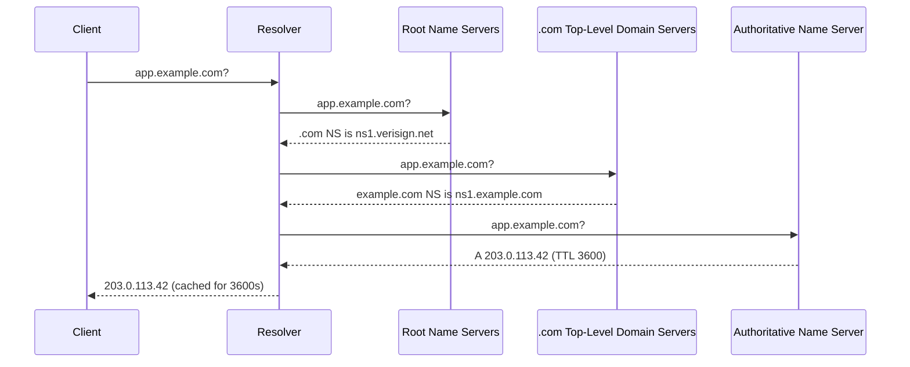
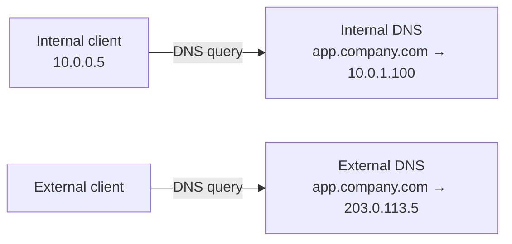
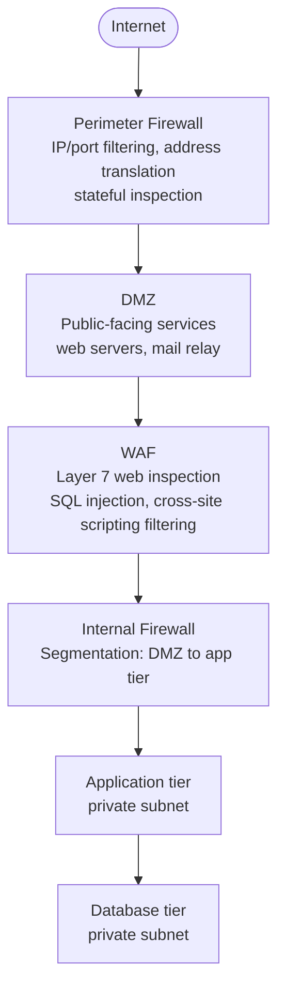
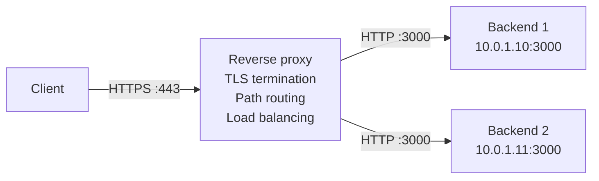
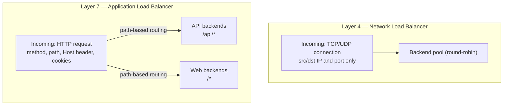
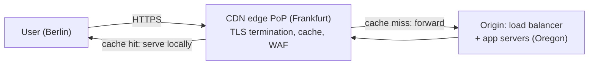
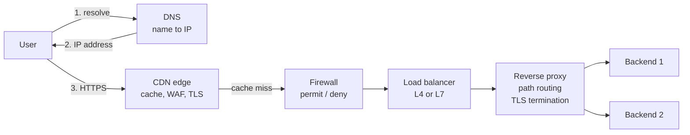

import { Aside } from '@astrojs/starlight/components';
import HistoricalNote from '/src/components/HistoricalNote.astro';

{/* ai-summary
type: lecture
slug: network-services-and-application-delivery
order: 12
covers: DNS ops (TTL, negative caching, split-horizon, AAAA); mail routing/auth; firewalls and tcpdump; Kubernetes delivery/cert automation; VPN/WAN patterns; reverse proxies and L4/L7 balancing; CDNs; TLS automation/diagnostics
prereq_lectures: networking-fundamentals, container-orchestration
followup_lectures: system-security-and-hardening
paired_activities:
supports_labs: cluster-operations
*/}

A developer reports that an application is unreachable. The failure could live anywhere in a stack that spans routing tables, firewall rules, Domain Name System (DNS) records, Transport Layer Security (TLS) certificates, and the load balancer distributing requests across backends. Each of these layers is independently configurable, independently breakable, and independently debuggable. A sysadmin who understands how they compose does not guess when something breaks; they know which layer to test first.

Building on the Networking Fundamentals lecture, this lecture covers the services that applications, containers, and users depend on once the network is built: DNS record management, email authentication, firewalls, reverse proxies, load balancers, content delivery networks (CDNs), virtual private networks (VPNs), and TLS certificate management. The Networking Fundamentals lecture established the bottom-up diagnostic approach and the "if only one service is broken, suspect layers 4 through 7" scope-narrowing rule; that framing applies throughout everything here.

## DNS configuration and troubleshooting

Networking Fundamentals introduced DNS, the common record types, and the first-pass use of `dig`. The operational questions here are narrower and more consequential: which resolver a host is actually using, how long bad data can remain cached, how internal and external answers differ, and which DNS records quietly control email delivery or certificate issuance.

### Resolver configuration and direct queries

On a Linux server, `/etc/resolv.conf` (or its `systemd-resolved` equivalent, the stub-resolver service used on many modern Linux distributions) tells the host which resolver to query and which `search` domains to append to short names. Workstations usually receive this from DHCP; servers with static addressing often need it checked explicitly. The first DNS troubleshooting step is confirming which resolver the machine is actually asking, then querying that resolver directly instead of treating "DNS" as a single black box.

```bash
# Query a specific resolver directly, bypassing the local cache
dig @10.0.1.2 app.example.com

# Full iterative resolution from root servers, showing each delegation
dig +trace example.com
```

The `dig +trace` flag performs a full iterative resolution starting from the root servers, showing each delegation in the chain. Each tier delegates authority downward until the authoritative nameserver for the zone answers with the actual record.



### DNS record types in depth

Networking Fundamentals covered the common record types conceptually. Several types matter specifically at the operational and integration layer.

**A and AAAA records** map hostnames to Internet Protocol version 4 (IPv4) and Internet Protocol version 6 (IPv6) addresses. In a dual-stack deployment, meaning one that serves both IPv4 and IPv6, a stale AAAA record can break only the subset of clients that prefer IPv6, making the outage look intermittent even though IPv4 tests succeed. Mail delivery has a subtle dependency here too: if a domain has no mail exchanger (MX) record, many mail senders fall back to the domain's A or AAAA records, which is why domains that should not receive mail sometimes publish a NULL MX record, an explicit declaration that the domain accepts no mail.

**Pointer (PTR) and Start of Authority (SOA) records** become important the moment mail delivery or reverse lookups fail. Missing or mismatched PTR records are strong spam signals, and reverse DNS is published by whoever controls the IP block, not whoever runs the application. When a PTR lookup returns `NXDOMAIN`, meaning the name does not exist, the SOA record in the authority section tells you which zone answered negatively: the `MNAME` field names the primary nameserver, and the `RNAME` field encodes the responsible mailbox for the zone administrator. That is often the contact path you need when asking whoever controls the reverse zone to create or fix a PTR record.

**TXT records** carry arbitrary text data. SPF, DKIM, and DMARC are all published as TXT records. Software-as-a-service (SaaS) providers also use TXT tokens to prove you control a domain before enabling a service.

**CAA (Certification Authority Authorization) records** tell compliant public Certificate Authorities which issuers are authorized to mint certificates for a domain. A CAA record of `0 issue "letsencrypt.org"` tells a CA it should only issue if it is Let's Encrypt or otherwise explicitly authorized. CAA reduces accidental or unauthorized issuance and works best alongside the public certificate-transparency logs discussed later in the TLS section.

### TTL strategy

Every DNS record has a TTL (Time To Live): the number of seconds resolvers may cache the answer before querying again. TTL is one of the most consequential settings in DNS because it controls how quickly changes propagate worldwide.

A record with `TTL 86400` (one day) can be cached by every resolver on the internet for up to 24 hours. If you change that A or AAAA record, users whose resolvers cached the old answer will keep getting the old IP for up to a day. The standard practice before any DNS change that needs to propagate quickly is to reduce TTL to 300 seconds at least 24 hours in advance. Once the old TTL has expired everywhere, make the change, then raise the TTL back.

Short TTLs increase DNS query volume. Large sites use short TTLs (60-300 seconds) on their A and AAAA records so they can shift traffic between data centers within minutes. Smaller organizations typically use 3600 seconds for records that rarely change and 300 seconds for anything actively managed.

### Common DNS failures

DNS failures are rarely obvious because the symptom is always the same: "I cannot reach the server." Comparing what different resolvers return isolates which link in the resolution chain is at fault. If the internal resolver returns the old address but a public resolver returns the new one, you have a caching or zone propagation problem. If both return NXDOMAIN, the record was deleted or never created. If `dig` succeeds but the application still fails, DNS resolved correctly and the problem is in a higher layer.

Resolvers can also cache negative answers. If a record did not exist five minutes ago and you add it now, some resolvers may continue returning `NXDOMAIN` until the negative-cache timer expires. That timer is derived from the zone's SOA settings, which is why "we created the record, but it still does not exist" can be a real transient DNS state rather than operator error.

The `search` domain in `/etc/resolv.conf` appends a suffix to unqualified hostnames, so `ping app01` tries `app01.corp.example.com` before querying bare `app01`. A misconfigured search domain causes short hostnames to resolve to the wrong fully qualified name or fail entirely. The TTL in the answer section tells you whether you are looking at a caching problem (large remaining value) or a zone file problem.

### Internal DNS and split-horizon

Most organizations run an internal DNS server that answers queries for private hostnames that should never appear in public DNS. For example, `db.corp.example.com` might resolve to `10.0.1.200` for internal clients, while external DNS has no record for it at all.

**Split-horizon DNS** (also called split-brain DNS) takes this further: the same hostname resolves to different addresses depending on where the query originates. `app.company.com` might resolve to `10.0.1.100` for internal clients (going directly to the backend) and to `203.0.113.5` (the public load balancer) for external clients. The internal answer avoids the round-trip through the internet and eliminates a dependency on the load balancer for internal traffic. The tradeoff is behavioral drift: internal users may bypass the public content delivery network (CDN), web application firewall (WAF), or load balancer path entirely, so they may not see the same authentication redirects, rate limits, access logs, or certificate behavior that external users do.



When troubleshooting internal name resolution failures, always check `/etc/resolv.conf` first (is the nameserver IP correct? is the search domain right?), then query the internal DNS server directly with `dig @<nameserver-ip> hostname` to bypass any caching layer.

## Routing and gateway issues

The Networking Fundamentals lecture covers routing tables, default gateways, and `traceroute` in depth, including the TTL-decrementing mechanism, what `* * *` means, and how to compare User Datagram Protocol (UDP) versus Transmission Control Protocol (TCP) probes to distinguish routing failures from firewall policy. The operational addition at this layer is **asymmetric routing**.

Asymmetric routing occurs when traffic takes a different path in each direction: the request might reach the server through Router A, but the response leaves through Router B. Stateful firewalls that expect to see both sides of a connection can drop traffic in this scenario. If a firewall on Router A's path sees the outgoing TCP synchronize (SYN) packet but never sees the returning synchronize-acknowledge (SYN-ACK) because it came back through Router B, it may drop subsequent packets from that connection. The failure appears intermittent or one-sided, and packet captures at multiple points in the network are often necessary to confirm it.

## Email infrastructure

Email is rarely set up from scratch today; most organizations use hosted services like Google Workspace or Microsoft 365. But understanding how email flows through DNS and Simple Mail Transfer Protocol (SMTP) is necessary for any sysadmin, because misconfigured email records affect deliverability for the entire domain and debugging delivery failures is a surprisingly common task.

### How email routing works

When you send an email to `user@example.com`, your mail server performs a DNS **MX record** lookup for `example.com`. The MX record returns the hostname (not IP) of the mail server that accepts mail for that domain, along with a priority number. Lower priority values are preferred; if the primary is unreachable, the sender falls back to higher values. If a domain has no MX record at all, SMTP traditionally falls back to that domain's A or AAAA record unless the domain publishes a NULL MX record to say it does not accept mail.

### Email authentication: SPF, DKIM, and DMARC

Spam and phishing attacks forge the `From:` address in emails. Three DNS-based mechanisms allow receiving mail servers to verify that an email genuinely came from where it claims.

**SPF (Sender Policy Framework)** is a DNS TXT record that authorizes which servers may send email for the domain used in the SMTP envelope, the `MAIL FROM` or `Return-Path` domain. A receiving server checks whether the sending host is authorized for that envelope domain; if not, the email fails SPF and is more likely to be rejected or marked as spam. SPF by itself does not prove that the visible `From:` header matches that sending domain.

**DKIM (DomainKeys Identified Mail)** adds a cryptographic signature to every outgoing email. The public key is published in DNS. The receiving server uses it to verify that the email was not modified in transit and was sent by someone who holds the domain's private key.

**DMARC (Domain-based Message Authentication, Reporting and Conformance)** ties SPF and DKIM to the visible `From:` domain by requiring alignment between that header and at least one passing authentication mechanism. It adds a policy: `p=none` for monitoring only, `p=quarantine`, or `p=reject`, and it instructs receiving servers where to send aggregate reports. A `p=reject` policy effectively blocks forged email from your domain.

<Aside type="tip" title="Configure Email Authentication Before Sending">
When setting up email for a new domain, configure SPF, DKIM, and DMARC before sending any bulk email. Major providers (Gmail, Microsoft) increasingly reject or silently drop mail from domains that lack these records.
</Aside>

### Why you probably should not run your own mail server

Running a mail server requires a static IP with proper reverse DNS, maintaining a clean sending reputation, staying off spam blacklists, managing TLS certificates, implementing SPF/DKIM/DMARC, and monitoring for abuse around the clock. A misconfigured server that gets blacklisted silently stops delivering email to most recipients. Hosted solutions like Google Workspace or Microsoft 365 handle all of this for a per-user monthly fee. This is the same build-versus-buy tradeoff that appears throughout infrastructure decisions: the marginal cost of self-hosting is ongoing operations work, not just upfront infrastructure cost. The main reasons to self-host are specific compliance requirements, very high volume that makes hosted costs prohibitive, or strict data sovereignty requirements.

## Firewalls

Networking Fundamentals already covered what firewalls, ports, and cloud security groups do at the conceptual level. A firewall is only useful for the traffic that actually crosses it, so the placement question shapes everything else about how firewall policy is designed and debugged.

### Placement and zone design

Different firewall positions protect different perimeters. A **perimeter firewall** sits between the internal network and the internet, so every external packet passes through it. A **DMZ (Demilitarized Zone)** is a network segment between the perimeter firewall and the internal network, used to host internet-facing services (web servers, mail relays) that should not have direct access to internal systems. An **internal firewall** segments zones inside the organization: separating the DMZ from the application tier, or corporate systems from production servers. A **WAF (Web Application Firewall)** sits in front of web services to inspect traffic for application-layer attacks like Structured Query Language (SQL) injection or cross-site scripting. An **endpoint firewall** runs on the host itself and protects the device regardless of whether traffic crosses a central appliance. One common multi-tier design looks like this, though real environments often collapse or rearrange these roles.



<Aside type="note" title="Lateral Traffic and Firewall Blindspots">
Firewalls only inspect traffic that passes through them. Traffic that stays entirely within an unmanaged switch never hits a firewall unless endpoint firewalls are involved. This is a frequently overlooked gap in network designs.
</Aside>

### Firewall technologies

Modern firewalls combine several inspection techniques. **Packet filtering** allows or denies traffic based on source or destination IP, protocol, and port. **Stateful inspection** adds connection awareness, which is why return traffic for an established session is automatically allowed without a matching inbound rule. More advanced devices can proxy connections, inspect payloads with Deep Packet Inspection (DPI), or understand application protocols like Hypertext Transfer Protocol (HTTP) and DNS well enough to make layer-7 policy decisions. IPS (Intrusion Prevention System) behavior adds signature-based or anomaly-based detection to block exploit traffic inline. The tradeoff is consistent across all of these features: richer inspection gives better control and better detection, but costs CPU, latency, and operational complexity.

### Common firewall terminology

Firewall interfaces and vendor documentation reuse a small vocabulary constantly. Learning these terms makes rule sets much easier to read across products.

| Term | Meaning |
|---|---|
| **Zones** | Logical groupings of devices or subnets sharing the same security policy (e.g., local network, DMZ, internet edge) |
| **Policies** | Sets of rules governing access control and behavior for traffic between zones |
| **Rules** | Specific instructions within a policy: allow or deny traffic matching source, destination, protocol, port |
| **Traffic shaping** | Rate limiting and prioritization; can limit the impact of denial-of-service attacks |

### Linux firewalls: iptables and nftables

On Linux, the kernel's netfilter framework handles packet filtering. The traditional interface is `iptables`; the modern replacement is `nftables`. Both organize rules into chains: `INPUT` for incoming traffic, `OUTPUT` for outgoing, and `FORWARD` for traffic being routed through the host.

```bash
# List current iptables rules with line numbers
sudo iptables -L -n --line-numbers

# List all nftables rules
sudo nft list ruleset
```

<Aside type="caution" title="iptables Rules Are Not Persistent">
Changes made with `iptables` commands are not persistent by default. They disappear on reboot. Use `iptables-save` and `iptables-restore`, or your distribution's firewall management tool, to persist rules.
</Aside>

Higher-level tools like `ufw` (Ubuntu) and `firewalld` (Red Hat Enterprise Linux (RHEL) and Fedora) manage netfilter rules through a simpler interface and handle persistence automatically. Configuration management tools like Ansible can manage firewall rules idempotently across a fleet, which is how large deployments keep firewall policy consistent without per-host manual changes.

### Cloud security groups

In Amazon Web Services (AWS), the two common virtual firewall layers are security groups and network access control lists (ACLs). Security groups are stateful (return traffic is automatically allowed); network ACLs are stateless (you must explicitly allow return traffic in both directions). A common misconfiguration is allowing client traffic on port 443 while misconfiguring the load balancer's target group, the backend pool object it probes and routes to, or blocking health check traffic with a security group or network ACL. The application works when accessed directly but fails behind the load balancer because the health probe never gets a success response and the backend is marked unhealthy.

Azure and Google Cloud Platform (GCP) expose comparable controls with different names and scopes: translate the concept rather than assuming AWS labels apply everywhere.

### Systematic firewall debugging

When you suspect a firewall is blocking traffic, the distinction between a timeout and a refused connection is a clue, not proof. A "connection refused" error usually means the packets reached a host that actively rejected the connection because nothing is listening, but a reject rule in a firewall or a middlebox can produce the same symptom. A connection that hangs until it times out often means packets are being silently dropped somewhere, which is characteristic of a firewall drop rule, but it is still only a hint. Confirm the service is listening on the server, then test connectivity from the client side. If the service is listening but the client times out, run a packet capture on the server to verify whether traffic is arriving at all. If no packets arrive, the block is upstream. If packets arrive but get no response, a local firewall rule, asymmetric routing, or a server-side stack problem is more likely.

## Packet capture with tcpdump

When higher-level tools do not reveal the problem, packet capture lets you see exactly what is happening on the wire. The `tcpdump` utility is available on virtually every Linux system.

```bash
# Capture traffic to or from a specific host
sudo tcpdump -i eth0 host 10.0.1.50

# Capture only DNS traffic
sudo tcpdump -i eth0 port 53

# Write capture to a file for later analysis in Wireshark
sudo tcpdump -i eth0 -w /tmp/capture.pcap
```

Reading `tcpdump` output requires understanding the common TCP flags. `[S]` starts a connection, `[S.]` accepts and acknowledges it, `[.]` is a plain acknowledgment, `[P.]` means data is being pushed, `[R]` resets the connection immediately, and `[F.]` begins a graceful finish.

When a service is running, DNS resolves correctly, and the routing table looks correct, but the application is still unreachable, a packet capture on the server's port is the next step. If you see incoming SYN packets but no SYN-ACK responses, the server is receiving the requests but not completing the handshake. A local firewall rule is one common cause, but so are asymmetric routing, policy-routing mistakes, or a process that is not actually listening the way you expect. If you see no packets at all, the traffic is being dropped upstream, and you need to capture at the next hop toward the client.

<Aside type="tip" title="Always Filter on Production Servers">
When capturing on a busy server, always use filters to limit the output. Capturing all traffic on a production server can generate enormous amounts of data and may itself cause performance problems.
</Aside>

## Address Resolution Protocol (ARP) security

The Networking Fundamentals lecture covers how ARP maps Internet Protocol (IP) addresses to Media Access Control (MAC) addresses within a broadcast domain and how `ip neighbor show` reveals those mappings, including the `FAILED` state that indicates a layer-2 problem. In a managed network, ARP has an additional security dimension that becomes relevant at the access layer.

**ARP spoofing** (also called ARP poisoning) exploits the fact that ARP has no authentication. Any host on a broadcast domain can send a gratuitous ARP reply claiming any IP address, including the default gateway's. A malicious host that does this causes other devices on the segment to update their ARP caches and send traffic intended for the gateway to the attacker instead, creating a man-in-the-middle position or a denial of service. Neither is visible at the IP layer.

Managed switches mitigate this with **Dynamic ARP Inspection (DAI)**. The switch builds a trusted binding table from Dynamic Host Configuration Protocol (DHCP) snooping, recording which IP addresses were leased to which MAC addresses on which ports, and validates every ARP reply against it. A reply claiming that `10.0.1.1` belongs to a MAC address not in the binding table is dropped. Servers with statically configured addresses must have manual bindings added to the DAI table, or their own ARP packets will be dropped as untrusted. DAI is a standard hardening step on access layer switches in environments where unauthorized devices could plug into switch ports.

## Kubernetes application delivery

Understanding what lies beneath Kubernetes networking abstractions is necessary when debugging application delivery failures that are not visible from inside the cluster.

A Kubernetes Ingress controller is a layer-7 reverse proxy (usually Nginx, Traefik, or an Envoy-based variant) managed by Kubernetes. Instead of hand-editing config files, you declare `Ingress` objects specifying routing rules, and the controller translates them into upstream blocks automatically. The controller itself depends on multiple external conditions: DNS records pointing to the right external IP, firewall rules (or cloud security groups) allowing traffic on the correct ports, and TLS certificates covering the expected hostnames. A pod that is `Running`, a Service that is `Ready`, and an Ingress that has an address assigned can all look healthy in `kubectl` while users are unable to reach the application, because the failure lives in DNS, in the cloud security group, or in a certificate with a hostname mismatch. Debugging Ingress failures always requires checking those external layers, not just the Kubernetes configuration.

Not every Kubernetes edge exposure uses Ingress. A `Service` of type `LoadBalancer` can publish a TCP or UDP service more directly, and the newer Gateway API, a newer Kubernetes Application Programming Interface (API) for traffic entering the cluster from outside, gives clusters a more expressive way to describe that edge routing than classic Ingress in many environments. The abstractions change, but the operational dependencies do not: DNS still has to point at the advertised address, firewall policy still has to admit the traffic, and health checks still have to pass before users see a working service.

Certificate management in orchestrated environments follows the same operational rules as everywhere else, but the automation point changes. Some deployments terminate TLS at a provider-managed load balancer and use the cloud platform's certificate service there. Others run a controller such as `cert-manager` inside the cluster so it can complete ACME challenges, renew certificates, and store them in Kubernetes `Secret` objects that an Ingress or Gateway controller presents to clients. The important point is that Kubernetes does not make certificate management disappear on its own; a platform service or an extra controller still has to issue, renew, and bind the certificate to the cluster edge.

The Container Network Interface (CNI) plugin that handles pod-to-pod networking adds another dependency. Depending on the plugin, pod traffic may ride a Virtual Extensible LAN (VXLAN) overlay, with pod packets encapsulated inside UDP packets and decoded at the destination node, or rely on the physical network to route pod Classless Inter-Domain Routing (CIDR) blocks directly via Border Gateway Protocol (BGP). A VXLAN overlay cannot function if nodes cannot reach each other on the UDP port VXLAN uses (4789 by default). A BGP-based CNI cannot function if the physical network refuses to accept pod CIDR advertisements. When cluster networking breaks, the right first question is whether the failure is in the overlay or in the physical network beneath it.

## Virtual Private Networks

A virtual private network (VPN) creates an encrypted tunnel between two endpoints over an untrusted network, typically the internet. All traffic inside the tunnel is encrypted, appearing as ordinary encrypted packets to anyone observing the network.

A VPN is not the same thing as a proxy, even though some commercial privacy services make the distinction feel blurry. A privacy VPN changes where your traffic exits to the public internet, which can make it feel proxy-like. But the underlying mechanism is still a network tunnel carrying general routed traffic, not an application-specific relay. A **forward proxy** accepts requests from a client application and sends them onward. A **reverse proxy** accepts requests on behalf of servers. A remote-access VPN extends the routed network to your device; it does not stand in front of your servers the way a reverse proxy does.

### Deployment patterns

**Site-to-site VPN** connects two or more geographically separate offices, allowing their internal networks to communicate securely as if they were on the same LAN. The VPN is configured on the routers or firewalls at each site.


**Remote-access VPN (client-to-site)** allows individual devices to securely connect to the full corporate routed network from anywhere. The user runs a VPN client on their device; the organization runs a VPN server at the edge. This differs from service-specific remote access tools (sometimes marketed as zero-trust network access) that expose only selected applications rather than the full routed network.

### VPN protocols

The three protocols you will encounter most often each make different tradeoffs:

**Internet Protocol Security (IPsec)** is a suite of standards built into most enterprise routers and firewalls, and it benefits from hardware acceleration for high throughput. It is the default for site-to-site enterprise deployments, though its configuration is verbose compared to newer alternatives.

**OpenVPN** is open-source and flexible. Running over TCP or UDP, it is easy to tunnel through restrictive firewalls and has a long track record in remote-access deployments.

**[WireGuard](https://www.wireguard.com/)** uses modern cryptography and a much smaller code base than IPsec or OpenVPN, making it easier to audit and often faster in benchmarks. It has less legacy hardware support but is increasingly adopted in new deployments. Its simplicity has made it the default in many modern VPN products.

### Connecting multiple locations

**Site-to-site VPN** is the standard for a small number of offices. IPsec or WireGuard tunnels between routers, combined with a routing protocol advertising internal subnets across the tunnel, is inexpensive and sufficient for two to five locations.

**MPLS (Multiprotocol Label Switching)** is a carrier-provided service where the Internet Service Provider (ISP) manages the wide area network (WAN) between your sites. Traffic enters the provider's private WAN at one site and emerges at another without using the public internet directly. Organizations buy MPLS for provider-managed routing, traffic classes, and service-level agreements around latency, loss, or availability. MPLS is expensive; teams choose it for predictable operational characteristics, not because the label itself magically guarantees performance.

**SD-WAN (Software-Defined Wide Area Network)** creates an overlay network across multiple underlay connections: broadband internet, Long-Term Evolution (LTE), and MPLS. A centralized controller defines routing policy; the SD-WAN devices at each site select the best path per application. A video call might use a managed low-latency link while bulk backups use cheap broadband. SD-WAN has reduced dependence on pure MPLS in many new deployments, but many organizations still run hybrid WANs that mix MPLS and internet links when the application mix or existing contracts justify it.

<HistoricalNote title="From Frame Relay to MPLS to SD-WAN">
Enterprise WAN connectivity has gone through two major technology transitions in thirty years. Through the 1990s, the dominant technology was Frame Relay: a packet-switched carrier service where customers paid for a Committed Information Rate. Frame Relay and ATM (Asynchronous Transfer Mode) were both displaced by MPLS in the early 2000s. MPLS let carriers accept IP packets at one site, label them with a short identifier, and switch them across the backbone using the label rather than performing a full IP route lookup at every hop, providing ATM-like predictability at IP prices. SD-WAN has been displacing MPLS since the 2010s by achieving comparable reliability through intelligent traffic steering across multiple cheaper connections rather than a single expensive carrier service.
</HistoricalNote>

**Cloud connectivity**: when one of your "sites" is an Amazon Web Services (AWS) Virtual Private Cloud (VPC) or Azure Virtual Network (VNet), a cloud VPN gateway creates an IPsec tunnel from your office router to that cloud network, which is inexpensive but limited in bandwidth and latency. **AWS Direct Connect** or **Azure ExpressRoute** are dedicated private fiber connections from your office to the cloud provider's colocation facility: higher cost, but predictable latency and no traffic on the public internet. In cloud-first environments, the "company network" increasingly means a hub VPC with VPN or Direct Connect back to any physical offices, where the same networking concepts apply but the hardware is abstracted into application programming interfaces and declared in Terraform rather than configured on physical appliances.

## Reverse proxies and load balancers

A **reverse proxy** is a server that sits in front of one or more backend servers and forwards client requests to them. From the client's perspective, it is communicating with the reverse proxy directly; the backend servers are invisible. This contrasts with a **forward proxy**, which sits in front of clients and forwards their requests outward, commonly used for caching or content filtering in corporate networks.

### Why use a reverse proxy

Reverse proxies solve several operational problems at once. They centralize TLS termination for HTTPS, the secure form of the Hypertext Transfer Protocol (HTTP), so certificates are managed in one place. They provide a single entry point for access logging, rate limiting, and header injection. They route requests to different backends based on hostname or path. And they hide the backend topology from clients. That combination is why reverse proxies appear in almost every serious web deployment even before traffic volume is high enough to demand load balancing.



### Load balancers

A **load balancer** is a reverse proxy that distributes incoming requests across multiple backend instances. When a single server cannot handle traffic volume, you run multiple identical instances and let the load balancer spread the load. Common distribution algorithms:

| Algorithm | How it works | When to use it |
|---|---|---|
| Round-robin | Requests cycle across backends in sequence | General purpose; assumes requests are roughly equal in cost |
| Least connections | Each request goes to the backend with the fewest active connections | Long-lived or variable-cost requests (file uploads, streaming) |
| IP hash | The client's IP determines which backend handles the request | Session-sticky applications that store state locally on the server |

Session stickiness is sometimes necessary for legacy applications that keep session state in process memory, but it is usually a compatibility workaround rather than the desired end state. Modern designs prefer stateless backends or a shared session store so any healthy instance can serve any request.

### Layer 4 vs. Layer 7

Load balancers operate at different Open Systems Interconnection (OSI) layers, and that determines what information they can use when making routing decisions.



A Layer 4 load balancer makes decisions using IP addresses, ports, and connection state rather than HTTP semantics: it is fast and protocol-agnostic, but it cannot do path-based or header-based routing. Some Layer 4 products can still terminate TLS, but they do not become HTTP-aware proxies just because the handshake ends there. A Layer 7 load balancer parses the application protocol, allowing routing by path, hostname, or header value, header injection, URL rewriting, and TLS termination. On AWS, many web applications use an Application Load Balancer (ALB). A Network Load Balancer (NLB) is appropriate when you need to load-balance non-HTTP protocols, preserve the client's source IP address at the packet layer, use static IP addresses, or minimize processing overhead. An ALB usually conveys client identity to the backend in headers such as `X-Forwarded-For` instead.

### Software options

Several mature software implementations cover different deployment contexts:

**Nginx** is one of the most widely deployed reverse proxies and load balancers. Its configuration model is explicit and highly flexible. Certificate management requires a separate tool such as certbot, which adds operational overhead that must be managed (timers, renewal hooks, post-renew reloads).

**Caddy** handles TLS certificate issuance and renewal automatically via ACME, without a separate certbot process. Its configuration syntax is simpler. The automatic HTTPS behavior makes it a natural fit for deployments where certificate automation matters more than fine-grained configuration control.

**Traefik** is designed for container-native environments. It auto-discovers services from Docker labels or Kubernetes annotations and generates routing configuration dynamically, without manual config file edits. This makes it common in Docker Compose and smaller Kubernetes deployments where backends come and go frequently.

**HAProxy** is a battle-tested load balancer known for fine-grained control over health checks, connection queuing, and per-backend statistics. It is frequently chosen as a dedicated load balancer in front of databases or other TCP-based services.

### Kubernetes Ingress

In a Kubernetes cluster, an Ingress controller plays exactly the same role as a reverse proxy at the cluster edge. The controller (Nginx, Traefik, Envoy-based, or HAProxy-based) translates `Ingress` object declarations into proxy configuration automatically. Understanding how any of these work as a reverse proxy makes reading and debugging Kubernetes Ingress behavior much less opaque: the controller's annotations, its failure modes, and its behavior under backend failure all trace back to the same proxy concepts described above.

## Content delivery networks

A **content delivery network (CDN)** is a geographically distributed network of edge servers that caches and serves content from locations close to users. A request from a user in Berlin hitting an origin server in Oregon would normally travel across the Atlantic for every resource. With a CDN, static resources (and often dynamically generated responses) are served from an edge PoP (Point of Presence) in Frankfurt, reducing latency by an order of magnitude.

CDNs do more than caching. They terminate TLS at the edge PoP, so the TLS handshake latency is between the user and the nearest edge server rather than between the user and the origin. They also help absorb very large distributed denial-of-service (DDoS) floods at a scale that no single origin server can usually match. Most major CDNs also offer integrated WAF and bot mitigation, making the CDN the first layer of HTTP-aware security in the request path.



Cloudflare, AWS CloudFront, Fastly, and Akamai are the major CDN providers. Cloudflare is distinctive because it combines authoritative DNS with a reverse-proxy CDN: pointing your domain's nameservers at Cloudflare allows its DNS to return Cloudflare edge addresses for proxied records, so web traffic reaches Cloudflare's edge first and can have caching, WAF, and DDoS protection applied before the request is forwarded to the origin.

Cache invalidation is one of the harder operational problems with CDNs. `Cache-Control` headers control how long the CDN caches content. Deploying a new version of a static asset requires either cache purging (a CDN API call to invalidate specific paths) or cache-busting (including a content hash in the filename so new deployments get new URLs that the CDN has never seen). Continuous integration and continuous delivery/deployment (CI/CD) pipelines can automate both patterns: a Terraform-managed CloudFront distribution can have its cache invalidated as a deployment step, treating the CDN configuration as just another infrastructure resource alongside the compute.

## TLS certificates

Networking Fundamentals already introduced the TLS handshake, the certificate chain, and the role of a Certificate Authority. The operational side is different: certificates have to be issued, renewed, logged, stapled, rotated, and debugged under production constraints. The System Security and Hardening lecture revisits TLS through a security lens, covering trust store management, internal CA design, and the attack surfaces that misconfigured certificates create.

### Certificate types

Commercial CAs sell certificates at three levels of validation.

**DV (Domain Validated)** certificates verify only that the requester controls the domain, by serving a challenge file over HTTP or adding a DNS TXT record. Issuance is fully automated and takes seconds. [Let's Encrypt](https://letsencrypt.org/) issues only DV certificates. DV is appropriate for the vast majority of web services.

**OV (Organization Validated)** certificates additionally verify the legal existence and identity of the organization through documentation review. The organization's name appears in the certificate's subject field. OV issuance takes hours to days. Banks and large enterprises sometimes use OV to provide additional assurance to users.

**EV (Extended Validation)** certificates require the most thorough identity verification and historically triggered a green address bar in browsers. Most browsers have removed the visual distinction, significantly reducing the practical benefit. EV certificates have largely fallen out of common use.

### Certificate Transparency

Since 2018, [Certificate Transparency (CT)](https://certificate.transparency.dev/) has been required for publicly trusted certificates. Every CA must log issued certificates in public, append-only CT logs, and browsers expect proof of logging before trusting the certificate. The practical benefit is visibility: if an unexpected certificate is issued for your domain, CT monitoring can detect it quickly because the certificate has to be publicly logged. You can query CT logs directly to see the certificates that have been issued for a domain, which is useful for auditing what has been authorized.

### Let's Encrypt and automated certificate management

Before 2016, obtaining a certificate required purchasing one from a commercial CA and manually renewing it every one to two years. Let's Encrypt changed this by providing free DV certificates via an automated protocol called [ACME (Automated Certificate Management Environment, Request for Comments (RFC) 8555)](https://datatracker.ietf.org/doc/html/rfc8555). One widely used ACME client on traditional Linux servers is **certbot**, which proves domain ownership either by temporarily serving a challenge file on port 80 (HTTP-01 challenge) or by adding a DNS TXT record (DNS-01 challenge). On many Linux installs, a systemd timer or cron job runs `certbot renew` several times per day; certificates are renewed automatically when they have less than 30 days remaining. The 90-day certificate lifetime is intentional: it forces automation and limits the exposure window if a private key is compromised.

Caddy manages the full ACME lifecycle automatically: no certbot, no systemd timers, no cron jobs. It requests, stores, and renews certificates without operator intervention. The tradeoff is less visibility and control over the certificate lifecycle compared to managing certbot explicitly, which matters in regulated environments that require audit trails for certificate operations.

### HSTS and OCSP stapling

Two mechanisms improve the security posture of a TLS-enabled site after the certificate is in place.

**HSTS (HTTP Strict Transport Security)** instructs browsers to always connect to a domain over HTTPS, never HTTP, for a specified period. Once a browser has seen the `Strict-Transport-Security` header, it refuses to make an unencrypted connection to that domain for the duration of the `max-age` directive. This prevents downgrade attacks on later visits. To protect the very first visit as well, the domain has to be included in the browser preload list.

**Online Certificate Status Protocol (OCSP) stapling** improves certificate revocation checking. The traditional OCSP mechanism requires the browser to query the CA's OCSP responder during every TLS handshake, adding latency and leaking browsing behavior to the CA. With OCSP stapling, the server periodically fetches a signed OCSP response from the CA and includes it in the TLS handshake. The client gets revocation status without an extra network round trip and without the CA learning which sites the user visits.

### Internal certificates

For internal services, a public CA can issue a certificate for a privately hosted service under a public domain you control, using DNS-01, even if the service is not exposed to the public internet. When the name is private or purely internal, you typically use one of two approaches.

**Self-signed certificates** are generated locally without any CA involvement. They encrypt traffic but browsers do not trust them by default. Suitable for testing or for services where you control all clients and can manually add the certificate to the trust store.

**Internal Certificate Authority (CA)**: generate your own CA certificate, install it in the trust store of all company devices (typically via Active Directory Group Policy or a Mobile Device Management (MDM) system), and sign internal service certificates with it. Clients trust anything signed by your internal CA without warnings. This is the standard approach for companies that need HTTPS on internal services without per-device browser exceptions.

### Diagnosing TLS failures

The Networking Fundamentals lecture covers what each `openssl s_client` verify return code means. The operational question is what to do when each appears.

An **expired certificate** means the automated renewal job is not running or is failing silently. Check whether the renewal mechanism, whether systemd timer, cron job, or platform-managed automation, is active and whether the last renewal attempt succeeded.

A **missing intermediate CA** means the server is sending its leaf certificate without the chain. The certificate file on the server should contain the full chain (leaf plus intermediates concatenated), not just the leaf. This is a common mistake when manually installing certificates from a commercial CA.

A **hostname mismatch** means the certificate's `subjectAltName` fields do not include the hostname the client connected to. This happens when a certificate is issued for `example.com` but the client connects to `www.example.com`, and the certificate does not include both names.

A related failure is a **Server Name Indication (SNI) mismatch** on a shared reverse proxy or load balancer. The TLS terminator may present the wrong certificate because the client did not send the expected server name or because the default virtual host is configured with the wrong certificate. This is common when many hostnames share one edge proxy.

```bash
# Check what names a certificate covers
openssl s_client -connect example.com:443 2>/dev/null | openssl x509 -noout -text | grep -A1 "Subject Alternative Name"
```

<Aside type="caution" title="Wildcard Certificates">
A wildcard certificate (`*.company.com`) covers all immediate subdomains with a single certificate. This is operationally convenient but concentrates risk: if the private key is compromised, every subdomain is affected simultaneously. Per-service certificates with automated renewal are generally preferable when the tooling is in place, though wildcards remain a reasonable choice when managing many services from a shared certificate store.
</Aside>

## Takeaways

The services in this lecture form the plumbing that application traffic flows through, composed in a specific order.



Each layer is independently breakable and independently testable. DNS failures present as NXDOMAIN, stale answers, or dual-stack mismatches before any TCP connection is attempted. Firewall failures often present as silent timeouts or active refusals, depending on whether traffic is dropped or rejected and where the policy lives. TLS failures present as handshake errors or wrong-certificate warnings before any application data is exchanged. Load balancer failures present as intermittent errors when healthy and unhealthy backends mix. Reverse proxy failures present as wrong-backend responses or unexpected path behavior. The skill is not memorizing each tool: it is knowing which layer to test first given the symptom.

None of this exists in isolation from the rest of the course. The IaC lecture shows how Terraform declares load balancers, DNS records, and certificate resources alongside the compute that uses them: an ALB listener rule is as declarative as an EC2 instance, and the same plan-and-apply workflow governs them. The Configuration Management lecture shows how Ansible applies nginx configuration and manages certbot timers idempotently across a fleet. The CI/CD lecture connects to CDN cache invalidation and DNS cutover as steps in a deployment pipeline. Looking forward, the System Security and Hardening lecture revisits firewalls, TLS, and access controls through a security-first lens, treating misconfigured rules and expired certificates not as troubleshooting problems but as attack surfaces to eliminate. The Container Orchestration lecture's Ingress controllers, CNI plugins, and pod network policies are all applications of the same proxy, firewall, and routing concepts: the abstraction layer changes, but the underlying model does not.

## Resources

The references below are useful for refreshing protocol details and for seeing production-oriented examples of the services this lecture connects together.

- <a href="https://www.cloudflare.com/learning/dns/what-is-dns/" target="_blank" rel="noopener noreferrer">What is DNS? How DNS works (Cloudflare Learning, Article)</a>
- <a href="https://www.cloudflare.com/learning/cdn/what-is-a-cdn/" target="_blank" rel="noopener noreferrer">What is a CDN? (Cloudflare Learning, Article)</a>
- <a href="https://www.cloudflare.com/learning/network-layer/what-is-a-firewall/" target="_blank" rel="noopener noreferrer">What is a Firewall? (Cloudflare Learning, Article)</a>
- <a href="https://letsencrypt.org/how-it-works/" target="_blank" rel="noopener noreferrer">How Let's Encrypt Works (Let's Encrypt, Article)</a>
- <a href="https://certificate.transparency.dev/" target="_blank" rel="noopener noreferrer">Certificate Transparency (Google, Article)</a>
- <a href="https://www.wireguard.com/" target="_blank" rel="noopener noreferrer">WireGuard: Fast, Modern, Secure VPN Tunnel (wireguard.com)</a>
- <a href="https://www.youtube.com/watch?v=j9QmMEWmcfo" target="_blank" rel="noopener noreferrer">DNS Records Explained (ByteByteGo, YouTube)</a>
- <a href="https://www.youtube.com/watch?v=C7HP2KYqVKg" target="_blank" rel="noopener noreferrer">Load Balancing Explained (ByteByteGo, YouTube)</a>
- <a href="https://www.youtube.com/watch?v=RqfaTIWc3LQ" target="_blank" rel="noopener noreferrer">WireGuard Explained (Fireship, YouTube)</a>
- <a href="https://www.youtube.com/watch?v=7eqHGPLEHaA" target="_blank" rel="noopener noreferrer">VPN, SD-WAN, and MPLS: Enterprise WAN Explained (Network Direction, YouTube)</a>
- <a href="https://www.youtube.com/watch?v=xBSabeYoLyI" target="_blank" rel="noopener noreferrer">NGINX Explained in 100 Seconds (Fireship, YouTube)</a>
