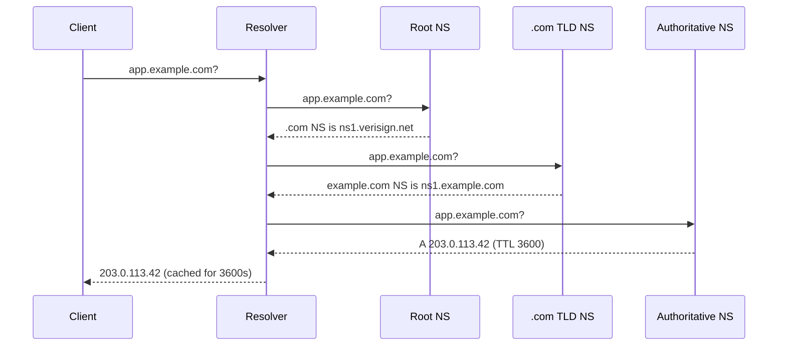
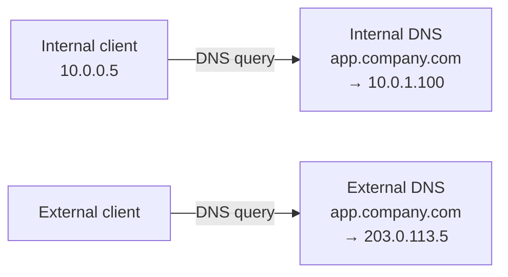
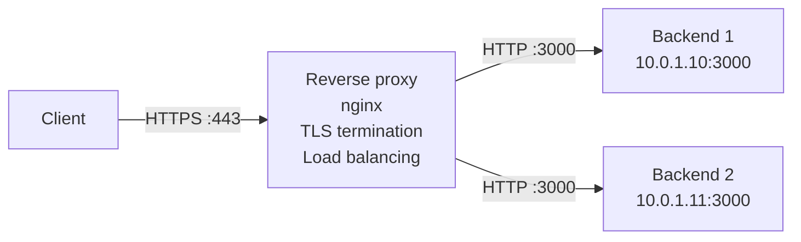

import { Aside } from '@astrojs/starlight/components';
import HistoricalNote from '/src/components/HistoricalNote.astro';

{/* ai-summary
type: lecture
slug: network-services-and-application-delivery
order: 12
covers: systematic troubleshooting methodology; DNS record types and TTL; split-horizon DNS; email authentication (SPF/DKIM/DMARC); firewall placement and debugging; iptables/nftables; packet capture with tcpdump; ARP security; overlay vs underlay networking; VPNs and multi-site connectivity; reverse proxies and load balancers; TLS certificate issuance and diagnostics
prereq_lectures: networking-fundamentals, container-orchestration
followup_lectures: system-security-and-hardening
paired_activities:
supports_labs: cluster-operations
*/}

A developer reports that an application is unreachable. The failure could live anywhere in a stack that spans routing tables, firewall rules, DNS records, TLS certificates, and application code. A sysadmin who understands the services that underpin application delivery does not guess; they work through the stack methodically until the failure reveals itself.

Building on the Networking Fundamentals lecture, this lecture focuses on the services that applications, containers, and users depend on once the network is built: DNS, firewalls, TLS certificates, reverse proxies, VPNs, and multi-site connectivity. These are the pieces you adjust most often when deploying, securing, and debugging a production service. Understanding them alongside container orchestration concepts helps you reason about why Kubernetes networking behaves the way it does, what lies beneath the ingress controller, and why cluster connectivity failures often require checking multiple layers before the cause is visible.

## A systematic troubleshooting methodology

The Networking Fundamentals lecture establishes the bottom-up and divide-and-conquer diagnostic approaches. Those same strategies apply here, but now you read each tool's output in the context of a system you built and documented. A `* * *` at hop 3 in `traceroute` names a specific router you can log into. A `FAILED` ARP entry is not just an abstraction; it points to a specific layer-2 failure you can trace from switch logs or a cloud console.

The practical addition at the service level is scope narrowing: if nothing on the network works, suspect layers 1 through 3. If only one service is broken, suspect layers 4 through 7 (DNS, firewall rules, application configuration). Every tool in this lecture targets a specific layer, and knowing which layer to test first turns a vague "network is down" report into a bounded search.

<Aside type="tip" title="Narrowing the Search Space">
If *nothing* on the network works, suspect layers 1 through 3. If only *one service* is broken, suspect layers 4 through 7 (DNS, firewall rules, application configuration).
</Aside>

## DNS configuration and troubleshooting

Networking Fundamentals already introduced DNS, the common record types, and the first-pass use of `dig`. The operational questions here are narrower and more consequential: which resolver a host is actually using, how long bad data can remain cached, how internal and external answers differ, and which DNS records quietly control email delivery or certificate issuance.

### Resolver configuration and direct queries

On a Linux server, `/etc/resolv.conf` (or its `systemd-resolved` equivalent) tells the host which resolver to query and which `search` domains to append to short names. Workstations usually receive this from DHCP; servers with static addressing or custom resolver settings often need it checked explicitly. In practice, the first DNS troubleshooting step is confirming which resolver the machine is asking, then querying that resolver directly instead of treating "DNS" as a single black box.

The `dig` command is the most versatile DNS troubleshooting tool because it shows the response code, answer section, authority section, and timing. `nslookup` remains useful for quick interactive checks, especially on Windows, but `dig` exposes the most detail during an outage.

```bash
# Query the resolver configured on this host
dig app.example.com

# Query a specific internal resolver directly
dig @10.0.1.2 app.example.com

# Get just the answer section
dig +short app.example.com
```

### DNS record types in depth

Networking Fundamentals covered the common record types at the conceptual level. The additions here are the records and behaviors that tend to matter during outages, change windows, and external integrations.

**PTR and SOA records** become operationally important the moment mail delivery or reverse lookups fail. Missing or mismatched PTR records are strong spam signals, and reverse DNS is published by whoever controls the IP block rather than by whoever runs the application. When a PTR lookup returns NXDOMAIN, the SOA record in the authority section still tells you which zone answered negatively: `MNAME` names the primary nameserver, and `RNAME` encodes the responsible mailbox for the zone administrator. That is often the contact path you need when asking whoever controls the reverse zone to create or fix a PTR record.

**TXT records** carry arbitrary text data and are widely used for domain verification and email authentication. SPF, DKIM, and DMARC are all published as TXT records. SaaS providers also use TXT tokens to prove you control a domain before enabling a service.

**CAA (Certification Authority Authorization) records** tell compliant public Certificate Authorities which issuers are authorized to mint certificates for a domain. A CAA record of `0 issue "letsencrypt.org"` tells a CA that it should issue only if it is Let's Encrypt or otherwise explicitly authorized. CAA reduces accidental or unauthorized issuance by honest public CAs. It works best alongside Certificate Transparency monitoring.

```bash
# Query specific record types
dig A example.com
dig AAAA example.com
dig MX example.com
dig TXT example.com

# Check CAA policy
dig CAA example.com

# Full trace showing the resolution chain from root servers down
dig +trace example.com
```

The `dig +trace` flag performs a full iterative resolution starting from the root servers, showing each delegation in the chain. The diagram below shows that path: each tier delegates authority downward until the authoritative nameserver for the zone answers with the actual record.



### TTL strategy

Every DNS record has a TTL (Time To Live), the number of seconds resolvers may cache the answer before querying again. TTL is one of the most consequential settings in DNS configuration because it controls how quickly changes propagate worldwide.

A record with `TTL 86400` (one day) can be cached by every resolver on the internet for up to 24 hours. If you change that A record, users whose resolvers cached the old answer will keep getting the old IP for up to a day. Before making any DNS change that needs to propagate quickly, reduce the TTL to 300 seconds (5 minutes) at least 24 hours in advance. Once the old TTL has expired everywhere, make the change. After it propagates, raise the TTL back to a longer value.

Short TTLs increase DNS query volume and add a small latency cost for every cache miss. Large sites like Google use short TTLs (60-300 seconds) on their A records so they can shift traffic between data centers within minutes. Smaller organizations typically use 3600 seconds (1 hour) for records that rarely change and 300 seconds for anything actively managed.

### Common DNS failures

DNS failures are rarely obvious because the symptom is always the same: "I can't reach the server." Identifying which part of the resolution chain is at fault requires checking each link.

The resolver is unreachable. If the DNS server's IP address is wrong in `/etc/resolv.conf`, or if the DNS server itself is down, all queries time out. Test by pinging the nameserver IP directly.

The record is missing or stale. If someone deleted the A record for `app.example.com`, or if a cached record has the wrong IP, users get NXDOMAIN or are sent to the wrong server. Use `dig` to compare results from different resolvers.

```bash
# Compare your local resolver with a public one
dig app.example.com @10.0.1.2
dig app.example.com @8.8.8.8
```

The search domain is misconfigured. If `/etc/resolv.conf` has the wrong search domain, short hostnames resolve to the wrong fully qualified domain name, or fail entirely.

The TTL is too long. A record was changed but resolvers are still returning the old cached answer. `dig` will show the remaining TTL in the answer section; if it is still counting down from a large number, you are looking at a caching problem, not a zone file problem.

### Internal DNS and split-horizon

Most organizations run an internal DNS server that answers queries for private hostnames that should never appear in public DNS. For example, `db.corp.example.com` might resolve to `10.0.1.200` for internal clients, while external DNS has no record for it at all.

**Split-horizon DNS** (also called split-brain DNS) takes this further: the same hostname resolves to different addresses depending on where the query originates. `app.company.com` might resolve to `10.0.1.100` for internal clients (going directly to the backend) and to `203.0.113.5` (the public load balancer) for external clients. The internal answer avoids the round-trip through the internet and eliminates a dependency on the load balancer for internal traffic.



On Linux servers, `/etc/resolv.conf` (or its systemd-resolved equivalent) controls which DNS server handles queries:

```bash
# View the current resolver configuration
cat /etc/resolv.conf
# Typical output for a server:
# nameserver 10.0.1.2       <- internal DNS server
# nameserver 10.0.1.3       <- secondary internal DNS
# search corp.example.com   <- appended to short hostnames
```

The `search` directive appends a domain suffix to unqualified hostnames. If you type `ping app01`, the resolver automatically tries `app01.corp.example.com` before querying bare `app01`. This is why servers on the same internal domain can reach each other by short name rather than fully qualified hostname.

When troubleshooting internal name resolution failures, always check `/etc/resolv.conf` first: is the nameserver IP correct? Is the search domain right? Then use `dig @<nameserver-ip> hostname` to query the internal DNS server directly and bypass any caching layer.

## Email infrastructure

Email is rarely set up from scratch today; most organizations use hosted services like Google Workspace or Microsoft 365. But understanding how email flows through DNS and SMTP is necessary for any sysadmin, because misconfigured email records affect deliverability for the entire domain and debugging delivery failures is a surprisingly common task.

### How email routing works

When you send an email to `user@example.com`, your mail server performs a DNS **MX record** lookup for `example.com`. The MX record returns the hostname (not IP) of the mail server that accepts mail for that domain, along with a priority number. Lower values are preferred; if the primary is unreachable, the sender falls back to higher-priority values.

```bash
# Look up the mail servers for a domain
dig MX oregonstate.edu
```

Typical output:
```
oregonstate.edu.  3600  IN  MX  10  smtp.oregonstate.edu.
```

The number `10` is the priority. With multiple MX records at different priorities, the sending server tries the lowest number first.

### Email authentication: SPF, DKIM, and DMARC

Spam and phishing attacks forge the `From:` address in emails. Three DNS-based mechanisms allow receiving mail servers to verify that an email genuinely came from where it claims.

**SPF (Sender Policy Framework)** is a DNS TXT record that lists the IP addresses authorized to send email for a domain. A receiving server checks whether the sending server's IP is in the SPF record; if not, the email fails SPF and is more likely to be rejected or marked as spam.

```bash
# Check a domain's SPF record
dig TXT example.com | grep spf
```

**DKIM (DomainKeys Identified Mail)** adds a cryptographic signature to every outgoing email. The public key is published in DNS. The receiving server uses it to verify that the email was not modified in transit and was authorized by the domain's private key.

**DMARC (Domain-based Message Authentication, Reporting and Conformance)** ties SPF and DKIM together with a policy (`p=none` for monitoring only, `p=quarantine`, or `p=reject`) and instructs receiving servers where to send aggregate reports. A `p=reject` policy effectively blocks forged email from your domain.

<Aside type="tip" title="Configure Email Authentication Before Sending">
When setting up email for a new domain, configure SPF, DKIM, and DMARC before sending any bulk email. Major providers (Gmail, Microsoft) increasingly reject or silently drop mail from domains that lack these records.
</Aside>

### Why you probably should not run your own mail server

Running a mail server requires a static IP with proper reverse DNS, maintaining a clean sending reputation, staying off spam blacklists, managing TLS certificates, implementing SPF/DKIM/DMARC, and monitoring for abuse 24/7. A misconfigured server that gets blacklisted silently stops delivering email to most recipients. Hosted solutions like Google Workspace or Microsoft 365 handle all of this for a per-user monthly fee and are the right choice for almost every organization. The main reasons to self-host are specific compliance requirements, very high volume that makes hosted costs prohibitive, or strict data sovereignty requirements.

## Routing and gateway issues

As covered in the Networking Fundamentals lecture, every host sends non-local traffic to a default gateway and the routing table maps destinations to next hops. The later-stage question is not "what is a default route?" but "does this route table match the network you intended to build?" The diagnostic starting point is still `ip route show`, but now you read it against a known topology.

```bash
ip route show
```

Once you confirm the routing table looks correct on the originating host, the question becomes whether packets are actually traversing the expected path through the network.

### Diagnosing routing problems

`traceroute` reveals the path packets take hop by hop. The Networking Fundamentals lecture explains the TTL-decrementing mechanism that generates each hop's reply. What matters operationally is reading that output in the context of a network you know. A `* * *` at a given hop points to a specific router you can log into and inspect directly. Check its interface states, routing table, and whether it has a route to the destination subnet.

```bash
# Default UDP probe (blocked by many firewalls)
traceroute app.example.com

# TCP probe on port 443 (traverses most firewalls that permit HTTPS)
sudo traceroute -T -p 443 app.example.com
```

When a trace reaches the destination over TCP but not over UDP, the difference is firewall policy rather than a routing failure. When a TCP trace also stops, the routing problem is at or in front of that hop. Comparing both results narrows whether you are looking at a routing issue or an access control issue.

### Asymmetric routing

Asymmetric routing occurs when traffic takes a different path in each direction. The request might reach the server through Router A, but the response leaves through Router B. This can cause problems with stateful firewalls that expect to see both sides of a connection. If a firewall on Router A's path sees the outgoing SYN but never sees the returning SYN-ACK (because it came back through Router B), it may drop subsequent packets.

Asymmetric routing is notoriously difficult to diagnose because the problem appears intermittent or one-sided. Packet captures at multiple points in the network are often necessary to confirm it.

## Firewalls

Networking Fundamentals already covered what firewalls, ports, and cloud security groups do. A firewall is only useful for the traffic that actually crosses it: this placement question shapes everything else about how firewall policy is designed and debugged.

### Placement and scope

A perimeter firewall sits between the internal network and the internet, so every external packet passes through it. Internal firewalls segment environments inside the organization, for example corporate from production or user networks from server networks. A Web Application Firewall (WAF) sits specifically in front of HTTP services to inspect web traffic for attacks like SQL injection or cross-site scripting, while an endpoint firewall runs on the host itself and protects that device even when traffic never crosses a central appliance.

<Aside type="note" title="Lateral Traffic and Firewall Blindspots">
Firewalls only inspect traffic that passes through them. Traffic that stays entirely within an unmanaged switch never hits a firewall unless endpoint firewalls are involved. This is a frequently overlooked gap in network designs.
</Aside>

### Firewall technologies

Modern firewalls combine several inspection techniques rather than relying on a single one. At the simplest end, packet filtering allows or denies traffic based on source or destination IP, protocol, and port. Stateful inspection adds connection awareness, which is why return traffic for an established session is automatically allowed. More advanced devices can proxy connections, inspect payloads with Deep Packet Inspection, or understand application protocols like HTTP and DNS well enough to make layer-7 policy decisions. Many platforms also integrate Intrusion Prevention System behavior, using signatures or anomaly detection to block exploit traffic. The trade-off is consistent across all of these features: richer inspection gives you better control and better detection, but costs CPU, latency, and operational complexity.

### Common firewall terminology

Firewall interfaces and vendor documentation reuse a small vocabulary constantly. Learning these terms makes rule sets much easier to read and compare across products.

| Term | Meaning |
|------|---------|
| **Hosts** | Sets of computers, often grouped by subnet or interface |
| **Zones** | Logical groupings of devices/subnets sharing the same security policy (e.g., "LAN", "DMZ", "WAN") |
| **Policies** | Sets of rules governing access control and behavior for a zone |
| **Rules** | Specific instructions within a policy: allow or deny traffic matching source, destination, protocol, port, and optionally time of day |
| **DMZ (Demilitarized Zone)** | A network segment isolated from the internal network by a firewall, used to host internet-facing services (web servers, mail relays) that should not have direct access to internal systems |
| **Traffic shaping** | Rate limiting and prioritization of traffic; can alleviate the impact of denial-of-service attacks and ensure critical services get bandwidth |

### Linux firewalls: iptables and nftables

On Linux, the kernel's netfilter framework handles packet filtering. The traditional interface is `iptables`; the modern replacement is `nftables`. Both organize rules into chains (INPUT for incoming traffic, OUTPUT for outgoing, FORWARD for routed traffic).

```bash
# List current iptables rules with line numbers
sudo iptables -L -n --line-numbers

# Check if a specific port is allowed
sudo iptables -L INPUT -n | grep 80

# Temporarily allow HTTP traffic for testing
sudo iptables -I INPUT -p tcp --dport 80 -j ACCEPT
```

<Aside type="caution" title="iptables Rules Are Not Persistent">
Changes made with `iptables` commands are not persistent by default. They disappear on reboot. Use `iptables-save` and `iptables-restore` (or your distribution's firewall management tool) to persist rules.
</Aside>

With `nftables`, the syntax is different but the concepts are the same.

```bash
# List all nftables rules
sudo nft list ruleset

# Add a rule to accept HTTP traffic
sudo nft add rule inet filter input tcp dport 80 accept
```

### Cloud security groups

In AWS, the two common virtual firewall layers are security groups and network ACLs. Azure and GCP expose comparable controls with different names and scopes, so translate the concept rather than assuming the AWS labels apply everywhere. A common AWS misconfiguration is allowing inbound traffic on port 443 but forgetting to allow the health check path or port that the load balancer uses. The application works when accessed directly but fails behind the load balancer.

When troubleshooting in AWS, always check both the security group rules and any network ACLs applied to the subnet. Security groups are stateful (return traffic is automatically allowed), while network ACLs are stateless (you must explicitly allow return traffic).

### Systematic firewall debugging

When you suspect a firewall issue, follow this process. First, verify the service is listening on the expected port.

```bash
# Check listening ports
sudo ss -tlnp | grep 80
# Expected output shows the web server listening:
# LISTEN  0  128  *:80  *:*  users:(("nginx",pid=1234,fd=6))
```

Next, test connectivity from the client side. If `curl` times out but the server shows the port is open, a firewall between the two is likely dropping the traffic.

```bash
# Test from the client
curl -v --connect-timeout 5 http://app.example.com
```

If the connection times out (as opposed to being refused), the packets are being silently dropped, which is characteristic of a firewall rule. A "connection refused" error means the packets reached the server but nothing is listening, which is a different problem entirely.

## Packet capture with tcpdump

When higher-level tools do not reveal the problem, packet capture lets you see exactly what is happening on the wire. The `tcpdump` utility is available on virtually every Linux system and is invaluable for network troubleshooting.

```bash
# Capture all traffic on eth0 (stop with Ctrl+C)
sudo tcpdump -i eth0

# Capture only traffic to or from a specific host
sudo tcpdump -i eth0 host 10.0.1.50

# Capture only DNS traffic
sudo tcpdump -i eth0 port 53

# Capture HTTP traffic and show packet contents in ASCII
sudo tcpdump -i eth0 port 80 -A

# Write capture to a file for later analysis in Wireshark
sudo tcpdump -i eth0 -w /tmp/capture.pcap
```

Each line of tcpdump output represents a single packet. A typical TCP exchange looks like this:

```
10:23:45.123456 IP 10.0.1.100.54321 > 10.0.1.50.80: Flags [S], seq 1234567
10:23:45.123789 IP 10.0.1.50.80 > 10.0.1.100.54321: Flags [S.], seq 7654321, ack 1234568
10:23:45.124012 IP 10.0.1.100.54321 > 10.0.1.50.80: Flags [.], ack 7654322
```

The flags tell you what is happening. `[S]` is a SYN (connection initiation). `[S.]` is a SYN-ACK (the server's response). `[.]` is a plain ACK. `[P.]` means data is being pushed. `[F.]` is a FIN (connection teardown). `[R]` is a RST (connection reset).

When the service is running, DNS resolves correctly, and the routing table looks correct, but the application is still unreachable, run a capture on the server's port to narrow it further.

```bash
sudo tcpdump -i eth0 port 80 -n
```

If you see incoming SYN packets but no SYN-ACK responses, the server is receiving the requests but not responding. This could be a local firewall rule dropping the traffic before it reaches the application. If you see no packets at all, the traffic is being dropped upstream, and you need to capture at the next hop.

<Aside type="tip" title="Always Filter on Production Servers">
When capturing on a busy server, always use filters to limit the output. Capturing all traffic on a production server can generate enormous amounts of data and may itself cause performance problems.
</Aside>

## ARP security

The Networking Fundamentals lecture covers how ARP maps IP addresses to MAC addresses within a broadcast domain and how `ip neighbor show` reveals those mappings, including the `FAILED` state that indicates a layer-2 problem such as a VLAN mismatch or bad cable. In a managed network, ARP has an additional security dimension that becomes relevant at the access layer.

**ARP spoofing** (also called ARP poisoning) exploits the fact that ARP has no authentication. Any host on a broadcast domain can send a gratuitous ARP reply claiming any IP address, including the default gateway's. A malicious host that does this causes other devices on the segment to update their ARP caches and send traffic intended for the gateway to the attacker instead. The result is a man-in-the-middle position or a denial of service, and neither is visible at the IP layer.

Managed switches mitigate this with **Dynamic ARP Inspection (DAI)**. The switch builds a trusted binding table from DHCP snooping (recording which IP addresses were leased to which MAC addresses on which ports) and validates every ARP reply against it. A reply claiming that `10.0.1.1` belongs to a MAC address not in the binding table is dropped. Servers with statically configured addresses must have manual bindings added to the DAI table, or their own ARP packets will be dropped as untrusted. DAI is a standard hardening step on access layer switches in environments where unauthorized devices could plug into switch ports.

## Network overlays and cluster connectivity

The network infrastructure you operate, the switches, routers, and WAN links, is the **underlay**: the ordinary IP network that actually moves packets. Systems such as SD-WAN and many container network plugins build an **overlay** on top, encapsulating traffic or advertising extra routes so a logical network can span many physical segments.

Kubernetes east-west traffic is the clearest example. Depending on the CNI plugin, pod traffic may ride a VXLAN overlay, where pod packets are wrapped inside UDP packets and decoded at the destination node, or it may require the underlay to route pod CIDRs directly through BGP or static routes. When cluster networking breaks, a good operator asks first whether the overlay is broken or whether the underlay never had a valid path in the first place. A VXLAN overlay cannot function if the nodes cannot reach each other on the UDP port VXLAN uses; a BGP-based CNI cannot function if the physical network refuses to propagate pod CIDRs.

This distinction also explains why Kubernetes Ingress configuration occasionally fails in ways that appear unrelated to the cluster itself: the ingress controller is a Layer 7 load balancer that depends on Layer 3 connectivity from the outside world, Layer 4 ports being open in cloud security groups, and DNS records pointing to the right external IP. Debugging Ingress failures requires checking all of those layers, not just the Kubernetes configuration.

## Virtual Private Networks (VPNs)

A VPN creates an encrypted tunnel between two endpoints over an untrusted network (typically the internet). All traffic inside the tunnel is encrypted, appearing as ordinary encrypted packets to anyone observing the network.

Three common deployment patterns:

- **Site-to-site VPN**: Connects two or more geographically separate offices, allowing their internal networks to communicate securely as if they were on the same LAN. The VPN is configured on the routers/firewalls at each site.
- **Remote-access VPN (client-to-site)**: Allows individual devices (remote workers' laptops) to securely connect to the corporate network. The user runs a VPN client; the organization runs a VPN server.
- **Service-specific remote access**: Some organizations expose only selected internal applications rather than the full routed network. Traditional VPN products can enforce this with policy, while many newer products frame it as zero-trust network access instead of a full-network VPN.

Common VPN protocols:

- **IPsec** (Internet Protocol Security, a suite of protocols that encrypts and authenticates each IP packet): Built into most hardware routers and firewalls; leverages hardware acceleration for high throughput. Widely used in enterprise site-to-site deployments.
- **OpenVPN**: Open-source, flexible, and easier to configure than IPsec. Runs over TCP or UDP; easy to tunnel through firewalls.
- **[WireGuard](https://www.wireguard.com/)**: A modern VPN protocol that uses state-of-the-art cryptography and a much smaller code base than IPsec or OpenVPN, making it easier to audit and often faster in benchmarks. Less legacy hardware support, but increasingly adopted in new deployments.

### Connecting multiple locations

A company with offices in Portland and Seattle needs those networks to communicate securely without traffic crossing the public internet in plaintext. A site-to-site VPN between the two offices' routers creates a permanent encrypted tunnel; from an end device's perspective, the remote office subnet is just another local subnet.

Three approaches are common at different scales:

**Site-to-site VPN** is the standard for a small number of offices. IPsec or WireGuard tunnels are configured between the routers at each site. Routing protocols (usually OSPF or static routes) advertise internal subnets across the tunnel. This is inexpensive and sufficient for two to five locations.

**MPLS (Multiprotocol Label Switching)** is a carrier-provided service where the ISP manages the WAN between your sites. Traffic enters the MPLS cloud at one site and emerges at another without passing through the internet. MPLS provides guaranteed bandwidth and low latency but is expensive. Large enterprises and service providers use it for predictable performance on time-sensitive traffic.

**SD-WAN (Software-Defined Wide Area Network)** is a newer approach that creates an overlay network across multiple underlay connections (broadband internet, LTE, MPLS). A centralized controller defines routing policy; the SD-WAN devices at each site intelligently select the best path per application. A video call might use the low-latency MPLS link while bulk backups use cheap broadband. SD-WAN has largely displaced pure MPLS for new deployments because it delivers similar reliability at lower cost.

<HistoricalNote title="From Frame Relay to MPLS to SD-WAN">
Enterprise WAN connectivity has gone through two major technology transitions in thirty years. Through the 1990s, the dominant technology was Frame Relay: a packet-switched carrier service where customers paid for a Committed Information Rate and occasional bursts were allowed when spare capacity existed. Frame Relay was inexpensive relative to leased lines but offered no latency guarantees. ATM (Asynchronous Transfer Mode) competed for bandwidth-intensive applications, using fixed 53-byte cells and hardware-enforced quality of service. Both were displaced by MPLS in the early 2000s. MPLS let carriers accept IP packets at one site, label them with a short identifier, and switch them across the backbone using the label rather than performing a full IP route lookup at every hop. This provided ATM-like predictability over an IP infrastructure and at IP prices. MPLS became the standard enterprise WAN technology for roughly a decade. SD-WAN has been displacing it since the 2010s by achieving comparable reliability through intelligent traffic steering across multiple cheaper connections rather than a single expensive carrier service.
</HistoricalNote>

**Cloud connectivity**: when one of your "sites" is an AWS VPC or Azure VNet, you have two options. A **VPN Gateway** creates an IPsec tunnel from your office router to the cloud VPC, which is inexpensive but limited in bandwidth and latency. **AWS Direct Connect** or **Azure ExpressRoute** are dedicated private fiber connections from your office to the cloud provider's colocation facility: higher cost, but predictable latency and no traffic on the public internet.

<Aside type="note" title="Cloud-First Network Design">
In cloud-first environments, the "company network" increasingly means a hub VPC in AWS or Azure with VPN or Direct Connect back to any physical offices, rather than a traditional office-centric design. The same networking concepts apply; the hardware is just abstracted into APIs.
</Aside>

## Reverse proxies and load balancers

A **reverse proxy** is a server that sits in front of one or more backend servers and forwards client requests to them. From the client's perspective it is communicating with the reverse proxy directly; the backend servers are invisible. This contrasts with a **forward proxy**, which sits in front of clients and forwards their requests outward (commonly used for caching or content filtering in corporate networks).

### Why use a reverse proxy

Reverse proxies solve several operational problems at once. They centralize TLS termination so certificates are managed in one place, provide a single entry point for access logging and rate limiting, route requests to different backends based on hostname or path, and hide the backend topology from clients. That combination is why reverse proxies show up in almost every serious web deployment even before traffic volume is high enough to demand load balancing.



### Load balancers

A **load balancer** is a reverse proxy that distributes incoming requests across multiple backend instances. When a single server cannot handle traffic volume, you run multiple identical instances and let the load balancer spread the load.

Common distribution algorithms:

| Algorithm | How it works | When to use it |
|-----------|-------------|----------------|
| Round-robin | Requests cycle across backends in sequence | General purpose; assumes requests are roughly equal in cost |
| Least connections | Each request goes to the backend with the fewest active connections | Long-lived or variable-cost requests (file uploads, streaming) |
| IP hash | The client's IP determines which backend handles the request | Session-sticky applications that store state locally on the server |

### Layer 4 vs. Layer 7 load balancing

Load balancers operate at different OSI layers, and that determines what they can use when making routing decisions. A Layer 4 load balancer looks only at network and transport information such as IP addresses and TCP or UDP ports, so it forwards raw connections quickly but cannot make decisions based on HTTP content. A Layer 7 load balancer parses the application protocol itself, which lets it route by hostname or path, inject headers, rewrite URLs, and terminate TLS. The cost of that flexibility is additional processing overhead.

In AWS, the **Network Load Balancer (NLB)** operates at Layer 4 and the **Application Load Balancer (ALB)** operates at Layer 7. Most web applications use an ALB.

### Nginx as a reverse proxy

[Nginx](https://nginx.org/) is one of the most widely deployed reverse proxies and load balancers. A minimal configuration that proxies requests to two backend servers looks like this:

```nginx
upstream app_servers {
    server 10.0.1.10:3000;
    server 10.0.1.11:3000;
}

server {
    listen 80;

    location / {
        proxy_pass         http://app_servers;
        proxy_set_header   Host $host;
        proxy_set_header   X-Real-IP $remote_addr;
    }
}
```

The `upstream` block defines a pool of backends. `proxy_pass` forwards all requests to that pool in round-robin order by default. The `proxy_set_header` directives ensure the backend sees the original client IP and hostname rather than the proxy's own values, which matters for access logging and IP-based rate limiting on the backend.

### Reverse proxies and Kubernetes Ingress

In a Kubernetes cluster, an **Ingress controller** plays exactly the same role as a reverse proxy at the cluster edge. An Nginx Ingress controller is literally an Nginx deployment managed by Kubernetes: instead of hand-editing config files, you declare `Ingress` objects that specify routing rules, and the controller translates them into `upstream` and `server` blocks automatically. When you define an Ingress that routes traffic to `app-service` in the `production` namespace, the controller produces configuration nearly identical to the Nginx block above. TLS termination still happens at the proxy, backends are still cluster services, and the load balancing algorithm still distributes requests across pods.

Understanding how Nginx works as a reverse proxy makes reading and debugging Kubernetes Ingress behavior much less opaque. The controller's behavior, its annotations, and its failure modes all trace back to the same Nginx concepts. Other controllers (Traefik, Envoy-based, HAProxy-based) follow the same pattern with different underlying software.

## TLS certificates

Networking Fundamentals already introduced the TLS handshake, the certificate chain, and the role of a Certificate Authority. The operational side is different: certificates have to be issued, renewed, logged, stapled, rotated, and debugged under production constraints. That is the focus here. The System Security and Hardening lecture revisits TLS through a security lens, covering trust store management, internal CA design, and the attack surfaces that misconfigured certificates create.

### Certificate types

Not all certificates offer the same level of identity verification. Commercial CAs sell certificates at three levels of validation:

**DV (Domain Validated)** certificates verify only that the requester controls the domain, typically by serving a challenge file over HTTP or adding a DNS record. Issuance is fully automated and takes seconds. [Let's Encrypt](https://letsencrypt.org/) issues only DV certificates. DV is appropriate for the vast majority of web services.

**OV (Organization Validated)** certificates additionally verify the legal existence and identity of the organization through documentation review. The organization's name appears in the certificate's subject field. OV issuance takes hours to days and costs money. Banks and large enterprises sometimes use OV to provide additional assurance to users.

**EV (Extended Validation)** certificates require the most thorough identity verification and historically triggered the green address bar in browsers. Most browsers have removed the visual distinction, significantly reducing the practical benefit of EV. EV certificates have largely fallen out of common use.

### Certificate Transparency

Since 2018, [Certificate Transparency (CT)](https://certificate.transparency.dev/) has been required for publicly trusted certificates. Every CA must log issued certificates in public, append-only CT logs, and browsers expect proof that this logging happened before they trust the certificate. The practical benefit is visibility: if an unexpected certificate is issued for your domain, CT monitoring services can usually detect it quickly because the certificate has to be publicly logged. You can query CT logs directly to see the certificates that have been issued for a domain.

### Let's Encrypt and automated certificate management

Before 2016, obtaining a certificate required purchasing one from a commercial CA and manually renewing it every one to two years. Let's Encrypt changed this by providing free DV certificates via an automated protocol called [ACME (Automated Certificate Management Environment)](https://datatracker.ietf.org/doc/html/rfc8555). The dominant ACME client is **certbot**:

```bash
# Install certbot on Ubuntu
sudo apt install certbot python3-certbot-nginx

# Obtain and install a certificate for a domain (Nginx)
sudo certbot --nginx -d example.com -d www.example.com

# Certificates renew automatically via a systemd timer
sudo systemctl status certbot.timer
```

Certbot contacts Let's Encrypt, proves domain ownership either by temporarily serving a challenge file on port 80 (HTTP-01 challenge) or by adding a DNS TXT record (DNS-01 challenge), receives a certificate valid for 90 days, and installs it. A systemd timer runs `certbot renew` twice daily; certificates are renewed automatically when they have less than 30 days remaining. The 90-day lifetime is intentional: it forces automation and limits the window of exposure if a private key is compromised.

### HSTS and OCSP stapling

Two mechanisms improve the security posture of a TLS-enabled site after the certificate is in place.

**HSTS (HTTP Strict Transport Security)** instructs browsers to always connect to a domain over HTTPS, never HTTP, for a specified period. Once a browser has seen the `Strict-Transport-Security` header, it will refuse to make an unencrypted connection to that domain for the duration of the `max-age` directive, even if the user types `http://`. This eliminates the window during which a user's first unencrypted request could be intercepted and downgraded. A typical configuration in Nginx:

```nginx
add_header Strict-Transport-Security "max-age=31536000; includeSubDomains" always;
```

**OCSP Stapling** solves the problem of certificate revocation. When a CA revokes a certificate (because the private key was compromised), clients need a way to find out. The traditional mechanism, OCSP (Online Certificate Status Protocol), requires the browser to query the CA's OCSP responder during every TLS handshake, adding latency and leaking browsing behavior to the CA. With OCSP stapling, the server periodically fetches a signed OCSP response from the CA and includes it in the TLS handshake. The client gets revocation status without an extra network round trip and without the CA learning which sites the user visits.

### Internal certificates

For internal services, the deciding question is not whether the server is private but whether the name is publicly delegated and can be validated. A public CA can issue a certificate for a privately hosted service under a public domain you control, often using DNS-01, even if the service itself is not exposed to the public internet. When the name is private or purely internal, you typically use one of two approaches:

**Self-signed certificates** are generated locally without any CA involvement. They encrypt traffic but browsers do not trust them by default. Suitable for testing or for services where you control all clients and can manually add the certificate to the trust store.

**Internal CA**: generate your own CA certificate, install it in the trust store of all company devices (typically via Active Directory Group Policy or an MDM system), and sign internal service certificates with it. Clients trust anything signed by your internal CA without warnings. This is the standard approach for companies that need HTTPS on internal services without per-device browser exceptions.

### Diagnosing TLS failures

The most common operational failures, and how to identify each:

**Expired certificate**: `openssl s_client -connect host:443` will show `Verify return code: 10 (certificate has expired)`. The `notAfter` field in the certificate tells you when it expired. Check whether the automated renewal job (certbot timer, ACME renewal cron) is actually running.

**Missing intermediate CA**: The server sends its leaf certificate but not the intermediate. `openssl s_client` reports `Verify return code: 20 (unable to get local issuer certificate)`. On Nginx, ensure the certificate file contains the full chain (leaf plus intermediates concatenated), not just the leaf.

**Hostname mismatch**: The certificate's `subject` or `subjectAltName` fields do not include the hostname the client connected to. `openssl s_client` reports `Verify return code: 62 (hostname mismatch)`. This happens when a certificate is issued for `example.com` but the client connects to `www.example.com` (or vice versa), and the certificate does not include both names.

```bash
# Check what names a certificate covers
openssl s_client -connect example.com:443 2>/dev/null | openssl x509 -noout -text | grep -A1 "Subject Alternative Name"
```

<Aside type="caution" title="Wildcard Certificates">
A wildcard certificate (`*.company.com`) covers all immediate subdomains with a single certificate. This is operationally convenient but concentrates risk: if the private key is compromised, every subdomain is affected simultaneously. The standard recommendation is per-service certificates with automated renewal, which removes the operational overhead that makes wildcards tempting.
</Aside>

## Takeaways

The services in this lecture form the plumbing that application traffic flows through. DNS tells clients where to go. Firewalls decide whether they get there. TLS ensures the conversation is private and authenticated. Reverse proxies distribute that traffic across backends and hide the internal topology. VPNs extend the network to remote offices and cloud providers. Each layer is largely independent of the others: a misconfigured firewall rule has nothing to do with a certificate expiry, and a DNS failure has nothing to do with load balancer algorithm selection. The skill is knowing which layer to test first.

The tools this lecture introduces are not specialized; they are the ones you reach for on any server in any environment. `dig` reveals what DNS thinks is happening. `traceroute` shows where packets stop. `ss` confirms whether a service is actually listening. `curl` tests application-layer connectivity. `tcpdump` shows exactly what crosses the wire when all the other tools disagree. Each maps to a specific OSI layer, and working through them in order turns an opaque failure into a located, fixable problem.

Looking backward, the Container Orchestration lecture introduced Kubernetes networking abstractions: overlay networks, CNI plugins, Services, and pod-to-pod routing. Those abstractions sit on top of exactly the infrastructure this lecture describes. The Ingress controller's role as a reverse proxy is identical in concept to the Nginx upstream configuration above; only the control plane differs. Pod networking failures frequently trace to DNS, firewall, or cloud security group issues that are visible only when you look below the Kubernetes layer. Looking forward, the System Security and Hardening lecture will revisit firewalls, TLS, and access controls through a security-first lens, treating misconfigured firewall rules and expired certificates not as troubleshooting problems but as attack surfaces to be eliminated before they are exploited.

## Resources

- <a href="https://www.youtube.com/@NetworkDirection" target="_blank" rel="noopener noreferrer">Network Direction (YouTube Channel)</a>
- <a href="https://www.youtube.com/watch?v=J7QQe5JnZFg" target="_blank" rel="noopener noreferrer">Packet Traveling: How Packets Move Through a Network (YouTube)</a>
- <a href="https://www.cloudflare.com/learning/network-layer/what-is-bgp/" target="_blank" rel="noopener noreferrer">What Is BGP? Border Gateway Protocol Explained (Cloudflare, Article)</a>
- <a href="https://www.youtube.com/watch?v=cNwEVYkx2Kk" target="_blank" rel="noopener noreferrer">Cabling Devices: Network Fundamentals Part 1 (YouTube)</a>
