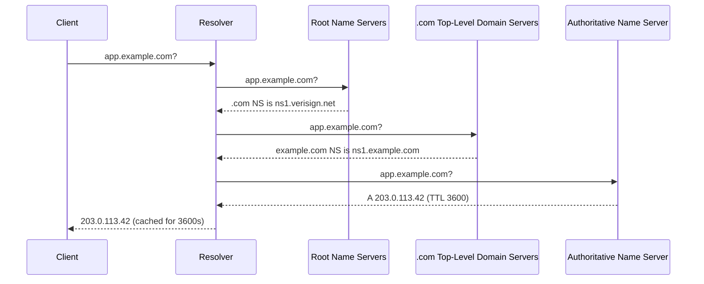
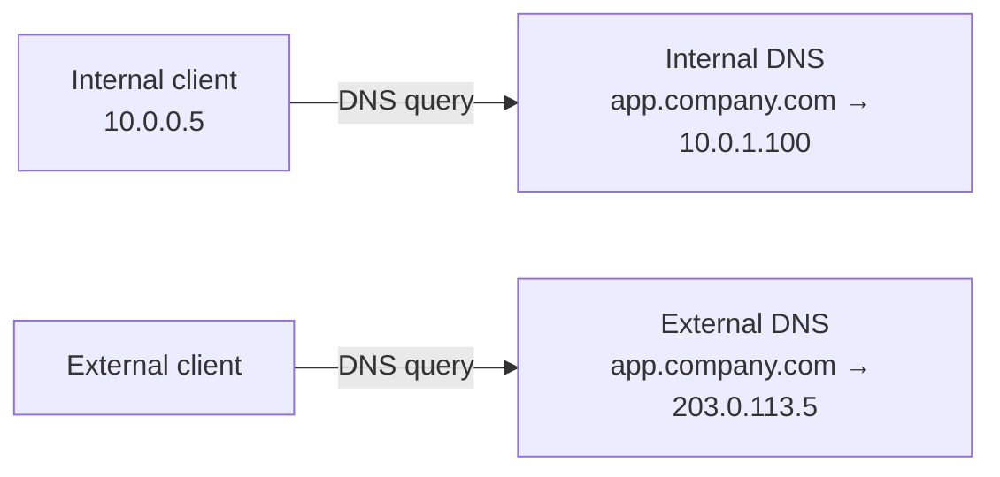
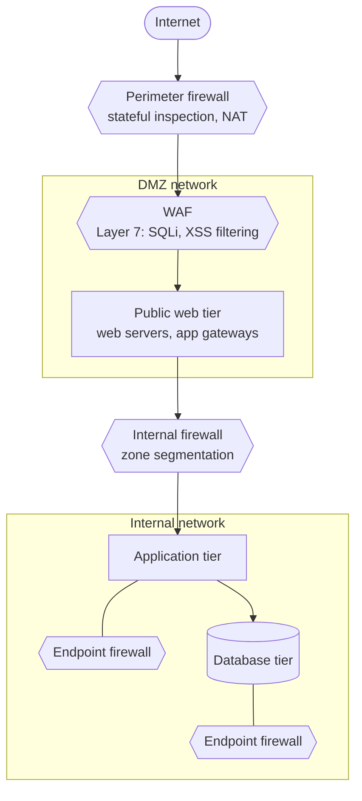
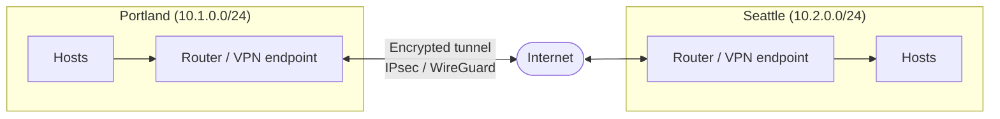
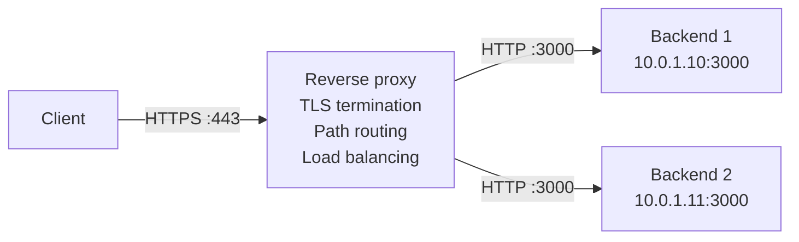
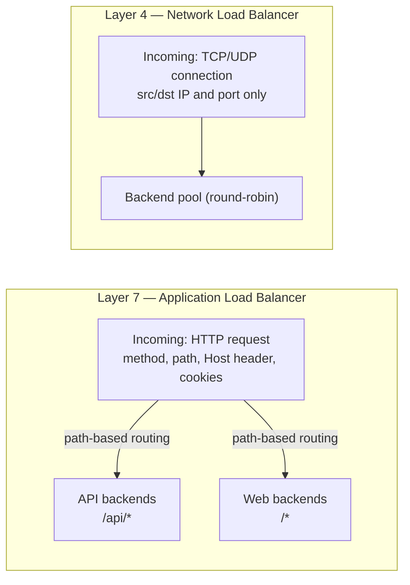
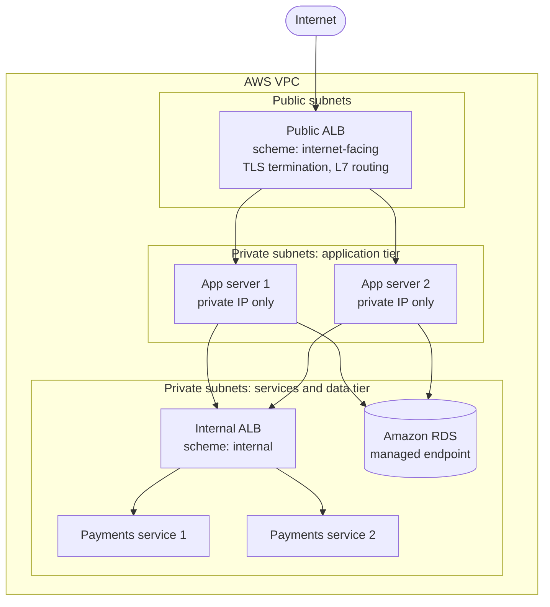
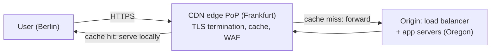
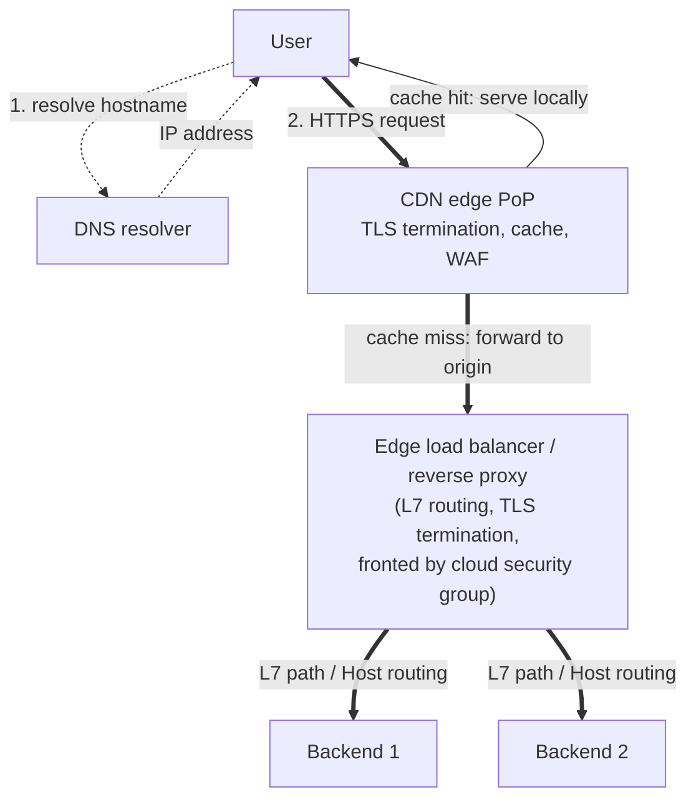

{/* TODO: consider adding SMTP and mail delivery here */}

import { Aside } from '@astrojs/starlight/components';
import HistoricalNote from '/src/components/HistoricalNote.astro';

{/* ai-summary
type: lecture
slug: network-services-and-application-delivery
order: 12
covers: DNS ops (TTL, negative caching, split-horizon, AAAA); mail routing/auth and reputation; firewalls and operational cost; VPN/WAN patterns (incl. WireGuard, Tailscale); reverse proxies and L4/L7 balancing; service mesh sidecar pattern; CDNs; TLS automation/diagnostics (HSTS, OCSP); Kubernetes application-delivery recap
prereq_lectures: networking-fundamentals, container-orchestration
followup_lectures: system-security-and-hardening
paired_activities:
supports_labs: first-container-orchestration-deployment, cluster-operations
*/}

A developer reports that an application is unreachable. The failure could live anywhere in a stack that spans routing tables, firewall rules, Domain Name System (DNS) records, Transport Layer Security (TLS) certificates, and the load balancer distributing requests across backends. Each of these layers is independently configurable, independently breakable, and independently debuggable. A sysadmin who understands how they compose does not guess when something breaks; they know which layer to test first.

Building on the Networking Fundamentals lecture, this lecture covers the services that applications, containers, and users depend on once the network is built: DNS record management, email authentication, firewalls, reverse proxies, load balancers, content delivery networks (CDNs), virtual private networks (VPNs), and TLS certificate management. The bottom-up diagnostic approach from that lecture, with its "if only one service is broken, suspect layers 4 through 7" scope-narrowing rule, applies throughout everything here.

## DNS Configuration and Troubleshooting

The **Domain Name System (DNS)** is the distributed database that translates human-readable names like `example.com` into the IP addresses computers actually route to. A query starts at a host's configured resolver, walks the hierarchy of root, top-level domain (TLD), and authoritative nameservers, and returns a record (an A record for an IPv4 address, an MX record for mail, a TXT record for arbitrary text, and many others). At an operational level the questions that matter are narrower and more consequential than "what does DNS do": which resolver a host is actually using, how long bad data can remain cached, how internal and external answers differ, and which DNS records quietly control email delivery or certificate issuance.

### Resolver Configuration and Direct Queries

On many systemd-based Linux distributions, name resolution is configured automatically. The **Dynamic Host Configuration Protocol (DHCP)** server hands out resolver and search-domain values when the machine joins a network, NetworkManager (or the cloud instance's metadata service) applies them, and `systemd-resolved` exposes a local stub resolver on `127.0.0.53` that applications query. Other Linux environments use different resolvers or write `/etc/resolv.conf` directly, especially minimal containers and non-systemd distributions. Manual edits to `/etc/resolv.conf` are the exception, reserved for cases where the automatic configuration is wrong or insufficient: a server with static addressing on a network without DHCP, a system that needs to override the DHCP-supplied resolver, or a container that needs a specific upstream baked in.

A resolver configuration has two parts that matter operationally. The **nameserver** is the IP address of the recursive resolver to query: often the local `systemd-resolved` stub on `127.0.0.53` on systems that use it, sometimes the gateway's DNS forwarder, sometimes a public resolver like `1.1.1.1`. The **search domain** is a suffix appended to short, unqualified names. With `search corp.example.com` configured, the command `ssh app01` first queries `app01.corp.example.com`, falling back to bare `app01` only if that fails. Search domains save typing inside an organization but cause confusing failures when a machine moves between networks: a host that resolved correctly on the corporate LAN may suddenly point at a different machine after a search-domain change because the same short name now expands to a different fully qualified name.

The first DNS troubleshooting step is confirming which resolver the machine is actually asking, then querying that resolver directly instead of treating "DNS" as a single black box.

```bash
# Query a specific resolver directly, bypassing the local cache
dig @10.0.1.2 app.example.com

# Full iterative resolution from root servers, showing each delegation
dig +trace example.com

# Look up specific record types
dig MX example.com         # mail exchangers
dig TXT example.com        # SPF, DKIM, DMARC, verification tokens
dig AAAA example.com       # IPv6 address
dig CAA example.com        # which CAs may issue certificates
dig NS example.com         # the zone's authoritative nameservers
dig +short A example.com   # just the answer, no headers

# Reverse lookup: what hostname owns this IP?
dig -x 8.8.8.8

# nslookup is older but ubiquitous, including on Windows and minimal containers
nslookup -type=MX example.com
nslookup -type=TXT example.com 1.1.1.1   # query a specific resolver
```

The `dig +trace` flag performs a full iterative resolution starting from the root servers, showing each delegation in the chain. Each tier delegates authority downward until the authoritative nameserver for the zone answers with the actual record.



### DNS Record Types in Depth

DNS records come in many types, each carrying a different kind of answer. A handful of them matter heavily at the operational and integration layer; understanding what each one binds and what fails when it is wrong is more useful than memorizing a table of types.

**A and AAAA records** bind a hostname to an IP address: an A record holds a 32-bit Internet Protocol version 4 (IPv4) address, an AAAA ("quad-A") record holds a 128-bit Internet Protocol version 6 (IPv6) address. In a **dual-stack** deployment (one that serves both IPv4 and IPv6), a host typically publishes both. Clients that prefer IPv6 use the AAAA, falling back to A only on failure. A stale AAAA record therefore produces a confusing partial outage: only the subset of clients that prefer IPv6 fail, and the rest of the user base sees no problem. Mail delivery has a subtle dependency here too: if a domain has no MX record, many mail senders fall back to the domain's A or AAAA records to deliver to, which is why domains that should not receive mail sometimes publish a **NULL MX record** (an explicit declaration that the domain accepts no mail) to prevent that fallback.

**CNAME (Canonical Name) records** are aliases: `www.example.com CNAME example.com` means "look up `example.com` instead of me, and use whatever answer it has." CNAMEs cannot coexist with most other record types on the same name (a CNAME at the apex of a zone breaks email and other root-level records, which is why managed-DNS providers often ship a non-standard "ALIAS" or "ANAME" record for that case). They are the standard way to point a custom hostname at a managed service like a load balancer or a CDN endpoint whose underlying IP can change at any time.

**NS (Name Server) records** publish which authoritative nameservers answer for a zone. The parent zone holds NS records that **delegate** to the child zone's nameservers; mismatched or stale NS records at the registrar are a common cause of "DNS just stopped working" incidents during a provider migration, because the world is still being told to ask the old nameservers.

**MX (Mail Exchanger) records** name the mail servers that accept email for a domain. Each MX record carries a **priority** value, with lower numbers preferred: a sender tries the lowest-priority MX first and falls back to higher numbers only if the first is unreachable. MX records publish hostnames, not IP addresses, so the receiving infrastructure must also have valid A or AAAA records for the names listed.

**PTR (Pointer) records** provide reverse DNS: an IP address mapped back to a hostname. Reverse DNS is published by whoever controls the IP block, not by whoever runs the application using the IP. Missing or mismatched PTR records are strong spam signals, which makes them a hard requirement for any host that sends mail directly, and the inability to set them yourself on cloud IP space is one reason cloud-first organizations rarely self-host outbound SMTP.

**SOA (Start of Authority) records** carry zone metadata: the primary nameserver, the responsible administrator's email (encoded as `name.domain.tld` because `@` is a syntax character in zone files), a serial number for change tracking, and the **negative cache TTL** that controls how long resolvers may cache `NXDOMAIN` answers. When any query returns `NXDOMAIN`, the SOA record in the authority section tells you which zone answered negatively and how long that negative answer will linger. The `MNAME` field also tells you which nameserver to contact to get the underlying record fixed.

**TXT records** carry arbitrary text data attached to a name. The three security-critical email mechanisms (SPF, DKIM, and DMARC, all covered below) publish their data as TXT records. Software-as-a-service (SaaS) providers also use TXT tokens to prove that you control a domain before enabling a service.

**CAA (Certification Authority Authorization) records** tell compliant public Certificate Authorities which issuers are authorized to mint certificates for a domain. A CAA record of `0 issue "letsencrypt.org"` instructs every public CA to refuse issuance for the domain unless it is Let's Encrypt or another explicitly authorized issuer. CAA reduces accidental or unauthorized issuance and works best alongside the public certificate transparency logs discussed in the TLS section.

### TTL Strategy

Every DNS record has a TTL (Time To Live): the number of seconds resolvers may cache the answer before querying again. TTL is one of the most consequential settings in DNS because it controls how quickly changes propagate worldwide.

A record with `TTL 86400` (one day) can be cached by every resolver on the internet for up to 24 hours. If you change that A or AAAA record, users whose resolvers cached the old answer will keep getting the old IP for up to a day. The standard practice before any DNS change that needs to propagate quickly is to reduce TTL to 300 seconds at least 24 hours in advance. Once the old TTL has expired everywhere, make the change, then raise the TTL back.

Short TTLs increase DNS query volume. Large sites use short TTLs (60-300 seconds) on their A and AAAA records so they can shift traffic between data centers within minutes. Smaller organizations typically use 3600 seconds for records that rarely change and 300 seconds for anything actively managed.

### Common DNS Failures

DNS failures are rarely obvious because the symptom is always the same: "I cannot reach the server." Comparing what different resolvers return isolates which link in the resolution chain is at fault. If the internal resolver returns the old address but a public resolver returns the new one, you have a caching or zone propagation problem. If both return NXDOMAIN, the record was deleted or never created. If `dig` succeeds but the application still fails, DNS resolved correctly and the problem is in a higher layer.

Resolvers can also cache negative answers. If a record did not exist five minutes ago and you add it now, some resolvers may continue returning `NXDOMAIN` until the negative-cache timer expires. That timer is derived from the zone's SOA settings, which is why "we created the record, but it still does not exist" can be a real transient DNS state rather than operator error.

A misconfigured search domain is a frequent source of "DNS works but not for me" incidents: short hostnames either resolve to the wrong fully qualified name or fail entirely depending on which network the host is currently attached to. The TTL in the answer section also tells you whether you are looking at a caching problem (a large remaining value, the answer was cached recently and will linger) or a zone-file problem (a small or zero remaining TTL, the answer is fresh but still wrong).

### Internal DNS and Split-Horizon

Most organizations run an internal DNS server that answers queries for private hostnames that should never appear in public DNS. For example, `db.corp.example.com` might resolve to `10.0.1.200` for internal clients, while external DNS has no record for it at all.

**Split-horizon DNS** (also called split-brain DNS) takes this further: the same hostname resolves to different addresses depending on where the query originates. `app.company.com` might resolve to `10.0.1.100` for internal clients (going directly to the backend) and to `203.0.113.5` (the public load balancer) for external clients. The internal answer avoids the round-trip through the internet and eliminates a dependency on the load balancer for internal traffic. The tradeoff is behavioral drift: internal users may bypass the public content delivery network (CDN), web application firewall (WAF), or load balancer path entirely, so they may not see the same authentication redirects, rate limits, access logs, or certificate behavior that external users do.



When troubleshooting internal name resolution failures, always check `/etc/resolv.conf` first (is the nameserver IP correct? is the search domain right?), then query the internal DNS server directly with `dig @<nameserver-ip> hostname` to bypass any caching layer.

## Routing and Gateway Issues

A host's **routing table** tells it where to send packets bound for any destination network. The most consequential entry is the **default gateway**: the next hop for everything that is not on a directly connected network, typically the LAN's router. `ip route` shows the table on Linux, with the default route at the top. When a host can reach machines on its own subnet but nothing beyond it, the default gateway is the first thing to check: missing, wrong, or unreachable.

The diagnostic tool for routing failures is `traceroute` (or its variants `tracepath` and `mtr`), which sends packets with progressively larger time-to-live (TTL) values to coax each hop into revealing itself when it discards the packet. Lines of `* * *` mean a hop chose not to reply, often because the router deprioritizes TTL-expired ICMP responses, and are not by themselves evidence of a failure. Two failure shapes are worth distinguishing: a route that ends abruptly partway is a routing or peering problem, while a route that completes but the application still cannot connect points to a higher-layer issue (firewall policy, the application not listening, TLS misconfiguration).

The most common operational surprise at this layer is **asymmetric routing**: traffic takes a different path in each direction. A request reaches the server through Router A, but the response leaves through Router B because each side's routing table prefers a different path back. The architecture is not necessarily broken; enterprise networks often have multiple egress paths and asymmetric flow is a normal consequence. The problem is that asymmetric routing interacts badly with **stateful firewalls** (firewalls that track each open Transmission Control Protocol (TCP) connection in a session table and decide whether to allow new packets based on whether they belong to a known session). If a firewall sits on Router A's path and sees the inbound TCP SYN (the first packet of a connection setup) but never the matching SYN-ACK that returns through Router B, the session never enters its table; it then drops subsequent packets from what looks like an unsolicited mid-flight connection. The symptom is intermittent or one-sided failure that does not correlate with any single server's logs, often diagnosed by capturing packets at multiple points in the network and comparing what each interface sees.

Three patterns address asymmetric routing in practice. The cleanest is to **eliminate the asymmetry**: place stateful firewalls only where both directions of a flow are guaranteed to traverse them, or pair redundant firewalls so each one sees both sides of every session it is responsible for, typically through a session-synchronization protocol between the firewalls. The second is to **steer the return path** with policy-based or source-based routing rules that send responses out the same interface they arrived on regardless of the destination's preferred default route, which restores symmetry without redesigning the network. The third, used at boundaries that do not require deep inspection, is to **use stateless rules** that do not depend on session matching: less precise, but immune to the failure mode. Cloud environments make the first option easier than traditional networks because traffic is funneled through specific virtual network appliances by design; on-premises networks usually fix it during a physical or logical redesign rather than at runtime.

## Email Infrastructure

Email is rarely set up from scratch today; most organizations use hosted services like Google Workspace or Microsoft 365. But understanding how email flows through DNS and Simple Mail Transfer Protocol (SMTP) is necessary for any sysadmin, because misconfigured email records affect deliverability for the entire domain and debugging delivery failures is a surprisingly common task.

### How Email Routing Works

When you send an email to `user@example.com`, your mail server performs a DNS **MX record** lookup for `example.com`. The MX record returns the hostname (not IP) of the mail server that accepts mail for that domain, along with a priority number. Lower priority values are preferred; if the primary is unreachable, the sender falls back to higher values. If a domain has no MX record at all, SMTP traditionally falls back to that domain's A or AAAA record unless the domain publishes a NULL MX record to say it does not accept mail.

### Email Authentication: SPF, DKIM, and DMARC

Spam and phishing attacks forge the `From:` address in emails. Three DNS-based mechanisms allow receiving mail servers to verify that an email genuinely came from where it claims.

**SPF (Sender Policy Framework)** is a DNS TXT record that authorizes which servers may send email for the domain used in the SMTP envelope, the `MAIL FROM` or `Return-Path` domain. A receiving server checks whether the sending host is authorized for that envelope domain; if not, the email fails SPF and is more likely to be rejected or marked as spam. SPF by itself does not prove that the visible `From:` header matches that sending domain.

**DKIM (DomainKeys Identified Mail)** adds a cryptographic signature to every outgoing email. The public key is published in DNS. The receiving server uses it to verify that the email was not modified in transit and was sent by someone who holds the domain's private key.

**DMARC (Domain-based Message Authentication, Reporting and Conformance)** ties SPF and DKIM to the visible `From:` domain by requiring alignment between that header and at least one passing authentication mechanism. It adds a policy: `p=none` for monitoring only, `p=quarantine`, or `p=reject`, and it instructs receiving servers where to send aggregate reports. A `p=reject` policy effectively blocks forged email from your domain.

<Aside type="tip" title="Configure Email Authentication Before Sending">
When setting up email for a new domain, configure SPF, DKIM, and DMARC before sending any bulk email. Major providers (Gmail, Microsoft) increasingly reject or silently drop mail from domains that lack these records.
</Aside>

### Why You Probably Should Not Run Your Own Mail Server

Running a mail server requires a static IP with proper reverse DNS, a clean sending reputation maintained over months, valid TLS certificates, working SPF, DKIM, and DMARC, and round-the-clock abuse monitoring. The hardest of these by a wide margin is **sender reputation**, and it has gotten substantially harder over the last decade. Major receivers (Gmail, Microsoft 365, Yahoo, Apple iCloud) treat any new IP sending to their users as suspicious by default and aggressively rate-limit or silently bin its mail. A new IP needs a deliberate **warmup period** of several weeks where volume is ramped up gradually and bounce, complaint, and spam-trap rates are kept under tight thresholds. Most cloud provider IP ranges are blocked outright or heavily throttled by major receivers because of years of abuse from those ranges, so spinning up an SMTP server on a new EC2 instance and expecting Gmail to accept its mail does not work. The DNS-based blocklists (Spamhaus, SORBS, Barracuda) are stricter than they once were and far faster to list than to delist; once you are listed by a major blocklist, removal often requires demonstrating that the underlying abuse problem has been remediated, not just asking. Reputation also propagates between IPs in the same /24 block, so a noisy neighbor in your subnet can drag your deliverability down even if you are doing everything right.

Hosted solutions like Google Workspace or Microsoft 365 absorb all of this for a per-user monthly fee, and they bring decades of accumulated reputation with major receivers that an individual organization cannot replicate. This is the same build-versus-buy tradeoff that appears throughout infrastructure decisions, but it is more lopsided here than for almost any other piece of infrastructure: the ongoing operational cost of self-hosting outbound email is dominated not by maintenance but by sender-reputation work. The main reasons left to self-host outbound mail are strict data sovereignty (the messages must never leave a specific jurisdiction), regulated environments where the chain of custody must be operated in-house, or transactional volumes high enough that even per-message hosted pricing becomes unreasonable. For everyone else, the practical pattern is hosted email for human mailboxes plus a transactional email service such as [SendGrid](https://sendgrid.com/), [Postmark](https://postmarkapp.com/), or [Amazon Simple Email Service (SES)](https://aws.amazon.com/ses/) for application-generated mail, where the provider handles the reputation problem on your behalf.

## Firewalls

A **[firewall](https://www.cloudflare.com/learning/network-layer/what-is-a-firewall/)** is a policy enforcement point on a network: it inspects each packet (or each connection) against a set of rules and decides whether to allow, deny, or log it. Firewalls operate at every position from the device itself (an endpoint firewall on a single laptop or server) up to the perimeter where an organization meets the public internet, and increasingly inside the network as well to segment trust zones. Their effectiveness is bounded by their position: a firewall is only useful for the traffic that actually crosses it, so the placement question shapes everything else about how firewall policy is designed and debugged.

### Placement and Zone Design

Different firewall positions protect different perimeters. A **perimeter firewall** sits between the internal network and the internet, so every external packet passes through it. A **DMZ (Demilitarized Zone)** is a network segment between the perimeter firewall and the internal network, used to host internet-facing services (web servers, mail relays) that should not have direct access to internal systems. An **internal firewall** segments zones inside the organization: separating the DMZ from the application tier, or corporate systems from production servers. A **WAF (Web Application Firewall)** sits in front of web services to inspect traffic for application-layer attacks like Structured Query Language (SQL) injection or cross-site scripting. An **endpoint firewall** runs on the host itself and protects the device regardless of whether traffic crosses a central appliance. One common multi-tier web design looks like this, though real environments often collapse or rearrange these roles.

In the diagram below, hexagons mark **firewall components** (policy-enforcement points) and rectangles mark **network resources** (the things firewalls protect or expose). Endpoint firewalls are shown attached to each server in the internal network rather than as a separate node in the traffic path: they enforce policy locally on the host, regardless of which network firewalls a packet has already traversed.



<Aside type="note" title="Lateral Traffic and Firewall Blindspots">
Firewalls only inspect traffic that passes through them. Traffic that stays entirely within an unmanaged switch never hits a firewall unless endpoint firewalls are involved. This is a frequently overlooked gap in network designs.
</Aside>

### Firewall Technologies

Modern firewalls combine several inspection techniques. **Packet filtering** allows or denies traffic based on source or destination IP, protocol, and port. **Stateful inspection** adds connection awareness, which is why return traffic for an established session is automatically allowed without a matching inbound rule. More advanced devices can proxy connections, inspect payloads with Deep Packet Inspection (DPI), or understand application protocols like Hypertext Transfer Protocol (HTTP) and DNS well enough to make layer-7 policy decisions. IPS (Intrusion Prevention System) behavior adds signature-based or anomaly-based detection to block exploit traffic inline. The tradeoff is consistent across all of these features: richer inspection gives better control and better detection, but costs CPU, latency, and operational complexity.

### The Operational Cost of Firewall Policy

Firewalls are not free. Every rule in production has to be **understood** (someone has to know why it exists), **maintained** (rules drift out of date as services move and people leave), and **debugged** when it interferes with legitimate traffic. The longer a rule set lives, the more rules it accumulates that nobody currently understands; engineers become reluctant to remove rules whose purpose is unclear, and the policy grows into something that grants access nobody can fully account for. Stateful inspection consumes CPU and memory on the firewall (each tracked connection holds an entry in a session table sized at provisioning time), and connection-table exhaustion under sudden load or sustained scans is a real outage shape, not a theoretical one. Deep packet inspection and TLS interception multiply the cost: TLS interception in particular requires the firewall to terminate TLS and re-encrypt to the destination, which means installing the firewall's CA in every endpoint's trust store and operating an internal CA, with all the trust-store and key-management work that implies.

Firewalls also become **change-management bottlenecks**. A tightly governed firewall queue is often the slow step in deploying a new service, which produces pressure to either over-provision permissions ahead of time (defeating the purpose) or build automation around firewall change requests. None of this is an argument against firewalls; it is an argument for treating firewall policy like code (versioned, reviewed, tested, retired when no longer needed) rather than as a one-time configuration that accretes forever.

### Common Firewall Terminology

Firewall interfaces and vendor documentation reuse a small vocabulary constantly. Learning these terms makes rule sets much easier to read across products.

| Term | Meaning |
|---|---|
| **Zones** | Logical groupings of devices or subnets sharing the same security policy (e.g., local network, DMZ, internet edge) |
| **Policies** | Sets of rules governing access control and behavior for traffic between zones |
| **Rules** | Specific instructions within a policy: allow or deny traffic matching source, destination, protocol, port |
| **Traffic shaping** | Rate limiting and prioritization; can limit the impact of denial-of-service attacks |

### Linux Firewalls: iptables and nftables

On Linux, the kernel's netfilter framework handles packet filtering. The traditional interface is `iptables`; the modern replacement is `nftables`. Both organize rules into chains: `INPUT` for incoming traffic, `OUTPUT` for outgoing, and `FORWARD` for traffic being routed through the host.

```bash
# List current iptables rules with line numbers
sudo iptables -L -n --line-numbers

# List all nftables rules
sudo nft list ruleset
```

<Aside type="caution" title="iptables Rules Are Not Persistent">
Changes made with `iptables` commands are not persistent by default. They disappear on reboot. Use `iptables-save` and `iptables-restore`, or your distribution's firewall management tool, to persist rules.
</Aside>

Higher-level tools like `ufw` (Ubuntu) and `firewalld` (RHEL/Fedora) manage netfilter rules through a simpler interface and handle persistence automatically. Configuration management tools like Ansible can manage firewall rules idempotently across a fleet, which is how large deployments keep firewall policy consistent without per-host manual changes.

### Cloud Security Groups

In Amazon Web Services (AWS), the two common virtual firewall layers are security groups and network access control lists (ACLs). Security groups are stateful (return traffic is automatically allowed); network ACLs are stateless (you must explicitly allow return traffic in both directions). A common misconfiguration is allowing client traffic on port 443 while misconfiguring the load balancer's target group, the backend pool object it probes and routes to, or blocking health check traffic with a security group or network ACL. The application works when accessed directly but fails behind the load balancer because the health probe never gets a success response and the backend is marked unhealthy.

Azure and Google Cloud Platform (GCP) expose comparable controls with different names and scopes: translate the concept rather than assuming AWS labels apply everywhere.

### Systematic Firewall Debugging

When you suspect a firewall is blocking traffic, the distinction between a timeout and a refused connection is a clue, not proof. A "connection refused" error usually means the packets reached a host that actively rejected the connection because nothing is listening, but a reject rule in a firewall or a middlebox can produce the same symptom. A connection that hangs until it times out often means packets are being silently dropped somewhere, which is characteristic of a firewall drop rule, but it is still only a hint. Confirm the service is listening on the server, then test connectivity from the client side. If the service is listening but the client times out, run a packet capture on the server with `tcpdump` (introduced in the Networking Fundamentals lecture) to verify whether traffic is arriving at all. Incoming SYN packets without matching SYN-ACK responses confirm the server is receiving requests but not completing the handshake (a local firewall rule, asymmetric routing, or a process not actually listening on the expected interface). No incoming packets at all means the traffic is being dropped upstream, and you need to capture at the next hop toward the client.

## Virtual Private Networks

A virtual private network (VPN) creates an encrypted tunnel between two endpoints over an untrusted network, typically the internet. All traffic inside the tunnel is encrypted, appearing as ordinary encrypted packets to anyone observing the network.

A VPN is not the same thing as a proxy, even though some commercial privacy services make the distinction feel blurry. A privacy VPN changes where your traffic exits to the public internet, which can make it feel proxy-like. But the underlying mechanism is still a network tunnel carrying general routed traffic, not an application-specific relay. A **forward proxy** accepts requests from a client application and sends them onward. A **reverse proxy** accepts requests on behalf of servers. A remote-access VPN extends the routed network to your device; it does not stand in front of your servers the way a reverse proxy does.

### Deployment Patterns

**Site-to-site VPN** connects two or more geographically separate offices, allowing their internal networks to communicate securely as if they were on the same LAN. The VPN is configured on the routers or firewalls at each site.



**Remote-access VPN (client-to-site)** allows individual devices to securely connect to the full corporate routed network from anywhere. The user runs a VPN client on their device; the organization runs a VPN server at the edge. This differs from service-specific remote access tools (sometimes marketed as zero-trust network access) that expose only selected applications rather than the full routed network.

### VPN Protocols

The three protocols you will encounter most often each make different tradeoffs:

**Internet Protocol Security (IPsec)** is a suite of standards built into most enterprise routers and firewalls, and it benefits from hardware acceleration for high throughput. It is the default for site-to-site enterprise deployments, though its configuration is verbose compared to newer alternatives.

**OpenVPN** is open-source and flexible. Running over TCP or UDP, it is easy to tunnel through restrictive firewalls and has a long track record in remote-access deployments.

**[WireGuard](https://www.wireguard.com/)** uses modern cryptography and a much smaller code base than IPsec or OpenVPN, making it easier to audit and often faster in benchmarks. It has less legacy hardware support but is increasingly adopted in new deployments. Its simplicity has made it the default in many modern VPN products. The most prominent commercial example is **[Tailscale](https://tailscale.com/)**, which uses WireGuard for the data plane but adds a coordination server that distributes keys and helps peers traverse Network Address Translation (NAT) boundaries automatically, producing a peer-to-peer mesh rather than a traditional hub-and-spoke remote-access VPN. **[Headscale](https://headscale.net/)** is an open-source reimplementation of Tailscale's coordination server that organizations can run themselves. The mesh model blurs the line with the service-specific "zero-trust network access" tools mentioned earlier; the practical distinction is whether each device receives a routable IP on a private overlay (mesh VPN) or whether each application is exposed individually behind an identity-aware proxy (zero-trust network access).

### Connecting Multiple Locations

**Site-to-site VPN** is the standard for a small number of offices. IPsec or WireGuard tunnels between routers, combined with a routing protocol advertising internal subnets across the tunnel, is inexpensive and sufficient for two to five locations.

**MPLS (Multiprotocol Label Switching)** is a carrier-provided service where the Internet Service Provider (ISP) manages the wide area network (WAN) between your sites. Traffic enters the provider's private WAN at one site and emerges at another without using the public internet directly. Organizations buy MPLS for provider-managed routing, traffic classes, and service-level agreements around latency, loss, or availability. MPLS is expensive; teams choose it for predictable operational characteristics, not because the label itself magically guarantees performance.

**SD-WAN (Software-Defined Wide Area Network)** creates an overlay network across multiple underlay connections: broadband internet, Long-Term Evolution (LTE), and MPLS. A centralized controller defines routing policy; the SD-WAN devices at each site select the best path per application. A video call might use a managed low-latency link while bulk backups use cheap broadband. SD-WAN has reduced dependence on pure MPLS in many new deployments, but many organizations still run hybrid WANs that mix MPLS and internet links when the application mix or existing contracts justify it.

<HistoricalNote title="From Frame Relay to MPLS to SD-WAN">
Enterprise WAN connectivity has gone through two major technology transitions in thirty years. Through the 1990s, the dominant technology was Frame Relay: a packet-switched carrier service where customers paid for a Committed Information Rate. Frame Relay and ATM (Asynchronous Transfer Mode) were both displaced by MPLS in the early 2000s. MPLS let carriers accept IP packets at one site, label them with a short identifier, and switch them across the backbone using the label rather than performing a full IP route lookup at every hop, providing ATM-like predictability at IP prices. SD-WAN has been displacing MPLS since the 2010s by achieving comparable reliability through intelligent traffic steering across multiple cheaper connections rather than a single expensive carrier service.
</HistoricalNote>

**Cloud connectivity**: when one of your "sites" is an Amazon Web Services (AWS) Virtual Private Cloud (VPC) or Azure Virtual Network (VNet), a cloud VPN gateway creates an IPsec tunnel from your office router to that cloud network, which is inexpensive but limited in bandwidth and latency. **AWS Direct Connect** or **Azure ExpressRoute** are dedicated private fiber connections from your office to the cloud provider's colocation facility: higher cost, but predictable latency and no traffic on the public internet. In cloud-first environments, the "company network" increasingly means a hub VPC with VPN or Direct Connect back to any physical offices, where the same networking concepts apply but the hardware is abstracted into application programming interfaces and declared in Terraform rather than configured on physical appliances.

## Reverse Proxies and Load Balancers

A **reverse proxy** is a server that sits in front of one or more backend servers and forwards client requests to them. From the client's perspective, it is communicating with the reverse proxy directly; the backend servers are invisible. This contrasts with a **forward proxy**, which sits in front of clients and forwards their requests outward, commonly used for caching or content filtering in corporate networks.

### Why Use a Reverse Proxy

Reverse proxies solve several operational problems at once. They centralize TLS termination for HTTPS, the secure form of the Hypertext Transfer Protocol (HTTP), so certificates are managed in one place. They provide a single entry point for access logging, rate limiting, and header injection. They route requests to different backends based on hostname or path. And they hide the backend topology from clients. That combination is why reverse proxies appear in almost every serious web deployment even before traffic volume is high enough to demand load balancing.



### Load Balancers

A **load balancer** is a reverse proxy that distributes incoming requests across multiple backend instances. When a single server cannot handle traffic volume, you run multiple identical instances and let the load balancer spread the load. Common distribution algorithms:

| Algorithm | How it works | When to use it |
|---|---|---|
| Round-robin | Requests cycle across backends in sequence | General purpose; assumes requests are roughly equal in cost |
| Least connections | Each request goes to the backend with the fewest active connections | Long-lived or variable-cost requests (file uploads, streaming) |
| IP hash | The client's IP determines which backend handles the request | Session-sticky applications that store state locally on the server |

Distribution is only half of a load balancer's job. In production, the device also runs **health checks** against each backend, marks instances unhealthy after repeated failures, and often supports **connection draining** so in-flight requests can finish before a backend is removed during a deployment. That is why a broken probe path, wrong host header, wrong port, or mismatched TLS expectation can take down an otherwise healthy service: the load balancer stops sending traffic because the health check is wrong, not because the application itself is dead.

Session stickiness is sometimes necessary for legacy applications that keep session state in process memory, but it is usually a compatibility workaround rather than the desired end state. Modern designs prefer stateless backends or a shared session store so any healthy instance can serve any request.

### Layer 4 vs. Layer 7

Load balancers operate at different Open Systems Interconnection (OSI) layers, and that determines what information they can use when making routing decisions.



A Layer 4 load balancer makes decisions using IP addresses, ports, and connection state rather than HTTP semantics: it is fast and protocol-agnostic, but it cannot do path-based or header-based routing. Some Layer 4 products can still terminate TLS, but they do not become HTTP-aware proxies just because the handshake ends there. A Layer 7 load balancer parses the application protocol, allowing routing by path, hostname, or header value, header injection, URL rewriting, and TLS termination. On AWS, many web applications use an [Application Load Balancer (ALB)](https://aws.amazon.com/elasticloadbalancing/application-load-balancer/). A [Network Load Balancer (NLB)](https://aws.amazon.com/elasticloadbalancing/network-load-balancer/) is appropriate when you need to load-balance non-HTTP protocols, preserve the client's source IP address at the packet layer, use static IP addresses, or minimize processing overhead. An ALB usually conveys client identity to the backend in headers such as `X-Forwarded-For` instead.

A concrete Layer 4 example: a managed PostgreSQL cluster fronted by an NLB on TCP port 5432. The NLB cannot inspect the SQL traffic (the protocol is binary, not HTTP) and would gain nothing from doing so. What it provides is a single stable endpoint with health checking and connection distribution across two read replicas. Each new TCP connection from a client is assigned to a backend, and the NLB then forwards bytes between client and backend without parsing them. The client sees the NLB's address as the database server it connected to; the source IP visible to the backend is preserved because the NLB does not rewrite it. The same shape applies to a Redis cluster on port 6379, a custom binary protocol on a non-standard port, or a UDP service like a game server or DNS load balancer where parsing the application layer is not possible at all.

### Software Options

Several mature software implementations cover different deployment contexts:

**[Nginx](https://nginx.org/)** is one of the most widely deployed reverse proxies and load balancers. Its configuration model is explicit and highly flexible. Certificate management requires a separate tool such as [certbot](https://certbot.eff.org/), which adds operational overhead that must be managed (timers, renewal hooks, post-renew reloads).

**[Caddy](https://caddyserver.com/)** handles TLS certificate issuance and renewal automatically via ACME, without a separate certbot process. Its configuration syntax is simpler. The automatic HTTPS behavior makes it a natural fit for deployments where certificate automation matters more than fine-grained configuration control.

**[Traefik](https://traefik.io/)** is designed for container-native environments. It auto-discovers services from Docker labels or Kubernetes annotations and generates routing configuration dynamically, without manual config file edits. This makes it common in Docker Compose and smaller Kubernetes deployments where backends come and go frequently.

**[HAProxy](https://www.haproxy.org/)** is a battle-tested load balancer known for fine-grained control over health checks, connection queuing, and per-backend statistics. It is frequently chosen as a dedicated load balancer in front of databases or other TCP-based services.

### Public and Internal Load Balancers in a VPC

The patterns above describe load balancers as components in isolation. In a typical Amazon Web Services (AWS) deployment, two of them work together to separate the public-internet entry point from the private application network. A **public-facing load balancer** (most often an Application Load Balancer (ALB) configured with the `internet-facing` scheme) lives in **public subnets** and has internet-routable addresses. The **app servers** live in **private subnets** with no public IPs at all. The public ALB is the only entry point: requests from the internet hit the ALB, which terminates TLS and forwards over the VPC's private network to the app servers' private addresses. Security groups enforce that the app servers accept inbound traffic only from the ALB's security group, not from the internet directly, which means a misconfigured app server cannot accidentally become reachable.

One tier deeper, an **internal-scheme load balancer** (an ALB or NLB with `scheme=internal`) is common wherever one private service calls another. An order service in the application tier might talk to a payments service through an internal ALB rather than every order replica needing to know the addresses of every payments replica. Internal load balancers have private IPs only and are reachable only through private connectivity into the VPC, whether from resources in the VPC itself or from attached private networks such as peered VPCs, Transit Gateway paths, or VPN-connected sites. They are typically only TLS-terminated when the internal traffic is sensitive enough to warrant it. The database tier is usually fronted not by another load balancer but by a managed service endpoint: [Amazon Relational Database Service (RDS)](https://aws.amazon.com/rds/) publishes a DNS hostname that resolves to the active primary, with read replicas reachable through their own endpoints. In the private-subnet pattern shown here, those endpoints stay on the private side of the architecture rather than creating another public entry point.



The Cloud Computing lecture covers VPCs, subnets, and security groups in depth. This subsection's contribution is showing where the reverse-proxy and load-balancer concepts from this lecture sit inside that topology. The same architectural pattern applies on Azure (with Azure Load Balancer or Application Gateway in front, an internal load balancer behind) and Google Cloud Platform (with Cloud Load Balancing in front, an internal load balancer behind) under different names.

## Content Delivery Networks

A **[content delivery network (CDN)](https://www.cloudflare.com/learning/cdn/what-is-a-cdn/)** is a geographically distributed network of edge servers that caches and serves content from locations close to users. A request from a user in Berlin hitting an origin server in Oregon would normally travel across the Atlantic for every resource. With a CDN, static resources (and often dynamically generated responses) are served from an edge PoP (Point of Presence) in Frankfurt, reducing latency by an order of magnitude.

CDNs do more than caching. They terminate TLS at the edge PoP, so the TLS handshake latency is between the user and the nearest edge server rather than between the user and the origin. They also help absorb very large distributed denial-of-service (DDoS) floods at a scale that no single origin server can usually match. Most major CDNs also offer integrated WAF and bot mitigation, making the CDN the first layer of HTTP-aware security in the request path.



[Cloudflare](https://www.cloudflare.com/), [AWS CloudFront](https://aws.amazon.com/cloudfront/), [Fastly](https://www.fastly.com/), and [Akamai](https://www.akamai.com/) are the major CDN providers. Cloudflare is distinctive because it combines authoritative DNS with a reverse-proxy CDN: pointing your domain's nameservers at Cloudflare allows its DNS to return Cloudflare edge addresses for proxied records, so web traffic reaches Cloudflare's edge first and can have caching, WAF, and DDoS protection applied before the request is forwarded to the origin.

Cache invalidation is one of the harder operational problems with CDNs. `Cache-Control` headers control how long the CDN caches content. Deploying a new version of a static asset requires either cache purging (a CDN API call to invalidate specific paths) or cache-busting (including a content hash in the filename so new deployments get new URLs that the CDN has never seen). Continuous integration and continuous delivery/deployment (CI/CD) pipelines can automate both patterns: a Terraform-managed CloudFront distribution can have its cache invalidated as a deployment step, treating the CDN configuration as just another infrastructure resource alongside the compute.

## TLS Certificates

**Transport Layer Security (TLS)** turns plain TCP into an encrypted, authenticated channel. During the handshake, the server presents a **certificate**: a signed document binding a hostname to a public key, signed by a **Certificate Authority (CA)** that the client already trusts via its operating system or browser trust store. The client validates the chain (leaf certificate signed by an intermediate CA, intermediate signed by a root CA in the trust store), checks that the certificate's validity dates and `subjectAltName` (the field that lists which hostnames the certificate covers) match the connection, and only then proceeds. The cryptography is rarely what fails in production. What fails is the operational side: certificates have to be issued, renewed, logged, stapled, rotated, and debugged under production constraints. The System Security and Hardening lecture revisits TLS through a security lens, covering trust store management, internal CA design, and the attack surfaces that misconfigured certificates create.

### Certificate Types

Commercial CAs sell certificates at three levels of validation.

**DV (Domain Validated)** certificates verify only that the requester controls the domain, by serving a challenge file over HTTP or adding a DNS TXT record. Issuance is fully automated and takes seconds. [Let's Encrypt](https://letsencrypt.org/how-it-works/) issues only DV certificates. DV is appropriate for the vast majority of web services.

**OV (Organization Validated)** certificates additionally verify the legal existence and identity of the organization through documentation review. The organization's name appears in the certificate's subject field. OV issuance takes hours to days. Banks and large enterprises sometimes use OV to provide additional assurance to users.

**EV (Extended Validation)** certificates require the most thorough identity verification and historically triggered a green address bar in browsers. Most browsers have removed the visual distinction, significantly reducing the practical benefit. EV certificates have largely fallen out of common use.

### Certificate Transparency

Since 2018, [Certificate Transparency (CT)](https://certificate.transparency.dev/) has been required for publicly trusted certificates. Every CA must log issued certificates in public, append-only CT logs, and browsers expect proof of logging before trusting the certificate. The practical benefit is visibility: if an unexpected certificate is issued for your domain, CT monitoring can detect it quickly because the certificate has to be publicly logged. You can query CT logs directly to see the certificates that have been issued for a domain, which is useful for auditing what has been authorized.

### Let's Encrypt and Automated Certificate Management

Before 2016, obtaining a certificate required purchasing one from a commercial CA and manually renewing it every one to two years. Let's Encrypt changed this by providing free DV certificates via an automated protocol called [ACME (Automated Certificate Management Environment, Request for Comments (RFC) 8555)](https://datatracker.ietf.org/doc/html/rfc8555). One widely used ACME client on traditional Linux servers is **certbot**, which proves domain ownership either by temporarily serving a challenge file on port 80 (HTTP-01 challenge) or by adding a DNS TXT record (DNS-01 challenge). On many Linux installs, a systemd timer or cron job runs `certbot renew` several times per day; certificates are renewed automatically when they have less than 30 days remaining. The 90-day certificate lifetime is intentional: it forces automation and limits the exposure window if a private key is compromised.

Caddy manages the full ACME lifecycle automatically: no certbot, no systemd timers, no cron jobs. It requests, stores, and renews certificates without operator intervention. The tradeoff is less visibility and control over the certificate lifecycle compared to managing certbot explicitly, which matters in regulated environments that require audit trails for certificate operations.

### HSTS and OCSP Stapling

Two mechanisms improve the security posture of a TLS-enabled site after the certificate is in place.

**HSTS (HTTP Strict Transport Security)** instructs browsers to always connect to a domain over HTTPS, never HTTP, for a specified period. Once a browser has seen the `Strict-Transport-Security` header, it refuses to make an unencrypted connection to that domain for the duration of the `max-age` directive. This prevents downgrade attacks on later visits. To protect the very first visit as well, the domain has to be submitted to the [browser preload list](https://hstspreload.org/) maintained by the Chromium project and consumed by every major browser.

Preloading is an explicit opt-in, not a default recommendation. The Chromium preload list requires at least `max-age=31536000`, `includeSubDomains`, and `preload`, plus working HTTPS on every subdomain, including internal ones. Removal is slow, and modern browsers already auto-upgrade many HTTP navigations on their own, so most teams should deploy ordinary HSTS first, ramp `max-age` upward carefully, and add `preload` only when they are certain the domain can remain HTTPS-only long-term. Concretely, an HSTS-enabled response can include a header like the following:

```
Strict-Transport-Security: max-age=63072000; includeSubDomains; preload
```

The `max-age=63072000` tells the browser to remember this for two years. That is a common strong value, not the minimum preload requirement. `includeSubDomains` extends the policy to every subdomain. `preload` is the operator's signal that the domain is asking to be included in the preload list. In Nginx the configuration is one line inside the relevant `server` block:

```nginx
add_header Strict-Transport-Security "max-age=63072000; includeSubDomains; preload" always;
```

The `always` flag ensures the header is sent on error responses too, which matters because a 4xx or 5xx response without HSTS would silently leave that browser session unprotected.

**Online Certificate Status Protocol (OCSP) stapling** improves certificate revocation checking. The traditional OCSP mechanism requires the browser to query the CA's OCSP responder during every TLS handshake, adding latency and leaking browsing behavior to the CA. With OCSP stapling, the server periodically fetches a signed OCSP response from the CA and includes ("staples") it in the TLS handshake. The client gets revocation status without an extra network round trip and without the CA learning which sites the user visits. In Nginx, stapling also needs a working DNS resolver because the server has to look up the CA's OCSP responder hostname. A minimal configuration looks like this:

```nginx
resolver 1.1.1.1 1.0.0.1 valid=300s;
ssl_stapling on;
ssl_stapling_verify on;
ssl_trusted_certificate /etc/letsencrypt/live/example.com/chain.pem;
```

`ssl_stapling_verify on` makes Nginx validate the OCSP response signature against the chain file before serving it, which prevents the server from stapling a malformed or stale response to clients. `ssl_trusted_certificate` must include the issuer chain Nginx needs for that verification. Caddy generally handles stapling automatically when the certificate issuer supports it. You can confirm stapling is working with `openssl`:

```bash
echo | openssl s_client -connect example.com:443 -servername example.com -status 2>/dev/null | grep -A1 "OCSP Response Status"
```

A successful staple shows `OCSP Response Status: successful` followed by `Cert Status: good`.

### Internal Certificates

For internal services, a public CA can issue a certificate for a privately hosted service under a public domain you control, using DNS-01, even if the service is not exposed to the public internet. When the name is private or purely internal, you typically use one of two approaches.

**Self-signed certificates** are generated locally without any CA involvement. They encrypt traffic but browsers do not trust them by default. Suitable for testing or for services where you control all clients and can manually add the certificate to the trust store.

**Internal Certificate Authority (CA)**: generate your own CA certificate, install it in the trust store of all company devices (typically via Active Directory Group Policy or a Mobile Device Management (MDM) system), and sign internal service certificates with it. Clients trust anything signed by your internal CA without warnings. This is the standard approach for companies that need HTTPS on internal services without per-device browser exceptions.

### Diagnosing TLS Failures

The `openssl s_client` command is a diagnostic tool, not a browser. It opens a TLS connection and prints the certificate chain and session details, which makes it excellent for inspection but easy to misread if you treat it like a strict verifier. On shared reverse proxies you should usually send explicit SNI with `-servername host` so the correct virtual host certificate is selected. If you want to test hostname validation rather than just inspect the chain, add `-verify_hostname host`; if you want verification failures to abort the handshake instead of being printed and ignored, add `-verify_return_error`. The operational question is what to do when each failure mode appears once you have run the right variant of the command.

An **expired certificate** means the automated renewal job is not running or is failing silently. Check whether the renewal mechanism, whether systemd timer, cron job, or platform-managed automation, is active and whether the last renewal attempt succeeded.

A **missing intermediate CA** means the server is sending its leaf certificate without the chain. The certificate file on the server should contain the full chain (leaf plus intermediates concatenated), not just the leaf. This is a common mistake when manually installing certificates from a commercial CA.

A **hostname mismatch** means the certificate's `subjectAltName` fields do not include the hostname the client connected to. This happens when a certificate is issued for `example.com` but the client connects to `www.example.com`, and the certificate does not include both names.

A related failure is a **Server Name Indication (SNI) mismatch** on a shared reverse proxy or load balancer. The TLS terminator may present the wrong certificate because the client did not send the expected server name or because the default virtual host is configured with the wrong certificate. This is common when many hostnames share one edge proxy.

```bash
# Check what names a certificate covers
openssl s_client -connect example.com:443 -servername example.com 2>/dev/null | openssl x509 -noout -text | grep -A1 "Subject Alternative Name"
```

<Aside type="caution" title="Wildcard Certificates">
A wildcard certificate (`*.company.com`) covers all immediate subdomains with a single certificate. This is operationally convenient but concentrates risk: if the private key is compromised, every subdomain is affected simultaneously. Per-service certificates with automated renewal are generally preferable when the tooling is in place, though wildcards remain a reasonable choice when managing many services from a shared certificate store.
</Aside>

## Kubernetes Application Delivery

The Container Orchestration lecture introduced Kubernetes Ingress, the Gateway API, the Container Network Interface (CNI), cert-manager, and NetworkPolicy as cluster primitives. From the network-services angle, those primitives are not new categories of thing: they are instances of the patterns this lecture has been building up. An Ingress controller is the cluster's reverse proxy at the edge, running Nginx, Traefik, Envoy-based, or HAProxy-based software underneath. A `Service` of type `LoadBalancer` provisions a Layer 4 load balancer with a stable address. The CNI plugin is the pod-network underlay or overlay. cert-manager is ACME automation living inside the cluster instead of running as a `certbot` systemd timer on a Linux host. The abstractions change; the underlying components do not.

Two operational gotchas at the boundaries are specific enough to call out separately, because they are not visible from inside `kubectl` and therefore not covered by Container Orchestration's cluster-internal framing.

The first is **invisible external dependencies**. A pod that is `Running`, a Service that is `Ready`, and an Ingress that has an address assigned can all look healthy in `kubectl` while users are still unable to reach the application, because the failure lives outside the cluster: a DNS record pointing at the wrong external IP, a cloud security group dropping inbound traffic on port 443, or a TLS certificate whose `subjectAltName` does not include the hostname users are connecting to. Debugging Ingress failures therefore always requires checking those external layers, not just the Kubernetes configuration. The same diagnostic order applies as anywhere else in this lecture: DNS first, then network reachability, then TLS, then the application.

The second is **CNI underlay vs overlay failure modes**. Depending on the plugin, pod traffic may ride a Virtual Extensible LAN (VXLAN) overlay (pod packets are encapsulated inside UDP packets and decoded at the destination node) or rely on the physical network to route pod Classless Inter-Domain Routing (CIDR) blocks directly via Border Gateway Protocol (BGP). A VXLAN overlay cannot function if nodes cannot reach each other on the UDP port VXLAN uses (4789 by default). A BGP-based CNI cannot function if the physical network refuses to accept pod CIDR advertisements. When cluster networking breaks at scale, the right first question is whether the failure is in the overlay or in the physical network beneath it. That question requires a packet capture on a node, not a `kubectl` command.

<Aside type="note" title="Service Meshes: The Proxy Pattern Applied Per-Service">
The reverse-proxy idea can be pushed one level deeper. An Ingress controller is a proxy at the cluster edge handling north-south traffic (between users and the cluster). A **service mesh** is the same pattern applied to east-west traffic (between services inside the cluster) by deploying a small proxy alongside every service, so that all service-to-service calls flow through proxies you control. The proxies (typically [Envoy](https://www.envoyproxy.io/)-based) provide mutual TLS between services, retries with timeouts, circuit breaking (automatically failing fast on a degraded backend so failures do not cascade), fine-grained traffic shifting for canary and blue-green rollouts, and distributed tracing as platform features rather than per-application code. The most widely deployed open-source meshes are [Istio](https://istio.io/) and [Linkerd](https://linkerd.io/); [Cilium](https://cilium.io/) offers a mesh built on eBPF that avoids the per-pod sidecar by performing the same work in the kernel. The cost is operational: every service runs an extra proxy, the mesh's control plane is another system to manage and upgrade, and debugging gains a new layer to suspect. Most clusters do not need a service mesh. Reach for one when you have many microservices, strict mTLS or compliance requirements for service-to-service traffic, or you find yourself reimplementing the same retry, timeout, and tracing logic in every service.
</Aside>

## Takeaways

The services in this lecture form the plumbing that application traffic flows through, composed in a specific order.



DNS resolution is shown with dotted arrows because it happens before any application data flows: the user resolves the hostname once, then opens a TCP connection to the resolved address. The bold arrows trace the actual request path. In a deployment without a CDN, the user's TCP connection terminates directly at the edge load balancer instead. In Kubernetes, the same picture holds with an Ingress controller in the role of the edge load balancer / reverse proxy. The firewall is not drawn as a separate node because firewall policy in modern deployments is typically expressed as cloud security groups attached to the load balancer or as a managed WAF integrated into the CDN, not as a discrete inline appliance between the CDN and the load balancer.

Each layer is independently breakable and independently testable. DNS failures present as NXDOMAIN, stale answers, or dual-stack mismatches before any TCP connection is attempted. Firewall failures often present as silent timeouts or active refusals, depending on whether traffic is dropped or rejected and where the policy lives. TLS failures present as handshake errors or wrong-certificate warnings before any application data is exchanged. Load balancer failures present as intermittent errors when healthy and unhealthy backends mix. Reverse proxy failures present as wrong-backend responses or unexpected path behavior. The skill is not memorizing each tool: it is knowing which layer to test first given the symptom.

None of this exists in isolation from the rest of the course. The IaC lecture shows how Terraform declares load balancers, DNS records, and certificate resources alongside the compute that uses them: an ALB listener rule is as declarative as an EC2 instance, and the same plan-and-apply workflow governs them. The Configuration Management lecture shows how Ansible applies nginx configuration and manages certbot timers idempotently across a fleet. The CI/CD lecture connects to CDN cache invalidation and DNS cutover as steps in a deployment pipeline. The Container Orchestration lecture's Ingress controllers, cert-manager, CNI plugins, and NetworkPolicy are revisited in this lecture's final section as applications of the same proxy, firewall, and routing concepts: the abstraction layer changes, but the underlying model does not. Looking forward, the System Security and Hardening lecture revisits firewalls, TLS, and access controls through a security-first lens, treating misconfigured rules and expired certificates not as troubleshooting problems but as attack surfaces to eliminate.

## Resources

The references below are useful for refreshing protocol details and for seeing production-oriented examples of the services this lecture connects together.

- <a href="https://www.youtube.com/watch?v=w0SQGCt-6Ro" target="_blank" rel="noopener noreferrer">Networking Concepts Every DevOps Engineer Must Know (TechWorld with Nana) (YouTube)</a>
- <a href="https://www.youtube.com/watch?v=xo5V9g9joFs" target="_blank" rel="noopener noreferrer">Proxy vs Reverse Proxy vs Load Balancer (TechWorld with Nana) (YouTube)</a>
- <a href="https://www.youtube.com/watch?v=K4ilFsm2GvA" target="_blank" rel="noopener noreferrer">Firewall Fundamentals Explained | Network Security for Beginners (Antisyphon Training) (YouTube)</a>
