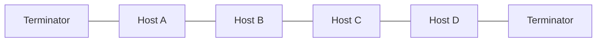
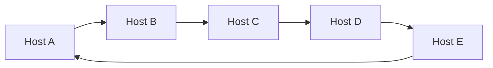
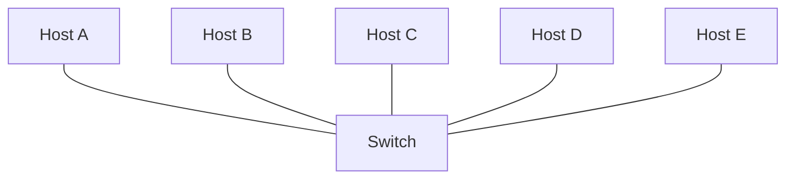
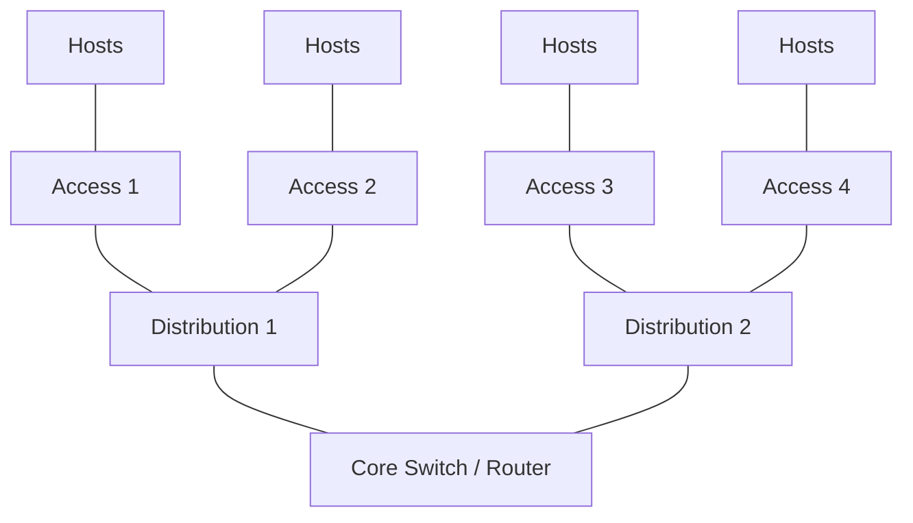
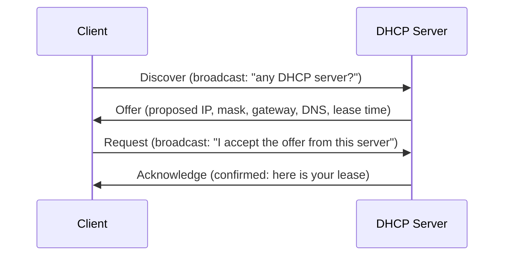
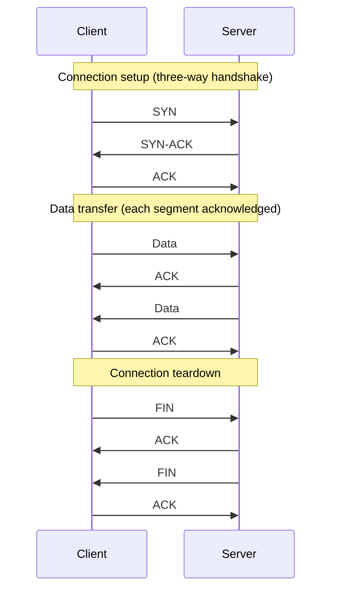
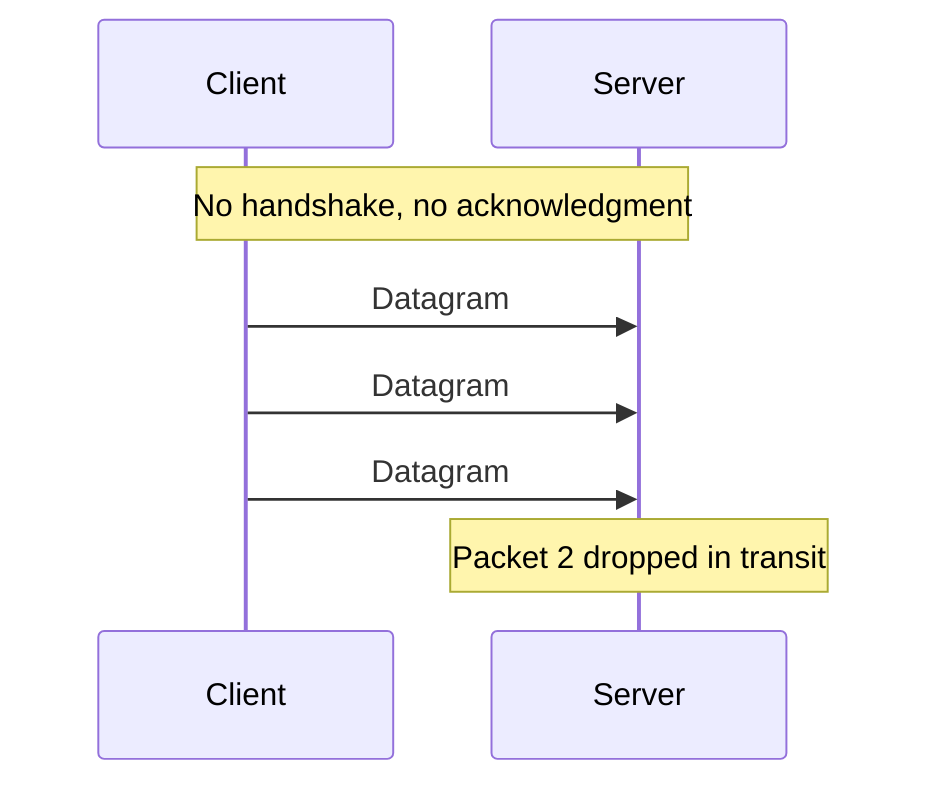

import { Aside } from '@astrojs/starlight/components';
import HistoricalNote from '/src/components/HistoricalNote.astro';

{/* ai-summary
type: lecture
slug: networking-fundamentals
order: 4
covers: OSI/TCP-IP layers; IP addressing and CIDR; DHCP and DNS; NAT, ARP, routing, and ports; TCP vs UDP; Linux IP config; diagnostic tools and bottom-up debugging
prereq_lectures:
followup_lectures: cloud-computing, container-orchestration, network-services-and-application-delivery, on-premises-infrastructure
paired_activities: network-detective
supports_labs: manual-web-server-deployment
*/}

Every server you provision, every container you deploy, and every cloud instance you launch depends on a network to be useful. A server that nobody can connect to, a web application that times out intermittently, a database that suddenly stops responding: these are networking problems, and they will land on your desk. You do not need to be a network engineer, but you do need enough understanding of how packets move, how addresses work, and where firewalls intervene to diagnose failures quickly and configure services correctly.

This lecture builds that understanding from the ground up. By the end you should be able to trace a packet from a shell prompt to the public internet and back, read a subnet mask, interpret a routing table, and use command-line tools to diagnose the most common connectivity failures. The concepts apply equally to a physical network wired with Ethernet and to a cloud Virtual Private Cloud (VPC), because the protocols and addressing rules are the same in both environments.

## Network Models: OSI and TCP/IP

Before you can troubleshoot a network, you need a shared vocabulary for where problems occur. Two layered models provide that vocabulary.

The **OSI (Open Systems Interconnection)** model divides networking into seven layers, from physical cabling at the bottom to user-facing applications at the top. Each layer has a specific job and communicates only with the layers directly above and below it. From bottom to top the layers are: Physical (layer 1, electrical signals on a wire or radio wave), Data Link (layer 2, MAC addresses and Ethernet frames), Network (layer 3, IP addresses and routing), Transport (layer 4, TCP and UDP connections), Session (layer 5, connection management), Presentation (layer 6, data encoding and encryption), and Application (layer 7, HTTP, DNS, SSH, and the protocols users interact with).

Each layer wraps the layer above it in its own named data unit. At layer 2, that unit is an **Ethernet frame**: an envelope containing a destination MAC address, a source MAC address, the layer 3 IP packet as its payload, and a checksum for error detection. At layer 3 the unit is a **packet**; at layer 4 it is a **segment** (TCP) or **datagram** (UDP). In pure layer-2 forwarding mode, a switch forwards frames based on MAC addresses and does not need to inspect layer-3 headers. A router opens the frame, reads the IP packet, makes a forwarding decision, and wraps the packet in a fresh frame addressed to the next hop. Knowing which unit a device works with tells you exactly what that device can and cannot inspect.

The **TCP/IP model** collapses these into four practical layers: Link (covering OSI layers 1 and 2), Internet (layer 3), Transport (layer 4), and Application (covering OSI layers 5 through 7). In daily work you will almost always think in TCP/IP terms, but the OSI numbering is useful because error messages, vendor documentation, and job interviews all reference "layer 2 issues" or "layer 7 firewalls" using the OSI numbers.

The table below maps the two models side by side and ties each layer to protocols and mechanisms you will encounter in practice.

| OSI Layer | OSI Name | TCP/IP Layer | Protocols and Examples |
|-----------|----------|--------------|------------------------|
| 7 | Application | Application | HTTP, HTTPS, DNS, SSH, SMTP, FTP |
| 6 | Presentation | Application | TLS/SSL encryption, gzip compression, UTF-8 encoding |
| 5 | Session | Application | TLS session negotiation, RPC, persistent SSH connections |
| 4 | Transport | Transport | TCP (reliable, ordered), UDP (low-latency, no guarantees) |
| 3 | Network | Internet | IPv4, IPv6, ICMP (used by `ping`) |
| 2 | Data Link | Link | Ethernet frames, ARP, Wi-Fi (802.11), VLANs |
| 1 | Physical | Link | Ethernet cables (Cat5e/Cat6), fiber optic, radio waves, NICs |

<Aside type="tip" title="Troubleshooting With Layers">
When something breaks, start at the bottom and work up. Can you see a link light on the switch port (layer 1)? Does the interface have an IP address (layer 3)? Can you ping the default gateway (layer 3)? Can you resolve DNS names (layer 7)? Can you reach the application port (layer 4)? This bottom-up approach prevents you from spending an hour debugging your web server configuration when the Ethernet cable is unplugged.
</Aside>

On a typical server, the layers map to concrete things. Layer 1 is the Ethernet cable (or the virtual network interface on a cloud instance). Layer 2 is the switch connecting devices within a subnet. Layer 3 is the router forwarding packets between subnets, using IP addresses to decide where each packet goes. Layer 4 is the TCP or UDP connections carrying HTTP, SSH, and database traffic. Layers 5 and 6 operate below the surface of the application: layer 5 manages the TLS session that keeps an HTTPS connection alive across multiple requests, and layer 6 handles the encryption and encoding that TLS provides (turning plaintext into ciphertext and back). Layer 7 is the application itself: the web server, the DNS resolver, or the database accepting connections. Every diagnostic step you take later in this lecture targets a specific layer.

## Network Topologies

A network topology describes the arrangement of nodes (devices) and the links between them, but the word "topology" carries two distinct meanings that are easy to conflate. The **physical topology** is the actual layout of cables and hardware: which ports connect to which devices, and how the wiring runs through a building or data center. The **logical topology** is how data flows through that infrastructure, which can differ substantially from what the wiring diagram shows.

The distinction matters because the same physical layout can produce very different logical behaviors depending on the central device. Consider a hub-based Ethernet network from the 1990s: every host had a cable running to a central box, so the physical topology was a star. But a hub is a simple electrical repeater that broadcasts every incoming signal out of every other port. Logically the network behaved exactly like a bus: all devices shared the same collision domain, only one could transmit at a time, and every host received every frame. A modern switched network has an identical physical star shape, but a switch learns which MAC address lives on which port and forwards each frame only to the intended destination. Logically, each link is now a dedicated point-to-point connection with no sharing. The physical layout did not change; the central device did, and that change transformed the logical topology entirely.

Wi-Fi illustrates the same principle from the other direction. Wireless devices connect to an access point in what looks like a physical star, but the radio channel is a shared medium: all devices in range compete for the same frequency, making the logical topology behave more like a bus than a star. 802.11 handles this with CSMA/CA (Carrier Sense Multiple Access with Collision Avoidance) rather than the CSMA/CD used by wired Ethernet, but the shared-medium problem is the same.

The table below describes the structural relationships of the main topology types. These descriptions apply primarily to physical topology; the logical behavior always depends on what the connecting hardware does with the traffic.

| Topology | Description | Trade-offs |
|----------|-------------|-----------|
| **Point-to-point** | Direct link between exactly two nodes | Simple; no sharing, but no redundancy |
| **Daisy chain (linear/ring)** | Nodes connected in a line or closed loop | Easy to extend; a single break disrupts a linear chain; ring configurations allow traffic to route around one failure |
| **Bus** | All nodes share a single cable segment | Inexpensive; only one device can transmit at a time, performance degrades as nodes are added |
| **Star** | All nodes connect to a central hub or switch | Easy to manage and isolate faults; if the central device fails, the entire network goes down |
| **Mesh** | Every node connects to every other node | Maximum redundancy; expensive and complex, used in military and critical infrastructure |
| **Tree (hierarchical)** | Star networks linked in multiple tiers, each tier connected by point-to-point switched links | Scalable and fault-tolerant at the branch level; failure of an upper-tier switch isolates everything below it |

The four topologies you will encounter most often are worth visualizing. **Bus** shows why shared-medium networks have inherent performance limits and where that design still lives today. **Ring** explains how token-passing protocols ensure orderly access, and why the ring never fully disappeared at the WAN level. **Star** is the physical baseline of every modern switched LAN. **Tree** is what real enterprise and campus networks actually look like.

### Bus

All devices attach to a single shared cable. Only one device can transmit at a time; if two transmit simultaneously, a collision occurs and both must retransmit. Early Ethernet standards used exactly this design: 10BASE5 ("thicknet") in the late 1970s and 10BASE2 ("thinnet") in the 1980s ran coaxial cable through offices with a T-connector at each workstation. Bus topology still appears in embedded and industrial contexts: the [CAN bus](https://en.wikipedia.org/wiki/CAN_bus) in every modern car is a shared two-wire bus where engine control units, ABS, and infotainment all compete for the same medium.



### Ring

Each device connects to exactly two neighbors, forming a closed loop. A frame travels around the ring until it reaches its destination. A single break can disrupt the entire ring unless dual-ring redundancy is implemented. IBM's [Token Ring](https://en.wikipedia.org/wiki/Token_Ring) (IEEE 802.5) used ring topology for corporate LANs through the 1980s and 1990s, passing a special "token" frame around the loop to prevent collisions. [FDDI (Fiber Distributed Data Interface)](https://en.wikipedia.org/wiki/FDDI) extended the same idea to fiber at 100 Mbps and added a counter-rotating backup ring for resilience. Rings did not disappear at the WAN level: [SONET/SDH](https://en.wikipedia.org/wiki/Synchronous_optical_networking) optical rings still form the backbone of many telephone and cable networks, and metro Ethernet rings give ISPs a way to route around a fiber cut without manual intervention.



### Star

Every device has a dedicated cable to a central switch. The switch forwards frames only to the intended port, so each link is logically point-to-point. This is the physical topology of every modern wired LAN.



### Tree (hierarchical)

Star networks are joined at multiple levels. Enterprise networks typically use a three-tier hierarchy: access switches connect end devices, distribution switches aggregate access switches, and a core layer connects distribution switches together and to the internet.



<HistoricalNote title="Why Textbooks Call It 'Star-Bus'">
Older networking textbooks label this topology "star-bus," and that label was historically accurate. In 1980s office networks, individual floor segments used coaxial bus cable (10BASE2 or 10BASE5), and those segments connected to a backbone that was also a coaxial bus. The result was a hierarchical arrangement where the "trunk" was literally a shared collision domain. Connecting more floors to the backbone degraded throughput for everyone because all traffic competed on the same wire. Modern hierarchical networks replaced every bus segment with point-to-point switched links: each access switch has a dedicated uplink to a distribution switch, and each distribution switch has a dedicated uplink to core. There are no shared collision domains anywhere. The shape is the same tree; the physics are entirely different.
</HistoricalNote>

Modern enterprise networks most commonly use this hierarchical tree topology. The Access / Distribution / Core model is covered in depth in the Network Configuration and Troubleshooting lecture.

## IP Addressing and Subnetting

Every device on an IP network needs a unique address. An **IPv4 address** is a 32-bit number written as four octets separated by dots, such as `192.168.1.10`. Alongside the address, a **subnet mask** defines which portion of the address identifies the network and which portion identifies individual hosts. The mask `255.255.255.0` means the first 24 bits are the network portion and the last 8 bits are for hosts, allowing up to 254 usable addresses (the first address is the network identifier and the last is the broadcast address). You will occasionally see the same mask written in hexadecimal: `0xffffff00`. Each pair of hex digits represents one octet (`ff` = 255, `00` = 0), so `0xffffff00` is exactly `255.255.255.0`. This notation appears in some BSD-derived tools (including macOS's `ifconfig` and `netstat -rn`) and in low-level network code; it conveys the same information as the dotted-decimal form, just in a format closer to how the CPU actually stores the mask.

**CIDR (Classless Inter-Domain Routing) notation** expresses the same idea more compactly: `192.168.1.0/24` means the first 24 bits are the network prefix. You will encounter CIDR notation everywhere, from AWS VPC definitions to Linux `ip addr` output.

Three ranges of IPv4 addresses are reserved for private use and will never appear on the public internet:

- `10.0.0.0/8` (16,777,214 usable hosts)
- `172.16.0.0/12` (1,048,574 usable hosts)
- `192.168.0.0/16` (65,534 usable hosts)

A small network might use `10.0.1.0/24`, giving 254 usable addresses, enough for workstations, servers, printers, and access points. In AWS, a VPC commonly uses `10.0.0.0/16` (65,534 addresses) and is then divided into smaller subnets across availability zones.

### Classful Addressing (Historical Context)

Before CIDR, IPv4 addresses were divided into fixed classes based on the value of the first octet. While classful addressing has been superseded by CIDR, you will still see the class labels in documentation and in descriptions of the private ranges:

| Class | Range | Default Mask | Usable Hosts |
|-------|-------|-------------|-------------|
| A | 1.0.0.0 - 126.255.255.255 | /8 (255.0.0.0) | 16,777,214 |
| B | 128.0.0.0 - 191.255.255.255 | /16 (255.255.0.0) | 65,534 |
| C | 192.0.0.0 - 223.255.255.255 | /24 (255.255.255.0) | 254 |

The "-2" for usable hosts accounts for the network address (first IP in the block) and the broadcast address (last IP), which cannot be assigned to devices. The `127.0.0.0/8` block is reserved for loopback.

### Subnetting in Practice

Suppose you want to separate workstations from servers for security reasons. You could split `10.0.1.0/24` into two `/25` subnets. A `/25` takes one bit from the host portion of a `/24`, cutting the address space in half. Each half gives you 128 addresses, of which 126 are usable (the first is the network address and the last is the broadcast address):

- `10.0.1.0/25` (hosts `10.0.1.1` through `10.0.1.126`) for workstations
- `10.0.1.128/25` (hosts `10.0.1.129` through `10.0.1.254`) for servers

A host at `10.0.1.10` (workstation subnet) and a host at `10.0.1.130` (server subnet) both appear to be "on the same /24," but the `/25` masks tell each host that addresses outside its own half are not local. Traffic from `10.0.1.10` to `10.0.1.130` does not go directly over the wire; it goes to the default gateway (the router), which looks up its routing table and forwards the packet to the server subnet. Without subnetting, both hosts would be in the same broadcast domain and could reach each other directly with no router in the path, which defeats the security goal.

This separation lets you apply different firewall rules to each subnet. Workstations might be allowed outbound internet access but blocked from reaching the database server directly, while the application server can reach the database but has no outbound internet access. The same principle applies in cloud environments: an AWS VPC is typically divided into public subnets (for resources that need direct internet access) and private subnets (for databases and internal services), with firewall rules controlling which traffic flows between them.

On a Linux machine, you can inspect your current address and subnet with:

```bash
ip addr show
```

The interface name varies by distribution and hardware. On bare-metal servers you will often see `enp3s0` (using [Predictable Network Interface Names](https://www.freedesktop.org/software/systemd/man/systemd.net-naming-scheme.html)), on older systems or virtual machines you may see `eth0`, and cloud instances often use `ens3` or similar. The `ip addr show` command with no arguments lists all interfaces, which is the safest starting point. The output will include lines like `inet 10.0.1.10/25 brd 10.0.1.127 scope global enp3s0`, showing the address, prefix length, and broadcast address for that interface.

<Aside type="note" title="IPv6 in Brief">
IPv6 uses 128-bit addresses written in hexadecimal groups called 16-bit groups (sometimes informally referred to as hextets: 8 groups of 16 bits each), for example `0123:4567:89ab:cdef:0123:4567:89ab:cdef`. The `/64` prefix is conventional for subnets. With 2¹²⁸ possible addresses, IPv6 was designed to solve IPv4 address exhaustion. While IPv6 adoption continues to grow, most internal networks and cloud VPCs still rely on IPv4 with NAT for internet access. The subnetting and routing concepts you learn here apply to both protocols.
</Aside>

## Core Network Services

Four services make a network usable in practice. Without them, every user would need to manually configure their IP address, memorize server addresses by number, have no way to reach the public internet from a private network, and have no way to verify that the server they are talking to is actually who it claims to be.

### DHCP (Dynamic Host Configuration Protocol)

When a device plugs into a network or connects to Wi-Fi, **DHCP** automatically assigns an IP address, subnet mask, default gateway, and DNS server addresses. The process works in four steps called DORA: the client broadcasts a Discover to find any available DHCP server, the server responds with an Offer proposing a specific address, the client broadcasts a Request to accept the offer (broadcast rather than unicast, so other DHCP servers know the offer was accepted), and the server sends an Acknowledgment confirming the lease. Each address comes with a lease time; when the lease expires, the client must renew it.



For example, a DHCP server on a network using `10.0.1.0/24` might hand out addresses from `10.0.1.10` through `10.0.1.200`, with the default gateway set to `10.0.1.1` and DNS pointed to a known resolver. The DHCP server itself often runs on the router or on a dedicated Linux server. Servers and other infrastructure typically use either **static addresses** or **DHCP reservations** (a DHCP configuration that always assigns the same address to a specific device's MAC address) so their addresses remain stable; clients and other services depend on those addresses being predictable.

You can inspect your current DHCP lease on a Linux system. Note that the interface name varies: you may see `eth0`, `enp3s0`, `ens3`, or something else depending on your hardware and distribution. Use `ip addr show` with no arguments to list all interfaces first, then query the specific one:

```bash
# List all interfaces to find the correct name
ip addr show

# Show addresses on a specific interface (substitute your actual interface name)
ip addr show enp3s0

# Release and renew a DHCP lease (requires dhclient; substitute your interface name)
sudo dhclient -r enp3s0
sudo dhclient enp3s0
```

### DNS (Domain Name System)

**DNS** translates human-readable names like `wiki.example.com` into IP addresses like `93.184.216.34`. Without DNS, users would need to type IP addresses into their browsers and every configuration file would break whenever a server moved to a new address. DNS is hierarchical: a local DNS server knows about internal names and forwards everything else to an upstream resolver (such as Google's `8.8.8.8` or Cloudflare's `1.1.1.1`), which in turn queries the global DNS infrastructure.

The most common record types are **A records** (mapping a name to an IPv4 address), **AAAA records** (mapping to IPv6), **CNAME records** (aliases pointing one name to another), and **MX records** (mail routing). Two others appear less often but are important to recognize. **PTR records** are the reverse of A records: given an IP address, they return a hostname. Reverse DNS lookups use PTR records and are published by whoever owns the IP block, typically the ISP. You will see them (or their absence) when troubleshooting email deliverability or tracing where an IP address belongs. **SOA (Start of Authority) records** mark the beginning of a DNS zone and contain administrative metadata: the primary nameserver, a contact email, and parameters controlling how long secondary nameservers cache zone data. When a DNS query returns `NXDOMAIN` (the response code meaning "this name does not exist in the queried zone"), the SOA record in the authority section still reveals which organization controls that zone. When a DNS lookup fails, the symptom is usually "the internet is down" even though the network is perfectly functional; the user simply cannot resolve names to addresses.

**DNS operates over two different protocols.** DNS queries and regular lookups use UDP port 53 because the small request and response packets do not need TCP's reliability guarantees. Zone transfers (called AXFR transfers) use TCP port 53 to ensure large data transfers are reliable. A zone transfer replicates all records from an authoritative nameserver to a secondary nameserver, ensuring that multiple nameservers hold identical copies of the zone data. This is how DNS is made redundant: when the primary nameserver goes down, secondary nameservers can still answer queries for that domain. In practice, DNS queries over UDP are by far more common; TCP is used only for zone transfers between nameservers and for unusually large responses that would exceed UDP's 512-byte limit.

You can query DNS from the command line:

```bash
# Look up the A record for a hostname
dig example.com

# Shorter output showing just the answer
dig +short example.com

# Use nslookup for a quick interactive check
nslookup example.com
```

<Aside type="tip" title="It's Always DNS">
When something is inexplicably broken on a network, DNS is the most frequent culprit. The failure mode is insidious: the network connection itself is fine, TCP is working, but nothing resolves, so the user reports "the internet is down." Even infrastructure outages at major platforms often trace back to DNS: the <a href="https://blog.cloudflare.com/october-2021-facebook-outage/" target="_blank" rel="noopener noreferrer">2021 Facebook/Instagram/WhatsApp outage</a> was caused by a BGP withdrawal that made their authoritative DNS servers unreachable worldwide; the <a href="https://aws.amazon.com/message/101925/" target="_blank" rel="noopener noreferrer">2021 AWS DynamoDB outage</a> was triggered by the accidental deletion of internal DNS metadata, which prevented DynamoDB from forming a quorum and took the service down across us-east-1 for hours. When debugging connectivity, check DNS early: `dig +short example.com` is often the first command that explains what is actually happening.
</Aside>

<HistoricalNote title="DNS Was Designed to Replace a Text File (1983)">
Before DNS, every computer on ARPANET maintained a flat file called HOSTS.TXT, downloaded periodically from a server at SRI International in California. By 1983 the file was being updated multiple times per week, and propagating changes across the network took days. Paul Mockapetris, a researcher at USC/Information Sciences Institute, was asked to design a replacement. His key insight was delegation: instead of one authoritative list, authority for each domain could be handed off to whoever owned it. He designed the system over about 18 months and wrote the first implementation in 1984. The .com, .net, .org, .gov, .edu, and .mil top-level domains were added in 1985. The entire architecture (recursive resolvers, zone files, authoritative nameservers) has remained structurally stable for decades. Today DNS operates at enormous global scale on an architecture Mockapetris designed to replace a 10,000-line text file.
</HistoricalNote>

### NAT (Network Address Translation)

Private addresses (like those in the `10.0.0.0/8` range) are not routable on the public internet. **NAT** solves this by having the router rewrite the source address of outgoing packets from the private address (e.g., `10.0.1.10`) to the router's public address (e.g., `203.0.113.5`). When replies come back, the router reverses the translation and forwards the packet to the correct internal host. This is how dozens or hundreds of devices share a single public IP address for internet access.

NAT is so fundamental that every home router performs it transparently. When you connect to Wi-Fi at home and browse the web, your laptop's private address is being translated to your ISP-assigned public address by your router. In a cloud environment like AWS, a **NAT Gateway** serves the same function: instances in a private subnet that need to download updates or call external APIs route their outbound traffic through a NAT Gateway, which rewrites their private addresses to a public Elastic IP.

There are three common NAT variants:

- **PAT (Port Address Translation) / Overload**: The most common form. A single public IP address is used for all outbound connections, differentiated by port number. The router maintains a table mapping each private `address:port` pair to the corresponding public `address:port`. This is how home and small-office routers work.
- **Dynamic NAT**: The organization purchases a pool of public IP addresses. Each private host is assigned the first available public address from the pool (rather than always sharing one). Less common because PAT is more efficient.
- **Static NAT**: A one-to-one permanent mapping between a specific private address and a specific public address. Used for servers that must be consistently reachable from the internet under the same public IP.

<Aside type="caution" title="When NAT Breaks Things">
NAT works well for outbound connections, but it complicates inbound connections. If you need an external user to reach a server behind NAT, you must configure **port forwarding** (also called DNAT) on the router to send incoming traffic on a specific port to the correct internal server. A common example is exposing SSH on a non-standard external port that the router maps to port 22 on an internal host. In cloud environments, you would instead place the server in a public subnet with a public IP, or use a load balancer.
</Aside>

#### NAT Traversal

Peer-to-peer and real-time applications (VoIP, video conferencing, online gaming) need to establish direct connections between two hosts that are both behind NAT. Several techniques exist:

- **UPnP (Universal Plug and Play)**: Allows a device to automatically create a port mapping on the router, so external hosts can initiate connections.
- **STUN (Session Traversal Utilities for NAT)**: A client queries a public STUN server to discover its public IP address and the type of NAT it is behind, then uses that information to negotiate direct connections.
- **TURN (Traversal Using Relays around NAT)**: A fallback when direct connection fails; a public relay server forwards traffic between the two peers.
- **ICE (Interactive Connectivity Establishment)**: A framework (used by WebRTC, Zoom, etc.) that systematically tries direct, STUN, and TURN paths to find the best available route.

### TLS (Transport Layer Security)

DNS tells you where to connect. NAT gets you there. But neither answers a more fundamental question: how do you know the server you just connected to is actually the server you intended to reach, and not an attacker who intercepted your traffic? This is the problem **TLS (Transport Layer Security)** solves.

TLS operates at layers 5 and 6 of the OSI model. It does two things simultaneously: it encrypts the connection so that anyone observing the network sees only ciphertext, and it authenticates the server's identity using a **certificate**. A certificate is a signed document containing the server's public key, the domain name(s) it is valid for, a validity window, and a digital signature from a **Certificate Authority (CA)**. The CA is a trusted third party whose job is to verify that the entity requesting a certificate actually controls the domain before signing it. Root CA certificates are pre-installed in every operating system and browser, forming the foundation of what is called the [public key infrastructure (PKI)](https://en.wikipedia.org/wiki/Public_key_infrastructure).

When a client connects to `https://example.com`, the TLS handshake runs before any application data is sent. The server presents its certificate, the client verifies the signature chain up to a trusted root CA, checks that the certificate covers `example.com`, and confirms the certificate has not expired. If any check fails, the connection is aborted. If all checks pass, the two sides execute a key exchange algorithm (typically Diffie-Hellman or ECDH) using the server's public key to establish a shared secret, which becomes the symmetric encryption key for the session. All subsequent traffic is encrypted with that key.

Certificates are organized in a **chain of trust**. A server's leaf certificate is signed by an intermediate CA, which is signed by a root CA. Browsers and operating systems only trust root CAs directly; intermediate CAs derive their authority from the root. A common failure mode is a server that presents its own certificate but omits the intermediate CA certificate from the chain. The client cannot verify the chain and rejects the connection, even though the leaf certificate is perfectly valid.

```bash
# Inspect a TLS handshake and the full certificate chain
openssl s_client -connect example.com:443

# The output includes:
#   Certificate chain (leaf + intermediates)
#   subject: the hostname the certificate was issued for
#   notBefore / notAfter: validity window
#   Verify return code: 0 (ok)  <- this line at the end confirms the chain validated
```

A non-zero verify return code identifies the specific failure: `10` means the certificate has expired, `20` means a certificate in the chain could not be found (missing intermediate), `62` means the hostname does not match. The Network Configuration and Troubleshooting lecture covers TLS in operational depth: how to obtain and renew certificates automatically with Let's Encrypt, how to set up an internal CA for private services, how to configure TLS termination in a reverse proxy, and what to do when certificates expire in production.

## Routing Basics

A **router** connects two or more networks and forwards packets between them. Every host on a network has a **default gateway**, the router address to which it sends any packet whose destination is not on the local subnet. For example, a workstation at `10.0.1.10/25` with a default gateway of `10.0.1.1` will send all non-local traffic to that gateway. If the workstation tries to reach `10.0.1.130` (which falls outside the `/25` subnet), the packet goes to the gateway first, and the router forwards it to the correct subnet.

The router makes forwarding decisions based on its **routing table**, a list of destination networks and the next-hop address or interface to use for each. You can inspect the routing table on a Linux machine:

```bash
# Show the routing table
ip route show
```

Typical output on a workstation might look like:

```
default via 10.0.1.1 dev eth0
10.0.1.0/25 dev eth0 proto kernel scope link src 10.0.1.10
```

The first line says "for any destination not otherwise listed, send the packet to `10.0.1.1` via this machine's primary interface." The second line says "for destinations in `10.0.1.0/25`, deliver directly on that interface because we are on that subnet." The interface name shown (such as `eth0` or `enp3s0`) will vary by system.

On a router connecting two subnets to the internet, the routing table is more complex. It has entries for both internal subnets plus a default route pointing to the ISP's gateway:

```bash
# On the router
ip route show
# default via 203.0.113.1 dev wan0
# 10.0.1.0/25 dev eth0 proto kernel scope link src 10.0.1.1
# 10.0.1.128/25 dev eth1 proto kernel scope link src 10.0.1.129
```

You can also add static routes manually when needed:

```bash
# Add a route to a remote network via a specific gateway
sudo ip route add 10.0.2.0/24 via 10.0.1.1 dev eth0
```

<Aside type="note" title="Routes in the Cloud">
Cloud VPCs use the same routing concepts. AWS route tables, for example, contain entries like "send `0.0.0.0/0` to the internet gateway" or "send `10.0.0.0/16` to local." The syntax differs, but the logic is identical to what `ip route show` displays on a Linux box.
</Aside>

## Core Network Devices

Understanding the physical (or virtual) devices on a network helps you reason about where packets go and where problems can occur.

A **switch** operates at layer 2 and connects devices within a single network segment. It learns which MAC addresses live on which ports and forwards Ethernet frames only to the correct port, rather than broadcasting everything.

Switches come in two broad categories:

- **Unmanaged switches** require no configuration; you plug them in and they start forwarding traffic immediately. They support only simple topologies and have no remote management, VLAN, or QoS capabilities. Use them where simplicity matters and advanced features are not needed.
- **Managed switches** add remote management, software-defined networking support, Quality of Service (QoS) to prioritize traffic (e.g., VoIP over bulk transfers), security features (port security, 802.1X authentication, ARP inspection), and VLAN configuration. They are standard in any environment requiring segmentation or centralized control.

Managed switches can also create **VLANs** (Virtual LANs), logically separating traffic on the same physical switch into distinct broadcast domains, which is another way to segment workstation and server traffic without needing separate physical switches.

A **router** operates at layer 3 and forwards packets between different subnets or networks based on IP addresses. A typical small network router connects the internal subnets to the ISP uplink, runs DHCP, performs NAT, and maintains the routing table.

A **firewall** inspects traffic and enforces security policies. It can operate at multiple layers: a simple firewall might block or allow traffic based on IP addresses and port numbers (layers 3 and 4), while an advanced firewall might inspect HTTP headers or application content (layer 7). Most routers include basic firewall functionality, blocking inbound connections from the internet by default and only allowing specific traffic through.

In cloud environments, **security groups** act as virtual firewalls associated with virtual network interfaces and commonly managed at the instance level. A security group rule like "allow TCP port 443 from `0.0.0.0/0`" is equivalent to a firewall rule permitting HTTPS traffic from any source. One important difference from some traditional packet filters is that security groups are stateful: if you allow an outbound connection, the return traffic is automatically permitted.

## Address Resolution Protocol (ARP)

IP addresses are layer-3 identifiers used for routing between networks. But within a single IPv4 subnet, devices communicate at layer 2 using **MAC addresses**. **ARP** (Address Resolution Protocol) bridges the gap: when a host needs to send a packet to an IP address on the same subnet and does not already know that address's MAC address, it broadcasts "who has `10.0.1.10`?" across the local network, and the device with that IP replies with its MAC.

Each host caches these mappings in an **ARP table** to avoid repeating the broadcast for every packet. On Linux you can inspect it directly:

```bash
# Show the ARP / neighbor cache
ip neighbor show

# A healthy entry (the gateway is reachable at layer 2):
# 10.0.1.1 dev eth0 lladdr aa:bb:cc:dd:ee:ff REACHABLE

# A failed entry (wrong VLAN, bad cable, or host is down):
# 10.0.1.1 dev eth0  FAILED
```

A `FAILED` entry for your default gateway means your machine cannot reach the gateway at layer 2, even if the IP configuration looks correct. This is a reliable indicator of a layer-2 problem: wrong VLAN assignment, a bad cable, or the gateway being down.

ARP only operates within a single broadcast domain and applies to IPv4. When traffic crosses a router, the router resolves the *next hop's* MAC using its own ARP cache. The original source MAC is never forwarded beyond the local segment, which is why IP routing and MAC addressing are separate concerns. IPv6 uses Neighbor Discovery Protocol (NDP) instead of ARP.

## Ports and Protocols

The transport layer (layer 4 in the OSI model, and the transport layer in the TCP/IP model) distinguishes between different services running on the same host using **port numbers**. An IP address gets a packet to the right machine; a port number gets it to the right application on that machine.

**TCP (Transmission Control Protocol)** provides reliable, ordered delivery. It establishes a connection with a three-way handshake (SYN, SYN-ACK, ACK), retransmits lost packets, and guarantees that data arrives in order. HTTP, SSH, and database protocols typically use TCP because they need reliability. After the handshake, the connection is bidirectional: both sides send and receive, and every segment is acknowledged. Closing a connection is typically shown as a four-message exchange (FIN, ACK, FIN, ACK), though some stacks may combine or optimize packets.



**UDP (User Datagram Protocol)** is simpler and faster but provides no delivery guarantees. DNS queries, DHCP, video streaming, and VoIP use UDP because speed matters more than perfect delivery, or because the application handles retransmission itself. There is no handshake and no acknowledgment: the sender fires a datagram and moves on. If the datagram is lost, UDP does not know and does not care.



Common service ports are standardized or conventionally assigned. Well-known ports occupy 0 through 1023, while many widely used application ports live in the registered range above 1023. The ones you will encounter most often as a system administrator include:

| Port | Protocol | Service |
|------|----------|---------|
| 22   | TCP      | SSH     |
| 53   | TCP/UDP  | DNS     |
| 80   | TCP      | HTTP    |
| 443  | TCP      | HTTPS   |
| 67/68| UDP      | DHCP    |
| 25   | TCP      | SMTP    |
| 3306 | TCP      | MySQL   |
| 5432 | TCP      | PostgreSQL |

You can inspect which ports are open and listening on a Linux system using the `ss` command:

```bash
# Show all listening TCP sockets with process names
sudo ss -tlnp

# Show all listening UDP sockets
sudo ss -ulnp

# Show all established connections
ss -tn
```

The flags break down as follows: `-t` for TCP, `-u` for UDP, `-l` for listening sockets only, `-n` for numeric output (no DNS resolution), and `-p` to show the process using each socket. Typical output looks like:

```
State   Recv-Q  Send-Q  Local Address:Port  Peer Address:Port  Process
LISTEN  0       128     0.0.0.0:22          0.0.0.0:*          users:(("sshd",pid=1234,fd=3))
LISTEN  0       511     0.0.0.0:80          0.0.0.0:*          users:(("nginx",pid=5678,fd=6))
```

This tells you that SSH is listening on port 22 on all interfaces and Nginx is listening on port 80. If a service is not listening when you expect it to be, you have found your problem before ever looking at the network.

<Aside type="tip" title="Firewalls and Ports">
A common troubleshooting pattern: the application is running and the port is listening (confirmed with `ss`), but external clients cannot connect. The next thing to check is the firewall. On a Linux host, `sudo iptables -L -n` or `sudo nft list ruleset` shows the local firewall rules. In a cloud environment, check the security group and network ACL attached to the instance.
</Aside>

## Configuring IP Addresses on Linux

Linux provides several different tools and frameworks for network configuration, and which one applies depends on the distribution:

- **Netplan** (modern Ubuntu): Configuration lives in `/etc/netplan/` as YAML and is rendered to backends such as NetworkManager or `systemd-networkd`.
- **ifupdown** (older Debian-based systems and some minimal installs): Configuration lives in `/etc/network/interfaces`. Simple and declarative, but less common on current Ubuntu releases.
- **NetworkManager** (common on AlmaLinux, Fedora, and RHEL): A daemon that manages connections dynamically. Configured via the `nmcli` command-line utility or `nmtui` text UI.
- **systemd-networkd**: Increasingly used on server distributions; configuration files live in `/etc/systemd/network/`.

The `ip` command (part of iproute2) is the current standard for viewing and modifying network state:

```bash
# Show all interfaces and their addresses
ip addr show

# Show the routing table
ip route show

# Add an address temporarily (does not persist across reboots)
sudo ip addr add 10.0.1.50/24 dev eth0

# Set default gateway temporarily
sudo ip route add default via 10.0.1.1
```

<Aside type="caution" title="Temporary vs. Persistent Configuration">
Changes made with `ip addr` and `ip route` commands are not persistent. They disappear on reboot. Always apply permanent configuration through your distribution's network management tool. On Ubuntu, that is Netplan: edit or create a file in `/etc/netplan/` and apply with `sudo netplan apply`. A static address configuration looks like:

```yaml
network:
  version: 2
  ethernets:
    enp3s0:
      addresses:
        - 10.0.1.50/24
      routes:
        - to: default
          via: 10.0.1.1
      nameservers:
        addresses: [8.8.8.8, 1.1.1.1]
```

On AlmaLinux and RHEL, NetworkManager manages connections; `nmcli con mod` edits a named connection and `nmcli con up` activates it. The older `ifconfig` and `route` commands are deprecated everywhere; use `ip` for inspection and your distro's configuration tool for anything that must survive a reboot.
</Aside>

## Enterprise Networks

Enterprise networks add requirements beyond what a small office needs: fiber backbone links, **Link Aggregation (LAG)** to bond multiple physical cables into one logical interface for throughput and redundancy, large delegated address blocks (a university might own an entire `/16`, giving it 65,534 addresses to delegate to departments), and dynamic routing protocols like OSPF and BGP that can automatically reroute traffic around failures. Designing and operating networks at this scale, including multi-location connectivity, cloud integration, and advanced firewall architectures, will be discussed later.

## Practical Diagnostic Tools

When something goes wrong, the following tools let you systematically isolate the problem layer by layer.

### ping: Testing Basic Connectivity

Before using `ping`, it helps to know what it is actually sending. **ICMP (Internet Control Message Protocol)** is a layer 3 protocol that IP networks use for diagnostic and control messages. It has no port numbers and carries no application data. When a router receives a packet with a TTL that has expired, it sends an ICMP "time exceeded" message back to the sender. When a destination is unreachable, a router sends an ICMP "destination unreachable" message. `ping` specifically uses ICMP's "echo request" and "echo reply" message types to test whether a host is alive and reachable.

`ping` sends ICMP echo requests to a target and reports whether replies come back and how long they take. It is your first tool for testing layer 3 connectivity. The `-c 4` flag sends exactly four packets and then stops; without it, `ping` runs until you interrupt it with `Ctrl+C`.

```bash
# Can I reach the default gateway?
ping -c 4 10.0.1.1

# Can I reach a public IP (bypassing DNS)?
ping -c 4 8.8.8.8

# Can I resolve and reach a public hostname?
ping -c 4 google.com
```

If the first command fails, you have a local network or routing problem. If the second succeeds but the third fails, DNS is broken. If all three commands succeed, your basic connectivity is fine and the problem is likely at the application layer.

One important caveat: many networks and cloud providers block ICMP at their firewalls. A host that does not respond to `ping` is not necessarily down; it may simply be configured to silently drop echo requests. This is why `ping` is a useful first check but not a definitive one.

### traceroute: Finding Where Packets Stop

`traceroute` reveals the path packets take to a destination by exploiting the IP TTL (Time To Live) field. It works by sending a series of probes with progressively increasing TTLs: the first probe is sent with TTL=1, causing the first router to decrement it to zero, drop the packet, and send back an ICMP "time exceeded" message (revealing the first hop). The second probe is sent with TTL=2, so the first router forwards it and the second router drops it and sends an ICMP reply (revealing the second hop). This pattern continues until the probe reaches the destination. The round-trip times from each ICMP response let you see both the path and the latency at each hop.

```bash
# Trace the route to a public server (sends UDP probes by default on Linux)
traceroute 8.8.8.8

# Use ICMP echo requests instead of UDP (similar to ping)
sudo traceroute -I 8.8.8.8

# Use TCP-based traceroute on a specific port (useful when ICMP is blocked)
sudo traceroute -T -p 443 example.com
```

Typical output looks like:

```
 1  10.0.1.1 (10.0.1.1)       1.2 ms  1.1 ms  1.3 ms
 2  * * *
 3  203.0.113.1 (203.0.113.1) 8.4 ms  8.2 ms  8.5 ms
 4  8.8.8.8 (8.8.8.8)        14.1 ms 14.0 ms 14.2 ms
```

The `* * *` at hop 2 is common and usually benign. It means that router received the TTL-expired packet but is configured not to send ICMP time exceeded replies back, a typical policy at ISP edge routers and cloud providers to limit information disclosure. It does not mean the router dropped your traffic: packet 3 reached hop 3, so hop 2 clearly forwarded it. A string of `* * *` entries that continues to the end may mean traffic stopped there, but it can also mean traceroute probes or ICMP replies are being filtered while the destination remains reachable over other protocols.

The protocol `traceroute` uses matters operationally. The default on Linux (`traceroute` without flags) sends UDP probes to high-numbered ports. An ICMP-based trace (`-I`) behaves similarly to `ping` and is blocked wherever ICMP is blocked. A TCP-based trace (`-T -p 443`) sends SYN packets to port 443 and is more likely to traverse firewalls that permit HTTPS traffic. You may find that `curl https://example.com` succeeds while `traceroute example.com` never completes: the curl traffic reaches its destination over port 443 with a valid TCP handshake, while the UDP or ICMP probes that traceroute uses are being filtered at a firewall somewhere along the path. The two tools are not interchangeable; they test different things, and a firewall that permits one may silently block the other.

### dig and nslookup: DNS Troubleshooting

These tools query DNS servers directly and show you exactly what the resolver returns:

```bash
# Full DNS query with all sections
dig example.com

# Query a specific DNS server (e.g., Google's public resolver)
dig @8.8.8.8 example.com

# Reverse DNS lookup (find the hostname for an IP)
dig -x 93.184.216.34

# Quick lookup with nslookup
nslookup example.com 8.8.8.8
```

The `dig` output includes the answer section (the actual records), the authority section (which name server is responsible), and timing information. If `dig @8.8.8.8` returns the correct answer but `dig` alone does not, the machine is probably configured to use a different DNS server that has stale or incorrect data.

### curl: Testing Application-Layer Connectivity

`curl` makes HTTP (and many other protocol) requests from the command line. It is invaluable for testing whether a web service is actually responding:

```bash
# Test if the web server responds (fetch headers only)
curl -I https://example.com

# Test with verbose output to see TLS and header details
curl -v https://example.com

# Test a server by IP when DNS is suspect (-k ignores certificate-name mismatch)
curl -kI https://93.184.216.34

# Follow redirects and show timing
curl -o /dev/null -s -w "HTTP %{http_code} in %{time_total}s\n" https://example.com
```

The `-I` flag fetches only headers, which is useful for a quick check without downloading the entire page. The `-v` flag shows the TLS handshake and request/response headers, which helps diagnose certificate problems and redirect loops. When you need to go deeper than `curl -v`, `openssl s_client` connects to a host and performs the TLS handshake while printing every detail: the certificate chain, the negotiated cipher suite, the protocol version, and whether the certificate validates correctly.

```bash
# Connect to a host and inspect the TLS handshake and certificate
# Note: this command opens an interactive session; exit with Ctrl+C or by typing 'quit'
openssl s_client -connect example.com:443

# Show only the certificate (no session noise)
openssl s_client -connect example.com:443 2>/dev/null | openssl x509 -noout -text
```

`openssl s_client` succeeding means the TLS session established. To confirm trust, check the certificate verification result in the output (for example, `Verify return code: 0 (ok)`) and validate hostname expectations. If the check fails, the error output helps identify the specific problem: an expired certificate, a hostname mismatch, a missing intermediate CA, or a cipher suite incompatibility. `curl -v` surfaces the same failures as errors, but `openssl s_client` gives you the raw handshake details needed to understand why.

### nmap: Scanning Ports from the Outside

`nmap` (Network Mapper) probes a host from the network to discover which ports are accepting connections and what software is answering them. Unlike `ss`, which requires shell access to the target, `nmap` runs from any machine and shows you exactly what an outside client would see. This makes it the right tool for verifying that a service is reachable through any firewalls between you and the server.

```bash
# Check whether a specific port is open and identify the service version
nmap -sV -Pn -p T:22 10.0.1.10

# Scan a range of ports
nmap -sV -Pn -p T:1-1024 10.0.1.10

# Check a non-standard application port (e.g., a Minecraft server)
nmap -sV -Pn -p T:25565 <public-ip>
```

Flags: `-sV` probes open ports to determine service version; `-Pn` skips host-discovery pings (assumes the host is up, useful when ICMP is blocked by a firewall); `-p T:` specifies TCP ports to scan.

Typical output:

```
PORT      STATE     SERVICE   VERSION
25565/tcp open      minecraft Minecraft 1.21 (Protocol: 764)
22/tcp    open      ssh       OpenSSH 9.6 (Ubuntu)
80/tcp    filtered  http
```

Three possible states, and the distinction between them matters operationally. `open` means a TCP SYN received a SYN-ACK in response: something is listening and accepting connections. `closed` means a TCP SYN received a RST in response: the host is reachable and responded, but nothing is listening on that port. This is the correct behavior for an unused port on a live server. `filtered` means no response arrived at all after multiple retries: a firewall is silently dropping the packets. From the connecting client's perspective, a `filtered` port produces a connection that hangs until it times out, which is a different and usually worse experience than an immediate "connection refused" (which is what `closed` produces). If you see `filtered`, the question is not whether a service is running but whether a firewall is in the path and blocking the port.

<Aside type="tip" title="Authorized Use Only">
`nmap` is a standard tool for testing your own infrastructure. Running it against machines you own or have explicit written authorization to test is normal practice. Running it against systems you do not own may violate computer access laws.
</Aside>

### tcpdump: Reading Packets on the Wire

When higher-level tools do not reveal the problem, packet capture lets you see exactly what is happening on the wire. The `tcpdump` utility is available on virtually every Linux system and reads frames directly from a network interface, optionally filtered by host, port, or protocol.

```bash
# Capture traffic to or from a specific host
sudo tcpdump -i eth0 host 10.0.1.50

# Capture only DNS traffic
sudo tcpdump -i eth0 port 53

# Write capture to a file for later analysis in Wireshark
sudo tcpdump -i eth0 -w /tmp/capture.pcap
```

Reading `tcpdump` output requires understanding the common TCP flags. `[S]` starts a connection, `[S.]` accepts and acknowledges it, `[.]` is a plain acknowledgment, `[P.]` means data is being pushed, `[R]` resets the connection immediately, and `[F.]` begins a graceful finish. A connection that never completes its handshake shows up as repeated `[S]` packets with no matching `[S.]` reply, which is a strong signal that something between the two hosts is dropping or rejecting the traffic.

<Aside type="tip" title="Always Filter on Production Servers">
When capturing on a busy server, always use filters to limit the output. Capturing all traffic on a production server can generate enormous amounts of data and may itself cause performance problems.
</Aside>

## A Systematic Diagnostic Workflow

When a user reports "the website is down," the most effective approach is to work through the OSI layers from the bottom up. Each tool targets a specific layer, and the first step that fails tells you exactly where to focus. This prevents the common mistake of debugging the application when the problem is actually a misconfigured cable, or blaming the firewall when DNS is the actual failure.

| Step | Command | OSI Layer | What it tests |
|------|---------|-----------|---------------|
| 1 | `ip link show` | Layer 1 (Physical) | Is the interface up? A `DOWN` state means no link or an administratively disabled interface. |
| 2 | `ip neigh show` | Layer 2 (Data Link) | Does ARP resolve the gateway's MAC? `FAILED` means a layer-2 problem. |
| 3 | `ping <default-gateway>` | Layer 3 (Network) | Local routing: can you reach the gateway over IP? |
| 4 | `ping <server-ip>` | Layer 3 (Network) | End-to-end IP reachability, bypassing DNS. |
| 5 | `sudo ss -tlnp` (on the server) | Layer 4 (Transport) | Is the process listening on the correct port? |
| 6 | `nmap -sV -Pn -p T:443 <public-ip>` (from outside) | Layer 4 (Transport) | Is the port reachable through any firewalls? |
| 7 | `openssl s_client -connect <host>:443` | Layers 5–6 (Session/Presentation) | Does TLS negotiate successfully? Is the certificate valid? |
| 8 | `dig <hostname>` | Layer 7 (Application) | Does the name resolve to the correct address? |
| 9 | `curl -I https://<hostname>` | Layer 7 (Application) | Does the web service respond with a valid HTTP status? |

## Takeaways

Networking can feel abstract until you connect the pieces. Consider what happens when you SSH into an EC2 instance to manage a server. Your laptop uses DHCP to get an IP address and default gateway from the local network. It sends a DNS query over UDP port 53 to resolve the instance's hostname (or you use the public IP directly). Your OS constructs a TCP packet destined for port 22, consults the routing table, and sends it to the default gateway. Your home router performs NAT, rewriting the source address to your public IP. The packet traverses multiple ISP routers (each visible as a hop in `traceroute`) until it reaches AWS's network. The VPC's route table directs it to the correct subnet. The security group checks whether inbound TCP port 22 is allowed from your IP. The instance's network interface receives the packet, and `sshd` (listening on port 22, as confirmed by `ss -tlnp`) accepts the connection.

If any step in that chain fails, you have a specific layer to investigate: `ip link show` reporting `DOWN` (layer 1), no IP address from DHCP (layer 3), DNS timeout (layer 7), a firewall blocking the port (layer 4), or `sshd` not running (application). Understanding this chain, and knowing which tool to use at each step, is the core skill that separates confident troubleshooting from guesswork.

These concepts extend directly into the container and cloud work ahead. When you run a Docker container and map a host port to a container port, you are configuring a form of DNAT. When Docker creates a virtual bridge network for your containers, each container gets its own IP address from a private range, and traffic between containers and the outside world flows through NAT. The address ranges are private, the protocols are TCP and UDP, the routing happens in the kernel, and the diagnostic tools are the same `ip`, `ss`, `dig`, and `curl` you already know. Networking is one of the few layers that stays conceptually constant as you move from physical hardware to virtual machines to containers to cloud infrastructure.

## Resources

- <a href="https://www.youtube.com/watch?v=xj_GjnD4uyI" target="_blank" rel="noopener noreferrer">Every Networking Concept Explained In 20 Minutes (TechWorld with Nana) (YouTube)</a>
- <a href="https://www.youtube.com/watch?v=3QhU9jd03a0" target="_blank" rel="noopener noreferrer">Crash Course Computer Science #28: Computer Networks (YouTube)</a>
- <a href="https://www.youtube.com/watch?v=AEaKrq3SpW8" target="_blank" rel="noopener noreferrer">Crash Course Computer Science #29: The Internet (YouTube)</a>
- <a href="https://www.youtube.com/watch?v=guvsH5OFizE" target="_blank" rel="noopener noreferrer">Crash Course Computer Science #30: The World Wide Web (YouTube)</a>
- <a href="https://aws.amazon.com/what-is/computer-networking/" target="_blank" rel="noopener noreferrer">What is Computer Networking? (AWS)</a>
- <a href="https://www.youtube.com/watch?v=dV8mjZd1OtU" target="_blank" rel="noopener noreferrer">OSI Model Explained (the roadmap) (YouTube)</a>
- <a href="https://www.youtube.com/watch?v=IPvYjXCsTg8" target="_blank" rel="noopener noreferrer">Computer Networking Full Course: OSI Model Deep Dive (Kunal Kushwaha) (YouTube)</a>
- <a href="https://archive.org/details/ComputerNetworks_TheHeraldsOfResourceSharing" target="_blank" rel="noopener noreferrer">Computer Networks: The Heralds of Resource Sharing, ARPANET 1972 (Internet Archive)</a>
