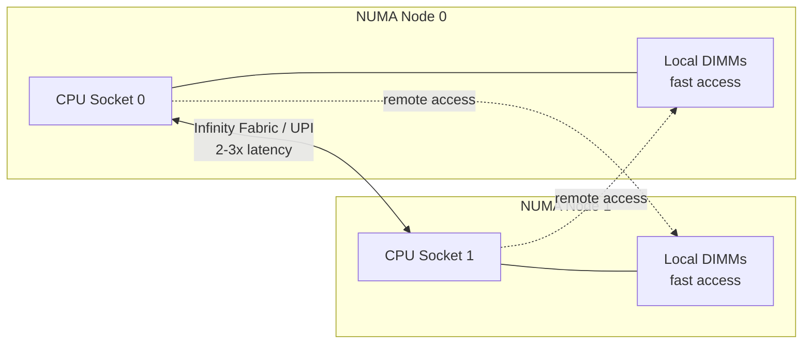
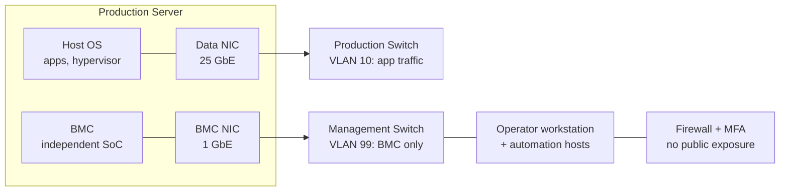
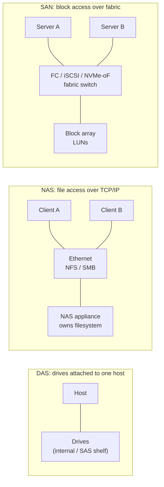
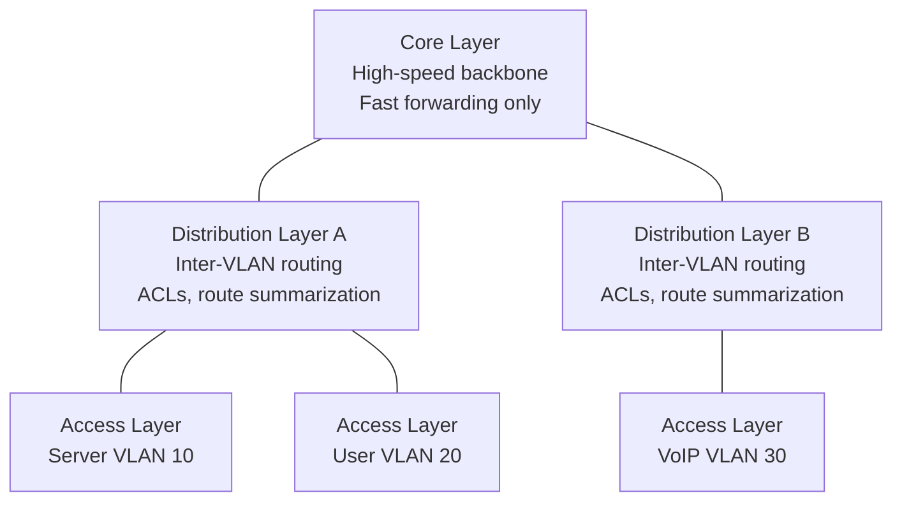
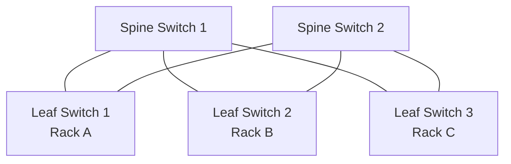
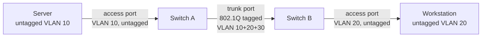
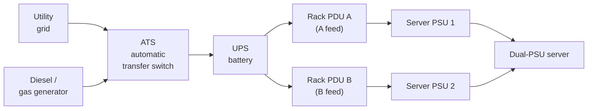

import { Aside } from '@astrojs/starlight/components';
import HistoricalNote from '/src/components/HistoricalNote.astro';
import FigureWithCaption from '/src/components/FigureWithCaption.astro';

{/* ai-summary
type: lecture
slug: on-premises-infrastructure
order: 17
covers: hosting model decision and what an availability zone physically is; server CPU platforms (EPYC, Xeon) and NUMA; ARM and AI accelerators in one paragraph; memory at server scale (scrubbing, Chipkill, LRDIMM); server specialization (virtualization host, storage, GPU, blade); out-of-band management (BMC, IPMI, Redfish, virtual KVM, management VLAN); enterprise storage interfaces (SAS, NVMe, NVMe-oF, U.2/U.3, hot-swap); DAS, NAS (NFS, SMB), SAN (Fibre Channel, iSCSI); RAID levels condensed; three-tier vs spine-leaf topology; VLAN operations (access vs trunk, inter-VLAN routing); access-layer hardening (DAI, DHCP snooping, port security, 802.1X); DHCP relay; OSPF inside, BGP at the edge; racks and structured cabling; hot/cold aisle; power infrastructure (PDU, UPS, dual feed, A/B power); cooling (CRAC/CRAH, in-row, liquid); Uptime Institute tiers; high-speed fabric (25/100/400 GbE); RDMA, RoCE, InfiniBand; SmartNICs and DPUs; oversubscription
prereq_lectures: hardware-fundamentals, virtualization-basics, networking-fundamentals, cloud-computing, container-orchestration, network-services-and-application-delivery
followup_lectures: system-security-and-hardening
paired_activities: cisco-packet-tracer, storage-planning
supports_labs:
*/}

Cloud infrastructure looks like magic until the bill arrives or a region goes down. Every EC2 instance is a physical server in a data center, connected by real cables to real switches, drawing real watts from a power distribution unit that ultimately traces back to a substation. When a cloud provider introduces a new instance family with higher network throughput, it is reflecting physical constraints at the hardware layer. When latency spikes without explanation, the cause often traces to a hardware decision made by the person who racked the server years ago. And when an AWS Availability Zone fails, what fails is a building, with its own power, cooling, and network fabric.

This lecture is the one place in the course that treats those physical realities as a designed system rather than as an abstraction underneath an API. It pulls together hardware concepts from the Hardware Fundamentals lecture, the addressing and ARP behavior from Networking Fundamentals, the regions and Availability Zones from the Cloud Computing lecture, and the underlay-versus-overlay framing from the Network Services and Application Delivery lecture, and answers the question those lectures kept deferring: what does the physical layer actually look like, and what decisions does it force on the people who own it?

## Where Physical Infrastructure Lives

The Cloud Computing lecture already introduced the four hosting models in use today: public cloud from a hyperscaler, a budget public cloud such as Hetzner, a private cloud built on OpenStack or Proxmox, and colocation. It even named the cloud-computer category represented by Oxide. The lecture you are reading does not redefine those models. It picks up where that one stopped: even when you choose public cloud, you are renting time on someone else's physical infrastructure, and that infrastructure follows the same design rules as the colocation cage your competitor rented down the street.

An AWS region such as `us-east-1` is not a single building. It is a geographic cluster of data centers grouped into Availability Zones, where each Availability Zone is an isolated location with independent power, cooling, and networking. AWS's own infrastructure documentation describes an AZ as one or more discrete data centers, and AWS does not publish precise building counts. The safe operational takeaway is the one that matters: AZs are physically separated failure domains within a region, connected by low-latency regional fiber under different physical paths. The reason your application can survive a single-AZ outage by spreading across two or three is that those zones are physically separated facilities with separately sourced power and separately routed fiber. The reason a region-wide outage is rare and catastrophic is that it usually means a control-plane failure that cuts across all of them at once.

The same physics governs whether you operate the building yourself, rent space in someone else's, or rent only the workloads. The capex-versus-opex shape of those choices was already covered in the Cloud Computing lecture and is not worth restating here. What matters for the rest of this lecture is that the components are the same regardless of who owns them: server hardware, storage, switches, racks, power distribution, cooling, and a network design that holds them all together. Whether you are evaluating an EC2 instance type, racking your own gear in a colo, or planning a hybrid that extends a VPC to a branch office over Direct Connect or ExpressRoute (covered in the Network Services lecture), the underlying decisions trace back to the same physical building blocks.

## Server Hardware at Production Scale

The Hardware Fundamentals lecture covered consumer-grade platforms: ATX boards, DDR5 UDIMMs, M.2 NVMe drives, ATX 3.x power supplies. Server hardware is a separate product line, shaped by a different set of constraints: continuous load instead of bursty workstation use, multi-socket designs, very large memory capacities, and product lifecycles measured in years rather than months. The same vocabulary applies (CPU, memory, storage, PCIe lanes), but the values and tradeoffs are different.

### Server CPUs and NUMA

The two dominant server CPU families remain **AMD EPYC** and **Intel Xeon**. Modern server parts support ECC RDIMMs and LRDIMMs, far more memory channels than consumer platforms, often eight to twelve per socket, and PCIe lane counts (128 or more per socket on high-end parts) that consumer chipsets cannot match. These are not "faster" CPUs in the headline sense; they are wider, with more cores, more memory bandwidth, and more I/O than a desktop part can deliver.

<FigureWithCaption
  src="./hardware-components/server-chipset.png"
  alt="Dual-socket server board topology"
  caption="Dual-socket server board topology (GIGABYTE G293-S41-AAP1)"
  imageHeight="h-96"
/>

The single biggest conceptual difference for a sysadmin is **Non-Uniform Memory Access (NUMA)**. In a two-socket server, each CPU has local memory banks it can access at full speed and remote memory banks on the other socket that it reaches over an inter-socket interconnect (AMD Infinity Fabric or Intel UPI). The latency difference between local and remote memory is typically two to three times. A workload whose threads and buffers are pinned to one socket runs at one speed; a workload whose memory ends up split across sockets runs measurably slower.

Linux tools `numactl` and `numastat` expose the topology and let you pin processes and memory to a specific node. Many enterprise databases, JVM-based services, and high-throughput packet processors are NUMA-aware by default; many ordinary application servers are not, and that is the difference between predictable and surprising performance on a dual-socket node. Within a single CPU socket, modern EPYC parts also expose multiple **NUMA domains per socket** (NPS settings), which means even a single-socket server can have intra-socket NUMA effects worth knowing about.

### ARM and AI Accelerators

For most of computing history "server CPU" meant Xeon or EPYC. That is no longer a safe assumption. The hyperscalers each have an in-house ARM line aimed at general-purpose cloud workloads: **Amazon Graviton**, **Microsoft Cobalt**, and **Google Axion**. AWS markets Graviton as offering better price-performance than comparable x86 instances on many cloud-native Linux workloads, and porting is often as cheap as rebuilding your container for `linux/arm64`. **Ampere Altra** brings the same architecture to colocation and on-prem deployments through partners like Oracle Cloud and select OEM servers. Alongside the ARM CPUs are a generation of custom AI accelerators built for matrix multiplication rather than general compute: **NVIDIA Grace Hopper** and **GB200** packages, **Google TPU**, **AWS Trainium** and **Inferentia**, and **Microsoft Maia**. These are not interchangeable with x86 servers; they require their own software stacks and their own networking. For this course, the operational implication is the same one Container Orchestration already hinted at: build and push multi-architecture container images so the same workload can land on whichever fleet is cheapest.

<Aside type="tip" title="Checking Architecture in Linux">
`uname -m` reports `x86_64` on Intel or AMD and `aarch64` on ARM servers. Container images must match the host architecture unless emulation (QEMU) is in play, which is significantly slower. `docker buildx build --platform linux/amd64,linux/arm64` produces a multi-arch image that the registry serves to whichever architecture pulls it.
</Aside>

### Memory at Server Scale

The Hardware Fundamentals lecture introduced ECC, RDIMMs, and LRDIMMs as concepts. At server scale these features carry their weight in ways that are easy to underestimate on a desktop. ECC is not a "nice to have"; in a virtualization host with 768 GB of DDR5, the statistical rate of cosmic-ray and electrical-noise bit flips means a non-ECC machine will eventually corrupt VM state, and the corruption will be silent. **Patrol scrubbing** is the firmware feature that walks memory in the background and forces ECC checks on idle pages, surfacing latent errors before an application happens to read the affected line. **Chipkill** and related **Single Device Data Correction (SDDC)** modes are stronger ECC/RAS features that can tolerate the failure of an entire DRAM chip on a DIMM, not just a single bit. That is a different feature from memory-encryption technologies such as **AMD Memory Guard**, which protect data confidentiality rather than correcting memory errors. **LRDIMM (Load-Reduced DIMM)** buffers the data lines so the memory controller can drive more DIMMs per channel at full speed, which is how a server reaches 2 to 6 TB of installed memory without sacrificing throughput.

Two operational notes follow from this. First, ECC errors logged by the BMC (covered in the Log Management and Incident Investigation lecture) are an early-warning system: a DIMM logging increasing correctable errors is a planned replacement, not an emergency. Second, mixing UDIMM and RDIMM in the same server prevents boot, and mixing DIMMs of different rank or organization can quietly force the memory controller to a lower speed. Server memory population follows a vendor table that is genuinely worth reading before purchase.

### Server Specialization by Workload

"Server" is a generic word. Production environments use several distinct classes of hardware that look broadly similar but are optimized for different jobs.

**Compute and virtualization hosts** are the default 1U or 2U rackmount nodes that fill most racks. A typical dense virtualization host carries two EPYC or Xeon sockets, several hundred gigabytes of ECC RDIMM, a small number of NVMe drives for VM images, and a 25 GbE or faster network connection. The hypervisor (ESXi, Proxmox VE, KVM, Hyper-V, or a hyperscaler's proprietary stack) divides the box into VMs that the rest of the course already takes for granted.

**Storage servers** invert the priorities: many drives, modest CPU and memory, and high-throughput networking. A 4U storage chassis can hold 60 to 90 spinning disks on a SAS expander backplane, or an equivalent count of NVMe drives in a JBOF (Just a Bunch of Flash) enclosure. The operating system is typically a storage-focused distribution: TrueNAS for ZFS-based deployments, Ceph for distributed object and block storage, or a vendor appliance OS. A **JBOD** (Just a Bunch of Disks) is the simplest variant: a disk shelf with no embedded compute, presenting drives to an attached server over SAS or NVMe-oF and leaving RAID and filesystem logic to the host.

**GPU and AI servers** are a different physical animal entirely. A purpose-built AI node such as the NVIDIA DGX H100 houses eight H100 SXM GPUs interconnected by a fourth-generation NVLink fabric that NVIDIA documents as providing 900 GB/s of GPU-to-GPU bandwidth, and the appliance is rated for a little over 10 kW of maximum system power. Inference-tier servers built around L4, L40S, AWS Inferentia, or TPU v5e chips are cheaper per query because inference is latency-bound and benefits from more, smaller accelerators rather than fewer high-memory training GPUs. The networking story (covered later in this lecture) is what separates these from ordinary racks: a 64-GPU training job is bottlenecked by the all-reduce step across the network, not by the GPUs themselves.

**Blade servers** pack thin compute modules into a shared chassis with common power, cooling, and a networking backplane. The density is excellent and the per-node cabling drops dramatically. The tradeoff is vendor lock-in (blades from one vendor do not fit another's chassis) and limited per-blade expansion. Blade designs were dominant in the 2000s and remain common in enterprises with long-standing HPE or Dell relationships, but most new builds use rackmount servers with top-of-rack switching instead.

  

2U HPC/AI Server <a href="https://www.gigabyte.com/Enterprise/GPU-Server/G293-S41-AAP1" target="_blank" rel="noopener noreferrer">G293-S41-AAP1</a> from GIGABYTE

### Out-of-Band Management

Every production server has a second computer inside it. The **Baseboard Management Controller (BMC)** is a small ARM-based system-on-chip with its own CPU, memory, firmware, and dedicated network port that operates independently of the main CPU and OS. Vendor names for the BMC's full feature set are familiar: **iDRAC** on Dell, **iLO** on HPE, **XCC** on Lenovo, **CIMC** on Cisco UCS. The protocol that has historically tied them together is **IPMI**; the modern HTTPS-and-JSON replacement is **Redfish**, which is now the standard interface for new automation.

Operationally, the BMC is the answer to questions that have no software-side answer. You can power-cycle a hung server when SSH is unresponsive. You can attach to the console as if you were standing in front of the rack with a monitor and keyboard, through a virtual KVM session in a browser. You can mount an ISO image as a virtual CD-ROM and reinstall the operating system on a remote machine over the management network. You can read the System Event Log (covered in the Log Management lecture) for hardware events the OS never saw, including the ECC errors and fan failures that signal an impending hardware problem.

The network design implication is the part most relevant here. The BMC has its own NIC, on its own MAC address, and it should be on its own **management VLAN** that is reachable only from operator workstations and a small set of automation hosts. Putting BMCs on the same VLAN as production traffic exposes a powerful, often weakly-authenticated control surface to anyone who reaches that broadcast domain. A separate, firewalled, MFA-gated management VLAN is the standard pattern, and it is one of the reasons VLAN segmentation matters operationally rather than as a theoretical layer-2 nicety.

<Aside type="caution" title="BMC Security Is Not Optional">
A BMC with default credentials and a routable address is one of the most direct paths to total compromise of a server: it can mount arbitrary media, capture the console, and survive an OS reinstall because it is not part of the OS. Treat BMC credentials like root credentials, keep firmware patched, and never expose the BMC interface to the public internet.
</Aside>

## Enterprise Storage

The Hardware Fundamentals lecture covered the basics of HDD and SSD media and the M.2 NVMe drives common in consumer machines. The Linux Server Planning lecture covered RAID as a concept and introduced ZFS and Btrfs as integrity-aware filesystems. At server and data center scale, the new questions are how drives attach (interface and form factor), how storage is delivered to consumers (locally, over the network as files, or over a fabric as blocks), and how the redundancy is organized when a single array carries dozens of terabytes that nobody wants to restore from tape.

### Interfaces: SATA, SAS, NVMe, NVMe-oF

| Interface | Representative throughput | Duplex | Hot-Swap | Use Case |
|---|---|---|---|---|
| **SATA III** | ~600 MB/s | Half | Backplane-dependent | Budget servers, bulk storage |
| **SAS-3 (12G)** | ~1,200 MB/s | Full | Yes (SAS expanders) | High-density enterprise storage |
| **SAS-4 (24G)** | ~2,400 MB/s | Full | Yes | Tier-1 storage arrays |
| **NVMe (PCIe 4.0 x4)** | ~7,000 MB/s | Full | Via U.2/U.3 backplane | Low-latency databases, AI |
| **NVMe-oF** | Fabric-dependent | Full | N/A | Disaggregated storage over fabric |

The interesting interface-level details for a server administrator are the ones that do not appear on the desktop. **SAS** runs full-duplex, so it can read and write simultaneously on the same link, while SATA is half-duplex. **SAS expanders** allow one host bus adapter to address up to 256 drives, which is why high-density storage chassis are built on SAS rather than direct SATA. **U.2** and **U.3** are 2.5-inch hot-swap form factors that carry the NVMe protocol over PCIe lanes through a server backplane, giving you the throughput of M.2 NVMe with the serviceability of a SAS hot-swap bay. Hot-swap matters: pulling a drive from a running production system is normal procedure, and consumer SATA backplanes typically do not guarantee it.

**NVMe over Fabrics (NVMe-oF)** extends the NVMe protocol across a network, so a JBOF in one rack can present block devices to compute nodes in another rack. On fast transports such as RDMA or Fibre Channel, the added latency can be low enough to support disaggregated designs that still behave much more like local block storage than NAS. NVMe-oF transports include RDMA (RoCE, iWARP, InfiniBand), Fibre Channel, and TCP. Storage disaggregation built on NVMe-oF is increasingly common in hyperscale deployments because it lets compute and storage scale independently, and it is one of the reasons the network speed tiers later in this lecture climbed past 100 GbE.

### Direct-Attached, Network-Attached, and Storage Area Networks

The three storage attachment models differ in where the network boundary falls relative to the storage device.

**Direct-Attached Storage (DAS)** is storage connected directly to a single host: internal drives, an external SAS enclosure, or a JBOD shelf. It provides the fastest access and no network overhead, but only the attached host can use it.

**Network-Attached Storage (NAS)** is a device or cluster that presents a filesystem over a standard TCP/IP network. The two dominant NAS protocols are NFS and SMB. **NFS** (Network File System), developed by Sun Microsystems, is the standard in Linux and UNIX environments; NFSv4 adds stronger security and operational improvements over NFSv3, which lacks native encryption and is a poor choice on untrusted networks. **SMB** (Server Message Block) is the standard in mixed-OS environments; SMB 3.x adds encryption and stronger authentication and is now the default file-sharing protocol on macOS and Windows. Multiple clients can mount the same NAS export simultaneously, which makes NAS the right answer for shared home directories, build artifacts, and backups.

**Storage Area Networks (SANs)** use a dedicated high-speed fabric (Fibre Channel, iSCSI over Ethernet, or NVMe-oF) to present raw block-level storage to servers. A server with a SAN-attached **LUN** (Logical Unit Number) sees it as a locally attached block device and formats its own filesystem on top. SANs are used in enterprise environments for databases and virtual machine datastores because they deliver low latency, high throughput, and the multipath failover behavior that NAS protocols cannot match at the same scale.

The diagram shows where the network boundary falls in each model. In DAS, there is no network between the host and its drives. In NAS, the network sits between the client and a filesystem that the appliance owns; clients see files. In SAN, the fabric sits between the server and raw block devices; the server owns the filesystem on top of the LUNs.

| | SAN | NAS |
|-|-----|-----|
| Storage type | Block | File |
| Network | Fibre Channel / iSCSI | TCP/IP Ethernet |
| Performance | High | Moderate |
| Cost and complexity | High | Low |
| Use case | Databases, VM datastores | File shares, backups, home directories |

Network storage failures have distinctive signatures that differ from ordinary connectivity failures, and the diagnostic tools are different. An NFS mount that succeeded during provisioning may go stale after a network partition: the server is reachable, the mount point exists, but read and write operations block until the kernel times out. The NFS mount options `soft` and `hard` control this: a `soft` mount returns an error after a timeout, while a `hard` mount retries forever, protecting data integrity but risking hung processes. SMB authentication failures usually manifest as "access denied" rather than a timeout, often because a Kerberos ticket expired or the client's domain membership does not match the server's ACL. SAN failures are more abrupt: if a Fibre Channel HBA loses zoning or an iSCSI session drops, block devices disappear from the OS and filesystems on them go read-only to prevent corruption. The right diagnostic tools at that point are `multipath -ll` for multipath state and `iscsiadm -m session` for iSCSI sessions, not `ping` or `dig`.

### RAID Levels and Integrity-Aware Filesystems

The Linux Server Planning lecture already introduced RAID as a concept and described ZFS and Btrfs as integrity-aware alternatives. The remaining piece is the catalog of RAID levels themselves and the tradeoff between traditional RAID and modern filesystem-managed redundancy.

| Level | Min. Drives | Fault Tolerance | Capacity Overhead | Read / Write Profile | Typical Use |
|---|---|---|---|---|---|
| **RAID 0** | 2 | None: any drive failure loses everything | 0% | Highest read and write throughput | Scratch space, ephemeral caches |
| **RAID 1** | 2 | One drive per mirror | 50% (with 2 drives) | Fast reads, write speed of one drive | Boot volumes, small critical pairs |
| **RAID 5** | 3 | One drive | One drive's worth | Good reads, slower writes (parity calc) | General-purpose arrays (small drives) |
| **RAID 6** | 4 | Two drives | Two drives' worth | Slower writes than RAID 5 | Large-drive arrays where rebuilds are long |
| **RAID 10** | 4 | One drive per mirror pair | 50% | High read and write throughput | Databases, VM datastores |

RAID 6 has become the practical default over RAID 5 on modern multi-terabyte drives because the rebuild window after a single failure is long enough that a second failure during the rebuild is a realistic event. Single-parity RAID 5 on 16 TB drives is a configuration you read about in postmortems.

Software RAID such as Linux `mdadm` runs in the kernel and uses host CPU for parity calculations, which is cheap on modern processors and easy to move between machines. Hardware RAID offloads the same work to a dedicated controller card with battery-backed cache, which can deliver more predictable write performance but introduces vendor lock-in: a failed controller can render an array unreadable on a different model. Modern filesystems take a different approach entirely. ZFS, Btrfs, and Ceph's BlueStore checksum every block at write time and detect silent corruption on every read, so a "RAID-Z" pool or a Ceph erasure-coded pool is not only redundant but self-healing in a way traditional RAID is not. That is why software-managed pools have largely replaced classic hardware RAID outside of specific enterprise appliances.

<Aside type="tip" title="RAID Is Not Backup">
If a RAID 1 array loses a disk and, during the rebuild, a directory is accidentally deleted, the deletion is instantly mirrored to the surviving disk. Only an external, versioned backup can restore it. Redundancy protects against hardware failure; only backups protect against everything else.
</Aside>

### Distributed and Parallel Filesystems

Beyond the single-machine filesystems that the Linux Server Planning lecture introduced (ext4, XFS, ZFS, Btrfs), enterprise and HPC environments increasingly use filesystems that span many physical nodes. These systems trade some of the simplicity of a local filesystem for the ability to scale capacity and throughput linearly with node count, present a single namespace to many clients, and survive node failures without taking the data offline. The right way to read the rest of this subsection is on the single-node-versus-multi-node axis: ZFS and Btrfs scale up by adding disks to one server; Ceph, Lustre, IBM Storage Scale, and BeeGFS scale out by adding entire nodes.

**ZFS and Btrfs**, already introduced in the Linux Server Planning lecture, are single-node integrity-aware filesystems. ZFS in particular has shaped how a generation of storage administrators think about pools, snapshots, and end-to-end checksums; it is the foundation of TrueNAS, OpenZFS on Linux, and the storage layer of many homelab and small-business NAS appliances. ZFS pools can reach multiple petabytes on a single host, but the server itself is the failure boundary: if the chassis goes down, the pool goes with it.

**Ceph** is the dominant open-source distributed storage system and the one worth knowing by name. It spreads data across a cluster of nodes using the CRUSH algorithm, a deterministic placement function that decides which nodes store each object without a central metadata server. The same cluster can present object storage (RGW, S3-compatible), block storage (RBD, used as backing for VM disks and Kubernetes PersistentVolumes through Rook), and file storage (CephFS). When a node fails, surviving nodes rebalance the affected data automatically, so the cluster heals itself rather than requiring a human-driven rebuild. Ceph is the storage backbone underneath OpenStack, Proxmox VE clusters, and many on-prem Kubernetes deployments, and it powers some hyperscaler internal storage tiers. The operational tradeoff is complexity: a healthy Ceph cluster requires careful tuning of OSD layout, placement group counts, and network configuration, and it is not a system you stand up casually for a single workload.

**GlusterFS** is a simpler distributed file system that aggregates many servers' local storage into a single namespace through a stack of translators. It was popular for shared application storage in the 2010s, but Red Hat ended commercial support for Red Hat Gluster Storage in 2024, and new deployments today more often choose Ceph or one of the parallel filesystems below.

**Lustre** is the parallel filesystem most associated with classical HPC. It separates metadata operations onto dedicated **Metadata Servers (MDS)** and bulk data operations onto **Object Storage Servers (OSS)**, so a single large file can be striped across many storage targets and read or written in parallel by thousands of compute nodes simultaneously. Most of the top supercomputers on the TOP500 list run Lustre on their primary scratch filesystem. Lustre is built for raw throughput on highly concurrent scientific workloads; it is not a good fit for ordinary enterprise file sharing because the metadata path is optimized for a small number of very large files rather than many small ones.

**IBM Storage Scale** (formerly GPFS, General Parallel File System) is the proprietary equivalent at IBM, common in large enterprise HPC sites, weather forecasting, life sciences, and financial services. It supports parallel access from thousands of clients with strong POSIX semantics and integrates with IBM's tape archive systems for hierarchical storage management, where rarely-accessed data is transparently migrated to slower, cheaper media.

**BeeGFS** is a newer parallel filesystem developed at the Fraunhofer Institute and now maintained by ThinkParQ. It is often chosen for smaller HPC clusters and AI training environments where Lustre is more than the team wants to operate. It scales well into the multi-petabyte range, supports RDMA transports (covered later in this lecture), and has gained traction in GPU clusters where reading training datasets in parallel is the dominant I/O pattern.

| Filesystem | Scale | License | Architecture | Primary Use Case | Operational Complexity |
|---|---|---|---|---|---|
| **ZFS** | Single node, up to multi-PB pool | Open source (CDDL) | Pooled storage with copy-on-write and checksums | NAS appliances, storage servers, homelab | Low to moderate |
| **Ceph** | Tens to thousands of nodes | Open source (LGPL) | CRUSH-placed objects; RBD, CephFS, RGW interfaces | Private cloud, Kubernetes PVs, S3-compatible object store | High |
| **GlusterFS** | Tens to hundreds of nodes | Open source (GPL) | Translator stack over local bricks | Legacy shared application storage | Moderate (declining adoption) |
| **Lustre** | Hundreds to thousands of nodes | Open source (GPL) | Separate MDS and OSS roles, striped files | Classical HPC, TOP500 supercomputers | High |
| **IBM Storage Scale (GPFS)** | Thousands of nodes | Proprietary | Parallel POSIX with HSM integration | Enterprise HPC, financial services, life sciences | High |
| **BeeGFS** | Tens to hundreds of nodes | Open source / commercial | Parallel metadata and storage targets, RDMA | Smaller HPC, AI training clusters | Moderate |

The decision between these is not "which is best." It is "which one matches your workload, your operations team, and your hardware budget." A storage server backing a few hundred home directories should probably run ZFS. A multi-tenant private cloud or a Kubernetes cluster that needs persistent volumes for many tenants should probably run Ceph. A scientific cluster reading multi-terabyte datasets into a thousand compute nodes should probably run Lustre or BeeGFS. The wrong choice does not show up at install time; it shows up six months in, when the access pattern has settled and the filesystem is asked to do something it was not designed for.

## Enterprise Network Topology

The Networking Fundamentals lecture covered the protocols (TCP/IP, ARP, DHCP DORA, NAT, routing tables) and the small-network role of managed switches, VLANs, and routers. The Network Services and Application Delivery lecture extended the picture to reverse proxies, load balancers, TLS, and CNI underlay versus overlay in Kubernetes. What is left for this lecture is the topology that ties all of those things together into a network you can rack, cable, and operate.

### From Three-Tier to Spine-Leaf

The Cisco hierarchical model organizes a network into three functional layers. The **Access Layer** is where end devices connect; it handles layer-2 switching, port security, VLAN assignment, and Power over Ethernet for things like phones and access points. The **Distribution Layer** aggregates access switches and acts as the boundary between layer-2 switching and layer-3 routing; it enforces ACL-based policy, performs inter-VLAN routing, and summarizes routes upward. The **Core Layer** is the high-speed backbone that interconnects distribution devices; it does as little policy work as possible and prioritizes fast forwarding and redundancy. In small-to-medium networks, the distribution and core layers are often collapsed into a single layer-3 switch.

This design is the right answer for a campus: users connect at the access layer, traffic flows up to a central core, and a small number of expensive policy points see everything. It is the wrong answer for a modern data center. Data center workloads are dominated by east-west traffic between servers: replicas in a distributed database, Kubernetes pods on different nodes, gradient synchronization in a training cluster, NVMe-oF reads from a storage server. In a three-tier topology those flows climb to the core and back down, doubling hop count and creating oversubscription bottlenecks. Modern data centers therefore use **spine-leaf** (also called fat-tree or Clos) topologies instead. Every leaf switch connects to every spine switch, and no two leaf switches connect directly. Any server-to-server path is exactly two hops, latency is uniform regardless of source and destination, and bandwidth scales by adding spines rather than upgrading a central core.

The **oversubscription ratio** is the design knob: the ratio of total downlink bandwidth (toward servers) to total uplink bandwidth (toward spines). A 4:1 ratio means four servers share one server's worth of uplink capacity. For ordinary web and database workloads this is fine. For AI training clusters whose all-reduce step has to move terabytes of gradients per epoch, 4:1 turns a 64-GPU cluster into a 16-GPU cluster in practice, and the right answer is a non-blocking 1:1 fabric, which is why AI cluster networking is the most expensive line item in the rack after the GPUs themselves.

<HistoricalNote title="From Three-Tier to Spine-Leaf">
The three-tier model was designed for the traffic patterns of the 1990s and early 2000s, when most traffic flowed north-south from user desktops to central servers and out to the internet. Virtualization, distributed databases, Hadoop, and later Kubernetes flipped that pattern: most data center traffic is now east-west, server-to-server within the same building. The spine-leaf topology was not new in 2010 when it began replacing three-tier in data centers. It descends from telephony switching research published by Charles Clos in 1952. The shape of the network finally caught up with the shape of the traffic.
</HistoricalNote>

### VLAN Operations in Practice

VLANs were introduced in the Networking Fundamentals lecture as a way to segment a switch into multiple logical broadcast domains. At enterprise scale, the operational details that matter are how VLAN membership is implemented on physical ports and what happens when a port is configured wrong. Switch ports operate in one of two modes.

**Access ports** connect to end devices: servers, workstations, printers, IP phones. The switch assigns all traffic on an access port to a single VLAN and strips the 802.1Q tag before delivering frames to the device. The device never sees the tag. **Trunk ports** connect switches to each other, or switches to routers. A trunk preserves the 802.1Q tag so the receiving switch knows which VLAN each frame belongs to, which is the only way to carry multiple VLANs across a single physical cable.

The most common VLAN failure mode is a patch cable moved to a port configured for a different VLAN. The server's IP address is correct, but it is now in a broadcast domain that cannot reach the gateway. The Networking Fundamentals lecture already named the symptom: `ip neighbor show` on the host reports the gateway entry as `FAILED`, because ARP resolution at layer 2 never completes. That is the diagnostic before anyone touches IP configuration. To route traffic between VLANs at all, you need a layer-3 device (a router or a layer-3 switch) with an interface or sub-interface in each VLAN. Without inter-VLAN routing, two hosts on different VLANs cannot communicate regardless of how their IP addresses are configured.

### Access-Layer Hardening

A managed switch with default configuration trusts everything plugged into it. In an enterprise environment where the access ports run to rooms, conference tables, and wall jacks, that trust is unsafe. Three features together harden the access layer.

**DHCP snooping** turns the switch into a witness for DHCP exchanges. It learns which IP address was leased to which MAC address on which port and stores that mapping in a binding table. **Dynamic ARP Inspection (DAI)** then uses that binding table to validate every ARP reply on the network. A reply claiming that `10.0.1.1` belongs to a MAC address not in the binding table is dropped, which neutralizes ARP spoofing attacks where a malicious host on the segment tries to impersonate the default gateway. Servers with static addresses must have manual bindings added to the DAI table or their ARP traffic will also be dropped; this is one of the more common DAI rollout footguns. **Port security** limits how many MAC addresses a single port will learn, which prevents a rogue switch or hub from extending an access port into a multi-device fan-out. **802.1X authentication** is the strongest layer: the port stays disabled until the connecting device authenticates through a RADIUS server, and the RADIUS response can place the device into a specific VLAN. Together, these four features are the baseline configuration on enterprise access switches anywhere unauthorized devices could plug in.

### DHCP Relay

DHCP starts as a broadcast, so by default a client only reaches a DHCP server on the same broadcast domain. In a network with dozens of VLANs that is not how DHCP runs: a single DHCP server cluster usually serves the whole campus, and routers or layer-3 switches act as **DHCP relay agents**, forwarding the broadcast as a unicast packet to the configured DHCP server and routing the response back. The Networking Fundamentals lecture already covered DORA, lease times, and the case for DHCP reservations on servers and infrastructure; relay is the operational piece that lets one server provide leases across many segments.

### OSPF Inside, BGP at the Edge

Static routes work for small, stable networks. Once a network grows to multiple sites, multiple routers, or paths that may change, you need a routing protocol that exchanges reachability information automatically. The Networking Fundamentals lecture promised that OSPF and BGP would be covered "later"; this is later.

**OSPF (Open Shortest Path First)** is the interior routing protocol you are most likely to encounter on premises. It is a link-state protocol: each router builds a complete map of the topology, calculates shortest paths, and sends incremental updates when something changes. OSPF converges quickly after a failure and scales through its area concept, which keeps routing tables compact as the network grows. It runs on essentially every enterprise router and layer-3 switch and is what lets distribution switches in a three-tier or leaf switches in a spine-leaf learn routes from each other without manual configuration.

**BGP (Border Gateway Protocol)** is the routing protocol of the public internet and shows up in enterprises in three specific places. The first is multi-homing: when your organization peers with more than one ISP, BGP announces your IP block to both and lets you control routing preferences. The second is cloud connectivity: AWS Direct Connect and Azure ExpressRoute (both covered in the Network Services lecture) use BGP to exchange routes between your network and the cloud VPC. The third is inside Kubernetes clusters where a CNI plugin advertises pod CIDRs to the physical network through BGP rather than using an overlay encapsulation. BGP is more complex to configure than OSPF; in most on-prem environments you meet it at the edge rather than inside the campus. **Link Aggregation (LAG)**, the 802.3ad protocol that bonds multiple physical interfaces into one logical link, was already named in the Networking Fundamentals lecture; it remains the way you scale uplinks and add redundancy between switches and between servers and their top-of-rack switch.

The underlay-versus-overlay question (Kubernetes pod traffic riding a VXLAN encapsulation on top of the physical network, versus a BGP-speaking CNI announcing pod CIDRs into the underlay directly) was already covered in the Network Services and Application Delivery lecture. The reason it belongs in both lectures is that the same question shows up from two angles: as a Kubernetes networking decision, and as a physical-network capability. If you do not control the physical network, BGP-based CNIs are not available to you. If you do, they can avoid the encapsulation overhead of VXLAN at the cost of pushing pod CIDRs into your routing tables.

## The Data Center as a Designed System

A server in a rack is just a server. A rack full of servers, with structured cabling to a top-of-rack switch, hot/cold aisle airflow management, A/B power feeds, and a high-speed fabric tying it to the rest of the building, is infrastructure. The data center is not an accumulation of hardware; it is a deliberately designed system, and the design choices determine what kind of failures the building can survive.

### Racks, Cabling, and Airflow

Standard data center racks are 42U or 48U tall, 19 inches wide internally, and either 600 or 800 mm deep. Each rack holds rackmount servers (most commonly 1U or 2U), one or two top-of-rack switches, a pair of vertical PDUs along the rear posts, and a tangle of structured cabling that should not be a tangle in a well-run facility. Structured cabling means cables are routed along defined paths in overhead trays or under raised floors, terminated in patch panels rather than directly into devices, labeled at both ends, and documented so a cable can be traced from one rack to another without unplugging anything to find out. Copper twisted-pair runs handle access links at 10 GbE or below; fiber handles spine uplinks and inter-rack runs because copper at 25 GbE and above is limited to short distances.

Airflow management is what keeps the building's cooling investment from being wasted. Servers draw cool air through the front and exhaust hot air out the back. In a well-designed facility, racks are arranged in alternating **hot aisles** and **cold aisles**, with all server fronts facing into the cold aisle. **Aisle containment** uses physical barriers (ceilings, end-of-row doors, plastic curtains) to prevent the hot exhaust from one row from being inhaled as intake by the next, which keeps the temperature delta between the two aisles high and the cooling efficient. Blanking panels in empty rack units prevent hot air from recirculating through unused slots back into the cold aisle. None of this is glamorous; all of it is what determines the **PUE (Power Usage Effectiveness)** of the building, the ratio of total facility energy to IT-load energy, which is the dominant operating cost in any non-trivial data center.

  

  

  

2U HPC/AI Server <a href="https://www.gigabyte.com/Enterprise/GPU-Server/G293-S41-AAP1" target="_blank" rel="noopener noreferrer">G293-S41-AAP1</a> from GIGABYTE

### Power: From Utility to Server

Power in a data center is delivered in multiple layers. Utility power enters the building through a transformer and switchgear, passes through **Uninterruptible Power Supplies (UPSes)** that bridge short outages from a battery bank, and is backed by diesel or natural-gas **generators** that take over for longer events once they spin up (typically within 10 to 60 seconds, covered by the UPS battery in the meantime). An **Automatic Transfer Switch (ATS)** sits between the utility feed, the UPS, and the generator and decides which source feeds the building at any moment.

Inside the building, power is distributed to racks through **PDUs (Power Distribution Units)**. A rack-level PDU is a vertical strip with monitored outlets that meters per-port current and reports it over the management network. Production racks almost always have **two PDUs**, one on each side, fed by independent branch circuits (often labeled the **A feed** and **B feed**), so a single circuit breaker trip or PDU failure does not take down the rack. Servers with dual power supplies plug one cord into each, and the supplies share load when both are healthy and carry the full load alone when one feed disappears. Sizing follows the **80 percent derating rule** for continuous load: on a 208 V 30 A circuit (about 6.2 kVA), you should plan for around 5 kW of usable continuous load and leave the remaining headroom for spikes and growth.

The redundancy story reads off the diagram: utility loss flips the ATS to the generator (with the UPS bridging the gap while the generator spins up), and a failure of either PDU still leaves the server fed by the other one. A rack that runs on only one PDU, or a server with only one power supply, is a single point of failure regardless of how good the upstream design is.

### Cooling: Matched to the Load

Air cooling is the default and dominant technology for racks up to roughly 15 to 20 kW per rack. **CRAC (Computer Room Air Conditioner)** units use direct-expansion refrigerant loops and were the historical standard. **CRAH (Computer Room Air Handler)** units use chilled water from a central plant and have replaced CRACs in most new builds because chilled-water plants are more efficient at scale and easier to combine with **free cooling** that uses outside air when the climate allows. **In-row cooling** places the heat exchangers between the racks rather than at the perimeter of the room, which shortens the air path and supports higher densities. **Rear-door heat exchangers** mount a water-cooled coil onto the back of each rack, removing heat right where the servers exhaust it.

Above 20 to 30 kW per rack, air cooling stops being practical and **liquid cooling** takes over. **Direct-to-chip** cooling routes a water or dielectric loop through cold plates bolted to the CPU and GPU dies; the rest of the server stays air-cooled. **Immersion cooling** submerges entire servers in a dielectric fluid, either single-phase (the fluid is pumped through a heat exchanger) or two-phase (the fluid boils on contact with hot components and condenses on a cold plate above). Modern AI training racks routinely exceed 50 kW; the GB200 NVL72 rack that pairs Grace CPUs with Blackwell GPUs is a representative example in the well-over-100-kW class and is impossible to cool without liquid. The cooling decision shapes the building: a facility designed for 8 kW racks cannot host AI workloads without renovation.

| Technology | Coolant | Heat Exchange Location | Rack Density Supported | Typical Use |
|---|---|---|---|---|
| **CRAC** | Refrigerant | Room perimeter | Up to ~10 kW | Legacy data centers |
| **CRAH** | Chilled water | Room perimeter | Up to ~15 kW | Most new air-cooled builds, free-cooling friendly |
| **In-row cooling** | Chilled water | Between racks in the row | Up to ~30 kW | High-density air-cooled rows |
| **Rear-door heat exchanger** | Chilled water | Rear door of each rack | Up to ~40 kW | Per-rack densification without room redesign |
| **Direct-to-chip liquid** | Water or dielectric | Cold plate on CPU/GPU dies | 40 to 100+ kW | Modern AI and HPC nodes |
| **Single-phase immersion** | Dielectric fluid | External heat exchanger | 50 to 150+ kW | Crypto, HPC, dense GPU clusters |
| **Two-phase immersion** | Boiling dielectric fluid | Condenser above the tank | 100+ kW | Bleeding-edge AI, research deployments |

  

Server Racks Organisation to Maximize Airflow

### Tier Classification

The **Uptime Institute** publishes a four-tier classification that sets vocabulary for data center reliability.

| Tier | Annual Availability | Redundancy | Concurrently Maintainable | Fault Tolerant | Typical Use |
|---|---|---|---|---|---|
| **Tier I** | ~99.671% (~29 hr downtime/yr) | None (N) | No | No | Small business server rooms |
| **Tier II** | ~99.741% (~22 hr/yr) | Redundant components (N+1) on a single path | No | No | Small enterprise |
| **Tier III** | ~99.982% (~1.6 hr/yr) | N+1 with multiple distribution paths (one active) | Yes | No | Enterprise, most colo deployments |
| **Tier IV** | ~99.995% (~26 min/yr) | 2N active power and cooling | Yes | Yes | Banks, government, critical national infrastructure |

Tier III is the practical baseline for serious enterprise and colocation deployments. Tier IV is rare and expensive; most hyperscaler data centers are not classified by Uptime at all because hyperscalers prefer to handle redundancy at the application layer across multiple Availability Zones rather than paying for fault tolerance within a single building.

### High-Speed Fabric

Consumer and small office equipment operates at 1 GbE. Servers and storage have moved well beyond that.

| Speed | Common Use |
|---|---|
| **10 GbE** | Legacy server uplinks, storage replication, older deployments |
| **25 GbE** | Standard modern server NIC in new builds |
| **40 GbE** | Older aggregation; largely replaced by 100 GbE |
| **100 GbE** | Top-of-rack uplinks, storage servers, GPU cluster nodes |
| **400 GbE** | Spine switches, hyperscale core, AI cluster interconnects |
| **800 GbE / 1.6 TbE** | Emerging standards for next-generation AI clusters |

A modern compute server ships with a dual-port 25 GbE NIC for data traffic and a separate 1 GbE port for the BMC management VLAN. A storage or AI server scales up: dual-port 100 GbE is common, and the AI nodes go to 400 GbE per port with multiple ports per chassis.

Standard Ethernet requires the host CPU to copy data between application memory and network buffers, which costs cycles and adds latency. **Remote Direct Memory Access (RDMA)** lets a NIC write data directly into the remote host's memory without involving the remote CPU, dropping latency to microseconds and CPU overhead to near zero. **InfiniBand** is the original RDMA fabric, still dominant in classical HPC and increasingly common in the largest AI clusters; HDR runs at 200 Gbps per port and NDR at 400 Gbps. **RoCE (RDMA over Converged Ethernet)** runs the same RDMA protocol over standard Ethernet hardware, which is how the same physical fabric can carry general traffic and lossless RDMA traffic. RoCEv2 appears frequently in NVIDIA SuperPOD reference designs and similar large AI deployments. RoCE requires careful network configuration (PFC for lossless behavior, ECN for congestion control); it is not a feature you toggle on at the last minute.

A **SmartNIC** is a NIC with an embedded ARM CPU and programmable packet-processing logic. A **DPU (Data Processing Unit)** extends that into a complete system-on-chip that runs its own operating system alongside its network processing. NVIDIA BlueField and Intel IPU are the main commercial examples. DPUs offload infrastructure functions from the host CPU: overlay networking encapsulation, storage encryption, firewall rules, the hypervisor's virtual switch, and telemetry. **AWS Nitro Cards** are the well-known production instance of this architecture: they offload the network, storage, and security planes from the EC2 host to dedicated silicon, which is part of how AWS keeps virtualization overhead low and separates infrastructure control functions from customer workloads. From the rack's perspective, the DPU is the point where some of what used to be Kubernetes CNI plugin behavior or hypervisor vSwitch behavior has migrated from the host CPU into a piece of network hardware.

<Aside type="tip" title="AI Cluster Network Design">
A distributed training job on 64 GPUs runs an all-reduce after each batch to synchronize gradients. If the fabric is oversubscribed 4:1, the all-reduce stalls waiting for bandwidth and your 64 GPUs deliver the throughput of 16. A non-blocking 100 or 400 GbE RoCE fabric eliminates that bottleneck. This is why AI cluster networking is often the second-largest line item in the rack after the GPUs themselves.
</Aside>

## Takeaways

The physical layer is not a separate subject from the rest of this course. It is the substrate that every other layer rides on, and once you can see it, the abstractions higher up read differently. An EC2 instance type is a slice of a specific server, plugged into a specific top-of-rack switch, in a specific rack, in a specific Availability Zone. The reason `r5n.large` and `m5.large` have different network performance is that one has more share of the host's network bandwidth, which is itself a share of the rack's 100 GbE uplink, which is itself a share of the spine fabric. When a region outage hits the news, it is almost always a control-plane or networking failure at this layer: a BGP misconfiguration, a routing-table change, a DNS dependency that turned out to be co-located with the systems it was supposed to direct traffic to. The physics underneath the API is not exotic; it is the rack you read about in this lecture.

On-premises operations make those same constraints unavoidable rather than invisible. A disaggregated storage design built on NVMe-oF often needs very fast networking, commonly 100 GbE or better and sometimes RDMA, or the flash tier stops behaving like flash from the application's point of view. An AI training cluster with 64 GPUs requires a non-blocking spine-leaf fabric or its all-reduce step will serialize on an oversubscribed uplink. A VLAN that segregates BMC management traffic from production data is the difference between a hardening exercise and an unrecoverable compromise. A pair of independent PDU feeds and dual-supply servers is the difference between "one breaker tripped" and "the rack went dark." Tier III concurrent maintainability is the difference between scheduled maintenance and a planned outage.

The hardware itself has grown more varied, not less. EPYC and Xeon are still the defaults, but ARM in the cloud (Graviton, Cobalt, Axion) and Ampere on premises have become real options for cloud-native workloads, and the AI accelerators (Trainium, Inferentia, TPU, Grace Hopper) sit on top of all of this as a category of hardware purpose-built for one class of computation. The job has not gotten simpler. What has changed is that the operator who can read across layers (from the rack power budget to the spine uplink to the NUMA topology of the host to the Kubernetes scheduler) is the one who can decide whether a problem actually lives where the alert says it does. That cross-layer reading is what this lecture, and the rest of the course, is ultimately preparing you to do.

## Resources

- <a href="https://www.youtube.com/watch?v=GR2GB6Qknlw" target="_blank" rel="noopener noreferrer">VLANs Explained (NetworkChuck, YouTube)</a>
- <a href="https://www.youtube.com/watch?v=lwArmpjGHpM" target="_blank" rel="noopener noreferrer">How To Design Your Own Enterprise Network: Cisco CCNA (YouTube)</a>
- <a href="https://www.cloudflare.com/learning/network-layer/what-is-ospf/" target="_blank" rel="noopener noreferrer">What Is OSPF? (Cloudflare, Article)</a>
- <a href="https://uptimeinstitute.com/tiers" target="_blank" rel="noopener noreferrer">Tier Classification System (Uptime Institute)</a>
- <a href="https://www.youtube.com/watch?v=wFCc3ts74pQ" target="_blank" rel="noopener noreferrer">A Day in the Life of the Data Centre: Racking Servers (YouTube)</a>
- <a href="https://www.youtube.com/watch?v=Kn_P9nG0zsA" target="_blank" rel="noopener noreferrer">The history of servers, the cloud, and what's next, with Oxide Computer (The Pragmatic Engineer Podcast, YouTube)</a>
- <a href="https://aws.amazon.com/blogs/aws/the-floor-is-lava-a-look-inside-an-aws-data-center/" target="_blank" rel="noopener noreferrer">A Look Inside an AWS Data Center (AWS, Blog)</a>
- <a href="https://www.redhat.com/sysadmin/troubleshooting-slow-servers" target="_blank" rel="noopener noreferrer">Troubleshooting slow servers: CPU, RAM, and Disk I/O (Red Hat Enable Sysadmin, Article)</a>
- <a href="https://www.snia.org/education/storage_networking_primer" target="_blank" rel="noopener noreferrer">Storage Networking Primer (SNIA)</a>
- <a href="https://docs.nvidia.com/dgx-superpod/reference-architecture-scalable-infrastructure-h100/latest/index.html" target="_blank" rel="noopener noreferrer">NVIDIA DGX SuperPOD Reference Architecture (NVIDIA, Documentation)</a>
