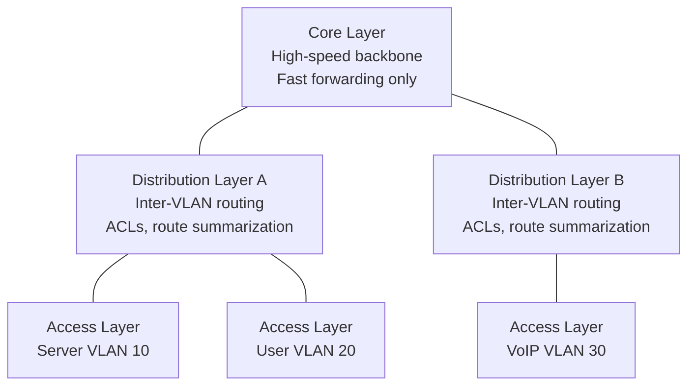
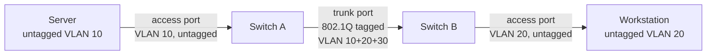
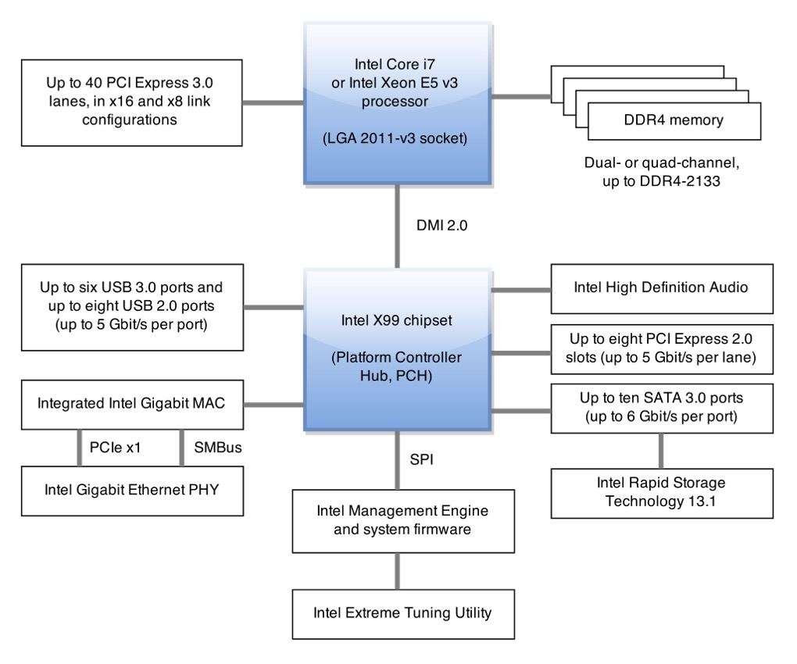
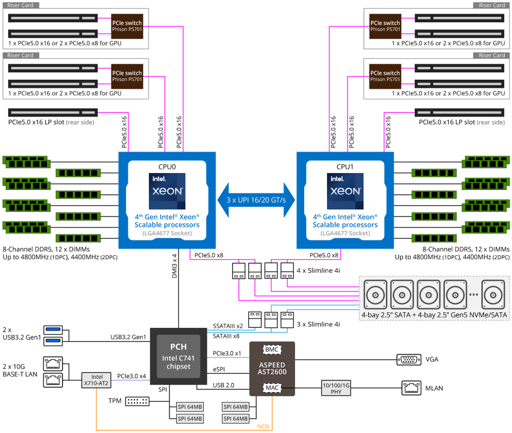
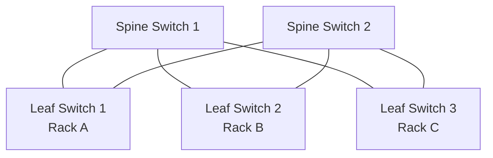
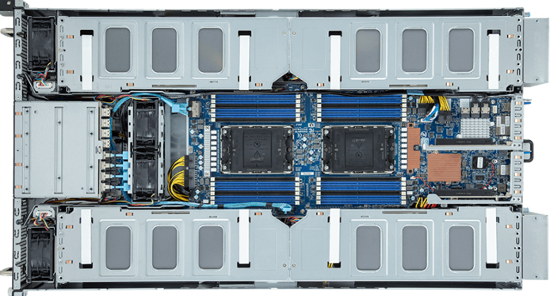
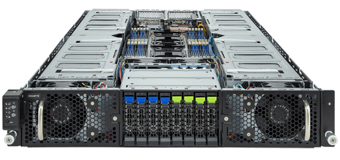
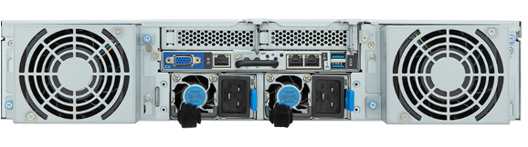
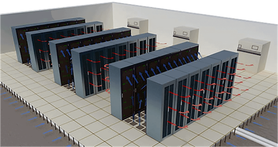

import { Aside } from '@astrojs/starlight/components';
import HistoricalNote from '/src/components/HistoricalNote.astro';

{/* ai-summary
type: lecture
slug: on-premises-infrastructure
order: 19
covers: hierarchical three-tier network design; VLANs and 802.1Q trunking; ARP security and Dynamic ARP Inspection; enterprise Wi-Fi and 802.1X; DHCP relay and reservations; OSPF; BGP; link aggregation; underlay vs overlay; server CPU platforms (EPYC/Xeon); NUMA; custom silicon (ARM Graviton/Cobalt/Axion, Grace Hopper, TPU, Trainium); ECC/RDIMM memory; storage interfaces (SATA/SAS/NVMe/NVMe-oF); DAS/NAS/SAN; NFS/SMB; RAID and ZFS; server specialization; spine-leaf topology; data center design
prereq_lectures: hardware-fundamentals, virtualization-basics, container-orchestration, networking-fundamentals
followup_lectures: documentation-teamwork-wrap-up
paired_activities: cisco-packet-tracer, storage-planning
supports_labs:
*/}

Cloud infrastructure looks like magic until the bill arrives or a region goes down. Every EC2 instance is a physical server in a data center, connected by real cables to real switches, with cooling, power, and a network fabric that determines whether a workload runs smoothly or thrashes against hardware limits. When a cloud provider introduces a new instance type with higher network throughput, or adds a storage performance tier, those decisions reflect physical constraints at the hardware layer. When latency spikes without explanation, the cause often traces to a hardware decision made by the person who racked the server years ago.

Many organizations also run infrastructure on-premises: offices with local servers, colocation facilities, on-premises Kubernetes clusters, or hybrid deployments that extend cloud VPCs to physical sites. In those environments, you manage the network topology, the switch configuration, and the server hardware yourself. This lecture covers that full stack. The first half addresses physical network design, from the three-tier switch hierarchy through VLANs, wireless networking, DHCP, and enterprise routing protocols. The second half covers server hardware: CPU platforms, custom silicon, memory, storage, server specialization, high-speed networking, and data center design. Together, they describe the physical layer that cloud providers operate and that on-premises teams manage directly.

## Hierarchical network design

Large networks are difficult to manage as a single flat layer. The Cisco hierarchical model organizes a network into three functional layers, each with a distinct role.

**The Access Layer** is where end devices connect to the network. It handles layer-2 switching, port security, QoS classification and marking (identifying and labeling traffic so the network knows what to prioritize), ARP inspection (preventing ARP spoofing attacks), VLAN assignment, spanning tree, and Power over Ethernet (PoE) for devices like VoIP phones and wireless access points.

**The Distribution Layer** aggregates traffic from access switches and mediates between switching (layer 2) and routing (layer 3). It enforces policy-based security using access control lists (ACLs), provides routing between VLANs and between different routing domains, handles redundancy and load balancing, and controls broadcast domains. Routers and layer-3 switches do not forward broadcast traffic, so the distribution layer acts as a boundary between broadcast domains. Route summarization here keeps the core routing tables compact: instead of advertising four `/24` subnets separately, the distribution layer can advertise a single `/22` summary route to the core.

**The Core Layer** is the network backbone: the high-speed switching fabric interconnecting distribution devices. It prioritizes fast transport and fault tolerance over feature richness. CPU-intensive tasks such as security inspection, QoS classification, and deep packet inspection are deliberately avoided at this layer; the goal is forwarding as fast as possible with maximum reliability.

In small-to-medium networks, the distribution and core layers are often collapsed into a single layer-3 switch, reducing hardware cost while preserving the logical separation between access and routing functions.



## VLANs and network segmentation

The Networking Fundamentals lecture introduced VLANs as a way to segment a switch into multiple logical broadcast domains. In company networks, the operational question is how that segmentation is implemented on real switch ports and what breaks when a port is assigned incorrectly.

On tagged links in a VLAN-aware network, Ethernet frames carry an [802.1Q tag](https://en.wikipedia.org/wiki/IEEE_802.1Q), a small header inserted after the source MAC address that identifies which VLAN the frame belongs to. Switch ports operate in one of two modes.

**Access ports** connect to end devices such as servers, workstations, and printers. The switch assigns all traffic on an access port to a single VLAN and strips the 802.1Q tag before delivering the frame to the device. The device never sees the tag. Traffic on an access port is untagged: no VLAN ID is present in the Ethernet frame, so untagged traffic on a port can only belong to one VLAN.

**Trunk ports** connect switches to each other or to routers. A trunk carries traffic for multiple VLANs simultaneously, preserving the 802.1Q tag (a 4-byte addition to each Ethernet frame containing the VLAN ID) so the receiving switch knows which VLAN each frame belongs to. This is the only way to carry multiple VLANs on a single physical cable.



A common source of VLAN-related trouble: a patch cable moved to a different switch port that is configured for the wrong VLAN. The server's IP address is correct, but it is now in a broadcast domain that cannot reach the gateway. You can verify VLAN membership from the switch CLI or, on the server side, by checking whether ARP resolution works for the gateway:

```bash
ip neighbor show
```

If the gateway entry is missing or marked `FAILED`, the server cannot reach it at layer 2. That points to a VLAN mismatch, a bad cable, or a misconfigured switch port before you ever touch IP configuration.

To route traffic between VLANs, you need a layer-3 device, either a router or a layer-3 switch, configured with an interface or sub-interface in each VLAN. Without inter-VLAN routing, hosts on different VLANs simply cannot communicate regardless of their IP configuration.

## ARP Security and Dynamic ARP Inspection

The Networking Fundamentals lecture introduced the Address Resolution Protocol (ARP) as the layer-2 mapping that lets a host send a packet to an IP address on its own broadcast domain. The protocol works because every host on the segment trusts every other host's announcements at face value. That same trust gives ARP a security dimension that becomes operational at the access layer, where unauthorized devices may plug into switch ports.

**ARP spoofing** (also called ARP poisoning) exploits the fact that ARP has no authentication. Any host on a broadcast domain can send a gratuitous ARP reply claiming any IP address, including the default gateway's. A malicious host that does this causes other devices on the segment to update their ARP caches and send traffic intended for the gateway to the attacker instead, creating a man-in-the-middle position or a denial of service. Neither is visible at the IP layer: routing tables look fine, `ping` succeeds, traffic just silently passes through an extra host.

Managed switches mitigate this with **Dynamic ARP Inspection (DAI)**. The switch builds a trusted binding table from DHCP snooping (the switch watching DHCP exchanges to record which IP addresses were leased to which MAC addresses on which ports), and validates every ARP reply against it. A reply claiming that `10.0.1.1` belongs to a MAC address not in the binding table is dropped. Servers with statically configured addresses must have manual bindings added to the DAI table, or their own ARP packets will be dropped as untrusted: this is one of the more common DAI rollout footguns, where a newly hardened access switch breaks specific servers that nobody remembered were not using DHCP. DAI is a standard hardening step on access-layer switches in environments where unauthorized devices could plug into switch ports, paired with **port security** (limiting how many MAC addresses a port will learn) and **802.1X authentication** (requiring devices to authenticate before being granted access to a VLAN at all).

## Wireless networking

Wireless networking adds complexity because the physical medium is shared, unpredictable, and invisible. Understanding a few core concepts helps you deploy and troubleshoot Wi-Fi efficiently.

### Standards and bands

The [802.11 family of standards](https://en.wikipedia.org/wiki/IEEE_802.11) defines how Wi-Fi operates. The most relevant standards today are 802.11ac (Wi-Fi 5) on the 5 GHz band and 802.11ax (Wi-Fi 6) on the 2.4 GHz and 5 GHz bands. Wi-Fi 6E extends the same 802.11ax protocol into the 6 GHz band where regulators permit it. Older standards like 802.11n (Wi-Fi 4) are still common in legacy environments.

The 2.4 GHz band offers longer range but only three non-overlapping channels (1, 6, and 11 in North America). The 5 GHz band provides more channels and higher throughput but shorter range. In a dense office, 5 GHz is usually preferable because the additional channels reduce co-channel interference. The 6 GHz band provides substantially more non-overlapping channels and is well-suited to high-density deployments where client devices and local regulations support it.

### Channels and interference

When two nearby access points transmit on the same channel or on overlapping channels, they compete for airtime and degrade each other's performance. On 2.4 GHz, only channels 1, 6, and 11 are non-overlapping in North America. Always use one of these three; using channel 3 or 9 partially overlaps adjacent channels and creates worse interference than sharing a standard channel, because collisions affect both channels simultaneously.

<Aside type="caution" title="2.4 GHz Interference Sources">
Microwave ovens, Bluetooth devices, and cordless phones all operate near 2.4 GHz. If users report intermittent Wi-Fi problems in a break room or kitchen, interference from appliances is a likely culprit. Prefer 5 GHz or 6 GHz in those environments.
</Aside>

### Access point placement

When deploying wireless access points in a building, start with a site survey: understanding the physical layout, wall materials (concrete and metal attenuate signals significantly), and expected user density determines both how many APs are needed and where to place them. A dense lecture hall and an empty corridor require very different coverage plans.

Every AP in the same area should transmit on a different non-overlapping channel. Configure all APs with the same SSID and credentials so clients roam automatically to the strongest signal without user intervention. Disabling the lowest data rates (1 and 2 Mbps) that APs advertise for backwards compatibility is a simple change that fixes a common complaint: a device that latches onto a distant AP at 1 Mbps rather than roaming to a nearby AP at full speed. Modern enterprise APs include automatic power and channel adjustment to adapt to congestion and interference, reducing the need for manual tuning after initial deployment.

For user segmentation, map different SSIDs to different VLANs. Staff, students, and guests can share the same physical AP infrastructure while their traffic is separated at the switch, giving each group independent firewall policies and network access controls without additional hardware.

### Enterprise wireless security

For organizational networks, WPA2-Enterprise or WPA3-Enterprise is the standard. These protocols authenticate each user individually via [802.1X](https://en.wikipedia.org/wiki/IEEE_802.1X) and a RADIUS server (Remote Authentication Dial-In User Service, a centralized protocol for verifying network access credentials), rather than sharing a single pre-shared key across all users. Individual authentication means you can revoke access for a single person without changing the password for everyone.

WPA3-SAE improves on PSK by providing forward secrecy and resistance to offline dictionary attacks, but enterprise authentication remains the gold standard for organizational networks. If your organization still uses WPA2-PSK, rotate the key regularly and treat it as a credential that must be protected.

## DHCP: dynamic addressing

The Networking Fundamentals lecture covered the DORA exchange that delivers an IP address to a client. In company networks, the harder questions are where that broadcast traffic can and cannot go, when a relay agent is required, and how to keep critical devices on predictable addresses.

### Operational constraints

DHCP starts as a broadcast, so clients normally need the server to be on the same broadcast domain unless a router or layer-3 switch is configured as a DHCP relay agent. The relay agent forwards the broadcast to the DHCP server as a unicast packet, and the server's response travels back through the relay to the client. Without a relay, clients on a different VLAN or subnet never receive a response. Lease duration matters operationally as well: short leases create more renewal traffic, while very long leases mean addressing mistakes and moved devices take longer to correct automatically.

### Static vs. dynamic allocation

Servers, network printers, and infrastructure devices should use static allocation: either a manually configured IP address or a DHCP reservation that always assigns the same address based on the device's MAC address. Workstations and mobile devices typically use dynamic allocation from a pool.

<Aside type="note" title="DHCP Reservations">
DHCP reservations give you the convenience of DHCP (centralized configuration, logged in one place) with the predictability of static addressing. Use them for any device that other systems need to reach by IP address.
</Aside>

If a server recently lost power and came back up without a reservation, it may have received a different IP address from the dynamic pool. Any DNS records or firewall rules pointing to the old address would now be wrong. This is exactly why servers should use static allocation or DHCP reservations rather than drawing from the general pool.

## Enterprise routing and connectivity

Static routes work for small, stable networks. Once a network grows to multiple sites, multiple routers, or dynamic paths, you need routing protocols that automatically exchange reachability information and adapt when paths change.

### OSPF and BGP

**OSPF (Open Shortest Path First)** is the interior routing protocol you are most likely to encounter in on-premises enterprise networks. It is a link-state protocol: each router builds a complete map of the network topology, calculates the shortest path tree, and sends only incremental updates when topology changes. OSPF converges quickly after a failure and supports hierarchical design through its area concept, which keeps routing tables compact as networks grow. It is an open standard and runs on nearly every enterprise router and layer-3 switch. OSPF is what lets the distribution switches in a three-tier design automatically learn routes from each other without manual static route configuration.

**BGP (Border Gateway Protocol)** is the routing protocol of the internet and appears in enterprise environments in two specific contexts. The first is multi-homing: when your network connects to more than one ISP, BGP lets you announce your IP block to both and control routing preferences. The second is cloud connectivity: AWS Direct Connect and Azure ExpressRoute both use BGP to exchange routes between your on-premises network and your cloud VPC. BGP also appears inside Kubernetes clusters when a CNI plugin advertises pod CIDRs to the physical network, making pod IP addresses routable from outside the cluster without an overlay encapsulation step. BGP is a path-vector protocol designed for routing between autonomous systems, and its configuration is significantly more complex than OSPF; in most on-premises environments, you encounter BGP at the edge rather than inside the campus network.

### Link aggregation

**Link Aggregation (LAG)**, defined by the 802.3ad standard and also called LACP (Link Aggregation Control Protocol), bonds multiple physical network interfaces into a single logical interface. Two 10 Gbps links bonded together present as one 20 Gbps interface to the operating system. Beyond throughput, LAG provides redundancy: if one physical link fails, traffic shifts to the remaining links without interruption. On Linux, bonded interfaces are managed via `systemd-networkd` or NetworkManager. You will encounter LAG on server NICs connecting to switches, and on the uplinks between access and distribution switches where aggregate bandwidth matters most.

### Underlay and overlay

The physical network infrastructure you operate, the switches, routers, and WAN links, is the **underlay**: the ordinary IP network that actually moves packets. Systems such as SD-WAN and most container network plugins build an **overlay** on top, encapsulating traffic so a logical network can span many physical segments.

Kubernetes east-west traffic illustrates this clearly. Depending on the CNI plugin, pod traffic may ride a VXLAN overlay, where pod packets are wrapped inside UDP packets and decoded at the destination node, or it may use BGP to advertise pod CIDRs directly into the underlay without encapsulation. When cluster networking breaks, a good operator asks first whether the overlay is broken or whether the underlay never had a valid path. A VXLAN overlay cannot function if nodes cannot reach each other on the UDP port VXLAN uses; a BGP-based CNI cannot function if the physical network refuses to propagate pod CIDRs. Understanding the physical network topology matters even when you are debugging a Kubernetes networking problem.

## Server CPU Platforms

Consumer CPUs (Ryzen, Core i-series) are optimized for single-socket operation, low idle power, and burst performance. Server CPUs are a different product line designed for continuous multi-threaded load, multi-socket configurations, very large memory capacities, and long product lifecycles. The two dominant server CPU families are **AMD EPYC** (SP5 socket) and **Intel Xeon** (LGA4677 socket). Both support ECC RDIMMs and LRDIMMs, many more memory channels than consumer platforms (up to 12 channels on high-end EPYC), and PCIe lane counts that consumer chipsets cannot match.

<div class="**:mx-auto">
  
</div>
<p class="text-center italic text-sm m-0 p-0">Modern <a href="https://en.wikipedia.org/wiki/Intel_X99" target="_blank" rel="noopener noreferrer">Intel X99</a> from Wikipedia</p>

Multi-socket servers introduce **Non-Uniform Memory Access (NUMA)**. In a two-socket system, each CPU has local memory banks it can access at full speed, and remote memory banks on the other socket that it must reach over an inter-socket interconnect (AMD Infinity Fabric or Intel UPI). The latency difference between local and remote memory is typically 2-3x. Applications that are not NUMA-aware may run significantly slower if the OS schedules threads across sockets or allocates memory on the remote node. Linux tools `numactl` and `numastat` expose NUMA topology and allow you to pin processes and memory allocation to a specific node.

<Aside type="tip" title="Reading a Server Spec Sheet">
An AMD EPYC 9354P spec sheet lists 32 cores, 128 PCIe 5.0 lanes, and 12 memory channels supporting up to 3 TB of DDR5 ECC RDIMM. The "P" suffix means single-socket. A dual-socket board using two 9354 (no P) CPUs doubles core count, memory bandwidth, and PCIe lanes, but the OS now sees two NUMA nodes. Any workload that allocates large buffers should be tested with `numactl --interleave=all` to confirm whether cross-socket memory access is causing latency.
</Aside>

## Beyond x86: Custom Silicon and the New Server Landscape

For most of computing history, "server CPU" meant Intel Xeon or (later) AMD EPYC. That assumption no longer holds. Hyperscalers and major vendors now design and manufacture their own chips, driven by workload specialization, cost control, and the strategic value of silicon independence. As a sysadmin, you will operate hardware built on many of these platforms.

### ARM-based server CPUs

The original dominance of x86 in the server market came from software compatibility and manufacturing scale, not architectural superiority. ARM's 64-bit server ISA (AArch64) delivers competitive performance per watt and has attracted both hyperscaler investment and independent CPU vendors.

**Amazon Graviton** is AWS's in-house ARM server CPU, now in its fourth generation. Graviton4 (2024) uses 96 Neoverse V2 cores, supports up to 3 TB of DDR5 ECC memory, and is available across a wide range of EC2 instance types. AWS consistently reports 40-60% better price-performance for Graviton vs. comparable x86 instances for workloads compiled or containerized for ARM. Because you build your containers once and target an architecture, porting to Graviton is often as simple as a recompile.

**Ampere Altra / Altra Max** is a third-party ARM server CPU aimed at cloud-native workloads. Altra Max scales to 128 cores per socket, with high memory bandwidth and a focus on consistent, predictable performance. It powers some Oracle Cloud and Microsoft Azure instances.

**Microsoft Cobalt 100** is Microsoft's ARM Neoverse N2-based processor for Azure virtual machine infrastructure, purpose-built for cloud-native Linux workloads.

**Google Axion** is Google's ARM Neoverse V2-based CPU for GCP compute instances, analogous to Amazon Graviton.

### Custom AI accelerators and hybrid packages

**NVIDIA** is no longer just a GPU company. The **Grace CPU** (an ARM Neoverse V2 design) can be combined with an H100 or H200 GPU on a single module called the **Grace Hopper Superchip**. The CPU and GPU share a 900 GB/s NVLink-C2C interconnect rather than the 64-128 GB/s of a typical PCIe 5.0 link, and they use a common coherent memory space. This eliminates the copy overhead that limits traditional discrete CPU and GPU systems and is designed specifically for large-model AI inference and scientific computing. The **Blackwell** generation (GB200) extends this to clusters of NVLink-connected superchips.

**Google TPU (Tensor Processing Unit)** chips are matrix multiply ASICs designed specifically for training and serving neural networks. TPU v4 pods contain 4,096 chips interconnected by a custom 3D torus network. TPUs are not general-purpose; they run a narrower programming model (XLA/JAX) optimized for Google's own frameworks.

**Amazon Trainium and Inferentia** are AWS's own AI chips, competing with NVIDIA for ML training (Trainium2) and inference (Inferentia2) workloads, exposed as `trn1` and `inf2` EC2 instance families. They run models through the Neuron SDK, which compiles PyTorch and TensorFlow graphs for the custom architecture.

**Microsoft Maia 100** is Microsoft's AI accelerator for Azure, targeting large-language model training and inference for Azure OpenAI Service. Like TPUs and Trainium, it is designed for specific workloads, not general compute.

### What this means for sysadmins

The practical takeaway is that the server CPU market is no longer a duopoly. When you provision cloud infrastructure, you should evaluate whether ARM instances (Graviton, Cobalt, Axion) or specialized accelerators offer better cost-performance for your specific workload. On-premises, AMD EPYC and Intel Xeon remain the defaults, but ARM-based options from Ampere are beginning to appear in managed products like edge servers and NAS appliances.

<Aside type="note" title="Checking Architecture in Linux">
`uname -m` reports `x86_64` on Intel/AMD and `aarch64` on ARM servers. Container images must match the host architecture unless emulation (QEMU) is used, which carries a significant performance penalty. Always build and push multi-arch images (`docker buildx`) for workloads that may run on both.
</Aside>

## Memory Architectures: ECC and Registered DIMMs

Memory reliability and speed are crucial for both performance and data integrity at the server scale. Modern systems use several types of memory modules, each with trade-offs.

**Error-Correcting Code (ECC)** memory adds extra bits to detect and correct single-bit errors, protecting against silent data corruption from cosmic rays or electrical noise. Without ECC, a single bit flip in a running virtual machine's memory can silently corrupt data in ways that are nearly impossible to diagnose after the fact.

**Registered DIMMs (RDIMM/LRDIMM)** use a register chip to stabilize signals, allowing servers to support more memory modules at higher capacities. Unbuffered DIMMs (UDIMM) connect directly to the memory controller, offering lower latency but less scalability. Most platforms support either UDIMM or RDIMM, not both, and mixing them will prevent the system from starting.

ECC and RDIMM are especially important in servers, virtualization hosts, and scientific computing, where data integrity and large memory footprints matter. Consumer desktops and laptops often prioritize lower latency and cost, using UDIMM and non-ECC memory.

<Aside type="tip" title="Choosing Memory for a Homelab Server">
If you are building a virtualization server for home or research use, ECC RDIMM lets you run many virtual machines with confidence that memory errors will not silently corrupt your data. Attempting to mix UDIMM and RDIMM, however, will prevent the system from booting.
</Aside>

## Enterprise Storage: Media, Interfaces, and Data Integrity

The Hardware Fundamentals lecture covers the basics of HDD and SSD technology: spinning platters, NAND flash, wear leveling, TRIM, and SMART monitoring. At the server and data center scale, the focus shifts to interface selection, density, hot-swap support, and the data integrity mechanisms that protect against silent corruption.

### SATA, SAS, and NVMe: choosing the right interface

| Interface | Representative throughput | Duplex | Hot-Swap | Use Case |
|---|---|---|---|---|
| **SATA III** | ~600 MB/s | Half | Backplane-dependent | Budget servers, bulk storage |
| **SAS-3 (12G)** | ~1,200 MB/s | Full | Yes (SAS expanders) | High-density enterprise storage |
| **SAS-4 (24G)** | ~2,400 MB/s | Full | Yes | Tier-1 storage arrays |
| **NVMe (PCIe 4.0 x4)** | ~7,000 MB/s | Full | Via U.2/U.3 backplane | Low-latency databases, AI |
| **NVMe-oF** | Fabric-dependent | Full | N/A | Disaggregated storage over fabric |

Full-duplex means SAS can read and write simultaneously on the same link, unlike SATA which is half-duplex. This matters in high-throughput server workloads where concurrent reads and writes are common. **SAS expanders** allow a single HBA to address up to 256 drives, making SAS the traditional choice for high-density storage enclosures.

**NVMe over Fabrics (NVMe-oF)** extends the NVMe protocol across a network, making remote SSDs appear as locally attached block devices with near-local latency. NVMe-oF transports include RDMA (RoCE, iWARP, InfiniBand), Fibre Channel, and TCP. Storage disaggregation using NVMe-oF is increasingly common in hyperscale and cloud deployments where compute and storage nodes are separate.

Hot-swapping, replacing a drive without powering down the system, is supported on SAS and enterprise SATA backplanes and is essential in production environments. Consumer SATA typically does not guarantee safe hot-swap.

### Direct-attached, network-attached, and storage area networks

The three storage attachment models differ in where the network boundary falls relative to the storage device.

**Direct-Attached Storage (DAS)** is storage connected directly to a single host: internal drives, an external SAS enclosure, or a JBOD shelf. It provides the fastest access and no network overhead, but is accessible only to the attached host.

**Network-Attached Storage (NAS)** is a device or cluster that presents a filesystem over a standard TCP/IP network. The two dominant NAS protocols are NFS and SMB. **NFS (Network File System)**, developed by Sun Microsystems, is the standard in Linux and UNIX environments; NFSv4 adds stronger security and operational improvements over older NFSv3, which lacks native encryption and is a poor choice on untrusted networks. **SMB (Server Message Block)** is the standard in mixed-OS environments; SMB 3.x adds encryption and stronger authentication and is now the default file-sharing protocol on macOS and Windows. Multiple clients can access the same NAS simultaneously, making it appropriate for file shares, home directories, and backups at small-to-medium scale.

**Storage Area Networks (SANs)** use a dedicated high-speed fabric (Fibre Channel, iSCSI, or NVMe-oF) to present raw block-level storage to servers. A server with a SAN-attached LUN (Logical Unit Number) sees it as a locally attached block device and formats its own filesystem on top. SANs are used in enterprise environments for databases and virtual machine storage pools because they deliver high throughput, low latency, and failover capability that NAS cannot match at that scale.

| | SAN | NAS |
|-|-----|-----|
| Storage type | Block | File |
| Network | Fibre Channel / iSCSI | TCP/IP Ethernet |
| Performance | High | Moderate |
| Cost and complexity | High | Low |
| Use case | Databases, VM datastores | File shares, backups, home directories |

Network storage failures have distinctive signatures that differ from ordinary network connectivity failures. An NFS mount that succeeded during provisioning may go stale after a network partition: the server is reachable, the mount point exists, but read and write operations block indefinitely until the kernel times out. The NFS mount options `soft` and `hard` control this behavior: a `soft` mount returns an error after a timeout, while a `hard` mount retries forever, protecting data integrity but risking hung processes. SMB authentication failures typically manifest as "access denied" rather than a timeout, often because a Kerberos ticket has expired or the client's domain membership does not match the server's ACL. SAN failures are more abrupt: if a Fibre Channel HBA loses zoning or an iSCSI session drops, block devices disappear from the OS and filesystems on them go read-only to prevent corruption. The right diagnostic tools are `multipath -ll` for multipath state and `iscsiadm -m session` for iSCSI sessions, not `ping` or `dig`.

### Data integrity: RAID, ZFS, and Btrfs

Traditional **Redundant Array of Independent Disks (RAID)** combines multiple drives for redundancy or performance, but does not provide end-to-end data integrity; silent errors can go undetected, especially during rebuilds. Modern filesystems like **ZFS** and **Btrfs** use copy-on-write and checksumming to detect and correct errors, offer built-in redundancy, and support features like snapshots and scrubbing for ongoing health checks.

RAID levels serve different goals:

- **RAID 0** (striping): data is split across drives for speed, with no redundancy; any drive failure loses all data.
- **RAID 1** (mirroring): identical data on two or more drives; full redundancy but capacity equals the smallest drive.
- **RAID 5** (striping with parity): data and a single parity block are distributed across three or more drives; survives one drive failure.
- **RAID 6**: like RAID 5 but with two parity blocks; survives two simultaneous drive failures.
- **RAID 10** (1+0): mirrored pairs that are then striped; good performance and redundancy but requires at least four drives and wastes half capacity.

Parity in RAID 5/6 is computed using XOR across the data blocks on each stripe. If drive B fails, its content can be reconstructed as XOR(block A, block C, parity). RAID with a single parity disk tolerates one failure; double parity (RAID 6) tolerates two.

| | Software RAID | Hardware RAID |
|---|---|---|
| **Where it runs** | OS kernel (e.g., Linux `mdadm`) | Dedicated RAID controller card |
| **CPU usage** | Uses host CPU for parity/rebuild | Offloaded to controller |
| **Cost** | Free (included in OS) | More expensive |
| **Flexibility** | Easy to move arrays between systems | Vendor lock-in; controller failure can trap data |
| **Best for** | NAS, small/medium workloads | Performance- and reliability-critical environments |

Software RAID is often the better choice for home labs and small deployments using ZFS or Btrfs, which provide their own RAID-like implementations (RAID-Z, mirrors) with the added benefit of checksumming. Hardware RAID is common in enterprise servers where consistent write performance and boot-from-array support matter.

| **Feature** | **RAID (Traditional)** | **ZFS/Btrfs** |
|---|---|---|
| **Redundancy** | Yes (RAID 1/5/6/10) | Yes (mirrors, RAID-Z, etc.) |
| **Checksumming** | No | Yes (detects/corrects errors) |
| **Silent Data Corruption** | Possible | Detected and self-healed |
| **Snapshots** | No | Yes |
| **Online Expansion** | Limited | Yes (with caveats) |
| **Backup Replacement** | No | No |

<Aside type="tip" title="RAID vs. Backup">
If a RAID 1 array loses a disk and, during the rebuild, a directory is accidentally deleted, the deletion is instantly mirrored to the surviving disk. Only an external backup can restore it. Redundancy is not backup.
</Aside>

Operational best practices include maintaining separate, versioned, offline or offsite backups. Schedule regular scrubs (ZFS/Btrfs) to catch errors early, label drive bays for easy replacement, and monitor SMART data for signs of impending failure.

## Server Specialization by Workload

"Server" is a generic term. In production environments, different classes of server hardware are optimized for different workloads. Understanding these categories helps you match hardware to requirements and interpret vendor product lines.

### Compute servers and virtualization hosts

Standard 1U and 2U rackmount servers with dual-socket CPUs, a large amount of RAM, and a small number of NVMe boot and scratch drives are the workhorses of most data centers. As **virtualization hosts** (hypervisor nodes running VMware ESXi, Proxmox, or KVM), they are maximized for RAM capacity (to host many VMs) and CPU core count (to share cores across VMs without contention). A typical dense virtualization node might have 2 × AMD EPYC 9354P (64 cores total), 768 GB of DDR5 ECC RDIMM, and 4 NVMe drives for VM images.

**Blade servers** pack compute nodes (blades) into a shared chassis that provides common power, cooling, and networking backplane. Each blade is a thin compute module; the chassis aggregates network uplinks, reducing per-node cable count. The trade-off is vendor lock-in (blades from one vendor rarely fit another's chassis) and limited per-blade expansion.

### Storage servers and JBOD/JBOF enclosures

A **storage server** prioritizes drive count over CPU and RAM. A 4U storage server may hold 60-90 3.5" drives on a SAS/SATA expander backplane, with a modest dual-socket CPU and a pair of 10/25 GbE or Fibre Channel NICs. Storage servers run operating systems like TrueNAS (ZFS-based), Ceph, or Windows Server with Storage Spaces Direct.

A **JBOD (Just a Bunch of Disks)** is a disk enclosure with no embedded compute: it presents drives directly to an attached server over SAS or NVMe, leaving RAID and filesystem logic entirely to the host. A **JBOF (Just a Bunch of Flash)** is the NVMe equivalent, housing dozens of NVMe SSDs in a disaggregated enclosure connected to servers over NVMe-oF. These form the storage backend of Ceph clusters, large-scale object stores, and distributed databases.

### AI/GPU servers

AI training and inference workloads require high-density GPU configurations and the interconnects to match. A purpose-built AI server such as the **NVIDIA DGX H100** hosts 8 × H100 SXM GPUs, connected to each other via **NVLink** (900 GB/s bidirectional per GPU pair) and to the host CPU over **PCIe 5.0**. The chassis provides 10 kW of power capacity and liquid cooling.

**Inference servers** are configured differently from training servers: lower-tier GPUs (NVIDIA L4, L40S) or purpose-built accelerators (AWS Inferentia, Google TPU v5e) offer better cost per query for serving trained models, because inference workloads are latency-bound and benefit from higher parallelism across smaller accelerators rather than fewer high-memory training GPUs.

<div class="**:mx-auto">
  
</div>
<p class="text-center italic text-sm m-0 p-0">2U HPC/AI Server <a href="https://www.gigabyte.com/Enterprise/GPU-Server/G293-S41-AAP1" target="_blank" rel="noopener noreferrer">G293-S41-AAP1</a> from GIGABYTE</p>

### Edge servers

An **edge server** runs close to users or sensors: in a remote office, a retail location, a telecom central office, or an industrial site. The requirements diverge sharply from data center servers: small form factor (often Mini-ITX or short-depth 1U), wide operating temperature range, vibration tolerance, no moving storage parts, and often a fanless design. Edge servers typically run a subset of data center workloads: local inference, data aggregation before upload, or OT/IoT integration.

## High-Speed Networking and Data Center Fabrics

As compute density increases and storage disaggregates over the network, the network fabric itself becomes a critical hardware layer. The networking requirements of a data center are fundamentally different from a campus LAN.

### Ethernet speed tiers

Consumer and small office equipment operates at 1 GbE. Servers and storage have moved well beyond this:

| Speed | Common Use |
|---|---|
| **10 GbE** | Basic server uplinks, storage replication, legacy data centers |
| **25 GbE** | Standard modern server NIC (replaces 10 GbE in new deployments) |
| **40 GbE** | Older aggregation and storage; largely replaced by 100 GbE |
| **100 GbE** | Top-of-rack switch uplinks, storage servers, GPU cluster nodes |
| **400 GbE** | Spine switches, hyperscale core, AI cluster interconnects |
| **800 GbE / 1.6 TbE** | Emerging standards for next-generation AI clusters |

A standard modern server ships with a dual-port 25 GbE NIC for primary data traffic, and a separate 1 GbE or 10 GbE port dedicated to the BMC (Baseboard Management Controller) out-of-band management network.

### RDMA, RoCE, and InfiniBand

Standard Ethernet networking requires the CPU to copy data between application memory and network buffers, consuming CPU cycles and adding latency. **Remote Direct Memory Access (RDMA)** allows a NIC to write data directly into the remote host's memory without involving the remote CPU, reducing latency to microseconds and CPU overhead to near zero.

**InfiniBand (IB)** is the original RDMA fabric, still dominant in HPC clusters. HDR InfiniBand runs at 200 Gbps per port; NDR at 400 Gbps. InfiniBand requires dedicated switches and HCAs (Host Channel Adapters) but offers the lowest possible latency.

**RoCE (RDMA over Converged Ethernet)** runs the same RDMA protocol (IB transport) over standard Ethernet hardware. RoCEv2 is now widely deployed in AI clusters; NVIDIA uses RoCE to interconnect NIC-attached GPU nodes in its SuperPOD reference design. RoCE requires PFC (Priority Flow Control) and ECN (Explicit Congestion Notification) for lossless behavior.

**iWARP** is RDMA over TCP/IP. It has lower performance than RoCE but works on any Ethernet network without lossless configuration.

### SmartNICs and DPUs

A **SmartNIC** is a NIC with an embedded ARM CPU and programmable packet processing logic. A **DPU (Data Processing Unit)** extends this further into a complete system-on-chip capable of running a general-purpose OS alongside its network processing. NVIDIA BlueField-3 and Intel IPU (Infrastructure Processing Unit) are the main examples.

DPUs offload infrastructure functions from the host CPU: overlay networking (VXLAN, GENEVE), storage encryption, firewall rules, hypervisor vSwitch, and telemetry. In cloud environments, placing the hypervisor network stack on a DPU frees the entire host CPU budget for tenant workloads. AWS Nitro Cards are a well-known production example of this architecture: they offload the network, storage, and security planes from the host to dedicated silicon, which is how AWS can offer bare-metal instances at the same price as virtualized ones.

### Spine-leaf topology and oversubscription

Traditional three-tier data center networks (core, distribution, access) are replaced by **spine-leaf** (also called fat-tree or Clos) topologies in modern data centers. Every leaf switch connects to every spine switch; no two leaf switches connect directly. This ensures any leaf-to-leaf path is always exactly two hops, providing predictable and uniform latency across the fabric.



**Oversubscription ratio** is the ratio of total downlink bandwidth (to servers) to total uplink bandwidth (to spine). A 4:1 ratio means four servers sharing a single server's worth of uplink capacity. For most workloads this is acceptable; AI training clusters that do heavy gradient synchronization may require 1:1 (non-blocking) fabric to avoid communication bottlenecks during distributed training.

<HistoricalNote title="From Three-Tier to Spine-Leaf">
The traditional three-tier campus network model was designed for the traffic patterns of the 1990s and early 2000s, when most traffic flowed north-south: from user desktops to central servers and then out to the internet. The three-tier model optimized for that pattern, with a high-bandwidth core, aggregate distribution, and access switching at the edge.

Modern data center workloads flipped that pattern. Virtualization, distributed databases, Hadoop clusters, and Kubernetes nodes generate significant east-west traffic: server-to-server communication within the data center. In a three-tier design, this traffic must travel up to the core and back down, doubling hop count and creating oversubscription points. The spine-leaf (fat-tree / Clos) topology derives from telephony switching research in the 1950s by Charles Clos. It provides uniform any-to-any connectivity with predictable two-hop latency regardless of source and destination, and became the standard for data center design in the late 2000s as east-west traffic began to dominate.
</HistoricalNote>

<Aside type="tip" title="AI Cluster Network Design">
A distributed training job running on 64 GPUs does an all-reduce (gradient synchronization) after each batch. If the network is oversubscribed 4:1, the all-reduce step stalls waiting for bandwidth, turning 64 GPUs into 16 effective GPUs from a throughput perspective. Non-blocking 100 GbE RoCE fabric eliminates this bottleneck. This is why AI cluster networking is often the most expensive line item after the GPUs themselves.
</Aside>

## Server and Data Center Design: Availability, Efficiency, and Scale

As you move from single workstations to servers and data centers, priorities shift toward availability, manageability, density, and predictable power and cooling. Server hardware adds features specifically for this: ECC RDIMM and LRDIMM (Load-Reduced DIMM, which buffers the memory load further for very high capacities), multi-socket support, hot-swap backplanes, redundant power supplies and fans, and a Baseboard Management Controller (BMC) for out-of-band control such as remote power cycling and KVM access.

A complete data center deployment involves more than just servers. The full hardware stack includes racks (typically 42U standard enclosures), structured cabling (copper and fiber runs with cable management arms), cooling and ventilation (CRAC units, hot/cold aisle containment, and liquid cooling for high-density GPU nodes), power infrastructure (branch circuits, PDUs, and Uninterruptible Power Supplies), a network fabric (top-of-rack switches, spine/leaf core, and a separate out-of-band management network), and the servers themselves.

Server form factors include rackmount (1U/2U/4U), blade (ultra-dense, shared power/network), and tower (quiet, serviceable for edge or small office). Modern data centers enforce hot/cold aisle airflow and plan power using an 80% derating rule for continuous load. On a 208 V 30 A circuit (approximately 6.2 kVA), using the 80% continuous guideline gives around 5 kW usable. If a 2U storage server draws 350 W and each compute node 400 W, you can fit about 11 nodes in theory, but should deploy 8-9 to allow for growth and power spikes.

<div class="**:mx-auto **:h-64 **:w-auto **:object-contain">
  
</div>
<div class="**:mx-auto **:h-auto **:w-96 **:object-contain">
  
</div>
<div class="**:mx-auto **:h-auto **:w-96 **:object-contain">
  
</div>
<p class="text-center italic text-sm m-0 p-0">2U HPC/AI Server <a href="https://www.gigabyte.com/Enterprise/GPU-Server/G293-S41-AAP1" target="_blank" rel="noopener noreferrer">G293-S41-AAP1</a> from GIGABYTE</p>

Key availability concepts include N+1 redundancy (extra power or fan units so the failure of one does not interrupt service), hot-swap components to minimize downtime, and NUMA pinning to maintain memory locality in dual-socket nodes. Always verify component compatibility, size power for growth, and document rack layouts for future expansion.

<div class="**:mx-auto">
  
</div>
<p class="text-center italic text-sm m-0 p-0">Server Racks Organisation to Maximize Airflow</p>

## Takeaways

On-premises infrastructure means managing two converging layers: the network that connects servers and the hardware that runs workloads. They are not independent. The hierarchical network you design directly determines how servers communicate: the VLAN that isolates the storage network from user traffic, the trunk port that carries replication traffic between nodes, the DHCP reservation that gives a storage server a predictable address for NFS exports. And the hardware capabilities of the servers determine what the network must deliver: a storage server with an NVMe-oF backplane requires 100 GbE RDMA fabric; an AI training cluster with 64 GPUs requires a non-blocking spine-leaf topology, or the all-reduce step will serialize across an oversubscribed link.

Server hardware has grown significantly more varied than it was a decade ago. AMD EPYC and Intel Xeon remain the defaults for on-premises deployments, but ARM-based options from Amazon (Graviton), Google (Axion), and Microsoft (Cobalt) offer strong price-performance for cloud-native Linux workloads. Custom AI accelerators such as Google TPUs, Amazon Trainium/Inferentia, and NVIDIA Grace Hopper Superchips represent a category of hardware purpose-built for specific mathematical operations rather than general computation. ECC RDIMM memory, SAS and NVMe storage interfaces, RAID redundancy, and ZFS checksumming protect data integrity across these workloads at scales where silent corruption and drive failures are not edge cases but regular operational events.

The data center as a whole, its rack layout, cooling strategy, power budgeting, and spine-leaf fabric, is a designed system rather than an accumulation of hardware. SmartNICs and DPUs are blurring the line between network hardware and compute, taking over functions like VXLAN overlay encapsulation and storage encryption that previously ran in software on the host CPU. That shift connects directly to the Container Orchestration lecture, where the CNI plugin's VXLAN overlay may now run on a BlueField DPU rather than the host kernel. The physical layer is not static; it evolves to absorb work that software previously handled. Understanding both layers positions you to reason about where a problem actually lives, to evaluate hardware tradeoffs in purchasing decisions, and to design infrastructure that is reliable without being overbuilt.

## Resources

- <a href="https://www.youtube.com/watch?v=GR2GB6Qknlw" target="_blank" rel="noopener noreferrer">VLANs Explained (NetworkChuck, YouTube)</a>
- <a href="https://www.youtube.com/watch?v=lwArmpjGHpM" target="_blank" rel="noopener noreferrer">How To Design Your Own Enterprise Network: Cisco CCNA (YouTube)</a>
- <a href="https://www.cloudflare.com/learning/network-layer/what-is-ospf/" target="_blank" rel="noopener noreferrer">What Is OSPF? (Cloudflare, Article)</a>
- <a href="https://www.youtube.com/watch?v=TQCr9RV7twk" target="_blank" rel="noopener noreferrer">Crash Course Computer Science #19: Memory and Storage (YouTube)</a>
- <a href="https://www.youtube.com/watch?v=KN8YgJnShPM" target="_blank" rel="noopener noreferrer">Crash Course Computer Science #20: Files and File Systems (YouTube)</a>
- <a href="https://www.youtube.com/watch?v=wFCc3ts74pQ" target="_blank" rel="noopener noreferrer">A Day in the Life of the Data Centre: Racking Servers (YouTube)</a>
- <a href="https://www.youtube.com/watch?v=Kn_P9nG0zsA" target="_blank" rel="noopener noreferrer">The history of servers, the cloud, and what's next – with Oxide Computer (The Pragmatic Engineer Podcast, YouTube)</a>
- <a href="https://www.redhat.com/sysadmin/troubleshooting-slow-servers" target="_blank" rel="noopener noreferrer">Troubleshooting slow servers: CPU, RAM, and Disk I/O (Red Hat Enable Sysadmin, Article)</a>
