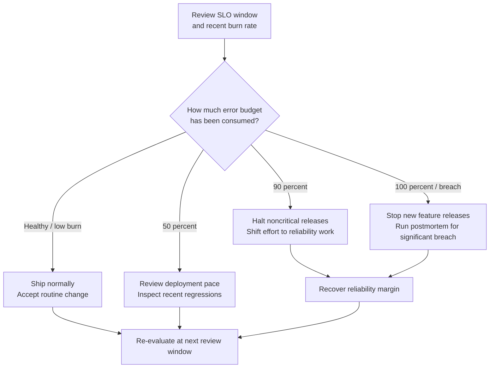
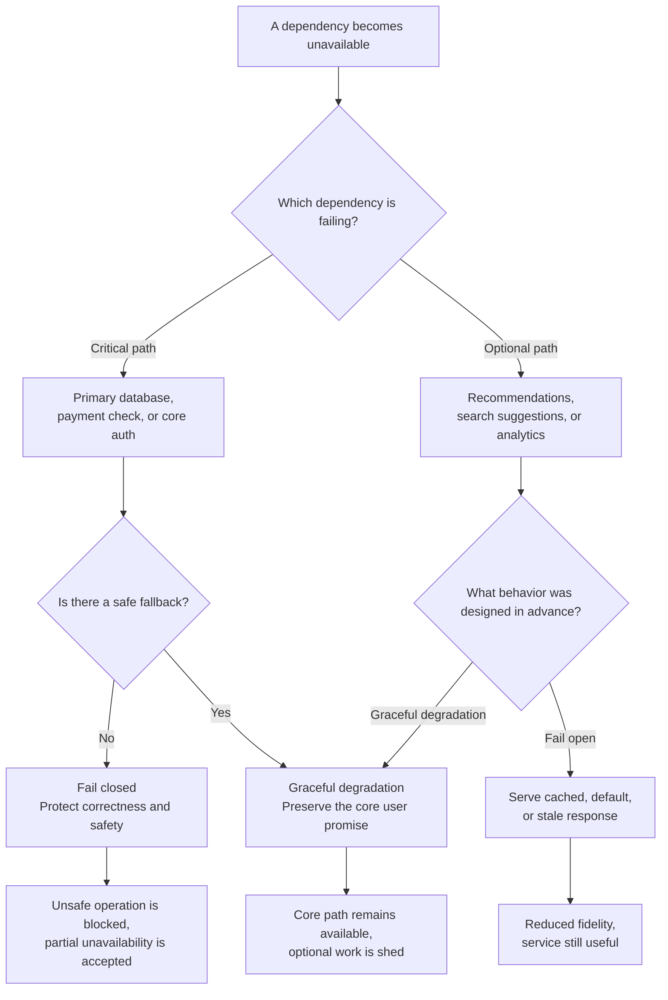

import { Aside } from '@astrojs/starlight/components';
import HistoricalNote from '/src/components/HistoricalNote.astro';

{/* ai-summary
type: lecture
slug: reliability-engineering
order: 16
covers: SRE as a discipline; toil reduction; error budgets as policy; release safety; dependency management and graceful degradation; capacity planning and overload control; on-call sustainability; chaos and disaster recovery
prereq_lectures: monitoring-and-performance, incident-response-and-postmortems
followup_lectures: on-premises-infrastructure
paired_activities: sre-practice
supports_labs: observability-workshop
*/}

Incident response tells you what to do when production breaks. Reliability engineering asks the longer question that pairs with it: how do you organize a team so production breaks less often, and so each failure costs less when it does happen? A team that responds well but invests nothing in reliability pays for the same failures again and again. A team that invests heavily in reliability but responds poorly still turns inevitable failures into long, chaotic outages.

The concepts you have encountered in the preceding weeks, including monitoring and alerting, container orchestration, configuration management, automated delivery, and structured logging, are all building blocks of that practice. The discipline that uses those blocks systematically is **Site Reliability Engineering (SRE)**, originally developed at Google and now widely adopted. SRE is not the only flavor of reliability engineering, but it is the most influential, and its vocabulary, including toil, error budgets, Service Level Objectives (SLOs), and game days, has become standard industry language. This lecture covers SRE as a discipline, the specific practices it institutionalized, and the disaster recovery work that any reliability program eventually has to take seriously.

## What SRE Is (and Is Not)

SRE is best understood as an operating model, not just as a job title. It treats reliability, operational scale, and change risk as engineering problems. The question is not only who responds when a service fails. It is what design choices, automation, measurement, and organizational policies make those failures rarer and cheaper in the first place.

<HistoricalNote title="Google Invents SRE (2003)">
Google created the first SRE team in 2003 under Ben Treynor Sloss. The company was already operating at a scale where adding more traditional operations staff would not keep pace with growth, so Google staffed service operations with software engineers and expected them to automate repetitive work away.

That origin explains the discipline's DNA. SRE was never meant to be operations with a new label. It began as an attempt to solve operational scale with code, measurement, and policy rather than with ever larger queues of manual work.
</HistoricalNote>

### SRE vs. Traditional Operations

Traditional operations teams often rely heavily on runbooks that tell engineers how to respond when things go wrong. SRE teams still use runbooks and playbooks, but they treat frequently consulted runbooks as evidence that the system should be improved or the response should be automated. This is not a criticism of runbooks (a good runbook is better than no runbook), but a statement about where improvement investment should go. A runbook that gets consulted three times a week is a signal that an automation opportunity exists.

That philosophy shows up immediately in staffing. An SRE team is composed of software engineers, and a significant fraction of their time is spent writing code that improves the reliability and operability of the services they run. Google's stated target is that SREs spend at least 50 percent of their time on engineering project work that improves the system. The rest of their time includes on-call, operational response, and other service work. If interrupt-driven operational load consistently squeezes project time below 50 percent, the team has either taken on too many services or has not invested enough in automation, and the response is to address the root condition rather than to work harder.

### SRE vs. DevOps

DevOps is a cultural and organizational philosophy: it argues that development and operations should share responsibility for the software lifecycle, that silos between "people who write code" and "people who run code" are harmful, and that continuous delivery and feedback loops improve both speed and reliability. SRE is one specific implementation of DevOps values. It provides concrete practices (error budgets, toil measurement, on-call load targets) and organizational models that give DevOps principles operational teeth.

If DevOps is the philosophy, SRE is one way to practice it. An organization can follow DevOps principles without having anyone with "SRE" in their title; an organization with a dedicated SRE team should see that team as an implementation of DevOps values, not a separate discipline competing with them. In practice the boundaries blur: many companies use "Platform Engineering," "Production Engineering," or "Reliability Engineering" as their internal term for what is recognizably SRE work, and the practices travel even when the title does not.

### Why Organizations Adopt SRE

SRE can sound like a clean theory until you look at the organizational conflict it is meant to resolve. Product teams want to ship, operations teams want to protect production, and both are acting rationally. Without a shared way to talk about reliability, the disagreement becomes political: the faster side experiences the slower side as obstructionist, and the slower side experiences the faster side as reckless. SRE gives the organization a common vocabulary for that conflict. Instead of arguing by role, teams argue from SLOs, error budgets, alert load, and operational cost.

That coordination problem is why organizations reach for SRE. At scale, no one holds the whole system in their head for long, and misunderstandings become outages quickly. SRE practices matter not because they imitate Google, but because they make the system legible to itself: services have measurable health, teams share language for reliability tradeoffs, and decisions about velocity versus stability can be grounded in data instead of personal authority.

## Toil

Earlier in the course, toil appeared as the reason to script repetitive work away and to prefer repeatable automation over ad hoc commands. Reliability engineering sharpens that idea. In SRE language, **toil** is not just annoying work, and it is not the same thing as operations work in general. It is work that is manual, repetitive, automatable, tactical rather than strategic, and scales linearly with service size rather than with engineering investment.

That stricter definition matters because it changes what you do next. Shell scripts, configuration management, and deployment pipelines all reduce toil, but SRE asks the organizational question behind them: how much of the team's week is still being consumed by work like this, and what reliability improvements never happen because of it? Writing a new alerting rule that catches a failure mode you have never seen before is engineering: it requires thought, it produces a durable result, and it makes the system better. Restarting a service every Sunday at 2 AM from the same checklist is toil: it is manual, repetitive, and could be engineered away.

### Measuring Toil

The first step in reducing toil is measuring it. Track, per engineer and per service, what fraction of time goes to repetitive operational work that could plausibly be automated or eliminated. This measurement is often uncomfortable, because it reveals that a significant fraction of productive hours are going to work that could be removed rather than merely endured. That discomfort is the point: toil is invisible until it is measured, and it is not prioritized for elimination until it is visible.

Google's published guidance is often summarized as keeping at least half of an SRE's time available for engineering project work that improves the system. That does not mean every hour of operational response counts as toil. It means repetitive service work has to stay bounded enough that the team can still automate, simplify, and redesign the system. If interrupt-driven load consistently squeezes project time below half, the team has either taken on too many services or underinvested in automation. The correct response is not to work harder; it is to reduce the load or engineer it downward.

### Toil Reduction in Practice

Toil reduction follows a loop: identify the toil, build the automation, verify that the automation works, and monitor to confirm the toil is actually gone. The last step is frequently skipped. Teams automate a task and are then surprised to find they are still spending time on it, because the automation handles 80 percent of cases and the remaining 20 percent still require human intervention.

**Auto-remediation** takes a defined corrective action automatically when a predictable failure occurs: a pod exits its memory limit, auto-remediation restarts it with a larger limit applied; disk approaches full, auto-remediation archives old logs. This is only safe when the failure mode is well-characterized and the remediation is low-risk. Auto-remediation that misidentifies a novel failure as a known one can make things worse; build it conservatively, starting with the most understood and lowest-risk failure modes.

**Deployment automation** targets every manual step in the deploy process. The tooling you have already seen for configuration and delivery covers the mechanics; the SRE framing makes explicit that the goal is not just speed but the elimination of manual decision-making during deployments. Pipelines that include pre-deployment checks, progressive rollout with automatic pause on elevated error rates, and a clear rollback path when the new version fails readiness or other health checks reduce both the time required to ship and the likelihood that a human error during the deploy process causes an incident.

**Self-service tooling** addresses the toil that grows linearly with the number of teams. When product teams need to restart a service, rotate a credential, or update a configuration, requiring them to file a ticket for an operations team is toil at scale. Building self-service tooling that lets product engineers take those actions safely, with appropriate guardrails, eliminates an entire class of operational work without reducing safety.

### Converting Heroics into Infrastructure

Toil is easiest to miss when the underlying task is clearly valuable. Teams will tolerate a miserable setup process for performance testing, failover rehearsal, or certificate rotation because the end result matters. The trap is that the setup cost is then paid over and over, usually only when pressure is already high. Reliability work changes the shape of that effort by turning a repeated special event into routine infrastructure.

Performance validation is a good example. If generating realistic load requires a week of coordination, engineers will do it only before major launches. If the same capability exists as a standing service with safe defaults, representative traffic, and shared dashboards, teams ask the question earlier and more often. Good toil reduction does more than save keystrokes. It makes good engineering behavior easier to start.

<Aside type="note" title="Not All Operations Work Is Toil">
Designing a capacity plan, debugging a novel failure mode, or writing a runbook for a scenario that has never occurred before are not toil. They require thought and produce lasting results. Toil is the repetitive fraction of operations work. The goal is to shift the balance toward work that improves the system rather than merely sustaining it.
</Aside>

## Error Budgets as Organizational Policy

An SLO of 99.9 percent implies an error budget of 0.1 percent of requests over the measurement window. Many organizations stop there and treat the number as a dashboard ornament. Reliability engineering does something more demanding: it turns that measurement into policy.

An error budget becomes organizationally useful when it is treated as a **spending policy**. When the error budget is healthy, engineering teams can move fast, accept risk, and deploy frequently. When the budget is exhausted or close to exhaustion, reliability work takes priority and deployment pace slows. This conversion of a measurement into a policy is what makes SLOs actionable rather than decorative. It is also the load-bearing concept of the SRE discipline. Almost every other SRE practice in this lecture (toil reduction, release safety, capacity planning, chaos engineering) can be motivated by the question "what investments earn back error budget?"

The policy becomes easier to reason about when you draw it as a control loop instead of leaving it as a set of thresholds in prose.



### The Error Budget Policy Document

Every service with an SLO should have a written error budget policy that answers three questions. What happens when the budget is 50 percent consumed? What happens when it is 90 percent consumed? What happens when it is fully consumed?

Typical answers might be: at 50 percent consumed, the team reviews the current deployment rate and any recent reliability regressions. At 90 percent, the team halts non-critical deployments and shifts engineering focus to reliability. At 100 percent (SLO breach), no new features ship until the budget is replenished, and a postmortem is conducted if the breach resulted from a significant incident.

The specifics matter less than the commitment. An error budget policy that everyone has signed off on creates accountability without blame: when the budget runs low, there is no debate about whether reliability is more important than new features this week. The budget made that decision in advance, in writing, when nobody was under pressure.

### Error Budgets and Organizational Dynamics

The most profound effect of error budgets is on the relationship between development teams and operations teams. Without them, reliability discussions tend to be adversarial: operations wants the system to stay stable, development wants to ship, and both sides are right from their own perspective. An error budget changes the conversation because both sides are looking at the same number.

A development team that has spent 80 percent of their error budget this month has a concrete, data-derived reason to slow their deployment pace, without any operations team imposing that decision. An operations team that sees 70 percent of the budget remaining has concrete data to support accelerating a deployment that might otherwise be delayed for vague stability reasons. The number serves as shared ground truth.

This only works if the error budget policy is enforced. An SLO that nobody acts on when breached is a number on a dashboard, not an organizational tool. Leadership commitment to honoring the policy during the periods when it is inconvenient (when a product deadline coincides with a depleted budget) is what determines whether error budgets are a real organizational practice or a performance of measurement.

### Error Budgets and Postmortem Action Items

There is a direct connection between error budgets and postmortem action items. The question "will someone, in three weeks, ask whether this is done?" becomes much easier to answer when action items have organizational weight, and the error budget policy is the most common mechanism that provides that weight. If a postmortem identifies that a reliability investment is required to prevent recurrence, and the team's error budget policy says reliability work takes priority when budget is depleted, the action item is not competing with feature work on equal footing. It has been assigned priority by the policy that everyone agreed to in advance. Postmortems without error budgets often produce action items that quietly do not happen; postmortems with them produce action items that quietly do.

### When Policy Changes Behavior

The value of an error budget is not the number itself. The value appears when the number changes a decision that would otherwise have been made by argument, habit, or deadline pressure. A team with budget remaining can responsibly accept ordinary release risk. A team with a nearly exhausted budget has a principled reason to slow down, even when the product roadmap is uncomfortable about it.

This is why a good-enough SLO is usually more useful than a perfect one that nobody acts on. If the measurement captures the core user promise well enough to shape rollout pace, prioritization, and follow-up work, it is doing its job. Precision matters, but behavior change matters more.

<Aside type="caution" title="SLOs Must Match User Reality">
An SLO that does not reflect actual user experience is worse than no SLO. If your SLO measures server-side availability but your content delivery network (CDN) silently serves stale content during outages, the dashboard looks healthy while users still have a problem. Service Level Indicators (SLIs) should be chosen so that a healthy SLO means users are actually getting the service they expect. When in doubt, measure from as close to the user as possible.
</Aside>

## Release Safety and Production Readiness

Once an error budget exists, the practical question is not whether you ever release, but how you spend reliability risk. Release safety makes changes small, observable, and reversible enough that a team can learn quickly without betting the entire service on one rollout. Production readiness is the evidence, before a change begins, that the service has the dashboards, alerts, rollback path, dependency understanding, and headroom needed to survive normal failures.

A healthy error budget should push teams toward smaller, more boring releases, not larger gambles. If recovery from a bad change takes longer than the budget it can burn, the rollout shape is already too risky. Canarying, limited blast radius, and rollback readiness all ration uncertainty. They ask how much of the system you are willing to expose before you have evidence that the change is safe. The same mitigation principles that matter during an incident, reversibility, blast radius, and time-to-undo, are also properties you want every change to have.

Production readiness reviews are useful only when they ask operational questions rather than ceremonial ones. What user-visible SLO is this service trying to preserve? Which dashboards show whether this release is harming it? Which dependency fails first if load spikes? How quickly can the team stop or reverse the rollout? What manual intervention would still be required at 2 AM? A service is production-ready when those questions have operational answers, not when a checklist has been formally completed.

### Failure Domains Matter More Than Percentages

Rollout safety depends on matching the rollout shape to the failure domain that actually matters. A deployment can be "only 5 percent" of hosts and still be far too broad if those hosts carry disproportionate traffic, share one critical dependency, or represent the entire control plane for a customer segment. Percent rolled out is not the same thing as percent risked.

That is why error budgets and release safety belong in the same conversation. The budget tells you when the service can afford more change. Release safety determines whether a specific change is shaped responsibly enough to spend it. A good canary mirrors the risk you are trying to sample. If one region is unusually hot, one tenant is disproportionately large, or one class of nodes handles a special workload, the rollout plan has to account for that explicitly.

## Dependency Management and Graceful Degradation

Rollback, traffic shifting, and graceful degradation are often discussed as mitigation tools you use after the page arrives. Reliability engineering asks the earlier design question: what must be true of the system for those tools to exist at all? Many serious outages are not caused by one component failing in isolation. They happen because a dependency quietly became critical, several services shared the same failure domain, or the application had no acceptable mode between fully healthy and completely broken. A reliability program therefore has to map dependencies deliberately and decide which ones are truly allowed to block the core user journey.

### Critical Dependencies and Shared Fate

A **critical dependency** is any system whose failure directly makes your service unavailable or unusable for its core promise. Some dependencies are obviously critical, such as the primary database behind a request-driven application. Others become critical by accident: a metrics pipeline on the request path, a feature-flag service that must answer before every request can proceed, or a shared identity system that nobody designed a fallback for. In practical terms, a dependency is noncritical only if it can fail and your service still delivers its main value acceptably. If the dependency fails and your service immediately fails with it, it is critical.

The harder problem is **shared fate**. Two zones are not operationally independent if they rely on the same control plane, the same Domain Name System (DNS) provider, the same cloud quota, or the same overloaded downstream database. A multi-region deployment can still have a single region's worth of reliability if both regions depend on one global bottleneck. This is why production-readiness questions about dependencies matter so much: not just "which dependency fails first?" but "what else fails with it, and what remains available when it does?" Reliability work at this layer is less about drawing prettier architecture diagrams and more about discovering where the supposedly separate paths are still coupled.

### Fail-Open, Fail-Closed, and Graceful Degradation

Once you know which dependencies are critical, you can make deliberate choices about how the service behaves when one degrades. **Fail-open** means the system continues to serve some response when a dependency is unavailable, often with reduced safety or fidelity. **Fail-closed** means the system stops rather than guessing. Neither is universally correct. A recommendation engine can often fail open by returning cached or popular results. A payment authorization path should usually fail closed rather than approve a transaction without the required check. Reliability engineering is the work of deciding these tradeoffs before production forces the decision under pressure.

**Graceful degradation** is the middle ground that turns this design work into operational leverage. A service might drop search suggestions while preserving checkout, switch to read-only mode while the write path is unhealthy, serve stale cached inventory briefly instead of timing out, or queue noncritical background work so the interactive request path survives. The point is not to pretend the service is healthy. It is to preserve the most important user promise while shedding optional work. If your system knows only two states, fully healthy and fully broken, incident response will have crude options. If it can degrade intentionally, responders get time, smaller blast radius, and cheaper recovery.

Once those choices are on paper, the important difference is not whether a dependency ever fails. It is how much of the user promise survives when it does.



## Capacity Planning

Release policy answers how quickly you change a service. Dependency design answers what fails together when one part of the stack degrades. Capacity planning asks a third question: can the service survive the load those changes and users impose on it? The goal of capacity planning is to ensure that a service has enough resources to handle expected load without provisioning so much that cost becomes a problem. Getting it right requires forecasting demand, modeling resource consumption, and building in enough headroom to absorb variance.

### Demand Forecasting

Demand forecasting starts with historical data: how has traffic grown over the past year? Are there weekly seasonality patterns? Annual patterns (e-commerce spikes before holidays)? Event-driven spikes from product launches, marketing campaigns, or viral moments?

A simple linear forecast takes the current traffic growth rate and projects it forward. A more careful forecast breaks traffic into components: organic growth (modeled as a rate), seasonal variation (from previous year's data), and known planned events. The honest answer is that traffic forecasting at long time horizons is unreliable. A 90-day forecast can be reasonably confident; a one-year forecast should be treated as a scenario rather than a prediction.

In cloud environments, forecasting is less about provisioning servers months ahead and more about ensuring that auto-scaling policies cover the expected range, instance quotas are large enough, and budgets are acceptable. Auto-scaling compresses the problem but does not remove it: new capacity arrives in seconds to minutes, not instantly, and scale-up events can themselves cause brief errors.

Kubernetes makes this concrete because capacity sits on two layers. The Horizontal Pod Autoscaler changes replica count, the Cluster Autoscaler adds or removes nodes, and tools such as [Karpenter](https://karpenter.sh/docs/), an open-source node lifecycle manager, choose instance shapes dynamically. Those mechanisms enforce a plan; they do not replace one. You still need sane minimum replica counts, quota headroom, and an understanding of how quickly a new node becomes useful after a spike begins.

### Resource Modeling

Different resources saturate differently, and that difference shapes how much headroom you need for each.

CPU saturation is usually gradual: response times climb before the service fully fails. That usually gives you more warning than a hard memory limit does.

Memory saturation is abrupt. When a system runs out of physical memory and begins paging to disk, performance degrades catastrophically. In Kubernetes, a container that exceeds its memory limit can be killed by the out-of-memory (OOM) killer, after which kubelet restarts it according to the Pod's restart policy. This is a hard stop, not a gentle slowdown.

Connection pools exhaust immediately. Once the pool is full, the next caller blocks, times out, or is rejected, depending on the implementation, regardless of how healthy the existing connections are. For services backed by a database, connection pool sizing is one of the most operationally significant configuration decisions, and it should be revisited each time the number of application instances scales significantly.

The bottleneck also moves as you scale. A service that was CPU-bound at 100 requests per second may become memory-bound at 1000 requests per second, and then connection-pool-bound at 10,000 requests per second as you add more application instances that all connect to the same database. Capacity planning is iterative: re-run the analysis each time scale increases by a meaningful factor.

### Headroom and the Cost of Under-provisioning

The standard headroom target is: provision enough capacity that organic growth over the next two to four months can be absorbed without emergency intervention. "Emergency intervention" means scaling out during an active incident, provisioning new capacity under load, or manually adjusting limits while a service is already degrading. Any of these imposes operational risk during the most vulnerable moments.

The appropriate headroom varies by cost sensitivity and traffic volatility. A service with predictable, slowly growing traffic can plan with a smaller buffer. A service that experiences sudden spikes (a news aggregator, a ticketing system, a game server) needs more headroom because the time between normal load and peak load can be minutes, and the auto-scaling response time is measured in the same unit.

<Aside type="tip" title="The Performance Budget">
For each request type your service handles, calculate the maximum per-request CPU and memory cost that the service can sustain at peak load without saturation. This is the performance budget. When a new feature would push per-request cost above the budget, it either needs optimization or the service needs to be provisioned for more capacity before the feature ships. Making the budget explicit prevents the gradual performance degradation that accumulates when each new feature adds "just a little" overhead with no accountability.
</Aside>

### Validating Capacity Through Load Testing

Forecasting, modeling, and headroom decisions are all predictions. Load testing is how you check those predictions before users do. The practice generates synthetic traffic against a service so that latency, error rates, and resource consumption can be measured under controlled conditions, with a known input rather than whatever production happens to send that hour. The result is causal: you applied a known stimulus and watched the dependent variable move, which is something passive monitoring almost never gives you.

Different tests answer different questions. A **load test** holds a target traffic rate steady and asks whether the service meets its SLOs at that rate. A **stress test** ramps traffic past the design capacity to find where the service breaks and what the failure mode looks like; this is how you locate the saturation knee that the resource model only predicts. A **soak test** applies moderate load for hours so that slow leaks (memory growth, connection pools that never close, log volumes that fill disks) reveal themselves. A **spike test** applies a sudden burst to evaluate elasticity: can the autoscaler respond fast enough, or does the burst cause errors before new capacity arrives? Confusing these is one reason load testing efforts produce confident-sounding results that do not actually validate anything operationally important.

The tooling has converged on a small set of options. [k6](https://k6.io/) is script-driven and exports Prometheus metrics cleanly. [Locust](https://locust.io/) emphasizes user-behavior modeling in Python. [JMeter](https://jmeter.apache.org/) remains common in enterprise HTTP and protocol testing. Lightweight generators such as `wrk` and `hey` are useful for quick saturation checks when a full scenario is unnecessary.

Where the load runs matters as much as how it is generated. A load test against a staging environment sized differently from production will mislead you in proportion to the difference. A load test against production must be carefully scoped, often to read-only operations or a small percentage of traffic, to avoid creating the very incident the test was meant to prevent. Some teams resolve this with **traffic shadowing**: real production requests are duplicated and sent to a test instance so performance can be measured without affecting users. Others build dedicated load-generation environments that mirror production capacity exactly.

The most common failure of load testing is unrealistic traffic shape. A thousand identical requests per second is not the same workload as production traffic spread across many endpoints, payload sizes, and authentication states. Cache hit rates are especially sensitive. A synthetic test that pounds the same URLs may report excellent latency simply because the cache is hot for those URLs. Mature teams therefore try to make representative load generation a repeatable platform capability rather than an ad hoc event.

Treated as a capacity-validation discipline rather than a one-off pre-launch ritual, load testing closes the loop between the resource model and the running system. Without it, the headroom number in your capacity plan is an opinion. With it, the number has been measured, and you know what happens just past the edge.

### Overload Control

Capacity planning tries to keep you away from the cliff. **Overload control** is what keeps the system from jumping off once real traffic, retries, or dependency failures push it there anyway. Autoscaling helps on the timescale of seconds to minutes. Overload cascades often unfold faster than that. By the time new pods or nodes are ready, the request queue may already be full, clients may already be retrying, and latency may already be so high that healthy work is being crowded out by doomed work.

The first design principle here is **admission control**. A service that accepts every request until it collapses is not being generous. It is converting a small amount of dropped work into a large amount of slow, failing work. Concurrency limits, circuit breakers, and explicit load shedding all exist to reject or defer lower-value work before it consumes the resources needed by the core path. This feels harsh when you first encounter it. In practice it is kinder to users to fail a small fraction of traffic quickly and predictably than to make the whole service unusable.

The second principle is bounded work in progress. Unbounded queues are dangerous because they turn a short overload into a long recovery tail. If requests can pile up without limit, latency grows until clients time out, and the service keeps doing expensive work for requests whose callers have already given up. **Backpressure** is the opposite behavior: downstream systems tell upstream systems to slow down, shed load, or stop sending work temporarily. This can be explicit, such as a queue limit that refuses new jobs, or implicit, such as a timeout budget that makes the caller abandon optional work. Either way, the goal is to keep overload local instead of letting it spread across the entire stack.

Retries complicate all of this. A retry is locally rational for the caller: maybe the failure was transient. But a fleet of clients all retrying immediately can turn a minor failure into a **retry storm**. That is why exponential backoff with jitter is reliability work, not just API etiquette. Backoff spaces retries out over time, and jitter prevents all clients from retrying on the same schedule. Without both, the recovering system gets hit by synchronized waves of new requests exactly when it is least able to absorb them. Capacity planning without overload control gives you a bigger system. Capacity planning with overload control gives you a system that stays understandable when its assumptions are violated.

### Cascading Saturation

Capacity failure in distributed systems is rarely a single graph cleanly crossing 100 percent. More often one subsystem slips first, cache hit rate falls, a database sees more misses, response time rises, clients hold connections longer, retries begin, and now several graphs are moving together. The operational lesson is that headroom has to exist not only in the obvious bottleneck but also in the dependencies that become bottlenecks once the first one moves.

When teams fail to reason about those interactions ahead of time, the bill is eventually paid in pages, escalations, and interrupted sleep. That is why capacity planning and overload control belong together. Forecasting tells you what the system should survive. Overload controls determine whether a surprise stays local or cascades across caches, queues, databases, and clients.

## On-Call Sustainability

When risky change reaches production too broadly, a critical dependency fails with no graceful fallback, or capacity assumptions collapse under real traffic, the cost is eventually paid by humans. An on-call rotation distributes the responsibility of responding to incidents outside normal working hours. Done well, it is a manageable professional responsibility that allows a team to run a production service long-term. Done poorly, it is a source of burnout, attrition, and degraded incident response.

### Alert Quality as a Leading Indicator

The most important determinant of on-call health is alert quality. An on-call engineer who receives ten pages per shift, of which eight require no action, is being trained to treat pages as noise. The two real pages that arrive during that shift are processed with the same urgency as the eight false ones, which means urgency has effectively been diluted toward zero.

A commonly cited SRE target, drawn from Google's published guidance, is no more than two distinct incidents per 12-hour shift that require real response. Exceeding this consistently is not a signal to increase the rotation size; it is a signal that alert design needs improvement. Every noisy alert that is not fixed is a withdrawal from the attention budget of every engineer who will be on call until it is fixed. Symptom-based alerts, `for` clauses to prevent transient firing, and severity routing that separates pages from notifications exist precisely to make this target achievable.

### Rotation Design

Truly sustainable 24/7 on-call needs more staffing than many teams first assume. Google's published guidance treats five engineers per site as a bare minimum for a multisite follow-the-sun rotation and about eight for a single-site rotation, with extra headroom still desirable for vacations, illness, and burnout recovery. Smaller teams can share pager duty, but the cost appears quickly in sleep disruption, thin redundancy, and lost project time. Large organizations often run primary and secondary rotations: the primary responds, the secondary is available for escalation without waking the whole team.

Follow-the-sun rotations spread on-call responsibility across time zones so each engineer is on call primarily during their local daytime. This requires at least two geographically separated groups with overlapping coverage areas and is a significant improvement for teams that have historically relied on one geographic location, requiring that one engineer be woken routinely at 3 AM.

Rotation expectations should be written down before anyone joins: what is the response-time Service Level Agreement (SLA) for a critical page? Who is the escalation contact? What tools and permissions does the on-call engineer need? What compensation or time-off policy applies? Implicit expectations lead to inconsistent response and accumulating resentment.

### The Burnout Spiral

On-call burnout follows a recognizable pattern. Poor alert quality produces frequent pages. Frequent pages erode sleep and cognitive capacity. Impaired engineers make slower diagnostic decisions, which extends incident duration. Longer incidents produce more post-incident cleanup work, leaving less time for the reliability improvements that would reduce future toil. The system drifts toward more instability, producing more alerts, completing the loop.

Breaking the spiral starts with alert quality. Review the previous week's pages: how many were real incidents, how many were false positives, and how many were silenced without investigation? Any alert that fires without producing meaningful action should be treated as a bug. Fixing it may mean improving the system it monitors, adjusting the threshold, adding a `for` clause, or acknowledging that the alert is measuring the wrong signal entirely.

After alert quality is addressed, the next lever is toil reduction. If the on-call engineer spends two hours per shift on manual checks that could be automated, that is directly addressable. If they spend time answering questions that a runbook would answer, that is a documentation investment. The goal is to make the on-call rotation boring: a shift that ends with no pages and no toil is a successful shift.

### On-Call Is a Trainable Capability

Healthy on-call rotations do not depend on finding unusually tough engineers. They depend on training, shared context, and explicit expectations. Shadowing, handoff practice, architecture deep dives, playbook maintenance, and role-play exercises all reduce the amount of learning that would otherwise happen for the first time at 3 AM.

That matters because many unhealthy rotations fail long before the first page arrives. The team assumes that smart people will simply improvise under pressure, so they underinvest in preparation. Sustainable on-call is the opposite approach. It treats operational response as a skill the organization teaches, documents, and continuously improves.

A mature organization tries to pull some of that learning forward instead of paying full customer-scale tuition every time. That is where chaos engineering enters.

## Resilience Engineering: Chaos Engineering and Game Days

Postmortems learn from failures after they happen. **Resilience engineering** tries to learn some of the same lessons earlier and under tighter control by introducing failures into the system on purpose. One widely cited summary is [Principles of Chaos Engineering](https://principlesofchaos.org/), which starts from a steady-state hypothesis rather than from a desire to break things. The two most common forms of that practice are **chaos engineering** (continuous, often automated, failure injection) and **game days** (planned, scoped, cooperative exercises). They share the same underlying logic: bounded failures can teach the same architectural and procedural lessons that uncontrolled failures do, at much lower cost.

### The Steady-State Hypothesis

The foundation of chaos engineering is defining what "normal" looks like before changing anything. This is called the steady-state hypothesis. The hypothesis might say: under normal load, the service returns successful responses within 200 ms for at least 99.5 percent of requests. Before running a chaos experiment, you confirm that the system is in its defined steady state. During the experiment, you inject a failure. After the experiment, you verify that the system returned to steady state. If it did not, you have learned something about a gap in your resilience.

Without a steady-state hypothesis, chaos engineering is just breaking things and observing what happens. The hypothesis is what makes it engineering.

### Blast Radius Control

Every chaos experiment should have a defined blast radius: the maximum scope of impact if the experiment goes wrong. A blast radius might be "one pod in the test namespace" or "one availability zone of the staging environment" or "5 percent of production traffic." Starting with the smallest possible blast radius and expanding as confidence grows is the responsible approach.

Blast radius control also requires a kill switch: a mechanism to stop the experiment immediately if the system is not recovering as expected. The kill switch might be as simple as a script that reverses the failure injection, or a more sophisticated circuit breaker that the chaos platform provides. Running a chaos experiment without a kill switch is recklessness, not engineering.

### Why Bounded Failure Matters

The reason chaos engineering exists is simple: distributed systems will eventually teach you their weak points either through a controlled experiment or through a customer-facing outage. A bounded experiment lets you choose the timing, the audience, and the blast radius. A real outage chooses those for you.

This distinction matters because resilience work can itself create risk. If you inject a failure, run a rollout, or test a fallback without limiting exposure, you have recreated the very condition chaos engineering was supposed to avoid. The practice is valuable only when the lesson is learned in a deliberately small slice of the system.

<HistoricalNote title="Netflix and the Simian Army (2011)">
Netflix began their chaos engineering practice in 2011 with a tool called Chaos Monkey, which randomly terminated Elastic Compute Cloud (EC2) instances in their production environment during business hours. The reasoning was straightforward: if Netflix was going to experience instance failures, which their cloud provider would eventually cause, it was better to have those failures occur when engineers were awake and alert rather than in the middle of the night. Chaos Monkey forced the Netflix engineering organization to build services that tolerated instance loss rather than assuming instances would stay healthy.

Netflix later expanded the practice into what they called [the Simian Army](https://netflixtechblog.com/the-netflix-simian-army-16e57fbab116): a suite of tools that injected different failure types, including Chaos Gorilla (which terminated entire availability zones) and [Chaos Kong](https://netflixtechblog.com/chaos-engineering-upgraded-878d341f15fa) (which simulated the loss of an entire Amazon Web Services (AWS) region). Their public documentation of these practices created the term and the discipline of chaos engineering as it is broadly understood today.
</HistoricalNote>

### Starting a Chaos Engineering Practice

The most common mistake is beginning in production with aggressive experiments. A better starting point is to identify a failure mode your system is designed to tolerate (a pod crashing and being replaced, a node going offline) and verify that it actually handles it as designed.

In a Kubernetes environment, straightforward early experiments include: deleting a pod and confirming the Deployment controller replaces it within the expected time; killing a node and confirming that pod rescheduling works; exhausting a container's memory limit and confirming the OOM kill is handled gracefully; deploying an image with a failing readiness probe and confirming the rollout stalls because the new Pods never become ready, traffic is not sent to them, and Kubernetes only proceeds within its configured rollout limits. These can all be run in a staging environment with full monitoring. Confirm that the alerts you expect to fire do fire, that dashboards show the failure and recovery correctly, and that the system returns to steady state within the expected window.

Tools like [LitmusChaos](https://litmuschaos.io/) and [Chaos Mesh](https://chaos-mesh.org/) provide Kubernetes-native chaos injection with blast radius controls built in. They are not required for getting started, but they provide structure and safety controls that become valuable as the practice matures.

### Game Days

A **game day** is a planned, announced, scoped chaos experiment where the whole team is present to observe. Teams set aside time, define a scenario, and run a real or simulated failure. Game days build muscle memory for incident response: engineers practice triage and mitigation in a lower-stakes context where the blast radius is controlled and nobody is being woken up.

Game days are distinct from continuous chaos engineering in that they are explicitly cooperative: everyone knows a game day is happening, and the focus is on the team's response process as much as on the system's resilience. The debrief after a game day is at least as valuable as the experiment itself. What did the team try that worked? What did not? What runbook steps were missing or unclear? What monitoring was absent that would have helped?

Run game days quarterly, or whenever significant changes happen to your infrastructure or team composition. Rotate roles so that everyone practices being the Incident Commander and the Communications Lead, not just the same senior engineer every time. Keep a log of findings from game days alongside your postmortem library; patterns across both reveal the most persistent gaps in your system and process.

## Disaster Recovery

Chaos engineering and game days prepare a team for incidents the system is *designed* to tolerate. Disaster recovery (DR) prepares the organization for failures the system cannot absorb on its own: a region-wide cloud outage, ransomware on the primary database, the loss of a data center to fire or flood, or the simultaneous unavailability of a critical third party. In those events, the difference between continuing to operate and not is usually a separate, planned, tested recovery procedure that may sit unused for years and then must work under worse conditions than any normal incident.

The line between incident response and disaster recovery is fuzzy in practice. A region failover that takes thirty minutes is a long incident. A complete failover that takes eight hours is a disaster. Both require the same kinds of preparation, artifacts, and blameless review afterward. The difference is mostly scope and whether the standard response toolkit can address the failure.

### RTO and RPO

Two metrics anchor every DR plan, and they are easy to confuse.

**Recovery Time Objective (RTO)** is the maximum acceptable duration of an outage. If your RTO is four hours, your DR plan must be capable of restoring service within four hours of a disaster being declared. RTO drives architectural decisions: a four-hour RTO might be achievable with a cold standby and manual failover, but a 15-minute RTO probably requires automated failover to a hot standby.

**Recovery Point Objective (RPO)** is the maximum acceptable amount of data loss, measured in time. If your RPO is one hour, you can afford to lose at most one hour of data. RPO drives your backup and replication strategy: an RPO of one hour means backups every hour at minimum, while an RPO of zero requires synchronous replication to a secondary site.

These two metrics are driven by business requirements, not by engineering preferences. The cost of achieving a lower RTO or RPO increases dramatically, and a conversation with business stakeholders about what level of availability and data durability they actually need (and what they are willing to pay for) is one of the most consequential reliability conversations an engineering organization will have. A retail business might tolerate hours of order-system downtime once a year more easily than five minutes of lost transaction data; a streaming service might trade durability for availability the other way around. The right RTO and RPO are different per service and per organization, and they are best chosen explicitly rather than by accident.

### Backup Strategies

Backups are the foundation of disaster recovery, but they are only useful if they actually work. A backup you have never tested is a hypothesis, not a safety net.

**Full backups** capture the complete state of a system at a point in time. They are simple to reason about but consume significant storage and take a long time to create. Running a full backup daily is common for databases of moderate size.

**Incremental backups** capture only the changes since the last backup (full or incremental). They are faster to create and consume less storage, but restoring from them requires replaying the full backup plus every subsequent incremental, which takes longer and introduces more points of failure.

**Continuous replication** streams changes from the primary to a replica in near-real-time. PostgreSQL's streaming replication, MySQL's binary log replication, and managed options such as Amazon Relational Database Service (RDS) Multi-AZ deployments all fall into this category. Continuous replication provides the lowest RPO (potentially zero) but does not protect against logical errors like accidentally dropping a table, because the drop command replicates too. For that reason, continuous replication is usually paired with periodic snapshots or point-in-time recovery, so that the system can be rolled back to a state before the logical error occurred.

### The Tested-Restore Imperative

The single most important property of a backup is that it has been restored recently. Backups that look healthy in monitoring but have never been used to actually restore the system are the most common failure mode in DR planning. The backup completes; the file lands in object storage; the metric goes green; nobody discovers until the disaster that the backup was being written with the wrong encryption key, or that the restore tool no longer works against the current database version, or that the recovery procedure takes 12 hours instead of the documented 2.

Schedule automated restore tests at least monthly. Log the results of every restore test, including how long the restore took (this validates your RTO). Failing restore tests should be treated with the same urgency as production incidents, because they predict the next one.

<Aside type="caution" title="A Backup You Have Not Restored Is Not a Backup">
Treat untested backups as having unknown status, not healthy status. The metric you should report to leadership is not "we have backups" but "we restored from backup successfully on date X, and the restore took Y hours." Anything weaker than that is hoping.
</Aside>

### Failover Architectures

**Cold standby** means you have backups stored offsite and a documented procedure for provisioning new infrastructure and restoring from those backups. This is the cheapest option but has the longest RTO, typically measured in hours. Cold standby is appropriate for systems where extended downtime is acceptable in exchange for low standing cost.

**Warm standby** maintains a secondary environment that is running but not serving traffic. Data is replicated to the standby (often asynchronously), and failover involves promoting the standby and redirecting traffic. RTO is measured in minutes to tens of minutes. Warm standby is the common middle ground: it costs more than cold standby because the secondary environment is running, but it costs much less than a fully active second site.

**Hot standby** keeps a secondary environment fully provisioned, closely synchronized, and ready to accept traffic quickly, but it usually does not serve normal production traffic while the primary site is healthy. This costs more than warm standby because more capacity is sitting ready to take over, but it reduces failover time substantially.

**Active-active** is a different design. It runs your application in two or more independent sites simultaneously, with traffic distributed across all of them. If one site fails, the others absorb its traffic automatically. This provides the lowest failover time, but it is also the most complex and expensive to operate. Active-active systems place the heaviest design constraints on databases, write coordination, and consistency expectations.

### Failover in Practice

A failover typically involves two actions: promoting the standby database to primary, and redirecting traffic to the surviving site. Traffic redirection can happen at the DNS level, by updating a DNS record to point to the new site, or at the load balancer level, by removing the failed site from the target group.

```bash
# Promote a PostgreSQL standby to primary
ssh db-standby-01 'sudo -u postgres pg_ctl promote -D /var/lib/postgresql/16/main'

# Update the DNS record to point to the standby site
aws route53 change-resource-record-sets --hosted-zone-id $ZONE_ID \
  --change-batch '{"Changes":[{"Action":"UPSERT","ResourceRecordSet":{"Name":"orders.example.com","Type":"A","TTL":60,"ResourceRecords":[{"Value":"10.0.2.50"}]}}]}'
```

DNS-based failover is simple but limited by DNS time to live (TTL): even with a 60-second TTL, some clients will cache the old address for longer. Load-balancer-based failover is faster and more reliable but requires both sites to be behind the same load balancer or a global traffic manager. Most mature DR plans use both: load-balancer failover for short outages within a region, DNS failover for cross-region disasters where the original load balancer itself is unavailable.

### Rehearsal and Disaster Declaration

Disaster recovery plans fail most often at the point where people assume the document itself is preparedness. A real DR program names who can declare a disaster, what evidence is sufficient to do so, and what authority that declaration unlocks. If the primary region is unhealthy and the team spends forty minutes debating whether this "counts" as disaster recovery, the plan has already failed. The declaration criteria do not have to be mechanical, but they do need to be explicit: prolonged regional unavailability, clear data-integrity risk in the primary system, restore time exceeding the service's RTO, or loss of a critical provider with no normal mitigation path are all common triggers.

The rehearsal also has to match the failure you think you are prepared for. A **restore drill** proves that backups can be decrypted, loaded into a clean environment, and brought back within the documented time window. A **failover drill** proves something different: that replication state is understood, traffic can be redirected safely, secrets and certificates are present in the secondary environment, and the application actually runs there under realistic dependencies. Many teams test only restores and then discover during a real event that they never practiced the routing, credential, or application-side steps that turn restored data into restored service.

Governance details matter here because a bad failover can be worse than the original outage. If two sites both believe they are primary, you can create a **split-brain** condition in which conflicting writes diverge and cleanup becomes painful. If the break-glass credentials are out of date, or the only person with DNS access is on a flight, the documented RTO is fantasy. Good DR rehearsal therefore includes technical steps and organizational ones: verify who has authority, verify who has access, verify that promotion checks prevent two primaries, and verify that the team knows what "safe to reopen traffic" actually means.

### When Disaster Recovery Becomes Incident Response

A disaster recovery procedure that has been started is, by definition, also an incident. Someone is the incident commander, someone is the operations lead executing the runbook, and someone is communicating with customers about an extended outage. The differences are mostly scale and the involvement of stakeholders outside engineering: legal teams may need to be notified, customer-success teams will be coordinating with major accounts, leadership will be briefed more frequently, and the postmortem will involve a broader audience than a typical incident. DR planning that does not account for these extensions tends to fail at the seams between engineering and the rest of the business, not at the technical recovery itself.

## Takeaways

Reliability engineering is the discipline that operates between incidents. Where incident response asks "what do we do when production breaks?", reliability engineering asks "how do we make production break less, recover faster when it does, and learn more from each failure than we paid for?" The answers are mostly engineering investments and organizational practices, not heroic on-call work.

The load-bearing concept of the discipline is the error budget. Once an SLO becomes policy, the rest of the lecture fits around it: toil reduction frees time for improvement, release safety spends change risk carefully, dependency design and graceful degradation preserve the core user promise, capacity planning and overload control keep spikes from turning into cascading failure, chaos engineering tests assumptions early, and disaster recovery prepares for the failures normal mitigation cannot absorb.

On-call sustainability is the human side of all of this. A team that pages itself ten times a night cannot do the engineering work that would reduce the pages. Alert quality, training, and rotation design determine whether on-call becomes a durable responsibility or a burnout machine. The burden is a property of the system and organization, not of individual engineers' pain tolerance.

Disaster recovery rounds out the picture. The incident response toolkit (rollback, traffic shifting, feature flags) is enough for most failures. For the catastrophic ones (region loss, ransomware, prolonged third-party outage), what you have is the backup you restored recently and the failover procedure you rehearsed recently enough that the roles, credentials, and verification checks are still real. RTO and RPO are not engineering preferences; they are business decisions about how much downtime and data loss the organization can tolerate, made before the disaster instead of during one.

Reliability engineering ultimately turns operational pain into design input. The page, the near miss, the noisy alert, the overloaded queue, and the failed restore drill are all telling you where the system still depends on optimism. A mature reliability practice listens early enough that the next failure is smaller than the last.

## Resources
{/* TODO: review */}
- <a href="https://queue.acm.org/detail.cfm?id=3096459" target="_blank" rel="noopener noreferrer">The Calculus of Service Availability (Ben Treynor, Mike Dahlin, Vivek Rau, Betsy Beyer) (Article)</a>
- <a href="https://slack.engineering/continuous-load-testing/" target="_blank" rel="noopener noreferrer">Continuous Load Testing (Slack Engineering) (Article)</a>
- <a href="https://slack.engineering/slacks-incident-on-2-22-22/" target="_blank" rel="noopener noreferrer">Slack’s Incident on 2-22-22 (Slack Engineering) (Article)</a>
- <a href="https://blog.cloudflare.com/cloudflare-outage-on-june-21-2022/" target="_blank" rel="noopener noreferrer">Cloudflare outage on June 21, 2022 (Cloudflare Blog) (Article)</a>
- <a href="https://www.youtube.com/watch?v=uTEL8Ff1Zvk" target="_blank" rel="noopener noreferrer">SLOs Are the API Between SREs and Product Teams (Liz Fong-Jones, SREcon) (Video)</a>
- <a href="https://www.youtube.com/watch?v=Xbn65E-BQhA" target="_blank" rel="noopener noreferrer">The evolution of chaos engineering at Netflix (AWS re:Invent) (Video)</a>
- <a href="https://www.youtube.com/watch?v=kxEZmfUFGJs" target="_blank" rel="noopener noreferrer">WeAreNetflix Podcast: Chaos Engineering (Netflix) (Podcast)</a>
- <a href="https://www.youtube.com/watch?v=K-xkKOkjcY4" target="_blank" rel="noopener noreferrer">Automating Disaster Recovery: The Ultimate Reliability Challenge (SREcon) (Video)</a>
