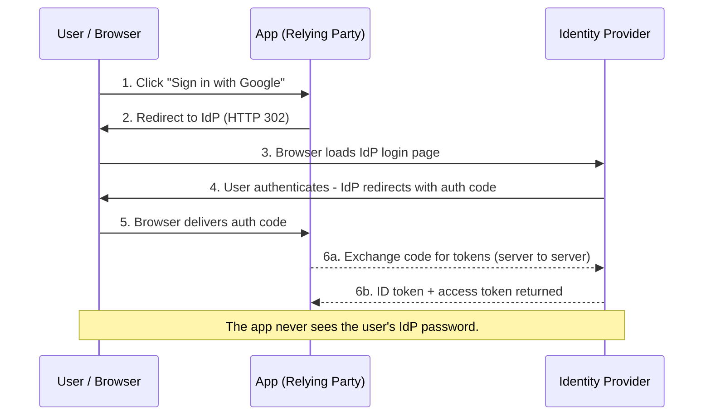
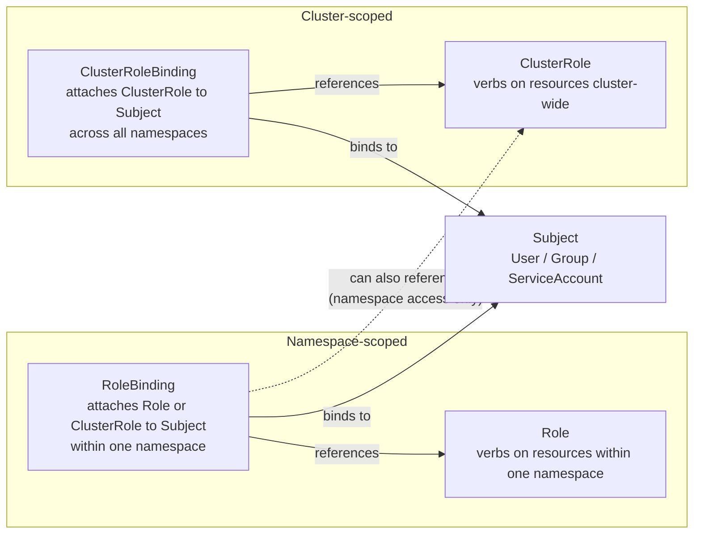
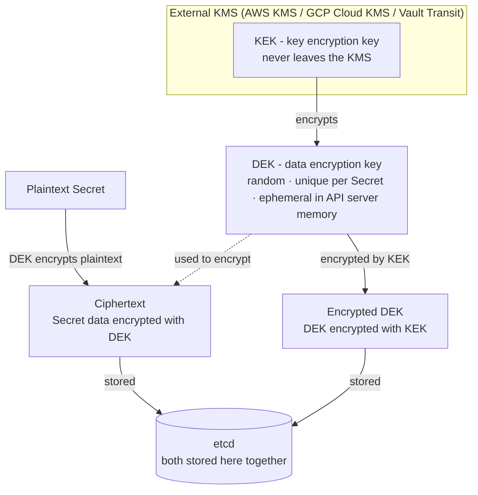

import { Aside } from '@astrojs/starlight/components';
import HistoricalNote from '/src/components/HistoricalNote.astro';
import FigureWithCaption from '/src/components/FigureWithCaption.astro';

{/* ai-summary
type: lecture
slug: system-security-and-hardening
order: 18
covers: threat modeling and CIA triad; authentication vs authorization; Identity Providers and federation (SAML, OAuth 2.0, OIDC, SCIM); Kerberos in context; human vs workload identity; MFA, passkeys, WebAuthn (FIDO2/NIST SP 800-63-4); RBAC, ABAC, policy-as-code, ReBAC; security retrospective across all course layers (Linux, networking, containers, IaC, CI/CD, observability); Linux hardening (SSH key auth, least privilege, UFW, Fail2Ban, unattended-upgrades, AppArmor); Kubernetes security (RBAC Role/ClusterRole/Binding, admission controllers, Pod Security admission, OPA Gatekeeper, Kyverno, NetworkPolicy and CNI requirements, Secrets encryption at rest with KMS v2); secrets management (Vault dynamic secrets, PKI engine, AWS/GCP managed secrets); Zero Trust; DevSecOps (shift-left, pre-commit scanning, SCA, SAST, image scanning with Trivy, runtime security with Falco); CIS benchmarks; file integrity; backups
prereq_lectures: linux-server-planning-and-configuration, networking-fundamentals, containerization-with-docker, cloud-computing, infrastructure-as-code, configuration-management, ci-cd, container-orchestration, network-services-and-application-delivery, monitoring-and-performance, log-management-and-analysis, incident-response-and-postmortems, reliability-engineering, on-premises-infrastructure
followup_lectures: windows-server-administration
paired_activities: security-audit
supports_labs:
*/}

Imagine you have just provisioned a fresh Ubuntu server and attached it to a public IP address. Within minutes, automated scanners will discover it. Within hours, bots will begin probing SSH (Secure Shell), HTTP, and any other open port for default credentials and known vulnerabilities. This is not hypothetical; it is the baseline reality of operating a public-facing server.

This lecture has two intertwined goals. The first is to walk through the practical steps you would take to harden that server, starting from the moment you first log in: reduce the attack surface so that the only things reachable from the network are services you intentionally chose to expose, configured in the most restrictive way that still allows them to function. The second is to step back and view the entire course through a security lens, with particular attention to the one concern that has appeared in every prior lecture without being named as a single subject: identity. Authentication, authorization, Identity Providers, and the federation protocols that connect them are the substrate every other security control rests on, and they are the connective tissue that links the Linux users from Week 2, the AWS IAM (Identity and Access Management) roles from Week 3, the GitHub Actions OIDC (OpenID Connect) from Week 5, the Kubernetes RBAC (Role-Based Access Control) from Week 6, and the AD and Entra material that the next lecture will dive into.

## Why Security Matters

Security failures have real consequences: data breaches expose private user information and intellectual property, extended downtime costs revenue and erodes trust, and ransomware can put a company out of business entirely. The motivating framework is the **CIA Triad**, which describes the three properties that every secure system must preserve.

**Confidentiality** means that only authorized users and processes can access or modify data. Authentication (proving you are who you claim to be: passwords, biometrics, cryptographic keys) and authorization (verifying that you have the right to access what you are requesting: file permissions, access control lists) are the primary mechanisms. A data breach is a loss of confidentiality.

**Integrity** means that data is maintained in a correct state and cannot be improperly modified, either accidentally or maliciously. Read/write permissions, checksums, backups, and ECC (Error-Correcting Code) RAM all protect integrity. Altering business records to influence decision-making or defacing a website's source code are examples of integrity violations.

**Availability** means that authorized users can access data and services when they need to. Systems must handle expected load, hardware must be maintained, infrastructure must be monitored, and a Disaster Recovery (DR) plan must be in place. A Denial-of-Service (DoS) attack (or its distributed variant, DDoS, which floods a target with traffic from many sources) is a direct attack on availability.

<Aside type="note">
A useful illustration: an ATM covers all three CIA properties. It enforces confidentiality through two-factor authentication (card + PIN); it enforces integrity by ensuring that withdrawals are accurately reflected in your account balance; and it provides availability by being accessible in a public place even when the bank is closed.
</Aside>

## How Security is Compromised

Understanding the attack surface is the first step toward defending it. Common attack vectors include:

- **Social engineering.** Phishing emails, pretexting, and other manipulation techniques that trick legitimate users into handing over credentials or executing malicious code. Spear-phishing targets specific individuals with personalized lures and is the most common initial vector in targeted attacks.
- **Software vulnerabilities.** Unpatched bugs in the OS, libraries, or applications that allow an attacker to execute arbitrary code or escalate privileges. Zero-day vulnerabilities (flaws that are not yet publicly known or patched) are particularly dangerous because no defensive update exists.
- **Supply chain compromise.** Malicious or tampered code inserted into dependencies, build tools, or package registries. When an application installs a compromised npm, PyPI, or RubyGems package, every deployment of that application carries the attacker's code. The 2020 SolarWinds breach inserted a backdoor into a software update delivered to thousands of organizations; the 2024 xz utils backdoor was inserted over months by a contributor who had earned legitimate commit access. Defenders cannot audit every package they depend on, which is why dependency pinning and provenance verification matter.
- **Credential theft and reuse.** Credentials exposed in one breach are tested against other services at scale, a technique called credential stuffing. Secrets accidentally committed to a repository (an API key, a database password, an AWS access key) are discovered by automated scanners within minutes of a push to a public repo. A stolen or leaked credential bypasses every authentication control, because from the server's perspective the login looks legitimate.
- **Web application vulnerabilities.** Injection attacks (SQL injection, command injection), cross-site scripting (XSS), and server-side request forgery (SSRF) exploit bugs in application code rather than in the underlying OS or network. An SSRF vulnerability, for example, can be used to reach internal services or cloud metadata endpoints from inside the application's trust boundary. The [OWASP Top Ten](https://owasp.org/www-project-top-ten/) is the canonical catalog of the most widely exploited web application vulnerability classes.
- **Distributed Denial-of-Service (DDoS).** Flooding a service with traffic from many sources (often a botnet) until it exhausts available bandwidth or server resources.
- **Insider abuse.** Employees or contractors who misuse their legitimate access, whether for personal gain, espionage, or sabotage. Insiders are difficult to defend against at the authentication layer because they already have valid credentials; limiting blast radius through least-privilege access control is the primary mitigation.
- **Misconfiguration.** A database listening on a public IP with no authentication, an open S3 bucket, or a debug endpoint left exposed; these are responsible for a large fraction of real breaches. Misconfiguration is especially common when infrastructure is provisioned quickly or when defaults are not reviewed.
- **Hardware-level attacks.** Side-channel attacks that extract secrets by monitoring power consumption, electromagnetic emissions, or CPU frequency/temperature behavior. These are less common in cloud environments because the attacker must have physical or co-tenant access, but they matter for on-premises hardware and embedded systems.

## The Threat Model for a Public Server

The attack vectors above affect every internet-connected system to varying degrees. Deciding which ones to prioritize for a specific system requires narrowing the question, which is what a **threat model** does: it identifies the assets you care about (the data on the server, the services it provides, the trust your users place in you), the adversaries who might target them, and the attack vectors those adversaries are most likely to exploit against this particular target.

For a typical web-facing Ubuntu server, the most common attack vectors are:

- **Credential stuffing and brute force.** Automated tools try thousands of username/password combinations against SSH, database ports, and web login forms.
- **Exploitation of unpatched software.** Public vulnerability databases (CVEs, Common Vulnerabilities and Exposures, the standard identifiers for publicly known security flaws) are monitored by attackers just as they are monitored by defenders. A known vulnerability in an outdated package is low-hanging fruit.
- **Misconfigured services.** A database listening on 0.0.0.0 with no authentication, or a web server exposing a debug panel, can be discovered and exploited within hours.
- **Privilege escalation.** Once an attacker gains any foothold on the system (even as a low-privilege user), they will attempt to escalate to root.

## Defense in Depth

No single security control is sufficient on its own. A layered approach (sometimes called "defense in depth" or **multi-layered security**) ensures that if one layer fails, others remain in place. A practical layering strategy combines:

- **Access control and authentication:** user management, multi-factor authentication (MFA), single sign-on (SSO), and strong password policies.
- **Endpoint security:** anti-malware software, host-based firewalls, and patch management.
- **Network security:** firewalls at multiple network layers, VPNs (Virtual Private Networks) for remote access, and network segmentation.
- **Encryption:** data protected both at rest (stored on disk or in a database) and in transit (using TLS (Transport Layer Security) / HTTPS (Hypertext Transfer Protocol Secure)).
- **Backups:** regular, tested, off-site copies of critical data.
- **Hardware and software redundancy:** failover systems that maintain availability under partial failure.
- **Incident response:** a documented plan for detecting breaches, containing damage, recovering data, and communicating with affected parties.

## Authentication and Authorization

Access control sits first in the defense-in-depth list for a reason. Every layer above it (encryption, segmentation, audit, even backups) ultimately rests on the system being able to answer two questions about every request: who is asking, and what may they do? In casual conversation those two questions blur together; in real systems they are distinct concerns with distinct mechanisms, and confusing them is one of the most common sources of security mistakes.

**Authentication** is the process by which a system verifies an identity claim. It answers "who are you?" The classical taxonomy distinguishes three factors: something you know (a password, a PIN), something you have (a hardware token, a phone, a private key), and something you are (a fingerprint, a face, a typing pattern). **Multi-factor authentication (MFA)** combines two or more of these factors. A password plus a one-time code from an authenticator app is two-factor: a knowledge factor and a possession factor. Two passwords are not two-factor; they are one factor used twice.

**Authorization** is the decision, made after authentication has succeeded, about whether the identified actor is permitted to perform the requested operation on the requested resource. It answers "what may you do?" Authorization is layered on top of authentication and is meaningless without it: granting permissions to an unverified identity defeats the purpose.

The two concerns are easiest to see when they are clearly separated. On a Linux server, your SSH key proves that you are the user `deploy` (authentication, handled by sshd); the kernel's file permissions and the contents of `/etc/sudoers` decide what `deploy` may do once logged in (authorization, handled by the kernel and PAM (Pluggable Authentication Modules)). In AWS, the EC2 Instance Metadata Service (IMDS) issues short-lived credentials that prove a request originates from a particular IAM (Identity and Access Management) role (authentication); the policies attached to that role decide which API calls are allowed (authorization). In Kubernetes, the service account token mounted into a pod identifies it to the API server (authentication); RoleBinding and ClusterRoleBinding resources decide what the service account may read or change (authorization). The same two-step pattern repeats at every layer of the stack the course has built.

A practical implication of the distinction: hardening authentication and hardening authorization are different jobs. Strong key-based SSH and MFA on cloud consoles raise the cost of impersonation, but they do nothing about a role that grants `s3:*` on every bucket. Tight RBAC and least-privilege IAM policies constrain blast radius, but they protect nothing if an attacker can phish a privileged user's credentials. A defensible system needs both, and the rest of this lecture spends time on each.

## Identity Providers and Federation Protocols

In a small system, each application maintains its own user database. The web app has its own `users` table, the database has its own roles, the SSH server has its own `/etc/passwd`, the wiki has its own accounts. This model is workable for a handful of systems and a handful of users; it falls apart as either number grows. Onboarding a new employee means creating accounts in dozens of systems; offboarding means remembering to disable all of them, and missing one is a security incident waiting to be triggered. Users cope by reusing passwords across applications, which means a breach of any one of them compromises the rest.

The architectural pattern that solves this is the **Identity Provider (IdP)**. One system holds authoritative identities for humans (the employees of a company, the customers of a SaaS product, the students of a university), and every application defers authentication to it. Applications become **relying parties**: they no longer store passwords or run a login form themselves; they redirect the user to the IdP, accept a signed statement from the IdP that proves who the user is, and use that statement to establish a local session. Concrete IdPs in current use include [Okta](https://www.okta.com/), [Auth0](https://auth0.com/), [Microsoft Entra ID](https://www.microsoft.com/en-us/security/business/identity-access/microsoft-entra-id) (the rebrand of Azure AD), [Google Workspace](https://workspace.google.com/), [JumpCloud](https://jumpcloud.com/), and the self-hosted open-source option [Keycloak](https://www.keycloak.org/). Active Directory, which the next lecture covers in depth, is an IdP from an earlier era.

This redirect-and-trust dance is **federation**. The trust relationship is established once, during configuration: the application is told the IdP's public key and the IdP is told which applications are allowed to ask it for assertions. Every subsequent user login flows through that established trust without the user retyping credentials.

Several protocols define how the assertion actually travels between IdP and relying party. They differ in age, encoding, and intent, but the underlying federation pattern is the same.

**SAML 2.0 (Security Assertion Markup Language)** is the elder statesman. Standardized in 2005, it uses XML assertions cryptographically signed by the IdP and delivered through the browser via HTTP redirects or form POSTs. SAML is dominant in enterprise SaaS sold to large organizations: when a company buys an HR platform or a CRM and configures "SSO," it is almost always configuring SAML. The XML is verbose and the configuration is finicky, but the protocol is battle-tested and supported by every enterprise IdP.

**OAuth 2.0** is younger and solves a different problem: delegated authorization. Standardized in 2012 by [RFC 6749](https://datatracker.ietf.org/doc/html/rfc6749), it answers the question "may this application access this user's resources on a different service?" The canonical example is a third-party app that needs to read a user's Google Calendar. OAuth issues access tokens scoped to a particular resource and a particular set of permissions; the user explicitly consents to that scope during a redirect to the resource owner. OAuth 2.0 is not an authentication protocol on its own, and treating it as one is a classic mistake: the access token proves that the application was authorized to act, not that the bearer is any particular person.

**OpenID Connect (OIDC)** is the identity layer built on top of OAuth 2.0. It adds an **ID token**, a JSON Web Token (JWT) signed by the IdP, that proves who the authenticated user is, alongside the access token that OAuth already issues. OIDC was finalized in 2014 and has become the modern default for new applications. "Sign in with Google," "Sign in with Apple," and the GitHub Actions to AWS federation introduced in the CI/CD lecture are all OIDC. The wire format is JSON instead of XML, the flows are mobile and SPA friendly, and the same JWT plumbing is reused across the ecosystem.

**SCIM (System for Cross-domain Identity Management)** is the provisioning counterpart to SAML and OIDC. SAML and OIDC handle the moment a user logs in; SCIM handles the lifecycle of the user account itself. When someone joins the company, the IdP pushes a SCIM create to every connected application; when they leave, the IdP pushes a SCIM disable. Without SCIM, federation gives you single sign-on but still leaves the deprovisioning problem unsolved: a former employee whose IdP account is disabled may still have active local accounts in every application that was never refreshed.

A worked trace of a typical OIDC sign-in clarifies the moving parts. A user clicks "Sign in with Google" on a SaaS application. The application redirects the browser to Google's authorization endpoint, including parameters identifying the application and the scopes it is requesting. The user authenticates to Google (entering a password, completing MFA, or relying on an existing Google session). Google redirects the browser back to the application with a one-time authorization code. The application's backend exchanges that code, over a direct server-to-server call to Google's token endpoint, for an ID token and an access token. The application validates the ID token's signature against Google's published public keys, decodes the JWT to learn the user's identifier and verified claims (email, name, organization), and creates a local session. At no point did the application see or store the user's Google password.



| Protocol | Year | Encoding | Primary purpose | Where you encounter it |
|---|---|---|---|---|
| SAML 2.0 | 2005 | Signed XML | Enterprise web SSO | Large-SaaS-to-enterprise federation |
| OAuth 2.0 | 2012 | JSON, bearer tokens | Delegated authorization | API access on a user's behalf |
| OIDC | 2014 | JWT on top of OAuth | Web and mobile authentication | "Sign in with..." flows, CI/CD federation |
| SCIM 2.0 | 2015 | REST/JSON | User lifecycle provisioning | IdP-to-application user sync |

Kerberos, which the next lecture covers in detail, predates all of these by decades. Designed at MIT in the 1980s for trusted local-area networks, Kerberos solves the same single-sign-on problem with a fundamentally different mechanism: a central key distribution center issues time-limited tickets that clients present to services, with no browser redirects involved. Kerberos assumes a tightly-coupled trust domain (the Windows Active Directory forest is the modern descendant) and synchronized clocks; SAML and OIDC assume the much looser trust of the open internet. Both end up answering the same question for the user, "log in once and reach many services," but the substrate differs.

<HistoricalNote title="The IdP Pattern Predates the Web">
The intellectual lineage of modern federation reaches back to [Project Athena](https://en.wikipedia.org/wiki/Project_Athena) at MIT (1983-1991), where Kerberos was designed alongside the X Window System and the AFS distributed filesystem. The problem was already recognizable: thousands of workstations in dorms and labs needed to authenticate students against a central directory, and per-application password databases were not viable at that scale. Kerberos's ticket-granting model was the first widely deployed single-sign-on system in production. When Microsoft adopted it for Active Directory in Windows 2000, the protocol became the authentication backbone of essentially every enterprise on the planet. SAML, OAuth, and OIDC are, in a real sense, the same idea reworked for a different network: instead of a tightly synchronized LAN, the loose, redirect-driven world of the web.
</HistoricalNote>

The choice of where the IdP itself lives is its own operational decision. A SaaS IdP (Okta, Entra, Auth0, Google Workspace) hands off the operational burden but creates a hard dependency: if the IdP is unreachable, new logins and token refreshes across federated applications can fail. A self-hosted IdP (Keycloak is the most common open-source option, sometimes paired with FreeIPA on Linux) keeps the system under direct control but means the operations team now runs the identity infrastructure that the rest of the company depends on. Most organizations of any size choose a SaaS IdP for human identity precisely because the operational guarantees of a vendor are stronger than what a small ops team can sustain.

## Identity and Access in Practice

The protocols described above are the formal vocabulary. The practical question for an operator is how all of this connects to the systems already covered in this course. The course has touched an identity surface at every layer it has built, often without naming the underlying pattern. The rest of this section makes the pattern explicit.

A first useful split is between **human identity** and **workload identity**, two genuinely distinct problems that share the same vocabulary. Human identity is what the IdP pattern was originally built for: people sign in, possibly with MFA, and receive a session that lets them reach many systems. Workload identity is the equivalent problem for software: a CI/CD job, a running container, an EC2 instance, or a microservice all need to prove to other systems who they are, but the mechanisms (and the threat models) are different. Humans authenticate intermittently, with browsers and MFA prompts; workloads authenticate constantly, with no human present, and any long-lived credential they hold is a target.

The course has already built examples of both. Human-identity surfaces include the SSH key that proves you are `deploy` on a server, the IAM Identity Center sign-in that gets a console session in AWS, the `kubeconfig` file that authenticates a user to a Kubernetes cluster, and the GitHub login that authorizes a push. Workload-identity surfaces include the IMDS endpoint that issues temporary credentials to applications running on an EC2 instance, the OIDC token a GitHub Actions workflow exchanges for short-lived AWS credentials (covered in the CI/CD lecture), the projected service-account JWT mounted into a Kubernetes pod, and the mTLS (mutual TLS) certificates services use to authenticate to each other inside a service mesh. The unifying pattern is short-lived, automatically-rotating, narrowly-scoped credentials issued by a trusted authority, with no long-lived secret sitting on disk.

Mapped against the layers of the course, the identity surfaces line up like this:

| Layer | Authentication | Authorization | First introduced |
|---|---|---|---|
| Linux host | SSH keys, PAM | File permissions, sudoers, AppArmor/SELinux | Linux Server Planning |
| AWS account | IAM users, Identity Center, IMDS | IAM policies (JSON) | Cloud Computing |
| CI/CD | GitHub OIDC token to cloud trust | Repo and environment scopes, branch protections | CI/CD Pipelines |
| Kubernetes | Service account tokens, kubeconfig | RBAC roles and bindings | Container Orchestration |
| Email | SPF, DKIM, DMARC alignment | Receiver policy (`p=quarantine`, `p=reject`) | Network Services |
| Enterprise desktop | Kerberos tickets, smart cards | AD groups, Group Policy | Windows Server (next lecture) |

The takeaway from the table is not the list of acronyms but the recurrence of the same two-question structure across every layer. Once you recognize that recurrence, troubleshooting a denied request becomes a disciplined exercise: first determine which layer rejected it, then ask which of the two questions the layer was answering when it said no.

**Multi-factor authentication** deserves a closer look because the practical landscape has changed quickly in the last few years. Time-based one-time passwords (TOTP), generated by an authenticator app from a shared secret and the current time, are a major improvement over passwords alone and are the operational baseline for cloud consoles and developer accounts today. They are, however, phishable: a convincing fake login page can capture both the password and the TOTP code in real time and replay them against the real service within the 30-second window. SMS-based codes are weaker still because of SIM-swap attacks, in which an attacker convinces a mobile carrier to transfer a target's phone number; NIST [SP 800-63-4](https://pages.nist.gov/800-63-4/) restricts authenticators that rely on the public switched telephone network, including SMS-based OTPs, and its [syncable-authenticator supplement](https://nvlpubs.nist.gov/nistpubs/SpecialPublications/NIST.SP.800-63Bsup1.pdf) formally incorporates passkeys as a supported authenticator class.

The current direction of travel is toward [**WebAuthn**](https://www.w3.org/TR/webauthn-3/) and passkeys, both built on the FIDO2 (Fast IDentity Online 2) standards from the FIDO Alliance and the W3C (World Wide Web Consortium). The mechanism is public-key cryptography bound to the origin: during registration, the user's authenticator (a hardware key like a YubiKey, the secure enclave on a phone, or the OS keychain on a laptop) generates a key pair specific to the site and stores the private key locally; at sign-in, the site sends a challenge, the authenticator signs it with the private key, and the site verifies the signature against the stored public key. The cryptographic binding to the legitimate origin is what makes the scheme phishing-resistant: an authenticator presented with a request from a lookalike domain will simply produce a signature that does not validate against the real site. Passkeys add synchronization across a user's devices through the operating system's keychain (iCloud Keychain, Google Password Manager) so that the user does not lose access when their primary device is replaced. The longer-term trajectory is toward eliminating passwords from primary authentication entirely.

Authentication, however strong, is only half of the story. Authorization choices determine what an authenticated identity can actually do. Several models recur across the systems the course has covered. **Role-based access control (RBAC)** assigns identities to roles and grants permissions at the role level; Kubernetes RBAC, AD security groups, and AWS IAM Identity Center permission sets are all RBAC implementations. RBAC is easy to reason about and easy to audit, but it tends to drift toward over-permissioning: as organizations grow, roles accumulate permissions they no longer need, and removing a permission is harder than adding one.

**Attribute-based access control (ABAC)** evaluates a request against attributes of the identity, the resource, and the request context: who is asking, what are they asking for, from where, on what kind of device, at what time. AWS IAM policies with condition keys (`aws:SourceIp`, `aws:PrincipalTag`, `aws:RequestedRegion`) are ABAC; the conditional access policies of Entra ID and the admission policies of Kubernetes are ABAC. ABAC is more expressive than RBAC, which lets it encode realistic operational rules ("engineers may access production secrets only from a managed device and only between 8 AM and 8 PM"), at the cost of being substantially harder to read and audit.

**Policy-as-code** is the engineering practice of expressing authorization rules in version-controlled declarative files that a policy engine evaluates at request time. AWS IAM JSON policies are de facto policy-as-code; the [Open Policy Agent (OPA)](https://www.openpolicyagent.org/) and its Kubernetes-focused descendants Gatekeeper and Kyverno generalize the pattern to any system willing to consult an external decision point; HashiCorp Sentinel applies the same idea to Terraform runs. The benefit is reviewability: a change to an authorization rule is a pull request, with diff, history, and approval just like any other code change. The cost is the learning curve of the policy language itself.

A fourth model, **relationship-based access control (ReBAC)**, has emerged from SaaS products with deeply nested collaborative resources (documents in a folder, projects under an organization, tasks assigned to a team). The [Google Zanzibar paper](https://research.google/pubs/zanzibar-googles-consistent-global-authorization-system/) from 2019 is the influential reference; [SpiceDB](https://authzed.com/spicedb) is an open-source implementation. Permissions in ReBAC follow relationships in a graph: "Alice can edit document D because she is a member of team T, which is part of project P, which owns D." ReBAC is most useful when the natural authorization question is shaped like "does this user have any path to this resource?" rather than "does this user hold this permission directly?"

The architectural endpoint of all of this, for an operator, is what is sometimes called the **IdP-centric architecture**. Humans authenticate against a single IdP, ideally with passkeys, and every application federates to it via OIDC or SAML. SCIM keeps user lifecycle synchronized so that deprovisioning is automatic. Workloads use short-lived credentials federated from a single trust root: GitHub OIDC to AWS, IMDS to AWS, projected service account tokens to Kubernetes, mTLS between services. Long-lived secrets stop being checked into repositories or stored on instances; the secret store (HashiCorp Vault, AWS Secrets Manager, Kubernetes Secrets backed by a KMS (Key Management Service)) becomes itself an identity-aware service. Identity events (sign-ins, role assumptions, permission changes) flow to centralized logs because they are the highest-value security signal an organization produces.

<Aside type="note" title="Identity is the Substrate of Every Other Control">
A perfect default-deny firewall in front of a service whose IAM role grants `s3:*` on every bucket is a serious incident waiting to happen. A perfectly hardened Linux server with a leaked deploy key is a serious incident waiting to happen. A perfectly tuned alerting stack with no audit log of who authenticated where is investigation-blind during an incident. Hardening the host, the network, and the pipeline matters; what makes those controls cohere into a defensible system is a clear identity model that humans and workloads both inherit from.
</Aside>

## Security Retrospective Across the Stack

The conceptual framework established above (the CIA Triad, defense in depth, and the authentication-authorization distinction) does not exist in isolation. Every domain this course has covered carries its own security surface, one that was present in every configuration built along the way even when it was not explicitly named as a security concern. This section revisits each domain with a security lens.

### Linux Hosts

A freshly provisioned Ubuntu server commonly exposes SSH on port 22, runs no host firewall, and does not automatically apply every security update. Depending on the image and installer choices, password authentication may also still be enabled. None of this is a mistake; it is a reasonable baseline for initial access. The mistake is treating that baseline as acceptable for a publicly reachable machine. Password-authenticated SSH is trivially brute-forced: bots begin attempting logins within minutes of a new public IP becoming reachable. In the absence of upstream network controls, every port a service binds to is immediately reachable from the public internet. The absence of patching means every published CVE for the installed packages is a live, exploitable vulnerability on the machine.

The underlying principle: a server is hardened by subtracting exposure, not by layering monitoring on top of a wide-open surface. The hardening sections that follow address each of these directly.

### Networking and Cloud Infrastructure

The networking lectures established routing, NAT (Network Address Translation), DNS (Domain Name System), and load balancing. Each has a corresponding attack surface. Every listening port is an entry point for automated scanners. A service bound to `0.0.0.0` (all interfaces) instead of `127.0.0.1` (loopback only) is reachable from any network path to the machine, not just the paths the operator intended.

In AWS, security groups operate at the virtual network level and are distinct from the host firewall. A misconfigured security group that opens port 5432 (PostgreSQL) to the public internet is independent of whether the host firewall blocks that port. Defense in depth requires both layers because they fail independently: a security group closing a port stops traffic before the host ever receives it, while a host firewall remains effective even if the VPC (Virtual Private Cloud) routing or the security group is later misconfigured.

IMDS v1 is reachable from any process on an EC2 instance without authentication. A [Server-Side Request Forgery (SSRF)](https://owasp.org/www-community/attacks/Server_Side_Request_Forgery) vulnerability in a web application is sufficient to fetch the instance's temporary AWS credentials from the metadata service. IMDSv2 substantially mitigates this by requiring a PUT request with a TTL (time-to-live) header to obtain a session token before any metadata is accessible, making the SSRF path significantly harder to exploit. It reduces the risk rather than making metadata theft impossible, because some application bugs can still let an attacker inject the headers or request shape IMDSv2 expects. New EC2 instances should enforce IMDSv2 in the launch configuration.

### Containers and Images

Docker images accumulate CVEs over time. An image built from a clean Ubuntu base today inherits every vulnerability disclosed in those packages after that build date if it is not rebuilt. Scanning images at build time, before pushing to a registry, catches known CVEs before they reach production. Scanning only at runtime catches them only after exposure has already occurred. The CI/CD pipeline is the right place for image scanning.

Containers run as root inside the container namespace by default. Container namespaces isolate processes from the host kernel, but that isolation is not absolute: container escape vulnerabilities, privileged container configurations, and `hostPath` volume mounts can all bridge the namespace boundary. A container running as a non-root user with a read-only root filesystem and dropped Linux capabilities provides substantially fewer escalation paths if the application inside it is compromised.

The Docker socket (`/var/run/docker.sock`) deserves particular attention. A container with access to the Docker socket can spawn new containers, including privileged ones, giving it effective root access to the host. This is a common pattern for CI runners and monitoring agents and should be treated as an explicit trust grant, not a convenience default.

### Infrastructure as Code

Terraform state files record the full resolved configuration of every managed resource, including values passed as sensitive inputs. A state file stored in an S3 bucket without access restrictions or encryption at rest contains plaintext database passwords, TLS private keys, and API tokens. Backend state should be encrypted and accessible only to the IAM role that executes Terraform.

The wider IaC secrets problem is that the path of least resistance when writing a module is to put a secret in a variable and pass it as input. Pre-commit hooks that scan for secrets before a commit reaches the remote catch accidental inclusions early. The durable answer is that secrets should not appear in IaC inputs at all: they should be fetched at runtime from a secrets manager, which the Secrets Management section below addresses.

### CI/CD Pipelines

The CI/CD pipeline has write access to production. Compromising it achieves more than compromising a single server, because the attacker gains access to the build, the artifact store, and the deployment credentials simultaneously.

Supply chain attacks target the inputs to a build: a malicious package in a dependency graph, a compromised GitHub Action, or a workflow that runs arbitrary code from an untrusted pull request. The [SolarWinds compromise in 2020](https://www.cisa.gov/eviction-strategies-tool/dialog-content/TMPL0002) attacked the build system itself; the [xz utils backdoor discovered in 2024](https://en.wikipedia.org/wiki/XZ_Utils_backdoor) was inserted into a widely distributed compression library over an extended period by a contributor who had earned commit access through sustained engagement with the project. SCA (Software Composition Analysis) tools that flag dependency changes and workflows that pin actions to specific commit SHAs (Secure Hash Algorithms) reduce but do not eliminate this risk.

Before GitHub Actions OIDC federation became available, the standard practice was to store a long-lived cloud provider access key in repository secrets. That key was valid indefinitely. OIDC federation replaces the long-lived key: the workflow proves its identity via a signed JWT issued by GitHub, the cloud provider issues short-lived temporary credentials scoped to that specific run, and the credentials expire when the job ends. The CI/CD lecture covered this pattern; the security lens makes explicit why the long-lived key model is a liability regardless of how carefully the key is rotated.

### Observability and Incident Response

The monitoring, log management, and incident response lectures built the operational visibility layer. Security visibility is a distinct concern from operational visibility. CPU and memory metrics tell you whether the system is healthy. Auth logs tell you who authenticated, from where, and when. Sudo event logs tell you who escalated privileges and what they ran. API server audit logs tell you who read or modified Kubernetes resources and from which IP.

An attacker who gains access generates events in exactly these logs. Without collecting and retaining them, investigation is blind: you can see that something is wrong but not what happened, when it started, or how far it spread. Cloud provider audit trails such as AWS CloudTrail and Linux auth logs should be treated as write-once forensic evidence sent to a destination the attacker cannot reach. An attacker who can delete your audit logs can erase the evidence of their own access.

## Principle of Least Privilege

The principle of least privilege states that every user, process, and program should operate with the minimum set of permissions necessary to complete its task. On a Linux server, this principle shows up in three interconnected places: user accounts, file permissions, and sudo access.

**User accounts.** Running application workloads as root is the most common way least privilege gets violated. Root is the identity with the broadest access the kernel normally allows: it can bypass ordinary file-permission checks, change system configuration, and control other processes. A compromised application running as root can usually take over the whole host. The fix is simple in concept and easy to overlook in practice: each long-running service should run under a dedicated, low-privilege account whenever possible. A web server might run as `www-data`, a database as `postgres`, and a deployment account as `deploy`. If that process is compromised, the attacker inherits that account's permissions rather than immediate full control of the machine.

**File permissions.** Basic Unix file permissions encode the principle directly: every file and directory carries an owner, a group, and a permission mode for three audiences (owner, group, and everyone else). A configuration file that contains credentials has no business being world-readable. A common posture is to own it as root, assign it to the application's dedicated user or group, and restrict read access to only that identity. This way the application process can read its own configuration, human administrators with sudo can inspect it, and unrelated users cannot read it casually. An overly permissive configuration file is a common path from a low-privilege compromise to credential exposure.

**Sudo access.** The `sudo` tool grants temporary elevated privileges, but on Ubuntu the default `sudo` group is a broad grant: it typically allows the user to run almost any command as root, and often as another user as well, after authenticating. The sudo policy lives in `/etc/sudoers` and optional drop-in files under `/etc/sudoers.d/`; these should be edited through `visudo`, which validates syntax before saving. An account that only needs to restart a web server can be granted exactly that permission and nothing else. A syntax error in a sudoers rule can lock administrators out of elevated access, which is why `visudo` exists: it refuses to install a broken policy. The principle applies to sudo the same way it applies everywhere else: grant the minimum scope the job actually requires.

### Kernel-Level Access Controls: AppArmor and SELinux

Beyond user-level permissions, the Linux kernel offers Mandatory Access Control (MAC) frameworks that constrain what individual programs can do, regardless of which user runs them.

[**AppArmor**](https://www.apparmor.net/) (the default on Ubuntu) defines per-application profiles that specify which files, capabilities, and network operations a program is permitted to use. If a web server is compromised, an AppArmor profile can prevent it from reading `/etc/shadow` or spawning a shell, even though the process itself might have a path to those actions.

[**SELinux**](https://www.redhat.com/en/topics/linux/what-is-selinux) (the default on Red Hat-based distributions such as RHEL, CentOS, and Fedora) provides finer-grained control through security labels on every file, process, and socket. SELinux is more powerful but significantly more complex to configure.

The key difference in practice: AppArmor is path-based and relatively straightforward to manage; SELinux is label-based and suitable for environments with strict regulatory requirements. AppArmor is the practical starting point for Ubuntu servers.

## SSH Hardening

SSH is the primary way you will manage your server, which makes it both essential and a high-value target. The default OpenSSH configuration on Ubuntu is functional but permissive.

### Key-Based Authentication

Password authentication over SSH is vulnerable to brute-force attacks because an attacker who can reach the port can attempt passwords indefinitely (or until Fail2Ban intervenes). Key-based authentication eliminates that vector entirely: the server stores only a public key, which is mathematically useless to an attacker without the corresponding private key, which never leaves the client machine.

The `ssh-keygen` command generates a key pair. The Ed25519 algorithm is the current recommended choice: it uses smaller keys than comparable RSA deployments, verifies quickly, and was designed to be easier to implement safely than older public-key schemes. The `ssh-copy-id` utility appends the public key to `~/.ssh/authorized_keys` on the server. Before disabling password authentication, confirm that a key-based login succeeds. Once password auth is disabled, a configuration error that prevents key auth from working will lock the account out entirely.

<HistoricalNote title="SSH Was Written After a Password Sniffing Attack (1995)">
SSH was written by Tatu Ylönen, a researcher at Helsinki University of Technology, in 1995, not out of academic interest but because his own accounts had just been compromised. A password-sniffing attack swept through the university network, capturing credentials transmitted in plaintext by telnet and rlogin, the standard remote login protocols at the time. Ylönen wrote the first version of SSH in a few months and released it for free in July 1995. It spread to tens of thousands of hosts within weeks. He founded SSH Communications Security to commercialize the protocol. When the company's licensing became restrictive in 1999, the OpenBSD project rewrote the entire codebase from scratch as OpenSSH, the version that ships with virtually every Linux and macOS system today. The protocol that secures billions of server connections worldwide was born entirely from one researcher getting hacked.
</HistoricalNote>

### Hardening sshd_config

With key-based authentication working, `/etc/ssh/sshd_config` controls which authentication methods and users the daemon accepts. The most important directives for a public server:

```text
PasswordAuthentication no
PermitRootLogin no
PubkeyAuthentication yes
AllowUsers deploy
```

`PasswordAuthentication no` closes the brute-force vector entirely. `PermitRootLogin no` means that even if an attacker guesses the root password (or finds a credential somewhere), they cannot log in directly as root; they must first compromise a non-privileged account and then escalate. The `AllowUsers` directive is a second layer: it restricts SSH access to a named list of accounts, so even a valid shell account that is not on the list will be rejected at the SSH layer before PAM is consulted.

Port-knocking and changing the SSH port from 22 to a high-numbered port do not provide meaningful security against a targeted attacker (any competent port scan finds the service), but they dramatically reduce log noise from automated scanners that probe only the standard ports. The tradeoff is operational friction: every client and every firewall rule must reference the custom port.

Changes to `sshd_config` take effect only after the daemon restarts, which immediately drops the ability to make new connections under the old settings. Always test a new session with the updated configuration before terminating the current one.

## Firewall Configuration with UFW

A firewall controls which network traffic is allowed to reach your server and which is silently dropped. Ubuntu ships with `ufw` ([UncomplicatedFirewall](https://wiki.ubuntu.com/UncomplicatedFirewall)), a user-friendly frontend for the underlying `iptables`/`nftables` rules.

The most important firewall principle is "default deny": block all incoming traffic, allow all outgoing, then explicitly open only the ports the server needs. UFW translates that principle into a simple command sequence:

```bash
sudo ufw default deny incoming
sudo ufw default allow outgoing
sudo ufw allow 22/tcp
sudo ufw allow 80/tcp
sudo ufw allow 443/tcp
sudo ufw enable
```

UFW also provides a built-in rate-limiting rule (`ufw limit 22/tcp`) that blocks a source IP after six connection attempts within thirty seconds. This is a shallow version of what Fail2Ban provides: Fail2Ban tracks failed authentications in application logs and applies configurable thresholds, while the UFW limit rule tracks raw connection attempts at the network layer regardless of whether they result in a login attempt. Both are useful; they protect against different points in the attack sequence.

`ufw status verbose` shows the current rule set. `ss -tlnp` (or `nmap -Pn` from another machine) shows which ports are actually listening; the combination of "what UFW allows in" and "what is listening" should match exactly what the threat model expects to be publicly reachable.

<Aside type="caution" title="Enable the firewall only after allowing SSH">
Enabling UFW without an SSH allow rule in place will immediately cut off remote access to the server. Verify the rule set with `ufw status` before running `ufw enable`.
</Aside>

## Keeping Software Updated

Unpatched software is one of the easiest targets for attackers. The time between a vulnerability being publicly disclosed and exploit code appearing in the wild is often measured in hours, not days.

The basic approach is straightforward:

```bash
sudo apt update
sudo apt upgrade -y
```

For security patches specifically, Ubuntu supports automatic installation through the `unattended-upgrades` package:

```bash
sudo apt install -y unattended-upgrades
sudo dpkg-reconfigure -plow unattended-upgrades
```

The configuration file at `/etc/apt/apt.conf.d/50unattended-upgrades` controls which updates are applied automatically. By default, it enables only security updates, which is a sensible starting point. You can also configure email notifications and automatic reboots for kernel updates:

```text
Unattended-Upgrade::Allowed-Origins {
    "${distro_id}:${distro_codename}-security";
};
Unattended-Upgrade::Mail "admin@example.com";
Unattended-Upgrade::Automatic-Reboot "true";
Unattended-Upgrade::Automatic-Reboot-Time "04:00";
```

<Aside type="note">
Automatic reboots should be used carefully on production servers. Consider whether your application can tolerate brief downtime at 4:00 AM, or whether you need a more controlled maintenance window.
</Aside>

## Fail2Ban: Brute-Force Protection

Even with key-based SSH authentication, a server will receive thousands of failed login attempts. These attempts fill logs and consume resources even when they cannot succeed. Fail2Ban monitors log files for repeated-failure patterns and temporarily bans offending IP addresses by writing firewall rules.

The configuration model uses three concepts: a **filter** defines the log pattern that identifies a failure (for SSH, a failed authentication line in `/var/log/auth.log`); a **jail** pairs a filter with an action and threshold (five failures within ten minutes); an **action** defines what happens when the threshold is crossed (in most configurations, adding a UFW block rule for the offending IP for one hour). The main configuration file should not be edited directly, because package updates overwrite it. Local overrides go in `/etc/fail2ban/jail.local`, which Fail2Ban merges with the package defaults.

Fail2Ban is an effective response to automated scanners and brute-force bots. It is not a defense against a determined attacker with access to many IP addresses: a distributed brute-force campaign simply rotates source IPs faster than the ban list can grow. The right mental model is that Fail2Ban reduces log noise and eliminates low-effort automated threats; it complements key-based auth rather than substituting for it. It ships with filters for Nginx, Apache, Postfix, and many other services, so the same jail-and-action model extends beyond SSH to any service that produces structured failure logs.

<Aside type="tip">
Fail2Ban is not limited to SSH. It ships with filters for Apache, Nginx, Postfix, and many other services. Once you are comfortable with the SSH jail, consider enabling jails for other public-facing services.
</Aside>

## Kubernetes Security

A default Kubernetes cluster is not a secure cluster. The API server is reachable from every pod in the cluster by default. All pods share a flat network where traffic flows freely across namespace boundaries unless explicitly restricted. Pods run as root inside the container namespace unless a security context specifies otherwise. RBAC exists but, outside the `kube-system` namespace, the `default` service account gets only minimal API-discovery permissions by default; the security problems in real clusters arise from what operators grant when moving quickly. This section covers the four primary hardening surfaces.

### The RBAC Model in Detail

The container orchestration lecture introduced RBAC at the level of "roles control what a service account can do." The full model uses four object types that are easy to confuse. A **Role** defines permitted operations (API groups, resources, and verbs: get, list, watch, create, update, delete) within a single namespace. A **ClusterRole** defines the same set of permissions but applies cluster-wide, covering cluster-scoped resources such as nodes, PersistentVolumes, and namespaces themselves. A **RoleBinding** attaches a Role or ClusterRole to a subject (a user, group, or ServiceAccount) within one namespace. A **ClusterRoleBinding** attaches a ClusterRole to a subject across the entire cluster.



The distinction has a practical consequence: a ClusterRoleBinding granting the built-in `cluster-admin` ClusterRole gives the bound subject root-equivalent access across every namespace. That level of access is necessary for almost no production workload. Most application service accounts need only namespace-scoped permissions, so a RoleBinding referencing a narrowly defined Role is both sufficient and safer. To audit what a service account can actually do at runtime:

```bash
kubectl auth can-i list secrets \
  --namespace production \
  --as system:serviceaccount:production:my-app
```

Namespaces are organizational boundaries, not security boundaries. A pod in namespace A can make network requests to a pod in namespace B without restriction unless NetworkPolicy says otherwise. Cluster-scoped resources (nodes, ClusterRoles, PersistentVolumes) are visible and, if poorly bound, modifiable from any namespace. Running workloads for genuinely untrusting tenants on the same cluster requires substantially more than namespace separation: separate node pools, separate clusters, or a hypervisor-level isolation layer such as Kata Containers.

### Admission Controllers and Policy Enforcement

Admission controllers are the gatekeeping layer between "a resource was submitted to the API server" and "the resource is written to etcd (the distributed key-value store that is Kubernetes' database)." After authentication succeeds and RBAC permits the operation, admission controllers inspect or modify the resource. Two categories matter for security.

**Validating admission webhooks** call an external HTTPS endpoint with the incoming resource manifest and accept or reject it based on the response. This is the mechanism behind policy engines. Projects such as [OPA Gatekeeper](https://open-policy-agent.github.io/gatekeeper/) and [Kyverno](https://kyverno.io/) are common examples. OPA Gatekeeper uses the Rego policy language; Kyverno uses a Kubernetes-native YAML syntax that is more approachable for teams already fluent in writing Kubernetes manifests. Typical policies block containers running as root, require images from an approved registry, or mandate that every pod specifies resource limits.

**Mutating admission webhooks** modify resources before they are written to storage. Service meshes such as Istio and Linkerd use mutating webhooks to inject sidecar proxy containers automatically. Security tooling uses them to set secure defaults (non-root user, read-only root filesystem, dropped capabilities) on pods that do not specify a security context.

The built-in [Pod Security admission controller](https://kubernetes.io/docs/concepts/security/pod-security-admission/), which enforces the [Pod Security Standards](https://kubernetes.io/docs/concepts/security/pod-security-standards/), has been stable since Kubernetes 1.25, the same release that removed the older PodSecurityPolicy mechanism. The `privileged` profile imposes no restrictions. The `baseline` profile blocks the most dangerous configurations: host namespace sharing, privileged containers, and dangerous host path mounts. The `restricted` profile requires non-root execution, disallows privilege escalation, and requires tighter seccomp and capability settings:

```bash
kubectl label namespace production \
  pod-security.kubernetes.io/enforce=restricted
```

Third-party policy engines complement the built-in controller when policies need to be more expressive: matching on image digests, enforcing organization-specific naming conventions, or applying rules that span multiple related resources.

### NetworkPolicy and Pod-to-Pod Segmentation

Kubernetes accepts [NetworkPolicy](https://kubernetes.io/docs/concepts/services-networking/network-policies/) objects regardless of whether the installed CNI (Container Network Interface) plugin actually enforces them. If the CNI does not support NetworkPolicy, the objects exist in the API server and are silently ignored: traffic flows freely even though policies appear to be in place. Calico, Cilium, and Antrea enforce NetworkPolicy; the built-in `kubenet` fallback does not. Verify CNI support before relying on NetworkPolicy for any security boundary.

Without any NetworkPolicy, the default behavior is to allow all pod-to-pod and pod-to-internet traffic in both directions. A default-deny policy for a namespace blocks everything and requires explicit allow rules per service:

```yaml
apiVersion: networking.k8s.io/v1
kind: NetworkPolicy
metadata:
  name: default-deny-all
  namespace: production
spec:
  podSelector: {}
  policyTypes:
  - Ingress
  - Egress
```

The empty `podSelector` matches all pods in the namespace. Individual services then layer in specific allow rules on top. [Cilium](https://docs.cilium.io/en/stable/security/policy/) also adds `CiliumNetworkPolicy` and `CiliumClusterwideNetworkPolicy` resources for Layer 7 HTTP and DNS-aware rules. Its L3/L4 datapath and much of its observability rely on eBPF (extended Berkeley Packet Filter), and Hubble exposes that flow visibility to operators.

### Secrets Encryption at Rest

Kubernetes Secrets are base64-encoded by default, not encrypted. Base64 is an encoding scheme, not encryption: anyone with direct etcd access can decode any Secret trivially. The confirmation is a single command: `kubectl get secret my-secret -o jsonpath='{.data.password}' | base64 --decode` returns the plaintext. This is by design and documented; the expectation is that access to etcd itself is restricted.

Encrypting Secrets at rest requires configuring the API server with an `EncryptionConfiguration` manifest. The recommended approach uses the [KMS v2 provider](https://kubernetes.io/docs/tasks/administer-cluster/kms-provider/) (stable since Kubernetes 1.29), which implements envelope encryption: a fresh DEK (data encryption key) encrypts each write, and that DEK is itself encrypted by a KEK (key encryption key) stored in an external KMS such as AWS KMS, GCP Cloud KMS, or HashiCorp Vault's Transit engine. The plaintext DEK is never written to disk. A stolen etcd backup is unreadable without access to the external key store.



Managed Kubernetes offerings (EKS, GKE, AKS) can enable etcd encryption as a cluster configuration option. On self-managed clusters, it requires explicit API server flags and a tested key-rotation procedure: rotating the KEK without re-encrypting the DEKs leaves old data encrypted under the old key.

Even with at-rest encryption, the RBAC question remains: which service accounts can `get` or `list` Secrets in the namespace? Encryption at rest protects against etcd storage compromise. It does not protect against an overly permissive RoleBinding that allows any pod in the namespace to read every Secret. Both controls are necessary.

## Zero Trust: Never Trust, Always Verify

Every hardening step covered so far has operated on one implicit assumption: that you can draw a boundary around a trusted zone and protect what is inside it. That assumption breaks whenever an attacker gets past the perimeter, whether by compromising a server, stealing a credential, or exploiting a misconfigured service. **Zero Trust** is the architectural model built on rejecting that assumption: it treats every request as if it originates from an untrusted network, regardless of whether it comes from inside or outside the firewall.

Zero Trust is built on three principles:

1. **Verify explicitly.** Always authenticate and authorize based on all available context: user identity, device health, location, data classification, and behavioral anomalies. Do not rely on network location as a proxy for trust.
2. **Use least-privilege access.** Grant just-in-time, just-enough access (JIT/JEA: credentials that are issued on demand and expire automatically) rather than broad standing permissions. Apply risk-based adaptive policies that can tighten access when anomalies are detected.
3. **Assume breach.** Segment networks and workloads to minimize the blast radius of any compromise. Enforce end-to-end encryption and use analytics to detect lateral movement early.

<Aside type="note">
Zero Trust is not a single product; it is an architectural philosophy. It is now required for US federal executive agencies under [White House memorandum M-22-09](https://www.whitehouse.gov/wp-content/uploads/2022/01/M-22-09.pdf), and it underpins modern identity platforms like Microsoft Entra ID, [Google BeyondCorp](https://research.google/pubs/beyondcorp-a-new-approach-to-enterprise-security/), or [Twingate](https://www.twingate.com/).
</Aside>

## Secrets Management

Every layer of the stack the course has built produces secrets: SSH private keys, IAM access keys, database passwords, TLS certificates, API tokens. These secrets share a common failure mode: they end up in places they should not be. A database password in a `.env` file checked into version control. An AWS access key hardcoded in a Terraform template. A Kubernetes Secret with base64 encoding that anyone with namespace access can read. A production credential that was valid for three years because nobody rotated it and nobody knew where it was used.

The security principle that addresses this is not "store secrets more carefully" but "minimize the lifetime and blast radius of any credential." A secret that expires in thirty minutes and is only valid for one specific operation is not worth stealing. A secret that was valid for three years and grants broad permissions is a catastrophic breach waiting to happen.

[**HashiCorp Vault**](https://developer.hashicorp.com/vault/docs) is the most widely deployed open-source tool for secrets management. Its architecture is built around the idea that applications should not hold secrets statically: they should request credentials at startup, use them for a bounded time, and let them expire. Vault provides this through several mechanisms.

**Static key-value secrets** are the simplest case: Vault stores a secret and returns it on request to an authenticated caller. This replaces a secrets-in-environment-variables approach with an authenticated API call, adding audit logging and fine-grained access control without changing the fundamental pattern.

**Dynamic secrets** are the more powerful capability. Instead of storing a static database password, Vault generates a unique database credential on demand (a short-lived username and password created in the database itself), issues it to the requesting application, and automatically revokes it when the TTL expires. The credential that exists for thirty minutes is nearly worthless to an attacker who captures it: by the time they attempt to use it, it is already gone. Dynamic secrets are available for PostgreSQL, MySQL, AWS IAM, and many other backends.

**PKI (Public Key Infrastructure) secrets** let Vault act as an internal certificate authority, issuing short-lived TLS certificates to services. Combined with service mesh mTLS, this is the mechanism behind "every service proves its identity with a certificate that expires in 24 hours" rather than "every service carries a long-lived certificate installed manually."

The course has already encountered Vault's identity integration. The IaC security concern (secrets in Terraform state) is addressed by configuring the database or cloud provider backend directly in Vault and having Terraform fetch dynamic credentials at plan time. The CI/CD OIDC federation pattern (GitHub workflow exchanging a JWT for short-lived AWS credentials) is the same envelope pattern as Vault's AWS secrets engine, both implementing the principle that workloads should authenticate to obtain credentials rather than carry credentials.

AWS Secrets Manager and GCP Secret Manager provide managed versions of the static key-value use case with automatic rotation and IAM-controlled access, without the operational overhead of running Vault. For most teams starting out, a managed secrets service is the practical first step; Vault becomes worthwhile when dynamic secrets, custom policies, or a multi-cloud deployment model are required.

## Staying Current on Vulnerabilities

Hardening a server is not a one-time event. New vulnerabilities are disclosed constantly, and a configuration that was secure last month may not be secure today.

Authoritative sources for tracking security vulnerabilities:

- [**NVD (National Vulnerability Database)**](https://nvd.nist.gov/): the US government's catalog of known CVEs, with severity scores (CVSS, Common Vulnerability Scoring System, a 0-10 numeric scale rating vulnerability severity).
- [**CVE (Common Vulnerabilities and Exposures)**](https://www.cve.org/): the canonical identifier system for publicly known vulnerabilities.
- [**SecLists.Org**](https://seclists.org/): an archive of security mailing lists.
- **Vendor security advisories**: [Ubuntu Security Notices (USN)](https://ubuntu.com/security/notices), Red Hat Security Advisories (RHSA), and similar feeds from your OS and software vendors.
- **Security blogs** such as Krebs on Security and the SANS Internet Storm Center for news and analysis.

<Aside type="tip">
Subscribe to the Ubuntu Security Notices RSS feed or mailing list for your distribution. When a critical vulnerability is disclosed in a package you run, you want to know the same day, not next week.
</Aside>

## File Integrity and Auditing Basics

Hardening a server establishes a secure starting point, but a system that cannot detect changes to that starting point is only as secure as the moment you stopped looking. An attacker who gains access rarely announces themselves: they persist quietly, modify system binaries or configuration files to maintain access, and avoid behaviors that trigger obvious alerts. The median time between intrusion and detection in real incidents is measured in days or months, not hours. File integrity monitoring and audit logging are the two disciplines that close that gap.

**File integrity monitoring** rests on a straightforward observation: on a correctly operating server, the critical system files (binaries in `/usr/bin` and `/usr/sbin`, configuration in `/etc`, the SSH daemon, the sudo binary, PAM configuration) do not change between deliberate administrative actions. If something modifies `/usr/bin/sshd` overnight and no administrator touched it, that modification is a signal that demands investigation. Cryptographic hash functions are the mechanism that makes this detectable: a SHA-256 hash of a file is a fixed-length fingerprint computed from every byte of its contents, and any change to the file changes the fingerprint. Building a baseline means recording those fingerprints for the files that matter, then periodically comparing the live files against the baseline to detect discrepancies.

The concept is simple, but the operational discipline around it is what gives it value. A baseline that is not kept in a trusted location offers weak guarantees: an attacker who can write to the baseline file can update it to match whatever they changed, making the comparison meaningless. The baseline should be captured immediately after a fresh, verified installation, stored somewhere the attacker cannot write to (off-system, or on read-only media), and re-established after legitimate administrative changes such as package updates. Running verification regularly and routing the results to a log destination outside the server closes the loop.

[**AIDE**](https://aide.github.io/) (Advanced Intrusion Detection Environment) automates this discipline across the entire filesystem rather than requiring an operator to decide which specific files to track. AIDE computes an initial database from the filesystem (or the portions of it the administrator designates as important), then runs nightly checks comparing the live system against that database. When discrepancies appear, it reports them via email or to a log collector. The configuration controls which directories are tracked, which hash algorithms are used, and which file attributes (permissions, ownership, modification time, size) are included in the comparison. AIDE is not detecting active exploits; it is detecting the aftereffects of a successful compromise, the moment when persistence is established by modifying something on disk.

The conceptual limitation of this snapshot model is timing: AIDE catches a change the next time it runs its scheduled check, not the moment the change occurs. An attacker who compromises a system and immediately disables monitoring has a window that may be hours wide depending on the check frequency. Real-time file integrity monitoring addresses this by observing filesystem events as they occur rather than comparing periodic snapshots. The Linux Audit framework (`auditd`) operates at this level, registering rules with the kernel that trigger on specific conditions: any write to `/etc/passwd`, any execution of a privileged binary by a non-root user, any open of a sensitive configuration file. Commercial EDR (Endpoint Detection and Response) agents and Falco in container environments take the same approach with richer detection logic.

**Audit logging** is the complementary discipline. Where file integrity monitoring answers "what changed," audit logs answer "who did what, when, and from where." The highest-value security signals on a Linux server come from authentication events (recorded in `/var/log/auth.log` on Debian-family systems), sudo usage, and service lifecycle events such as unexpected restarts or crashes. Together these logs reconstruct the sequence of actions on a system during any given time window. The Linux Audit framework extends this to kernel-level events: which system calls a process made, which files it opened, which users it impersonated. The systemd journal centralizes output from system services and provides structured querying across all of these event types.

The principle that makes audit logs valuable also makes their protection essential: an attacker who can write to or delete the audit log can erase the evidence of their own presence. Logs should be forwarded in real time to an external destination that the server itself cannot overwrite. A centralized log management platform serves exactly this role: logs that flow off the server to an append-only destination remain available for forensics even if the server is later compromised, encrypted by ransomware, or destroyed. A server whose logs exist only on local disk is investigation-blind during an incident.

Regular log review, even a daily glance at authentication failures, sudo usage, and unexpected service restarts, catches patterns that automated detection misses: login attempts from unexpected geographies, a series of failed privilege escalations, a cron job that began running at an unusual hour. The goal is not to read every line (log aggregation and alerting handle volume) but to develop enough familiarity with normal behavior that anomalies become visible when they appear.

## Backups

No technology, policy, or security control is more important than having a working backup. A good backup strategy satisfies five properties:

- **Frequent.** The backup must run often enough to capture recent changes. For critical data, this might mean hourly incremental backups.
- **Comprehensive.** It must cover all data that cannot be easily recreated.
- **Accessible.** The backup is worthless if restoring from it takes so long that the business cannot survive the downtime.
- **Verifiable.** A backup that was never tested is an assumption, not a guarantee. Backups should report success or failure, and restoration should be tested periodically.
- **Secured.** An infected or encrypted backup cannot save you. Backups must be stored separately from the live system, ideally off-site, and access-controlled so that ransomware spreading across the network cannot reach them.

<Aside type="caution">
Cloud sync services (Dropbox, Google Drive) and version control (Git) are not backups. They are useful tools, but a ransomware infection that encrypts your files can propagate through a sync client and overwrite cloud copies within minutes. Proper off-site backups are a separate, purpose-built system.
</Aside>

On Linux, [`rsync`](https://rsync.samba.org/) remains a widely-used tool for scripted backups:

```bash
# Incremental backup with compression to a remote server
rsync -avzh /var/data/ backup-server:/backups/$(date +%F)/
```

Pair this with a cron job for automation, and store snapshots far enough back to detect a slow-moving infection before all clean copies are overwritten.

## DevSecOps: Security in the Pipeline

**DevSecOps** extends the DevOps philosophy by treating security as a continuous practice embedded in the pipeline, not a gate applied at the end before deployment. The core insight is economic: the cost of finding a vulnerability grows significantly as it moves further through the delivery process. A secret caught by a pre-commit hook costs five seconds to fix. The same secret caught in a production security audit costs hours of incident response, mandatory rotation of all potentially exposed credentials, and possible breach notification. The principle "shift security left" means running security checks as early in the process as possible, where the developer who introduced the issue is still the person looking at the code.

The CI/CD lecture built a pipeline that validates and deploys code automatically. The same automation infrastructure supports security checks at every stage. At the pre-commit stage, tools such as [TruffleHog](https://github.com/trufflesecurity/trufflehog) scan outgoing changesets for secrets before they reach the remote. This is the most valuable single DevSecOps investment: once a secret is in version history, every clone of the repository has a copy, and removing it requires rewriting history.

After code reaches the repository, SCA (Software Composition Analysis) tools scan the dependency graph for known CVEs. [Dependabot](https://github.com/dependabot) (built into GitHub) and [Snyk](https://snyk.io/) both provide this automatically on push, alerting on packages with known vulnerabilities and optionally opening pull requests to update them. The attack surface of most applications is dominated by its dependencies; a project with dozens of third-party libraries has dozens of attack surfaces that require no code from the developer to be exploited.

SAST (Static Application Security Testing) analyzes source code without executing it, looking for patterns that indicate injection vulnerabilities, insecure API usage, hardcoded credentials, or dangerous function calls. [Bandit](https://github.com/PyCQA/bandit) is a Python-specific example; [SonarQube](https://www.sonarsource.com/products/sonarqube/) covers multiple languages. SAST produces false positives and requires tuning, but it is the right tool for catching classes of vulnerability that code review misses under time pressure.

Container image scanning extends the SCA concept to the full image layer stack. [Trivy](https://aquasecurity.github.io/trivy/) scans an image for CVEs in OS packages and language runtime dependencies in seconds. Adding `trivy image --exit-code 1 --severity HIGH,CRITICAL my-image:latest` as a CI step means that a build with a high- or critical-severity CVE in any layer cannot be pushed to the registry. This is the most direct way to prevent the "image built from a year-old base" problem identified in the containers retrospective section above.

Runtime security tools such as [Falco](https://falco.org/) monitor running containers and system calls for anomalous behavior: a shell spawning inside a web server container, an unexpected write to `/etc/passwd`, a network connection to an unknown IP from a database process. These are the signals of a compromise in progress that no static analysis can detect. Falco uses eBPF to observe kernel events with low overhead and can emit structured events to the same logging pipeline built in earlier lectures.

RASP (Runtime Application Self-Protection) instruments the application itself to detect and block attacks as they occur, rather than relying on network perimeter controls. RASP is less commonly deployed in open-source stacks and more common in enterprise Java and .NET environments, but it represents the same philosophy applied inside the application boundary.

The practical priority order for a team starting with DevSecOps: pre-commit secret scanning first (highest return, lowest cost), then SCA on dependencies, then image scanning in CI. SAST, DAST (Dynamic Application Security Testing, e.g., tools like [OWASP ZAP](https://www.zaproxy.org/) that simulate attacks against a running application), and RASP require more investment to configure and maintain and should follow once the first three are stable.

## Security Checklists and CIS Benchmarks

When hardening a server, it helps to work from a structured checklist rather than relying on memory. The [**Center for Internet Security (CIS)**](https://www.cisecurity.org/benchmark/ubuntu_linux) publishes detailed benchmarks for most major operating systems, including Ubuntu. These provide hundreds of specific recommendations, each with a rationale, audit procedure, and remediation command. On the Kubernetes side of the same problem, the project also publishes a [Security Checklist](https://kubernetes.io/docs/concepts/security/security-checklist/) that covers the cluster-control-plane equivalent of these host-hardening questions.

A simplified hardening checklist for a new Ubuntu server covers the eight areas this lecture has addressed, in roughly the order they should be applied. First, update all packages and enable unattended security upgrades so that the baseline is current before anything else is configured. Second, create a non-root admin user, add it to the sudo group, and ensure the root account cannot log in directly. Third, configure SSH with key-based authentication, disable password auth, disable root login, and restrict the allowed user list. Fourth, enable UFW with a default-deny incoming policy, then open only the ports the server's services require. Fifth, install and configure Fail2Ban to protect SSH and other public-facing services from brute-force attempts. Sixth, review open ports with `ss -tlnp` and verify that nothing unexpected is listening: a service bound to `0.0.0.0` that is not in the allow list is an exposure, regardless of whether the firewall blocks it. Seventh, set up log collection for authentication events, sudo usage, and service health, directed to a destination the server cannot overwrite. Eighth, create a file integrity baseline for critical system binaries and configuration files so that unauthorized changes are detectable.

The full CIS benchmarks go much further, covering kernel parameters, filesystem mount options, network stack tuning, and audit daemon configuration. Working through the CIS benchmark for your distribution is an excellent way to deepen your understanding of Linux security.

<Aside type="note">
No checklist can make a server perfectly secure. Security is an ongoing process of monitoring, patching, and adapting. The goal of hardening is to raise the cost of attack high enough that automated threats are neutralized and targeted attackers face significant obstacles at every step.
</Aside>

## Takeaways

This lecture traced two paths through the same territory. The first runs from a freshly provisioned Ubuntu server to a hardened system ready for the public internet: restrict network access with a default-deny firewall, authenticate with keys instead of passwords, run services with the minimum privileges they need, keep software patched, monitor logs continuously, and back up everything to a secured off-site location. The organizing frameworks for that path are the CIA Triad (confidentiality, integrity, availability) and defense in depth: no single control is sufficient, so you layer them.

The second path runs through identity. Authentication and authorization are not one concept but two, and every layer the course has built (Linux hosts, AWS accounts, CI/CD pipelines, Kubernetes clusters, email servers, and the AD-based desktops in the next lecture) has its own surface for each. The Identity Provider pattern unifies the authentication side: instead of every application maintaining its own user database, a single trusted IdP issues signed assertions over SAML, OAuth, OIDC, and SCIM that every application accepts. Workloads inherit the same model through short-lived federated credentials such as GitHub Actions OIDC tokens, instance profiles via IMDS, and projected Kubernetes service-account tokens, eliminating the long-lived secrets that used to litter repositories and instances. The authorization side, separately, demands a deliberate choice of model: RBAC for clarity, ABAC for expressiveness, policy-as-code for reviewability, ReBAC where permissions follow relationships in a graph.

Beyond the individual server and the identity plane, the Zero Trust model extends these principles to entire architectures: never assume a request is safe based on where it comes from; always verify identity and context. The DevSecOps philosophy carries security left into the development pipeline itself, catching secrets, vulnerabilities in dependencies, and insecure code patterns before they ever reach production. Work from a checklist so you do not skip a step under pressure.

Active Directory and Microsoft Entra ID, covered in the next lecture, are concrete implementations of every pattern this lecture established in the abstract. Active Directory Domain Services is an Identity Provider running inside a Windows domain. Kerberos, its authentication protocol, solves the same SSO (Single Sign-On) problem as OIDC but for a tightly synchronized LAN rather than the open internet. AD group membership is RBAC. Group Policy is centralized configuration delivery that pursues the same goal as policy-as-code: consistent, auditable desired state pushed across an entire fleet. Entra ID extends that on-premises identity model into a cloud-based IdP that federates to SaaS applications over SAML and OIDC. The vocabulary and patterns are exactly the same; only the implementation and the trust model change. Understanding the abstraction here makes the specific implementation in the next lecture far easier to reason about.

## Resources

- <a href="https://www.youtube.com/watch?v=urVf2oNqtXU" target="_blank" rel="noopener noreferrer">Code security for software engineers (The Pragmatic Engineer) (YouTube)</a>
- <a href="https://www.youtube.com/watch?v=nrhxNNH5lt0" target="_blank" rel="noopener noreferrer">What is DevSecOps? DevSecOps explained in 8 Mins (TechWorld with Nana) (YouTube)</a>
- <a href="https://www.youtube.com/watch?v=fbSVgC8nGz4" target="_blank" rel="noopener noreferrer">Authentication fundamentals: The basics (Microsoft Azure) (YouTube)</a>
- <a href="https://www.youtube.com/watch?v=tCNcG1lcCHY" target="_blank" rel="noopener noreferrer">Authentication fundamentals: Web applications (Microsoft Azure) (YouTube)</a>
- <a href="https://www.youtube.com/watch?v=51B-jSOBF8U" target="_blank" rel="noopener noreferrer">Authentication fundamentals: Web single sign-on (Microsoft Azure) (YouTube)</a>
- <a href="https://www.youtube.com/watch?v=CjarTgjKcX8" target="_blank" rel="noopener noreferrer">Authentication fundamentals: Federation (Microsoft Azure) (YouTube)</a>
- <a href="https://www.youtube.com/watch?v=5Kq64vOgE10" target="_blank" rel="noopener noreferrer">What Is Zero Trust Architecture (ZTA) ? NIST 800-207 Explained (The CISO Perspective) (YouTube)</a>