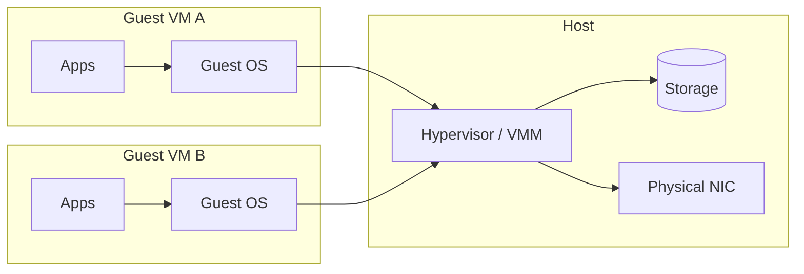

import { Aside, Steps } from '@astrojs/starlight/components';
import HistoricalNote from '/src/components/HistoricalNote.astro';

{/* TODO: demonstrate everything using UTM on macOS or similar, use Starlight's Tabs to show how to do things in different Hypervisors and hosts, choose a guest OS that works on ARM and x86 */}

{/* TODO: group some headings into subheadings */}

Suppose you need to test a risky kernel upgrade before touching your production server. Or you need three environments (Ubuntu, AlmaLinux, and Debian) to verify your deployment scripts work across distributions. Or you want to give each developer on your team an isolated sandbox so that a misconfiguration in one environment cannot affect another. Buying separate physical hardware for every scenario is slow and expensive; rebuilding from scratch after every mistake wastes hours. Virtualization solves all three problems by letting you run multiple isolated operating systems on the same physical machine simultaneously, and roll back any of them to a clean state in seconds.

Virtualization inserts a thin control layer called a hypervisor between software and hardware. Instead of dedicating a whole server to one workload, you carve the machine into slices of CPU time, memory, storage, and network interfaces that each guest believes are "its" hardware. This multiplies flexibility: you can prototype quickly, recover from mistakes by rolling back snapshots, and drive hardware utilization closer to what you paid for.

In modern operations, virtualization underpins public clouds, private labs, disaster recovery strategies, and reproducible development environments. You will use it to practice risky configuration changes safely and to host services whose operating systems differ from your laptop's. Building on these fundamentals prepares you for adjacent abstractions like containers, Functions-as-a-Service (serverless), and Infrastructure as Code (IaC).

By the end of this lecture you should be able to explain how hypervisors schedule work, choose sensible virtual hardware sizes, take and manage snapshots, and judge when a VM versus a container makes sense.

## Core Vocabulary

Before diving deeper we need a shared vocabulary. 

A **host** is the physical system providing CPU, memory, storage, and I/O. A **hypervisor** (also called a Virtual Machine Monitor) is the software component that arbitrates those resources among guests. A **guest** (or virtual machine / VM) is an installed operating system plus its virtual hardware configuration running under the hypervisor's control. 

A **virtual CPU** (vCPU) is a schedulable execution context presented to a guest, mapped to one or more physical cores or hardware threads. A **disk image** is a file (or logical block device) that stores a virtual disk's blocks (e.g. qcow2, vmdk, vdi, raw). A **snapshot** captures the state of a VM's storage (and optionally memory) at a point in time so you can revert. **Paravirtualized drivers** are guest drivers explicitly written to cooperate with the hypervisor for efficiency (e.g. virtio). **Live migration** is moving a running VM between hosts with minimal disruption. These terms recur in tooling docs, job postings, and runbooks; knowing them speeds comprehension and lets you ask better questions.

<Aside type="tip" icon="star" title="Example: Relating Terms">
If you run Ubuntu inside VirtualBox on your Mac: the MacBook is the *host*, VirtualBox is the *hypervisor* (Type-2), the Ubuntu installation is the *guest* VM, its two configured *vCPUs* are threads that VirtualBox schedules onto your physical cores, and the `.vdi` file in your VirtualBox folder is the VM's primary *disk image*.
</Aside>

**Common Pitfalls**
- Treating "VM" and "container" as synonyms (they isolate at different layers).
- Ignoring the difference between a snapshot (rollback) and a backup (separately stored copy).

## Why Virtualize
Virtualization matters because it converts hardware from a static asset into a dynamic pool you can programmatically slice, pause, clone, and move. Operational teams use VMs to isolate failures; if one guest kernel panics it rarely affects neighbors. Developers spin up ephemeral environments to test changes that require kernel modules or different distributions. Disaster recovery strategies replicate VM images to a second site so services can resume quickly after hardware loss. Economically, virtualization raises utilization: instead of ten servers each 10% busy, one larger host might run ten guests at 60-70% aggregate usage with headroom. Strategically, skills you build here transfer directly to cloud usage, because cloud "instances" are VMs exposed via APIs.

**Common Pitfalls**
- Assuming virtualization is "free" performance-wise; there is overhead (though often modest with hardware assistance).
- Oversizing every VM "just in case," which starves the host and causes paging.

## Architecture: Host, Hypervisor, Guests
At runtime the hypervisor multiplexes physical CPUs and memory pages among guests while mediating privileged operations. On x86 and ARM, hardware virtualization extensions (Intel VT-x, AMD-V, ARM Virtualization Extensions) let guest code run near native speed in a CPU mode that traps only sensitive instructions. Device access is either fully emulated (the hypervisor simulates a network card), paravirtualized (a cooperative high-performance interface like virtio-net), or directly assigned (PCI passthrough of a physical GPU). The balance of emulation vs paravirtualization drives performance and compatibility. Modern stacks (KVM + QEMU, Hyper-V, ESXi, Xen) combine these techniques automatically; your job is usually to select enhanced drivers inside the guest.

The diagram shows two guests whose system calls ultimately depend on hypervisor-mediated access to storage and network hardware; isolation boundaries sit between guests at the hypervisor layer.

**Common Pitfalls**
- Forgetting to install paravirtual drivers (e.g. virtio) and accepting slow emulated hardware.
- Assuming a diagram's simplicity means direct hardware access; most devices are shared.

<Aside type="note" title="Hardware Virtualization vs Hardware Emulation">
Hardware **virtualization** uses CPU features (like Intel VT-x, AMD-V, or ARM Virtualization Extensions) to let guest operating systems run instructions almost directly on the host CPU, with the hypervisor only stepping in for privileged operations. This delivers *near-native performance*.  

Hardware **emulation** means the hypervisor/software simulates an entire hardware platform, translating every instruction and device interaction. This allows running software for one architecture on a different one, but is *much slower*. 

Some examples of emulation include running Windows for x86 on an Apple Silicon Mac using UTM or QEMU in full emulation mode, or running a Nintendo DS emulator on an iPhone. The first scenario will be very slow, while the second will be less so, because the iPhone's powerful chips and optimized emulators easily handle the DS's modest hardware requirements, leveraging efficient APIs like Metal for smooth performance.
</Aside>

## Virtualization Modes

Modern hypervisors combine several different techniques. Understanding the vocabulary helps you read documentation and make sense of performance tuning advice.

### Full Virtualization
Full virtualization completely emulates the underlying hardware, defining virtual replacements for all basic computing resources (storage drivers, network devices, motherboard hardware, BIOS, etc.). Guest operating systems run unmodified because they believe they are talking to real hardware. The trade-off is performance: every hardware interaction must be intercepted and translated by the hypervisor.

[QEMU](https://www.qemu.org/) is a common open-source tool that serves two distinct roles depending on the workload. As a **virtualizer**, it hands CPU execution directly to a hardware acceleration backend — KVM on Linux or Apple's Hypervisor framework on macOS — so guest code runs at near-native speed when the guest and host share the same CPU architecture. As an **emulator**, it translates every instruction between architectures, making it possible to run x86 software on an ARM host (or vice versa) at a significant performance cost.

In practice, the role QEMU plays depends on the host and the guest. Running an ARM Linux VM on an Apple Silicon Mac using UTM is **near-native virtualization**: the guest uses the same instruction set as the host, and Apple's Hypervisor framework handles isolation. Running an x86 Windows guest on that same Mac is **true emulation**: every x86 instruction must be translated to ARM, which is why it is noticeably slower. QEMU also supports **User Mode Emulation**, which runs individual processes compiled for one architecture on a different-architecture host without virtualizing an entire machine.

### Paravirtualization
Paravirtualization requires modifying the guest OS so it is aware of its virtualized state and actively cooperates with the hypervisor. The hypervisor presents a set of well-defined APIs, and the guest calls those APIs instead of issuing raw hardware instructions. This approach offers better performance and efficiency than full virtualization because there is less intercepted work. It was popularized by the Xen hypervisor. With the widespread adoption of hardware-assisted virtualization, pure paravirtualization is less common, but paravirtualized *drivers* remain important (see below).

### Hardware-Assisted Virtualization
Generalized in 2004-2005 by Intel (VT-x) and AMD (AMD-V) for the x86 architecture, hardware-assisted virtualization is today's baseline. The CPU and memory controller manage virtualization in hardware under the hypervisor's control, allowing guest code to run near native speed. Guests do not know they are running on a virtualized CPU. Additional hardware (the rest of the system's devices) still requires full or paravirtualization, so the two approaches are often mixed.

### Paravirtualized Drivers
Paravirtualized drivers complement hardware-assisted virtualization. All operating systems allow add-on drivers, and hypervisor projects provide high-performance drivers for common devices:

- Disk/storage (e.g., **virtio-blk**, **virtio-scsi**)
- Network interfaces (e.g., **virtio-net**)
- Display and input (e.g., **virtio-gpu**, **virtio-input**)

Installing these drivers inside the guest instead of accepting the default fully-emulated devices can dramatically improve throughput and reduce CPU overhead. Some components (such as the interrupt controller or BIOS resources) cannot be fully covered by drivers and still require partial emulation.

<Aside type="tip" title="Virtualization Today">
In practice, modern stacks use a mix of hardware-assisted virtualization, paravirtualized drivers, and a small amount of paravirtualized code in guest kernels. Pure full emulation of every device is rare. The hypervisor negotiates the best available approach for each component automatically, so you rarely need to choose manually; but installing the vendor's guest tools or virtio drivers makes a measurable difference.
</Aside>

## Hypervisor Types (and Why the Distinction Blurs)
Historically we labeled hypervisors as Type-1 (bare-metal: Proxmox VE / KVM, VMware ESXi, Microsoft Hyper-V, Xen) and Type-2 (hosted: VirtualBox, VMware Workstation, UTM, Parallels). Type-1 runs directly on hardware and includes only what it needs to schedule guests; Type-2 runs within a general OS as an application. In practice the lines blur: KVM is a Linux kernel module, so is Linux plus KVM a host OS with a Type-2 VMM, or a Type-1 platform? The distinction is still useful when choosing tooling: bare-metal hypervisors offer centralized, headless management and consistent performance; hosted hypervisors offer convenience, UI, and better desktop hardware integration (sound, USB, clipboard) for learning labs. Focus less on purity and more on operational fit, licensing model, and ecosystem support.

<HistoricalNote title="From IBM Mainframes to VMware on x86 (1972-1998)">
The idea of running multiple operating systems on a single machine dates to 1972, when IBM shipped the VM/370 mainframe OS. VM/370 let customers run multiple isolated copies of their existing software, critical when time on the machine cost thousands of dollars per hour. The concept then largely disappeared as the PC era pushed toward single-user machines. VMware reinvented it for commodity x86 hardware in 1998. Founded by Diane Greene and Mendel Rosenblum (a Stanford professor), VMware shipped a hypervisor at a time when Intel and AMD CPUs had no hardware virtualization support; it had to binary-translate privileged instructions in software. The product was initially dismissed as a curiosity; server consolidation proved the business case, and VMware became one of the most profitable software companies in enterprise IT history before Broadcom's 2023 acquisition fundamentally changed its licensing model.
</HistoricalNote>

**Common Pitfalls**
- Treating Type-2 as "not real" virtualization (they still use hardware assist and can be performant).
- Overindexing on taxonomy instead of management capabilities (e.g. clustering, APIs).

## Virtual Hardware and Resource Allocation
When defining a VM you declare a bundle of virtual hardware: number of vCPUs, memory size, virtual disks, network adapters, firmware (BIOS vs UEFI), and ancillary devices (TPM, GPU). The goal is sufficiency with observability, not speculative overprovisioning. Start small, watch utilization inside (guest metrics) and outside (host hypervisor statistics), then resize. Capacity planning is iterative: predict → measure → adjust. Every resource has its own tuning levers and overcommit risks, so we explore them separately below.

### CPU Scheduling
Hypervisors schedule vCPUs onto physical cores using time slices. Modern workloads exhibit bursts; idle guests relinquish their quantum early. Moderate overcommit (e.g. allocating total vCPUs ≈ 2-4× physical cores) often works for mixed utilization sets. Performance drops when too many runnable vCPUs contend simultaneously, raising run queue lengths and latency. NUMA (Non-Uniform Memory Access) topology enters for large hosts; pinning a VM's vCPUs and memory to a NUMA node can reduce cross-node latency for databases. Measure with tools: `top`, `htop`, `vmstat`, `sar`, or hypervisor dashboards (`esxtop`, `virsh domstats`).

**Common Pitfalls**
- Matching vCPU count to physical core count "for fairness," leading to idle waste.
- Assigning many vCPUs to a lightly threaded app, increasing scheduling overhead.

### Memory Management
Memory is harder to overcommit safely because swapping (paging to disk) is orders of magnitude slower than RAM. Hypervisors employ techniques: page sharing (identical memory pages deduplicated), ballooning (a driver inside the guest releases pages back to the host under pressure), and memory compression. Start with the minimum the OS + baseline services need, then grow if the guest's "used + cache" nears its allocation and performance degrades. Monitor host swap usage; if the host is swapping, all guests suffer. Some platforms support memory hot-add for online scaling.

**Common Pitfalls**
- Ignoring sustained host swap activity (a siren of overload).
- Confusing guest "free" memory (which may be used as cache) with waste.

### Storage and Disk Images
Virtual disks are files (qcow2, vmdk, vdi) or block devices (LVM volumes, ZFS zvols). Thin-provisioned (sparse) images allocate physical blocks on demand, conserving space but risking fragmentation and overcommit (host runs out of space unexpectedly). Thick (preallocated) images reserve space upfront, improving predictability for I/O intensive apps. Formats like qcow2 add features (snapshots, compression, encryption) at some performance cost relative to raw. Place performance-sensitive workloads on faster storage (NVMe, RAID10, ZFS with appropriate cache devices) and separate VM images from host OS partitions to simplify growth and monitoring. Align backup strategy: snapshots are not backups until copied off the storage pool.

**Common Pitfalls**
- Stacking long snapshot chains (each adds lookup overhead and risk).
- Letting thin provisioning silently fill the host filesystem.

### Networking Modes
Hypervisors expose virtual NICs that connect guests to virtual switches or host networking stacks. NAT mode lets guests reach the Internet via host address translation, simple and safe for laptops. Bridged mode attaches the guest directly to the physical LAN, giving it a peer IP (needed for inbound services). Host-only creates an isolated network for inter-guest communication without external exposure. Some platforms add internal networks, macvtap (direct attach), or SR-IOV (single root I/O virtualization) for near-native NIC performance. Choose the simplest mode that satisfies reachability and security requirements; document port mappings when using NAT.

**Common Pitfalls**
- Choosing bridged mode on a Wi-Fi that blocks unknown MACs (guest appears "offline").
- Forgetting firewall adjustments when a service moves from host to guest network identity.

## Operations and Advanced Features

Once a VM is created and resourced, day-to-day management and advanced capabilities become essential for reliability, automation, and scale. This section explores the operational tools and features that make virtualization practical in real environments: taking and managing snapshots, automating VM lifecycles, measuring and tuning performance, enforcing security and isolation, and enabling live migration or high availability. Mastery of these features lets you move beyond basic VM setup to robust, repeatable, and secure infrastructure operations.

### Snapshots and Clones
Snapshots capture a point-in-time state: the base disk becomes read-only and new writes go into a delta file; optionally memory and device state are stored so you can resume a paused execution. They are excellent for short-lived safety nets during upgrades, schema migrations, or risky configuration edits. Long chains degrade performance because reads must traverse layers; consolidate once a change proves stable. Clones create an independent copy of a VM (linked clones share base blocks; full clones duplicate). Use snapshots for rollback windows; use image backups and configuration management for long-term recoverability.

<Aside type="tip" icon="star" title="Example: Safe Package Upgrade">
1. Take snapshot `pre-nginx-1.26`.
2. Upgrade Nginx and reload service.
3. Run smoke tests (`curl`, log checks).
4. If errors: revert snapshot; else: delete snapshot within 24h to collapse layers.
</Aside>

**Common Pitfalls**
- Using snapshots as "backups" and losing data when the datastore fails.
- Keeping dozens of forgotten snapshots, inflating storage usage.

### VM Lifecycle and Automation
Manually clicking through wizards does not scale. Templates (golden images) and cloud-init (or ignition on Fedora CoreOS) let you parameterize hostnames, users, SSH keys, and packages at first boot. API tooling (e.g. `virsh`, `govc` for vSphere, Proxmox API, Terraform providers) enables scripted provisioning and teardown. Combine Infrastructure as Code (IaC) (Terraform) with configuration management (Ansible) to converge VM state repeatably. Version control the template build steps (Packer) so you can rebuild on security patch day rather than nurse snowflake images.

**Common Pitfalls**
- Hand-editing templates and losing reproducibility.
- Baking secrets (passwords, keys) into images instead of injecting at deploy time.

Infrastructure as Code and Configuration Management will be covered in later lectures.

### Performance and Measurement
Treat performance empirically. Baseline: record CPU ready time (wait to be scheduled), memory balloon size, disk latency (ms), and network throughput for a healthy VM. Use synthetic load (e.g. `fio` for disk, `iperf3` for network, stress tools) in a lab to understand ceilings. Investigate slowdowns by checking host contention first; a guest perceiving slowness may just be starved for CPU cycles. Align storage format to workload: databases benefit from low latency (often raw or preallocated volumes); log servers tolerate sparse images. Track growth of thin-provisioned disks to forecast expansion needs. Automate periodic reports.

**Common Pitfalls**
- Blaming the guest OS for latency when host is CPU saturated.
- Ignoring disk write amplification on copy-on-write formats for heavy random I/O.

### Security and Isolation
VMs isolate kernel faults and many user-space compromises, but side-channel attacks (e.g. speculative execution vulnerabilities) can pierce isolation if unpatched. Harden hosts: minimal install, timely microcode and hypervisor updates, restricted management interfaces (firewall + MFA, multi-factor authentication), signed images, and principle of least privilege for orchestration credentials. Leverage virtualization for defense in depth: separate roles (database vs web) into distinct VMs to limit lateral movement. Use virtual TPM (Trusted Platform Module, a hardware-backed secure key store) and secure boot features where supported to attest guest integrity. Encrypt disk images at rest (e.g. LUKS, Linux Unified Key Setup, the standard Linux full-disk encryption layer, inside guest or at storage layer) when threat models include physical access or multi-tenant storage.

**Common Pitfalls**
- Believing a VM boundary replaces network segmentation or logging.
- Skipping firmware updates that include virtualization security mitigations.

### Live Migration and High Availability
Live migration copies a running VM's memory to a target host while it continues executing; iterative pre-copy phases reduce the final pause to milliseconds-seconds. This enables non-disruptive hardware maintenance, load balancing, and evacuation prior to predicted failures. High availability (HA) layers monitor hosts; if one dies they restart (not migrate) affected VMs elsewhere using shared storage. Design constraints: shared or replicated storage accessible from both hosts, compatible CPU families (or CPU masking), and sufficient destination capacity. Measure acceptable downtime budgets to decide between pure restart vs seamless migration.

**Common Pitfalls**
- Migrating latency-sensitive real-time apps without testing pause tolerance.
- Forgetting to align CPU feature sets, causing migration failures.

## Process Virtual Machines

A *process virtual machine* (also called a language runtime or application VM) is conceptually different from the system hypervisors discussed above. It is a software layer that runs a single application written in an intermediate language, making that application portable across host operating systems. The **Java Virtual Machine (JVM)** is the canonical example: Java source compiles to JVM bytecode, and the JVM executable itself is ported to run on countless operating systems, enabling Java programs to run unchanged wherever the JVM does. Python, Ruby, and the .NET CLR follow the same principle. Process VMs are not used for isolation of full operating systems, so they do not appear in typical sysadmin workflows, but understanding the distinction prevents confusion when documentation uses "VM" in a Java or containerization context.

## Running Linux on Windows: WSL

Microsoft introduced WSL 1 (Windows Subsystem for Linux) in 2016, followed by WSL 2 in 2019. WSL 2 uses a real Linux kernel and full virtualization, giving you access to Linux tools and utilities with minimal performance overhead and tight VS Code integration. It is useful for development workflows where you want Linux command-line tools without managing a separate VM.

<Aside type="caution" title="WSL Is Not a Server Platform">
WSL is recommended by Microsoft for development use only. Configuration options are limited, systemd support is partial, and networking behavior differs from a standalone Linux VM. If you need a Linux server for production or lab work, use a dedicated VM or a cloud instance.
</Aside>

## Hypervisor Ecosystem and Market State

### Proxmox Virtual Environment (VE)
Proxmox VE is a complete, open-source server management platform for enterprise virtualization. It is a bare-metal (Type 1) hypervisor based on Debian, integrates the KVM hypervisor and Linux Containers (LXC), and adds software-defined storage (including ZFS) and networking on a single platform. An integrated web-based UI manages VMs and containers, and the platform includes high-availability clustering and disaster recovery tools. Given the licensing changes around VMware ESXi, Proxmox VE has become a widely recommended open alternative.

### Cloud Provider Hypervisors
The major public cloud platforms each rely on enterprise-grade hypervisors under the hood:

| Provider | Hypervisor |
|----------|-----------|
| Microsoft Azure | Hyper-V (proprietary) |
| Amazon Web Services | Xen (historical); [AWS Nitro](https://aws.amazon.com/ec2/nitro/) (current, KVM-based) |
| Google Cloud Platform | KVM (open source) / ESXi (proprietary) |
| IBM Cloud | XenServer, VMware, and Hyper-V |

### VMware Licensing Shift
After Broadcom's acquisition of VMware, the free ESXi program was discontinued then partially reinstated (version 8.0 Update 3e, 2025) with ongoing community debate about scope and support. This has accelerated adoption of open alternatives like Proxmox VE, oVirt, and OpenStack-based stacks.

### Bootable USB: Ventoy
[Ventoy](https://www.ventoy.net/) is an open-source tool for creating bootable USB drives. Instead of reformatting the drive for each ISO, you copy ISO/WIM/IMG/VHD(x)/EFI files to the drive and Ventoy presents a boot menu. This is convenient for testing multiple hypervisor installers, Linux distributions, and rescue environments from a single USB stick.

## Virtualization Ecosystem

Industry consolidation and licensing changes keep reshaping choices. After Broadcom's acquisition of VMware, the free ESXi program was briefly discontinued then reinstated in 2025 (version 8.0 Update 3e) with community debate over support scope. This has accelerated interest in open platforms like KVM (ubiquitous via Proxmox VE, oVirt, OpenStack) and lightweight homelab stacks. Proxmox VE continues traction for its integrated UI, ZFS support, and LXC containers alongside KVM VMs. Public clouds still predominantly use customized KVM derivatives ([AWS Nitro](https://aws.amazon.com/ec2/nitro/), GCP KVM, Azure Hyper-V variants) to expose instance types. Apple's virtualization framework and tools like UTM simplify ARM-based macOS/Linux guest experimentation on Apple Silicon. The practical takeaway: be tool-curious, but master the transferable primitives: CPU scheduling, memory pressure, block and network I/O paths, image lifecycle. Licensing shifts; fundamentals persist.

**Common Pitfalls**
- Locking skills to one vendor feature set (e.g. only vCenter flows) and struggling to translate.
- Ignoring license terms on backup APIs or feature availability in free tiers.

## Virtualization vs Containers vs Serverless
Containers (e.g. Docker, Kubernetes pods) package processes with user-space dependencies while sharing the host kernel; this yields faster startup, denser packing, and less memory overhead. VMs virtualize hardware and encapsulate full OS kernels, but are heavier, with stronger isolation and kernel diversity. Serverless (Functions-as-a-Service) adds a managed layer that schedules short-lived function invocations onto multi-tenant micro-VMs or containers you do not manage directly. Choice hinges on operational boundaries: need a custom kernel module or different Linux distribution? Use a VM. Need to horizontally scale stateless web handlers rapidly? Consider containers or serverless. Often you layer them: a VM cluster provides consistent host baselines; containers orchestrate application components on top.

<Aside type="tip" icon="star" title="Example: Layering">
An organization runs a Proxmox cluster (VM layer) hosting three Ubuntu VMs forming a Kubernetes control plane. Application microservices run as containers inside that cluster. Stateful database workloads remain on dedicated VMs with tuned storage rather than inside containers for clearer performance isolation.
</Aside>

**Common Pitfalls**
- Forcing all workloads into containers, including those needing kernel tuning or device passthrough.
- Spinning up a VM per microservice and suffering orchestration sprawl.

Containers will be covered in a later lecture.

## Hands-On: Creating Your First VM
{/* TODO: get rid of that section and merge instead the VM creation in the flow of the lecture */}
Creating a first VM solidifies the abstractions. Choose a lightweight Linux distribution (e.g. Debian, Ubuntu Server, AlmaLinux). Start with 2 vCPUs, 2-4 GB RAM, a 20-40 GB thin disk (expect it to grow), and a single NAT or bridged NIC depending on whether you need inbound access. Name a snapshot "pre-install" before first boot. Boot from the ISO, perform the OS install, then update packages and install a paravirtual driver package if needed (often already present). Collect baseline metrics: CPU idle %, memory used vs cache, disk latency during a simple `apt update`. Finally, document the build steps (even in a short README) so you can script them later with cloud-init or Ansible.

<Aside type="tip" icon="star" title="Example: Post-Install Checklist">
1. Remove ISO from virtual CD drive.
2. Install paravirtual tools (e.g. `qemu-guest-agent`).
3. Set up SSH key authentication; disable password login.
4. Take snapshot `baseline-patched` after updates.
5. Record VM spec + purpose in inventory file.
</Aside>

**Common Pitfalls**
- Forgetting to detach the installer ISO and rebooting into setup again.
- Skipping guest agent install (losing graceful shutdown + metrics features).

## Quick Recap
- Virtualization abstracts hardware so multiple isolated OS instances share a host while believing they own hardware.
- Hypervisors schedule vCPUs, manage memory, virtualize or paravirtualize devices, and expose snapshots, cloning, and migration.
- Right-sizing (start small + measure) beats speculative overprovisioning for CPU, RAM, disk, and network.
- Snapshots are short-term rollback tools; backups are independent, durable copies; do not conflate them.
- Containers and serverless complement, not replace, VMs; choose based on isolation, kernel needs, and operational scope.
- Ecosystem tools shift, but core principles (resource arbitration, isolation, observability) remain steady.
- Common pitfalls to watch for:
    - Treating snapshots as backups (risking total loss on datastore failure)
    - Oversizing resources early, masking real utilization signals
    - Ignoring host swap: silent performance killer
    - Letting thin disks fill an underlying filesystem without alerts
    - Neglecting to patch hypervisors for virtualization security advisories
    - Vendor lock-in of operational muscle memory
