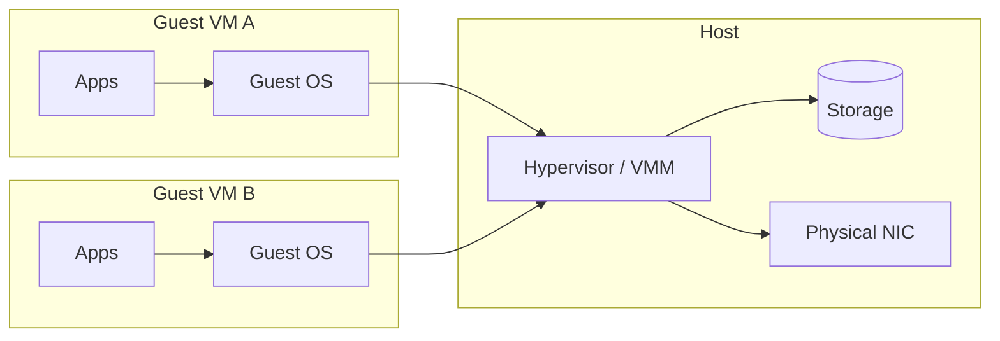

import { Aside, Steps, LinkCard, CardGrid } from '@astrojs/starlight/components';
import HistoricalNote from '/src/components/HistoricalNote.astro';

Suppose you need to test a risky kernel upgrade before touching your production server. Or you need three environments (Ubuntu with `apt`, AlmaLinux with `dnf`, and Arch Linux with `pacman`) to verify your deployment scripts work across distributions with genuinely different package managers and release models. Or you want to give each developer on your team an isolated sandbox so that a misconfiguration in one environment cannot affect another. Buying separate physical hardware for every scenario is slow and expensive; rebuilding from scratch after every mistake wastes hours. Virtualization solves all three problems by letting you run multiple isolated operating systems on the same physical machine simultaneously, and roll back any of them to a clean state in seconds.

Virtualization inserts a thin control layer called a hypervisor between software and hardware. Instead of dedicating a whole server to one workload, you carve the machine into slices of CPU time, memory, storage, and network interfaces that each guest believes are "its" hardware. This multiplies flexibility: you can prototype quickly, recover from mistakes by rolling back snapshots, and drive hardware utilization closer to what you paid for.

In modern operations, virtualization underpins public clouds, private labs, disaster recovery strategies, and reproducible development environments. You will use it to practice risky configuration changes safely and to host services whose operating systems differ from your laptop's. Building on these fundamentals prepares you for adjacent abstractions like containers, Functions-as-a-Service (serverless), and Infrastructure as Code (IaC).

By the end of this lecture you should be able to explain how hypervisors schedule work, choose sensible virtual hardware sizes, take and manage snapshots, and judge when a VM versus a container makes sense.

## Core Vocabulary

Before diving deeper we need a shared vocabulary. 

A **host** is the physical system providing CPU, memory, storage, and I/O. A **hypervisor** (also called a Virtual Machine Monitor) is the software component that arbitrates those resources among guests. A **guest** (or virtual machine / VM) is an installed operating system plus its virtual hardware configuration running under the hypervisor's control. 

When using a hosted hypervisor such as VirtualBox or UTM, you may also hear **host OS**. That means the normal operating system on the physical machine that the hypervisor application runs inside.

A **virtual CPU** (vCPU) is a schedulable execution context presented to a guest, mapped to one or more physical cores or hardware threads. A **disk image** is a file (or logical block device) that stores a virtual disk's blocks (e.g. qcow2, vmdk, vdi, raw). A **snapshot** captures the state of a VM's storage (and optionally memory) at a point in time so you can revert. **Paravirtualized drivers** are guest drivers explicitly written to cooperate with the hypervisor for efficiency (e.g. virtio). **Live migration** is moving a running VM between hosts with minimal disruption. These terms recur in tooling docs, job postings, and runbooks; knowing them speeds comprehension and lets you ask better questions.

<Aside type="tip" icon="star" title="Example: Relating Terms">
If you run Ubuntu inside VirtualBox on your Mac: the MacBook is the *host*, VirtualBox is the *hypervisor* (Type-2), the Ubuntu installation is the *guest* VM, its two configured *vCPUs* are threads that VirtualBox schedules onto your physical cores, and the `.vdi` file in your VirtualBox folder is the VM's primary *disk image*.
</Aside>

## Why Virtualize
Virtualization matters because it converts hardware from a static asset into a dynamic pool you can programmatically slice, pause, clone, and move. Operational teams use VMs to isolate failures; if one guest kernel panics it rarely affects neighbors. Developers spin up ephemeral environments to test changes that require kernel modules or different distributions. Disaster recovery strategies replicate VM images to a second site so services can resume quickly after hardware loss. Economically, virtualization raises utilization: instead of ten servers each 10% busy, one larger host might run ten guests at 60-70% aggregate usage with headroom. Strategically, skills you build here transfer directly to cloud usage, because many cloud "instances" are VMs exposed via APIs, even though clouds also offer other compute models such as bare metal and serverless platforms. Note that virtualization is not free performance-wise; there is real overhead, though it is often modest with hardware assistance.

<LinkCard
  title="Windows Users"
  href="/practicalities/windows-users/"
  description="Running Windows on your personal machine? See how to set up WSL and a Linux environment for this course."
/>

<LinkCard
  title="Ventoy"
  href="https://www.ventoy.net/"
  description="An open-source tool for creating bootable USB drives that can hold multiple ISOs at once. Useful for testing hypervisor installers, Linux distributions, and rescue environments from a single USB stick."
/>

## Architecture: Host, Hypervisor, Guests
At runtime the hypervisor multiplexes physical CPUs and memory pages among guests while mediating privileged operations. On x86 and ARM, hardware virtualization extensions (Intel VT-x, AMD-V, ARM Virtualization Extensions) let guest code run near native speed in a CPU mode that traps only sensitive instructions. Device access is either fully emulated (the hypervisor simulates a network card), paravirtualized (a cooperative high-performance interface like virtio-net), or directly assigned (PCI passthrough of a physical GPU). The balance of emulation vs paravirtualization drives performance and compatibility. Modern stacks (KVM + QEMU, Hyper-V, ESXi, Xen) combine these techniques automatically; your job is usually to select enhanced drivers inside the guest.

The diagram shows two guests running their own applications and kernels, while privileged hardware access is mediated by the hypervisor. The important boundary is that Guest A does not touch Guest B's memory or devices directly; both must go through the hypervisor layer.

<Aside type="tip">
Install paravirtualized device drivers (for example virtio storage and network drivers) inside every VM. Also install your platform's guest agent for lifecycle integration and observability. The performance difference over fully-emulated devices is measurable.
</Aside>

<Aside type="note" title="Hardware Virtualization vs Hardware Emulation">
Hardware **virtualization** uses CPU features (like Intel VT-x, AMD-V, or ARM Virtualization Extensions) to let guest operating systems run instructions almost directly on the host CPU, with the hypervisor only stepping in for privileged operations. This delivers *near-native performance*.  

Hardware **emulation** means the hypervisor/software simulates an entire hardware platform, translating every instruction and device interaction. This allows running software for one architecture on a different one, but is *much slower*. 

For example, running an ARM Linux guest on Apple Silicon uses virtualization and can be close to native speed. Running an x86 guest on the same machine requires emulation, which is much slower because instructions must be translated between architectures.
</Aside>

## Virtualization Modes

Modern hypervisors combine several different techniques. Understanding the vocabulary helps you read documentation and make sense of performance tuning advice.

### Full Virtualization
Full virtualization presents a complete virtual hardware platform to a guest operating system so the guest can run unmodified. The guest behaves as if it is running on real hardware (virtual disk controller, NIC, firmware, and so on), while the hypervisor controls access to the real host resources underneath.

In modern systems, full virtualization is usually implemented with hardware assistance, so CPU execution is often near-native when guest and host architectures match. [QEMU](https://www.qemu.org/) is a common open-source tool that serves two distinct roles depending on the workload. As a **virtualizer**, it hands CPU execution directly to a hardware acceleration backend (KVM on Linux or Apple's Hypervisor framework on macOS), so guest code runs at near-native speed when the guest and host share the same CPU architecture. As an **emulator**, it translates instructions between architectures, making it possible to run x86 software on an ARM host (or vice versa) at a significant performance cost.

In practice, the role QEMU plays depends on the host and the guest. On Apple Silicon, running an ARM Linux guest via UTM is near-native virtualization; running an x86 guest is true emulation. QEMU also supports **User Mode Emulation**, which runs individual processes compiled for one architecture on a different-architecture host without booting a full guest OS, useful for testing cross-compiled binaries or cross-architecture programs in CI pipelines.

### Paravirtualization
Paravirtualization requires modifying the guest OS so it is aware of its virtualized state and actively cooperates with the hypervisor. The hypervisor presents a set of well-defined APIs, and the guest calls those APIs instead of issuing raw hardware instructions. This approach offers better performance and efficiency than full virtualization because there is less intercepted work. It was popularized by the Xen hypervisor. With the widespread adoption of hardware-assisted virtualization, pure paravirtualization is less common, but paravirtualized *drivers* remain important (see below).

### Hardware-Assisted Virtualization
Generalized in 2004-2005 by Intel (VT-x) and AMD (AMD-V) for the x86 architecture, hardware-assisted virtualization is today's baseline. The CPU and memory controller manage virtualization in hardware under the hypervisor's control, allowing guest code to run near native speed. Guests do not know they are running on a virtualized CPU. Additional hardware (the rest of the system's devices) still requires full or paravirtualization, so the two approaches are often mixed.

### Paravirtualized Drivers
Paravirtualized drivers complement hardware-assisted virtualization. All operating systems allow add-on drivers, and hypervisor projects provide high-performance drivers for common devices:

- Disk/storage (e.g., **virtio-blk**, **virtio-scsi**)
- Network interfaces (e.g., **virtio-net**)
- Display and input (e.g., **virtio-gpu**, **virtio-input**)

Installing these drivers inside the guest instead of accepting the default fully-emulated devices can dramatically improve throughput and reduce CPU overhead. Some components (such as the interrupt controller or BIOS resources) cannot be fully covered by drivers and still require partial emulation.

Although virtio-blk and virtio-scsi both provide paravirtualized storage, they integrate differently into the guest kernel. **virtio-blk** exposes a direct block device, so the kernel names it `vda`, `vdb`, and so on. **virtio-scsi** attaches through the kernel's SCSI subsystem, which uses SCSI naming conventions: `sda`, `sdb`, and so on -- the same names you would see with a fully-emulated SATA disk. The names alone therefore do not tell you whether the underlying driver is paravirtualized. To confirm which controller is present, inspect the PCI device list with `lspci`: a paravirtualized controller will appear as a Virtio device, while an emulated one will appear as an Intel AHCI, PIIX, or similar entry.

<Aside type="tip" title="Virtualization Today">
In practice, modern stacks use a mix of hardware-assisted virtualization, paravirtualized drivers, and a small amount of paravirtualized code in guest kernels. Pure full emulation of every device is rare. Much of this is selected for you by the platform, so you rarely choose every mechanism manually; but installing the vendor's guest tools or virtio drivers still makes a measurable difference.
</Aside>

## Hypervisor Types (and Why the Distinction Blurs)
Historically we labeled hypervisors as Type-1 (bare-metal: Proxmox VE, VMware ESXi, Xen, and Hyper-V-based server platforms) and Type-2 (hosted: VirtualBox, VMware Workstation, UTM, Parallels). Type-1 runs directly on hardware and includes only what it needs to schedule guests; Type-2 runs within a general OS as an application. In practice the lines blur: KVM is a Linux kernel module, so a Linux host running KVM is often treated operationally like a Type-1 platform even though the architecture is not as cleanly separated as the textbook definition suggests. The distinction is still useful when choosing tooling: bare-metal hypervisors offer centralized, headless management and consistent performance; hosted hypervisors offer convenience, UI, and better desktop hardware integration (sound, USB, clipboard) for learning labs. Focus less on purity and more on operational fit, licensing model, and ecosystem support.

<HistoricalNote title="From IBM Mainframes to VMware on x86 (1972-1998)">
The idea of running multiple operating systems on a single machine dates to 1972, when IBM shipped the VM/370 mainframe OS. VM/370 let customers run multiple isolated copies of their existing software, critical when time on the machine cost thousands of dollars per hour. The concept then largely disappeared as the PC era pushed toward single-user machines. VMware reinvented it for commodity x86 hardware in 1998. Founded by Diane Greene and Mendel Rosenblum (a Stanford professor), VMware shipped a hypervisor at a time when Intel and AMD CPUs had no hardware virtualization support; it had to binary-translate privileged instructions in software. The product was initially dismissed as a curiosity; server consolidation proved the business case, and VMware became one of the most profitable software companies in enterprise IT history before Broadcom's 2023 acquisition fundamentally changed its licensing model.
</HistoricalNote>

## Virtual Hardware and Resource Allocation
When defining a VM you declare a bundle of virtual hardware: number of vCPUs, memory size, virtual disks, network adapters, firmware (BIOS vs UEFI), and ancillary devices (TPM, GPU). The goal is sufficiency with observability, not speculative overprovisioning. Start small, watch utilization inside (guest metrics) and outside (host hypervisor statistics), then resize. Capacity planning is iterative: predict → measure → adjust. Every resource has its own tuning levers and overcommit risks, so we explore them separately below.

### CPU Scheduling

A vCPU is not a dedicated physical core reserved exclusively for a guest. It is a schedulable thread that the hypervisor multiplexes onto whatever physical cores are free at the moment. The hypervisor runs vCPUs in time slices: if a guest is idle, it surrenders its slice early and another guest's vCPU runs instead. This is why you can assign more total vCPUs across all guests than you have physical cores, a practice called **overcommit**, and it usually works fine because most guests are not all compute-bound at the same moment.

Assigning more vCPUs does not automatically make a guest faster. A single-threaded program can only use one vCPU at a time no matter how many you configure; adding more just raises scheduling overhead. Two vCPUs is a good starting point for a lab VM running typical server workloads. Increase only when a guest's CPU usage is consistently high and the workload actually parallelizes.

Overcommit becomes a problem when many guests are simultaneously maxing out their vCPUs: they queue up waiting for physical cores, and everything slows down. You can monitor CPU load inside a guest with `top` or `htop`. If idle percentage stays near zero under normal conditions, the guest is genuinely CPU-bound and may need more vCPUs, or the host may simply be overloaded.

### Memory Management

Memory is harder to overcommit safely than CPU because the fallback (**swapping**, where the OS moves memory pages to disk when it runs out of RAM) is orders of magnitude slower than actual RAM. An operation that takes nanoseconds in RAM can take milliseconds from disk. You will experience this as severe, sustained system slowness that can make a VM feel completely unresponsive.

Hypervisors use several techniques to make memory overcommit safer before resorting to swapping:

- **Page sharing**: If multiple VMs have loaded identical memory pages (for example, the same Linux kernel image), the hypervisor can detect the duplicates and store one shared copy, reclaiming the redundant pages. Guests are unaware this is happening.
- **Ballooning**: A special memory balloon driver inside the guest (for example `virtio-balloon` on KVM) that the hypervisor can "inflate." When the host is under memory pressure, it inflates the balloon, which asks the guest OS to allocate and hold memory, effectively returning those pages to the host's control before the situation becomes critical.
- **Memory compression**: Rarely-used pages are compressed and kept in a small in-RAM cache rather than written immediately to disk.

Page-sharing deduplication is platform-dependent and is not always enabled, especially in multi-tenant environments where security trade-offs are a concern.

For practical sizing: start a VM with the minimum memory its OS and baseline services need, then watch `free -h` inside the guest. If the "available" column stays near zero and the VM feels slow, increase the allocation. The critical warning sign is the host itself swapping; at that point every single guest on the host suffers simultaneously.

**Reading `free -h` correctly:** Linux deliberately uses spare RAM as a disk cache -- pages read from disk recently are kept in memory so repeat reads are fast. This is normal and healthy behavior; unused RAM is wasted RAM. As a result, `free -h` will always show far less "free" memory than you allocated. The column to watch is **available**, which estimates how much memory could realistically be reclaimed for new processes (including cache that would be released on demand). Only act if "available" approaches zero under normal workloads. To detect actual memory pressure, run `vmstat 1` and watch the `si` (swap in) and `so` (swap out) columns: non-zero values mean the guest is actively swapping and needs more RAM.

<Aside type="caution">
If the host machine is swapping, every guest suffers. Sustained swap activity is the clearest sign that the host as a whole is over-provisioned on memory.
</Aside>

### Storage and Disk Images

A virtual disk is often a file on the host's filesystem that stores all of the blocks of the guest's disk, though in production it may instead be backed by a logical block device or networked storage volume. The guest operating system cannot usually tell the difference between this virtual disk and a real physical drive. When a VM writes a file, those bytes ultimately land in whatever storage backend the hypervisor has assigned to that virtual disk. Several image formats are in common use:

- **qcow2** (QEMU Copy-On-Write 2): QEMU's native format. Supports thin provisioning, snapshots, compression, and encryption. It has a small I/O overhead compared to raw, but its feature set makes it the right default for most lab and desktop hypervisor use.
- **vmdk**: VMware's format. Supported by many tools beyond VMware, including VirtualBox.
- **vdi**: VirtualBox's native format.
- **raw**: A flat, byte-for-byte image. The fastest format for I/O because there is no format overhead, but it has no built-in snapshot support.

**Thin-provisioned** (sparse) images allocate host disk space only as the guest actually writes data. A 50 GB thin disk might consume only 8 GB on the host if the guest has written 8 GB so far. This conserves host storage, but introduces a risk: if all thin-provisioned VMs on the host grow simultaneously, the host filesystem can run out of space, which typically crashes all running VMs at once. **Thick (preallocated)** images reserve all space upfront, eliminating that surprise at the cost of higher immediate disk usage.

For a laptop lab environment, thin-provisioned qcow2 or vdi is the right choice. The performance difference is not noticeable for typical workloads, and the space savings are useful when you have multiple VMs.

<Aside type="note">
You may encounter references to LVM (Logical Volume Manager) and ZFS as storage backends for virtual disks. These are advanced storage technologies that provide additional features like efficient snapshots at the storage layer, checksumming, and pooled storage management. They are common in server and production environments. You will encounter them in later lectures when storage is covered in depth; for now, treat them as future topics.
</Aside>

One critical point: in the common desktop and lab case, **snapshots live on the same storage as the base image**. If that host disk fails, both the snapshot and the base disk are gone. A snapshot on the same drive is a rollback tool, not a backup. A backup must exist on separate storage: a different disk, a different machine, or a cloud object store.

### Networking Modes

When you create a VM, you assign it one or more virtual network adapters. The hypervisor offers several modes that control how the guest connects to the outside world:

- **NAT (Network Address Translation)**: The guest shares the host's network connection via address translation, similar to how your home router lets multiple devices share one public IP address. The guest can initiate connections outward (browse the web, run `apt update`, etc.), but machines outside your laptop cannot initiate connections to the guest unless you configure explicit port-forwarding rules. This is the safest and simplest mode for a lab VM.
- **Bridged**: The guest is connected directly to the same physical network as the host. It gets its own IP address from that network and is reachable from other machines on the same LAN. Use this when you need to SSH into the VM from another machine, or when you want the VM to behave like a real server on the network. Note: some Wi-Fi access points block traffic from unknown MAC addresses, which can prevent a bridged guest on Wi-Fi from receiving an IP.
- **Host-only**: Creates an isolated virtual network between the host and its guests, with no path to the internet. Useful for multi-VM lab setups where you want the VMs to communicate with each other and with your laptop, but not reach the outside world.

A common pattern for multi-VM labs is to use **host-only** so that VMs can communicate with each other and with the laptop without being reachable from the outside network. For example, a two-VM setup with a database server and a web server that should not be internet-facing would use host-only networking: both VMs get addresses on the same virtual network, the laptop can reach them directly, and there is no default gateway to the internet. If one of those VMs also needs outbound internet access (for package installs, for example), you can attach a second network adapter set to NAT alongside the host-only adapter.

For the activities in this course, NAT is sufficient unless a specific exercise requires inbound access. Start with NAT and switch only when you have a concrete reason to do otherwise.

## Operations and Advanced Features

Once a VM is created and resourced, day-to-day management and advanced capabilities become essential for reliability, automation, and scale. This section explores the operational tools and features that make virtualization practical in real environments: taking and managing snapshots, automating VM lifecycles, measuring and tuning performance, enforcing security and isolation, and enabling live migration or high availability. Mastery of these features lets you move beyond basic VM setup to robust, repeatable, and secure infrastructure operations.

### Snapshots and Clones
Snapshots capture a point-in-time state: in many implementations, the original disk state is preserved and new writes go into a delta file; optionally memory and device state are stored so you can resume a paused execution. They are excellent for short-lived safety nets during upgrades, schema migrations, or risky configuration edits. Long chains degrade performance because reads may have to traverse multiple layers; consolidate once a change proves stable. Clones create an independent copy of a VM (linked clones share base blocks; full clones duplicate). Use snapshots for rollback windows; use image backups and configuration management for long-term recoverability.

<Aside type="caution">
Snapshots and backups are not the same thing. In the usual single-host lab setup, if the underlying storage fails, both the snapshot and the base disk are gone. A backup must exist on separate storage.
</Aside>

<Aside type="tip" icon="star" title="Example: Safe Package Upgrade">
Imagine you are running a web server (Nginx) on a VM and need to upgrade it to a new version. You are not certain the upgrade will be clean. Here is the snapshot safety-net workflow:

1. **Take snapshot `pre-nginx-upgrade`** before touching anything. This freezes the current working state.
2. **Upgrade the package** (`sudo apt upgrade nginx`) and reload the service (`sudo systemctl reload nginx`).
3. **Verify**: `curl http://localhost` should return an HTTP response; check `sudo journalctl -u nginx` for errors.
4. **If something broke**: revert to the snapshot in your hypervisor's UI. You are back to the known-good state in seconds, with zero manual cleanup.
5. **If everything works**: delete the snapshot. Keeping snapshots long-term is not free: they accumulate delta layers that the hypervisor must traverse on every disk read, gradually degrading performance.

The same pattern applies to database schema migrations, kernel upgrades, or any configuration change you are not confident about. Snapshot first, make the change, verify, then commit (delete snapshot) or roll back.
</Aside>

### VM Lifecycle and Automation
Manually clicking through wizards does not scale. Templates (golden images) and cloud-init (or ignition on Fedora CoreOS) let you parameterize hostnames, users, SSH keys, and packages at first boot. API tooling (e.g. `virsh`, `govc` for vSphere, Proxmox API, Terraform providers) enables scripted provisioning and teardown. Combine Infrastructure as Code (IaC) (Terraform) with configuration management (Ansible) to converge VM state repeatably. Version control the template build steps (Packer) so you can rebuild on security patch day rather than nurse snowflake images.

<Aside type="caution">
Never bake secrets (passwords, API keys, SSH private keys) into VM images. Inject them at deploy time via cloud-init, environment variables, or a secrets manager.
</Aside>

Infrastructure as Code and Configuration Management will be covered in later lectures.

### Performance and Measurement
Treat performance empirically. Baseline: record CPU ready time (wait to be scheduled), memory balloon size, disk latency (ms), and network throughput for a healthy VM. Use synthetic load (e.g. `fio` for disk, `iperf3` for network, stress tools) in a lab to understand ceilings. Investigate slowdowns by checking host contention first; a guest perceiving slowness may just be starved for CPU cycles. Align storage format to workload: databases benefit from low latency (often raw or preallocated volumes); log servers tolerate sparse images. Track growth of thin-provisioned disks to forecast expansion needs. Automate periodic reports. For write-intensive workloads such as databases, note that copy-on-write formats like qcow2 carry write amplification overhead; raw or preallocated volumes typically serve these workloads better.

### Security and Isolation
VMs isolate kernel faults and many user-space compromises, but side-channel attacks (e.g. speculative execution vulnerabilities) can pierce isolation if unpatched. Harden hosts: minimal install, timely microcode and hypervisor updates, restricted management interfaces (firewall + MFA, multi-factor authentication), signed images, and principle of least privilege for orchestration credentials. Leverage virtualization for defense in depth: separate roles (database vs web) into distinct VMs to limit lateral movement. Use virtual TPM (Trusted Platform Module, a TPM device presented virtually to the guest and typically protected by VM encryption or host-managed keys) and secure boot features where supported to attest guest integrity. Encrypt disk images at rest (e.g. LUKS, Linux Unified Key Setup, the standard Linux full-disk encryption layer, inside guest or at storage layer) when threat models include physical access or multi-tenant storage.

<Aside type="caution">
A VM boundary does not replace network segmentation, logging, or firewall rules. Keep hypervisor firmware and microcode current: many virtualization security advisories require firmware patches, not just software updates.
</Aside>

### Live Migration and High Availability
Live migration copies a running VM's memory to a target host while it continues executing; iterative pre-copy phases reduce the final pause to milliseconds-seconds. This enables non-disruptive hardware maintenance, load balancing, and evacuation prior to predicted failures. High availability (HA) layers monitor hosts; if one dies they restart (not migrate) affected VMs elsewhere using shared storage. Common design constraints include shared or replicated storage accessible from both hosts, compatible CPU families (or CPU masking), and sufficient destination capacity, though some platforms also support shared-nothing migration approaches. Measure acceptable downtime budgets to decide between pure restart vs seamless migration. CPU feature masking (advertising a common CPU feature baseline across hosts) is often required when migrating between CPUs of different generations; mismatched feature sets can cause migration failures.

## Process Virtual Machines

A *process virtual machine* (also called a language runtime or application VM) is conceptually different from the system hypervisors discussed above. It is a software layer that runs a single application written in an intermediate language, making that application portable across host operating systems. The **Java Virtual Machine (JVM)** is the canonical example: Java source compiles to JVM bytecode, and the JVM executable itself is ported to run on countless operating systems, enabling Java programs to run unchanged wherever the JVM does. The **.NET CLR** is a similar runtime model. Process VMs are not used for isolation of full operating systems, so they do not appear in typical sysadmin workflows, but understanding the distinction prevents confusion when documentation uses "VM" in a Java or containerization context.

## Hypervisor Ecosystem and Market State

### Proxmox Virtual Environment (VE)
Proxmox VE is a complete, open-source server management platform for enterprise virtualization. It is a bare-metal (Type 1) hypervisor based on Debian, integrates the KVM hypervisor and Linux Containers (LXC), and adds software-defined storage (including ZFS) and networking on a single platform. An integrated web-based UI manages VMs and containers, and the platform includes high-availability clustering and disaster recovery tools. Given the licensing changes around VMware ESXi, Proxmox VE has become a widely recommended open alternative.

### Cloud Provider Hypervisors
The major public cloud platforms each rely on enterprise-grade hypervisors under the hood:

| Provider | Hypervisor |
|----------|-----------|
| Microsoft Azure | Hyper-V-based platform (customized by Azure) |
| Amazon Web Services | Xen (historical); [Nitro Hypervisor / Nitro System](https://aws.amazon.com/ec2/nitro/) (current) |
| Google Cloud Platform | KVM-based platform |
| IBM Cloud | Varies by offering (for example, KVM-based VPC virtual servers and separate VMware offerings) |

### VMware Licensing Shift
After Broadcom's acquisition of VMware, the free ESXi program was discontinued then reinstated in 2025 (version 8.0 Update 3e), with ongoing community debate about scope and support. This has accelerated adoption of open alternatives like Proxmox VE, oVirt, and OpenStack-based stacks.

## Virtualization Ecosystem

Industry consolidation and licensing changes keep reshaping choices. This has accelerated interest in open platforms like KVM (ubiquitous via Proxmox VE, oVirt, OpenStack) and lightweight homelab stacks. Proxmox VE continues traction for its integrated UI, ZFS support, and LXC containers alongside KVM VMs. Public clouds use customized hypervisor stacks (for example AWS Nitro, GCP's KVM-based platform, and Azure's Hyper-V-based platform) to expose instance types. Apple's virtualization framework and tools like UTM simplify ARM-based macOS/Linux guest experimentation on Apple Silicon. The practical takeaway: be tool-curious, but master the transferable primitives: CPU scheduling, memory pressure, block and network I/O paths, and image lifecycle. Licensing shifts; fundamentals persist. Skills locked to a single vendor's UI flows do not transfer well.

## Virtualization vs Containers vs Serverless
Containers (e.g. Docker, Kubernetes pods) package processes with user-space dependencies while sharing the host kernel; this yields faster startup, denser packing, and less memory overhead. VMs virtualize hardware and encapsulate full OS kernels, but are heavier, with stronger isolation and kernel diversity. Serverless (Functions-as-a-Service) adds a managed layer that schedules short-lived function invocations onto multi-tenant micro-VMs or containers you do not manage directly. Choice hinges on operational boundaries: need a custom kernel module or different Linux distribution? Use a VM. Need to horizontally scale stateless web handlers rapidly? Consider containers or serverless. Often you layer them: a VM cluster provides consistent host baselines; containers orchestrate application components on top.

<Aside type="tip" icon="star" title="Example: Layering">
An organization runs a Proxmox cluster (VM layer) hosting three Ubuntu VMs forming a Kubernetes control plane. Application microservices run as containers inside that cluster. Stateful database workloads remain on dedicated VMs with tuned storage rather than inside containers for clearer performance isolation.
</Aside>

Containers will be covered in a later lecture.

## Resources

{/* TODO: find better resources like video etc. */}

- <a href="https://www.youtube.com/watch?v=mQP0wqNT_DI" target="_blank" rel="noopener noreferrer">Virtual Machines explained in 15 Mins (YouTube)</a>
- <a href="https://www.linux-kvm.org/page/Documents" target="_blank" rel="noopener noreferrer">KVM Documentation (linux-kvm.org)</a>
- <a href="https://www.qemu.org/docs/master/" target="_blank" rel="noopener noreferrer">QEMU User Documentation</a>
- <a href="https://docs.getutm.app/" target="_blank" rel="noopener noreferrer">UTM Documentation (macOS/iOS)</a>
- <a href="https://www.virtualbox.org/manual/" target="_blank" rel="noopener noreferrer">VirtualBox User Manual</a>
- <a href="https://pve.proxmox.com/wiki/Main_Page" target="_blank" rel="noopener noreferrer">Proxmox VE Wiki</a>
- <a href="https://wiki.libvirt.org/index.html" target="_blank" rel="noopener noreferrer">libvirt Documentation (the API layer beneath KVM)</a>
- <a href="https://wiki.archlinux.org/title/QEMU" target="_blank" rel="noopener noreferrer">QEMU — Arch Linux Wiki (practical setup guide)</a>
