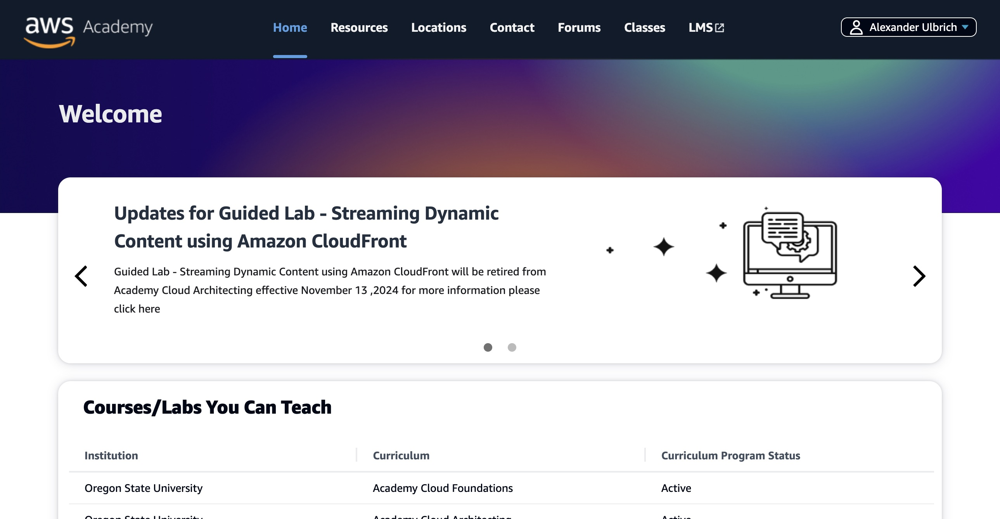
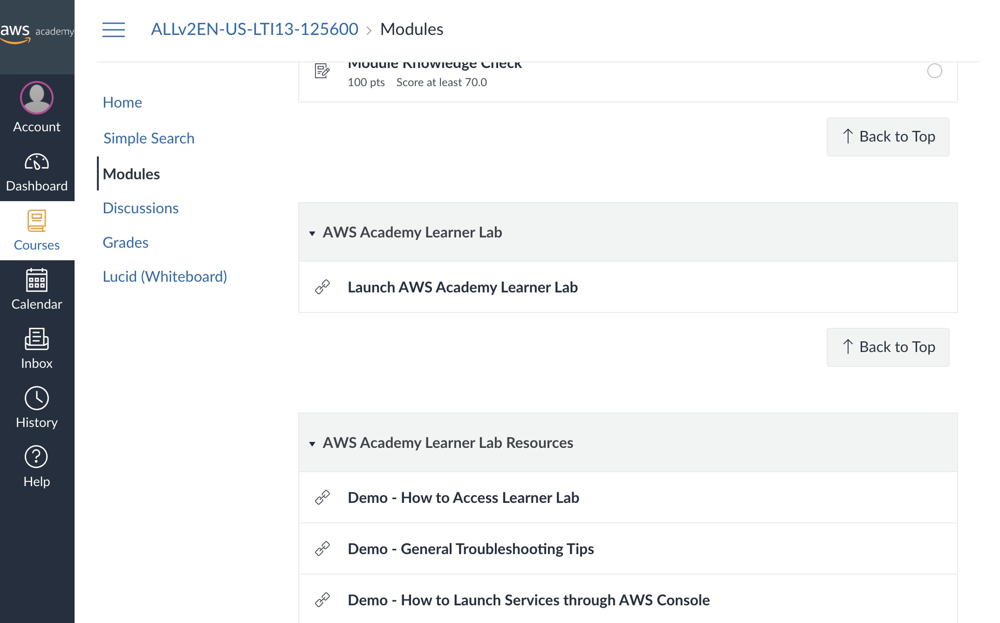
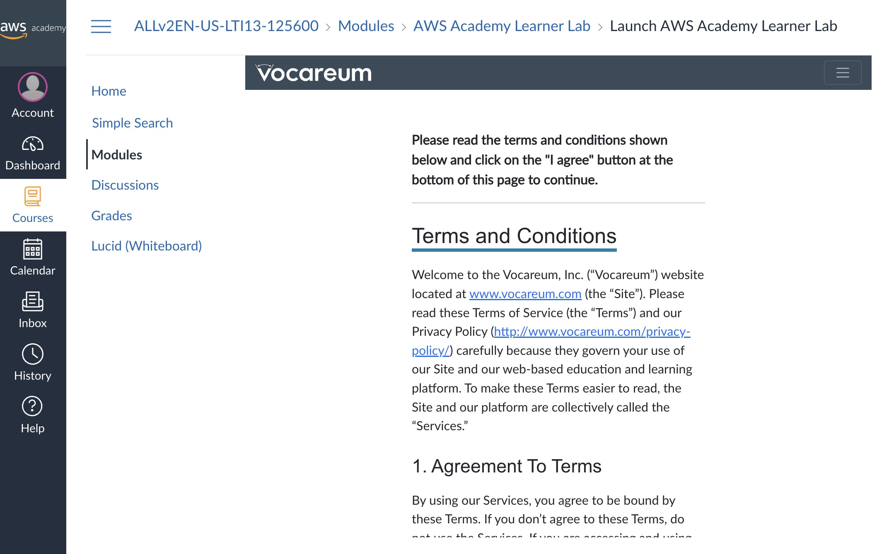
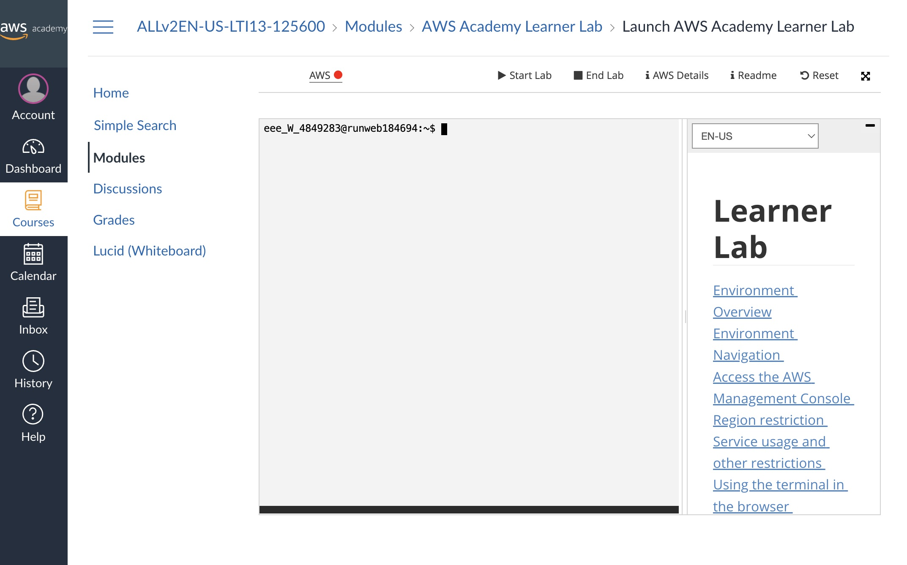
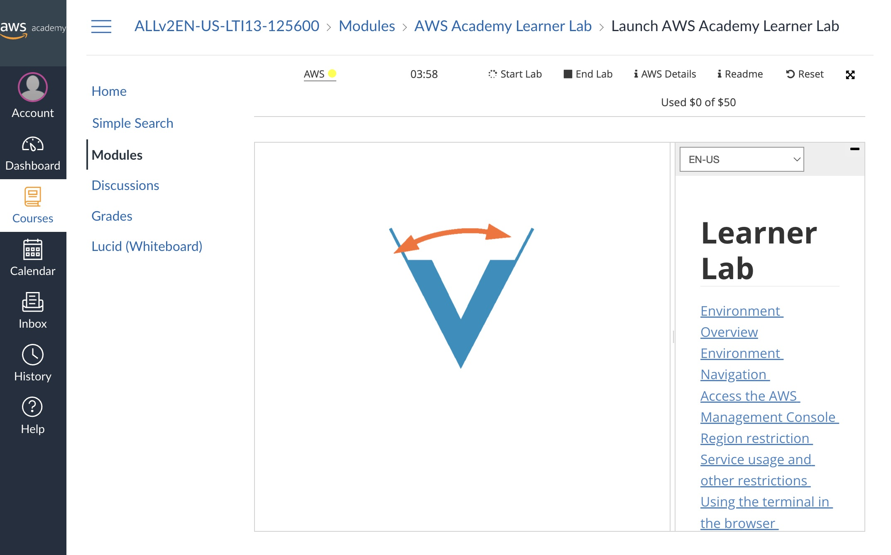
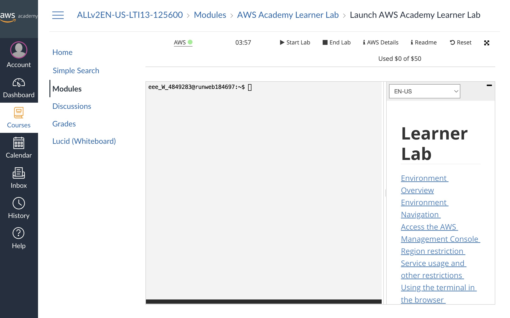
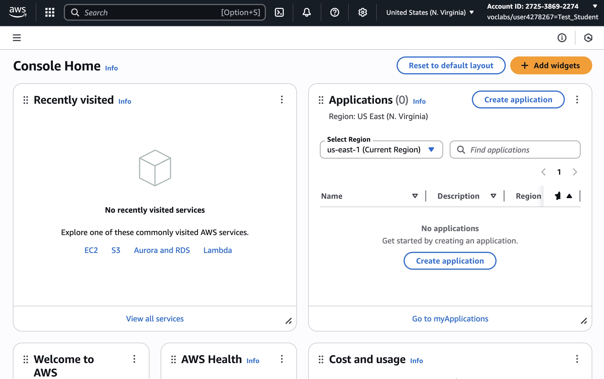
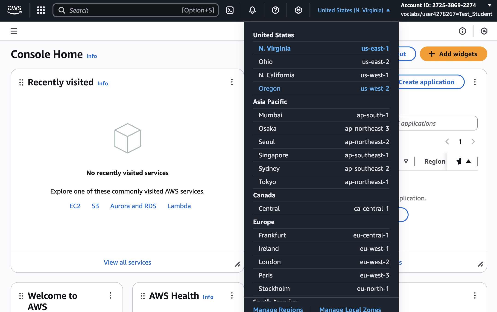
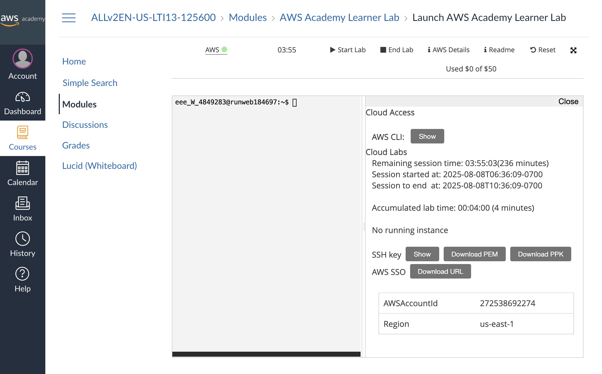

import { Aside } from '@astrojs/starlight/components';

In some labs, we will use AWS Academy. We have set up an AWS Academy Learner Lab, which gives you access to $50 in AWS credits.

## Getting Started

Once you receive your invite by email (sent to your OSU address), you will need to register and create a new account. Note: The AWS Canvas platform is different from OSU Canvas.

You can log in to AWS Academy here: https://www.awsacademy.com/

Click on "LMS" to access the platform. 

Navigate to the correct Learning Lab created for this course, then click on "Modules", then "Launch AWS Academy Learner Lab".

The first time you access the lab, you must agree to the Terms.

<Aside type="note" title="Browser Support and Requirements">
If the page does not display, try another browser and enable cross-site tracking or allow all cookies.

Check the [Browser Support and Requirements | Vocareum - Documentation](https://help.vocareum.com/en/articles/6229305-browser-support-and-requirements)
</Aside>
Here's the Learner Lab page:

Notice the **AWS 🔴** link in the top left corner: this means the lab is stopped.

To start the lab, click **▶️ Start Lab**. This may take a *few minutes* the first time you run it.

<Aside type="caution" title="Lab Not Starting">
If the lab does not start, try another browser with cross-site tracking enabled and all cookies allowed. You may also need to clear your cache/cookies/local storage and try again.

You might need to **↩️ Reset** your lab environment (this may also take a few minutes).
</Aside>
Once the lab has started, click the **AWS 🟢** link in the top left corner to open your AWS account.

You're all set!

<Aside type="caution" title="Ending the Lab">
At the end of the lab, click **⏹️ End Lab**. If you don't, your account will keep running and you may run out of credits.

**It is highly recommended to terminate AWS resources (especially EC2 and RDS) after finishing a lab or assignment.** Otherwise, every time you start a lab, these resources will restart and use up your credits.

Some labs will require you to keep resources running between sessions. In that case, make sure to end the lab at the end of each session to avoid unnecessary credit usage.
</Aside>

Credit usage updates daily, not in real time. If you reach $50, your account is automatically deactivated and you won't be able to complete assignments.

Your instruction team cannot control AWS Academy credits. Don't forget to end your lab at the end of each session.

If you need to reset your account, you can use the **↩️ Reset** option.

## Region Selection

AWS Academy Learner Labs support two regions: `us-east-1` and `us-west-2`. Choose the region that is closest to you to minimize latency. 

The `us-west-2` region has caused permission issues for some students in the past. If so, use `us-east-1`.

## EC2 Instance Types

Most assignments will recommend the right instance type and size, but you are free to experiment. Note that some instance are much more expensive than others. In particular, running instances through AWS RDS (Relational Database Service) can be costly. Don't forget to terminate RDS instances when you're done with them.

In addition to the type and size, you can also choose the architecture of your instance. Labs should work with either x86 or arm architecture.

If arm instances fail to start, delete the instance and create one using x86 architecture.

## Using the AWS CLI

You can find AWS CLI credentials in the **ℹ️ AWS Details** tab of your Learner Lab (once your lab has started).

Credentials refresh **every time you start the learner lab**.

## Using Windows

If you use Windows, connecting to your Linux instance via SSH is trickier (it's not built-in as on Unix-like systems). You have several options:

- Follow the guide here to SSH from Windows, and update permissions on your private key: [Troubleshoot connecting to your instance - Amazon EC2](https://docs.aws.amazon.com/AWSEC2/latest/UserGuide/TroubleshootingInstancesConnecting.html)
- Use a Linux VM for the lab. [We recommend WSL](/practicalities/windows-users/).

## Cannot Connect to Your EC2 Instance via SSH

Ensure your EC2 instance and security group are configured to allow SSH connections.

See the AWS EC2 Troubleshooting guide for details: [Troubleshoot connecting to your instance - Amazon EC2](https://docs.aws.amazon.com/AWSEC2/latest/UserGuide/TroubleshootingInstancesConnecting.html)